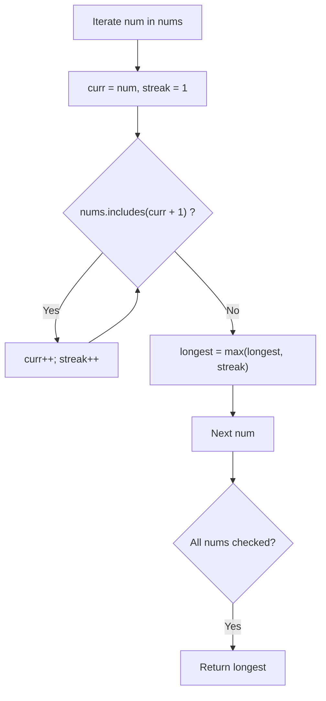
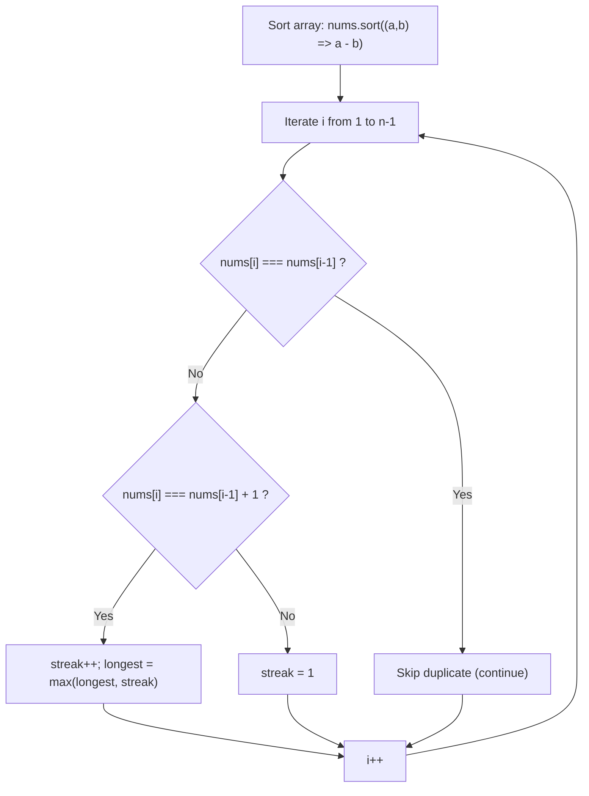
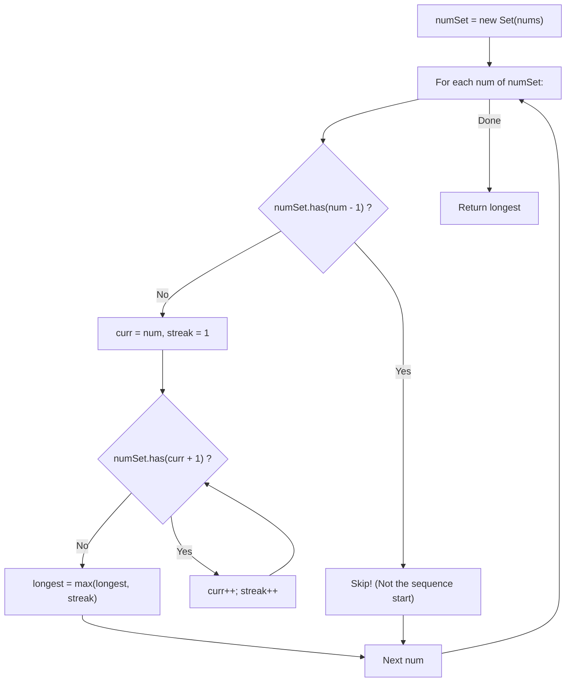

# 128. Longest Consecutive Sequence

- **LeetCode Link**: `https://leetcode.com/problems/longest-consecutive-sequence/`
- **Difficulty**: Medium
- **Pattern Category**: Hash Table / Sequence Building / Intelligent Boundary Pruning
- **Prerequisite Primer**: `00-foundations/01-js-interview-runtime-quirks.md`

---

## 1. Problem Overview & Edge Case Matrix

### Problem Statement
Given an unsorted array of integers `nums`, return the length of the **longest consecutive elements sequence**.

You must write an algorithm that runs in **$O(N)$ time**.

```
Example 1:
nums = [100, 4, 200, 1, 3, 2]
The longest consecutive elements sequence is [1, 2, 3, 4].
Its length is 4.

Example 2:
nums = [0, 3, 7, 2, 5, 8, 4, 6, 0, 1]
The longest consecutive sequence is [0, 1, 2, 3, 4, 5, 6, 7, 8].
Its length is 9.
```

### Upfront Edge Case Matrix

| Edge Case Scenario | Inputs | Expected Output | Pitfall / Failure Mode |
| :--- | :--- | :--- | :--- |
| Empty Array | `nums = []` | `0` | Returning `1` instead of `0` |
| Single Element | `nums = [42]` | `1` | Edge loop termination condition |
| Heavy Duplicates | `nums = [1, 2, 0, 1]` | `3` (for `[0, 1, 2]`) | Counting identical duplicate values as sequence extensions |
| Negative Numbers | `nums = [-3, -2, -1, 0, 1]` | `5` | Signed integer modulo or array indexing bugs |
| Disjoint Clusters | `nums = [100, 4, 200, 1, 3, 2]` | `4` | Prematurely stopping when a sequence breaks |

---

## 2. Level 1: Brute Force Approach (Iterative Lookahead with Linear Scans)

### Intuition & Visual Idea
For every number $x$ in the array, check if $x + 1$ exists in the array using linear search (`nums.includes()`). If it does, increment the streak and look for $x + 2$, continuing until the streak breaks. Track the global maximum streak found across all numbers.



### Pseudocode
```text
FUNCTION longestConsecutiveBruteForce(nums):
    IF nums.length == 0: RETURN 0
    longest = 0
    
    FOR EACH num IN nums:
        curr = num
        streak = 1
        
        WHILE nums.CONTAINS(curr + 1):
            curr = curr + 1
            streak = streak + 1
            
        longest = MAX(longest, streak)
        
    RETURN longest
```

### Step-by-Step Dry Run
`nums = [100, 4, 200, 1, 3, 2]`

| `num` | Successor Search | Sequence Formed | Streak | `longest` |
| :--- | :--- | :--- | :--- | :--- |
| 100 | Check 101 $\to$ No | `[100]` | 1 | 1 |
| 4 | Check 5 $\to$ No | `[4]` | 1 | 1 |
| 200 | Check 201 $\to$ No | `[200]` | 1 | 1 |
| 1 | Check 2 $\to$ Yes, 3 $\to$ Yes, 4 $\to$ Yes, 5 $\to$ No | `[1, 2, 3, 4]` | 4 | **4** |
| 3 | Check 4 $\to$ Yes, 5 $\to$ No | `[3, 4]` | 2 | 4 |
| 2 | Check 3 $\to$ Yes, 4 $\to$ Yes, 5 $\to$ No | `[2, 3, 4]` | 3 | 4 |
| End | - | - | - | **Return 4** |

### Modern JavaScript Implementation
```javascript
/**
 * Level 1: Brute Force with Repeated Includes Checks
 * Time Complexity:  O(N^3) in worst case (N numbers * N streak * N includes search)
 * Space Complexity: O(1)
 */
function longestConsecutiveBruteForce(nums) {
  if (nums.length === 0) return 0;

  let longest = 0;

  for (let i = 0; i < nums.length; i++) {
    let currentNum = nums[i];
    let currentStreak = 1;

    // Linearly scan the entire array for the next consecutive integer
    while (nums.includes(currentNum + 1)) {
      currentNum++;
      currentStreak++;
    }

    longest = Math.max(longest, currentStreak);
  }

  return longest;
}
```

### Complexity Breakdown
- **Time Complexity**: $O(N^3)$ — For each element, a sequence can grow up to $N$ steps, and each lookup scans all $N$ elements via `nums.includes()`.
- **Space Complexity**: $O(1)$ — Only scalar trackers.

#### 🎙️ How to Explain to Interviewer
> *"The brute force approach attempts to build a consecutive streak from each number by repeatedly invoking `nums.includes()`. Because searching an unsorted array takes $O(N)$ time, expanding streaks for all elements leads to cubic $O(N^3)$ time in worst-case contiguous sequences."*

---

## 3. Level 2: Optimized Approach (Sorting with Deduplication)

### Intuition & Visual Bottleneck Elimination
Sorting groups consecutive numbers together:
`[100, 4, 200, 1, 3, 2] -> [1, 2, 3, 4, 100, 200]`
We iterate through the sorted array:
- If `nums[i] === nums[i - 1]`: Duplicate number! Ignore it and continue.
- If `nums[i] === nums[i - 1] + 1`: Sequence continues! Increment current streak.
- Otherwise: Sequence broken! Reset current streak to 1.



### Pseudocode
```text
FUNCTION longestConsecutiveSorted(nums):
    IF nums.length == 0: RETURN 0
    SORT(nums)
    
    longest = 1
    currStreak = 1
    
    FOR i FROM 1 TO nums.length - 1:
        IF nums[i] == nums[i - 1]:
            CONTINUE
        ELSE IF nums[i] == nums[i - 1] + 1:
            currStreak++
        ELSE:
            longest = MAX(longest, currStreak)
            currStreak = 1
            
    RETURN MAX(longest, currStreak)
```

### Step-by-Step Dry Run
`nums = [0, 1, 1, 2]` (already sorted)

| `i` | `nums[i]` | `nums[i-1]` | Condition | `currStreak` | `longest` |
| :--- | :--- | :--- | :--- | :--- | :--- |
| Start | - | - | - | 1 | 1 |
| 1 | 1 | 0 | $1 == 0 + 1$ | 2 | 2 |
| 2 | 1 | 1 | Duplicate ($1 == 1$) | 2 (unchanged) | 2 |
| 3 | 2 | 1 | $2 == 1 + 1$ | 3 | 3 |
| Result | Loop ends | - | - | - | **Return 3** |

### Modern JavaScript Implementation
```javascript
/**
 * Level 2: Sorting with Duplicate Guard
 * Time Complexity:  O(N log N)
 * Space Complexity: O(1) if in-place sort allowed, else O(N)
 */
function longestConsecutiveSorted(nums) {
  if (nums.length === 0) return 0;

  // Numerical ascending sort (NOT default lexicographical sort!)
  nums.sort((a, b) => a - b);

  let longest = 1;
  let currentStreak = 1;

  for (let i = 1; i < nums.length; i++) {
    // Skip duplicates without resetting streak
    if (nums[i] === nums[i - 1]) {
      continue;
    }

    if (nums[i] === nums[i - 1] + 1) {
      currentStreak++;
    } else {
      longest = Math.max(longest, currentStreak);
      currentStreak = 1;
    }
  }

  return Math.max(longest, currentStreak);
}
```

### Complexity Breakdown
- **Time Complexity**: $O(N \log N)$ — Dominated by sorting array of length $N$.
- **Space Complexity**: $O(1)$ auxiliary space if in-place array mutation is permitted.

#### 🎙️ How to Explain to Interviewer
> *"Sorting places consecutive integers into adjacent slots, allowing us to find the longest streak in a single linear pass while skipping duplicates. However, the problem explicitly mandates an $O(N)$ time complexity, which sorting violates."*

---

## 4. Level 3: Most Optimal / Canonical Approach (Hash Set with Sequence-Start Pruning)

### Intuition & Mathematical Proof
To achieve strictly $O(N)$ time, we place all numbers into a `Set<number>`.
Now lookups take $O(1)$ average time.

**The Sequence-Start Pruning Invariant**:
If we check every number and expand its sequence, we would still perform redundant checks (e.g. for sequence `1, 2, 3, 4`, checking from 1, then checking from 2, then 3).
To guarantee linear $O(N)$ time, we enforce a strict rule:
$$\textbf{Only start building a sequence from } x \textbf{ if } (x - 1) \textbf{ is NOT in the set!}$$

- If $(x - 1)$ is in the set, $x$ cannot be the beginning of a sequence. It is part of a longer sequence that will be (or has been) explored starting from an earlier number. We immediately skip it!
- If $(x - 1)$ is **not** in the set, $x$ is guaranteed to be the **absolute start of a sequence**. We then enter a `while` loop:
  `while (set.has(current + 1)) { current++; streak++; }`

**Amortized Time Complexity Proof**:
Every integer in the set is traversed:
1. Exactly once in the outer `for...of` loop to test `!set.has(num - 1)`.
2. At most once inside the inner `while` loop across the entire life of the algorithm (because each sequence has exactly one unique start element).
Total operations: $\le 2N \implies \mathbf{O(N)}$ linear time!

```
Array: [ 100 ,  4 ,  200 ,  1 ,  3 ,  2 ]
Set:   { 100, 4, 200, 1, 3, 2 }

Examine 100: is 99 in Set?  NO  -> START! Check 101 (no) -> streak = 1
Examine 4:   is 3 in Set?   YES -> SKIP! (not sequence start)
Examine 200: is 199 in Set? NO  -> START! Check 201 (no) -> streak = 1
Examine 1:   is 0 in Set?   NO  -> START! Check 2, 3, 4  -> streak = 4!
Examine 3:   is 2 in Set?   YES -> SKIP!
Examine 2:   is 1 in Set?   YES -> SKIP!
Max streak = 4
```



### Pseudocode
```text
FUNCTION longestConsecutive(nums):
    IF nums.length == 0: RETURN 0
    numSet = NEW SET(nums)
    longest = 0
    
    FOR EACH num IN numSet:
        // Only start expanding if num is the beginning of a sequence
        IF NOT numSet.HAS(num - 1):
            curr = num
            streak = 1
            
            WHILE numSet.HAS(curr + 1):
                curr++
                streak++
                
            longest = MAX(longest, streak)
            
    RETURN longest
```

### Step-by-Step Dry Run
`nums = [100, 4, 200, 1, 3, 2]`

| `num` | `has(num - 1)`? | Sequence Start? | Inner Expansion | Streak | `longest` |
| :--- | :--- | :--- | :--- | :--- | :--- |
| 100 | `has(99)` = false | **Yes** | 100 (101 missing) | 1 | 1 |
| 4 | `has(3)` = true | No | Skipped | - | 1 |
| 200 | `has(199)` = false | **Yes** | 200 (201 missing) | 1 | 1 |
| 1 | `has(0)` = false | **Yes** | $1 \to 2 \to 3 \to 4$ | 4 | **4** |
| 3 | `has(2)` = true | No | Skipped | - | 4 |
| 2 | `has(1)` = true | No | Skipped | - | 4 |
| Result | Completed | - | - | - | **Return 4** |

### Modern JavaScript Implementation
```javascript
/**
 * Level 3: Canonical Hash Set with Sequence Start Pruning
 * Time Complexity:  O(N) Amortized
 * Space Complexity: O(N)
 */
function longestConsecutive(nums) {
  if (nums.length === 0) return 0;

  // Deduplicate and provide O(1) average lookup
  const numSet = new Set(nums);
  let longestStreak = 0;

  // Iterate over numSet to avoid iterating duplicate values
  for (const num of numSet) {
    // Only attempt sequence expansion if 'num' is the sequence origin
    if (!numSet.has(num - 1)) {
      let currentNum = num;
      let currentStreak = 1;

      // Extend sequence forward
      while (numSet.has(currentNum + 1)) {
        currentNum++;
        currentStreak++;
      }

      if (currentStreak > longestStreak) {
        longestStreak = currentStreak;
      }
    }
  }

  return longestStreak;
}
```

### Complexity Breakdown
- **Time Complexity**: $O(N)$ — Initializing `Set(nums)` takes $O(N)$. In the `for...of` loop, each number is visited once as an outer candidate and at most once inside the `while` loop because only sequence roots initiate expansions.
- **Space Complexity**: $O(N)$ — The `Set` stores $N$ elements.

#### 🎙️ How to Explain to Interviewer
> *"We convert the input array into a Hash Set to provide $O(1)$ lookups. The breakthrough that guarantees $O(N)$ time instead of $O(N^2)$ is intelligent boundary identification: we only start counting a streak if `num - 1` is NOT present in the set. If `num - 1` exists, this number cannot be the start of the sequence and is immediately skipped. Consequently, every number is visited at most twice across the entire algorithm, achieving true $O(N)$ linear time."*

---

## 5. JavaScript-Specific Gotchas & V8 Optimizations
- **Iterating `numSet` vs `nums`**: Iterating `for (const num of numSet)` instead of `for (const num of nums)` skips duplicate entries entirely before reaching the `has(num - 1)` check, reducing iterations when arrays contain heavy duplicates.
- **V8 Integer SMI Optimization**: When numbers fit within 31-bit signed integers (SMIs in V8), `Set` lookups execute without object pointer dereferences, resulting in ultra-fast raw integer hashing.

---

## 6. Real-World MAANG Interview Follow-Ups & Extensions

### Follow-Up 1: Disjoint Set Union (Union-Find) for Streaming Integers
- **Scenario**: Integers arrive dynamically in a real-time data stream. How do you query the longest consecutive sequence at any moment?
- **Solution Strategy**: Use a Disjoint Set Union (DSU) data structure with path compression and rank/size tracking. When number $x$ arrives:
  - If already present, ignore.
  - If $x - 1$ exists, union $(x, x - 1)$.
  - If $x + 1$ exists, union $(x, x + 1)$.
  - Track `maxComponentSize` during each union operation in $O(\alpha(N)) \approx O(1)$ time.
- **JS Code**:
```javascript
class DSU {
  constructor() {
    this.parent = new Map();
    this.size = new Map();
    this.maxSize = 0;
  }

  add(x) {
    if (this.parent.has(x)) return;
    this.parent.set(x, x);
    this.size.set(x, 1);
    this.maxSize = Math.max(this.maxSize, 1);

    if (this.parent.has(x - 1)) this.union(x, x - 1);
    if (this.parent.has(x + 1)) this.union(x, x + 1);
  }

  find(i) {
    let root = i;
    while (root !== this.parent.get(root)) {
      root = this.parent.get(root);
    }
    // Path compression
    let curr = i;
    while (curr !== root) {
      const next = this.parent.get(curr);
      this.parent.set(curr, root);
      curr = next;
    }
    return root;
  }

  union(i, j) {
    const rootI = this.find(i);
    const rootJ = this.find(j);
    if (rootI !== rootJ) {
      const sizeI = this.size.get(rootI);
      const sizeJ = this.size.get(rootJ);
      this.parent.set(rootI, rootJ);
      const newSize = sizeI + sizeJ;
      this.size.set(rootJ, newSize);
      this.maxSize = Math.max(this.maxSize, newSize);
    }
  }
}
```

### Follow-Up 2: Reconstruct and Return the Actual Sequence Array
- **Scenario**: Instead of just returning the length of the longest consecutive sequence, return the actual elements of the sequence in sorted order (e.g., `[1, 2, 3, 4]`).
- **Solution Strategy**: Track the `bestStart` alongside `longestStreak`. When a new record is found, update `bestStart = num`. After the scan, generate the array `Array.from({ length: longestStreak }, (_, i) => bestStart + i)`.
- **JS Code**:
```javascript
function getLongestConsecutiveElements(nums) {
  if (nums.length === 0) return [];
  const numSet = new Set(nums);
  let longestStreak = 0;
  let bestStart = 0;

  for (const num of numSet) {
    if (!numSet.has(num - 1)) {
      let currentNum = num;
      let currentStreak = 1;

      while (numSet.has(currentNum + 1)) {
        currentNum++;
        currentStreak++;
      }

      if (currentStreak > longestStreak) {
        longestStreak = currentStreak;
        bestStart = num;
      }
    }
  }

  const result = new Array(longestStreak);
  for (let i = 0; i < longestStreak; i++) {
    result[i] = bestStart + i;
  }
  return result;
}
```
