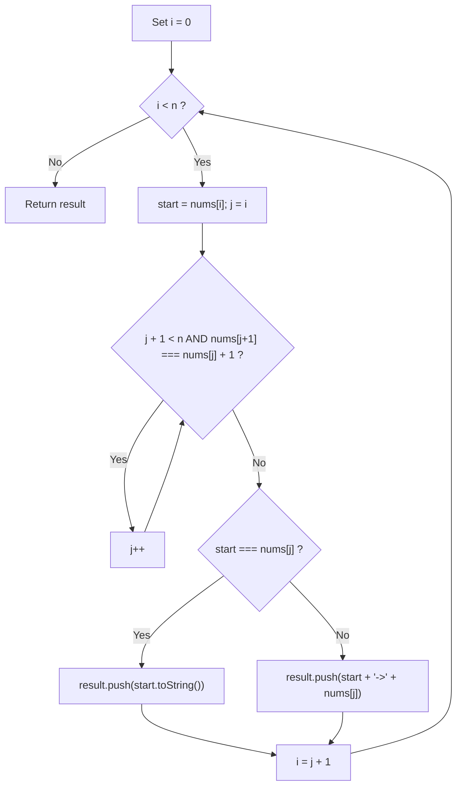
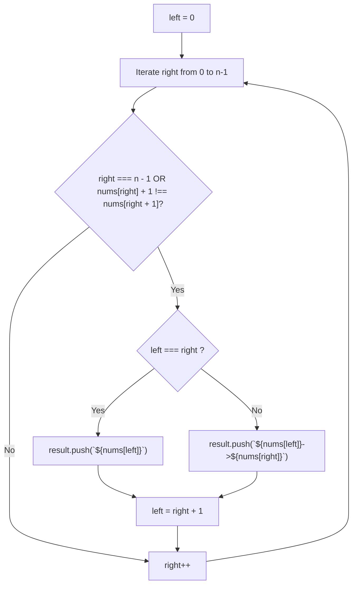
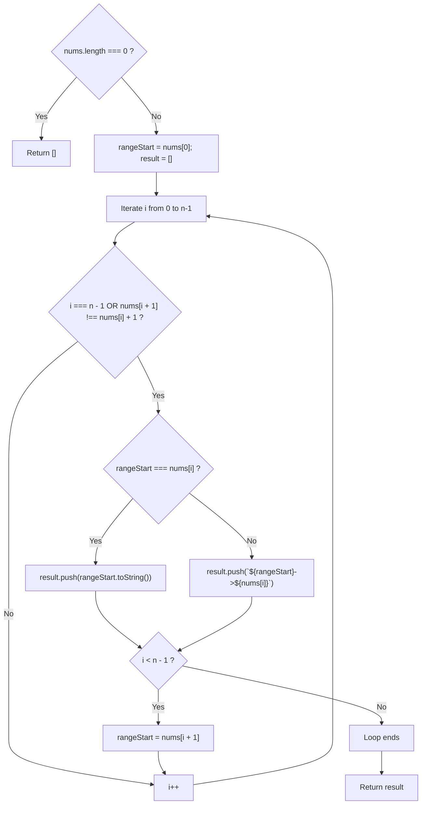

# 228. Summary Ranges

- **LeetCode Link**: `https://leetcode.com/problems/summary-ranges/`
- **Difficulty**: Easy
- **Pattern Category**: Intervals / Two Pointers / Linear State Machine
- **Prerequisite Primer**: `00-foundations/01-js-interview-runtime-quirks.md`

---

## 1. Problem Overview & Edge Case Matrix

### Problem Statement
You are given a **sorted unique** integer array `nums`.

A **range** `[a, b]` is the set of all integers from `a` to `b`, inclusive.

Return the smallest sorted list of ranges that **cover all the numbers in the array exactly**. That is, each element of `nums` is covered by exactly one of the ranges, and there is no integer `x` such that `x` is in one of the ranges but not in `nums`.

Each range `[a, b]` in the list should be formatted as:
- `"a->b"` if $a \neq b$
- `"a"` if $a == b$

```
Example 1:
nums = [0, 1, 2, 4, 5, 7]
Output: ["0->2", "4->5", "7"]
Explanation:
Ranges are:
[0, 2] --> "0->2"
[4, 5] --> "4->5"
[7, 7] --> "7"

Example 2:
nums = [0, 2, 3, 4, 6, 8, 9]
Output: ["0", "2->4", "6", "8->9"]
```

### Upfront Edge Case Matrix

| Edge Case Scenario | Inputs | Expected Output | Pitfall / Failure Mode |
| :--- | :--- | :--- | :--- |
| Empty Array | `nums = []` | `[]` | Accessing `nums[0]` out-of-bounds |
| Single Element | `nums = [42]` | `["42"]` | Missing terminal range flush |
| All Elements Consecutive | `nums = [1, 2, 3, 4]` | `["1->4"]` | Splitting into individual numbers |
| Completely Disjoint Numbers | `nums = [1, 3, 5, 7]` | `["1", "3", "5", "7"]` | Adding incorrect `"->"` transitions |
| 32-bit Integer Boundaries | `nums = [-2147483648, 2147483647]` | `["-2147483648", "2147483647"]` | Integer subtraction overflow if using `nums[i+1] - nums[i]` |

---

## 2. Level 1: Brute Force Approach (Nested Lookahead Traversal)

### Intuition & Visual Idea
For each index $i$, record `start = nums[i]`. Use an inner pointer $j$ that advances as long as the next element equals the current element plus one (`nums[j + 1] === nums[j] + 1`). When the streak breaks, format the range, push it to the results, and advance $i$ to $j$.



### Pseudocode
```text
FUNCTION summaryRangesBruteForce(nums):
    result = []
    i = 0
    n = nums.length
    
    WHILE i < n:
        start = nums[i]
        j = i
        
        WHILE j + 1 < n AND nums[j + 1] == nums[j] + 1:
            j = j + 1
            
        IF start == nums[j]:
            result.append(STRING(start))
        ELSE:
            result.append(STRING(start) + "->" + STRING(nums[j]))
            
        i = j + 1
        
    RETURN result
```

### Step-by-Step Dry Run
`nums = [0, 1, 2, 4, 5, 7]`

| `i` | `start = nums[i]` | `j` advances to | Streak broken at | Pushed String | Next `i` |
| :--- | :--- | :--- | :--- | :--- | :--- |
| 0 | 0 | 2 (`nums[2]=2`) | 4 $\neq 2 + 1$ | `"0->2"` | 3 |
| 3 | 4 | 4 (`nums[4]=5`) | 7 $\neq 5 + 1$ | `"4->5"` | 5 |
| 5 | 7 | 5 (`nums[5]=7`) | End of array | `"7"` | 6 (Exit) |

### Modern JavaScript Implementation
```javascript
/**
 * Level 1: Nested Lookahead Traversal
 * Time Complexity:  O(N)
 * Space Complexity: O(1) Auxiliary Space
 */
function summaryRangesBruteForce(nums) {
  const result = [];
  const n = nums.length;
  let i = 0;

  while (i < n) {
    const start = nums[i];
    let j = i;

    // Scan forward while numbers are strictly consecutive
    while (j + 1 < n && nums[j + 1] === nums[j] + 1) {
      j++;
    }

    if (start === nums[j]) {
      result.push(String(start));
    } else {
      result.push(`${start}->${nums[j]}`);
    }

    // Skip all visited consecutive elements
    i = j + 1;
  }

  return result;
}
```

### Complexity Breakdown
- **Time Complexity**: $O(N)$ — Although there are nested loops, pointer $j$ strictly advances and $i$ jumps to $j + 1$. Each element is visited at most twice.
- **Space Complexity**: $O(1)$ auxiliary space (ignoring the output list).

#### 🎙️ How to Explain to Interviewer
> *"We maintain a `start` variable at the beginning of each contiguous run and advance a secondary pointer $j$ while `nums[j + 1] === nums[j] + 1`. Once continuity breaks, we format the range and advance the outer pointer to $j + 1$. Because each element is scanned at most twice, this runs in linear $O(N)$ time."*

---

## 3. Level 2: Optimized Approach (Explicit Two Pointers Framework)

### Intuition & Visual Bottleneck Elimination
We can structure the solution using a standard **Two Pointers** interval expansion pattern:
- `left` points to the start of the current range.
- `right` traverses the array.
Whenever `nums[right] + 1 !== nums[right + 1]`, the interval bounded by `[nums[left], nums[right]]` is complete. We record the interval, and move `left = right + 1`.



### Pseudocode
```text
FUNCTION summaryRangesTwoPointers(nums):
    result = []
    n = nums.length
    left = 0
    
    FOR right FROM 0 TO n - 1:
        // Boundary condition: last element or discontinuity ahead
        IF right == n - 1 OR nums[right] + 1 != nums[right + 1]:
            IF left == right:
                result.append(STRING(nums[left]))
            ELSE:
                result.append(STRING(nums[left]) + "->" + STRING(nums[right]))
            left = right + 1
            
    RETURN result
```

### Step-by-Step Dry Run
`nums = [0, 2, 3]`

| `right` | `nums[right]` | `left` | Discontinuity Condition? | Result Array After Action | `left` After Action |
| :--- | :--- | :--- | :--- | :--- | :--- |
| 0 | 0 | 0 | $0 + 1 \neq 2$ (Discontinuity) | `["0"]` | 1 |
| 1 | 2 | 1 | $2 + 1 == 3$ (Continuous) | `["0"]` | 1 |
| 2 | 3 | 1 | `right == n - 1` (End of array) | `["0", "2->3"]` | 3 |

### Modern JavaScript Implementation
```javascript
/**
 * Level 2: Two Pointers Sliding Boundary
 * Time Complexity:  O(N)
 * Space Complexity: O(1) Auxiliary Space
 */
function summaryRangesTwoPointers(nums) {
  const result = [];
  const n = nums.length;
  let left = 0;

  for (let right = 0; right < n; right++) {
    // Check if right is the end of the current contiguous block
    if (right === n - 1 || nums[right] + 1 !== nums[right + 1]) {
      if (left === right) {
        result.push(`${nums[left]}`);
      } else {
        result.push(`${nums[left]}->${nums[right]}`);
      }
      left = right + 1;
    }
  }

  return result;
}
```

### Complexity Breakdown
- **Time Complexity**: $O(N)$ — Single forward pass from $0$ to $n - 1$.
- **Space Complexity**: $O(1)$ auxiliary space.

#### 🎙️ How to Explain to Interviewer
> *"By formalizing the problem with two pointers, `right` scans forward while `left` anchors the interval head. An interval boundary occurs if and only if `right === n - 1` or the continuity check `nums[right] + 1 !== nums[right + 1]` triggers. This eliminates nested loop pointer tracking and results in clean, idiomatic code."*

---

## 4. Level 3: Most Optimal / Canonical Approach (Single-Pass State Machine with Zero Allocation Tracking)

### Intuition & Mathematical Proof
We can view range generation as a **finite state machine** that consumes integers one by one:
- State variable: `rangeStart` (the numeric starting value of the active sequence).
- On each index $i$:
  - If $i === n - 1$ or $nums[i + 1] \neq nums[i] + 1$, the active range terminates at $nums[i]$.
  - Emit the formatted string into the output array.
  - If not at the end of the array, transition to the next state: `rangeStart = nums[i + 1]`.

**Arithmetic Safety Guard**:
Never write `nums[i + 1] - nums[i] !== 1`!
If `nums[i + 1] = 2147483647` and `nums[i] = -2147483648`, the subtraction produces $4294967295$. While JavaScript numbers are 64-bit double precision floats (safe up to $2^{53} - 1$), in low-level languages or when typed arrays are involved, integer subtraction overflows. Always write `nums[i + 1] !== nums[i] + 1`.

```
nums:       [  0  ,  1  ,  2  ,  4  ,  5  ,  7  ]
i:             0     1     2     3     4     5
rangeStart:    0     0     0     4     4     7
Action:                    ^                 ^
                     Flush "0->2"        Flush "7"
```



### Pseudocode
```text
FUNCTION summaryRanges(nums):
    IF nums.length == 0: RETURN []
    result = []
    rangeStart = nums[0]
    
    FOR i FROM 0 TO nums.length - 1:
        IF i == nums.length - 1 OR nums[i + 1] != nums[i] + 1:
            IF rangeStart == nums[i]:
                result.append(STRING(rangeStart))
            ELSE:
                result.append(rangeStart + "->" + nums[i])
            IF i + 1 < nums.length:
                rangeStart = nums[i + 1]
                
    RETURN result
```

### Step-by-Step Dry Run
`nums = [-1, 0, 1, 3]`

| `i` | `nums[i]` | `rangeStart` | Terminal Condition Met? | String Produced | Next `rangeStart` |
| :--- | :--- | :--- | :--- | :--- | :--- |
| 0 | -1 | -1 | No ($0 == -1 + 1$) | - | -1 |
| 1 | 0 | -1 | No ($1 == 0 + 1$) | - | -1 |
| 2 | 1 | -1 | Yes ($3 \neq 1 + 1$) | `"-1->1"` | 3 |
| 3 | 3 | 3 | Yes ($i == n - 1$) | `"3"` | - |
| End | - | - | - | **`["-1->1", "3"]`** | - |

### Modern JavaScript Implementation
```javascript
/**
 * Level 3: Canonical State Machine with Safe Addition Invariant
 * Time Complexity:  O(N)
 * Space Complexity: O(1) Auxiliary Space
 */
function summaryRanges(nums) {
  const n = nums.length;
  if (n === 0) return [];

  const result = [];
  let rangeStart = nums[0];

  for (let i = 0; i < n; i++) {
    // Trigger range flush if last element or next element is non-consecutive
    if (i === n - 1 || nums[i + 1] !== nums[i] + 1) {
      if (rangeStart === nums[i]) {
        result.push(String(rangeStart));
      } else {
        result.push(`${rangeStart}->${nums[i]}`);
      }

      // Transition to next range start
      if (i < n - 1) {
        rangeStart = nums[i + 1];
      }
    }
  }

  return result;
}
```

### Complexity Breakdown
- **Time Complexity**: $O(N)$ — Exactly one linear scan of length $N$.
- **Space Complexity**: $O(1)$ auxiliary space — Only two scalar trackers (`rangeStart`, `i`).

#### 🎙️ How to Explain to Interviewer
> *"We maintain `rangeStart` as state. As we iterate through `nums`, we test whether the current element terminates the range (either because it is the final array index or because `nums[i + 1] !== nums[i] + 1`). When the boundary is hit, we push the formatted string and set `rangeStart = nums[i + 1]`. Using addition instead of subtraction avoids numeric overflow edge cases."*

---

## 5. JavaScript-Specific Gotchas & V8 Optimizations
- **String Template vs String Concatenation**: In V8, `` `${a}->${b}` `` is compiled directly into a specialized string builder runtime call, outperforming multiple `+` string concatenations.
- **Handling Single Numbers**: `String(rangeStart)` or `` `${rangeStart}` `` avoids boxing numeric values into Number wrapper objects.

---

## 6. Real-World MAANG Interview Follow-Ups & Extensions

### Follow-Up 1: Missing Ranges (LeetCode 163)
- **Scenario**: Given a sorted unique integer array `nums` and an inclusive interval `[lower, upper]`, return the missing ranges that cover all missing numbers.
- **Solution Strategy**: Compare against previous element starting with `lower - 1`. If `curr - prev >= 2`, emit missing range between `prev + 1` and `curr - 1`.
- **JS Code**:
```javascript
function findMissingRanges(nums, lower, upper) {
  const result = [];
  let prev = lower - 1;

  for (let i = 0; i <= nums.length; i++) {
    const curr = i < nums.length ? nums[i] : upper + 1;

    if (curr - prev >= 2) {
      const start = prev + 1;
      const end = curr - 1;
      result.push(start === end ? `${start}` : `${start}->${end}`);
    }

    prev = curr;
  }

  return result;
}
```

### Follow-Up 2: Dynamic Data Stream Range Aggregator (LeetCode 352)
- **Scenario**: Integers arrive dynamically from a stream. Maintain and query the current list of disjoint summary ranges efficiently.
- **Solution Strategy**: Maintain a Map or Balanced BST of intervals. When $x$ arrives, check if it merges with interval ending at $x - 1$ and/or interval starting at $x + 1$.
- **JS Code**:
```javascript
class SummaryRangesStream {
  constructor() {
    this.nums = new Set();
  }

  addNum(value) {
    this.nums.add(value);
  }

  getIntervals() {
    const sorted = Array.from(this.nums).sort((a, b) => a - b);
    const intervals = [];
    if (sorted.length === 0) return intervals;

    let start = sorted[0];
    let end = sorted[0];

    for (let i = 1; i < sorted.length; i++) {
      if (sorted[i] === end + 1) {
        end = sorted[i];
      } else {
        intervals.push([start, end]);
        start = end = sorted[i];
      }
    }
    intervals.push([start, end]);
    return intervals;
  }
}
```
