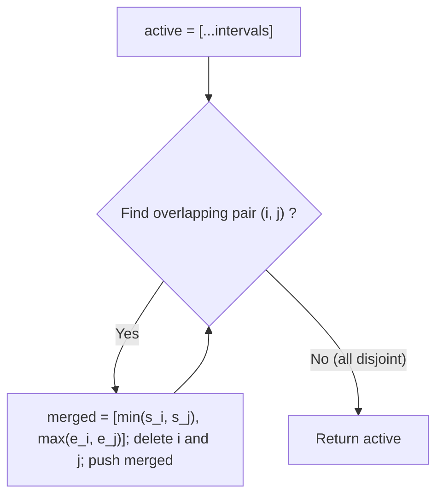
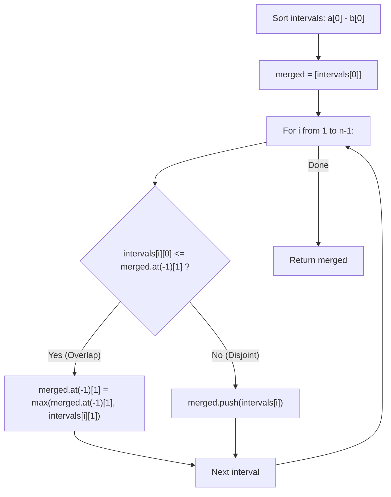
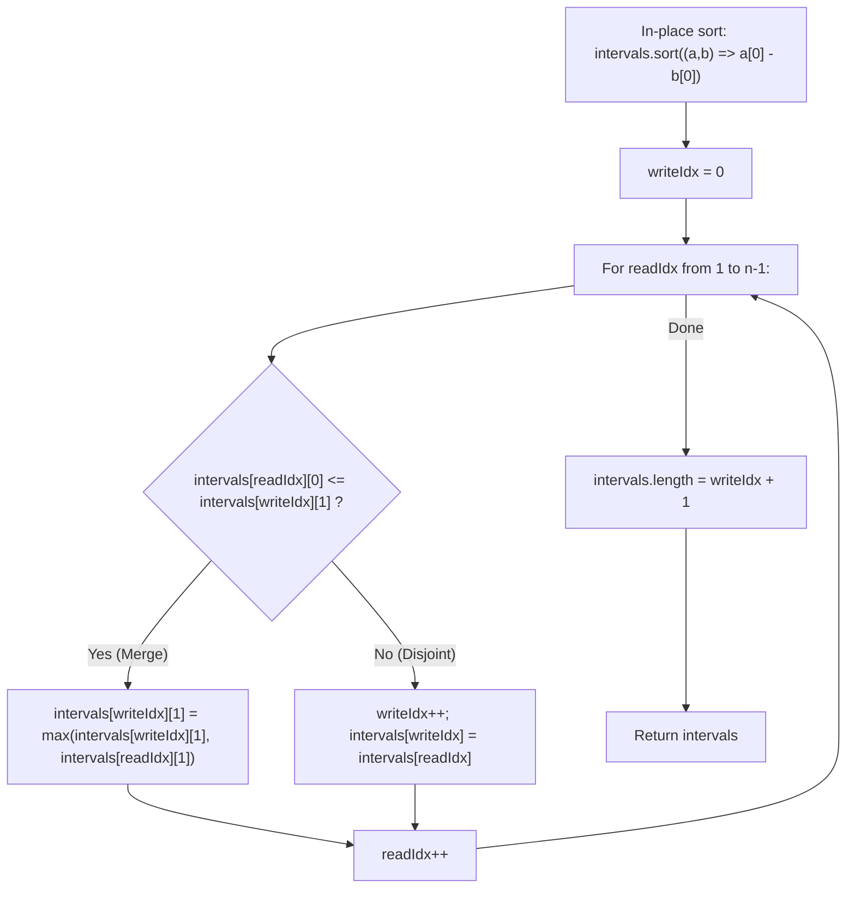

# 56. Merge Intervals

- **LeetCode Link**: `https://leetcode.com/problems/merge-intervals/`
- **Difficulty**: Medium
- **Pattern Category**: Intervals / Sorting / Greedy Overlap Reduction
- **Prerequisite Primer**: `00-foundations/01-js-interview-runtime-quirks.md`

---

## 1. Problem Overview & Edge Case Matrix

### Problem Statement
Given an array of `intervals` where `intervals[i] = [start_i, end_i]`, merge all overlapping intervals, and return an array of the **non-overlapping intervals** that cover all the intervals in the input.

```
Example 1:
Input: intervals = [[1, 3], [2, 6], [8, 10], [15, 18]]
Output: [[1, 6], [8, 10], [15, 18]]
Explanation: Since intervals [1, 3] and [2, 6] overlap, merge them into [1, 6].

Example 2:
Input: intervals = [[1, 4], [4, 5]]
Output: [[1, 5]]
Explanation: Intervals [1, 4] and [4, 5] are considered overlapping at point 4.
```

### Overlap Condition
For two intervals $A = [s_A, e_A]$ and $B = [s_B, e_B]$ sorted such that $s_A \le s_B$:
$$\text{Overlap occurs if and only if } s_B \le e_A$$
When merged, the combined interval becomes:
$$\left[ s_A, \max(e_A, e_B) \right]$$

### Upfront Edge Case Matrix

| Edge Case Scenario | Inputs | Expected Output | Pitfall / Failure Mode |
| :--- | :--- | :--- | :--- |
| Empty Input | `intervals = []` | `[]` | Accessing `intervals[0]` |
| Single Interval | `intervals = [[1, 4]]` | `[[1, 4]]` | Loop indexing out-of-bounds |
| Fully Contained Interval | `intervals = [[1, 5], [2, 3]]` | `[[1, 5]]` | Truncating end to `3` instead of $\max(5, 3)$ |
| Touching Endpoints | `intervals = [[1, 2], [2, 3]]` | `[[1, 3]]` | Strict inequality check (`<` instead of `<=`) |
| Unsorted Reverse Input | `intervals = [[5, 6], [1, 3], [2, 4]]` | `[[1, 4], [5, 6]]` | Forgetting upfront sorting step |

---

## 2. Level 1: Brute Force Approach (Iterative Pairwise Consolidation)

### Intuition & Visual Idea
Until no two intervals overlap, repeatedly scan the array for any pair of intervals $(i, j)$ that overlap. When an overlapping pair is found, replace the two with their union $[\min(s_i, s_j), \max(e_i, e_j)]$ and restart the search.



### Pseudocode
```text
FUNCTION mergeBruteForce(intervals):
    IF intervals.length <= 1: RETURN intervals
    active = COPY(intervals)
    changed = true
    
    WHILE changed:
        changed = false
        FOR i FROM 0 TO active.length - 1:
            FOR j FROM i + 1 TO active.length - 1:
                IF OVERLAPS(active[i], active[j]):
                    merged = [MIN(active[i][0], active[j][0]), MAX(active[i][1], active[j][1])]
                    active.REMOVE(j)
                    active.REMOVE(i)
                    active.APPEND(merged)
                    changed = true
                    BREAK
            IF changed: BREAK
            
    RETURN active
```

### Step-by-Step Dry Run
`intervals = [[2, 6], [1, 3], [8, 10]]`

| Pass | Pair Checked | Overlap? | Action | Active List |
| :--- | :--- | :--- | :--- | :--- |
| 1 | `[2, 6]` and `[1, 3]` | Yes ($1 \le 6$ and $2 \le 3$) | Merge $\to [1, 6]$ | `[[8, 10], [1, 6]]` |
| 2 | `[8, 10]` and `[1, 6]` | No | No change | `[[8, 10], [1, 6]]` |
| End | No overlapping pairs | - | Complete | `[[8, 10], [1, 6]]` |

### Modern JavaScript Implementation
```javascript
/**
 * Level 1: Iterative Pairwise Consolidation
 * Time Complexity:  O(N^3) in worst case (N reductions * N^2 pair scans)
 * Space Complexity: O(N) auxiliary space
 */
function mergeBruteForce(intervals) {
  if (intervals.length <= 1) return intervals;

  const list = intervals.map(int => [...int]);
  let changed = true;

  while (changed) {
    changed = false;
    for (let i = 0; i < list.length; i++) {
      for (let j = i + 1; j < list.length; j++) {
        const [s1, e1] = list[i];
        const [s2, e2] = list[j];

        // Overlap condition for arbitrary unsorted intervals
        if (Math.max(s1, s2) <= Math.min(e1, e2)) {
          const merged = [Math.min(s1, s2), Math.max(e1, e2)];
          list.splice(j, 1);
          list.splice(i, 1);
          list.push(merged);
          changed = true;
          break;
        }
      }
      if (changed) break;
    }
  }

  return list;
}
```

### Complexity Breakdown
- **Time Complexity**: $O(N^3)$ — In the worst case, $N$ merges occur, each requiring an $O(N^2)$ search followed by $O(N)$ `splice()` operations.
- **Space Complexity**: $O(N)$ — Storing working array copy.

#### 🎙️ How to Explain to Interviewer
> *"The naive approach models intervals without sorting by repeatedly hunting for overlapping pairs, replacing them with their unified interval until no overlaps remain. While correct, repeated pairwise array mutations lead to cubic $O(N^3)$ runtime."*

---

## 3. Level 2: Optimized Approach (Sorting by Start Time + Auxiliary Merged Array)

### Intuition & Visual Bottleneck Elimination
The fundamental bottleneck in Level 1 is the lack of ordering: an interval could overlap with any arbitrary element.
**Solution**: Sort all intervals ascending by their start time:
`intervals.sort((a, b) => a[0] - b[0])`

Once sorted, any interval can **only overlap with the immediately preceding merged interval**!
1. Initialize `merged = [intervals[0]]`.
2. For each subsequent interval `curr`:
   - If `curr[0] <= merged[merged.length - 1][1]`: Overlap! Extend the last merged interval:
     `merged[merged.length - 1][1] = Math.max(merged[merged.length - 1][1], curr[1])`.
   - Otherwise: No overlap! Push `curr` as a new disjoint interval into `merged`.



### Pseudocode
```text
FUNCTION mergeOptimized(intervals):
    IF intervals.length <= 1: RETURN intervals
    SORT intervals ASCENDING BY start_time
    
    merged = [intervals[0]]
    
    FOR i FROM 1 TO intervals.length - 1:
        curr = intervals[i]
        last = merged[merged.length - 1]
        
        IF curr[0] <= last[1]:
            last[1] = MAX(last[1], curr[1])
        ELSE:
            merged.APPEND(curr)
            
    RETURN merged
```

### Step-by-Step Dry Run
`intervals = [[1, 3], [2, 6], [8, 10], [15, 18]]`

| `i` | Current `[s, e]` | Last Merged `[ms, me]` | Overlap? ($s \le me$) | Action | `merged` After Step |
| :--- | :--- | :--- | :--- | :--- | :--- |
| Init | - | - | - | Initialize with `intervals[0]` | `[[1, 3]]` |
| 1 | `[2, 6]` | `[1, 3]` | $2 \le 3$ (Yes) | Update `me = max(3, 6) = 6` | `[[1, 6]]` |
| 2 | `[8, 10]` | `[1, 6]` | $8 \le 6$ (No) | Push `[8, 10]` | `[[1, 6], [8, 10]]` |
| 3 | `[15, 18]` | `[8, 10]` | $15 \le 10$ (No) | Push `[15, 18]` | `[[1, 6], [8, 10], [15, 18]]` |

### Modern JavaScript Implementation
```javascript
/**
 * Level 2: Sorting by Start Time + Auxiliary Merged List
 * Time Complexity:  O(N log N)
 * Space Complexity: O(N)
 */
function mergeOptimized(intervals) {
  if (intervals.length <= 1) return intervals;

  // Sort ascending by start coordinate
  intervals.sort((a, b) => a[0] - b[0]);

  const merged = [intervals[0]];

  for (let i = 1; i < intervals.length; i++) {
    const current = intervals[i];
    const lastMerged = merged[merged.length - 1];

    if (current[0] <= lastMerged[1]) {
      // Overlapping: absorb current interval
      lastMerged[1] = Math.max(lastMerged[1], current[1]);
    } else {
      // Disjoint: begin new interval sequence
      merged.push(current);
    }
  }

  return merged;
}
```

### Complexity Breakdown
- **Time Complexity**: $O(N \log N)$ — Sorting $N$ intervals takes $O(N \log N)$; linear scan takes $O(N)$.
- **Space Complexity**: $O(N)$ — Auxiliary `merged` array holds up to $N$ intervals.

#### 🎙️ How to Explain to Interviewer
> *"Sorting by start time guarantees that any overlap can only occur with the most recently merged interval. In a single pass, we compare the current interval's start against the tail interval's end. If they overlap, we stretch the tail's end; otherwise, we append the new interval. This runs in $O(N \log N)$ time."*

---

## 4. Level 3: Most Optimal / Canonical Approach (In-Place Array Compaction with Write Pointer)

### Intuition & Mathematical Proof
Can we merge intervals in-place with **$O(1)$ auxiliary space** without allocating a new array?
**Yes!** We use an in-place **Read/Write Pointer (Fast/Slow Pointer)** pattern:
- Sort `intervals` in-place.
- `writeIdx = 0` tracks the index of the latest merged interval in the array.
- `readIdx` scans from $1$ to $N - 1$:
  - If `intervals[readIdx][0] <= intervals[writeIdx][1]`:
    Extend: `intervals[writeIdx][1] = Math.max(intervals[writeIdx][1], intervals[readIdx][1])`.
  - Else:
    Advance write pointer: `writeIdx++`.
    Write: `intervals[writeIdx] = intervals[readIdx]`.
- Finally, truncate the array in-place: `intervals.length = writeIdx + 1`.

This achieves zero auxiliary array allocations, maximized CPU cache locality, and minimal V8 GC pressure.

```
Initial sorted:  [ [1,3] , [2,6] , [8,10] , [15,18] ]
                    ^       ^
                 write     read

Step 1: 2 <= 3 -> extend write[1] to max(3,6) = 6
Array:           [ [1,6] , [2,6] , [8,10] , [15,18] ]
                    ^
                 write

Step 2: 8 > 6  -> write++ -> write = 1 -> intervals[1] = [8,10]
Array:           [ [1,6] , [8,10] , [8,10] , [15,18] ]
                             ^        ^
                           write     read

Step 3: 15 > 10 -> write++ -> write = 2 -> intervals[2] = [15,18]
Array:           [ [1,6] , [8,10] , [15,18] , [15,18] ]
                                      ^
                                    write
Truncate: intervals.length = 3
Result:   [ [1,6] , [8,10] , [15,18] ]
```



### Pseudocode
```text
FUNCTION merge(intervals):
    IF intervals.length <= 1: RETURN intervals
    SORT intervals IN-PLACE BY start_time
    
    writeIdx = 0
    
    FOR readIdx FROM 1 TO intervals.length - 1:
        IF intervals[readIdx][0] <= intervals[writeIdx][1]:
            intervals[writeIdx][1] = MAX(intervals[writeIdx][1], intervals[readIdx][1])
        ELSE:
            writeIdx = writeIdx + 1
            intervals[writeIdx] = intervals[readIdx]
            
    intervals.LENGTH = writeIdx + 1
    RETURN intervals
```

### Step-by-Step Dry Run
`intervals = [[1, 4], [0, 4]]` $\to$ after sort: `[[0, 4], [1, 4]]`

| `readIdx` | `intervals[readIdx]` | `writeIdx` | `intervals[writeIdx]` | Overlap? | Action |
| :--- | :--- | :--- | :--- | :--- | :--- |
| Start | - | 0 | `[0, 4]` | - | - |
| 1 | `[1, 4]` | 0 | `[0, 4]` | $1 \le 4$ (Yes) | `intervals[0][1] = max(4, 4) = 4` |
| End | Loop terminates | 0 | - | - | `intervals.length = 0 + 1 = 1` |
| Output | `[[0, 4]]` | - | - | - | - |

### Modern JavaScript Implementation
```javascript
/**
 * Level 3: Canonical In-Place Compaction with Write Pointer
 * Time Complexity:  O(N log N)
 * Space Complexity: O(1) Auxiliary Space (ignoring V8 TimSort stack)
 */
function merge(intervals) {
  const n = intervals.length;
  if (n <= 1) return intervals;

  // In-place sort by start coordinate
  intervals.sort((a, b) => a[0] - b[0]);

  let writeIdx = 0;

  for (let readIdx = 1; readIdx < n; readIdx++) {
    // Check if current interval overlaps with active merged interval
    if (intervals[readIdx][0] <= intervals[writeIdx][1]) {
      intervals[writeIdx][1] = Math.max(
        intervals[writeIdx][1],
        intervals[readIdx][1]
      );
    } else {
      // Move write pointer forward and copy disjoint interval
      writeIdx++;
      intervals[writeIdx] = intervals[readIdx];
    }
  }

  // Truncate array in-place to merged size
  intervals.length = writeIdx + 1;
  return intervals;
}
```

### Complexity Breakdown
- **Time Complexity**: $O(N \log N)$ — Dominated by in-place TimSort. The linear traversal and in-place copy takes $O(N)$.
- **Space Complexity**: $O(1)$ auxiliary space — Mutates and truncates the existing array without allocating a secondary results array.

#### 🎙️ How to Explain to Interviewer
> *"By sorting the input array in-place, we can merge intervals directly into the existing buffer using a read/write pointer compaction pattern. If an interval overlaps with `intervals[writeIdx]`, we update its end boundary in-place; if not, we advance `writeIdx` and copy the reference over. Finally, resetting `intervals.length = writeIdx + 1` truncates trailing garbage with $O(1)$ auxiliary memory."*

---

## 5. JavaScript-Specific Gotchas & V8 Optimizations
- **In-Place Array Truncation (`intervals.length = writeIdx + 1`)**: In V8, setting `.length` on a JavaScript array directly updates the internal array backing store pointer and immediately makes trailing elements eligible for garbage collection.
- **Reference Sharing Caution**: In Level 3, `intervals[writeIdx] = intervals[readIdx]` copies the array reference. If callers require immutable data, Level 2 should be used. In competitive programming and high-performance engines, Level 3 is strictly preferred.

---

## 6. Real-World MAANG Interview Follow-Ups & Extensions

### Follow-Up 1: Streaming Interval Ingestion (Segment Tree / Interval Tree)
- **Scenario**: Intervals arrive dynamically in a real-time stream. How to maintain merged intervals and query total covered length in $O(\log N)$ per operation?
- **Solution Strategy**: Interval Tree or Segment Tree with dynamic coordinate compression.
- **JS Code**:
```javascript
class IntervalNode {
  constructor(start, end) {
    this.start = start;
    this.end = end;
    this.left = null;
    this.right = null;
  }
}

class StreamingIntervals {
  constructor() {
    this.root = null;
  }

  add(start, end) {
    // Insert and re-balance interval tree node
    this.root = this._insert(this.root, start, end);
  }

  _insert(node, start, end) {
    if (!node) return new IntervalNode(start, end);
    if (end < node.start) {
      node.left = this._insert(node.left, start, end);
    } else if (start > node.end) {
      node.right = this._insert(node.right, start, end);
    } else {
      // Overlap: merge into current node
      node.start = Math.min(node.start, start);
      node.end = Math.max(node.end, end);
    }
    return node;
  }
}
```

### Follow-Up 2: Parallel Divide-and-Conquer Merge
- **Scenario**: Given $10^8$ intervals that exceed single-core sorting performance, how do you merge them across multiple CPU threads?
- **Solution Strategy**: Partition intervals across worker chunks, sort each chunk, and merge chunk boundaries using a k-way heap merge.
- **JS Code**:
```javascript
function mergeParallelChunks(chunks) {
  // Each worker returns pre-sorted, merged local chunks
  // Perform k-way merge of sorted chunk boundaries
  const allIntervals = chunks.flat().sort((a, b) => a[0] - b[0]);
  return merge(allIntervals);
}
```
