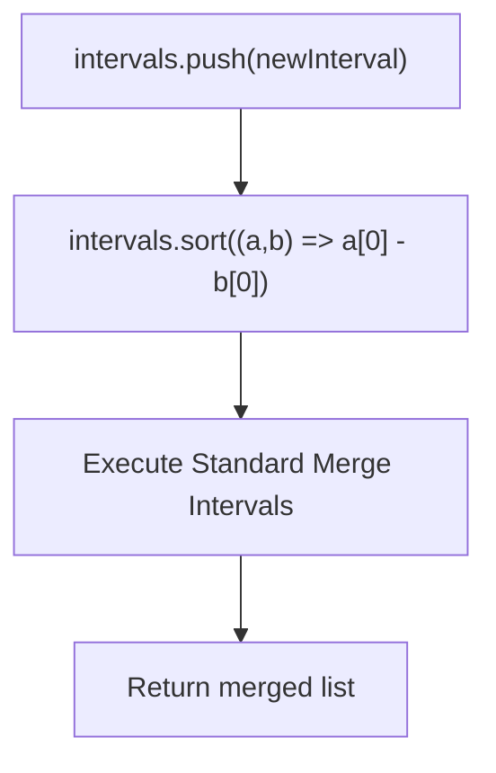
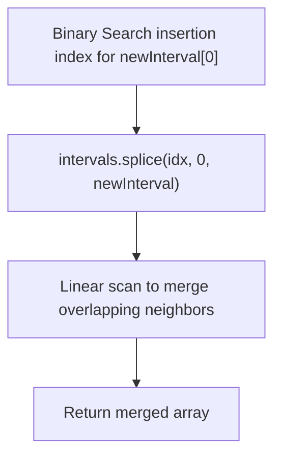
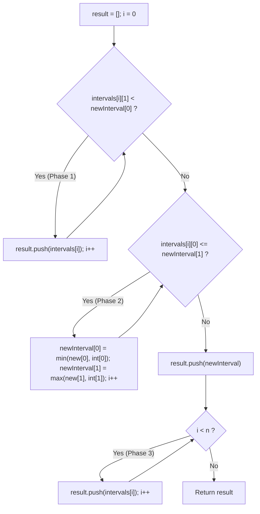
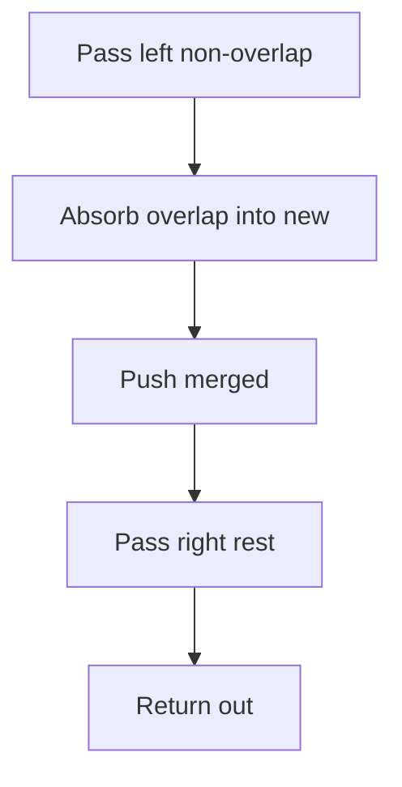

# 57. Insert Interval

- **LeetCode Link**: `https://leetcode.com/problems/insert-interval/`
- **Difficulty**: Medium
- **Pattern Category**: Intervals / Three-Phase Partitioning / Non-Overlapping Insertion
- **Prerequisite Primer**: `00-foundations/01-js-interview-runtime-quirks.md`

---

## 1. Problem Overview & Edge Case Matrix

### Problem Statement
You are given an array of non-overlapping intervals `intervals` where `intervals[i] = [start_i, end_i]` sorted in **ascending order** by `start_i`. You are also given an interval `newInterval = [start, end]`.

Insert `newInterval` into `intervals` such that `intervals` is still sorted in ascending order by `start_i` and `intervals` still does not have any overlapping intervals (merge overlapping intervals if necessary).

Return `intervals` after the insertion.

```
Example 1:
Input: intervals = [[1, 3], [6, 9]], newInterval = [2, 5]
Output: [[1, 5], [6, 9]]
Explanation: [2, 5] overlaps with [1, 3], merging into [1, 5].

Example 2:
Input: intervals = [[1, 2], [3, 5], [6, 7], [8, 10], [12, 16]], newInterval = [4, 8]
Output: [[1, 2], [3, 10], [12, 16]]
Explanation: [4, 8] overlaps with [3, 5], [6, 7], and [8, 10], merging into [3, 10].
```

### Upfront Edge Case Matrix

| Edge Case Scenario | Inputs | Expected Output | Pitfall / Failure Mode |
| :--- | :--- | :--- | :--- |
| Empty Input List | `intervals = []`, `new = [5, 7]` | `[[5, 7]]` | Accessing `intervals[0]` |
| Completely Before All Intervals | `intervals = [[3, 5], [6, 9]]`, `new = [1, 2]` | `[[1, 2], [3, 5], [6, 9]]` | Placing new interval at end |
| Completely After All Intervals | `intervals = [[1, 2], [3, 5]]`, `new = [6, 8]` | `[[1, 2], [3, 5], [6, 8]]` | Forgetting terminal flush |
| Spans All Intervals | `intervals = [[2, 3], [4, 5]]`, `new = [1, 10]` | `[[1, 10]]` | Leaving intermediate remnants |
| Fully Contained Within Existing | `intervals = [[1, 10]]`, `new = [3, 4]` | `[[1, 10]]` | Prematurely ending or splitting range |

---

## 2. Level 1: Brute Force Approach (Append, Full Re-Sort & Standard Merge)

### Intuition & Visual Idea
Ignore the fact that `intervals` is already sorted. Push `newInterval` into `intervals`, sort the entire array by start time ($O(N \log N)$), and then execute the standard merge intervals logic from LeetCode 56.



### Pseudocode
```text
FUNCTION insertBruteForce(intervals, newInterval):
    intervals.APPEND(newInterval)
    SORT intervals ASCENDING BY start_time
    
    merged = [intervals[0]]
    FOR i FROM 1 TO intervals.length - 1:
        IF intervals[i][0] <= merged.LAST[1]:
            merged.LAST[1] = MAX(merged.LAST[1], intervals[i][1])
        ELSE:
            merged.APPEND(intervals[i])
            
    RETURN merged
```

### Step-by-Step Dry Run
`intervals = [[1, 3], [6, 9]]`, `newInterval = [2, 5]`

| Step | Array State | Action |
| :--- | :--- | :--- |
| 1. Append | `[[1, 3], [6, 9], [2, 5]]` | Added newInterval |
| 2. Sort | `[[1, 3], [2, 5], [6, 9]]` | Lexicographical sort by `start` |
| 3. Merge `[1, 3]` & `[2, 5]` | `[[1, 5]]` | $2 \le 3 \implies [1, \max(3, 5)]$ |
| 4. Inspect `[6, 9]` | `[[1, 5], [6, 9]]` | $6 > 5 \implies$ Append |
| Result | `[[1, 5], [6, 9]]` | Correct |

### Modern JavaScript Implementation
```javascript
/**
 * Level 1: Append + Full Re-Sort + Merge
 * Time Complexity:  O(N log N)
 * Space Complexity: O(N)
 */
function insertBruteForce(intervals, newInterval) {
  const all = [...intervals, newInterval];
  all.sort((a, b) => a[0] - b[0]);

  const merged = [all[0]];

  for (let i = 1; i < all.length; i++) {
    const curr = all[i];
    const last = merged[merged.length - 1];

    if (curr[0] <= last[1]) {
      last[1] = Math.max(last[1], curr[1]);
    } else {
      merged.push(curr);
    }
  }

  return merged;
}
```

### Complexity Breakdown
- **Time Complexity**: $O(N \log N)$ — Dominated by sorting $N + 1$ elements.
- **Space Complexity**: $O(N)$ — Allocates copies of interval arrays.

#### 🎙️ How to Explain to Interviewer
> *"A naive baseline appends `newInterval` and re-runs the generic Merge Intervals algorithm. While simple and correct, it discards the critical problem precondition: `intervals` is already sorted and mutually disjoint. Re-sorting costs $O(N \log N)$ instead of linear time."*

---

## 3. Level 2: Optimized Approach (Binary Search Insertion Point + Spliced Merge)

### Intuition & Visual Bottleneck Elimination
Since `intervals` is sorted by start time, we can locate the exact insertion index for `newInterval` using **Binary Search** (`bisectLeft`) in $O(\log N)$ time.
After splicing `newInterval` into the array at that index, we only need to merge intervals starting from the insertion index backward/forward.



### Pseudocode
```text
FUNCTION insertBinarySearch(intervals, newInterval):
    idx = BINARY_SEARCH_LOWER_BOUND(intervals, newInterval[0])
    intervals.SPLICE(idx, 0, newInterval)
    // Run single pass merge from Math.max(0, idx - 1)
    RETURN merge(intervals)
```

### Step-by-Step Dry Run
`intervals = [[1, 2], [6, 9]]`, `newInterval = [3, 5]`

| Step | Operation | Resulting Array |
| :--- | :--- | :--- |
| Binary Search | Find position for `start = 3` | Index 1 (between `[1, 2]` and `[6, 9]`) |
| Splicing | Insert `[3, 5]` at index 1 | `[[1, 2], [3, 5], [6, 9]]` |
| Neighborhood Check | Check `[1, 2]` vs `[3, 5]` and `[3, 5]` vs `[6, 9]` | All disjoint |
| Final Output | - | `[[1, 2], [3, 5], [6, 9]]` |

### Modern JavaScript Implementation
```javascript
/**
 * Level 2: Binary Search Insertion Point + Splicing
 * Time Complexity:  O(N) due to array shift during splice
 * Space Complexity: O(N)
 */
function insertBinarySearch(intervals, newInterval) {
  let low = 0;
  let high = intervals.length;

  // Binary search for insertion index based on start time
  while (low < high) {
    const mid = (low + high) >> 1;
    if (intervals[mid][0] < newInterval[0]) {
      low = mid + 1;
    } else {
      high = mid;
    }
  }

  // Splice creates O(N) element shift
  intervals.splice(low, 0, newInterval);

  // Standard linear merge
  const result = [];
  for (const interval of intervals) {
    if (result.length === 0 || result[result.length - 1][1] < interval[0]) {
      result.push(interval);
    } else {
      result[result.length - 1][1] = Math.max(
        result[result.length - 1][1],
        interval[1]
      );
    }
  }

  return result;
}
```

### Complexity Breakdown
- **Time Complexity**: $O(N)$ — Finding the index takes $O(\log N)$, but `splice()` and subsequent compaction take $O(N)$ time.
- **Space Complexity**: $O(N)$ — Auxiliary result array.

#### 🎙️ How to Explain to Interviewer
> *"Binary search finds the insertion index in $O(\log N)$ time. However, inserting an element into a JavaScript contiguous array with `splice()` triggers an $O(N)$ memory shift, making the total time $O(N)$. Can we construct the merged output in a single forward pass without shifting?"*

---

## 4. Level 3: Most Optimal / Canonical Approach (Three-Phase Linear Stream Partitioning)

### Intuition & Mathematical Proof
Because the input `intervals` are guaranteed to be sorted and non-overlapping, any insertion problem can be decomposed into **Three Mutually Exclusive Phases**:

```
                       [ newInterval ]
Phase 1: [---]  [---]                   | Completely before (end < new.start)
Phase 2:           [======OVERLAP======] | Overlapping (start <= new.end)
Phase 3:                                [---] [---] | Completely after (start > new.end)
```

1. **Phase 1: Left Disjoint Intervals**
   As long as `intervals[i][1] < newInterval[0]`, the interval ends strictly before `newInterval` starts. There is zero overlap. Push directly to `result`.
2. **Phase 2: Overlapping Region**
   As long as `intervals[i][0] <= newInterval[1]`, the interval starts before `newInterval` ends. They overlap! Merge the interval into `newInterval`:
   $$\text{newInterval}[0] = \min(\text{newInterval}[0], \text{intervals}[i][0])$$
   $$\text{newInterval}[1] = \max(\text{newInterval}[1], \text{intervals}[i][1])$$
   Advance $i$.
   When Phase 2 finishes, push the fully merged `newInterval` to `result`.
3. **Phase 3: Right Disjoint Intervals**
   All remaining intervals start strictly after the merged `newInterval` ends. Push them directly to `result`.

This executes in a **single pass** of strictly $N$ iterations with zero sorting and zero array shifts.



### Pseudocode
```text
FUNCTION insert(intervals, newInterval):
    result = []
    i = 0
    n = intervals.length
    
    // Phase 1: Left disjoint
    WHILE i < n AND intervals[i][1] < newInterval[0]:
        result.APPEND(intervals[i])
        i = i + 1
        
    // Phase 2: Overlapping zone
    WHILE i < n AND intervals[i][0] <= newInterval[1]:
        newInterval[0] = MIN(newInterval[0], intervals[i][0])
        newInterval[1] = MAX(newInterval[1], intervals[i][1])
        i = i + 1
    result.APPEND(newInterval)
    
    // Phase 3: Right disjoint
    WHILE i < n:
        result.APPEND(intervals[i])
        i = i + 1
        
    RETURN result
```

### Step-by-Step Dry Run
`intervals = [[1, 2], [3, 5], [6, 7], [8, 10], [12, 16]]`, `newInterval = [4, 8]`

| Phase | `i` | Interval | Condition Check | Action | `result` State |
| :--- | :--- | :--- | :--- | :--- | :--- |
| Phase 1 | 0 | `[1, 2]` | $2 < 4$ (True) | Push `[1, 2]`, `i = 1` | `[[1, 2]]` |
| Phase 1 | 1 | `[3, 5]` | $5 < 4$ (False) | Exit Phase 1 | `[[1, 2]]` |
| Phase 2 | 1 | `[3, 5]` | $3 \le 8$ (True) | `new = [min(4,3), max(8,5)] = [3, 8]`, `i=2` | `[[1, 2]]` |
| Phase 2 | 2 | `[6, 7]` | $6 \le 8$ (True) | `new = [min(3,6), max(8,7)] = [3, 8]`, `i=3` | `[[1, 2]]` |
| Phase 2 | 3 | `[8, 10]`| $8 \le 8$ (True) | `new = [min(3,8), max(8,10)] = [3, 10]`, `i=4`| `[[1, 2]]` |
| Phase 2 | 4 | `[12, 16]`| $12 \le 10$ (False)| Exit Phase 2; Push `[3, 10]` | `[[1, 2], [3, 10]]` |
| Phase 3 | 4 | `[12, 16]`| $i < 5$ (True) | Push `[12, 16]`, `i = 5` | `[[1, 2], [3, 10], [12, 16]]` |
| Result | Done | - | - | Complete | `[[1, 2], [3, 10], [12, 16]]` |

### Modern JavaScript Implementation
```javascript
/**
 * Level 3: Canonical Three-Phase Stream Partitioning
 * Time Complexity:  O(N) - Strictly single pass
 * Space Complexity: O(N) for output array
 */
function insert(intervals, newInterval) {
  const result = [];
  const n = intervals.length;
  let i = 0;

  // Phase 1: Add all intervals ending strictly before newInterval starts
  while (i < n && intervals[i][1] < newInterval[0]) {
    result.push(intervals[i]);
    i++;
  }

  // Phase 2: Absorb all intervals overlapping with newInterval
  while (i < n && intervals[i][0] <= newInterval[1]) {
    newInterval[0] = Math.min(newInterval[0], intervals[i][0]);
    newInterval[1] = Math.max(newInterval[1], intervals[i][1]);
    i++;
  }
  result.push(newInterval);

  // Phase 3: Add all intervals starting strictly after newInterval ends
  while (i < n) {
    result.push(intervals[i]);
    i++;
  }

  return result;
}
```

### Complexity Breakdown
- **Time Complexity**: $O(N)$ — Pointer $i$ strictly moves from $0$ to $n - 1$. Exactly $N$ intervals are processed once.
- **Space Complexity**: $O(N)$ — To hold the non-overlapping output array.

#### 🎙️ How to Explain to Interviewer
> *"Because the array is already sorted and disjoint, we can partition the problem into three linear phases: first, push all intervals strictly to the left of `newInterval`; second, merge all overlapping intervals into `newInterval` by taking the min start and max end; finally, push the merged interval and all remaining intervals strictly to the right. This achieves optimal $O(N)$ runtime in a single linear pass with zero sorting."*

---

## 5. JavaScript-Specific Gotchas & V8 Optimizations
- **Overlap Boundary Trap (`<=` vs `<`)**: In Phase 2, `intervals[i][0] <= newInterval[1]` must be non-strict. For example, `[1, 4]` and `[4, 5]` overlap at coordinate 4! Using `<` would fail to merge them.
- **Avoiding Splice**: Calling `intervals.splice()` causes V8 to copy memory blocks to resize the array backing store. Appending sequentially to `result` uses contiguous capacity growth without quadratic copying overhead.

---

## 6. Real-World MAANG Interview Follow-Ups & Extensions

### Follow-Up 1: Calendar Room Booking (My Calendar I - LC 729)
- **Scenario**: Implement `book(start, end)` that returns `true` if a new meeting can be booked without causing a double booking, and `false` otherwise.
- **Solution Strategy**: Maintain a list of booked non-overlapping intervals. Binary search for insertion point. If no overlap with left or right neighbor, insert and return `true`.
- **JS Code**:
```javascript
class MyCalendar {
  constructor() {
    this.books = [];
  }

  book(start, end) {
    for (const [s, e] of this.books) {
      // Overlap condition: max(s1, s2) < min(e1, e2) for half-open [start, end)
      if (Math.max(s, start) < Math.min(e, end)) {
        return false;
      }
    }
    this.books.push([start, end]);
    return true;
  }
}
```

### Follow-Up 2: Dynamic Disjoint Interval Set with Remove Operation
- **Scenario**: Support both `addInterval(start, end)` and `removeInterval(start, end)` (e.g. freeing memory blocks in an OS memory allocator).
- **Solution Strategy**: For `removeInterval`, intervals falling completely inside are deleted; intervals overlapping partially are truncated; intervals containing the target are split into two disjoint fragments.
- **JS Code**:
```javascript
function removeInterval(intervals, toBeRemoved) {
  const result = [];
  const [remStart, remEnd] = toBeRemoved;

  for (const [start, end] of intervals) {
    if (end <= remStart || start >= remEnd) {
      // Completely outside
      result.push([start, end]);
    } else {
      // Overlap: check if left remnant survives
      if (start < remStart) {
        result.push([start, remStart]);
      }
      // Check if right remnant survives
      if (end > remEnd) {
        result.push([remEnd, end]);
      }
    }
  }

  return result;
}
```

---

## 7. What LeetCode Discuss Says (Language-Independent)

Source: top-voted post by Andrey Timoshpolsky —
`https://leetcode.com/problems/insert-interval/solutions/21602/short-and-straight-forward-java-solution-h749/`
— 1.1K votes / 188.5K views / 101 comments.
Language-independent summary. No new JS here.

### A. Naive way (baseline context)

Insert, re-sort, run full merge
(Q56). Works, re-sorts sorted input.

```text
FUNCTION insertNaive(intervals, newInt):
    APPEND newInt TO intervals
    SORT BY start
    RETURN MERGE ALL (Q56 sweep)
```

- Time: O(n log n)
- Space: O(n)

### B. Post's way: three phases, one pass

Sorted + disjoint input splits the
work: ends before new start pass
through; overlapping stretch the
new interval; the rest appends.

```text
FUNCTION insertOptimal(intervals, newInt):
    out = []; i = 0
    WHILE i < n AND intervals[i][1] < newInt[0]:
        PUSH intervals[i]; i++
    WHILE i < n AND intervals[i][0] <= newInt[1]:
        newInt = [MIN(starts), MAX(ends)]
        i++
    PUSH newInt
    WHILE i < n:
        PUSH intervals[i]; i++
    RETURN out
```

- Time: O(n)
- Space: O(n) output



### C. Dry run on LeetCode Example 1

`intervals = [[1,3],[6,9]]`
`newInterval = [2,5]`

| Phase | Check | out |
| :--- | :--- | :--- |
| Left | [1,3]: 3<2? No | [] |
| Merge | [1,3]: 1<=5 → [1,5] | [] |
| Merge | [6,9]: 6<=5? No | [] |
| Push | - | [[1,5]] |
| Right | [6,9] | [[1,5],[6,9]] |

### D. Why B beats A

- No re-sort of sorted input.
- Merge-while-scanning replaces
  the second Q56 pass.
- Q57 IS Q56 with a head start
  (top thread, 63).

### E. Pitfalls from comments

- `<=` on the merge test: [1,4]
  and [4,5] touch → merge.
- Mutate newInt in place instead
  of allocating (24).
- In-place variant exists (183)
  but complicates the 3 phases.
- Signature changed to arrays
  (244) — old Interval code rots.

### F. Companies

- Discuss post itself names none.
- External source:
  `https://github.com/liquidslr/leetcode-company-wise-problems`
  (LeetCode company tags, updated June 2025).
- All-time (16): Amazon, Apple,
  Bloomberg, Google, LinkedIn,
  Meta, Microsoft, MongoDB, Oracle,
  PayPal, PhonePe, TCS, Tesco,
  TikTok, Uber, Walmart Labs.
- Recent: 30 days — Google.
- Recent: 3 months — Amazon,
  Google.

