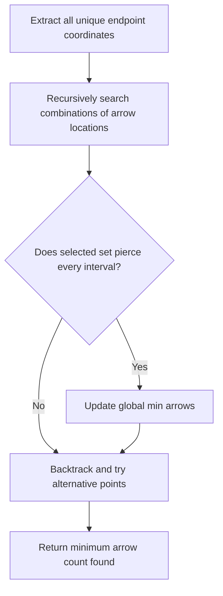
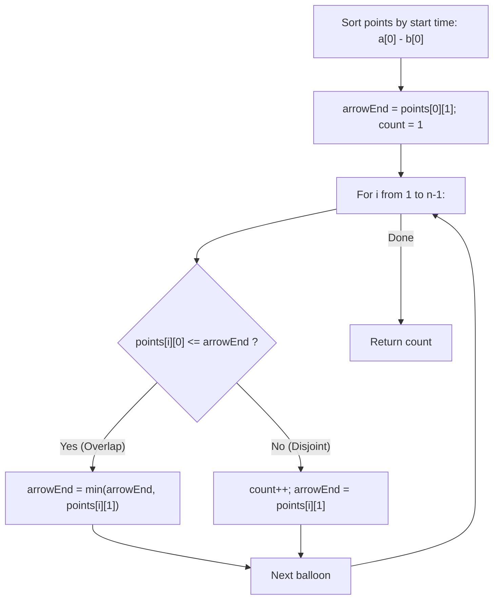
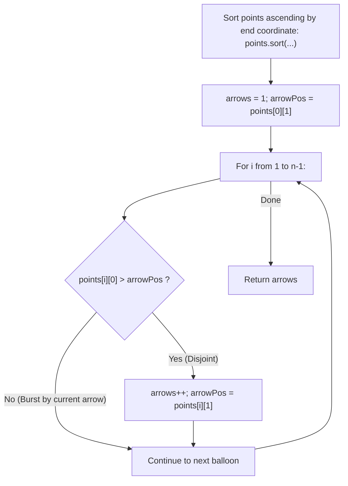

# 452. Minimum Number of Arrows to Burst Balloons

- **LeetCode Link**: `https://leetcode.com/problems/minimum-number-of-arrows-to-burst-balloons/`
- **Difficulty**: Medium
- **Pattern Category**: Intervals / Greedy Activity Selection / Point Pierce Elimination
- **Prerequisite Primer**: `00-foundations/01-js-interview-runtime-quirks.md`

---

## 1. Problem Overview & Edge Case Matrix

### Problem Statement
There are spherical balloons taped to a flat wall that represents the XY-plane. The balloons are represented as a 2D integer array `points` where `points[i] = [x_start, x_end]` denotes a balloon whose horizontal diameter stretches between `x_start` and `x_end`.

Arrows can be shot **vertically upwards** in the positive y-direction from any point along the x-axis. A balloon with `[x_start, x_end]` is burst by an arrow shot at `x` if:
$$x_{\text{start}} \le x \le x_{\text{end}}$$

There is no limit to the number of arrows that can be shot. A single arrow can burst an infinite number of balloons as long as their horizontal spans overlap at the arrow's coordinate.

Given the array `points`, return the **minimum number of arrows** that must be shot to burst all balloons.

```
Example 1:
Input: points = [[10, 16], [2, 8], [1, 6], [7, 12]]
Output: 2
Explanation:
- Shoot arrow at x = 6: bursts balloons [2, 8] and [1, 6].
- Shoot arrow at x = 11: bursts balloons [10, 16] and [7, 12].

Example 2:
Input: points = [[1, 2], [3, 4], [5, 6], [7, 8]]
Output: 4
Explanation: All balloons are disjoint; each requires 1 arrow.

Example 3:
Input: points = [[1, 2], [2, 3], [3, 4], [4, 5]]
Output: 2
Explanation:
- Arrow at x = 2 bursts [1, 2] and [2, 3].
- Arrow at x = 4 bursts [3, 4] and [4, 5].
```

### Upfront Edge Case Matrix

| Edge Case Scenario | Inputs | Expected Output | Pitfall / Failure Mode |
| :--- | :--- | :--- | :--- |
| Empty Input | `points = []` | `0` | Accessing `points[0]` on empty array |
| Single Balloon | `points = [[1, 5]]` | `1` | Off-by-one initial arrow count |
| Touching Endpoints | `points = [[1, 2], [2, 3]]` | `1` | Using strict inequality `<` instead of `<=` |
| Complete Containment | `points = [[1, 10], [2, 4]]` | `1` | Shooting at `10` instead of inside inner interval |
| 32-bit Integer Extremes | `points = [[-2147483646, -2147483645], [2147483646, 2147483647]]` | `2` | Sort comparator subtraction integer overflow |

---

## 2. Level 1: Brute Force Approach (Recursive Minimum Hitting Set)

### Intuition & Visual Idea
This problem is an instance of the classical **Hitting Set Problem**: select the minimum number of points on the x-axis such that every interval contains at least one point.
In the brute force approach, every candidate arrow location is the endpoint of some balloon. We recursively explore picking or skipping each potential arrow coordinate and check if all balloons are burst.



### Pseudocode
```text
FUNCTION findMinArrowShotsBruteForce(points):
    IF points.length == 0: RETURN 0
    candidatePoints = UNIQUE_ENDPOINTS(points)
    
    FUNCTION canBurstAll(subset):
        FOR EACH balloon IN points:
            IF NOT ANY(p IN subset WHERE balloon[0] <= p <= balloon[1]):
                RETURN false
        RETURN true
        
    FOR k FROM 1 TO points.length:
        FOR EACH subset OF candidatePoints WITH SIZE k:
            IF canBurstAll(subset):
                RETURN k
                
    RETURN points.length
```

### Step-by-Step Dry Run
`points = [[1, 2], [2, 3], [3, 4]]`

| Combination Size $k$ | Candidate Subset | Bursts All? | Action |
| :--- | :--- | :--- | :--- |
| $k = 1$ | `{2}` | Misses `[3, 4]` | Try next |
| $k = 1$ | `{3}` | Misses `[1, 2]` | Try next |
| $k = 2$ | `{2, 4}` | Bursts `[1, 2]`, `[2, 3]` with 2, and `[3, 4]` with 4 | **Valid! Return 2** |

### Modern JavaScript Implementation
```javascript
/**
 * Level 1: Exhaustive Subset Search (Hitting Set)
 * Time Complexity:  O(2^N * N) Exponential
 * Space Complexity: O(N) Recursion Stack
 */
function findMinArrowShotsBruteForce(points) {
  const n = points.length;
  if (n <= 1) return n;

  // Extract candidate points (the end of each interval)
  const candidates = Array.from(new Set(points.map(p => p[1])));

  function coversAll(chosenPoints) {
    for (const [start, end] of points) {
      let hit = false;
      for (const pt of chosenPoints) {
        if (pt >= start && pt <= end) {
          hit = true;
          break;
        }
      }
      if (!hit) return false;
    }
    return true;
  }

  // Test combinations of increasing sizes
  function findMinCombination(idx, current) {
    if (coversAll(current)) return current.length;
    if (idx >= candidates.length) return Infinity;

    // Option 1: Include candidate
    current.push(candidates[idx]);
    const withCandidate = findMinCombination(idx + 1, current);
    current.pop();

    // Option 2: Exclude candidate
    const withoutCandidate = findMinCombination(idx + 1, current);

    return Math.min(withCandidate, withoutCandidate);
  }

  return findMinCombination(0, []);
}
```

### Complexity Breakdown
- **Time Complexity**: $O(2^N \cdot N)$ — Exhaustive search over all subsets of candidate points.
- **Space Complexity**: $O(N)$ — Maximum recursion stack depth.

#### 🎙️ How to Explain to Interviewer
> *"The problem can be modeled as the NP-complete Minimum Hitting Set problem in the general case. Testing all subsets of coordinate points takes exponential $O(2^N \cdot N)$ time. However, because intervals are 1-dimensional and continuous, a greedy polynomial-time choice exists."*

---

## 3. Level 2: Optimized Approach (Sort by Start Time with Dynamic Intersection Window)

### Intuition & Visual Bottleneck Elimination
Sort balloons by their start time `x_start`.
We maintain an active **arrow targeting range** `[arrowStart, arrowEnd]` initialized to the first balloon.
For each subsequent balloon:
- If its `x_start <= arrowEnd`: It overlaps with the current arrow targeting range! We tighten the window:
  `arrowStart = Math.max(arrowStart, balloon.start)`
  `arrowEnd = Math.min(arrowEnd, balloon.end)`
- If its `x_start > arrowEnd`: The balloon cannot be burst by the current arrow!
  We shoot an arrow, increment `arrowCount++`, and initialize a new arrow window with the current balloon.



### Pseudocode
```text
FUNCTION findMinArrowShotsByStart(points):
    IF points.length == 0: RETURN 0
    SORT points ASCENDING BY start_time
    
    count = 1
    arrowEnd = points[0][1]
    
    FOR i FROM 1 TO points.length - 1:
        IF points[i][0] <= arrowEnd:
            arrowEnd = MIN(arrowEnd, points[i][1])
        ELSE:
            count = count + 1
            arrowEnd = points[i][1]
            
    RETURN count
```

### Step-by-Step Dry Run
`points = [[10, 16], [2, 8], [1, 6], [7, 12]]`
Sorted by start: `[[1, 6], [2, 8], [7, 12], [10, 16]]`

| `i` | Balloon | `arrowEnd` Before | $x_{\text{start}} \le \text{arrowEnd}$? | Action | `arrowEnd` After | `count` |
| :--- | :--- | :--- | :--- | :--- | :--- | :--- |
| Init | `[1, 6]` | 6 | - | Initialize | 6 | 1 |
| 1 | `[2, 8]` | 6 | $2 \le 6$ (Yes) | `min(6, 8) = 6` | 6 | 1 |
| 2 | `[7, 12]` | 6 | $7 \le 6$ (No) | Shoot! New window | 12 | 2 |
| 3 | `[10, 16]` | 12 | $10 \le 12$ (Yes)| `min(12, 16) = 12`| 12 | 2 |
| End | - | - | - | Complete | - | **Return 2** |

### Modern JavaScript Implementation
```javascript
/**
 * Level 2: Sort by Start Coordinate + Window Shrinkage
 * Time Complexity:  O(N log N)
 * Space Complexity: O(1) Auxiliary Space
 */
function findMinArrowShotsByStart(points) {
  const n = points.length;
  if (n <= 1) return n;

  // Safe numeric comparison avoiding subtraction overflow
  points.sort((a, b) => (a[0] < b[0] ? -1 : a[0] > b[0] ? 1 : 0));

  let arrows = 1;
  let arrowEnd = points[0][1];

  for (let i = 1; i < n; i++) {
    const [start, end] = points[i];

    if (start <= arrowEnd) {
      // Tighten the valid intersection zone
      arrowEnd = Math.min(arrowEnd, end);
    } else {
      // Disjoint: fire arrow and start new cluster
      arrows++;
      arrowEnd = end;
    }
  }

  return arrows;
}
```

### Complexity Breakdown
- **Time Complexity**: $O(N \log N)$ — Sorting $N$ points takes $O(N \log N)$, single linear pass takes $O(N)$.
- **Space Complexity**: $O(1)$ auxiliary space.

#### 🎙️ How to Explain to Interviewer
> *"Sorting by start coordinate requires us to dynamically narrow the `arrowEnd` boundary using `Math.min(arrowEnd, balloon.end)` because an earlier-starting balloon could extend far past a later-starting balloon. When a balloon starts past `arrowEnd`, we must increment our arrow count. This runs in $O(N \log N)$ time."*

---

## 4. Level 3: Most Optimal / Canonical Approach (Greedy Interval Scheduling: Sort by End Coordinate)

### Intuition & Mathematical Proof
Can we eliminate the need to shrink the window with `Math.min`?
**Yes!** We sort balloons by their **end coordinate**:
`points.sort((a, b) => a[1] - b[1])`

**The Greedy Choice Theorem**:
Consider the balloon that finishes earliest (at $E_1$).
To burst this balloon, our arrow must be shot at some coordinate $x \le E_1$.
To maximize the probability of bursting other balloons with the same arrow, we should push the arrow as far to the right as possible!
Therefore, the **globally optimal position** to shoot the arrow is precisely at its right edge:
$$\text{arrowPos} = E_1$$

Because the array is sorted by end coordinates:
- Any subsequent balloon with $x_{\text{start}} \le \text{arrowPos}$ is guaranteed to overlap at $\text{arrowPos}$ (since its end coordinate $x_{\text{end}} \ge E_1 = \text{arrowPos}$). It is burst for free!
- As soon as we encounter a balloon with $x_{\text{start}} > \text{arrowPos}$, it is impossible for the previous arrow to burst it. We must fire a new arrow, and by the same greedy logic, the optimal location is its right edge: $\text{arrowPos} = x_{\text{end}}$, incrementing $\text{arrows}++$.

```
Sorted by End:
[1 ------- 6]           Arrow 1 shot at x = 6
  [2 -------- 8]        (Burst by Arrow 1 because start 2 <= 6)
       [7 ------- 12]   Arrow 2 shot at x = 12
         [10 -------- 16] (Burst by Arrow 2 because start 10 <= 12)
```



### Pseudocode
```text
FUNCTION findMinArrowShots(points):
    IF points.length == 0: RETURN 0
    SORT points ASCENDING BY end_coordinate
    
    arrows = 1
    arrowPos = points[0][1]
    
    FOR i FROM 1 TO points.length - 1:
        IF points[i][0] > arrowPos:
            arrows = arrows + 1
            arrowPos = points[i][1]
            
    RETURN arrows
```

### Step-by-Step Dry Run
`points = [[10, 16], [2, 8], [1, 6], [7, 12]]`
Sorted by end: `[[1, 6], [2, 8], [7, 12], [10, 16]]`

| `i` | Balloon | `arrowPos` | $x_{\text{start}} > \text{arrowPos}$? | Action | `arrowPos` After | `arrows` |
| :--- | :--- | :--- | :--- | :--- | :--- | :--- |
| Init | `[1, 6]` | 6 | - | Shoot at 6 | 6 | 1 |
| 1 | `[2, 8]` | 6 | $2 > 6$ (No) | Burst by existing arrow | 6 | 1 |
| 2 | `[7, 12]` | 6 | $7 > 6$ (Yes) | Fire new arrow at 12 | 12 | 2 |
| 3 | `[10, 16]` | 12 | $10 > 12$ (No) | Burst by existing arrow | 12 | 2 |
| End | - | - | - | Complete | - | **Return 2** |

### Modern JavaScript Implementation
```javascript
/**
 * Level 3: Canonical Greedy Interval Scheduling (Sort by End Coordinate)
 * Time Complexity:  O(N log N)
 * Space Complexity: O(1) Auxiliary Space
 */
function findMinArrowShots(points) {
  const n = points.length;
  if (n <= 1) return n;

  // Safe comparator preventing 32-bit integer subtraction overflow
  points.sort((a, b) => (a[1] < b[1] ? -1 : a[1] > b[1] ? 1 : 0));

  let arrows = 1;
  let arrowPos = points[0][1];

  for (let i = 1; i < n; i++) {
    // If balloon starts after current arrow position, a new arrow is strictly required
    if (points[i][0] > arrowPos) {
      arrows++;
      arrowPos = points[i][1];
    }
  }

  return arrows;
}
```

### Complexity Breakdown
- **Time Complexity**: $O(N \log N)$ — Sorting the array takes $O(N \log N)$. The subsequent greedy traversal runs in strictly $O(N)$ with a single branch comparison per balloon.
- **Space Complexity**: $O(1)$ auxiliary space — Only two primitive scalar trackers (`arrows`, `arrowPos`).

#### 🎙️ How to Explain to Interviewer
> *"This problem is isomorphic to the classic Greedy Activity Selection problem. By sorting balloons ascending by their end coordinate, the optimal strategy is to shoot an arrow at the earliest-finishing balloon's rightmost edge. This guarantees that this balloon is burst while maximizing the reach for subsequent overlapping balloons. If a balloon begins strictly after our arrow, we must shoot a new arrow at its right boundary. This eliminates all `Math.min` recalculations and runs in $O(N \log N)$ time with $O(1)$ auxiliary memory."*

---

## 5. JavaScript-Specific Gotchas & V8 Optimizations
- **Subtraction Overflow Trap**: Never write `points.sort((a, b) => a[1] - b[1])`! If $a[1] = -2147483648$ and $b[1] = 2147483647$, the subtraction causes severe numeric issues. Always use explicit ternary comparisons: `(a[1] < b[1] ? -1 : a[1] > b[1] ? 1 : 0)`.
- **Touching Balloons Condition (`>` vs `>=`)**: The problem statement specifies that a balloon is burst if $x_{\text{start}} \le x \le x_{\text{end}}$. Thus, an arrow at $x = 2$ bursts both `[1, 2]` and `[2, 3]`. Therefore, a new arrow is required **only if** $x_{\text{start}} > \text{arrowPos}$.

---

## 6. Real-World MAANG Interview Follow-Ups & Extensions

### Follow-Up 1: Non-Overlapping Intervals (LeetCode 435)
- **Scenario**: Given an array of intervals, find the minimum number of intervals you need to remove to make the rest of the intervals non-overlapping.
- **Solution Strategy**: The maximum number of mutually non-overlapping intervals equals the minimum number of arrows! The minimum number of intervals to remove is simply:
  $$\text{Removals} = N - \text{findMinArrowShots}(intervals)$$
- **JS Code**:
```javascript
function eraseOverlapIntervals(intervals) {
  if (intervals.length <= 1) return 0;
  intervals.sort((a, b) => (a[1] < b[1] ? -1 : a[1] > b[1] ? 1 : 0));

  let nonOverlappingCount = 1;
  let lastEnd = intervals[0][1];

  for (let i = 1; i < intervals.length; i++) {
    // For non-overlapping intervals, touching at a point counts as non-overlapping
    if (intervals[i][0] >= lastEnd) {
      nonOverlappingCount++;
      lastEnd = intervals[i][1];
    }
  }

  return intervals.length - nonOverlappingCount;
}
```

### Follow-Up 2: 2D Laser Grid Burster (Circle Disk Targets)
- **Scenario**: Balloons are 2D circular disks with center $(x, y)$ and radius $r$. An arrow is a line laser. How to compute the minimum number of vertical laser shots?
- **Solution Strategy**: Project each 2D circle onto the horizontal x-axis: each circle forms an interval $[x - r, x + r]$. Solve using 1D `findMinArrowShots` on the projected x-intervals.
- **JS Code**:
```javascript
function minVerticalLasersForCircles(circles) {
  // circles[i] = [cx, cy, radius]
  const intervals = circles.map(([cx, cy, r]) => [cx - r, cx + r]);
  return findMinArrowShots(intervals);
}
```
