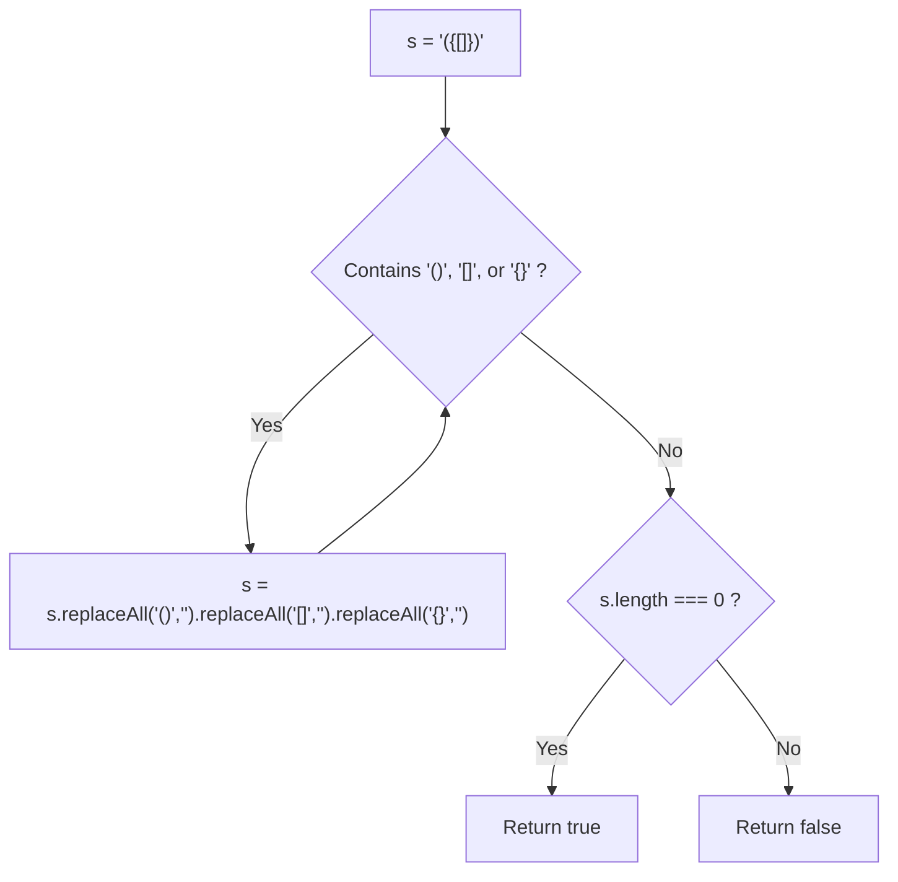
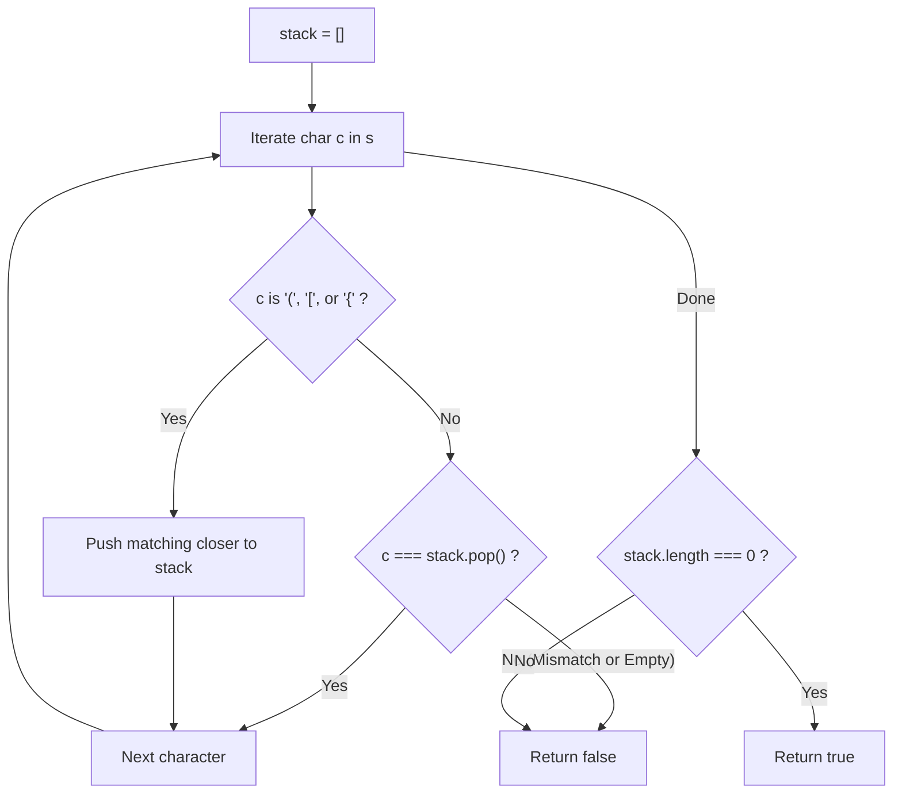
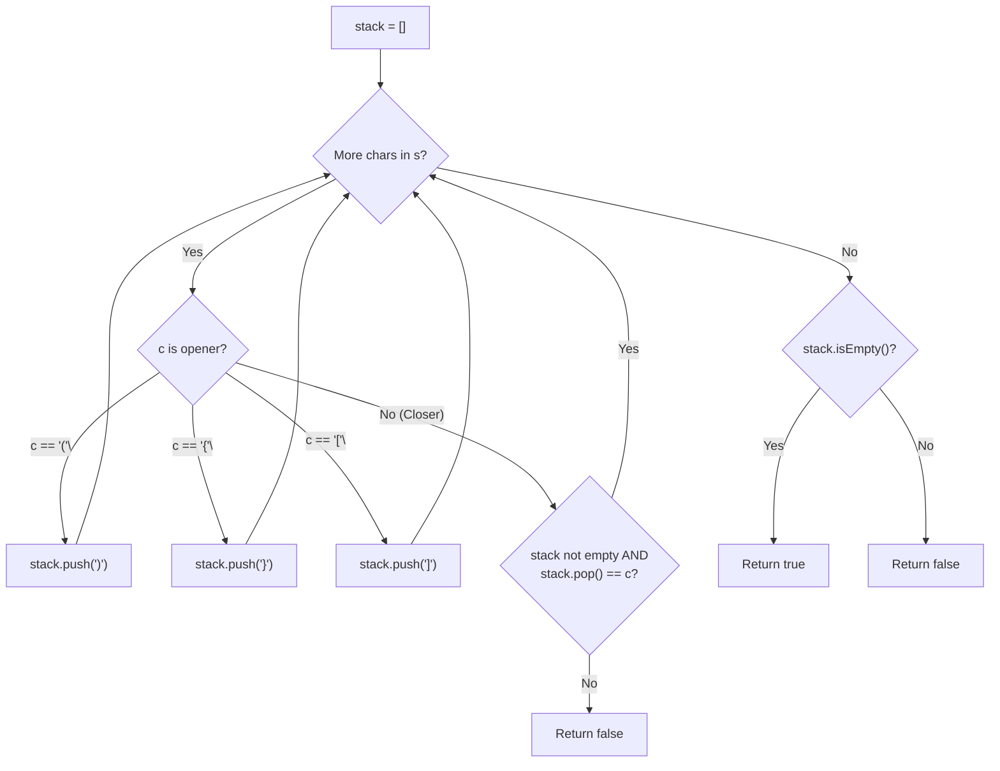

# 20. Valid Parentheses

- **LeetCode Link**: `https://leetcode.com/problems/valid-parentheses/`
- **Difficulty**: Easy
- **Pattern Category**: Stack / LIFO Bracket Matching / State Parsing
- **Prerequisite Primer**: `00-foundations/01-js-interview-runtime-quirks.md`

---

## 1. Problem Overview & Edge Case Matrix

### Problem Statement
Given a string `s` containing just the characters `'('`, `')'`, `'{'`, `'}'`, `'['` and `']'`, determine if the input string is **valid**.

An input string is valid if:
1. Open brackets must be closed by the **same type** of brackets.
2. Open brackets must be closed in the **correct order**.
3. Every close bracket has a corresponding open bracket of the same type.

```
Example 1:
Input: s = "()"
Output: true

Example 2:
Input: s = "()[]{}"
Output: true

Example 3:
Input: s = "(]"
Output: false

Example 4:
Input: s = "([])"
Output: true
```

### Upfront Edge Case Matrix

| Edge Case Scenario | Inputs | Expected Output | Pitfall / Failure Mode |
| :--- | :--- | :--- | :--- |
| Odd Length String | `s = "(()"` | `false` | Unmatched brackets; should short-circuit immediately |
| Starting with Closing Bracket | `s = ")("` | `false` | Popping from an empty stack (`stack.pop() === undefined`) |
| Unclosed Brackets at End | `s = "(()"` | `false` | Failing to check `stack.length === 0` at termination |
| Mismatched Types | `s = "(]"` | `false` | Popping opener that does not match closer |
| Deeply Nested Brackets | `s = "((((...))))"` | `true` | Call stack overflow if using recursive parsing |

---

## 2. Level 1: Brute Force Approach (Repeated Substring Elimination)

### Intuition & Visual Idea
A valid parenthesis string contains at least one contiguous adjacent matching pair: `"()"`, `"{}"`, or `"[]"`.
If we repeatedly find and remove these adjacent pairs, a valid string will eventually reduce to an empty string `""`. If no matching pairs exist and the string is non-empty, the string is invalid.



### Pseudocode
```text
FUNCTION isValidBruteForce(s):
    IF s.length % 2 != 0: RETURN false
    
    prevLength = -1
    WHILE s.length != prevLength:
        prevLength = s.length
        s = s.REPLACE("()", "")
        s = s.REPLACE("[]", "")
        s = s.REPLACE("{}", "")
        
    RETURN s.length == 0
```

### Step-by-Step Dry Run
`s = "([{}])"`

| Iteration | Current `s` | Target Pair Found | `s` After Replacement |
| :--- | :--- | :--- | :--- |
| 1 | `"([{}])"` | `"{}"` at index 2 | `"([])"` |
| 2 | `"([])"` | `"[]"` at index 1 | `"()"` |
| 3 | `"()"` | `"()"` at index 0 | `""` |
| End | `""` | - | **`s.length === 0` $\to$ `true`** |

### Modern JavaScript Implementation
```javascript
/**
 * Level 1: Repeated Substring Replacement
 * Time Complexity:  O(N^2)
 * Space Complexity: O(N) due to immutable string reallocations
 */
function isValidBruteForce(s) {
  if (s.length % 2 !== 0) return false;

  let prevLength = -1;
  while (s.length !== prevLength) {
    prevLength = s.length;
    s = s.replace('()', '').replace('[]', '').replace('{}', '');
  }

  return s.length === 0;
}
```

### Complexity Breakdown
- **Time Complexity**: $O(N^2)$ — Each replacement pass takes $O(N)$ string copying, and up to $N/2$ passes may be needed.
- **Space Complexity**: $O(N)$ — Every `replace()` call creates a new string object in V8 heap memory.

#### 🎙️ How to Explain to Interviewer
> *"A naive baseline repeatedly eliminates innermost matching pairs (`'()'`, `'[]'`, `'{}'`) until no further reductions are possible. While conceptually simple, searching and copying the string in every iteration causes quadratic $O(N^2)$ time and excessive garbage collection."*

---

## 3. Level 2: Optimized Approach (Standard Array LIFO Stack)

### Intuition & Visual Bottleneck Elimination
Parentheses obey a strict **Last-In, First-Out (LIFO)** ordering: the most recently opened bracket must be the first one closed!
We use a stack:
1. When encountering an opening bracket (`'('`, `'['`, `'{'`), push its corresponding closing bracket onto the stack.
2. When encountering a closing bracket, pop from the stack. If the popped bracket does not match the current character, return `false`.
3. After scanning all characters, the stack must be empty (`stack.length === 0`).



### Pseudocode
```text
FUNCTION isValidStack(s):
    IF s.length % 2 != 0: RETURN false
    stack = []
    
    FOR EACH char IN s:
        IF char == '(': stack.PUSH(')')
        ELSE IF char == '[': stack.PUSH(']')
        ELSE IF char == '{': stack.PUSH('}')
        ELSE IF stack.IS_EMPTY() OR stack.POP() != char:
            RETURN false
            
    RETURN stack.IS_EMPTY()
```

### Step-by-Step Dry Run
`s = "([)]"`

| `i` | Char | Stack Before | Action | Stack After |
| :--- | :--- | :--- | :--- | :--- |
| 0 | `'('` | `[]` | Push `')'` | `[')']` |
| 1 | `'['` | `[')']` | Push `']'` | `[')', ']']` |
| 2 | `')'` | `[')', ']']` | Pop `']'`; `']' !== ')'` | **Mismatch! Return `false`** |

### Modern JavaScript Implementation
```javascript
/**
 * Level 2: Array-Based LIFO Stack
 * Time Complexity:  O(N)
 * Space Complexity: O(N)
 */
function isValidStack(s) {
  // Odd length strings cannot be balanced
  if ((s.length & 1) === 1) return false;

  const stack = [];

  for (let i = 0; i < s.length; i++) {
    const char = s[i];

    if (char === '(') {
      stack.push(')');
    } else if (char === '[') {
      stack.push(']');
    } else if (char === '{') {
      stack.push('}');
    } else {
      // Must be a closing bracket
      if (stack.pop() !== char) {
        return false;
      }
    }
  }

  return stack.length === 0;
}
```

### Complexity Breakdown
- **Time Complexity**: $O(N)$ — Single pass over $N$ characters with $O(1)$ push and pop operations.
- **Space Complexity**: $O(N)$ — Holds up to $N$ characters in the stack array.

#### 🎙️ How to Explain to Interviewer
> *"Because bracket validation requires resolving innermost scopes first, a Stack is the ideal data structure. By pushing the expected closing bracket when an opener is encountered, matching becomes a single `stack.pop() === char` check. This reduces time complexity to $O(N)$."*

---

## 4. Level 3: Most Optimal / Canonical Approach (Zero-Heap Typed Array Stack with ASCII Code Matching)

### Intuition & Mathematical Proof
In performance-critical runtimes (like parsing high-throughput JSON or AST tokens), allocating a dynamic JavaScript array and string objects inside loops introduces V8 heap allocation overhead.

We can optimize to **zero dynamic heap allocations**:
1. Allocate a flat `Uint8Array(s.length)`.
2. Maintain an integer index `top = 0` (direct pointer simulation).
3. Use `s.charCodeAt(i)` to evaluate ASCII codes directly in CPU registers without creating substring characters:
   - `'('` (40) $\implies$ push `')'` (41)
   - `'['` (91) $\implies$ push `']'` (93)
   - `'{'` (123) $\implies$ push `'}'` (125)
4. When a closer appears:
   - If `top === 0` (empty stack) or `stack[--top] !== code`, return `false`.
5. Finally check `top === 0`.

```
ASCII Characters:
'(' = 40  --> expects ')' = 41
'[' = 91  --> expects ']' = 93
'{' = 123 --> expects '}' = 125

Stack Memory Buffer (Uint8Array):
[ 41 , 93 , 0 , 0 , ... ]
        ^
       top = 2
```

```mermaid
flowchart TD
    OddCheck{"(s.length & 1) === 1 ?"} -->|"Yes"| RetF["Return false immediately"]
    OddCheck -->|"No"| Alloc["stack = new Uint8Array(s.length); top = 0"]
    Alloc --> Loop["Iterate i from 0 to n-1"]
    Loop --> Read["code = s.charCodeAt(i)"]
    Read --> Case{"code value"}
    Case -->|40 '('| PushP["stack[top++] = 41; Next"]
    Case -->|91 '['| PushB["stack[top++] = 93; Next"]
    Case -->|123 '{'| PushC["stack[top++] = 125; Next"]
    Case -->|Other| PopCheck{"top === 0 OR stack[--top] !== code ?"}
    PopCheck -->|"Yes"| RetF
    PopCheck -->|"No"| Next["Next character"]
    PushP --> Next
    PushB --> Next
    PushC --> Next
    Next --> Loop
    Loop -->|"Done"| Final{"top === 0 ?"}
    Final -->|"Yes"| RetT["Return true"]
    Final -->|"No"| RetF
```

### Pseudocode
```text
FUNCTION isValid(s):
    IF (s.length & 1) == 1: RETURN false
    stack = TYPED_ARRAY_OF_SIZE(s.length)
    top = 0
    
    FOR i FROM 0 TO s.length - 1:
        code = s.CHAR_CODE_AT(i)
        SWITCH code:
            CASE 40: stack[top++] = 41; BREAK // '(' -> ')'
            CASE 91: stack[top++] = 93; BREAK // '[' -> ']'
            CASE 123: stack[top++] = 125; BREAK // '{' -> '}'
            DEFAULT:
                IF top == 0 OR stack[--top] != code:
                    RETURN false
                    
    RETURN top == 0
```

### Step-by-Step Dry Run
`s = "()"`

| `i` | Char / Code | `top` Before | Action | `stack` State | `top` After |
| :--- | :--- | :--- | :--- | :--- | :--- |
| 0 | `'('` (40) | 0 | `stack[0] = 41` | `[41, 0]` | 1 |
| 1 | `')'` (41) | 1 | `stack[--top] = stack[0] = 41 === 41` | `[41, 0]` | 0 |
| Result | Loop ends | 0 | `top === 0` | - | **Return `true`** |

### Modern JavaScript Implementation
```javascript
/**
 * Level 3: Canonical Zero-Allocation Typed Array Stack
 * Time Complexity:  O(N)
 * Space Complexity: O(N) contiguous byte buffer
 */
function isValid(s) {
  const n = s.length;
  // Parity check: odd length strings are impossible to balance
  if ((n & 1) === 1) return false;

  // Single contiguous byte buffer - zero V8 GC overhead
  const stack = new Uint8Array(n);
  let top = 0;

  for (let i = 0; i < n; i++) {
    const code = s.charCodeAt(i);

    switch (code) {
      case 40: // '('
        stack[top++] = 41; // expect ')'
        break;
      case 91: // '['
        stack[top++] = 93; // expect ']'
        break;
      case 123: // '{'
        stack[top++] = 125; // expect '}'
        break;
      default:
        // Closing bracket encountered: verify non-empty stack and matching code
        if (top === 0 || stack[--top] !== code) {
          return false;
        }
        break;
    }
  }

  return top === 0;
}
```

### Complexity Breakdown
- **Time Complexity**: $O(N)$ — Single pass; character codes are evaluated using direct integer comparison with zero string boxing.
- **Space Complexity**: $O(N)$ contiguous bytes — Exactly $N$ bytes of nursery buffer memory.

#### 🎙️ How to Explain to Interviewer
> *"We optimize for low latency by substituting the dynamic array stack with a contiguous `Uint8Array` and a scalar pointer `top`. Using `s.charCodeAt(i)` avoids allocating one-character string objects. By storing the expected closing ASCII codes directly, our default switch case handles popping and matching in a single comparison instruction. A bitwise parity check `(n & 1) === 1` prunes odd-length strings in $O(1)$ time."*

---

## 5. JavaScript-Specific Gotchas & V8 Optimizations
- **Bitwise Parity Check (`(n & 1) === 1`)**: Checking length parity with bitwise AND is slightly faster than `% 2 !== 0` and immediately filters out impossible strings.
- **String Indexing vs `charCodeAt`**: In V8, `s[i]` creates a heap-allocated substring. `s.charCodeAt(i)` returns an integer stored directly in a 64-bit float/SMI register, avoiding garbage collection entirely.

---

## 6. Real-World MAANG Interview Follow-Ups & Extensions

### Follow-Up 1: Minimum Additions to Make Parentheses Valid (LeetCode 921)
- **Scenario**: Given a string `s` of `'('` and `')'`, return the minimum number of parentheses you must add to make the string valid.
- **Solution Strategy**: Track unclosed openers (`openCount`) and unmatched closers (`additions`). Space can be reduced to $O(1)$!
- **JS Code**:
```javascript
function minAddToMakeValid(s) {
  let openCount = 0;
  let additions = 0;

  for (let i = 0; i < s.length; i++) {
    if (s[i] === '(') {
      openCount++;
    } else {
      if (openCount > 0) {
        openCount--;
      } else {
        additions++;
      }
    }
  }

  return additions + openCount;
}
```

### Follow-Up 2: Longest Valid Parentheses (LeetCode 32 - Hard)
- **Scenario**: Given a string containing just `'('` and `')'`, return the length of the longest valid (well-formed) parentheses substring.
- **Solution Strategy**: Stack stores indices. Push `-1` initially as a base boundary. For `'('`, push index. For `')'`, pop. If stack is empty, push current index as new base; else, `maxLen = Math.max(maxLen, i - stack.at(-1))`.
- **JS Code**:
```javascript
function longestValidParentheses(s) {
  const stack = [-1];
  let maxLen = 0;

  for (let i = 0; i < s.length; i++) {
    if (s[i] === '(') {
      stack.push(i);
    } else {
      stack.pop();
      if (stack.length === 0) {
        stack.push(i); // New boundary
      } else {
        maxLen = Math.max(maxLen, i - stack[stack.length - 1]);
      }
    }
  }

  return maxLen;
}
```

---

## 7. What LeetCode Discuss Says (Language-Independent)

Source: top-voted post by phoenix13steve —
`https://leetcode.com/problems/valid-parentheses/solutions/9178/short-java-solution-by-phoenix13steve-a11b/`
— 360.1K views / 3.7K votes / 409 comments.
Language-independent summary. No new JS here.

### A. Optimal way from Discuss (Push Expected Closer Trick)

Instead of pushing the opening bracket and needing a hash map or branching logic when popping to verify the match, push the **expected closing bracket** whenever an opener is encountered. 

When any character other than an opening bracket appears, it must match the top of the stack. A mismatch or an empty stack immediately signifies an invalid sequence.

```text
FUNCTION isValid(s):
    IF length(s) MOD 2 != 0:
        RETURN false

    stack = empty Stack
    
    FOR EACH char c IN s:
        IF c == '(':
            stack.push(')')
        ELSE IF c == '{':
            stack.push('}')
        ELSE IF c == '[':
            stack.push(']')
        ELSE IF stack.isEmpty() OR stack.pop() != c:
            RETURN false
            
    RETURN stack.isEmpty()
```

- Time: O(N) where N is the length of string `s`. Each character is processed once.
- Space: O(N) in the worst case where all characters are opening brackets.



### B. Dry run on LeetCode Example 4 (`s = "([])"`)

| Step | `c` | Condition | Action | Stack State (top on right) |
| :--- | :--- | :--- | :--- | :--- |
| 0 | - | Initial | Odd check pass | `[]` |
| 1 | `'('` | Opener `'('` | Push `')'` | `[')']` |
| 2 | `'['` | Opener `'['` | Push `']'` | `[')', ']']` |
| 3 | `']'` | Closer | Pop `']'` == `']'` (Match) | `[')']` |
| 4 | `')'` | Closer | Pop `')'` == `')'` (Match) | `[]` |
| 5 | End | Loop ends | `stack.isEmpty()` is True | Valid |

### C. Why Push-Expected-Closer Beats Traditional Opener-Stack

- **Eliminates reverse lookup:** Traditional stack approaches push `'('` and require a dictionary or `switch` to verify if the popped `'('` pairs with `')'`.
- **Single identity check:** Popping directly compares `popped == c`.
- **Fewer variables:** No need to store opening/closing map structures.

### D. Pitfalls from comments

- **Premature pop on empty stack:** If `s = "]"`, checking `stack.pop()` before verifying that the stack is non-empty triggers a stack underflow exception. Always test `stack.isEmpty()` first.
- **Unclosed opening brackets:** Strings like `"(("` will finish the loop with elements still in the stack. Returning `true` without checking `stack.isEmpty()` is a classic bug.
- **Odd length string:** Any string with an odd length cannot possibly form valid pairs. Checking `s.length % 2 !== 0` upfront is an $O(1)$ fast exit.

### E. Companies

- Discuss post itself names none.
  Companies tab on LeetCode is premium-locked.
- External source:
  `https://github.com/liquidslr/leetcode-company-wise-problems`
  (LeetCode company tags, updated June 2025).
- All-time (100+): Amazon, Apple, Bloomberg, Cisco, Goldman Sachs, Google, Meta, Microsoft, Oracle, PayPal, Salesforce, TikTok, Uber.
- Recent: 30 days — Amazon, BlackRock, Google, Microsoft.
- Recent: 3 months — Accolite, Amazon, BlackRock, Bloomberg, Google, Intuit, Meta, Microsoft, TCS.
