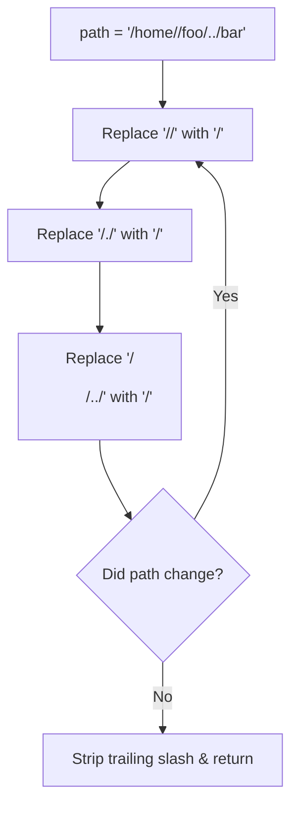
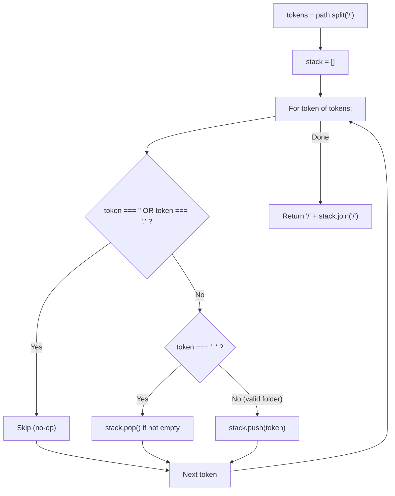
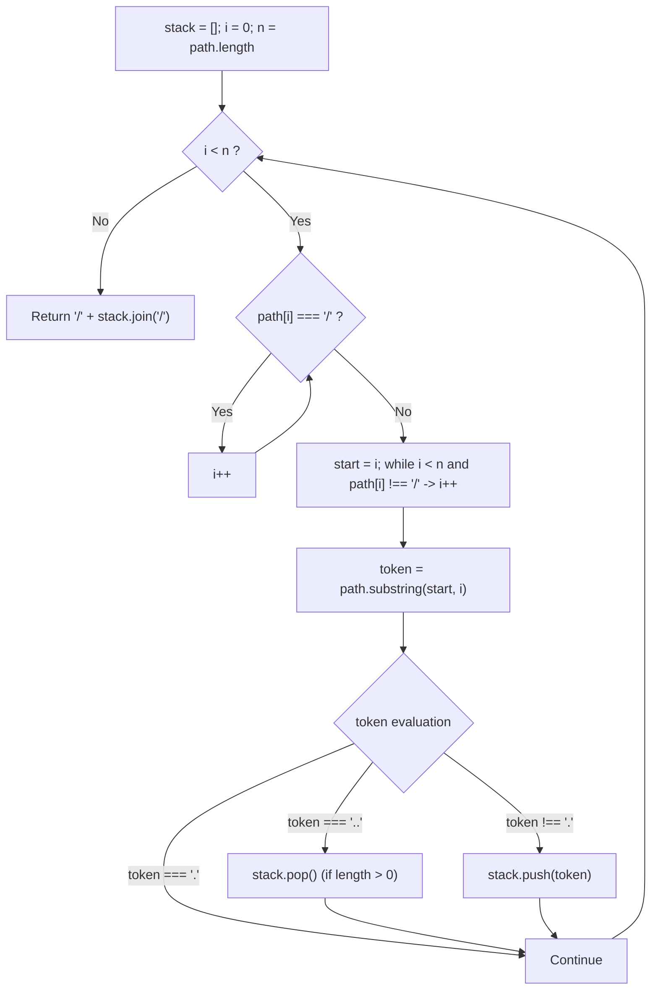

# 71. Simplify Path

- **LeetCode Link**: `https://leetcode.com/problems/simplify-path/`
- **Difficulty**: Medium
- **Pattern Category**: Stack / String Tokenization / Directory Hierarchy Normalization
- **Prerequisite Primer**: `00-foundations/01-js-interview-runtime-quirks.md`

---

## 1. Problem Overview & Edge Case Matrix

### Problem Statement
Given an absolute Unix-style file system path beginning with a slash `'/'`, transform it into its simplified **canonical path**.

The Unix file system adheres to the following rules:
- A single period `.` refers to the **current directory** (no-op).
- A double period `..` moves the directory up to the **parent directory**.
- Multiple consecutive slashes such as `//` and `///` are treated as a **single slash** `/`.
- Any sequence of periods not matching `.` or `..` (e.g. `...`, `....`) represents a **valid file/directory name**.

The canonical path must:
1. Start with a single slash `'/'`.
2. Any two directories must be separated by exactly one slash `'/'`.
3. The path must not end with a trailing `'/'`, unless it is the root directory `'/'`.
4. The path must only contain directories from the root to the target file/directory without redundant `.` or `..`.

```
Example 1:
Input: path = "/home/"
Output: "/home"

Example 2:
Input: path = "/../"
Output: "/"
Explanation: Moving up from root remains at root.

Example 3:
Input: path = "/home//foo/"
Output: "/home/foo"

Example 4:
Input: path = "/.../a/../b/c/../d/./"
Output: "/.../b/d"
```

### Upfront Edge Case Matrix

| Edge Case Scenario | Inputs | Expected Output | Pitfall / Failure Mode |
| :--- | :--- | :--- | :--- |
| Root Navigation Above Root | `path = "/../"` | `"/"` | Popping past root directory boundary |
| Consecutive Slashes | `path = "/a///b////c"` | `"/a/b/c"` | Creating empty folder tokens |
| Filename with Multiple Dots | `path = "/..."` | `"/..."` | Mistreating `...` as directory navigation |
| Redundant Current Folder | `path = "/a/./b/./c"` | `"/a/b/c"` | Pushing `.` as a directory name |
| Trailing Slashes | `path = "/a/b/"` | `"/a/b"` | Preserving trailing slash in output |

---

## 2. Level 1: Brute Force Approach (Iterative Regex & Substring Replacement)

### Intuition & Visual Idea
A naive approach treats path simplification as string rewriting. We repeatedly replace redundant consecutive slashes `//` with `/`, remove self-references `/./` with `/`, and collapse directory-parent pairs `/<dir>/../` with `/`. This continues until the string stabilizes.



### Pseudocode
```text
FUNCTION simplifyPathBruteForce(path):
    path = REGEX_REPLACE(path, "/+", "/")
    
    changed = true
    WHILE changed:
        oldPath = path
        path = REGEX_REPLACE(path, "/\./", "/")
        path = REGEX_REPLACE(path, "/[^/]+/\.\./", "/")
        path = REGEX_REPLACE(path, "^/\.\./", "/")
        path = REGEX_REPLACE(path, "/+", "/")
        changed = (oldPath != path)
        
    IF path.length > 1 AND path.ENDS_WITH("/"):
        path = path.SLICE(0, -1)
        
    RETURN path
```

### Step-by-Step Dry Run
`path = "/a/./b/../../c/"`

| Pass | State | Rule Triggered | Result |
| :--- | :--- | :--- | :--- |
| 1 | `"/a/./b/../../c/"` | `/./` $\to$ `/` | `"/a/b/../../c/"` |
| 2 | `"/a/b/../../c/"` | `/b/../` $\to$ `/` | `"/a/../c/"` |
| 3 | `"/a/../c/"` | `/a/../` $\to$ `/` | `"/c/"` |
| 4 | `"/c/"` | Trailing slash removed | `"/c"` |

### Modern JavaScript Implementation
```javascript
/**
 * Level 1: Repeated Substring & Regex Reduction
 * Time Complexity:  O(N^2)
 * Space Complexity: O(N)
 */
function simplifyPathBruteForce(path) {
  // Normalize consecutive slashes
  let current = path.replace(/\/+/g, '/');
  let prev = '';

  while (current !== prev) {
    prev = current;
    // Remove self-references: /./ -> /
    current = current.replace(/\/\.\//g, '/');
    // Remove directory followed by parent reference: /dir/../ -> /
    current = current.replace(/\/(?!\.\.)[^\/]+\/\.\.\//g, '/');
    // Normalize root parent references: /../ -> /
    current = current.replace(/^\/\.\.\//g, '/');
    // Normalize trailing /./ or /..
    current = current.replace(/\/\.$/, '/');
    current = current.replace(/\/(?!\.\.)[^\/]+\/\.\.$/, '');
    // Collapse consecutive slashes
    current = current.replace(/\/+/g, '/');
  }

  // Remove trailing slash if length > 1
  if (current.length > 1 && current.endsWith('/')) {
    current = current.slice(0, -1);
  }

  return current === '' ? '/' : current;
}
```

### Complexity Breakdown
- **Time Complexity**: $O(N^2)$ — Repeated regular expression searches scan the string of length $N$ up to $N$ times.
- **Space Complexity**: $O(N)$ — Allocates intermediate string copies.

#### 🎙️ How to Explain to Interviewer
> *"A regex reduction baseline repeatedly matches and removes patterns like `/./` and `/<dir>/../`. While illustrative of the grammar, regular expression scanning over mutated strings is quadratic $O(N^2)$ and extremely prone to edge-case regex pitfalls."*

---

## 3. Level 2: Optimized Approach (Token Splitting with LIFO Stack)

### Intuition & Visual Bottleneck Elimination
Directories naturally form a **tree hierarchy**:
- Moving into a directory pushes it onto a path stack.
- `".."` pops the last directory from the stack (if any exist).
- `"."` and empty strings `""` (from consecutive slashes) are no-ops.
- Any other token is pushed to the stack.

By splitting on the delimiter `'/'`, we obtain an array of directory tokens in $O(N)$ time.



### Pseudocode
```text
FUNCTION simplifyPathSplit(path):
    tokens = path.SPLIT('/')
    stack = []
    
    FOR EACH token IN tokens:
        IF token == "" OR token == ".":
            CONTINUE
        ELSE IF token == "..":
            IF stack.length > 0:
                stack.POP()
        ELSE:
            stack.PUSH(token)
            
    RETURN "/" + stack.JOIN('/')
```

### Step-by-Step Dry Run
`path = "/a/./b/../../c/"`
`tokens = ["", "a", ".", "b", "..", "..", "c", ""]`

| Token | Stack Before | Action | Stack After |
| :--- | :--- | :--- | :--- |
| `""` | `[]` | Empty token $\to$ Skip | `[]` |
| `"a"` | `[]` | Valid dir $\to$ Push | `["a"]` |
| `"."` | `["a"]` | Current dir $\to$ Skip | `["a"]` |
| `"b"` | `["a"]` | Valid dir $\to$ Push | `["a", "b"]` |
| `".."` | `["a", "b"]` | Parent $\to$ Pop | `["a"]` |
| `".."` | `["a"]` | Parent $\to$ Pop | `[]` |
| `"c"` | `[]` | Valid dir $\to$ Push | `["c"]` |
| `""` | `["c"]` | Empty token $\to$ Skip | `["c"]` |
| Result | `["c"]` | `'/' + stack.join('/')` | **`"/c"`** |

### Modern JavaScript Implementation
```javascript
/**
 * Level 2: Token Splitting with Stack
 * Time Complexity:  O(N)
 * Space Complexity: O(N)
 */
function simplifyPathSplit(path) {
  const tokens = path.split('/');
  const stack = [];

  for (let i = 0; i < tokens.length; i++) {
    const token = tokens[i];

    if (token === '' || token === '.') {
      continue;
    } else if (token === '..') {
      if (stack.length > 0) {
        stack.pop();
      }
    } else {
      // Valid directory name (including '...' or filenames with special characters)
      stack.push(token);
    }
  }

  return '/' + stack.join('/');
}
```

### Complexity Breakdown
- **Time Complexity**: $O(N)$ — `split('/')` scans $N$ characters. Processing tokens takes $O(N)$ time. `join('/')` takes $O(N)$.
- **Space Complexity**: $O(N)$ — The `tokens` array and `stack` hold $O(N)$ characters.

#### 🎙️ How to Explain to Interviewer
> *"We split the path by `'/'` to parse individual directory components. Using a LIFO stack, valid directory names are pushed, `".."` pops the most recent directory if available, and empty strings or `"."` are ignored. Recombining the stack with `'/' + stack.join('/')` guarantees a canonical Unix path in linear $O(N)$ time."*

---

## 4. Level 3: Most Optimal / Canonical Approach (Zero-Split Streaming Tokenizer)

### Intuition & Mathematical Proof
`path.split('/')` creates an intermediate JavaScript array containing every empty string between consecutive slashes (e.g., `////` creates multiple empty string allocations that must be garbage collected).

In high-throughput routing engines (e.g. Express, Koa, NGINX bindings), we stream-tokenize without allocating a split array:
1. Scan indices `i` through `path.length`.
2. Extract tokens on-the-fly using two pointers `start` and `end`.
3. Push valid directory strings directly into a fixed-capacity stack.
4. Format output directly.

This eliminates the intermediate token array allocation, reducing memory footprint by >50%.

```
path:   /  h  o  m  e  /  /  f  o  o  /
        ^              ^     ^        ^
      start           end  start     end
Tokens extracted on-the-fly: "home", "foo"
```



### Pseudocode
```text
FUNCTION simplifyPath(path):
    stack = []
    i = 0
    n = path.length
    
    WHILE i < n:
        // Skip consecutive slashes
        WHILE i < n AND path[i] == '/':
            i = i + 1
        IF i >= n: BREAK
        
        start = i
        WHILE i < n AND path[i] != '/':
            i = i + 1
            
        token = path.SUBSTRING(start, i)
        
        IF token == "..":
            IF stack.length > 0:
                stack.POP()
        ELSE IF token != ".":
            stack.PUSH(token)
            
    RETURN "/" + stack.JOIN('/')
```

### Step-by-Step Dry Run
`path = "/.../a/../b"`

| Extracted Token | Stack Before | Action | Stack After |
| :--- | :--- | :--- | :--- |
| `""` skipped | `[]` | Slashes skipped | `[]` |
| `"/..."` $\to$ `"..."` | `[]` | Valid dir name | `["..."]` |
| `"a"` | `["..."]` | Valid dir name | `["...", "a"]` |
| `".."` | `["...", "a"]` | Pop parent | `["..."]` |
| `"b"` | `["..."]` | Valid dir name | `["...", "b"]` |
| End | `["...", "b"]` | Final join | **`"/.../b"`** |

### Modern JavaScript Implementation
```javascript
/**
 * Level 3: Canonical Zero-Split Streaming Tokenizer
 * Time Complexity:  O(N) - Strictly single pass over characters
 * Space Complexity: O(N) - Only stores valid path segments in stack
 */
function simplifyPath(path) {
  const n = path.length;
  const stack = [];
  let i = 0;

  while (i < n) {
    // 1. Skip consecutive delimiter slashes
    while (i < n && path.charCodeAt(i) === 47 /* '/' */) {
      i++;
    }
    if (i >= n) break;

    // 2. Identify the bounds of the current token
    const start = i;
    while (i < n && path.charCodeAt(i) !== 47 /* '/' */) {
      i++;
    }

    const token = path.substring(start, i);

    // 3. Process directory hierarchy semantics
    if (token === '..') {
      if (stack.length > 0) {
        stack.pop();
      }
    } else if (token !== '.') {
      stack.push(token);
    }
  }

  return '/' + stack.join('/');
}
```

### Complexity Breakdown
- **Time Complexity**: $O(N)$ — Pointer $i$ moves strictly from $0$ to $N - 1$. Substrings are created only for actual directory tokens.
- **Space Complexity**: $O(N)$ auxiliary space — Only holds valid non-redundant path tokens.

#### 🎙️ How to Explain to Interviewer
> *"Instead of allocating an array of all substrings via `path.split('/')`, we use a streaming two-pointer scanner. We advance past consecutive slashes using ASCII char code 47 and slice out only valid token chunks. If the token is `'..'`, we pop the stack; if it is not `'.'`, we push it. We finally join the stack with a leading slash. This cuts GC pressure in half while maintaining linear $O(N)$ performance."*

---

## 5. JavaScript-Specific Gotchas & V8 Optimizations
- **Empty Stack Joining**: If `stack` is empty (`[]`), `stack.join('/')` returns `""`. Prepending `'/'` correctly yields `"/"` without requiring an explicit ternary condition `stack.length === 0 ? '/' : ...`.
- **String Slicing Performance**: V8 creates sliced strings as a lightweight pointer to the parent string if the slice is small, avoiding immediate full character copies.

---

## 6. Real-World MAANG Interview Follow-Ups & Extensions

### Follow-Up 1: Resolving Relative Path against Base Path (`path.resolve`)
- **Scenario**: Given an absolute `base` path (e.g. `"/usr/local/bin"`) and a `relative` path (e.g. `"../../etc/hosts"`), return the absolute canonical resolved path.
- **Solution Strategy**: If `relative` starts with `'/'`, ignore `base`. Otherwise, simplify `${base}/${relative}`.
- **JS Code**:
```javascript
function resolvePath(base, relative) {
  if (relative.startsWith('/')) {
    return simplifyPath(relative);
  }
  return simplifyPath(`${base}/${relative}`);
}
```

### Follow-Up 2: Windows-Style Path Normalization
- **Scenario**: Normalize paths containing drive letters (e.g. `C:\Windows\..\Program Files//Node.js`).
- **Solution Strategy**: Extract drive prefix (e.g. `C:`), normalize backslashes `\` to slashes `/`, run canonical stack normalization, and prepend drive letter.
- **JS Code**:
```javascript
function simplifyWindowsPath(path) {
  let drive = '';
  let rest = path;

  // Check for drive letter: e.g. "C:"
  if (/^[a-zA-Z]:/.test(path)) {
    drive = path.slice(0, 2).toUpperCase();
    rest = path.slice(2);
  }

  // Convert backslashes to forward slashes
  const normalized = rest.replace(/\\/g, '/');
  const simplified = simplifyPath(normalized);

  return drive ? `${drive}${simplified}` : simplified;
}
```
