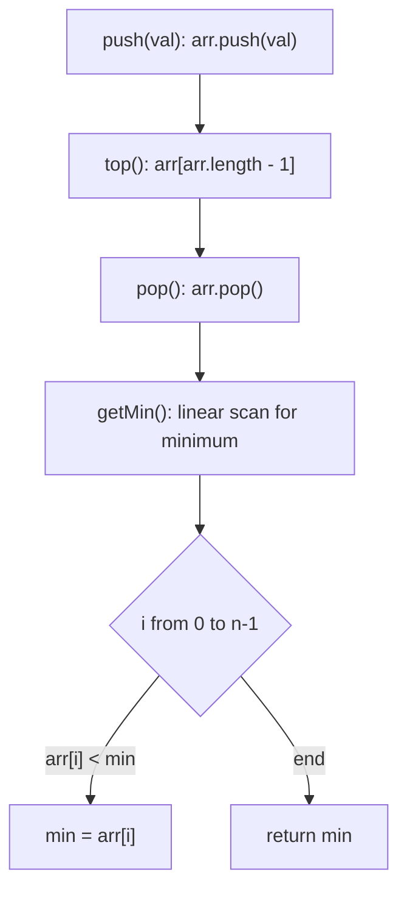
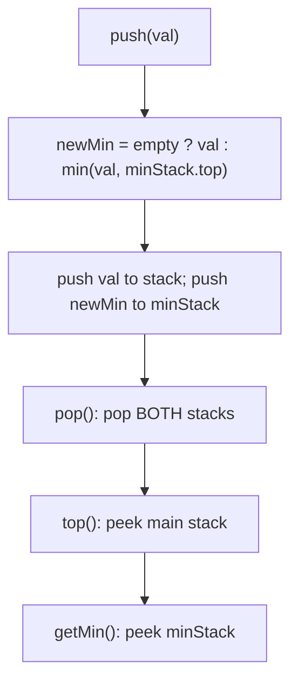
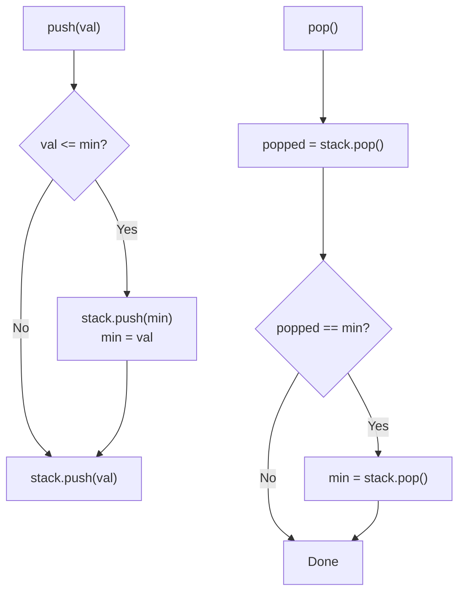

# 155. Min Stack

- **LeetCode Link**: `https://leetcode.com/problems/min-stack/`
- **Difficulty**: Medium
- **Pattern Category**: Stack / Auxiliary Min Tracking
- **Prerequisite Primer**: `00-foundations/02-data-structure-polyfills.md`

---

## 1. Problem Overview & Edge Case Matrix

### Problem Statement
Design a stack that supports `push`, `pop`, `top`, and retrieving the minimum element in constant time.

Implement the `MinStack` class:

- `MinStack()` initializes the stack object.
- `void push(int val)` pushes the element `val` onto the stack.
- `void pop()` removes the element on the top of the stack.
- `int top()` gets the top element of the stack.
- `int getMin()` retrieves the minimum element in the stack.

You must implement a solution with `O(1)` time complexity for each function.

```
Example 1:
Input: ["MinStack","push","push","push","getMin","pop","top","getMin"]
       [[],[-2],[0],[-3],[],[],[],[]]
Output: [null,null,null,null,-3,null,0,-2]
Explanation:
MinStack minStack = new MinStack();
minStack.push(-2);
minStack.push(0);
minStack.push(-3);
minStack.getMin(); // return -3
minStack.pop();
minStack.top();    // return 0
minStack.getMin(); // return -2
```

### Visual Problem Representation
```
push(-2)  push(0)  push(-3)   getMin()  pop()   top()  getMin()
+------+ +------+ +------+     |         |       |      |
| -2   | |  0   | | -3   | <- top    -3      |  0   |  -2
| -2   | | -2   | | -2   |             | -2   | | -2   | | -2 |
+------+ +------+ +------+   min = -3  min=-2  top=0  min=-2
 stack    stack    stack
```

### Upfront Edge Case Matrix
| Edge Case Category | Specific Input Scenario | Expected Behavior | Pitfall / Risk |
| :--- | :--- | :--- | :--- |
| Empty / Nil | `pop()` / `top()` on empty stack | No crash (guard or no-op) | Undefined array access, `undefined` leak |
| Single Element | `push(5)`, `getMin()` | Return `5` | Min tracker uninitialized |
| All Identical / Duplicates | `push(0); push(1); push(0); getMin()` | Return `0` after pops correctly | Strict `<` drops duplicate mins, pop loses min |
| Negative / Extreme Values | `push(-2^31); push(2^31-1)` | Correct min `-2^31` | `Number.MAX_SAFE_INTEGER` overflow, sign bugs |
| Interleaved push/pop | `push(-2); push(0); push(-3); pop(); getMin()` | Return `-2` | Stale cached min after pop |

---

## 2. Level 1: Brute Force Approach

### Intuition & Visual Idea
Store values in a plain array. For `getMin`, scan the whole array with a linear pass. Push/pop/top are trivially `O(1)`; `getMin` pays `O(N)` per call. Simple and obviously correct — the baseline to beat.



### Pseudocode
```text
FUNCTION MinStackBruteForce():
    arr = []

FUNCTION push(val):
    arr.APPEND(val)

FUNCTION pop():
    arr.POP()

FUNCTION top():
    RETURN arr[arr.LENGTH - 1]

FUNCTION getMin():
    min = arr[0]
    FOR EACH x IN arr:
        IF x < min: min = x
    RETURN min
```

### Step-by-Step Dry Run (Visual Trace)
| Step | Operation | Current Value | State / Stack | Action Taken |
| :--- | :--- | :--- | :--- | :--- |
| 0 | `push(-2)` | `val = -2` | `[-2]` | Append |
| 1 | `push(0)` | `val = 0` | `[-2, 0]` | Append |
| 2 | `push(-3)` | `val = -3` | `[-2, 0, -3]` | Append |
| 3 | `getMin()` | scan all | `[-2, 0, -3]` | Linear scan returns `-3` |
| 4 | `pop()` | remove `-3` | `[-2, 0]` | Pop top |
| 5 | `top()` | `0` | `[-2, 0]` | Return last element |
| 6 | `getMin()` | scan all | `[-2, 0]` | Linear scan returns `-2` |

### Modern JavaScript Implementation
```javascript
/**
 * Level 1: Brute Force
 * Time Complexity:  push O(1), pop O(1), top O(1), getMin O(N)
 * Space Complexity: O(N) for the values array
 */
class MinStackBruteForce {
  constructor() {
    // Plain backing store; no auxiliary state.
    this.stack = [];
  }

  push(val) {
    this.stack.push(val);
  }

  pop() {
    // Guard against empty pop so callers never throw.
    if (this.stack.length === 0) return;
    this.stack.pop();
  }

  top() {
    // Returns undefined when empty; LeetCode guarantees non-empty on top().
    return this.stack[this.stack.length - 1];
  }

  getMin() {
    // Linear scan: obviously correct, O(N) per call.
    let min = this.stack[0];
    for (let i = 1; i < this.stack.length; i++) {
      if (this.stack[i] < min) min = this.stack[i];
    }
    return min;
  }
}
```

### Complexity Breakdown
- **Time Complexity**: $O(1)$ for push/pop/top, $O(N)$ for getMin — full scan per query.
- **Space Complexity**: $O(N)$ — one array of $N$ pushed values, no auxiliary structures.

---

## 3. Level 2: Optimized Approach

### Intuition & Visual Bottleneck Elimination
The bottleneck is recomputing the minimum from scratch. Eliminate it by maintaining a parallel `minStack` where `minStack[i]` holds the minimum of `stack[0..i]`. On push, push `min(val, prevMin)`; on pop, pop both. `getMin` becomes a peek.



### Pseudocode
```text
FUNCTION MinStackOptimized():
    stack = []
    minStack = []

FUNCTION push(val):
    stack.APPEND(val)
    IF minStack IS EMPTY:
        minStack.APPEND(val)
    ELSE:
        minStack.APPEND(MIN(val, minStack.TOP()))

FUNCTION pop():
    stack.POP()
    minStack.POP()

FUNCTION top():
    RETURN stack.TOP()

FUNCTION getMin():
    RETURN minStack.TOP()
```

### Step-by-Step Dry Run (Visual Trace)
| Step | Operation | Stack | MinStack | Decision Logic |
| :--- | :--- | :--- | :--- | :--- |
| 0 | `push(-2)` | `[-2]` | `[-2]` | Empty, min = `-2` |
| 1 | `push(0)` | `[-2, 0]` | `[-2, -2]` | `min(0, -2) = -2` |
| 2 | `push(-3)` | `[-2, 0, -3]` | `[-2, -2, -3]` | `min(-3, -2) = -3` |
| 3 | `getMin()` | unchanged | peek `-3` | Return `-3` |
| 4 | `pop()` | `[-2, 0]` | `[-2, -2]` | Pop both stacks |
| 5 | `top()` | peek `0` | peek `-2` | Return `0` |
| 6 | `getMin()` | unchanged | peek `-2` | Return `-2` |

### Modern JavaScript Implementation
```javascript
/**
 * Level 2: Optimized (parallel min stack)
 * Time Complexity:  O(1) for all operations
 * Space Complexity: O(N) values + O(N) mins = O(N)
 */
class MinStackOptimized {
  constructor() {
    this.stack = [];
    // minStack[i] = minimum of stack[0..i].
    this.minStack = [];
  }

  push(val) {
    this.stack.push(val);
    // Carry forward the running minimum so peek is always current.
    if (this.minStack.length === 0) {
      this.minStack.push(val);
    } else {
      const prevMin = this.minStack[this.minStack.length - 1];
      this.minStack.push(val < prevMin ? val : prevMin);
    }
  }

  pop() {
    if (this.stack.length === 0) return;
    this.stack.pop();
    this.minStack.pop();
  }

  top() {
    return this.stack[this.stack.length - 1];
  }

  getMin() {
    return this.minStack[this.minStack.length - 1];
  }
}
```

### Complexity Breakdown
- **Time Complexity**: $O(1)$ — every method is a constant number of array push/pop/peek operations.
- **Space Complexity**: $O(N)$ — two arrays of length $N$; doubles memory vs Level 1 but buys $O(1)$ queries.

---

## 4. Level 3: Most Optimal / Canonical Approach

### Intuition & Mathematical / Invariant Proof
Keep one stack of `[value, currentMin]` pairs (equivalently: push to a min-stack only when `val <= currentMin`, using `<=` to preserve duplicates). Invariant: the top entry's stored min equals the minimum of all entries below it. Pop restores the previous min automatically — no recomputation, no parallel-array drift.

```
push(-2):  [(-2,-2)]
push(0):   [(-2,-2), (0,-2)]      <- min carried down
push(-3):  [(-2,-2), (0,-2), (-3,-3)]  <- new min
pop():     [(-2,-2), (0,-2)]      <- previous min restored for free
```

### Pseudocode
```text
FUNCTION MinStack():
    stack = []  // each entry: [value, minSoFar]

FUNCTION push(val):
    IF stack IS EMPTY:
        stack.APPEND([val, val])
    ELSE:
        curMin = stack.TOP()[1]
        stack.APPEND([val, MIN(val, curMin)])

FUNCTION pop():
    stack.POP()

FUNCTION top():
    RETURN stack.TOP()[0]

FUNCTION getMin():
    RETURN stack.TOP()[1]
```

### Step-by-Step Dry Run (Visual Trace)
| Step | Pointer $L$ | Operation | Invariant Checked | In-Place State |
| :--- | :--- | :--- | :--- | :--- |
| 0 | top=-1 | `push(-2)` | Empty, min=`-2` | `[(-2,-2)]` |
| 1 | top=0 | `push(0)` | `min(0,-2)=-2` | `[(-2,-2),(0,-2)]` |
| 2 | top=1 | `push(-3)` | `min(-3,-2)=-3` | `[...,(-3,-3)]` |
| 3 | top=2 | `getMin()` | Top pair min = `-3` | Returns `-3` |
| 4 | top=2 | `pop()` | Drop `(-3,-3)` | `[(-2,-2),(0,-2)]` |
| 5 | top=1 | `top()` | Top pair value = `0` | Returns `0` |
| 6 | top=1 | `getMin()` | Top pair min = `-2` | Returns `-2` |

### Modern JavaScript Implementation
```javascript
/**
 * Level 3: Most Optimal / Canonical (single stack of pairs)
 * Time Complexity:  O(1) for push, pop, top, getMin
 * Space Complexity: O(N) — one entry per push, self-restoring min
 */
class MinStack {
  constructor() {
    // Each entry: [value, minimum of stack up to and including this entry].
    this.stack = [];
  }

  push(val) {
    if (this.stack.length === 0) {
      this.stack.push([val, val]);
      return;
    }
    // Carry the running minimum; <= semantics keep duplicate mins alive.
    const curMin = this.stack[this.stack.length - 1][1];
    this.stack.push([val, val < curMin ? val : curMin]);
  }

  pop() {
    if (this.stack.length === 0) return;
    this.stack.pop();
  }

  top() {
    return this.stack[this.stack.length - 1][0];
  }

  getMin() {
    return this.stack[this.stack.length - 1][1];
  }
}
```

### Complexity Breakdown
- **Time Complexity**: $O(1)$ — optimal lower bound; each op touches only the top entry.
- **Space Complexity**: $O(N)$ auxiliary — one pair per element; single structure so no dual-stack sync bugs.

---

## 5. JavaScript-Specific Gotchas & V8 Optimizations
- **GC Pressure**: Avoid allocating objects inside tight loops ($O(N)$ closures). The pair-array `[val, min]` is the minimal allocation; never create `{ value, min }` objects per push in hot paths — object shapes cost more than 2-element packed arrays.
- **Type Coercion / Sorting**: Never derive min via `Math.min(...stack)` — spread on $N = 10^4+$ blows the call stack and de-optimizes. Keep the running min incrementally instead.
- **Index Bounds**: Guard `top()`/`pop()` on empty stacks; V8 holey-array access returns `undefined`, and `undefined[1]` throws. Always check `this.stack.length === 0` first without sparse-array tricks.

---

## 6. Real-World MAANG Interview Follow-Ups & Extensions

### Follow-Up 1: MaxStack — symmetric maximum tracking
- **Scenario**: Extend the design to support `getMax()` alongside `getMin()` in $O(1)$.
- **Solution Strategy**: Store triples `[val, minSoFar, maxSoFar]` or two auxiliary stacks. Same invariant, mirrored comparison.
- **JS Code / Implementation Pattern**:
```javascript
function pushTriple(stack, val) {
  const top = stack[stack.length - 1];
  const mn = top ? Math.min(val, top[1]) : val;
  const mx = top ? Math.max(val, top[2]) : val;
  stack.push([val, mn, mx]);
}
```

### Follow-Up 2: Min Queue / sliding-window minimum over a stream
- **Scenario**: Support enqueue/dequeue with $O(1)$ amortized `getMin()` for a streaming window of $N = 10^9$ events.
- **Solution Strategy**: Two MinStacks (inbox/outbox) emulate a queue; each stack tracks its own min, queue min = `min(in.min, out.min)`. Amortized $O(1)$ dequeue.
- **JS Code / Implementation Pattern**:
```javascript
function queueMin(inStack, outStack) {
  const a = inStack.length ? inStack[inStack.length - 1][1] : Infinity;
  const b = outStack.length ? outStack[outStack.length - 1][1] : Infinity;
  return Math.min(a, b);
}
```

### Follow-Up 3: Persistent / concurrent stack with versioned minimums
- **Scenario & In-Depth Solution**: Readers snapshot the stack while writers push. Make push return a new persistent head node `{ val, min, prev }` instead of mutating — $O(1)$ immutable push/pop with structural sharing; `getMin` reads `head.min`. Writers never block readers.
```javascript
function persistentPush(head, val) {
  const min = head === null ? val : Math.min(val, head.min);
  return { val, min, prev: head };
}
```

---

## 7. What LeetCode Discuss Says (Language-Independent)

Source: top-voted post by sometimescrazy —
`https://leetcode.com/problems/min-stack/solutions/49014/java-accepted-solution-using-one-stack-b-coh8/`
— 220.6K views / 1.4K votes / 165 comments.
Language-independent summary. No new JS here.

### A. Optimal way from Discuss (Single Stack with Previous-Min Pushing)

Standard solutions maintain two parallel stacks or allocate pairs `[val, currentMin]` on every push. The top-voted post uses a single primitive stack:
- Whenever a new value $x \le currentMin$ arrives, push the *old* `currentMin` onto the stack immediately before pushing $x$, then update `currentMin = x`.
- On `pop()`, pop the top element. If the popped element equals `currentMin`, pop *again* to restore the previous minimum from history: `currentMin = stack.pop()`.

```text
CLASS MinStack:
    min = +INFINITY
    stack = empty Stack

    METHOD push(val):
        IF val <= min:
            stack.push(min)
            min = val
        stack.push(val)

    METHOD pop():
        popped = stack.pop()
        IF popped == min:
            min = stack.pop()

    METHOD top():
        RETURN stack.peek()

    METHOD getMin():
        RETURN min
```

- Time: O(1) for all operations (`push`, `pop`, `top`, `getMin`).
- Space: O(N) worst-case (strictly decreasing sequence pushes $2N$ items), but $O(1)$ extra space beyond standard stack when values exceed current minimum.



### B. Dry run on duplicate minimums (`push(0), push(1), push(0), getMin(), pop(), getMin()`)

| Op | Argument | Condition Check | Stack State (top on right) | `min` |
| :--- | :--- | :--- | :--- | :--- |
| Init | - | - | `[]` | $\infty$ |
| `push(0)` | 0 | $0 \le \infty$ (True) $\rightarrow$ push $\infty$, `min = 0` | `[$\infty$, 0]` | 0 |
| `push(1)` | 1 | $1 \le 0$ (False) $\rightarrow$ push 1 | `[$\infty$, 0, 1]` | 0 |
| `push(0)` | 0 | $0 \le 0$ (True) $\rightarrow$ push 0, `min = 0` | `[$\infty$, 0, 1, 0, 0]` | 0 |
| `getMin()` | - | Return `min` | `[$\infty$, 0, 1, 0, 0]` | 0 |
| `pop()` | - | Popped 0 == `min` (0) $\rightarrow$ pop again: `min = 0` | `[$\infty$, 0, 1]` | 0 |
| `getMin()` | - | Return `min` | `[$\infty$, 0, 1]` | 0 |

### C. Why This Beats Two Parallel Stacks

- **Allocation overhead:** No paired objects `{val, min}` or secondary stack arrays allocated.
- **Cache-friendly:** All elements live contiguously in a single buffer.

### D. Pitfalls from comments

- **The `<=` condition vs `<`:** The check during `push` MUST be `val <= min`, NOT `val < min`. If two identical minimum values are inserted without pushing the previous minimum duplicate, the first `pop()` will restore an older minimum prematurely.
- **Wrapper object equality in Java:** Comparing `stack.pop() == min` using reference equality with boxed `Integer` objects can fail outside the $-128$ to $127$ cache range. Unboxing or `.intValue()` is mandatory.
- **Underflow on `top()` or `getMin()`:** Callers must not invoke `top()` or `getMin()` on an empty stack per problem constraints ($1 \le \text{operations}$).

### E. Companies

- Discuss post itself names none.
  Companies tab on LeetCode is premium-locked.
- External source:
  `https://github.com/liquidslr/leetcode-company-wise-problems`
  (LeetCode company tags, updated June 2025).
- All-time (37): Adobe, Amazon, Apple, Bloomberg, Citadel, Flipkart, Google, IBM, IMC, Informatica, Infosys, Intel, LinkedIn, Lucid, Lyft, Meta, Microsoft, Nike, Nvidia, Odoo, Oracle, Ozon, Palo Alto Networks, Paytm, Salesforce, Sigmoid, Snap, Snowflake, TCS, Tinkoff, Tripadvisor, Uber, UiPath, Vimeo, Walmart Labs, Yandex, Zenefits.
- Recent: 30 days — none.
- Recent: 3 months — Amazon, Google, Meta, Microsoft.
