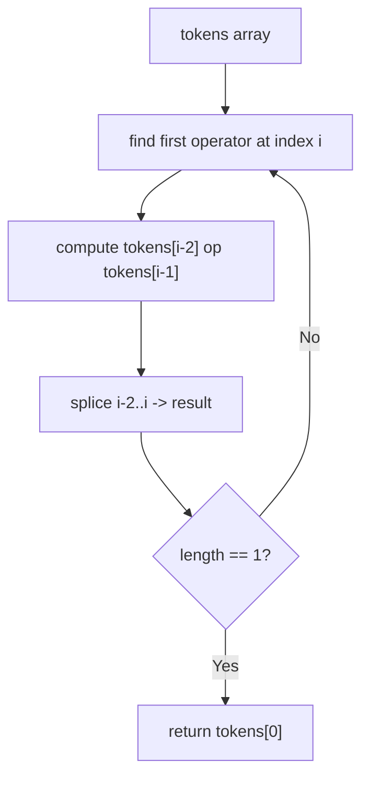
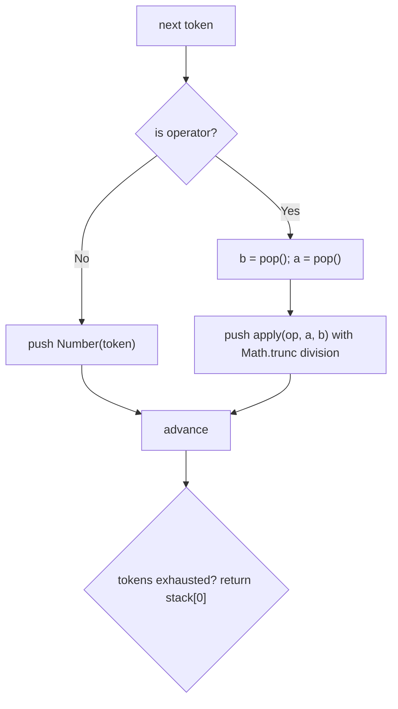
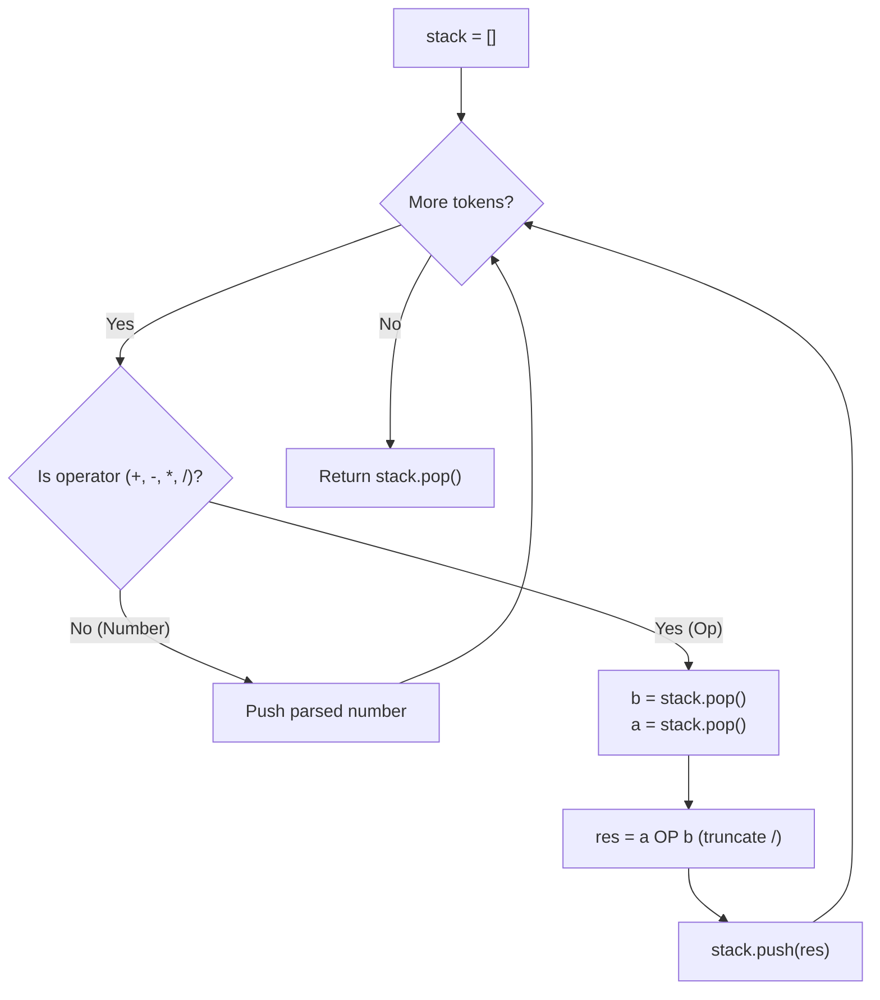

# 150. Evaluate Reverse Polish Notation

- **LeetCode Link**: `https://leetcode.com/problems/evaluate-reverse-polish-notation/`
- **Difficulty**: Medium
- **Pattern Category**: Stack / Postfix Expression Evaluation
- **Prerequisite Primer**: `00-foundations/03-core-algorithmic-patterns.md`

---

## 1. Problem Overview & Edge Case Matrix

### Problem Statement
You are given an array of strings `tokens` that represents an arithmetic expression in Reverse Polish Notation (postfix).

Evaluate the expression. Return an integer that represents the value of the expression.

Valid operators are `+`, `-`, `*`, `/`. Each operand may be an integer or another expression. Division between two integers truncates toward zero. It is guaranteed that the given RPN expression is always valid.

```
Example 1:
Input: tokens = ["2","1","+","3","*"]
Output: 9
Explanation: ((2 + 1) * 3) = 9

Example 2:
Input: tokens = ["4","13","5","/","+"]
Output: 6
Explanation: (4 + (13 / 5)) = 6

Example 3:
Input: tokens = ["10","6","9","3","+","-11","*","/","*","17","+","5","+"]
Output: 22
```

### Visual Problem Representation
```
tokens = ["2","1","+","3","*"]

  push 2    push 1    "+" -> 2+1=3    push 3    "*" -> 3*3=9
+------+  +------+  +----------+  +----------+  +----------+
|  2   |  |  1   |  |    3     |  |  3, 3    |  |    9     |
|  2   |  |  2   |  |          |  |          |  |          |
+------+  +------+  +----------+  +----------+  +----------+
```

### Upfront Edge Case Matrix
| Edge Case Category | Specific Input Scenario | Expected Behavior | Pitfall / Risk |
| :--- | :--- | :--- | :--- |
| Empty / Nil | `tokens = []` (defensive; LeetCode guarantees length >= 1) | Return `0` or throw cleanly | Pop from empty stack |
| Single Element | `tokens = ["18"]` | Return `18` | Operator lookup on a number |
| Negative division truncation | `tokens = ["4","-3","/"]` | Return `-1` (`Math.trunc`) | `Math.floor(-1.33) = -2` off-by-one |
| Long chain | `tokens = ["2","1","+","3","*"]` | Return `9` | Operand order swap on `-` and `/` |
| Large values | `tokens = ["10","6","9","3","+","-11","*","/","*","17","+","5","+"]` | Return `22` | Overflow beyond 32-bit, float drift |

---

## 2. Level 1: Brute Force Approach

### Intuition & Visual Idea
Repeatedly scan for the first operator, combine it with its two preceding operands, and splice the triple down to its result. Correct but each splice shifts the array — $O(N^2)$ total work.



### Pseudocode
```text
FUNCTION evalRPNBruteForce(tokens):
    arr = COPY(tokens)
    WHILE arr.LENGTH > 1:
        i = FIRST INDEX WHERE arr[i] IS OPERATOR
        a = NUMBER(arr[i-2]); b = NUMBER(arr[i-1])
        res = APPLY(arr[i], a, b)
        arr.SPLICE(i-2, 3, STRING(res))
    RETURN NUMBER(arr[0])
```

### Step-by-Step Dry Run (Visual Trace)
| Step | Iteration / Pointer ($i, j$) | Current Value | State / Sub-array | Action Taken |
| :--- | :--- | :--- | :--- | :--- |
| 0 | scan for op | `"+"` at `i=2` | `["2","1","+","3","*"]` | Found first operator |
| 1 | combine | `2 + 1 = 3` | `["3","3","*"]` | Splice `0..2` to `"3"` |
| 2 | scan for op | `"*"` at `i=2` | `["3","3","*"]` | Found operator |
| 3 | combine | `3 * 3 = 9` | `["9"]` | Splice to `"9"`, return `9` |

### Modern JavaScript Implementation
```javascript
/**
 * Level 1: Brute Force
 * Time Complexity:  O(N^2) — rescan + splice per operator
 * Space Complexity: O(N) — mutable copy of tokens
 */
function evalRPNBruteForce(tokens) {
  // Work on a copy so the caller's array is untouched.
  const arr = tokens.slice();
  const isOp = (t) => t === '+' || t === '-' || t === '*' || t === '/';

  const apply = (op, a, b) => {
    if (op === '+') return a + b;
    if (op === '-') return a - b;
    if (op === '*') return a * b;
    // Truncation toward zero is required by the spec.
    return Math.trunc(a / b);
  };

  while (arr.length > 1) {
    // Find the leftmost reducible operator triple.
    const i = arr.findIndex(isOp);
    const res = apply(arr[i], Number(arr[i - 2]), Number(arr[i - 1]));
    // Collapse three slots into one result slot.
    arr.splice(i - 2, 3, String(res));
  }
  return Number(arr[0]);
}
```

### Complexity Breakdown
- **Time Complexity**: $O(N^2)$ — up to $N/2$ operators, each `findIndex` + `splice` costs $O(N)$.
- **Space Complexity**: $O(N)$ — the mutable copy plus result strings.

---

## 3. Level 2: Optimized Approach

### Intuition & Visual Bottleneck Elimination
Eliminate rescanning: single left-to-right pass with an operand stack. Push numbers; on an operator, pop two operands, apply, push the result. Each token is visited exactly once.



### Pseudocode
```text
FUNCTION evalRPNOptimized(tokens):
    stack = []
    FOR EACH t IN tokens:
        IF t IS OPERATOR:
            b = stack.POP(); a = stack.POP()
            stack.PUSH(APPLY(t, a, b))
        ELSE:
            stack.PUSH(NUMBER(t))
    RETURN stack[0]
```

### Step-by-Step Dry Run (Visual Trace)
| Step | Pointers / Window | Hash Map / Auxiliary State | Decision Logic | Output Accumulator |
| :--- | :--- | :--- | :--- | :--- |
| 1 | `t = "2"` | stack `[]` | Operand, push | `[2]` |
| 2 | `t = "1"` | stack `[2]` | Operand, push | `[2, 1]` |
| 3 | `t = "+"` | pop `1`, `2` | `2 + 1 = 3`, push | `[3]` |
| 4 | `t = "3"` | stack `[3]` | Operand, push | `[3, 3]` |
| 5 | `t = "*"` | pop `3`, `3` | `3 * 3 = 9`, push | `[9]` |

### Modern JavaScript Implementation
```javascript
/**
 * Level 2: Optimized (single-pass operand stack)
 * Time Complexity:  O(N) — each token visited once
 * Space Complexity: O(N) — operand stack
 */
function evalRPNOptimized(tokens) {
  const stack = [];
  // Dispatch map keeps the hot loop branch-free and readable.
  const ops = {
    '+': (a, b) => a + b,
    '-': (a, b) => a - b,
    '*': (a, b) => a * b,
    '/': (a, b) => Math.trunc(a / b),
  };

  for (const t of tokens) {
    if (t in ops) {
      // Order matters: a is the deeper operand (left), b is top (right).
      const b = stack.pop();
      const a = stack.pop();
      stack.push(ops[t](a, b));
    } else {
      stack.push(Number(t));
    }
  }
  return stack[0];
}
```

### Complexity Breakdown
- **Time Complexity**: $O(N)$ — one pass, $O(1)$ work per token.
- **Space Complexity**: $O(N)$ — operand stack holds at most $N$ numbers.

---

## 4. Level 3: Most Optimal / Canonical Approach

### Intuition & Mathematical / Invariant Proof
Same $O(N)$ single pass, hardened for production: `Set` operator lookup (no prototype-chain surprises from `in`), strict token validation, explicit empty-input guard, and `Math.trunc` division. Invariant: after processing prefix $t_0..t_k$, the stack holds exactly the values of fully-reduced subexpressions in order.

```
["4","13","5","/","+"]: push 4, push 13, push 5
  "/" -> trunc(13/5)=2, push 2  => [4, 2]
  "+" -> 4+2=6                  => [6]
```

### Pseudocode
```text
FUNCTION evalRPN(tokens):
    IF tokens IS EMPTY: RETURN 0
    stack = []
    OPS = SET("+", "-", "*", "/")
    FOR EACH t IN tokens:
        IF t IN OPS:
            b = stack.POP(); a = stack.POP()
            IF op is "/": stack.PUSH(TRUNC(a / b))
            ELSE: stack.PUSH(APPLY(t, a, b))
        ELSE IF t IS VALID INTEGER STRING:
            stack.PUSH(NUMBER(t))
        ELSE: THROW Error("invalid token")
    RETURN stack[0]
```

### Step-by-Step Dry Run (Visual Trace)
| Step | Pointer $L$ | Pointer $R$ | Invariant Checked | In-Place State |
| :--- | :--- | :--- | :--- | :--- |
| 1 | `t="4"` | stack `[]` | Valid number, push | `[4]` |
| 2 | `t="13"` | stack `[4]` | Valid number, push | `[4, 13]` |
| 3 | `t="5"` | stack `[4, 13]` | Valid number, push | `[4, 13, 5]` |
| 4 | `t="/"` | pop `5`, `13` | `trunc(13/5)=2` | `[4, 2]` |
| 5 | `t="+"` | pop `2`, `4` | `4+2=6` | `[6]` return `6` |

### Modern JavaScript Implementation
```javascript
/**
 * Level 3: Most Optimal / Canonical
 * Time Complexity:  O(N) — single pass, optimal lower bound (must read all tokens)
 * Space Complexity: O(N) — operand stack
 */
function evalRPN(tokens) {
  // Defensive guard: LeetCode guarantees >= 1 token, but callers may not.
  if (tokens.length === 0) return 0;

  const stack = [];
  // Set avoids prototype-chain hits that `t in ops` would suffer (e.g. "toString").
  const OPS = new Set(['+', '-', '*', '/']);

  for (const t of tokens) {
    if (!OPS.has(t)) {
      // Reject malformed tokens early instead of pushing NaN downstream.
      if (!/^-?\d+$/.test(t)) throw new Error(`Invalid token: ${t}`);
      stack.push(Number(t));
      continue;
    }
    const b = stack.pop();
    const a = stack.pop();
    let res;
    if (t === '+') res = a + b;
    else if (t === '-') res = a - b;
    else if (t === '*') res = a * b;
    else res = Math.trunc(a / b); // trunc toward zero, not floor
    stack.push(res);
  }
  return stack[0];
}
```

### Complexity Breakdown
- **Time Complexity**: $O(N)$ — optimal lower bound; every token must be read once.
- **Space Complexity**: $O(N)$ — operand stack; $O(1)$ auxiliary besides input.

---

## 5. JavaScript-Specific Gotchas & V8 Optimizations
- **GC Pressure**: Avoid allocating objects inside tight loops ($O(N)$ closures). Use a static dispatch or `if/else` chain — never build a new arrow-function map per call inside the loop.
- **Type Coercion / Sorting**: `Number(t)` handles `"-11"` correctly; `parseInt` without radix is legacy-risky and `Math.floor(a/b)` breaks negatives — always `Math.trunc(a / b)` for trunc-toward-zero division.
- **Index Bounds**: `stack.pop()` on an empty stack yields `undefined`, and `undefined - 1` is `NaN` that poisons everything downstream. Validate tokens and trust (or assert) the "always valid RPN" guarantee at the boundary.

---

## 6. Real-World MAANG Interview Follow-Ups & Extensions

### Follow-Up 1: Infix expressions with precedence and parentheses
- **Scenario**: Extend from postfix to infix like `"3 + 2 * 2"` and `"(1+(4+5+2)-3)+(6+8)"` (Basic Calculator I/II bridge).
- **Solution Strategy**: Shunting-yard: operator stack with precedence map, pop while top precedence >= current; parentheses push/pop as barriers. Same operand stack as Level 3.
- **JS Code / Implementation Pattern**:
```javascript
function precedence(op) {
  if (op === '+' || op === '-') return 1;
  if (op === '*' || op === '/') return 2;
  return 0;
}
```

### Follow-Up 2: Streaming RPN over 10^9 tokens that never fits in memory
- **Scenario**: Tokens arrive over a network stream; the operand stack itself may still fit but the token array never materializes.
- **Solution Strategy**: Async-generator consumer: `for await (const t of stream)` with the Level 3 loop unchanged; checkpoint the stack to disk every $10^6$ ops for crash recovery.
- **JS Code / Implementation Pattern**:
```javascript
async function evalRPNStream(tokenStream) {
  const stack = [];
  for await (const t of tokenStream) {
    if (t === '+') stack.push(stack.pop() + stack.pop());
    else stack.push(Number(t));
  }
  return stack[0];
}
```

### Follow-Up 3: Parallel evaluation via expression trees and workers
- **Scenario & In-Depth Solution**: Split a huge RPN program into independent subtrees, evaluate each in a Node.js worker thread, then combine. Convert RPN to an expression tree (operators become parent nodes), partition at depth $d$, and farm subtrees via `worker_threads`; join with the same `apply` semantics.
```javascript
// Worker partition handler: evaluates an RPN slice with its own stack
function evalSlice(slice) {
  return evalRPN(slice); // reuse canonical evaluator per worker
}
```

---

## 7. What LeetCode Discuss Says (Language-Independent)

Source: top-voted post by Pablo Valdes —
`https://leetcode.com/problems/evaluate-reverse-polish-notation/solutions/47430/java-accepted-code-stack-implementation-h2vxv/`
— 82K views / 310 votes / 65 comments.
Language-independent summary. No new JS here.

### A. Optimal way from Discuss (Operand Stack Evaluation)

Reverse Polish Notation (postfix) eliminates the need for parentheses and operator precedence rules. An operand stack evaluates expressions in a single forward pass:
- When a numeric token is encountered, convert it to an integer and push it onto the stack.
- When an operator is encountered, pop the top two numbers: the first popped is operand `b` (right-hand operand), and the second popped is operand `a` (left-hand operand).
- Perform `a OP b`, truncate division results toward zero, and push the outcome back onto the stack.

```text
FUNCTION evalRPN(tokens):
    stack = empty Stack
    
    FOR EACH token IN tokens:
        IF token == "+":
            b = stack.pop(); a = stack.pop()
            stack.push(a + b)
        ELSE IF token == "-":
            b = stack.pop(); a = stack.pop()
            stack.push(a - b)
        ELSE IF token == "*":
            b = stack.pop(); a = stack.pop()
            stack.push(a * b)
        ELSE IF token == "/":
            b = stack.pop(); a = stack.pop()
            stack.push(TRUNCATE_TOWARD_ZERO(a / b))
        ELSE:
            stack.push(PARSE_INT(token))
            
    RETURN stack.pop()
```

- Time: O(N) where N is the number of tokens. Each token is pushed and popped at most twice.
- Space: O(N) in the worst case to hold intermediate operands.



### B. Dry run on LeetCode Example 2 (`tokens = ["4","13","5","/","+"]`)

| Token | Type | Action | Stack State (top on right) |
| :--- | :--- | :--- | :--- |
| `"4"` | Number | Push 4 | `[4]` |
| `"13"` | Number | Push 13 | `[4, 13]` |
| `"5"` | Number | Push 5 | `[4, 13, 5]` |
| `"/"` | Operator | `b = 5, a = 13` $\rightarrow$ `trunc(13 / 5) = 2`, push 2 | `[4, 2]` |
| `"+"` | Operator | `b = 2, a = 4` $\rightarrow$ `4 + 2 = 6`, push 6 | `[6]` |

Final Output: `6`.

### C. The LIFO Operand Order Invariant

For non-commutative operators (`-` and `/`), order of evaluation is critical:
- In expression `a b -`, `a` was pushed before `b`.
- LIFO popping yields `b` first, then `a`.
- The operation must evaluate `a - b` and `a / b`, never `b - a` or `b / a`.

### D. Pitfalls from comments

- **Floor division vs truncation toward zero:** Standard integer division in languages like Python (`//`) floors toward $-\infty$ (e.g. `6 // -132` gives `-1`), whereas LeetCode specifies truncation toward zero (yielding `0`). Use `int(a / b)` in Python or `Math.trunc(a / b)` in JS.
- **Negative number token confusion:** Negative integer tokens like `"-3"` start with a minus sign. Distinguishing operators from numbers must check string equality `token == "-"` rather than `token.startsWith("-")`.
- **Division by zero:** Guaranteed not to occur per problem constraints.

### E. Companies

- Discuss post itself names none.
  Companies tab on LeetCode is premium-locked.
- External source:
  `https://github.com/liquidslr/leetcode-company-wise-problems`
  (LeetCode company tags, updated June 2025).
- All-time (18): Amazon, Anduril, Apollo.io, Apple, Bloomberg, Canonical, Citadel, Citigroup, Goldman Sachs, Google, Grammarly, Infosys, LinkedIn, Meta, Microsoft, Oracle, Tesla, Yandex.
- Recent: 30 days — Amazon.
- Recent: 3 months — Amazon, Google.
