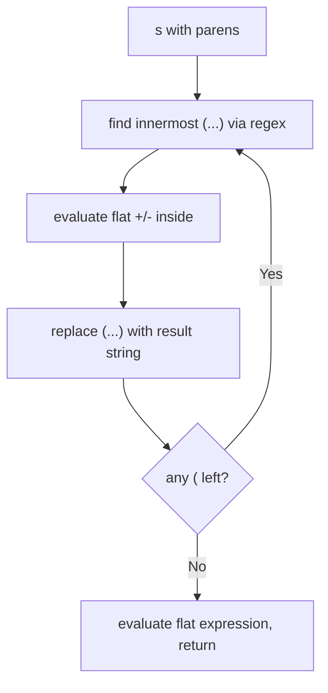
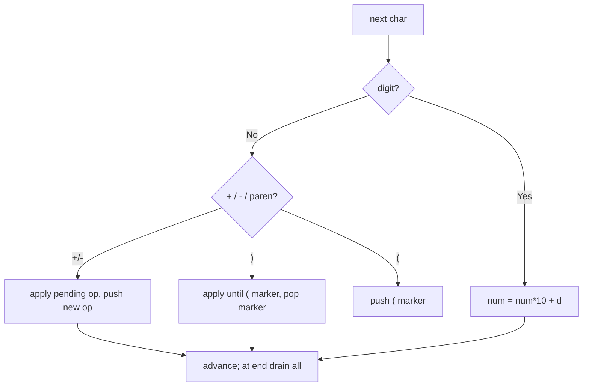
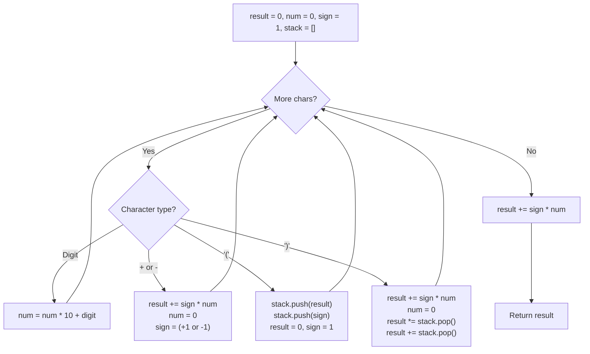

# 224. Basic Calculator

- **LeetCode Link**: `https://leetcode.com/problems/basic-calculator/`
- **Difficulty**: Hard
- **Pattern Category**: Stack / Infix Expression with Parentheses
- **Prerequisite Primer**: `00-foundations/03-core-algorithmic-patterns.md`

---

## 1. Problem Overview & Edge Case Matrix

### Problem Statement
Given a string `s` representing a valid expression, implement a basic calculator to evaluate it, and return the result of the evaluation.

The expression string may contain open `(` and closing `)` parentheses, the plus `+` or minus `-` sign, non-negative integers and empty spaces.

```
Example 1:
Input: s = "1 + 1"
Output: 2

Example 2:
Input: s = " 2-1 + 2 "
Output: 3

Example 3:
Input: s = "(1+(4+5+2)-3)+(6+8)"
Output: 23
```

### Visual Problem Representation
```
s = "(1+(4+5+2)-3)+(6+8)"

  ( 1 + (4+5+2) - 3 ) + (6+8)
  ^open pushes [res, sign]^close pops and applies
  result stack saves outer context at each '('
  final:  (1+11-3) + 14 = 9 + 14 = 23
```

### Upfront Edge Case Matrix
| Edge Case Category | Specific Input Scenario | Expected Behavior | Pitfall / Risk |
| :--- | :--- | :--- | :--- |
| Empty / Spaces only | `s = "   "` | Return `0` | Number accumulator never flushed |
| Single Element | `s = "5"` | Return `5` | Sign applied only at operator |
| Unary minus | `s = "-2+1"` / `"(-2)"` | Return `-1` / `-2` | Treating leading `-` as binary op |
| Multi-digit numbers | `s = "12 - 34"` | Return `-22` | Digit-by-digit instead of `num*10+d` |
| Deep nesting / long input | `s = "((1))"`, length up to $10^5$ | Correct, iterative only | Recursive descent blows call stack |

---

## 2. Level 1: Brute Force Approach

### Intuition & Visual Idea
Repeatedly find the innermost `(...)` with no nested parens, evaluate its flat `+`/`-` content left-to-right, and splice the result back. Loop until no parentheses remain, then evaluate the flat string. Obviously correct, $O(N^2)$ from rescanning and string rebuilding.



### Pseudocode
```text
FUNCTION calculateBruteForce(s):
    s = STRIP_SPACES(s)
    WHILE s CONTAINS "(":
        m = REGEX_MATCH(s, "\\(([^()]*)\\)")
        val = EVAL_FLAT(m[1])
        s = s.REPLACE(m[0], STRING(val))
    RETURN EVAL_FLAT(s)

FUNCTION EVAL_FLAT(expr):
    // left-to-right over [+/-]number sequence
    total = 0; num = 0; sign = +1; i = 0
    WHILE i < expr.LENGTH:
        IF DIGIT: num = num*10 + DIGIT
        ELSE IF "+" or "-": total += sign*num; num = 0; sign = (+1 | -1)
        i++
    RETURN total + sign*num
```

### Step-by-Step Dry Run (Visual Trace)
| Step | Iteration / Pointer ($i, j$) | Current Value | State / Sub-array | Action Taken |
| :--- | :--- | :--- | :--- | :--- |
| 0 | innermost regex | `(4+5+2)` | `"(1+(4+5+2)-3)+(6+8)"` | Match first paren-free group |
| 1 | eval flat | `4+5+2 = 11` | `"(1+11-3)+(6+8)"` | Splice result back |
| 2 | innermost regex | `(1+11-3)` | `"(1+11-3)+(6+8)"` | Match next group |
| 3 | eval flat | `9` | `"9+(6+8)"` | Splice |
| 4 | innermost regex | `(6+8)` | `"9+(6+8)"` | Match last group |
| 5 | eval flat | `9+14 = 23` | `"23"` | Final flat eval returns `23` |

### Modern JavaScript Implementation
```javascript
/**
 * Level 1: Brute Force (innermost-paren elimination)
 * Time Complexity:  O(N^2) — rescan + string rebuild per paren pair
 * Space Complexity: O(N) — rebuilt strings
 */
function calculateBruteForce(s) {
  // Flat evaluator for strings with only digits, +, -. No parens, no spaces.
  function evalFlat(expr) {
    let total = 0;
    let num = 0;
    let sign = 1;
    for (let i = 0; i <= expr.length; i++) {
      const ch = expr[i];
      if (ch >= '0' && ch <= '9') {
        // Multi-digit accumulation across consecutive chars.
        num = num * 10 + (ch.charCodeAt(0) - 48);
      } else {
        total += sign * num;
        num = 0;
        if (ch === '+') sign = 1;
        else if (ch === '-') sign = -1;
      }
    }
    return total;
  }

  let t = s.replace(/\s+/g, '');
  // Peel one innermost (...) per iteration until none remain.
  const inner = /\(([^()]*)\)/;
  let m = inner.exec(t);
  while (m !== null) {
    t = t.slice(0, m.index) + String(evalFlat(m[1])) + t.slice(m.index + m[0].length);
    m = inner.exec(t);
  }
  if (t === '' || t === '+' || t === '-') return 0;
  return evalFlat(t);
}
```

### Complexity Breakdown
- **Time Complexity**: $O(N^2)$ — each paren pair triggers a regex scan plus $O(N)$ string slice/concat.
- **Space Complexity**: $O(N)$ — intermediate rebuilt strings per elimination round.

---

## 3. Level 2: Optimized Approach

### Intuition & Visual Bottleneck Elimination
Eliminate rescanning with one left-to-right pass using two stacks: operands and operators (with `(` as a barrier). Numbers push to values; `+`/`-` apply pending same-precedence ops; `(` pushes a marker; `)` drains to the marker. No string rebuilding.



### Pseudocode
```text
FUNCTION calculateOptimized(s):
    values = []; ops = []
    num = 0; hasNum = false
    DEFINE flushNum(): IF hasNum: values.PUSH(num); num = 0; hasNum = false
    DEFINE applyTop(): b = values.POP(); a = values.POP(); op = ops.POP()
                       values.PUSH(op == "+" ? a+b : a-b)
    FOR EACH ch IN s:
        IF DIGIT: num = num*10 + DIGIT; hasNum = true
        ELSE:
            flushNum()
            IF ch == "+" or "-": WHILE ops NOT EMPTY AND ops.TOP() != "(": applyTop()
                                 ops.PUSH(ch)
            ELSE IF ch == "(": ops.PUSH(ch)
            ELSE IF ch == ")": WHILE ops.TOP() != "(": applyTop()
                               ops.POP()  // discard "("
    flushNum()
    WHILE ops NOT EMPTY: applyTop()
    RETURN values[0] ?? 0
```

### Step-by-Step Dry Run (Visual Trace)
| Step | Pointers / Window | Hash Map / Auxiliary State | Decision Logic | Output Accumulator |
| :--- | :--- | :--- | :--- | :--- |
| 1 | `ch = "("` | values `[]`, ops `[]` | Push `(` marker | ops `[(]` |
| 2 | `ch = "1"` | num `1` | Accumulate | pending num `1` |
| 3 | `ch = "+"` | flush `1` | No pending op, push `+` | values `[1]` |
| 4 | `ch = "("` | ops `[(, +]` | Push `(` marker | ops `[(, +, (]` |
| 5 | `4+5+2` then `")"` | drain to `(` | `4+5+2 = 11`, pop marker | values `[1, 11]` |
| 6 | `"-3)"` then `"+"` | apply `-`, drain | `(1+11-3) = 9` | values `[9]`, final `9+14=23` |

### Modern JavaScript Implementation
```javascript
/**
 * Level 2: Optimized (two-stack infix evaluator)
 * Time Complexity:  O(N) — single pass, each token pushed/popped once
 * Space Complexity: O(N) — value + operator stacks
 */
function calculateOptimized(s) {
  const values = [];
  const ops = [];
  let num = 0;
  let hasNum = false;

  const applyTop = () => {
    const b = values.pop();
    const a = values.pop();
    const op = ops.pop();
    values.push(op === '+' ? a + b : a - b);
  };

  for (const ch of s) {
    if (ch >= '0' && ch <= '9') {
      num = num * 10 + (ch.charCodeAt(0) - 48);
      hasNum = true;
    } else {
      if (hasNum) {
        values.push(num);
        num = 0;
        hasNum = false;
      }
      if (ch === '+' || ch === '-') {
        // Same precedence: drain pending +/- before pushing (left associativity).
        while (ops.length > 0 && ops[ops.length - 1] !== '(') applyTop();
        ops.push(ch);
      } else if (ch === '(') {
        ops.push(ch);
      } else if (ch === ')') {
        while (ops.length > 0 && ops[ops.length - 1] !== '(') applyTop();
        ops.pop(); // discard the "(" barrier
      }
      // Spaces fall through harmlessly.
    }
  }
  if (hasNum) values.push(num);
  while (ops.length > 0) applyTop();
  return values[0] ?? 0;
}
```

### Complexity Breakdown
- **Time Complexity**: $O(N)$ — single pass; each number/operator is pushed and popped at most once.
- **Space Complexity**: $O(N)$ — two stacks bounded by expression depth and operand count.

---

## 4. Level 3: Most Optimal / Canonical Approach

### Intuition & Mathematical / Invariant Proof
The canonical interview solution uses one stack of `[resultSoFar, signSoFar]` contexts. Track running `result` and `sign`; on `(` push the current context and reset; on `)` pop and fold: `result = prevResult + prevSign * result`. Invariant: at any point, `result` equals the value of the current paren level's prefix, and the stack holds exactly the suspended outer levels.

```
"(1+(4+5+2)-3)+(6+8)":
  ( -> push [0, +1], reset        stack [[0,1]]
  1, + ... ( -> push [1, +1]      stack [[0,1],[1,1]]
  4+5+2 -> result 11
  ) -> 1 + 1*11 = 12              stack [[0,1]]
  -3 -> 9; ) -> 0 + 1*9 = 9       stack []
  + ... (6+8)=14 -> 9 + 14 = 23
```

### Pseudocode
```text
FUNCTION calculate(s):
    stack = []       // entries: [outerResult, outerSign]
    result = 0; sign = +1; num = 0; hasNum = false
    FOR EACH ch IN s:
        IF DIGIT: num = num*10 + DIGIT; hasNum = true
        ELSE:
            IF hasNum: result += sign*num; num = 0; hasNum = false
            IF ch == "+": sign = +1
            ELSE IF ch == "-": sign = -1
            ELSE IF ch == "(": stack.PUSH([result, sign]); result = 0; sign = +1
            ELSE IF ch == ")": [prevRes, prevSign] = stack.POP()
                               result = prevRes + prevSign*result
    IF hasNum: result += sign*num
    RETURN result
```

### Step-by-Step Dry Run (Visual Trace)
| Step | Pointer $L$ | Pointer $R$ | Invariant Checked | In-Place State |
| :--- | :--- | :--- | :--- | :--- |
| 1 | `(` at 0 | result `0` | Push `[0, +1]`, reset | stack `[[0,1]]`, result `0` |
| 2 | `1+` | result `1` | `0 + 1*1 = 1` | result `1`, sign `+1` |
| 3 | `(` | result `1` | Push `[1, +1]`, reset | stack `[[0,1],[1,1]]` |
| 4 | `4+5+2` | inner result `11` | Level-local prefix sum | result `11` |
| 5 | `)` | fold | `1 + 1*11 = 12` | stack `[[0,1]]`, result `12` |
| 6 | `-3)` | fold | `12-3=9`, then `0+1*9=9` | stack `[]`, result `9` |
| 7 | `+(6+8)` | fold | `9 + 14 = 23` | Return `23` |

### Modern JavaScript Implementation
```javascript
/**
 * Level 3: Most Optimal / Canonical (sign + result stack)
 * Time Complexity:  O(N) — single pass, optimal lower bound
 * Space Complexity: O(N) — stack depth equals paren nesting depth
 */
function calculate(s) {
  // Stack entries: [resultBeforeParen, signBeforeParen].
  const stack = [];
  let result = 0;
  let sign = 1;
  let num = 0;
  let hasNum = false;

  for (const ch of s) {
    if (ch >= '0' && ch <= '9') {
      // Multi-digit accumulation; charCodeAt avoids parseInt radix pitfalls.
      num = num * 10 + (ch.charCodeAt(0) - 48);
      hasNum = true;
    } else {
      // Flush any pending number before handling the operator/paren.
      if (hasNum) {
        result += sign * num;
        num = 0;
        hasNum = false;
      }
      if (ch === '+') {
        sign = 1;
      } else if (ch === '-') {
        sign = -1; // doubles as unary minus at expression/paren start
      } else if (ch === '(') {
        // Suspend current level; fresh result/sign inside the parens.
        stack.push([result, sign]);
        result = 0;
        sign = 1;
      } else if (ch === ')') {
        // Fold inner result into the suspended outer level.
        const [prevResult, prevSign] = stack.pop();
        result = prevResult + prevSign * result;
      }
      // Spaces are ignored.
    }
  }
  if (hasNum) result += sign * num;
  return result;
}
```

### Complexity Breakdown
- **Time Complexity**: $O(N)$ — optimal lower bound; every character is processed exactly once.
- **Space Complexity**: $O(N)$ worst case — stack depth equals maximum paren nesting (bounded by $N/2$).

---

## 5. JavaScript-Specific Gotchas & V8 Optimizations
- **GC Pressure**: Avoid allocating objects inside tight loops ($O(N)$ closures). Level 3 pushes tiny 2-element arrays only per `(` — never per character; never build token arrays via `split` + `map` on $10^5$-length strings.
- **Type Coercion / Sorting**: Use `ch.charCodeAt(0) - 48` digit checks, not `parseInt(ch)` per char; per-char `parseInt` is slow and `Number(' ')` silently yields `0`, corrupting space handling.
- **Index Bounds**: Never recurse into nested parens — recursion depth $> 10^4$ overflows V8's call stack on adversarial input. The iterative sign/result stack is mandatory, not stylistic.

---

## 6. Real-World MAANG Interview Follow-Ups & Extensions

### Follow-Up 1: Basic Calculator II and III — precedence and multiplication/division
- **Scenario**: Add `*`, `/` (precedence 2) and `^` (right-associative) to the grammar.
- **Solution Strategy**: Shunting-yard with a precedence table: drain while `prec(top) >= prec(cur)` (or `>` for right-assoc `^`); reuse the Level 2 two-stack skeleton with `Math.trunc` division.
- **JS Code / Implementation Pattern**:
```javascript
function applyBinary(values, op) {
  const b = values.pop();
  const a = values.pop();
  if (op === '+') values.push(a + b);
  else if (op === '-') values.push(a - b);
  else if (op === '*') values.push(a * b);
  else values.push(Math.trunc(a / b));
}
```

### Follow-Up 2: Streaming 10^12-character expression that never fits in memory
- **Scenario**: The expression arrives over a socket in chunks; the full string cannot be materialized.
- **Solution Strategy**: Chunked Level 3: persist `{ result, sign, stack }` across chunk boundaries; carry a partial `num` between chunks; checkpoint the stack to disk every $10^6$ chars.
- **JS Code / Implementation Pattern**:
```javascript
function feedChunk(state, chunk) {
  for (const ch of chunk) stepCalculator(state, ch); // Level 3 body per char
  return state; // { result, sign, num, hasNum, stack }
}
```

### Follow-Up 3: Distributed evaluation with worker threads
- **Scenario & In-Depth Solution**: Split a paren-balanced expression at top-level `+`/`-` boundaries into independent segments, evaluate each in a `worker_threads` worker with the Level 3 evaluator, then combine with the segment signs. Paren-depth tracking guarantees split points are truly top-level.
```javascript
// Parent: fan out top-level segments, join partial sums
async function distributedCalculate(segments) {
  const partials = await Promise.all(segments.map((seg) => runWorker(seg)));
  return partials.reduce((acc, v, i) => acc + segments[i].sign * v, 0);
}
```

---

## 7. What LeetCode Discuss Says (Language-Independent)

Source: top-voted post by southpenguin —
`https://leetcode.com/problems/basic-calculator/solutions/62361/iterative-java-solution-with-stack-by-so-7qs7/`
— 154K views / 1K votes / 67 comments.
Language-independent summary. No new JS here.

### A. Optimal way from Discuss (Iterative Stack with Running Sum & Sign)

Because Basic Calculator only includes addition, subtraction, and parentheses (no multiplication or division precedence), a full Shunting-Yard parser is unnecessary. 

An iterative stack tracks the accumulated sum and outer sign whenever parentheses nest:
1. **Digit:** Accumulate multi-digit numbers: `number = number * 10 + digit`.
2. **`+` or `-`:** Commit the accumulated number into the running `result`: `result += sign * number`. Reset `number = 0` and update `sign` to `+1` or `-1`.
3. **`(` (Open paren):** Save current state. Push `result` then `sign` onto the stack. Reset `result = 0` and `sign = 1` for the nested scope.
4. **`)` (Close paren):** Commit the inner number into `result`. Pop the parenthesis's multiplier sign, then pop the outer base result and add them: `result = prevResult + (prevSign * result)`.

```text
FUNCTION calculate(s):
    stack = empty Stack
    result = 0
    number = 0
    sign = 1

    FOR EACH char c IN s:
        IF IS_DIGIT(c):
            number = number * 10 + (c - '0')
        ELSE IF c == '+':
            result += sign * number
            number = 0
            sign = 1
        ELSE IF c == '-':
            result += sign * number
            number = 0
            sign = -1
        ELSE IF c == '(':
            stack.push(result)
            stack.push(sign)
            result = 0
            sign = 1
        ELSE IF c == ')':
            result += sign * number
            number = 0
            result *= stack.pop()  // sign before parenthesis
            result += stack.pop()  // result before parenthesis
            
    IF number != 0:
        result += sign * number
        
    RETURN result
```

- Time: O(N) where N is the length of `s`. Each character is visited once.
- Space: O(N) stack depth bounded by maximum parenthesis nesting depth.



### B. Dry run on LeetCode Example 3 (`s = "(1+(4+5+2)-3)+(6+8)"`)

Tracing inner sub-expression `(4+5+2)`:
1. `c = '('`: Push outer `result = 1` and `sign = 1`. Reset `result = 0, sign = 1`. Stack: `[1, 1]`.
2. Digits & operators `4+5+2`: Inner `result` becomes $4 + 5 + 2 = 11$.
3. `c = ')'`:
   - Pop outer sign: $1 \rightarrow 11 \times 1 = 11$.
   - Pop outer result: $1 \rightarrow 1 + 11 = 12$.
4. Next token `-3`: `result = 12 - 3 = 9`.

### C. Why This Beats Shunting-Yard AST Parsers

- **Zero grammar overhead:** Avoids token stream tokenization, AST node allocation, and operator precedence tables.
- **Immediate evaluation:** Computes intermediate values in-flight.

### D. Pitfalls from comments

- **Trailing unflushed number:** If the expression ends with a number (e.g. `"1 + 1"`), no operator or closing parenthesis follows. A post-loop check `if (number != 0) result += sign * number` is required.
- **Unary negative numbers at start or after `(`:** In cases like `"- (3 + 2)"`, the first token is `'-'`. Because `number` starts at 0, `result += sign * 0` safely does nothing while setting `sign = -1`.
- **Space characters:** Blank spaces between numbers and operators must simply be ignored without resetting state.

### E. Companies

- Discuss post itself names none.
  Companies tab on LeetCode is premium-locked.
- External source:
  `https://github.com/liquidslr/leetcode-company-wise-problems`
  (LeetCode company tags, updated June 2025).
- All-time (38): Adobe, Airbnb, Amazon, Apple, Bloomberg, ByteDance, Coupang, DE Shaw, DoorDash, Expedia, Google, Highspot, Houzz, Hulu, Infosys, Intuit, IXL, Meta, Microsoft, Oracle, Palo Alto Networks, Pocket Gems, Ripple, Rivian, Roblox, Rokt, Salesforce, Snap, Snowflake, Squarepoint Capital, Tesla, TikTok, Uber, Verkada, Walmart Labs, Yandex, Zoho, Zoox.
- Recent: 30 days — none.
- Recent: 3 months — Amazon, Bloomberg, Google, Microsoft.
