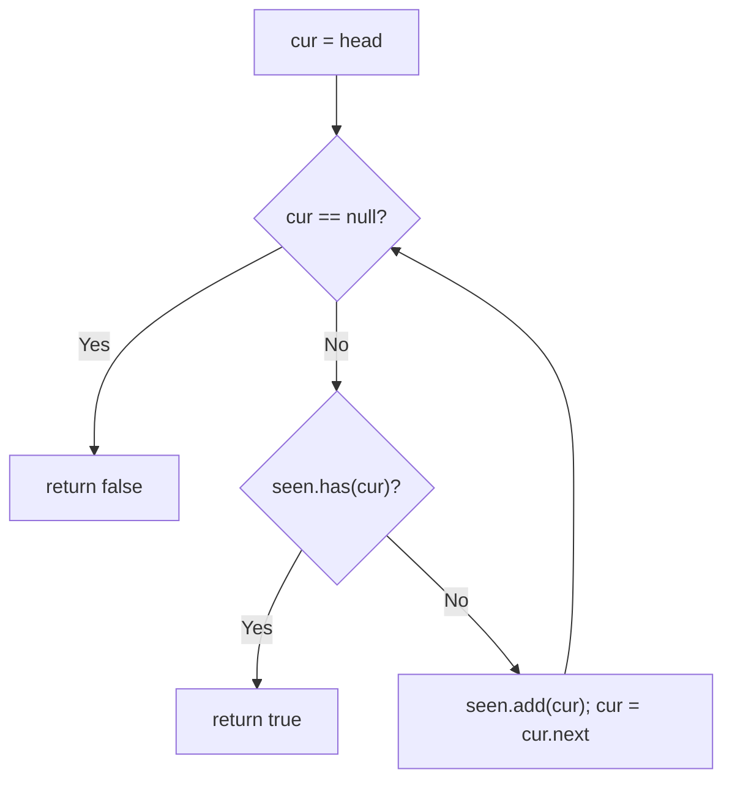
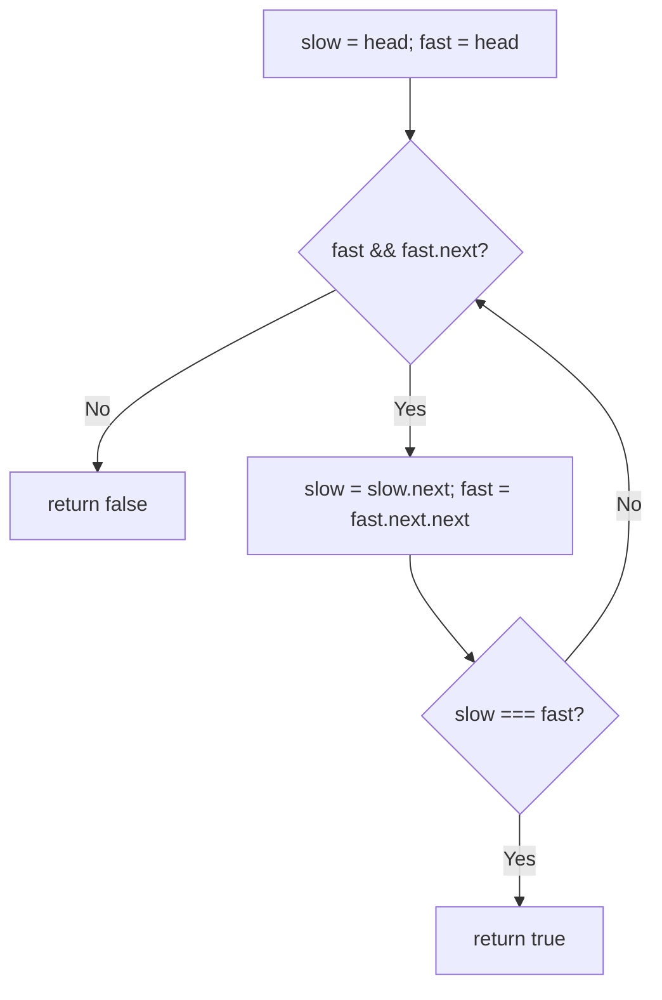

# 141. Linked List Cycle

- **LeetCode Link**: `https://leetcode.com/problems/linked-list-cycle/`
- **Difficulty**: Easy
- **Pattern Category**: Linked List / Fast & Slow Pointers
- **Prerequisite Primer**: `00-foundations/03-core-algorithmic-patterns.md`

---

## 1. Problem Overview & Edge Case Matrix

### Problem Statement
Given `head`, the head of a linked list, determine if the linked list has a cycle in it.

There is a cycle in a linked list if there is some node in the list that can be reached again by continuously following the `next` pointer.

Return `true` if there is a cycle in the linked list. Otherwise, return `false`.

```
Example 1:
Input: head = [3,2,0,-4], pos = 1
Output: true
Explanation: Tail connects to node index 1 (value 2).

Example 2:
Input: head = [1,2], pos = 0
Output: true

Example 3:
Input: head = [1], pos = -1
Output: false (no cycle)
```

### Visual Problem Representation
```
Acyclic:   1 -> 2 -> 3 -> null        (fast hits null => false)

Cyclic:    3 -> 2 -> 0 -> -4
           ^              |
           +--------------+  (fast laps slow => true)
```

### Upfront Edge Case Matrix
| Edge Case Category | Specific Input Scenario | Expected Behavior | Pitfall / Risk |
| :--- | :--- | :--- | :--- |
| Empty / Nil | `head = null` | Return `false` | Null dereference on `.next` |
| Single Element | `[1]`, no cycle | Return `false` | `fast.next.next` on null |
| Self-loop | `[1]`, tail links to itself | Return `true` | Loop condition exits before first step |
| Two nodes, no cycle | `[1,2]`, `pos = -1` | Return `false` | Off-by-one null check order |
| Long acyclic list | $N = 10^4$ nodes | Return `false` in $O(N)$ | $O(N)$ extra memory in naive version |

---

## 2. Level 1: Brute Force Approach

### Intuition & Visual Idea
Walk the list while remembering every visited node in a `Set`. If we ever revisit a node object, a cycle exists. If we reach `null`, the list terminates. Obvious and correct — identity comparison (`===` on object references) is the whole trick.



### Pseudocode
```text
FUNCTION hasCycleBruteForce(head):
    seen = EMPTY SET
    cur = head
    WHILE cur IS NOT NULL:
        IF seen.CONTAINS(cur): RETURN true
        seen.ADD(cur)
        cur = cur.next
    RETURN false
```

### Step-by-Step Dry Run (Visual Trace)
| Step | Iteration / Pointer ($i, j$) | Current Value | State / Sub-array | Action Taken |
| :--- | :--- | :--- | :--- | :--- |
| 0 | `cur = 3` | `seen = {}` | `[3,2,0,-4]` + link to `2` | Not seen, add |
| 1 | `cur = 2` | `seen = {3}` | advance | Not seen, add |
| 2 | `cur = 0` | `seen = {3,2}` | advance | Not seen, add |
| 3 | `cur = -4` | `seen = {3,2,0}` | advance | Not seen, add |
| 4 | `cur = 2` | `seen = {3,2,0,-4}` | tail links back | Seen before, return `true` |

### Modern JavaScript Implementation
```javascript
/**
 * Shared backbone: LeetCode provides ListNode; defined once here so every
 * level below is locally runnable when concatenated (Level 1 + 2 + 3).
 * Time Complexity:  n/a (scaffolding)
 * Space Complexity: n/a (scaffolding)
 */
class ListNode {
  constructor(val, next = null) {
    this.val = val;
    this.next = next;
  }
}

/**
 * Level 1: Brute Force (visited-object Set)
 * Time Complexity:  O(N) — each node visited at most twice
 * Space Complexity: O(N) — one Set entry per node
 */
function hasCycleBruteForce(head) {
  // Identity semantics: two nodes with equal val are DIFFERENT objects.
  const seen = new Set();
  let cur = head;
  while (cur !== null) {
    if (seen.has(cur)) return true; // revisited => cycle
    seen.add(cur);
    cur = cur.next;
  }
  return false; // reached null => terminates
}
```

### Complexity Breakdown
- **Time Complexity**: $O(N)$ — single traversal, $O(1)$ amortized Set operations.
- **Space Complexity**: $O(N)$ — stores all $N$ node references; the bottleneck Level 2 removes.

---

## 3. Level 2: Optimized Approach

### Intuition & Visual Bottleneck Elimination
Drop the $O(N)$ Set: race a `slow` pointer (1 step) against a `fast` pointer (2 steps). On a cycle, fast laps slow from behind and they must meet; on an acyclic list, fast hits `null`. Two pointers, zero auxiliary memory.



### Pseudocode
```text
FUNCTION hasCycleFloyd(head):
    slow = head; fast = head
    WHILE fast IS NOT NULL AND fast.next IS NOT NULL:
        slow = slow.next
        fast = fast.next.next
        IF slow === fast: RETURN true
    RETURN false
```

### Step-by-Step Dry Run (Visual Trace)
| Step | Pointers / Window | Hash Map / Auxiliary State | Decision Logic | Output Accumulator |
| :--- | :--- | :--- | :--- | :--- |
| 0 | `slow=3, fast=3` | — | Init, enter loop | continue |
| 1 | `slow=2, fast=0` | `fast` jumped 2 | Not equal | continue |
| 2 | `slow=0, fast=-4` | gap shrinks by 1 each round | Not equal | continue |
| 3 | `slow=-4, fast=0` | fast wraps the cycle | Not equal | continue |
| 4 | `slow=2, fast=-4` | — | Not equal | continue |
| 5 | `slow=0, fast=2` | gap closed | Not equal | continue |
| 6 | `slow=-4, fast=-4` | pointers coincide | Equal, return `true` | `true` |

### Modern JavaScript Implementation
```javascript
/**
 * Level 2: Optimized (Floyd's tortoise and hare)
 * Time Complexity:  O(N) — fast pointer traverses at most ~2N hops
 * Space Complexity: O(1) — two pointers, no allocation
 */
// ListNode shared from Level 1.
function hasCycleFloyd(head) {
  let slow = head;
  let fast = head;
  // Guard BEFORE advancing: fast must have two live hops ahead.
  while (fast !== null && fast.next !== null) {
    slow = slow.next; // 1 step
    fast = fast.next.next; // 2 steps
    if (slow === fast) return true; // lapped => cycle
  }
  return false; // fast fell off the end => acyclic
}
```

### Complexity Breakdown
- **Time Complexity**: $O(N)$ — meeting happens within one cycle lap after slow enters it.
- **Space Complexity**: $O(1)$ — constant auxiliary state regardless of $N$.

---

## 4. Level 3: Most Optimal / Canonical Approach

### Intuition & Mathematical / Invariant Proof
Same Floyd race, hardened for production: explicit `null`/single-node early exits, `fast` seeded one hop ahead so the meeting test is uniform, and strict `===` identity throughout. Invariant: after $k$ rounds, `slow` is $k$ hops from head and `fast` is $2k+1$ hops along the (possibly cyclic) path; on a cycle of length $C$, the gap $(fast - slow) \bmod C$ grows by exactly 1 per round, so it must hit $0$ within $C$ rounds — meeting is guaranteed, never accidental.

```
round 0:  slow@3 -------- fast@2        gap 1
round 1:  slow@2 -------- fast@-4       gap 2 (mod cycle)
round k:  gap grows +1/round => meets within C rounds
```

### Pseudocode
```text
FUNCTION hasCycle(head):
    IF head IS NULL OR head.next IS NULL: RETURN false
    slow = head; fast = head.next
    WHILE slow !== fast:
        IF fast IS NULL OR fast.next IS NULL: RETURN false
        slow = slow.next
        fast = fast.next.next
    RETURN true
```

### Step-by-Step Dry Run (Visual Trace)
| Step | Pointer $L$ | Pointer $R$ | Invariant Checked | In-Place State |
| :--- | :--- | :--- | :--- | :--- |
| 0 | `slow=3` | `fast=2` | Guards pass, pointers differ | Enter loop |
| 1 | `slow=2` | `fast=-4` | Gap $+1 \bmod C$ | Continue |
| 2 | `slow=0` | `fast=2` | Gap still nonzero | Continue |
| 3 | `slow=-4` | `fast=-4` | `slow === fast` | Exit loop, return `true` |
| 4 | acyclic `[1]` | — | `head.next === null` early exit | Return `false` |

### Modern JavaScript Implementation
```javascript
/**
 * Level 3: Most Optimal / Canonical (hardened Floyd)
 * Time Complexity:  O(N) time, optimal — every node visited O(1) times
 * Space Complexity: O(1) auxiliary — in-place pointer race
 */
// ListNode shared from Level 1.
function hasCycle(head) {
  // Degenerate lists cannot contain a cycle (no self-loop possible here).
  if (head === null || head.next === null) return false;
  let slow = head;
  let fast = head.next; // one hop ahead: meeting test is uniform from round 0
  while (slow !== fast) {
    // fast needs two live hops; otherwise the list terminates.
    if (fast === null || fast.next === null) return false;
    slow = slow.next;
    fast = fast.next.next;
  }
  return true;
}
```

### Complexity Breakdown
- **Time Complexity**: $O(N)$ — optimal lower bound; any algorithm must inspect $\Omega(N)$ nodes in the worst case.
- **Space Complexity**: $O(1)$ auxiliary — two references, zero heap allocation.

---

## 5. JavaScript-Specific Gotchas & V8 Optimizations
- **GC Pressure**: Avoid allocating objects inside tight loops ($O(N)$ closures). Level 1's `Set` of $10^4$ node references is exactly the pressure Floyd eliminates — never box nodes into wrapper objects to "mark" them.
- **Type Coercion / Sorting**: Compare node **identity** (`===` on objects), never `cur.val === seenVal` — duplicate values (`[1,1,1]` acyclic) false-positive a value-based check.
- **Index Bounds**: Order null guards as `fast !== null && fast.next !== null` — reversed order (`fast.next` first) throws on acyclic tails. Short-circuit evaluation is load-bearing here.

---

## 6. Real-World MAANG Interview Follow-Ups & Extensions

### Follow-Up 1: Return the cycle entry node (Linked List Cycle II)
- **Scenario**: Instead of a boolean, return the node where the cycle begins.
- **Solution Strategy**: After Floyd meets at $M$, reset one pointer to `head` and advance both at 1 step — they meet exactly at the entry (equal distance $a$ from head and from $M$ along the cycle).
- **JS Code / Implementation Pattern**:
```javascript
function detectCycleEntry(head) {
  let slow = head, fast = head;
  while (fast && fast.next) {
    slow = slow.next; fast = fast.next.next;
    if (slow === fast) {
      let entry = head;
      while (entry !== slow) { entry = entry.next; slow = slow.next; }
      return entry;
    }
  }
  return null;
}
```

### Follow-Up 2: Cycle length and $10^9$-node streaming lists
- **Scenario**: Report the cycle length without storing nodes; the list streams from disk and never fits in memory.
- **Solution Strategy**: Floyd meeting in $O(1)$ space, then walk one full lap from $M$ counting hops. Single pass, constant memory regardless of $N$.
- **JS Code / Implementation Pattern**:
```javascript
function cycleLengthFromMeeting(meetNode) {
  let len = 1;
  for (let cur = meetNode.next; cur !== meetNode; cur = cur.next) len++;
  return len;
}
```

### Follow-Up 3: Concurrent mutation during traversal
- **Scenario & In-Depth Solution**: Another thread splices nodes mid-detection. Defensive approach: bound the race — if `fast` takes more than $2N$ hops (or a step budget expires), abort and report `unknown/retriable` instead of looping forever on a mutating cycle. Version-stamp the head and revalidate on exit.
```javascript
function hasCycleBounded(head, maxHops = 200000) {
  let slow = head, fast = head, hops = 0;
  while (fast && fast.next && hops++ < maxHops) {
    slow = slow.next; fast = fast.next.next;
    if (slow === fast) return true;
  }
  return false; // false OR concurrently mutated: caller retries
}
```
