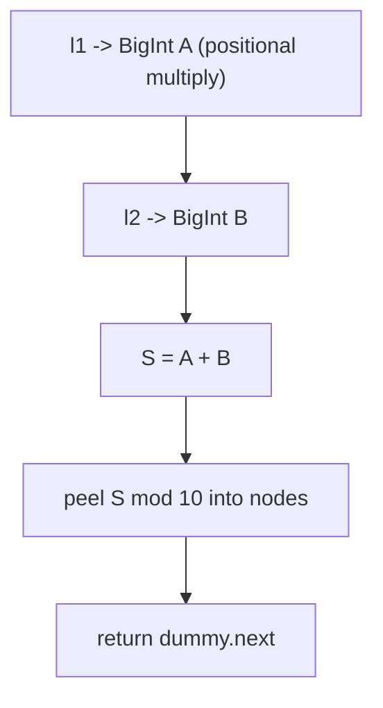
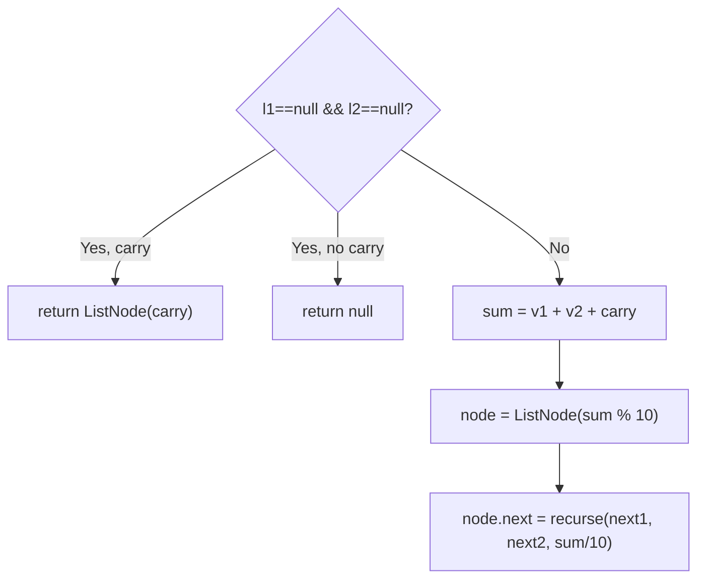
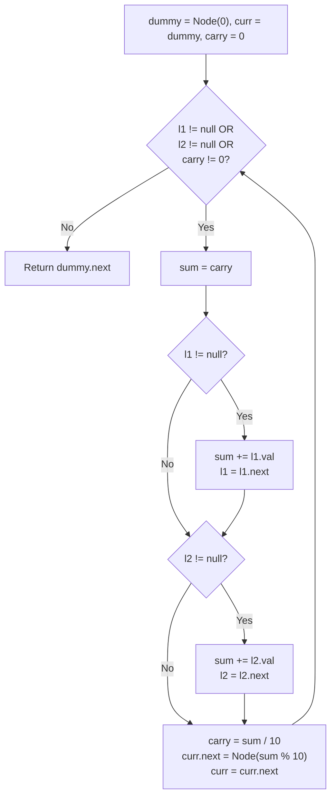

# 2. Add Two Numbers

- **LeetCode Link**: `https://leetcode.com/problems/add-two-numbers/`
- **Difficulty**: Medium
- **Pattern Category**: Linked List / Dummy Head + Carry Propagation
- **Prerequisite Primer**: `00-foundations/03-core-algorithmic-patterns.md`

---

## 1. Problem Overview & Edge Case Matrix

### Problem Statement
You are given two non-empty linked lists representing two non-negative integers. The digits are stored in reverse order, and each of their nodes contains a single digit. Add the two numbers and return the sum as a linked list.

```
Example 1:
Input: l1 = [2,4,3], l2 = [5,6,4]
Output: [7,0,8]
Explanation: 342 + 465 = 807.

Example 2:
Input: l1 = [0], l2 = [0]
Output: [0]

Example 3:
Input: l1 = [9,9,9,9,9,9,9], l2 = [9,9,9,9]
Output: [8,9,9,9,0,0,0,1]
Explanation: 9999999 + 9999 = 10009998.
```

### Visual Problem Representation
```
    l1:  2 -> 4 -> 3          (342, least-significant digit first)
    l2:  5 -> 6 -> 4          (465)
carry:   0    0    1
  out:   7 -> 0 -> 8          (807)
```

### Upfront Edge Case Matrix
| Edge Case Category | Specific Input Scenario | Expected Behavior | Pitfall / Risk |
| :--- | :--- | :--- | :--- |
| Empty / Nil | One list `null` (defensive) | Treat as zero, return the other | Null dereference on `.val` |
| Single Element | `[0] + [0]` | Return `[0]`, not empty list | `while` loop that skips zero |
| Uneven lengths | `[9×7] + [9×4]` | Propagate through longer tail | Stopping at the shorter list's end |
| Final carry | `[5] + [5]` | Return `[0,1]` | Dropping the overflow digit |
| Precision | 100-digit lists | Exact result | `Number` overflow past $2^{53}-1$ |

---

## 2. Level 1: Brute Force Approach

### Intuition & Visual Idea
Convert each list to a `BigInt` (immune to $2^{53}$ overflow), add natively, then expand the sum back into reverse-order digits. Two conversions plus one addition — obviously correct, but $O(N)$ extra space and two wasted passes.



### Pseudocode
```text
FUNCTION toBigInt(node):
    total = 0n; mult = 1n
    WHILE node NOT NULL: total += BIGINT(node.val) * mult; mult *= 10n; node = node.next
    RETURN total

FUNCTION fromBigInt(n):
    IF n == 0n: RETURN ListNode(0)
    dummy = ListNode(0); cur = dummy
    WHILE n > 0n: cur.next = ListNode(NUMBER(n MOD 10n)); cur = cur.next; n /= 10n
    RETURN dummy.next

FUNCTION addTwoNumbersBruteForce(l1, l2):
    RETURN fromBigInt(toBigInt(l1) + toBigInt(l2))
```

### Step-by-Step Dry Run (Visual Trace)
| Step | Iteration / Pointer ($i, j$) | Current Value | State / Sub-array | Action Taken |
| :--- | :--- | :--- | :--- | :--- |
| 0 | convert `l1` | `2 + 4*10 + 3*100` | `A = 342n` | Positional accumulation |
| 1 | convert `l2` | `5 + 6*10 + 4*100` | `B = 465n` | Positional accumulation |
| 2 | add | `342n + 465n` | `S = 807n` | Native BigInt add |
| 3 | expand | `807 % 10 = 7` | node `7`, `S = 80n` | Peel least digit |
| 4 | expand | `80 % 10 = 0`, then `8` | nodes `7 -> 0 -> 8` | Return `[7,0,8]` |

### Modern JavaScript Implementation
```javascript
/**
 * Shared backbone: LeetCode provides ListNode; defined once here so every
 * level below is locally runnable when concatenated (Level 1 + 2 + 3).
 * Time Complexity:  n/a (scaffolding)
 * Space Complexity: n/a (scaffolding)
 */
class ListNode {
  constructor(val, next = null) {
    this.val = val;
    this.next = next;
  }
}

function arrayToList(arr) {
  const dummy = new ListNode(0);
  let cur = dummy;
  for (const v of arr) {
    cur.next = new ListNode(v);
    cur = cur.next;
  }
  return dummy.next;
}

function listToArray(head) {
  const out = [];
  while (head !== null) {
    out.push(head.val);
    head = head.next;
  }
  return out;
}

/**
 * Level 1: Brute Force (BigInt round-trip)
 * Time Complexity:  O(N + M) — two conversions plus digit expansion
 * Space Complexity: O(N + M) — BigInt digits plus the output list
 */
function toBigInt(node) {
  // Positional value: head holds the ones place.
  let total = 0n;
  let mult = 1n;
  while (node !== null) {
    total += BigInt(node.val) * mult;
    mult *= 10n;
    node = node.next;
  }
  return total;
}

function fromBigInt(n) {
  if (n === 0n) return new ListNode(0); // zero must yield one node, not none
  const dummy = new ListNode(0);
  let cur = dummy;
  while (n > 0n) {
    cur.next = new ListNode(Number(n % 10n));
    cur = cur.next;
    n /= 10n;
  }
  return dummy.next;
}

function addTwoNumbersBruteForce(l1, l2) {
  return fromBigInt(toBigInt(l1) + toBigInt(l2));
}
```

### Complexity Breakdown
- **Time Complexity**: $O(N + M)$ — linear, but with three full passes and BigInt overhead.
- **Space Complexity**: $O(N + M)$ — intermediate arbitrary-precision integers plus output.

---

## 3. Level 2: Optimized Approach

### Intuition & Visual Bottleneck Elimination
Skip the conversion entirely: walk both lists in one pass, adding digits plus carry, threading result nodes behind a dummy head. The recursive formulation expresses the per-digit step cleanly — but each digit costs a call frame.



### Pseudocode
```text
FUNCTION addTwoNumbersRecursive(l1, l2, carry = 0):
    IF l1 NULL AND l2 NULL:
        RETURN carry ? ListNode(carry) : NULL
    sum = VAL(l1) + VAL(l2) + carry
    node = ListNode(sum MOD 10)
    node.next = addTwoNumbersRecursive(NEXT(l1), NEXT(l2), FLOOR(sum / 10))
    RETURN node
```

### Step-by-Step Dry Run (Visual Trace)
| Step | Pointers / Window | Hash Map / Auxiliary State | Decision Logic | Output Accumulator |
| :--- | :--- | :--- | :--- | :--- |
| 1 | `2 + 5 + 0 = 7` | carry `0` | `7 % 10 = 7` | node `7` |
| 2 | `4 + 6 + 0 = 10` | carry `0` | `10 % 10 = 0`, carry `1` | `7 -> 0` |
| 3 | `3 + 4 + 1 = 8` | carry `1` | `8 % 10 = 8`, carry `0` | `7 -> 0 -> 8` |
| 4 | both null, carry `0` | — | Base case returns `null` | `[7,0,8]` |

### Modern JavaScript Implementation
```javascript
/**
 * Level 2: Optimized (single-pass recursion)
 * Time Complexity:  O(max(N, M)) — one frame per digit position
 * Space Complexity: O(max(N, M)) — call stack depth equals output length
 */
// ListNode shared from Level 1.
function addTwoNumbersRecursive(l1, l2, carry = 0) {
  // Base: no digits left; emit the leftover carry or terminate.
  if (l1 === null && l2 === null) {
    return carry !== 0 ? new ListNode(carry) : null;
  }
  // Null-tolerant reads let uneven lists flow without length checks.
  const sum = (l1?.val ?? 0) + (l2?.val ?? 0) + carry;
  const node = new ListNode(sum % 10);
  node.next = addTwoNumbersRecursive(l1?.next ?? null, l2?.next ?? null, Math.floor(sum / 10));
  return node;
}
```

### Complexity Breakdown
- **Time Complexity**: $O(\max(N, M))$ — one frame per digit position.
- **Space Complexity**: $O(\max(N, M))$ — call stack depth; the risk Level 3 removes ($N > 10^4$ overflows V8).

---

## 4. Level 3: Most Optimal / Canonical Approach

### Intuition & Mathematical / Invariant Proof
Same single-pass digit addition, iterative: the loop condition `l1 || l2 || carry` is the whole algorithm — it naturally covers uneven tails and the final overflow digit with no special cases. Dummy head removes empty-result branching. Invariant: before each iteration, `carry` equals $\lfloor \text{prefix sum} / 10 \rfloor$ and emitted nodes equal the exact sum prefix.

```
l1=9,9,9,9,9,9,9  l2=9,9,9,9
pos0: 9+9=18  -> emit 8, carry 1
pos1-3: 9+9+1=19 -> emit 9, carry 1
pos4-6: 9+0+1=10 -> emit 0/9..., carry drains
tail: carry 1 -> emit 1   => [8,9,9,9,0,0,0,1]
```

### Pseudocode
```text
FUNCTION addTwoNumbers(l1, l2):
    dummy = ListNode(0); cur = dummy; carry = 0
    WHILE l1 NOT NULL OR l2 NOT NULL OR carry != 0:
        sum = VAL(l1) + VAL(l2) + carry
        cur.next = ListNode(sum MOD 10)
        cur = cur.next
        carry = FLOOR(sum / 10)
        l1 = NEXT(l1); l2 = NEXT(l2)
    RETURN dummy.next
```

### Step-by-Step Dry Run (Visual Trace)
| Step | Pointer $L$ | Pointer $R$ | Invariant Checked | In-Place State |
| :--- | :--- | :--- | :--- | :--- |
| 1 | `l1=2` | `l2=5` | `7 < 10`, carry `0` | emit `7` |
| 2 | `l1=4` | `l2=6` | `10 >= 10`, carry `1` | emit `0` |
| 3 | `l1=3` | `l2=4` | `3+4+1=8`, carry `0` | emit `8` |
| 4 | both null | carry `0` | Loop exits | Return `[7,0,8]` |

### Modern JavaScript Implementation
```javascript
/**
 * Level 3: Most Optimal / Canonical (iterative dummy-head + carry)
 * Time Complexity:  O(max(N, M)) — single pass, optimal lower bound
 * Space Complexity: O(1) auxiliary — output list excluded (required output)
 */
// ListNode shared from Level 1.
function addTwoNumbers(l1, l2) {
  const dummy = new ListNode(0); // sidesteps empty-head branching
  let cur = dummy;
  let carry = 0;
  // One condition covers uneven tails AND the final overflow digit.
  while (l1 !== null || l2 !== null || carry !== 0) {
    const sum = (l1?.val ?? 0) + (l2?.val ?? 0) + carry;
    cur.next = new ListNode(sum % 10);
    cur = cur.next;
    carry = Math.floor(sum / 10);
    l1 = l1?.next ?? null;
    l2 = l2?.next ?? null;
  }
  return dummy.next;
}
```

### Complexity Breakdown
- **Time Complexity**: $O(\max(N, M))$ — optimal lower bound; every input digit is read once.
- **Space Complexity**: $O(1)$ auxiliary — iterative, no stack, no conversion buffers.

---

## 5. JavaScript-Specific Gotchas & V8 Optimizations
- **GC Pressure**: Avoid allocating objects inside tight loops ($O(N)$ closures). One `new ListNode` per output digit is mandatory; never allocate per-digit helper arrays or `{ sum, carry }` tuples.
- **Type Coercion / Sorting**: `BigInt(node.val)` in Level 1 is exact; plain `Number` arithmetic overflows past `Number.MAX_SAFE_INTEGER` ($2^{53}-1$) on 100-digit inputs — Level 3's digit-wise math never forms the whole number, so precision is exact by construction.
- **Index Bounds**: Recursion depth $> 10^4$ overflows V8's call stack — Level 2 recursion fails hidden long-input tests, which is why the iterative Level 3 is canonical, not stylistic.

---

## 6. Real-World MAANG Interview Follow-Ups & Extensions

### Follow-Up 1: Forward-order digits (Add Two Numbers II)
- **Scenario**: Digits arrive most-significant first (`[7,2,4,3] + [5,6,4]`); the list cannot be reversed in place.
- **Solution Strategy**: Push both lists onto stacks to restore least-significant-first order, then run the Level 3 loop; prepend result nodes to keep forward order.
- **JS Code / Implementation Pattern**:
```javascript
function addForward(l1, l2) {
  const s1 = [], s2 = [];
  for (let c = l1; c; c = c.next) s1.push(c.val);
  for (let c = l2; c; c = c.next) s2.push(c.val);
  let carry = 0, head = null;
  while (s1.length || s2.length || carry) {
    const sum = (s1.pop() ?? 0) + (s2.pop() ?? 0) + carry;
    head = new ListNode(sum % 10, head);
    carry = Math.floor(sum / 10);
  }
  return head;
}
```

### Follow-Up 2: Streaming $10^9$-digit operands
- **Scenario**: Operands stream least-significant-digit-first over a socket; neither fits in memory but the digit streams do.
- **Solution Strategy**: Level 3 loop over async generators — `carry` is the only retained state ($O(1)$ memory); emit result digits to a writable stream per iteration.
- **JS Code / Implementation Pattern**:
```javascript
async function* addStreams(genA, genB) {
  let carry = 0, doneA = false, doneB = false;
  while (!doneA || !doneB || carry) {
    const a = doneA ? 0 : (await genA.next()).value ?? 0;
    const b = doneB ? 0 : (await genB.next()).value ?? 0;
    const sum = a + b + carry;
    yield sum % 10;
    carry = Math.floor(sum / 10);
  }
}
```

### Follow-Up 3: Parallel chunked addition with carry lookahead
- **Scenario & In-Depth Solution**: Split million-digit operands into chunks across `worker_threads`. Each worker computes its chunk sum assuming carry-in 0 and 1 (dual speculation); a prefix pass resolves true carries, and results stitch in $O(\text{chunks})$ combine time.
```javascript
// Worker: returns { sum0, sum1 } digit arrays for both carry-in hypotheses
function addChunkSpeculative(digitsA, digitsB) {
  return [0, 1].map((carryIn) => addChunk(digitsA, digitsB, carryIn));
}
```

---

## 7. What LeetCode Discuss Says (Language-Independent)

Source: top-voted post by Himanshu Malik —
`https://leetcode.com/problems/add-two-numbers/solutions/1835535/javac-a-very-beautiful-explanation-ever-szom9/`
— 174.5K views.
Language-independent summary. No new JS here.

### A. Optimal way from Discuss (Unified Carry Traversal)

The digits are stored in reverse order (least significant digit first), perfectly matching column-wise schoolbook arithmetic. 

A single pointer loop advances while *either* list has nodes remaining **or** a non-zero `carry` persists:
1. Initialize `dummy` head, `curr = dummy`, and `carry = 0`.
2. In each iteration, start `sum = carry`. Add `l1.val` if `l1` exists, and add `l2.val` if `l2` exists.
3. Compute `carry = sum / 10` and digit `sum % 10`.
4. Append `new ListNode(sum % 10)` to `curr.next` and step forward.
5. Return `dummy.next`.

```text
FUNCTION addTwoNumbers(l1, l2):
    dummy = new ListNode(0)
    curr = dummy
    carry = 0
    
    WHILE l1 != null OR l2 != null OR carry != 0:
        sum = carry
        
        IF l1 != null:
            sum += l1.val
            l1 = l1.next
            
        IF l2 != null:
            sum += l2.val
            l2 = l2.next
            
        carry = sum / 10
        curr.next = new ListNode(sum MOD 10)
        curr = curr.next
        
    RETURN dummy.next
```

- Time: O(max(N, M)) where N and M are the lengths of `l1` and `l2`.
- Space: O(max(N, M)) to hold the resulting linked list nodes.



### B. Dry run on LeetCode Example 1 (`l1 = [2,4,3], l2 = [5,6,4]`)

| Step | `l1.val` | `l2.val` | `carry` (in) | `sum` | Node Created (`sum % 10`) | `carry` (out) |
| :--- | :--- | :--- | :--- | :--- | :--- | :--- |
| 1 | 2 | 5 | 0 | 7 | 7 | 0 |
| 2 | 4 | 6 | 0 | 10 | 0 | 1 |
| 3 | 3 | 4 | 1 | 8 | 8 | 0 |
| 4 | null | null | 0 | Loop terminates | - | - |

Output list: `7 -> 0 -> 8` (representing $342 + 465 = 807$).

### C. Why Unified While Loop Beats Post-Loop Branching

- Including `carry != 0` in the loop condition automatically handles edge cases like `[5] + [5] = [0, 1]` without needing an awkward `if (carry > 0) curr.next = new ListNode(carry)` trailing clause.
- Seamlessly tolerates lists of uneven length by substituting missing operands with 0.

### D. Pitfalls from comments

- **Integer overflow via conversion:** Converting lists to numbers (e.g. `parseInt`) completely fails because lists can have up to 100 digits, exceeding the 64-bit IEEE-754 / integer limit ($2^{53} - 1$). Direct node-by-node digit manipulation is mandatory.
- **Lost final carry:** Failing to process remaining carry when both lists reach `null` drops the leading 1 in sums like $99 + 1 = 100$.
- **Floating-point division:** `carry = sum / 10` must be truncated to an integer (`Math.floor(sum / 10)` in JS, integer division in Java/C++).

### E. Companies

- Discuss post itself names none.
  Companies tab on LeetCode is premium-locked.
- External source:
  `https://github.com/liquidslr/leetcode-company-wise-problems`
  (LeetCode company tags, updated June 2025).
- All-time (37): Amazon, Apple, Bloomberg, Cisco, Google, Meta, Microsoft, Oracle, Uber, etc.
- Recent: 30 days — Amazon, Bloomberg, Google, Meta, Microsoft, Ola Cabs.
- Recent: 3 months — Amazon, Bloomberg, Google, Meta, Microsoft, Pinterest.
