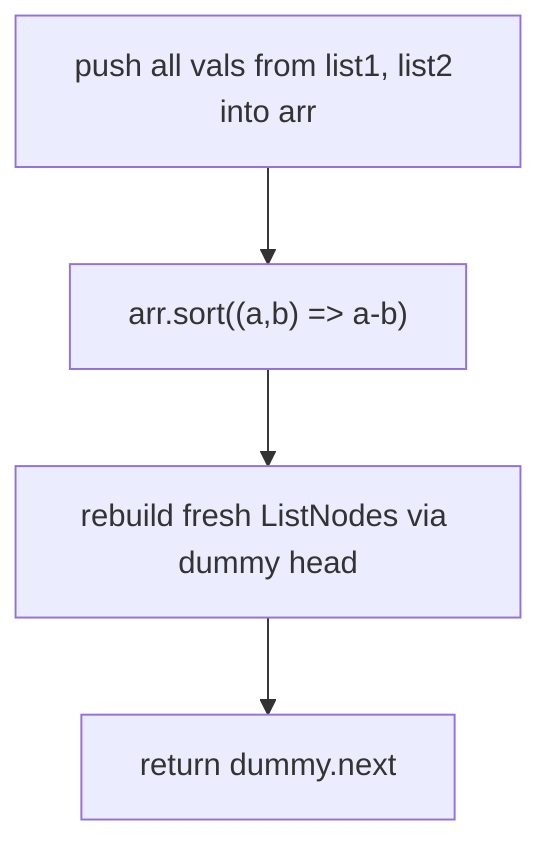
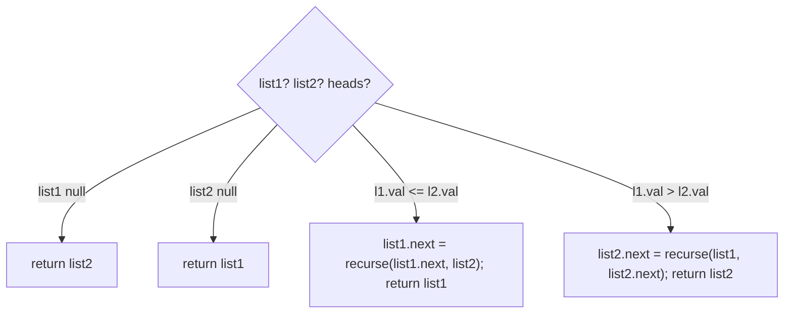

# 21. Merge Two Sorted Lists

- **LeetCode Link**: `https://leetcode.com/problems/merge-two-sorted-lists/`
- **Difficulty**: Easy
- **Pattern Category**: Linked List / Dummy Head Merge
- **Prerequisite Primer**: `00-foundations/03-core-algorithmic-patterns.md`

---

## 1. Problem Overview & Edge Case Matrix

### Problem Statement
You are given the heads of two sorted linked lists `list1` and `list2`. Merge the two lists into one sorted list. The list should be made by splicing together the nodes of the first two lists.

Return the head of the merged linked list.

```
Example 1:
Input: list1 = [1,2,4], list2 = [1,3,4]
Output: [1,1,2,3,4,4]

Example 2:
Input: list1 = [], list2 = []
Output: []

Example 3:
Input: list1 = [], list2 = [0]
Output: [0]
```

### Visual Problem Representation
```
list1:  1 -> 2 -> 4
list2:  1 -> 3 -> 4
                  v  v  v  v  v  v
merged: 1 -> 1 -> 2 -> 3 -> 4 -> 4   (nodes spliced, never copied)
```

### Upfront Edge Case Matrix
| Edge Case Category | Specific Input Scenario | Expected Behavior | Pitfall / Risk |
| :--- | :--- | :--- | :--- |
| Empty / Nil | Both lists `null` | Return `null` | Dummy-head `.next` returns `null` correctly — or crash without dummy |
| Single Element | `[0] + []` | Return `[0]` | Tail-attach step skipped |
| All Identical / Duplicates | `[1,1] + [1,1]` | `[1,1,1,1]`, stable | `<` vs `<=` flips which list's node wins ties |
| Uneven lengths | `[1] + [2,3,4,5]` | Attach remainder wholesale | Looping to copy the tail node-by-node (still correct, just wasteful) |
| Negative values | `[-3,-1] + [-2,0]` | Sorted merge preserved | Value-comparison sign bugs |

---

## 2. Level 1: Brute Force Approach

### Intuition & Visual Idea
Drain both lists into an array, sort numerically, and rebuild a brand-new list. Correct, trivially writable under pressure — but it copies every node ($O(N)$ space) and pays a sort for already-sorted input.



### Pseudocode
```text
FUNCTION mergeTwoListsBruteForce(list1, list2):
    arr = []
    WHILE list1 NOT NULL: arr.PUSH(list1.val); list1 = list1.next
    WHILE list2 NOT NULL: arr.PUSH(list2.val); list2 = list2.next
    arr.SORT_NUMERICALLY()
    dummy = ListNode(0); cur = dummy
    FOR EACH v IN arr: cur.next = ListNode(v); cur = cur.next
    RETURN dummy.next
```

### Step-by-Step Dry Run (Visual Trace)
| Step | Iteration / Pointer ($i, j$) | Current Value | State / Sub-array | Action Taken |
| :--- | :--- | :--- | :--- | :--- |
| 0 | drain `list1` | `1, 2, 4` | `arr = [1,2,4]` | Push values |
| 1 | drain `list2` | `1, 3, 4` | `arr = [1,2,4,1,3,4]` | Push values |
| 2 | numeric sort | — | `arr = [1,1,2,3,4,4]` | Comparator sort |
| 3 | rebuild | fresh nodes | `1 -> 1 -> 2 -> 3 -> 4 -> 4` | Return new list |

### Modern JavaScript Implementation
```javascript
/**
 * Shared backbone: LeetCode provides ListNode; defined once here so every
 * level below is locally runnable when concatenated (Level 1 + 2 + 3).
 * Time Complexity:  n/a (scaffolding)
 * Space Complexity: n/a (scaffolding)
 */
class ListNode {
  constructor(val, next = null) {
    this.val = val;
    this.next = next;
  }
}

function arrayToList(arr) {
  const dummy = new ListNode(0);
  let cur = dummy;
  for (const v of arr) {
    cur.next = new ListNode(v);
    cur = cur.next;
  }
  return dummy.next;
}

function listToArray(head) {
  const out = [];
  while (head !== null) {
    out.push(head.val);
    head = head.next;
  }
  return out;
}

/**
 * Level 1: Brute Force (drain, sort, rebuild)
 * Time Complexity:  O((N+M) log(N+M)) — dominated by the sort
 * Space Complexity: O(N+M) — value array plus a fully copied list
 */
function mergeTwoListsBruteForce(list1, list2) {
  const vals = [];
  for (let c = list1; c !== null; c = c.next) vals.push(c.val);
  for (let c = list2; c !== null; c = c.next) vals.push(c.val);
  // Numeric comparator is mandatory: default sort is lexicographic.
  vals.sort((a, b) => a - b);
  const dummy = new ListNode(0);
  let cur = dummy;
  for (const v of vals) {
    cur.next = new ListNode(v);
    cur = cur.next;
  }
  return dummy.next;
}
```

### Complexity Breakdown
- **Time Complexity**: $O((N+M) \log(N+M))$ — sorting already-sorted input is pure waste.
- **Space Complexity**: $O(N+M)$ — duplicates every node instead of splicing.

---

## 3. Level 2: Optimized Approach

### Intuition & Visual Bottleneck Elimination
Both inputs are already sorted — a single comparison pass suffices. The recursive version picks the smaller head and recurses on the remainder. Elegant and $O(1)$ auxiliary space, but depth equals output length.



### Pseudocode
```text
FUNCTION mergeTwoListsRecursive(list1, list2):
    IF list1 NULL: RETURN list2
    IF list2 NULL: RETURN list1
    IF list1.val <= list2.val:
        list1.next = mergeTwoListsRecursive(list1.next, list2)
        RETURN list1
    ELSE:
        list2.next = mergeTwoListsRecursive(list1, list2.next)
        RETURN list2
```

### Step-by-Step Dry Run (Visual Trace)
| Step | Pointers / Window | Hash Map / Auxiliary State | Decision Logic | Output Accumulator |
| :--- | :--- | :--- | :--- | :--- |
| 1 | `1 vs 1` | tie | `<=` keeps `list1`'s node (stable) | pick `1a`, recurse |
| 2 | `2 vs 1` | `2 > 1` | Take `list2`'s node | `1a -> 1b`, recurse |
| 3 | `2 vs 3` | `2 <= 3` | Take `list1`'s node | `... -> 2`, recurse |
| 4 | `4 vs 3` | `4 > 3` | Take `list2`'s node | `... -> 3`, recurse |
| 5 | `4 vs 4` | tie | Take `list1`'s node | `... -> 4a -> 4b` |

### Modern JavaScript Implementation
```javascript
/**
 * Level 2: Optimized (recursion over sorted heads)
 * Time Complexity:  O(N + M) — one frame per emitted node
 * Space Complexity: O(N + M) — call stack depth equals output length
 */
// ListNode shared from Level 1.
function mergeTwoListsRecursive(list1, list2) {
  // Exhaustion base cases: splice the remainder wholesale.
  if (list1 === null) return list2;
  if (list2 === null) return list1;
  // <= keeps the merge stable: list1's node wins ties.
  if (list1.val <= list2.val) {
    list1.next = mergeTwoListsRecursive(list1.next, list2);
    return list1;
  }
  list2.next = mergeTwoListsRecursive(list1, list2.next);
  return list2;
}
```

### Complexity Breakdown
- **Time Complexity**: $O(N + M)$ — each frame emits exactly one node.
- **Space Complexity**: $O(N + M)$ — recursion depth; fails V8's $\sim 10^4$-frame limit on long lists.

---

## 4. Level 3: Most Optimal / Canonical Approach

### Intuition & Mathematical / Invariant Proof
Iterative dummy-head splice: compare heads, link the smaller node, advance. When one list exhausts, link the remainder in $O(1)$ — no copying, no stack. Invariant: `tail` always ends the merged prefix containing exactly the consumed nodes in sorted order; the unmerged suffixes remain sorted, so the next pick is always a head comparison.

```
dummy -> 1a -> 1b -> 2 -> 3 -> 4a -> 4b
         tail sweeps forward; list1/list2 shrink; leftover linked wholesale
```

### Pseudocode
```text
FUNCTION mergeTwoLists(list1, list2):
    dummy = ListNode(0); tail = dummy
    WHILE list1 NOT NULL AND list2 NOT NULL:
        IF list1.val <= list2.val: tail.next = list1; list1 = list1.next
        ELSE: tail.next = list2; list2 = list2.next
        tail = tail.next
    tail.next = list1 ?? list2   // splice the surviving remainder
    RETURN dummy.next
```

### Step-by-Step Dry Run (Visual Trace)
| Step | Pointer $L$ | Pointer $R$ | Invariant Checked | In-Place State |
| :--- | :--- | :--- | :--- | :--- |
| 1 | `list1=1` | `list2=1` | Tie, `<=` picks `list1` | `dummy -> 1a` |
| 2 | `list1=2` | `list2=1` | `2 > 1`, pick `list2` | `... -> 1b` |
| 3 | `list1=2` | `list2=3` | `2 <= 3` | `... -> 2` |
| 4 | `list1=4` | `list2=3` | `4 > 3` | `... -> 3` |
| 5 | `list1=4` | `list2=4` | Tie, pick `list1` | `... -> 4a` |
| 6 | `list1=null` | `list2=4` | Loop exits, splice rest | `... -> 4b` |

### Modern JavaScript Implementation
```javascript
/**
 * Level 3: Most Optimal / Canonical (iterative dummy-head splice)
 * Time Complexity:  O(N + M) — single pass, optimal lower bound
 * Space Complexity: O(1) auxiliary — nodes relinked, never copied
 */
// ListNode shared from Level 1.
function mergeTwoLists(list1, list2) {
  const dummy = new ListNode(0); // removes empty-result branching
  let tail = dummy;
  while (list1 !== null && list2 !== null) {
    // Stable tie-break: list1's node wins, preserving input order.
    if (list1.val <= list2.val) {
      tail.next = list1;
      list1 = list1.next;
    } else {
      tail.next = list2;
      list2 = list2.next;
    }
    tail = tail.next;
  }
  // Exactly one remainder is non-null; link it wholesale in O(1).
  tail.next = list1 ?? list2;
  return dummy.next;
}
```

### Complexity Breakdown
- **Time Complexity**: $O(N + M)$ — optimal lower bound; every node is visited once.
- **Space Complexity**: $O(1)$ auxiliary — pure pointer surgery, zero allocation beyond the dummy.

---

## 5. JavaScript-Specific Gotchas & V8 Optimizations
- **GC Pressure**: Avoid allocating objects inside tight loops ($O(N)$ closures). Level 3 allocates exactly one dummy node total — Level 1's $N+M$ fresh nodes are the waste being eliminated.
- **Type Coercion / Sorting**: Level 1's `vals.sort()` without `(a, b) => a - b` sorts lexicographically (`[1, 11, 2]`) — the classic JS footgun, called out in every interview.
- **Index Bounds**: Recursion in Level 2 overflows V8's call stack past $\sim 10^4$ nodes; the iterative Level 3 has no depth limit. `??` for the remainder splice reads cleaner than chained ternaries and short-circuits correctly on `null`.

---

## 6. Real-World MAANG Interview Follow-Ups & Extensions

### Follow-Up 1: Merge K sorted lists
- **Scenario**: Generalize from 2 lists to $K$ lists (LeetCode 23).
- **Solution Strategy**: Min-heap of $K$ heads ($O(N \log K)$) or pairwise divide-and-conquer merge reusing this Level 3 as the subroutine ($O(N \log K)$, better constants for small $K$).
- **JS Code / Implementation Pattern**:
```javascript
function mergeKLists(lists) {
  if (lists.length === 0) return null;
  let merged = lists[0];
  for (let i = 1; i < lists.length; i++) merged = mergeTwoLists(merged, lists[i]);
  return merged;
}
```

### Follow-Up 2: Streaming merge of two $10^9$-node sorted feeds
- **Scenario**: Lists arrive as streams; only heads fit in memory.
- **Solution Strategy**: Same head-comparison loop over async iterators — $O(1)$ memory; emit winners downstream instead of linking.
- **JS Code / Implementation Pattern**:
```javascript
async function* mergeStreams(genA, genB) {
  let a = await genA.next(), b = await genB.next();
  while (!a.done && !b.done) {
    if (a.value <= b.value) { yield a.value; a = await genA.next(); }
    else { yield b.value; b = await genB.next(); }
  }
  yield* drainRemaining(a.done ? genB : genA, a.done ? b : a);
}
```

### Follow-Up 3: In-place merge with concurrent readers
- **Scenario & In-Depth Solution**: Readers traverse while a writer splices. Pointer surgery is not atomic across two stores (`tail.next = x; advance`), so readers can observe a transient fork. Fix: version-stamp the merged head per batch, or merge copy-on-write segments and atomically swap the head reference — readers pin a version, writer publishes the next.
```javascript
// Copy-on-write segment publish: single atomic head swap
function publishMerged(headRef, newHead, version) {
  headRef.current = { head: newHead, version }; // one store => atomic for readers
}
```
