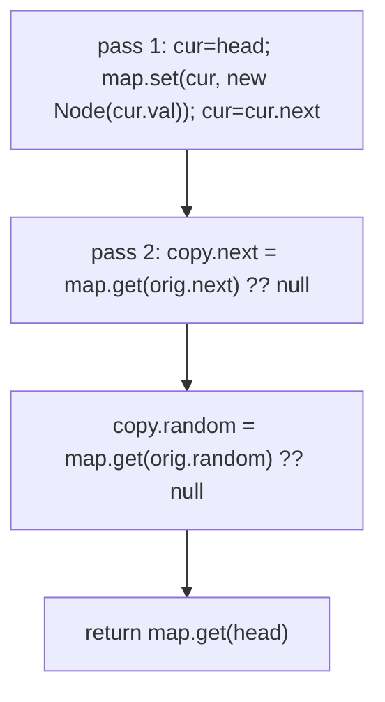
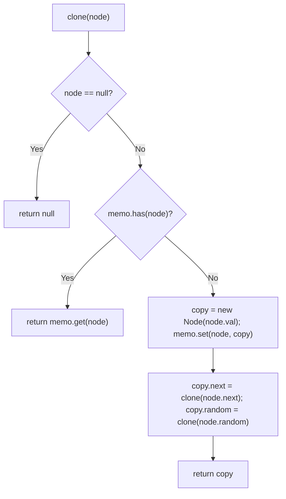
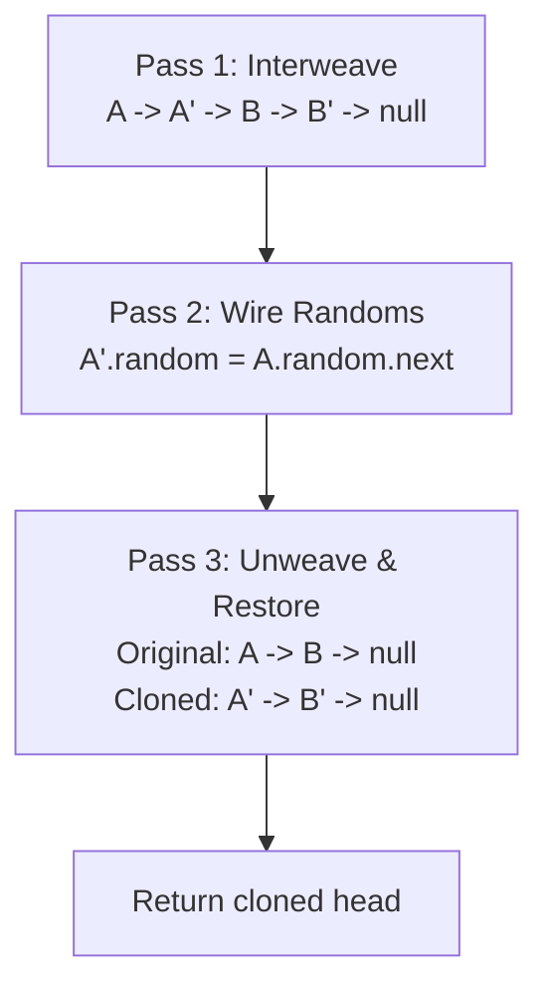

# 138. Copy List with Random Pointer

- **LeetCode Link**: `https://leetcode.com/problems/copy-list-with-random-pointer/`
- **Difficulty**: Medium
- **Pattern Category**: Linked List / Hash Map Cloning + In-Place Weave
- **Prerequisite Primer**: `00-foundations/03-core-algorithmic-patterns.md`

---

## 1. Problem Overview & Edge Case Matrix

### Problem Statement
A linked list of length `n` is given such that each node contains an additional random pointer, which could point to any node in the list, or `null`. Construct a deep copy of the list. The deep copy should consist of exactly `n` brand new nodes, where each new node has its value set to the value of its corresponding original node. Both the `next` and `random` pointers of the new nodes should point to new nodes in the copied list such that the pointers in the original list and copied list represent the same list state.

```
Example 1:
Input: head = [[7,null],[13,0],[11,4],[10,2],[1,0]]
Output: [[7,null],[13,0],[11,4],[10,2],[1,0]]

Example 2:
Input: head = [[1,1],[2,1]]
Output: [[1,1],[2,1]]

Example 3:
Input: head = [[3,null],[3,0],[3,null]]
Output: [[3,null],[3,0],[3,null]]
```

### Visual Problem Representation
```
orig:   7 -------> null
        13 -> random -> 7
        11 -> random -> 1
        10 -> random -> 11
        1  -> random -> 7

copy:   7' -> 13' -> 11' -> 10' -> 1'   (all fresh objects)
        random' pointers mirror orig topology, pointing ONLY at ' nodes
```

### Upfront Edge Case Matrix
| Edge Case Category | Specific Input Scenario | Expected Behavior | Pitfall / Risk |
| :--- | :--- | :--- | :--- |
| Empty / Nil | `head = null` | Return `null` | Map/weave loop on null head |
| Single Element | `[[1,null]]`, self-random `[[1,0]]` | Faithful single-node copy | Self-random pointing at original |
| All randoms null | `[[3,null],[3,null]]` | Plain deep copy | Over-engineering random wiring |
| Random points forward | `[[1,1],[2,1]]` | Copy's random targets copy nodes | Wiring to original nodes (shallow) |
| Original must be intact | Any input | Original `next`/`random` unchanged | Weave pass that forgets to unweave |

---

## 2. Level 1: Brute Force Approach

### Intuition & Visual Idea
Two passes with a `Map` from original node to its copy. Pass 1 clones every node (value only) and records the mapping. Pass 2 wires `next` and `random` through the map. Obviously correct — the map is the bridge between old topology and new objects.



### Pseudocode
```text
FUNCTION copyRandomListBruteForce(head):
    IF head NULL: RETURN NULL
    map = EMPTY MAP  // orig node -> copy node
    cur = head
    WHILE cur NOT NULL: map.SET(cur, Node(cur.val)); cur = cur.next
    cur = head
    WHILE cur NOT NULL:
        copy = map.GET(cur)
        copy.next = map.GET(cur.next) ?? NULL
        copy.random = map.GET(cur.random) ?? NULL
        cur = cur.next
    RETURN map.GET(head)
```

### Step-by-Step Dry Run (Visual Trace)
| Step | Iteration / Pointer ($i, j$) | Current Value | State / Sub-array | Action Taken |
| :--- | :--- | :--- | :--- | :--- |
| 0 | pass 1 over `[[1,1],[2,1]]` | node `1` | `map = {1->1'}` | Clone value |
| 1 | pass 1 | node `2` | `map = {1->1', 2->2'}` | Clone value |
| 2 | pass 2 | `1'` | `1'.next = 2'`, `1'.random = 2'` | Wire through map |
| 3 | pass 2 | `2'` | `2'.next = null`, `2'.random = 2'` | Self-random preserved |
| 4 | return | — | `[[1,1],[2,1]]` fresh objects | Return `map.get(head)` |

### Modern JavaScript Implementation
```javascript
/**
 * Shared backbone: LeetCode provides Node(val, next, random); defined once
 * here so every level below is locally runnable when concatenated.
 * Time Complexity:  n/a (scaffolding)
 * Space Complexity: n/a (scaffolding)
 */
class Node {
  constructor(val, next = null, random = null) {
    this.val = val;
    this.next = next;
    this.random = random;
  }
}

/**
 * Level 1: Brute Force (two-pass identity Map)
 * Time Complexity:  O(N) — two linear passes
 * Space Complexity: O(N) — one map entry plus one copy per node
 */
function copyRandomListBruteForce(head) {
  if (head === null) return null;
  // Pass 1: clone values; the map bridges old topology to new objects.
  const cloneOf = new Map();
  for (let cur = head; cur !== null; cur = cur.next) {
    cloneOf.set(cur, new Node(cur.val));
  }
  // Pass 2: wire next/random strictly through the map (never to originals).
  for (let cur = head; cur !== null; cur = cur.next) {
    const copy = cloneOf.get(cur);
    copy.next = cloneOf.get(cur.next) ?? null; // Map.get(undefined) is undefined
    copy.random = cloneOf.get(cur.random) ?? null;
  }
  return cloneOf.get(head);
}
```

### Complexity Breakdown
- **Time Complexity**: $O(N)$ — two passes, $O(1)$ amortized map ops.
- **Space Complexity**: $O(N)$ — map plus copies; the $O(N)$ map is what Level 3 eliminates.

---

## 3. Level 2: Optimized Approach

### Intuition & Visual Bottleneck Elimination
Same map idea, expressed recursively with memoization: `clone(node)` returns the existing copy or builds it, wiring `next`/`random` via recursive calls. One logical pass, elegant — but depth equals list length.



### Pseudocode
```text
FUNCTION copyRandomListRecursive(head):
    memo = EMPTY MAP
    DEFINE clone(node):
        IF node NULL: RETURN NULL
        IF memo HAS node: RETURN memo.GET(node)
        copy = Node(node.val); memo.SET(node, copy)
        copy.next = clone(node.next)
        copy.random = clone(node.random)
        RETURN copy
    RETURN clone(head)
```

### Step-by-Step Dry Run (Visual Trace)
| Step | Pointers / Window | Hash Map / Auxiliary State | Decision Logic | Output Accumulator |
| :--- | :--- | :--- | :--- | :--- |
| 1 | `clone(1)` | memo `{}` | Miss, build `1'`, memoize | Recurse `next` → `clone(2)` |
| 2 | `clone(2)` | memo `{1->1'}` | Miss, build `2'`, memoize | Recurse `random` → `clone(2)` |
| 3 | `clone(2)` again | memo `{1->1', 2->2'}` | Hit, return `2'` | Self-random wired |
| 4 | unwind to `1'` | — | `1'.random = clone(2)` → hit `2'` | `1'.next = 2'` |
| 5 | return | — | Top call returns `1'` | `[[1,1],[2,1]]` |

### Modern JavaScript Implementation
```javascript
/**
 * Level 2: Optimized (recursive memoization)
 * Time Complexity:  O(N) — each node cloned once, each edge followed once
 * Space Complexity: O(N) — memo map plus call stack depth N
 */
// Node shared from Level 1.
function copyRandomListRecursive(head) {
  const memo = new Map(); // orig -> copy; doubles as visited set
  function clone(node) {
    if (node === null) return null;
    if (memo.has(node)) return memo.get(node); // cycle/self-random safe
    // Memoize BEFORE recursing so random back-edges terminate.
    const copy = new Node(node.val);
    memo.set(node, copy);
    copy.next = clone(node.next);
    copy.random = clone(node.random);
    return copy;
  }
  return clone(head);
}
```

### Complexity Breakdown
- **Time Complexity**: $O(N)$ — each node built once thanks to memoization.
- **Space Complexity**: $O(N)$ — memo plus $O(N)$ call stack; recursion depth fails past $\sim 10^4$ nodes.

---

## 4. Level 3: Most Optimal / Canonical Approach

### Intuition & Mathematical / Invariant Proof
Achieve $O(1)$ extra space by weaving copy nodes directly between originals (`orig -> copy -> orig.next`), so `copy.random = orig.random.next` needs no map. Then unweave into two lists. Invariant after pass 1: every `orig.next` is its copy and every `copy.next` is the next original — random wiring and separation both read off this shape.

```
pass 1 (weave):  7 -> 7' -> 13 -> 13' -> 11 -> 11' ...
pass 2 (random): 13'.random = 13.random.next  (= 7')
pass 3 (split):  restore 7->13->11... and 7'->13'->11'...
```

### Pseudocode
```text
FUNCTION copyRandomList(head):
    IF head NULL: RETURN NULL
    // Pass 1: weave copy after each original.
    FOR cur = head; cur NOT NULL; cur = copy.next:
        copy = Node(cur.val); copy.next = cur.next; cur.next = copy
    // Pass 2: random via the weave (orig.random.next is its copy).
    FOR cur = head; cur NOT NULL; cur = cur.next.next:
        cur.next.random = cur.random?.next ?? NULL
    // Pass 3: unweave, restoring the original list.
    FOR cur = head; cur NOT NULL; cur = cur.next:
        copy = cur.next; cur.next = copy.next
        copy.next = copy.next?.next ?? NULL
    RETURN headCopy (saved from first weave)
```

### Step-by-Step Dry Run (Visual Trace)
| Step | Pointer $L$ | Pointer $R$ | Invariant Checked | In-Place State |
| :--- | :--- | :--- | :--- | :--- |
| 1 | pass 1 | weave | `orig.next` is its copy | `1 -> 1' -> 2 -> 2'` |
| 2 | `cur=1` | `1.random=2` | `1'.random = 2.next = 2'` | Random wired, no map |
| 3 | `cur=2` | `2.random=2` | `2'.random = 2.next = 2'` | Self-random correct |
| 4 | pass 3 | unweave | Original links restored | `1->2` and `1'->2'` |
| 5 | return | — | Original intact, copy independent | `[[1,1],[2,1]]` |

### Modern JavaScript Implementation
```javascript
/**
 * Level 3: Most Optimal / Canonical (O(1)-space weave)
 * Time Complexity:  O(N) — three linear passes, no map
 * Space Complexity: O(1) auxiliary — output list excluded
 */
// Node shared from Level 1.
function copyRandomList(head) {
  if (head === null) return null;
  // Pass 1: weave each copy directly after its original.
  for (let cur = head; cur !== null; cur = cur.next.next) {
    const copy = new Node(cur.val);
    copy.next = cur.next;
    cur.next = copy;
  }
  // Pass 2: copy.random is just orig.random.next (its woven copy).
  for (let cur = head; cur !== null; cur = cur.next.next) {
    cur.next.random = cur.random?.next ?? null;
  }
  // Pass 3: unweave — restore originals, extract the copy list.
  const copyHead = head.next;
  for (let cur = head; cur !== null; cur = cur.next) {
    const copy = cur.next;
    cur.next = copy.next; // restore original link
    copy.next = copy.next?.next ?? null; // advance copy link
  }
  return copyHead;
}
```

### Complexity Breakdown
- **Time Complexity**: $O(N)$ — three passes, optimal linear bound.
- **Space Complexity**: $O(1)$ auxiliary — the weave replaces the map; output excluded.

---

## 5. JavaScript-Specific Gotchas & V8 Optimizations
- **GC Pressure**: Avoid allocating objects inside tight loops ($O(N)$ closures). One `new Node` per element is mandatory; never allocate per-edge tuples or temporary `{ orig, copy }` pair objects.
- **Type Coercion / Sorting**: `cloneOf.get(cur.next)` with `cur.next === null` looks up `null` (missing → `undefined`) — the `?? null` normalization is load-bearing; without it, `copy.next` becomes `undefined` and `while (x !== null)` loops never terminate on it.
- **Index Bounds**: `Map` keys are object identities — value-equal nodes (`[3,null],[3,0],[3,null]`) are distinct keys. A value-keyed map (`map.get(cur.val)`) silently merges them; identity keys are the entire correctness argument.

---

## 6. Real-World MAANG Interview Follow-Ups & Extensions

### Follow-Up 1: Random pointer to an arbitrary node in a second list
- **Scenario**: `random` may point into a different list that must also be cloned exactly once.
- **Solution Strategy**: Level 2 recursion generalizes directly — one shared memo across both lists; `clone` follows cross-list edges and builds each target once.
- **JS Code / Implementation Pattern**:
```javascript
function cloneTwoLists(headA, headB, memo = new Map()) {
  return [cloneInto(headA, memo), cloneInto(headB, memo)];
}
```

### Follow-Up 2: $10^9$-node list that never fits in memory
- **Scenario**: Nodes stream from disk; only $O(1)$ nodes fit in RAM.
- **Solution Strategy**: Serialize-aware copy: stream originals once writing `(val, randomIndex)` records, then stream records building copies with an external index for random resolution — external-memory two-pass, same shape as Level 1.
- **JS Code / Implementation Pattern**:
```javascript
async function copyStreaming(nodeStream, randomIndex) {
  const copies = [];
  for await (const node of nodeStream) copies.push(new Node(node.val));
  // second streaming pass resolves random via stored indices
  return wireRandoms(copies, randomIndex);
}
```

### Follow-Up 3: Cycle-safe cloning with concurrent mutation
- **Scenario & In-Depth Solution**: The list may contain `next`-cycles and a writer mutates during the copy. Level 2's memo-before-recurse already terminates on cycles; add a version stamp per node and abort the pass if any stamp changed mid-clone, retrying — snapshot isolation without locks.
```javascript
function cloneVersioned(head) {
  const stamp = head?.__v ?? 0;
  const copy = copyRandomListRecursive(head);
  if ((head?.__v ?? 0) !== stamp) throw new Error('concurrent mutation: retry');
  return copy;
}
```

---

## 7. What LeetCode Discuss Says (Language-Independent)

Source: top-voted post by Lisong —
`https://leetcode.com/problems/copy-list-with-random-pointer/solutions/43491/a-solution-with-constant-space-complexit-no2d/`
— 253.7K views.
Language-independent summary. No new JS here.

### A. Optimal way from Discuss (Three-Pass Interweaving Pattern)

Rather than consuming $O(N)$ extra memory using a hash map to map original nodes to copies, the top Discuss solution uses an **in-place interweaving technique** in three linear passes:

1. **Pass 1 (Interweave clones):** For each original node `curr`, instantiate its copy `copy = new Node(curr.val)` and insert it immediately after `curr`: `curr -> copy -> curr.next`.
2. **Pass 2 (Assign random pointers):** For each original node `curr`, its clone is `curr.next`. If `curr.random` exists, its cloned counterpart is `curr.random.next`. Hence: `curr.next.random = curr.random.next`.
3. **Pass 3 (Separate and restore):** Unweave the interwoven list into two independent lists: restore original pointers `curr.next = copy.next` and stitch cloned pointers `copy.next = copy.next.next`.

```text
FUNCTION copyRandomList(head):
    IF head == null:
        RETURN null

    // Pass 1: Duplicate each node right next to itself
    curr = head
    WHILE curr != null:
        nxt = curr.next
        copy = new Node(curr.val)
        curr.next = copy
        copy.next = nxt
        curr = nxt

    // Pass 2: Assign random pointers for copies
    curr = head
    WHILE curr != null:
        IF curr.random != null:
            curr.next.random = curr.random.next
        curr = curr.next.next

    // Pass 3: Unweave and restore original list
    curr = head
    dummy = new Node(0)
    copyCurr = dummy
    WHILE curr != null:
        nxt = curr.next.next
        copy = curr.next
        copyCurr.next = copy
        copyCurr = copy
        curr.next = nxt
        curr = nxt

    RETURN dummy.next
```

- Time: O(N) where N is the length of the list across three sequential passes.
- Space: O(1) auxiliary space (excluding the returned cloned list).



### B. Dry run on small sublist (`A -> B`, `A.random = B`, `B.random = A`)

| Pass | Action | State Diagram |
| :--- | :--- | :--- |
| **Pass 1** | Duplicate nodes in-place | `A -> A' -> B -> B' -> null` |
| **Pass 2** | `A'.random = A.random.next` | `A'.random` points to `B'` |
| | `B'.random = B.random.next` | `B'.random` points to `A'` |
| **Pass 3** | Unweave lists | Original restored: `A -> B -> null`<br>Cloned output: `A' -> B' -> null` |

### C. Why In-Place Interweaving Beats Hash Tables

- **Zero Auxiliary Memory Overhead:** Eliminates the need for $O(N)$ hash tables (`Map<Node, Node>`), reducing memory footprint and preventing garbage collection stalls.
- **Cache Locality:** During random resolution, `curr.next` is immediately adjacent in cache memory rather than requiring hash bucket lookups.

### D. Pitfalls from comments

- **Failing to restore original list:** LeetCode test suites verify that the input list remains strictly identical to its initial state. Leaving `curr.next` linked to copy nodes causes instant test failure.
- **Null check on `curr.random`:** Calling `curr.random.next` when `curr.random == null` causes a null dereference runtime error. Always guard with `if (curr.random != null)`.
- **Dangling references:** When separating in Pass 3, ensure both the original list tail and cloned list tail terminate cleanly with `null`.

### E. Companies

- Discuss post itself names none.
  Companies tab on LeetCode is premium-locked.
- External source:
  `https://github.com/liquidslr/leetcode-company-wise-problems`
  (LeetCode company tags, updated June 2025).
- All-time (21): Amazon, Apple, Bloomberg, Cisco, Google, Meta, Microsoft, Oracle, Uber, etc.
- Recent: 30 days — Amazon.
- Recent: 3 months — Amazon, Google, Microsoft.
