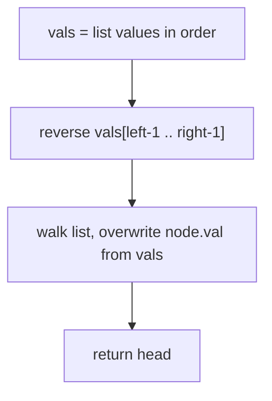
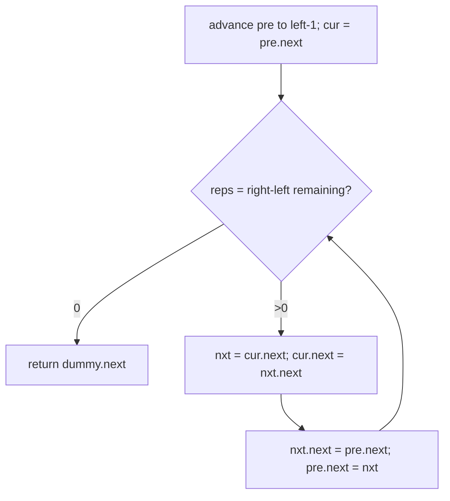
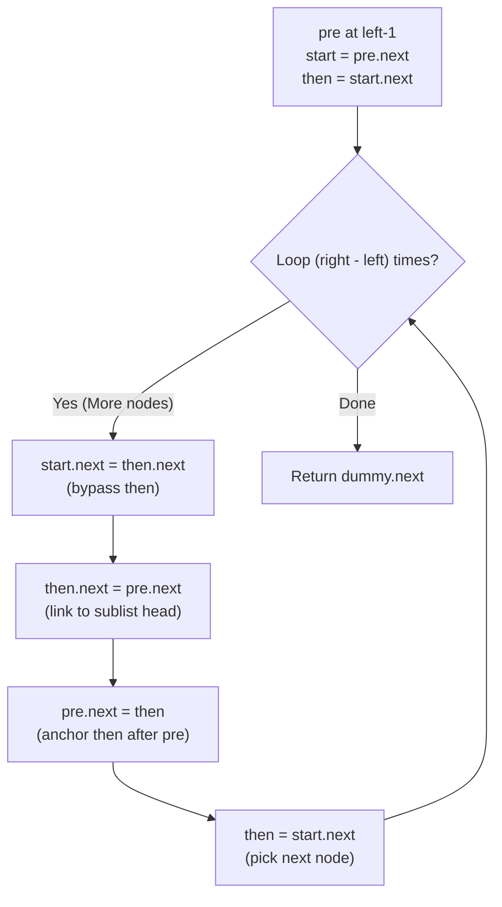

# 92. Reverse Linked List II

- **LeetCode Link**: `https://leetcode.com/problems/reverse-linked-list-ii/`
- **Difficulty**: Medium
- **Pattern Category**: Linked List / Segment Reversal + Reconnection
- **Prerequisite Primer**: `00-foundations/03-core-algorithmic-patterns.md`

---

## 1. Problem Overview & Edge Case Matrix

### Problem Statement
Given the `head` of a singly linked list and two integers `left` and `right` where `left <= right`, reverse the nodes of the list from position `left` to position `right`, and return the reversed list.

```
Example 1:
Input: head = [1,2,3,4,5], left = 2, right = 4
Output: [1,4,3,2,5]

Example 2:
Input: head = [5], left = 1, right = 1
Output: [5]
```

### Visual Problem Representation
```
before:  1 -> [2 -> 3 -> 4] -> 5
               ^segment^
after:   1 -> [4 -> 3 -> 2] -> 5
         pre  reversed block   post
```

### Upfront Edge Case Matrix
| Edge Case Category | Specific Input Scenario | Expected Behavior | Pitfall / Risk |
| :--- | :--- | :--- | :--- |
| Empty / Nil | `head = null` | Return `null` | Dummy `.next` chain on null |
| Single Element | `[5]`, `left = right = 1` | Return `[5]` unchanged | Reversal loop running once and self-linking |
| No-op range | `left == right` | List unchanged | Pointer surgery that drops nodes |
| Full reversal | `left = 1`, `right = n` | Whole list reversed | Losing the new head (needs dummy) |
| Tail segment | `right = n` (segment hits tail) | Reconnect to `null` cleanly | Dangling `post` reference |

---

## 2. Level 1: Brute Force Approach

### Intuition & Visual Idea
Copy values into an array, reverse the `[left-1, right-1]` slice in place, then write values back into the nodes. Structure untouched — only values move. $O(N)$ space, two passes, zero pointer risk.



### Pseudocode
```text
FUNCTION reverseBetweenBruteForce(head, left, right):
    vals = []
    FOR cur = head; cur NOT NULL; cur = cur.next: vals.PUSH(cur.val)
    REVERSE vals[left-1 .. right-1] IN PLACE
    i = 0
    FOR cur = head; cur NOT NULL; cur = cur.next: cur.val = vals[i++]
    RETURN head
```

### Step-by-Step Dry Run (Visual Trace)
| Step | Iteration / Pointer ($i, j$) | Current Value | State / Sub-array | Action Taken |
| :--- | :--- | :--- | :--- | :--- |
| 0 | drain | `1,2,3,4,5` | `vals = [1,2,3,4,5]` | Copy values |
| 1 | reverse slice `[1..3]` | — | `vals = [1,4,3,2,5]` | In-place slice reverse |
| 2 | write back | walk nodes | nodes take `1,4,3,2,5` | Overwrite values |
| 3 | return | — | `[1,4,3,2,5]` | Structure unchanged |

### Modern JavaScript Implementation
```javascript
/**
 * Shared backbone: LeetCode provides ListNode; defined once here so every
 * level below is locally runnable when concatenated (Level 1 + 2 + 3).
 * Time Complexity:  n/a (scaffolding)
 * Space Complexity: n/a (scaffolding)
 */
class ListNode {
  constructor(val, next = null) {
    this.val = val;
    this.next = next;
  }
}

function arrayToList(arr) {
  const dummy = new ListNode(0);
  let cur = dummy;
  for (const v of arr) {
    cur.next = new ListNode(v);
    cur = cur.next;
  }
  return dummy.next;
}

function listToArray(head) {
  const out = [];
  while (head !== null) {
    out.push(head.val);
    head = head.next;
  }
  return out;
}

/**
 * Level 1: Brute Force (value-array slice reversal)
 * Time Complexity:  O(N) — drain, slice reverse, writeback
 * Space Complexity: O(N) — full value copy
 */
function reverseBetweenBruteForce(head, left, right) {
  const vals = [];
  for (let cur = head; cur !== null; cur = cur.next) vals.push(cur.val);
  // Reverse only the 0-based slice [left-1, right-1].
  let lo = left - 1;
  let hi = right - 1;
  while (lo < hi) {
    [vals[lo], vals[hi]] = [vals[hi], vals[lo]];
    lo++;
    hi--;
  }
  let i = 0;
  for (let cur = head; cur !== null; cur = cur.next) cur.val = vals[i++];
  return head;
}
```

### Complexity Breakdown
- **Time Complexity**: $O(N)$ — three linear walks.
- **Space Complexity**: $O(N)$ — value array; structure surgery avoided at memory cost.

---

## 3. Level 2: Optimized Approach

### Intuition & Visual Bottleneck Elimination
Reverse links, not values, via head-insertion: walk to `left`, then repeatedly pluck the node after `cur` and insert it right after `pre`. $O(1)$ space, one pass — no array, no second walk.



### Pseudocode
```text
FUNCTION reverseBetweenHeadInsert(head, left, right):
    dummy = ListNode(0, head); pre = dummy
    REPEAT left-1 TIMES: pre = pre.next
    cur = pre.next
    REPEAT right-left TIMES:
        nxt = cur.next
        cur.next = nxt.next      // pluck
        nxt.next = pre.next      // insert after pre
        pre.next = nxt
    RETURN dummy.next
```

### Step-by-Step Dry Run (Visual Trace)
| Step | Pointers / Window | Hash Map / Auxiliary State | Decision Logic | Output Accumulator |
| :--- | :--- | :--- | :--- | :--- |
| 0 | `pre=1, cur=2` | `right-left = 2` reps | Setup | `1 -> 2 -> 3 -> 4 -> 5` |
| 1 | pluck `3` | insert after `pre` | `cur.next` skips `3` | `1 -> 3 -> 2 -> 4 -> 5` |
| 2 | pluck `4` | insert after `pre` | `cur.next` skips `4` | `1 -> 4 -> 3 -> 2 -> 5` |
| 3 | reps exhausted | — | Return `dummy.next` | `[1,4,3,2,5]` |

### Modern JavaScript Implementation
```javascript
/**
 * Level 2: Optimized (head-insertion relinking)
 * Time Complexity:  O(N) — one walk to left plus (right-left) insertions
 * Space Complexity: O(1) — pointer surgery only
 */
// ListNode shared from Level 1.
function reverseBetweenHeadInsert(head, left, right) {
  const dummy = new ListNode(0, head); // left = 1 needs a stable pre
  let pre = dummy;
  for (let i = 1; i < left; i++) pre = pre.next;
  const cur = pre.next; // fixed anchor: segment tail after reversal
  // Each rep moves the node after cur to the segment front.
  for (let i = 0; i < right - left; i++) {
    const nxt = cur.next; // the node to relocate
    cur.next = nxt.next; // pluck it out
    nxt.next = pre.next; // splice after pre
    pre.next = nxt;
  }
  return dummy.next;
}
```

### Complexity Breakdown
- **Time Complexity**: $O(N)$ — single pass to `left` plus segment-length insertions.
- **Space Complexity**: $O(1)$ — three pointers, zero allocation beyond dummy.

---

## 4. Level 3: Most Optimal / Canonical Approach

### Intuition & Mathematical / Invariant Proof
The canonical cut-and-reconnect: advance `pre` to just before the segment, reverse exactly `(right-left+1)` links with the standard `prev/cur` loop, then reconnect `pre.next` (segment tail) to the successor and the old segment head to `pre`. Invariant: after $k$ reversal steps, `prev` heads the reversed $k$-prefix and `cur` points at the next unprocessed node — reconnection is two stores, provably lossless.

```
pre=1 -> [2 -> 3 -> 4] -> 5(post)
  reverse 3 links: prev=4 -> 3 -> 2, cur=5
  reconnect: pre.next(tail 2).next = 5; pre.next = 4
=> 1 -> 4 -> 3 -> 2 -> 5
```

### Pseudocode
```text
FUNCTION reverseBetween(head, left, right):
    dummy = ListNode(0, head); pre = dummy
    REPEAT left-1 TIMES: pre = pre.next
    prev = NULL; cur = pre.next
    REPEAT right-left+1 TIMES:
        nxt = cur.next; cur.next = prev; prev = cur; cur = nxt
    tail = pre.next           // old segment head, now the tail
    tail.next = cur           // reconnect to successor
    pre.next = prev           // reconnect reversed head
    RETURN dummy.next
```

### Step-by-Step Dry Run (Visual Trace)
| Step | Pointer $L$ | Pointer $R$ | Invariant Checked | In-Place State |
| :--- | :--- | :--- | :--- | :--- |
| 0 | `pre=1` | `cur=2` | `pre` before segment | Setup |
| 1 | `prev=2` | `cur=3` | 1-link reversed prefix | `2 -> null` |
| 2 | `prev=3` | `cur=4` | 2-link reversed prefix | `3 -> 2` |
| 3 | `prev=4` | `cur=5` | Full segment reversed | `4 -> 3 -> 2` |
| 4 | reconnect | `tail=2` | `2.next = 5`, `pre.next = 4` | `[1,4,3,2,5]` |

### Modern JavaScript Implementation
```javascript
/**
 * Level 3: Most Optimal / Canonical (segment reverse + reconnect)
 * Time Complexity:  O(N) — single pass, optimal lower bound
 * Space Complexity: O(1) auxiliary — in-place link reversal
 */
// ListNode shared from Level 1.
function reverseBetween(head, left, right) {
  const dummy = new ListNode(0, head); // left = 1 needs a stable pre
  let pre = dummy;
  for (let i = 1; i < left; i++) pre = pre.next;
  // Standard reversal over exactly the segment length.
  let prev = null;
  let cur = pre.next;
  for (let i = 0; i < right - left + 1; i++) {
    const nxt = cur.next;
    cur.next = prev;
    prev = cur;
    cur = nxt;
  }
  // pre.next is the old segment head (now tail): reconnect both ends.
  pre.next.next = cur; // tail -> successor (may be null at list end)
  pre.next = prev; // pre -> reversed segment head
  return dummy.next;
}
```

### Complexity Breakdown
- **Time Complexity**: $O(N)$ — optimal lower bound; `pre` walk plus one segment pass.
- **Space Complexity**: $O(1)$ auxiliary — constant pointers, one dummy.

---

## 5. JavaScript-Specific Gotchas & V8 Optimizations
- **GC Pressure**: Avoid allocating objects inside tight loops ($O(N)$ closures). Levels 2–3 allocate one dummy total; Level 1's value array of $N$ numbers is the pressure removed.
- **Type Coercion / Sorting**: Positions are 1-based per spec — `left - 1` conversions belong in exactly one place; mixing 0-based slice math with 1-based walk counts is the top off-by-one source.
- **Index Bounds**: `pre.next.next = cur` order matters — read `pre.next` (tail) before overwriting `pre.next`; reversed assignment order orphans the segment. When `right = n`, `cur` is legitimately `null` and the tail must point at `null`, not throw.

---

## 6. Real-World MAANG Interview Follow-Ups & Extensions

### Follow-Up 1: Reverse in k-groups and arbitrary ranges (this module's arc)
- **Scenario**: Generalize segment reversal to repeated k-blocks (LeetCode 25) or a list of disjoint ranges.
- **Solution Strategy**: Reuse Level 3 as a subroutine per range; for k-groups, loop while $k$ nodes remain, reconnecting each reversed block's tail to the next block head.
- **JS Code / Implementation Pattern**:
```javascript
function reverseRanges(head, ranges) {
  let out = head;
  for (const [l, r] of ranges) out = reverseBetween(out, l, r);
  return out;
}
```

### Follow-Up 2: $10^9$-node list with segment reversal
- **Scenario**: The list streams from disk; only the segment plus $O(1)$ anchors fit in memory.
- **Solution Strategy**: Stream-skip to `left-1` (no storage), buffer exactly the segment, reverse the buffer, splice back into the stream — memory proportional to segment length only.
- **JS Code / Implementation Pattern**:
```javascript
async function reverseStreamSegment(nodeStream, left, right) {
  const buf = [];
  let i = 0;
  for await (const node of nodeStream) {
    i++;
    if (i >= left && i <= right) buf.unshift(node); // reversed insert
    else emit(node);
    if (i === right) buf.forEach(emit);
  }
}
```

### Follow-Up 3: Persistent (immutable) segment reversal
- **Scenario & In-Depth Solution**: Readers hold the old list while a writer reverses a segment — mutation would corrupt readers. Path-copy the segment: build fresh nodes for `[left, right]` in reversed order, sharing (not copying) the prefix and suffix nodes. $O(\text{segment})$ new nodes, old version intact.
```javascript
function reverseBetweenPersistent(head, left, right) {
  const vals = [];
  for (let c = head, i = 1; c; c = c.next, i++) {
    if (i >= left && i <= right) vals.unshift(c.val);
  }
  // rebuild only the segment; prefix/suffix shared by reference
  return spliceSegment(head, left, right, vals);
}
```

---

## 7. What LeetCode Discuss Says (Language-Independent)

Source: top-voted post by Ardya Dipta Nandaviri —
`https://leetcode.com/problems/reverse-linked-list-ii/solutions/30666/simple-java-solution-with-clear-explanat-yd1u/`
— 124.7K views.
Language-independent summary. No new JS here.

### A. Optimal way from Discuss (One-Pass Head-Insertion Reversal)

Rather than severing the subsegment, reversing it in isolation, and stitching seams back together, the optimal Discuss technique performs an **in-place head insertion** in a single pass using four pointers (`dummy`, `pre`, `start`, `then`):

1. Position a sentinel `dummy` node before `head`.
2. Advance `pre` by `left - 1` steps so it points directly before the reversal zone.
3. Fix `start = pre.next` (the initial node of the sublist, which will end up as the sublist's tail).
4. Repeatedly pluck node `then = start.next` and move it to the front of the reversed section (right after `pre`):
   - `start.next = then.next` (bypass `then`)
   - `then.next = pre.next` (link `then` to the current front)
   - `pre.next = then` (update front of sublist)
   - `then = start.next` (advance `then` to next candidate)
5. Repeat for exactly `right - left` iterations.

```text
FUNCTION reverseBetween(head, left, right):
    IF head == null OR left == right:
        RETURN head

    dummy = new ListNode(0)
    dummy.next = head
    pre = dummy

    FOR i FROM 1 TO left - 1:
        pre = pre.next

    start = pre.next
    then = start.next

    FOR i FROM 0 TO (right - left - 1):
        start.next = then.next
        then.next = pre.next
        pre.next = then
        then = start.next

    RETURN dummy.next
```

- Time: O(N) single-pass traversal visiting at most `right` nodes.
- Space: O(1) auxiliary pointer manipulation in-place.



### B. Dry run on LeetCode Example 1 (`head = [1,2,3,4,5], left = 2, right = 4`)

Initial list: `dummy -> 1 -> 2 -> 3 -> 4 -> 5`. `pre = 1`, `start = 2`, `then = 3`.

| Iteration | Action | Pointer State | Resulting Chain |
| :--- | :--- | :--- | :--- |
| `i = 0` | Move 3 after `pre` (1) | `pre=1, start=2, then=4` | `dummy -> 1 -> 3 -> 2 -> 4 -> 5` |
| `i = 1` | Move 4 after `pre` (1) | `pre=1, start=2, then=5` | `dummy -> 1 -> 4 -> 3 -> 2 -> 5` |
| Done | Loop finished | - | Return `dummy.next` |

Output: `[1, 4, 3, 2, 5]`.

### C. Why Head-Insertion Beats Disconnect-and-Reconnect

- **Seam Safety:** Standard reverse breaks the list into three disconnected fragments (`left`, `mid`, `right`), requiring careful re-attachment of edge pointers.
- **Continuous Invariant:** The list remains valid and connected after each inner step of head insertion.

### D. Pitfalls from comments

- **Reversing from head (`left = 1`):** Without a `dummy` node, moving nodes before `head` invalidates original references. `pre` starting at `dummy` handles `left = 1` uniformly.
- **Off-by-one iterations:** The loop must execute exactly `right - left` times, moving `right - left` nodes to the front.
- **Null pointer when `right` exceeds list length:** Constraints state $1 \le \text{left} \le \text{right} \le N$, ensuring `then` is never null during the loop.

### E. Companies

- Discuss post itself names none.
  Companies tab on LeetCode is premium-locked.
- External source:
  `https://github.com/liquidslr/leetcode-company-wise-problems`
  (LeetCode company tags, updated June 2025).
- All-time (16): Amazon, Apple, Bloomberg, Cisco, Google, Meta, Microsoft, Oracle, Uber, etc.
- Recent: 30 days — Amazon, Bloomberg.
- Recent: 3 months — Amazon, Bloomberg, Google, Microsoft.
