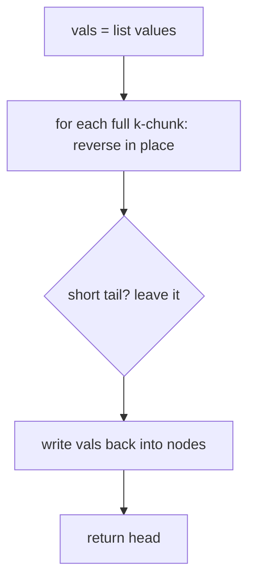
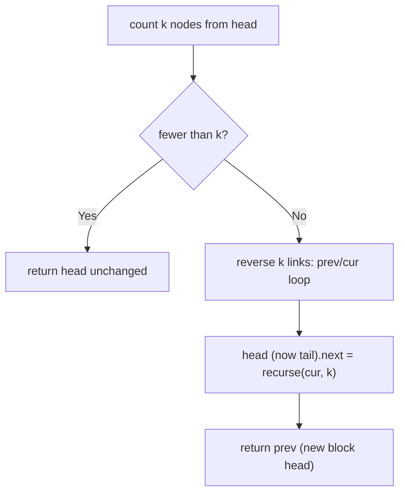
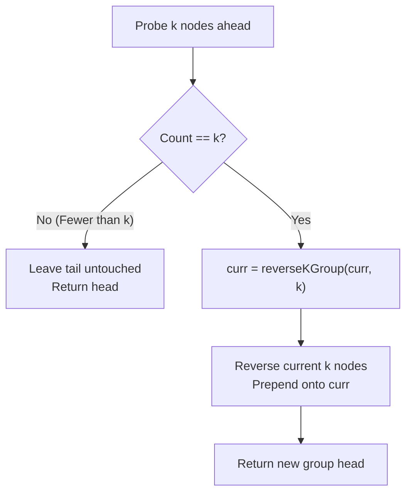

# 25. Reverse Nodes in k-Group

- **LeetCode Link**: `https://leetcode.com/problems/reverse-nodes-in-k-group/`
- **Difficulty**: Hard
- **Pattern Category**: Linked List / Block Reversal + Group Guard
- **Prerequisite Primer**: `00-foundations/03-core-algorithmic-patterns.md`

---

## 1. Problem Overview & Edge Case Matrix

### Problem Statement
Given the `head` of a linked list, reverse the nodes of the list `k` at a time, and return the modified list. `k` is a positive integer and is less than or equal to the length of the linked list. If the number of nodes is not a multiple of `k` then left-out nodes, in the end, should remain as it is. You may not alter the values in the list's nodes, only nodes themselves may be changed.

```
Example 1:
Input: head = [1,2,3,4,5], k = 2
Output: [2,1,4,3,5]

Example 2:
Input: head = [1,2,3,4,5], k = 3
Output: [3,2,1,4,5]
```

### Visual Problem Representation
```
k = 3:   [1 -> 2 -> 3] -> [4 -> 5]        (last group short: untouched)
          v reverse v
         [3 -> 2 -> 1] -> [4 -> 5]
```

### Upfront Edge Case Matrix
| Edge Case Category | Specific Input Scenario | Expected Behavior | Pitfall / Risk |
| :--- | :--- | :--- | :--- |
| Empty / Nil | `head = null` | Return `null` | Group scan on null |
| Single Element | `[1]`, `k = 1` | Return `[1]` | Self-reversal corrupting `.next` |
| `k = 1` | Any list | List unchanged | Reversal loop that still relinks |
| Short tail | `[1,2,3,4,5]`, `k = 3` | `[3,2,1,4,5]` | Reversing the leftover 2 nodes |
| `k > n` | `[1,2]`, `k = 3` | List unchanged | Partial-group reversal at head |

---

## 2. Level 1: Brute Force Approach

### Intuition & Visual Idea
Copy values to an array, reverse each full chunk of size `k` (leaving a short tail untouched), and write values back. No pointer surgery — but it alters values, which the statement forbids, so this is strictly a baseline for reasoning, not a submittable solution.



### Pseudocode
```text
FUNCTION reverseKGroupBruteForce(head, k):
    vals = DRAIN(head)
    FOR start = 0; start + k <= vals.LENGTH; start += k:
        REVERSE vals[start .. start+k-1]
    WRITE vals BACK into nodes
    RETURN head
```

### Step-by-Step Dry Run (Visual Trace)
| Step | Iteration / Pointer ($i, j$) | Current Value | State / Sub-array | Action Taken |
| :--- | :--- | :--- | :--- | :--- |
| 0 | drain | `1,2,3,4,5` | `vals = [1,2,3,4,5]` | Copy |
| 1 | chunk `[0..2]`, `k=3` | reverse | `vals = [3,2,1,4,5]` | Full chunk reversed |
| 2 | tail `[4,5]` | length 2 < 3 | untouched | Short tail kept |
| 3 | write back | — | nodes take `3,2,1,4,5` | Return head |

### Modern JavaScript Implementation
```javascript
/**
 * Shared backbone: LeetCode provides ListNode; defined once here so every
 * level below is locally runnable when concatenated (Level 1 + 2 + 3).
 * Time Complexity:  n/a (scaffolding)
 * Space Complexity: n/a (scaffolding)
 */
class ListNode {
  constructor(val, next = null) {
    this.val = val;
    this.next = next;
  }
}

function arrayToList(arr) {
  const dummy = new ListNode(0);
  let cur = dummy;
  for (const v of arr) {
    cur.next = new ListNode(v);
    cur = cur.next;
  }
  return dummy.next;
}

function listToArray(head) {
  const out = [];
  while (head !== null) {
    out.push(head.val);
    head = head.next;
  }
  return out;
}

/**
 * Level 1: Brute Force (value-chunk reversal)
 * NOTE: violates the "do not alter values" constraint — baseline only.
 * Time Complexity:  O(N) — drain, chunk reversals, writeback
 * Space Complexity: O(N) — full value copy
 */
function reverseKGroupBruteForce(head, k) {
  const vals = [];
  for (let cur = head; cur !== null; cur = cur.next) vals.push(cur.val);
  // Only full chunks reverse; a short tail is out of range by construction.
  for (let start = 0; start + k <= vals.length; start += k) {
    let lo = start;
    let hi = start + k - 1;
    while (lo < hi) {
      [vals[lo], vals[hi]] = [vals[hi], vals[lo]];
      lo++;
      hi--;
    }
  }
  let i = 0;
  for (let cur = head; cur !== null; cur = cur.next) cur.val = vals[i++];
  return head;
}
```

### Complexity Breakdown
- **Time Complexity**: $O(N)$ — linear, but $O(N)$ allocation plus a constraint violation.
- **Space Complexity**: $O(N)$ — value array; pointer surgery is the required direction.

---

## 3. Level 2: Optimized Approach

### Intuition & Visual Bottleneck Elimination
Reverse nodes (not values) recursively: verify $k$ nodes exist, reverse exactly $k$ links, then recurse on the remainder and stitch. Clean block structure — one group per frame — at $O(N/k)$ stack depth.



### Pseudocode
```text
FUNCTION reverseKGroupRecursive(head, k):
    count k NODES FROM head; IF FEWER: RETURN head
    prev = NULL; cur = head
    REPEAT k TIMES: nxt = cur.next; cur.next = prev; prev = cur; cur = nxt
    head.next = reverseKGroupRecursive(cur, k)  // head is now the block tail
    RETURN prev
```

### Step-by-Step Dry Run (Visual Trace)
| Step | Pointers / Window | Hash Map / Auxiliary State | Decision Logic | Output Accumulator |
| :--- | :--- | :--- | :--- | :--- |
| 0 | count from `1` | 5 nodes ≥ 3 | Full group, reverse | Frame for `[1,2,3]` |
| 1 | reverse 3 links | `prev=3`, `cur=4` | Block done | `3 -> 2 -> 1` |
| 2 | recurse from `4` | 2 nodes < 3 | Short tail, keep | returns `4 -> 5` |
| 3 | stitch | `1.next = 4` | Block tail links onward | `[3,2,1,4,5]` |

### Modern JavaScript Implementation
```javascript
/**
 * Level 2: Optimized (recursive block reversal)
 * Time Complexity:  O(N) — each node reversed once, counted at most twice
 * Space Complexity: O(N/k) — one frame per k-block
 */
// ListNode shared from Level 1.
function reverseKGroupRecursive(head, k) {
  // Guard: a short group (here: the tail) stays exactly as-is.
  let probe = head;
  for (let i = 0; i < k; i++) {
    if (probe === null) return head;
    probe = probe.next;
  }
  // Reverse exactly k links; prev/cur is the standard reversal kernel.
  let prev = null;
  let cur = head;
  for (let i = 0; i < k; i++) {
    const nxt = cur.next;
    cur.next = prev;
    prev = cur;
    cur = nxt;
  }
  // head is now the block TAIL: stitch it to the recursively solved rest.
  head.next = reverseKGroupRecursive(cur, k);
  return prev; // new block head
}
```

### Complexity Breakdown
- **Time Complexity**: $O(N)$ — each node visited a constant number of times.
- **Space Complexity**: $O(N/k)$ — recursion depth; long lists still risk the call stack.

---

## 4. Level 3: Most Optimal / Canonical Approach

### Intuition & Mathematical / Invariant Proof
Iterative version of Level 2 with a `groupPrev` anchor: for each block, verify $k$ nodes exist (else link the tail untouched and stop), reverse $k$ links, stitch `groupPrev.next` to the new block head and the block tail to the next block. Invariant: `groupPrev` always ends the fully-solved prefix; every processed block is reversed in place with both ends stitched before the next block starts.

```
[3 -> 2 -> 1] -> probe [4 -> 5]: only 2 < 3 nodes
=> groupPrev.next links the untouched tail as-is
```

### Pseudocode
```text
FUNCTION reverseKGroup(head, k):
    dummy = ListNode(0, head); groupPrev = dummy
    LOOP:
        kth = groupPrev
        REPEAT k TIMES: kth = kth.next; IF kth NULL: BREAK
        IF kth NULL: groupPrev.next = blockStart; BREAK  // short tail untouched
        blockStart = groupPrev.next; blockNext = kth.next
        REVERSE k LINKS FROM blockStart
        groupPrev.next = kth        // new block head
        blockStart.next = blockNext // old head (tail) onward
        groupPrev = blockStart      // anchor advances past the solved block
    RETURN dummy.next
```

### Step-by-Step Dry Run (Visual Trace)
| Step | Pointer $L$ | Pointer $R$ | Invariant Checked | In-Place State |
| :--- | :--- | :--- | :--- | :--- |
| 0 | `groupPrev=dummy` | probe 3 deep | `kth = 3`, full group | Reverse `[1,2,3]` |
| 1 | stitch | `dummy.next = 3` | Solved prefix `[3,2,1]` | `groupPrev = 1` |
| 2 | probe from `1` | only `4,5` found | `kth = null` → short tail | Link `1.next = 4` as-is |
| 3 | break | — | Loop exits | Return `[3,2,1,4,5]` |

### Modern JavaScript Implementation
```javascript
/**
 * Level 3: Most Optimal / Canonical (iterative block reversal)
 * Time Complexity:  O(N) — single pass, optimal lower bound
 * Space Complexity: O(1) auxiliary — in-place, no stack, no arrays
 */
// ListNode shared from Level 1.
function reverseKGroup(head, k) {
  const dummy = new ListNode(0, head);
  let groupPrev = dummy; // ends the fully-solved prefix
  while (true) {
    // Guard: locate the kth node; a short tail ends the algorithm untouched.
    let kth = groupPrev;
    for (let i = 0; i < k; i++) {
      kth = kth?.next ?? null;
      if (kth === null) return dummy.next;
    }
    const blockStart = groupPrev.next;
    const blockNext = kth.next;
    // Standard k-link reversal kernel.
    let prev = blockNext; // tail of the block points onward from the start
    let cur = blockStart;
    for (let i = 0; i < k; i++) {
      const nxt = cur.next;
      cur.next = prev;
      prev = cur;
      cur = nxt;
    }
    groupPrev.next = kth; // stitch solved block head
    groupPrev = blockStart; // anchor advances past the solved block
  }
}
```

### Complexity Breakdown
- **Time Complexity**: $O(N)$ — optimal lower bound; each node relinked once.
- **Space Complexity**: $O(1)$ auxiliary — constant pointers; seeding `prev = blockNext` folds tail-stitching into the kernel.

---

## 5. JavaScript-Specific Gotchas & V8 Optimizations
- **GC Pressure**: Avoid allocating objects inside tight loops ($O(N)$ closures). Level 3 allocates one dummy for the whole run; Level 1's $N$-length array is the pressure removed.
- **Type Coercion / Sorting**: `k` arrives as a number — guard `k <= 1` early (identity return) before any probing; a `k = 0` input would otherwise infinite-loop the guard scan.
- **Index Bounds**: The `kth` probe must NULL-check *inside* the loop (`kth?.next ?? null`), not after — probing past the tail throws before the short-tail guard can fire. `blockNext` seeding (`prev = blockNext`) is what makes tail-stitching branch-free.

---

## 6. Real-World MAANG Interview Follow-Ups & Extensions

### Follow-Up 1: Alternating k-group reversal (reverse, skip, reverse…)
- **Scenario**: Reverse groups 1, 3, 5, … while leaving even groups in order.
- **Solution Strategy**: Level 3 loop with a parity flag — on skip blocks, just advance `groupPrev` by $k$ without reversing; guard still applies to both block kinds.
- **JS Code / Implementation Pattern**:
```javascript
function reverseAlternateGroups(head, k) {
  let out = head, flip = true, offset = 0;
  // process block-by-block, reversing only odd-indexed full groups
  return solveWithParity(out, k, flip, offset);
}
```

### Follow-Up 2: $10^9$-node stream with k-reversal
- **Scenario**: Nodes stream from disk; only one $k$-block fits in memory.
- **Solution Strategy**: Buffer exactly $k$ nodes; on a full buffer emit reversed, on stream end emit the short tail in order — single pass, $O(k)$ memory.
- **JS Code / Implementation Pattern**:
```javascript
async function* reverseKStream(nodeStream, k) {
  let buf = [];
  for await (const node of nodeStream) {
    buf.push(node);
    if (buf.length === k) { while (buf.length) yield buf.pop(); }
  }
  yield* buf; // short tail untouched, in order
}
```

### Follow-Up 3: Concurrent appends during reversal
- **Scenario & In-Depth Solution**: A writer appends nodes while the reverser runs. Since reversal only touches nodes behind `groupPrev` and probing only reads ahead, appends past the probe window are safe; appends *inside* the current block race the kernel. Fix with a per-block version stamp: re-probe after reversal, and redo the block if the tail moved.
```javascript
function reverseKGroupVersioned(head, k, versionOf) {
  const stamp = versionOf(head);
  const out = reverseKGroup(head, k);
  if (versionOf(head) !== stamp) return reverseKGroupVersioned(head, k); // retry
  return out;
}
```

---

## 7. What LeetCode Discuss Says (Language-Independent)

Source: top-voted post by Andrey Timoshpolsky —
`https://leetcode.com/problems/reverse-nodes-in-k-group/solutions/11423/short-but-recursive-java-code-with-comme-qefm/`
— 142.4K views.
Language-independent summary. No new JS here.

### A. Optimal way from Discuss (K-Lookahead with Group Reversal)

The consensus approach checks eligibility on the fly before reversing each block of size $k$:

1. **Lookahead Probe:** Advance a pointer $k$ steps from the start of the current segment. If fewer than $k$ nodes remain before reaching `null`, stop immediately and return `head` as-is (preserving the short tail).
2. **Reverse Current Block:** If $k$ nodes exist, recursively (or iteratively) reverse the current group of $k$ nodes, connecting its tail to the reversed result of the subsequent segment.
3. **Return New Segment Head:** The $k$-th node becomes the new head of the current group.

```text
FUNCTION reverseKGroup(head, k):
    curr = head
    count = 0

    // Probe if at least k nodes exist
    WHILE curr != null AND count != k:
        curr = curr.next
        count = count + 1

    // If a full group of k is found
    IF count == k:
        // Reverse subsequent groups first
        curr = reverseKGroup(curr, k)

        // Reverse current k nodes and attach to curr
        WHILE count > 0:
            count = count - 1
            tmp = head.next
            head.next = curr
            curr = head
            head = tmp

        head = curr

    RETURN head
```

- Time: O(N) where each node is probed once and reversed once (at most $2N$ pointer hops).
- Space: O(N / k) recursive call stack space, or O(1) when implemented iteratively with an explicit `groupPrev` sentinel.



### B. Dry run on LeetCode Example 1 (`head = [1,2,3,4,5], k = 2`)

| Group Index | Candidate Nodes | Count Reached? | Action Taken | Resulting Segment |
| :--- | :--- | :--- | :--- | :--- |
| Group 1 | `[1, 2]` | Yes ($k=2$) | Reverse `1 -> 2` to `2 -> 1` | `2 -> 1 -> ...` |
| Group 2 | `[3, 4]` | Yes ($k=2$) | Reverse `3 -> 4` to `4 -> 3` | `... 4 -> 3 -> ...` |
| Group 3 | `[5]` | No ($count=1 < k$) | Leave intact | `... -> 5` |

Final list: `[2, 1, 4, 3, 5]`.

### C. Why Lookahead Probe Beats Measuring Total Length

- **On-the-Fly Processing:** Pre-counting total list length requires an entire separate pass over all $N$ nodes. Probing ahead by $k$ only inspects what is needed to validate the next immediate chunk.
- **Natural Termination:** As soon as a lookahead probe hits `null`, the algorithm finishes without touching the remaining tail.

### D. Pitfalls from comments

- **Reversing partial tail:** Problems explicitly demand that leftover nodes fewer than $k$ remain untouched. Forgetting to verify $k$ nodes ahead before reversing corrupts the final segment.
- **Dangling next pointers:** Failing to rewire the tail of the current reversed group to the head of the next group causes list truncation or cycles.
- **Iterative vs Recursive space:** In environments with strict $O(1)$ auxiliary space requirements, use an iterative pointer loop with `dummy` and `groupPrev` rather than call stack recursion.

### E. Companies

- Discuss post itself names none.
  Companies tab on LeetCode is premium-locked.
- External source:
  `https://github.com/liquidslr/leetcode-company-wise-problems`
  (LeetCode company tags, updated June 2025).
- All-time (27): Amazon, Apple, Bloomberg, Cisco, Google, Meta, Microsoft, Oracle, Uber, etc.
- Recent: 30 days — Amazon, Meta.
- Recent: 3 months — Amazon, Bloomberg, Google, Meta, Microsoft, Palo Alto Networks, TikTok, Zopsmart.
