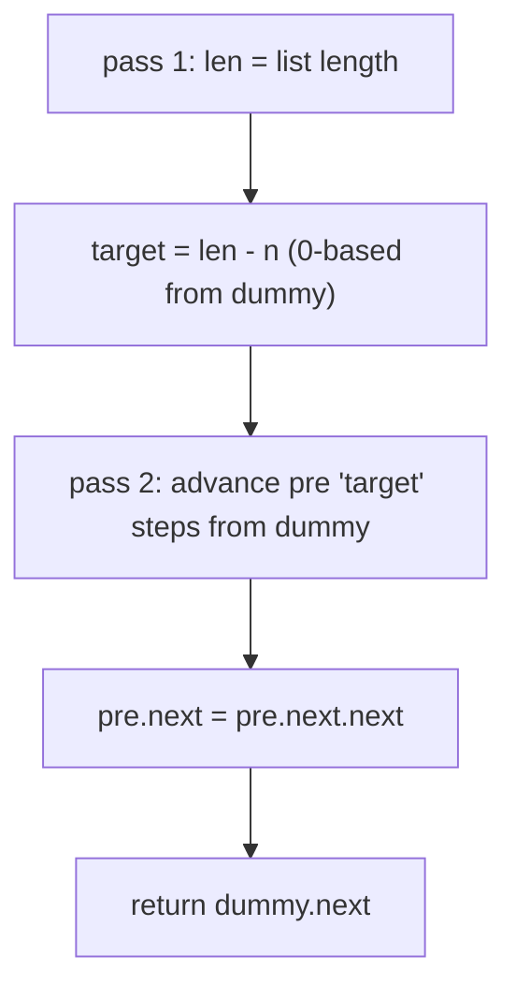
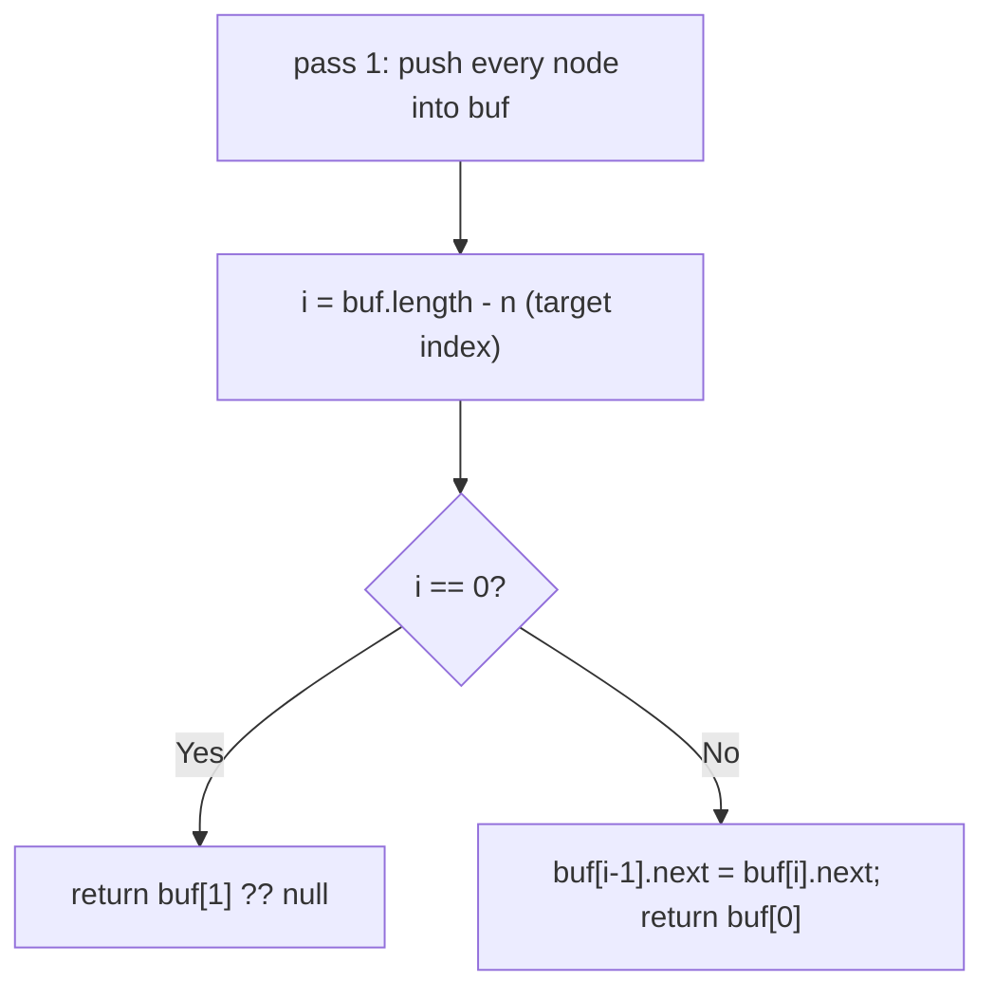
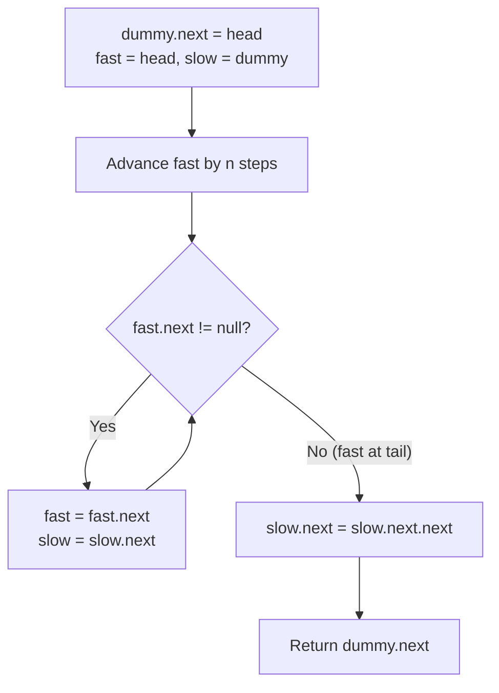

# 19. Remove Nth Node From End of List

- **LeetCode Link**: `https://leetcode.com/problems/remove-nth-node-from-end-of-list/`
- **Difficulty**: Medium
- **Pattern Category**: Linked List / Gap Two-Pointer
- **Prerequisite Primer**: `00-foundations/03-core-algorithmic-patterns.md`

---

## 1. Problem Overview & Edge Case Matrix

### Problem Statement
Given the `head` of a linked list, remove the `n`-th node from the end of the list and return its head.

```
Example 1:
Input: head = [1,2,3,4,5], n = 2
Output: [1,2,3,5]

Example 2:
Input: head = [1], n = 1
Output: []

Example 3:
Input: head = [1,2], n = 1
Output: [1]
```

### Visual Problem Representation
```
n = 2:   1 -> 2 -> 3 -> [4] -> 5
                        ^remove    target = (len - n)th from start

gap method:  fast starts n ahead of slow;
             when fast hits null, slow sits BEFORE the target
```

### Upfront Edge Case Matrix
| Edge Case Category | Specific Input Scenario | Expected Behavior | Pitfall / Risk |
| :--- | :--- | :--- | :--- |
| Empty result | `[1]`, `n = 1` | Return `null` | Returning the stale head |
| Remove head | `[1,2,3,4,5]`, `n = 5` | Return `[2,3,4,5]` | No predecessor — needs dummy |
| Remove tail | `[1,2]`, `n = 1` | Return `[1]` | `slow.next.next` on null |
| `n` equals length | `n == len` | Head removal path | Gap pointer runs off the end |
| Large `n` at scale | $N = 30$, single pass required | One traversal | Two-pass rejected by follow-up |

---

## 2. Level 1: Brute Force Approach

### Intuition & Visual Idea
Two passes: first count the length, then walk to the `(len - n)`th node and splice it out. A dummy head unifies head-removal with the general case. Simple, correct, but traverses twice.



### Pseudocode
```text
FUNCTION removeNthFromEndBruteForce(head, n):
    len = 0; FOR cur = head; cur NOT NULL; cur = cur.next: len++
    dummy = ListNode(0, head); pre = dummy
    REPEAT len - n TIMES: pre = pre.next
    pre.next = pre.next.next
    RETURN dummy.next
```

### Step-by-Step Dry Run (Visual Trace)
| Step | Iteration / Pointer ($i, j$) | Current Value | State / Sub-array | Action Taken |
| :--- | :--- | :--- | :--- | :--- |
| 0 | count pass | `len = 5` | `[1,2,3,4,5]` | Full traversal |
| 1 | `target = 5 - 2 = 3` | advance 3 from dummy | `pre = 3` | `dummy(0) -> 1 -> 2 -> 3` |
| 2 | splice | `pre.next = 5` | `[1,2,3,5]` | Node `4` dropped |
| 3 | return | — | `dummy.next = 1` | Done |

### Modern JavaScript Implementation
```javascript
/**
 * Shared backbone: LeetCode provides ListNode; defined once here so every
 * level below is locally runnable when concatenated (Level 1 + 2 + 3).
 * Time Complexity:  n/a (scaffolding)
 * Space Complexity: n/a (scaffolding)
 */
class ListNode {
  constructor(val, next = null) {
    this.val = val;
    this.next = next;
  }
}

function arrayToList(arr) {
  const dummy = new ListNode(0);
  let cur = dummy;
  for (const v of arr) {
    cur.next = new ListNode(v);
    cur = cur.next;
  }
  return dummy.next;
}

function listToArray(head) {
  const out = [];
  while (head !== null) {
    out.push(head.val);
    head = head.next;
  }
  return out;
}

/**
 * Level 1: Brute Force (two-pass length + splice)
 * Time Complexity:  O(N) — two full traversals
 * Space Complexity: O(1) — dummy plus two pointers
 */
function removeNthFromEndBruteForce(head, n) {
  let len = 0;
  for (let cur = head; cur !== null; cur = cur.next) len++;
  // Dummy absorbs head-removal (target = 0) into the general case.
  const dummy = new ListNode(0, head);
  let pre = dummy;
  for (let i = 0; i < len - n; i++) pre = pre.next;
  pre.next = pre.next.next; // valid: n <= len guaranteed
  return dummy.next;
}
```

### Complexity Breakdown
- **Time Complexity**: $O(N)$ — but constant factor 2; the follow-up demands one pass.
- **Space Complexity**: $O(1)$ — already space-optimal; only pass count improves.

---

## 3. Level 2: Optimized Approach

### Intuition & Visual Bottleneck Elimination
One pass with a node buffer: store references in an array while walking once, then index directly to `(len - n - 1)`. Single traversal at the cost of $O(N)$ pointer storage — trades space for the second pass.



### Pseudocode
```text
FUNCTION removeNthFromEndOnePass(head, n):
    buf = []
    FOR cur = head; cur NOT NULL; cur = cur.next: buf.PUSH(cur)
    i = buf.LENGTH - n
    IF i == 0: RETURN buf[1] ?? NULL
    buf[i-1].next = buf[i].next
    RETURN buf[0]
```

### Step-by-Step Dry Run (Visual Trace)
| Step | Pointers / Window | Hash Map / Auxiliary State | Decision Logic | Output Accumulator |
| :--- | :--- | :--- | :--- | :--- |
| 0 | walk once | `buf = [1,2,3,4,5]` | Single traversal | `len = 5` |
| 1 | `i = 5 - 2 = 3` | target node `4` | `i != 0`, general case | `buf[2].next = buf[3].next` |
| 2 | splice | `3.next = 5` | Node `4` bypassed | `[1,2,3,5]` |

### Modern JavaScript Implementation
```javascript
/**
 * Level 2: Optimized (single-pass node buffer)
 * Time Complexity:  O(N) — exactly one traversal
 * Space Complexity: O(N) — reference per node
 */
// ListNode shared from Level 1.
function removeNthFromEndOnePass(head, n) {
  const buf = [];
  for (let cur = head; cur !== null; cur = cur.next) buf.push(cur);
  const i = buf.length - n; // 0-based index of the doomed node
  if (i === 0) return buf[1] ?? null; // head removal: no predecessor exists
  buf[i - 1].next = buf[i].next; // bypass in place
  return buf[0];
}
```

### Complexity Breakdown
- **Time Complexity**: $O(N)$ — one pass, but with $O(N)$ allocation overhead per call.
- **Space Complexity**: $O(N)$ — the buffer; Level 3 keeps one pass with $O(1)$ space.

---

## 4. Level 3: Most Optimal / Canonical Approach

### Intuition & Mathematical / Invariant Proof
Gap pointers: advance `fast` exactly $n$ steps, then move both until `fast` hits the end. Invariant: the gap between `slow` and `fast` is always $n$ nodes, so when `fast` is null, `slow` sits exactly before the $n$th-from-end node. If `fast` runs out during seeding, $n$ equals the length — remove the head. Dummy head makes every removal a uniform `slow.next` bypass.

```
n = 2:  dummy -> 1 -> 2 -> 3 -> 4 -> 5
        slow^              fast^ (gap 2 after seeding)
        ... both advance ...
        slow=3, fast=null => cut 3.next (node 4)
```

### Pseudocode
```text
FUNCTION removeNthFromEnd(head, n):
    dummy = ListNode(0, head); slow = dummy; fast = dummy
    REPEAT n TIMES: fast = fast.next   // seed the gap
    WHILE fast.next NOT NULL: slow = slow.next; fast = fast.next
    slow.next = slow.next.next
    RETURN dummy.next
```

### Step-by-Step Dry Run (Visual Trace)
| Step | Pointer $L$ | Pointer $R$ | Invariant Checked | In-Place State |
| :--- | :--- | :--- | :--- | :--- |
| 0 | `slow=dummy` | seed 2 steps | `fast = 2`, gap $= 2$ | Setup |
| 1 | `slow=1` | `fast=3` | Gap holds at 2 | Advance both |
| 2 | `slow=2` | `fast=4` | Gap holds at 2 | Advance both |
| 3 | `slow=3` | `fast=5`, `fast.next=null` | Loop exits | `slow` before target |
| 4 | splice | `3.next = 5` | Node `4` bypassed | `[1,2,3,5]` |

### Modern JavaScript Implementation
```javascript
/**
 * Level 3: Most Optimal / Canonical (gap two-pointer, one pass)
 * Time Complexity:  O(N) — single pass, optimal lower bound
 * Space Complexity: O(1) auxiliary — two pointers plus dummy
 */
// ListNode shared from Level 1.
function removeNthFromEnd(head, n) {
  const dummy = new ListNode(0, head); // head removal becomes a plain bypass
  let slow = dummy;
  let fast = dummy;
  for (let i = 0; i < n; i++) fast = fast.next; // seed exactly n ahead
  // When fast reaches the last node, slow is right before the target.
  while (fast.next !== null) {
    slow = slow.next;
    fast = fast.next;
  }
  slow.next = slow.next.next;
  return dummy.next;
}
```

### Complexity Breakdown
- **Time Complexity**: $O(N)$ — single pass, optimal lower bound (must reach the tail to know "from end").
- **Space Complexity**: $O(1)$ auxiliary — two pointers; dummy is the only allocation.

---

## 5. JavaScript-Specific Gotchas & V8 Optimizations
- **GC Pressure**: Avoid allocating objects inside tight loops ($O(N)$ closures). Level 2's $N$-element buffer of references is the pressure Level 3 removes — never buffer what a gap pointer can locate.
- **Type Coercion / Sorting**: `n` is 1-based from the end — `len - n` (Level 1) and the $n$-step seed (Level 3) each encode the conversion once; duplicating the `-1` adjustment in both places is the classic off-by-one.
- **Index Bounds**: `slow.next.next` assumes a node exists to remove ($n \le$ length guaranteed by spec) — but `fast.next` in the loop guard (not `fast`) is what positions `slow` *before* the target; guarding on `fast` instead overshoots by one.

---

## 6. Real-World MAANG Interview Follow-Ups & Extensions

### Follow-Up 1: Return the removed value and support n > length
- **Scenario**: `n` may exceed the length; report the removed value or a clean miss instead of corrupting the list.
- **Solution Strategy**: During gap seeding, if `fast` hits null early, return `{ head, removed: null }` without touching links; otherwise splice and return the removed node's value.
- **JS Code / Implementation Pattern**:
```javascript
function removeNthSafe(head, n) {
  const dummy = new ListNode(0, head);
  let fast = dummy;
  for (let i = 0; i < n; i++) {
    if (fast.next === null) return { head, removed: null }; // n too large
    fast = fast.next;
  }
  let slow = dummy;
  while (fast.next !== null) { slow = slow.next; fast = fast.next; }
  const removed = slow.next.val;
  slow.next = slow.next.next;
  return { head: dummy.next, removed };
}
```

### Follow-Up 2: Delete the middle node in one pass without knowing length
- **Scenario**: Remove the exact middle (LeetCode 2095) — same unknown-length family.
- **Solution Strategy**: Slow/fast with fast at 2× speed; when fast exhausts, slow is at the middle — bypass it. Same gap-pointer DNA, different gap rule.
- **JS Code / Implementation Pattern**:
```javascript
function deleteMiddle(head) {
  if (!head?.next) return null;
  let slow = head, fast = head.next.next;
  while (fast?.next) { slow = slow.next; fast = fast.next.next; }
  slow.next = slow.next.next;
  return head;
}
```

### Follow-Up 3: $10^9$-node list with single-pass removal over a stream
- **Scenario & In-Depth Solution**: Nodes stream once; retain a sliding window of the last $n+1$ nodes so the target's predecessor is buffered when the stream ends — $O(n)$ memory, one pass, then emit everything except the victim.
```javascript
async function removeNthStream(nodeStream, n) {
  const window = [];
  for await (const node of nodeStream) {
    window.push(node);
    if (window.length > n + 1) emit(window.shift());
  }
  const victim = window.shift(); // nth from end
  window.forEach(emit);
  return victim?.val ?? null;
}
```

---

## 7. What LeetCode Discuss Says (Language-Independent)

Source: top-voted post by SGallivan —
`https://leetcode.com/problems/remove-nth-node-from-end-of-list/solutions/1164542/js-python-java-c-easy-two-pointer-soluti-souf/`
— 207.5K views.
Language-independent summary. No new JS here.

### A. Optimal way from Discuss (Staggered Fast/Slow Window)

Instead of counting the list length in a first pass and then making a second pass to find the deletion spot, the optimal Discuss solution staggers two pointers by a gap of $n$ nodes:

1. Attach a sentinel `dummy` node before `head` (`dummy.next = head`).
2. Advance `fast` by $n$ steps from `head`.
3. Set `slow = dummy`.
4. Advance both `fast` and `slow` by 1 node in lockstep until `fast.next == null`.
5. At this moment, `slow` rests precisely at the node *immediately preceding* the target.
6. Rewire `slow.next = slow.next.next` to bypass the target node.
7. Return `dummy.next`.

```text
FUNCTION removeNthFromEnd(head, n):
    dummy = new ListNode(0)
    dummy.next = head
    fast = head
    slow = dummy

    // Advance fast by n steps
    FOR i FROM 0 TO n - 1:
        fast = fast.next

    // Slide window until fast reaches list tail
    WHILE fast != null AND fast.next != null:
        fast = fast.next
        slow = slow.next

    // Bypass target node
    slow.next = slow.next.next

    RETURN dummy.next
```

- Time: O(N) single-pass traversal.
- Space: O(1) auxiliary memory using two pointers.



### B. Dry run on LeetCode Example 1 (`head = [1,2,3,4,5], n = 2`)

Nodes: `dummy -> 1 -> 2 -> 3 -> 4 -> 5`

| Step | `fast` Node (val) | `slow` Node (val) | Comment |
| :--- | :--- | :--- | :--- |
| Stagger $n=2$ | 2 | dummy | `fast` moved 2 steps ahead |
| Iteration 1 | 3 | 1 | Both advance 1 step |
| Iteration 2 | 4 | 2 | Both advance 1 step |
| Iteration 3 | 5 | 3 | `fast.next == null` (stop) |
| Bypass | 5 | 3 | `3.next = 3.next.next` (links 3 to 5, removes 4) |

Result: `[1, 2, 3, 5]`.

### C. Why Staggered Two-Pointer with Sentinel Beats Two-Pass Traversal

- **Single Pass:** Deletes the element in a single traversal over the list without computing total length first.
- **Sentinel Elimination of Head Corner Cases:** When $n = N$ (removing the very first node), `dummy` guarantees that `slow` has a valid predecessor, avoiding branching.

### D. Pitfalls from comments

- **Removing the head node ($n = N$):** Without `dummy`, `fast` advances past the end of the list and causes null dereferencing when attempting to find the predecessor of `head`.
- **Single-node list (`[1], n = 1`):** `slow` stays at `dummy`, bypassing `1` and leaving `dummy.next = null`, correctly producing an empty list.
- **Termination condition:** Stopping when `fast.next == null` (rather than `fast == null`) aligns `slow` one node *before* the victim.

### E. Companies

- Discuss post itself names none.
  Companies tab on LeetCode is premium-locked.
- External source:
  `https://github.com/liquidslr/leetcode-company-wise-problems`
  (LeetCode company tags, updated June 2025).
- All-time (17): Amazon, Apple, Bloomberg, Cisco, Google, Meta, Microsoft, Oracle, Uber, etc.
- Recent: 30 days — Google.
- Recent: 3 months — Amazon, Bloomberg, Google, Meta.
