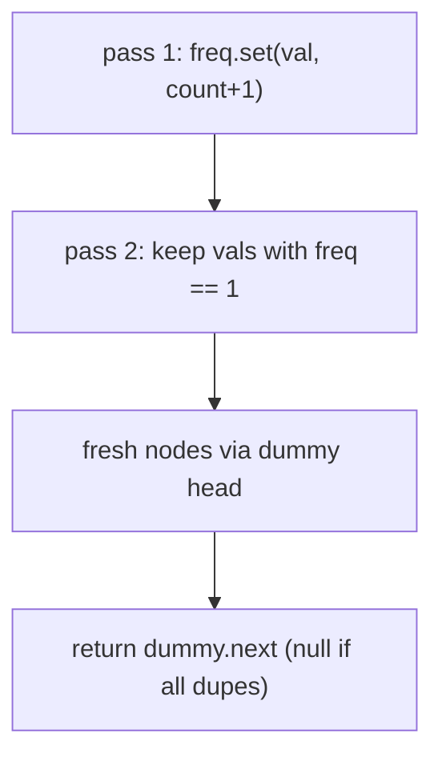
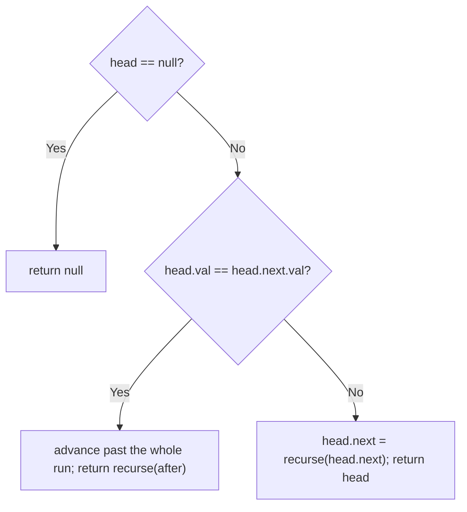

# 82. Remove Duplicates from Sorted List II

- **LeetCode Link**: `https://leetcode.com/problems/remove-duplicates-from-sorted-list-ii/`
- **Difficulty**: Medium
- **Pattern Category**: Linked List / Duplicate-Run Skipping
- **Prerequisite Primer**: `00-foundations/03-core-algorithmic-patterns.md`

---

## 1. Problem Overview & Edge Case Matrix

### Problem Statement
Given the `head` of a sorted linked list, delete all nodes that have duplicate numbers, leaving only distinct numbers from the original list. Return the linked list sorted as well.

```
Example 1:
Input: head = [1,2,3,3,4,4,5]
Output: [1,2,5]

Example 2:
Input: head = [1,1,1,2,3]
Output: [2,3]
```

### Visual Problem Representation
```
before:  1 -> 2 -> [3 -> 3] -> [4 -> 4] -> 5
                   ^run^       ^run^
after:   1 -> 2 -> 5            (entire runs removed, not deduped)
```

### Upfront Edge Case Matrix
| Edge Case Category | Specific Input Scenario | Expected Behavior | Pitfall / Risk |
| :--- | :--- | :--- | :--- |
| Empty / Nil | `head = null` | Return `null` | Dummy chain on null |
| Single Element | `[1]` | Return `[1]` | Treating solo node as a run |
| All duplicates | `[1,1,1]` | Return `null` | Returning stale head |
| Head is a run | `[1,1,2,3]` | Return `[2,3]` | Head-removal without dummy |
| No duplicates | `[1,2,3]` | Unchanged list | Skipping logic eating distinct nodes |

---

## 2. Level 1: Brute Force Approach

### Intuition & Visual Idea
Count frequencies into a `Map` (pass 1), then rebuild a fresh list of values with count 1 (pass 2). Trivially correct on sorted or unsorted input — but allocates a map plus a whole new list.



### Pseudocode
```text
FUNCTION deleteDuplicatesBruteForce(head):
    freq = EMPTY MAP
    FOR cur = head; cur NOT NULL; cur = cur.next:
        freq.SET(cur.val, (freq.GET(cur.val) ?? 0) + 1)
    dummy = ListNode(0); tail = dummy
    FOR cur = head; cur NOT NULL; cur = cur.next:
        IF freq.GET(cur.val) == 1: tail.next = ListNode(cur.val); tail = tail.next
    RETURN dummy.next
```

### Step-by-Step Dry Run (Visual Trace)
| Step | Iteration / Pointer ($i, j$) | Current Value | State / Sub-array | Action Taken |
| :--- | :--- | :--- | :--- | :--- |
| 0 | count pass | `1,2,3,3,4,4,5` | `freq = {1:1,2:1,3:2,4:2,5:1}` | Tally |
| 1 | filter pass | keep `1,2,5` | drop `3,4` runs | Fresh nodes |
| 2 | return | — | `[1,2,5]` | New list |

### Modern JavaScript Implementation
```javascript
/**
 * Shared backbone: LeetCode provides ListNode; defined once here so every
 * level below is locally runnable when concatenated (Level 1 + 2 + 3).
 * Time Complexity:  n/a (scaffolding)
 * Space Complexity: n/a (scaffolding)
 */
class ListNode {
  constructor(val, next = null) {
    this.val = val;
    this.next = next;
  }
}

function arrayToList(arr) {
  const dummy = new ListNode(0);
  let cur = dummy;
  for (const v of arr) {
    cur.next = new ListNode(v);
    cur = cur.next;
  }
  return dummy.next;
}

function listToArray(head) {
  const out = [];
  while (head !== null) {
    out.push(head.val);
    head = head.next;
  }
  return out;
}

/**
 * Level 1: Brute Force (frequency map + rebuild)
 * Time Complexity:  O(N) — two passes
 * Space Complexity: O(N) — map plus a fully copied list
 */
function deleteDuplicatesBruteForce(head) {
  const freq = new Map();
  for (let cur = head; cur !== null; cur = cur.next) {
    freq.set(cur.val, (freq.get(cur.val) ?? 0) + 1);
  }
  // Rebuild keeps only singletons; dummy covers all-duplicates => null.
  const dummy = new ListNode(0);
  let tail = dummy;
  for (let cur = head; cur !== null; cur = cur.next) {
    if (freq.get(cur.val) === 1) {
      tail.next = new ListNode(cur.val);
      tail = tail.next;
    }
  }
  return dummy.next;
}
```

### Complexity Breakdown
- **Time Complexity**: $O(N)$ — two linear passes.
- **Space Complexity**: $O(N)$ — frequency table plus rebuilt list; sortedness is unexploited.

---

## 3. Level 2: Optimized Approach

### Intuition & Visual Bottleneck Elimination
Exploit sortedness recursively: if the head starts a duplicate run, skip the whole run and recurse past it; otherwise keep the head and recurse on the rest. No map, no rebuild — but $O(N)$ stack frames.



### Pseudocode
```text
FUNCTION deleteDuplicatesRecursive(head):
    IF head NULL: RETURN NULL
    IF head.next NOT NULL AND head.val == head.next.val:
        v = head.val
        WHILE head NOT NULL AND head.val == v: head = head.next
        RETURN deleteDuplicatesRecursive(head)
    head.next = deleteDuplicatesRecursive(head.next)
    RETURN head
```

### Step-by-Step Dry Run (Visual Trace)
| Step | Pointers / Window | Hash Map / Auxiliary State | Decision Logic | Output Accumulator |
| :--- | :--- | :--- | :--- | :--- |
| 1 | head `1`, next `2` | distinct | Keep, recurse on `2…` | `1 -> ?` |
| 2 | head `2`, next `3` | distinct | Keep, recurse on `3…` | `2 -> ?` |
| 3 | head `3`, next `3` | run of `3` | Skip both, recurse on `4…` | drop |
| 4 | head `4`, next `4` | run of `4` | Skip both, recurse on `5` | drop |
| 5 | head `5`, next null | distinct | Keep, recurse → null | `[1,2,5]` |

### Modern JavaScript Implementation
```javascript
/**
 * Level 2: Optimized (recursive run-skipping)
 * Time Complexity:  O(N) — each node visited once
 * Space Complexity: O(N) — call stack depth N
 */
// ListNode shared from Level 1.
function deleteDuplicatesRecursive(head) {
  if (head === null) return null;
  // Head starts a run: drop the ENTIRE run, solve from after it.
  if (head.next !== null && head.val === head.next.val) {
    const runVal = head.val;
    while (head !== null && head.val === runVal) head = head.next;
    return deleteDuplicatesRecursive(head);
  }
  // Distinct head: keep it, solve the rest.
  head.next = deleteDuplicatesRecursive(head.next);
  return head;
}
```

### Complexity Breakdown
- **Time Complexity**: $O(N)$ — each node consumed once across all frames.
- **Space Complexity**: $O(N)$ — recursion depth; degenerate long lists overflow V8's stack.

---

## 4. Level 3: Most Optimal / Canonical Approach

### Intuition & Mathematical / Invariant Proof
Iterative with a `pre` anchor: scan with `cur`; when `cur` starts a run (`cur.val === cur.next.val`), record the run value, advance past all of it, and link `pre.next` past the run — otherwise link `pre` forward one node. Invariant: everything before `pre.next` is solved (distinct survivors in order); the run-skip preserves sortedness, so output is sorted by construction.

```
dummy -> 1 -> 2 -> [3 -> 3] -> [4 -> 4] -> 5 -> null
pre=2, cur=3: run detected -> skip to 4... run again -> skip to 5
pre.next = 5  =>  dummy -> 1 -> 2 -> 5
```

### Pseudocode
```text
FUNCTION deleteDuplicates(head):
    dummy = ListNode(0, head); pre = dummy
    WHILE pre.next NOT NULL:
        cur = pre.next
        IF cur.next NOT NULL AND cur.val == cur.next.val:
            v = cur.val
            WHILE cur NOT NULL AND cur.val == v: cur = cur.next
            pre.next = cur     // bypass the whole run
        ELSE:
            pre = pre.next     // survivor: advance the anchor
    RETURN dummy.next
```

### Step-by-Step Dry Run (Visual Trace)
| Step | Pointer $L$ | Pointer $R$ | Invariant Checked | In-Place State |
| :--- | :--- | :--- | :--- | :--- |
| 0 | `pre=dummy` | `cur=1` | `1 != 2`, survivor | `pre = 1` |
| 1 | `pre=1` | `cur=2` | `2 != 3`, survivor | `pre = 2` |
| 2 | `pre=2` | `cur=3` | `3 == 3`, run | Skip to `4`… still run |
| 3 | run skip | `cur=5` | `pre.next = 5` | `[1,2,5]` |
| 4 | `pre=2` | `cur=5`, `5.next=null` | Survivor | `pre = 5`, loop ends |

### Modern JavaScript Implementation
```javascript
/**
 * Level 3: Most Optimal / Canonical (iterative run bypass)
 * Time Complexity:  O(N) — single pass, optimal lower bound
 * Space Complexity: O(1) auxiliary — in-place bypass, one dummy
 */
// ListNode shared from Level 1.
function deleteDuplicates(head) {
  const dummy = new ListNode(0, head); // head-run removal needs an anchor
  let pre = dummy; // everything before pre.next is solved
  while (pre.next !== null) {
    const cur = pre.next;
    if (cur.next !== null && cur.val === cur.next.val) {
      // Duplicate run: consume every node with this value, then bypass.
      const runVal = cur.val;
      let runner = cur;
      while (runner !== null && runner.val === runVal) runner = runner.next;
      pre.next = runner;
    } else {
      pre = pre.next; // distinct survivor: advance the solved frontier
    }
  }
  return dummy.next;
}
```

### Complexity Breakdown
- **Time Complexity**: $O(N)$ — optimal lower bound; each node visited at most twice (once as `cur`, once inside a run skip).
- **Space Complexity**: $O(1)$ auxiliary — nodes relinked in place, zero allocation beyond dummy.

---

## 5. JavaScript-Specific Gotchas & V8 Optimizations
- **GC Pressure**: Avoid allocating objects inside tight loops ($O(N)$ closures). Level 3 allocates one dummy; Level 1's map plus $N$ fresh nodes is the pressure removed.
- **Type Coercion / Sorting**: `freq.get(cur.val) === 1` needs strict equality — `== 1` would also match `true` keys if values were ever boolean-coerced; keep numeric values numeric.
- **Index Bounds**: The run check `cur.next !== null && cur.val === cur.next.val` must test `.next` first — reversed order dereferences null at the list tail. After bypassing, do NOT advance `pre` (re-examine the node after the run: it may start another run).

---

## 6. Real-World MAANG Interview Follow-Ups & Extensions

### Follow-Up 1: Keep one copy (Remove Duplicates I) and keep-at-most-K
- **Scenario**: Variants ask to dedupe to one copy (LeetCode 83) or allow up to $K$ repeats.
- **Solution Strategy**: Same anchor scan, but the run handler links $1$ (or $\min(K, \text{run})$) survivor nodes instead of bypassing the whole run.
- **JS Code / Implementation Pattern**:
```javascript
function deleteDuplicatesKeepOne(head) {
  let cur = head;
  while (cur?.next) {
    if (cur.val === cur.next.val) cur.next = cur.next.next;
    else cur = cur.next;
  }
  return head;
}
```

### Follow-Up 2: Unsorted list with all-duplicates removal
- **Scenario**: Input is NOT sorted — runs are non-adjacent, so Level 3's adjacency logic fails.
- **Solution Strategy**: Fall back to Level 1's frequency map (works regardless of order), or sort first ($O(N \log N)$) then run Level 3.
- **JS Code / Implementation Pattern**:
```javascript
function deleteDupsUnsorted(head) {
  return deleteDuplicatesBruteForce(head); // order-agnostic by construction
}
```

### Follow-Up 3: Deleting with concurrent readers
- **Scenario & In-Depth Solution**: Readers traverse while the bypass runs; `pre.next = runner` is a single store, so readers see either the old run or the bypassed list — never a torn list — provided each store is a single pointer write (true in JS engines). Document the atomicity assumption; for multi-store edits, version-stamp and retry.
```javascript
function deleteDuplicatesVersioned(head, versionOf) {
  const out = deleteDuplicates(head);
  if (versionOf(head) !== versionOf(out)) throw new Error('mutated during delete: retry');
  return out;
}
```
