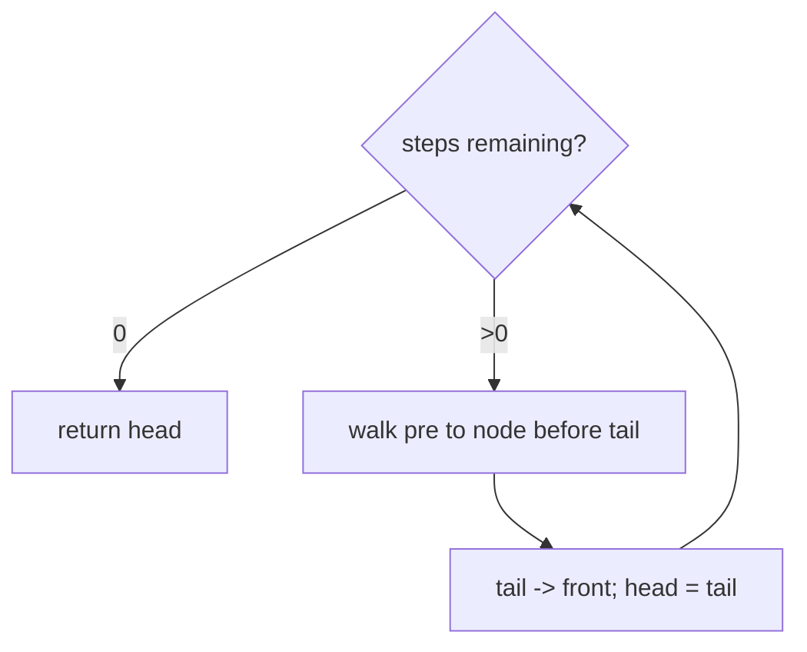
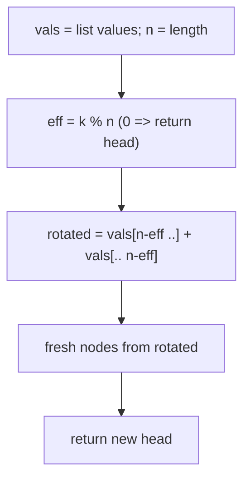

# 61. Rotate List

- **LeetCode Link**: `https://leetcode.com/problems/rotate-list/`
- **Difficulty**: Medium
- **Pattern Category**: Linked List / Ring Formation + Effective Rotation
- **Prerequisite Primer**: `00-foundations/03-core-algorithmic-patterns.md`

---

## 1. Problem Overview & Edge Case Matrix

### Problem Statement
Given the `head` of a linked list, rotate the list to the right by `k` places.

```
Example 1:
Input: head = [1,2,3,4,5], k = 2
Output: [4,5,1,2,3]

Example 2:
Input: head = [0,1,2], k = 4
Output: [2,0,1]
Explanation: k = 4 mod 3 = 1 effective rotation.
```

### Visual Problem Representation
```
k = 2:   1 -> 2 -> 3 -> 4 -> 5
         v form ring v  (tail.next = head)
         1 -> 2 -> 3 -> 4 -> 5 -+
         ^----------------------+
         new tail = 3rd node; new head = 4; break ring
         4 -> 5 -> 1 -> 2 -> 3
```

### Upfront Edge Case Matrix
| Edge Case Category | Specific Input Scenario | Expected Behavior | Pitfall / Risk |
| :--- | :--- | :--- | :--- |
| Empty / Nil | `head = null` | Return `null` | Length scan on null |
| Single Element | `[1]`, any `k` | Return `[1]` | Ring of one + break logic |
| Zero rotation | `k = 0` | Unchanged | Needless ring formation |
| `k` multiple of length | `[1,2,3]`, `k = 3` | Unchanged | `k % n == 0` must short-circuit |
| Huge `k` | `k = 2×10^9` | `k % n` effective | $O(kN)$ blowup without modulo |

---

## 2. Level 1: Brute Force Approach

### Intuition & Visual Idea
Rotate one step at a time, $k$ times: each step walks to the tail, detaches it, and moves it to the front. Dead simple — and $O(kN)$, catastrophically slow for $k = 2×10^9$.



### Pseudocode
```text
FUNCTION rotateRightBruteForce(head, k):
    REPEAT k TIMES:
        IF head NULL OR head.next NULL: RETURN head
        pre = head; WHILE pre.next.next NOT NULL: pre = pre.next
        tail = pre.next; pre.next = NULL
        tail.next = head; head = tail
    RETURN head
```

### Step-by-Step Dry Run (Visual Trace)
| Step | Iteration / Pointer ($i, j$) | Current Value | State / Sub-array | Action Taken |
| :--- | :--- | :--- | :--- | :--- |
| 0 | step 1 of 2 | tail `5` | `[1,2,3,4,5]` | Move `5` front |
| 1 | after step 1 | — | `[5,1,2,3,4]` | New head `5` |
| 2 | step 2 of 2 | tail `4` | `[5,1,2,3,4]` | Move `4` front |
| 3 | after step 2 | — | `[4,5,1,2,3]` | Return |

### Modern JavaScript Implementation
```javascript
/**
 * Shared backbone: LeetCode provides ListNode; defined once here so every
 * level below is locally runnable when concatenated (Level 1 + 2 + 3).
 * Time Complexity:  n/a (scaffolding)
 * Space Complexity: n/a (scaffolding)
 */
class ListNode {
  constructor(val, next = null) {
    this.val = val;
    this.next = next;
  }
}

function arrayToList(arr) {
  const dummy = new ListNode(0);
  let cur = dummy;
  for (const v of arr) {
    cur.next = new ListNode(v);
    cur = cur.next;
  }
  return dummy.next;
}

function listToArray(head) {
  const out = [];
  while (head !== null) {
    out.push(head.val);
    head = head.next;
  }
  return out;
}

/**
 * Level 1: Brute Force (repeated single-step rotation)
 * Time Complexity:  O(k * N) — full walk per step; hopeless for huge k
 * Space Complexity: O(1) — pointer surgery only
 */
function rotateRightBruteForce(head, k) {
  for (let step = 0; step < k; step++) {
    // Degenerate lists are fixed points of any rotation.
    if (head === null || head.next === null) return head;
    let pre = head;
    while (pre.next.next !== null) pre = pre.next; // stop before tail
    const tail = pre.next;
    pre.next = null; // detach
    tail.next = head; // move to front
    head = tail;
  }
  return head;
}
```

### Complexity Breakdown
- **Time Complexity**: $O(kN)$ — $k$ walks of length $N$; $k$ up to $2×10^9$ means TLE by design.
- **Space Complexity**: $O(1)$ — the only virtue of this approach.

---

## 3. Level 2: Optimized Approach

### Intuition & Visual Bottleneck Elimination
Rotation is periodic with period $n$: only $k \bmod n$ matters. Drain values to an array once, rotate the array by the effective offset, rebuild. $O(N)$ time regardless of $k$ — at the cost of $O(N)$ space and fresh nodes.



### Pseudocode
```text
FUNCTION rotateRightArray(head, k):
    vals = DRAIN(head); n = vals.LENGTH
    IF n <= 1: RETURN head
    eff = k MOD n; IF eff == 0: RETURN head
    rotated = vals[n-eff ..] CONCAT vals[.. n-eff]
    RETURN BUILD(rotated)
```

### Step-by-Step Dry Run (Visual Trace)
| Step | Pointers / Window | Hash Map / Auxiliary State | Decision Logic | Output Accumulator |
| :--- | :--- | :--- | :--- | :--- |
| 0 | drain `[0,1,2]` | `n = 3` | `k = 4` | `vals` copied |
| 1 | `eff = 4 % 3 = 1` | nonzero | Real rotation needed | offset `1` |
| 2 | split at `n - eff = 2` | `[2] + [0,1]` | Tail chunk moves front | `[2,0,1]` |
| 3 | rebuild | fresh nodes | Return new list | `[2,0,1]` |

### Modern JavaScript Implementation
```javascript
/**
 * Level 2: Optimized (effective offset + rebuild)
 * Time Complexity:  O(N) — independent of k
 * Space Complexity: O(N) — value array plus rebuilt list
 */
// ListNode shared from Level 1.
function rotateRightArray(head, k) {
  const vals = [];
  for (let cur = head; cur !== null; cur = cur.next) vals.push(cur.val);
  const n = vals.length;
  if (n <= 1) return head; // empty / singleton: rotation is identity
  const eff = k % n; // periodicity: k and k mod n rotate identically
  if (eff === 0) return head;
  // Last eff values become the new prefix.
  const rotated = vals.slice(n - eff).concat(vals.slice(0, n - eff));
  const dummy = new ListNode(0);
  let cur = dummy;
  for (const v of rotated) {
    cur.next = new ListNode(v);
    cur = cur.next;
  }
  return dummy.next;
}
```

### Complexity Breakdown
- **Time Complexity**: $O(N)$ — one drain, one rebuild; $k$ only matters modulo $n$.
- **Space Complexity**: $O(N)$ — array plus $N$ fresh nodes; Level 3 keeps $O(N)$ time with $O(1)$ space.

---

## 4. Level 3: Most Optimal / Canonical Approach

### Intuition & Mathematical / Invariant Proof
Ring method: link the tail to the head (forming a cycle), then the answer is fully determined by arithmetic — the new tail is the $(n - eff)$th node and the new head follows it. Break the ring there. Invariant: after `eff = k mod n`, rotating right by `eff` moves exactly the last `eff` nodes to the front, so cutting before them yields the rotation. One pass to measure + link, one walk to cut.

```
[1,2,3,4,5] k=2: n=5, eff=2, new tail = node 3, new head = 4
ring: 1->2->3->4->5->(back to 1); cut after 3 => 4->5->1->2->3
```

### Pseudocode
```text
FUNCTION rotateRight(head, k):
    IF head NULL OR head.next NULL OR k == 0: RETURN head
    n = 1; tail = head
    WHILE tail.next NOT NULL: tail = tail.next; n++
    tail.next = head                    // close the ring
    eff = k MOD n; IF eff == 0: tail.next = NULL; RETURN head
    stepsToNewTail = n - eff
    newTail = head; REPEAT stepsToNewTail - 1 TIMES: newTail = newTail.next
    newHead = newTail.next; newTail.next = NULL   // break the ring
    RETURN newHead
```

### Step-by-Step Dry Run (Visual Trace)
| Step | Pointer $L$ | Pointer $R$ | Invariant Checked | In-Place State |
| :--- | :--- | :--- | :--- | :--- |
| 0 | measure | `n = 5`, `tail = 5` | Single measuring walk | `5.next = 1` (ring) |
| 1 | `eff = 2 % 5` | nonzero | Real rotation | Proceed to cut |
| 2 | walk 2 from head | `newTail = 3` | `n - eff - 1` steps | Positioned |
| 3 | cut | `newHead = 4` | `3.next = null` | `[4,5,1,2,3]` |

### Modern JavaScript Implementation
```javascript
/**
 * Level 3: Most Optimal / Canonical (ring + arithmetic cut)
 * Time Complexity:  O(N) — one measuring walk plus one cut walk
 * Space Complexity: O(1) auxiliary — nodes relinked, never copied
 */
// ListNode shared from Level 1.
function rotateRight(head, k) {
  // Degenerate or no-op rotations return immediately (also avoids div-by-zero).
  if (head === null || head.next === null || k === 0) return head;
  // Measure once and keep the tail: one walk serves both needs.
  let n = 1;
  let tail = head;
  while (tail.next !== null) {
    tail = tail.next;
    n++;
  }
  tail.next = head; // close the ring; every rotation is now a cut position
  const eff = k % n;
  if (eff === 0) {
    tail.next = null; // reopen before returning!
    return head;
  }
  // New tail sits (n - eff) nodes from the old head.
  let newTail = head;
  for (let i = 1; i < n - eff; i++) newTail = newTail.next;
  const newHead = newTail.next;
  newTail.next = null; // break the ring at the computed cut
  return newHead;
}
```

### Complexity Breakdown
- **Time Complexity**: $O(N)$ — optimal lower bound; the length must be measured once.
- **Space Complexity**: $O(1)$ auxiliary — pure relinking; the ring exists only transiently.

---

## 5. JavaScript-Specific Gotchas & V8 Optimizations
- **GC Pressure**: Avoid allocating objects inside tight loops ($O(N)$ closures). Level 3 allocates zero nodes; Level 2's $N$ fresh nodes plus array are the pressure removed.
- **Type Coercion / Sorting**: `k % n` with huge $k$ is exact in doubles up to $2^{53}$ — but `k` near $2^{31}$ in bitwise tricks (`k | 0`) would truncate; keep `k` in plain arithmetic, never bitwise.
- **Index Bounds**: The `eff === 0` early return must REOPEN the ring (`tail.next = null`) — returning while the ring is closed hands back a cyclic list and hangs every downstream traversal. Forgetting the break is the #1 bug in this problem.

---

## 6. Real-World MAANG Interview Follow-Ups & Extensions

### Follow-Up 1: Left rotation and rotation by negative k
- **Scenario**: API takes signed `k` (negative = rotate left).
- **Solution Strategy**: Normalize once: `eff = ((k % n) + n) % n` converts any signed `k` to a right-rotation in `[0, n)`; the Level 3 body is unchanged.
- **JS Code / Implementation Pattern**:
```javascript
function rotateSigned(head, k) {
  const n = listLength(head);
  if (n <= 1) return head;
  return rotateRight(head, ((k % n) + n) % n);
}
```

### Follow-Up 2: Rotate a $10^9$-node stream with bounded memory
- **Scenario**: Nodes stream once; only $O(eff)$ tail nodes fit in memory.
- **Solution Strategy**: Two-pass streaming is impossible — instead buffer the last `eff` nodes in a ring buffer while counting $n$ (needs $n$ first: one counting pass over the stream if replayable, else reservoir-style retention of the tail window).
- **JS Code / Implementation Pattern**:
```javascript
async function rotateStream(nodeStream, k) {
  const buf = []; // ring buffer of the trailing window
  let n = 0;
  for await (const node of nodeStream) {
    buf.push(node); n++;
    if (buf.length > k) buf.shift();
  }
  return { leadingCount: n - buf.length, tailWindow: buf };
}
```

### Follow-Up 3: In-place rotation with concurrent readers
- **Scenario & In-Depth Solution**: Readers traverse while the ring is closed — a closed ring hangs readers in an infinite loop. Fix: never publish the ring; instead compute `newHead`/`newTail` first, then publish with two ordered stores (`newTail.next = null` BEFORE swinging the head reference readers use), or publish under a versioned head pointer readers pin.
```javascript
function publishRotation(headRef, newHead, newTail) {
  newTail.next = null; // break first: readers never see a cycle
  headRef.current = newHead; // then publish
}
```
