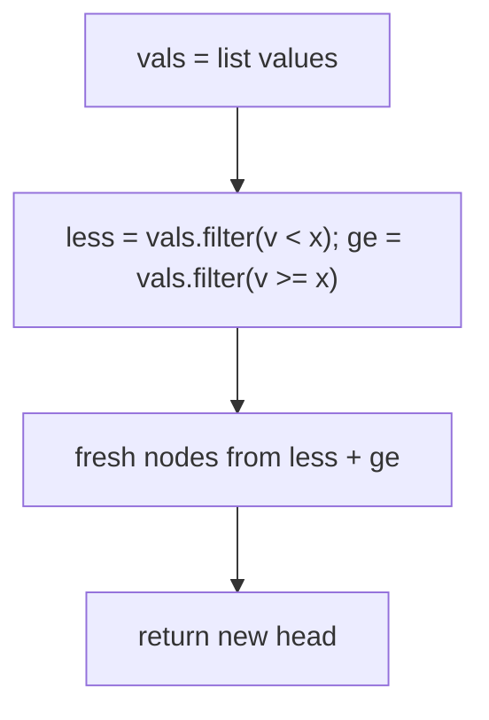
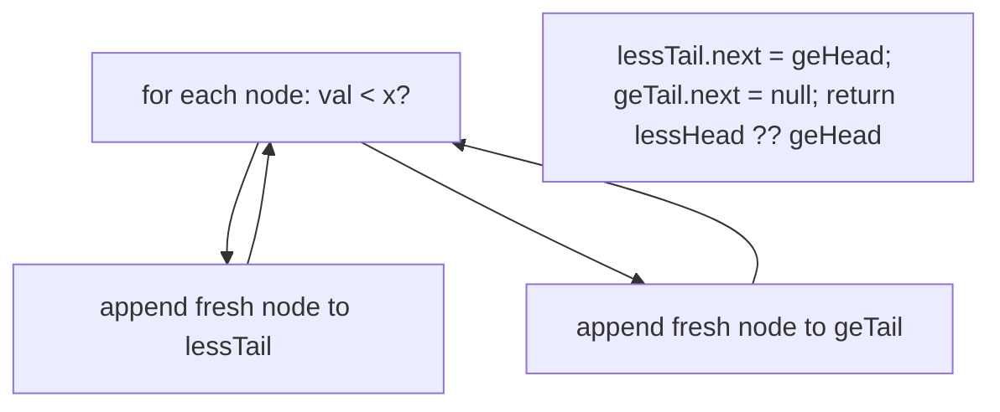

# 86. Partition List

- **LeetCode Link**: `https://leetcode.com/problems/partition-list/`
- **Difficulty**: Medium
- **Pattern Category**: Linked List / Stable Two-Chain Split
- **Prerequisite Primer**: `00-foundations/03-core-algorithmic-patterns.md`

---

## 1. Problem Overview & Edge Case Matrix

### Problem Statement
Given the `head` of a linked list and a value `x`, partition it such that all nodes less than `x` come before nodes greater than or equal to `x`. Preserve the original relative order of the nodes in each of the two partitions.

```
Example 1:
Input: head = [1,4,3,2,5,2], x = 3
Output: [1,2,2,4,3,5]

Example 2:
Input: head = [2,1], x = 2
Output: [1,2]
```

### Visual Problem Representation
```
before:  1 -> 4 -> 3 -> 2 -> 5 -> 2   (x = 3)
split:   less: 1 -> 2 -> 2            ge: 4 -> 3 -> 5
join:    1 -> 2 -> 2 -> 4 -> 3 -> 5
```

### Upfront Edge Case Matrix
| Edge Case Category | Specific Input Scenario | Expected Behavior | Pitfall / Risk |
| :--- | :--- | :--- | :--- |
| Empty / Nil | `head = null` | Return `null` | Dummy `.next` on null chain |
| Single Element | `[1]`, any `x` | Return `[1]` | Join step with empty half |
| All less than x | `[1,2]`, `x = 5` | Unchanged, same order | `ge` chain empty — join must handle null |
| All >= x | `[4,5]`, `x = 3` | Unchanged, same order | `less` chain empty — return `ge` head |
| Stability | `[1,4,3,2,5,2]`, `x = 3` | `2` before `2`, `4` before `3` | Unstable reordering (e.g. head-insertion) |

---

## 2. Level 1: Brute Force Approach

### Intuition & Visual Idea
Drain values, stable-partition the array around `x` (filter `< x`, then filter `>= x`), rebuild fresh nodes. Stability comes free from `filter` order — but every node is copied.



### Pseudocode
```text
FUNCTION partitionBruteForce(head, x):
    vals = DRAIN(head)
    ordered = FILTER(vals, v < x) CONCAT FILTER(vals, v >= x)
    RETURN BUILD(ordered)
```

### Step-by-Step Dry Run (Visual Trace)
| Step | Iteration / Pointer ($i, j$) | Current Value | State / Sub-array | Action Taken |
| :--- | :--- | :--- | :--- | :--- |
| 0 | drain | `1,4,3,2,5,2` | `vals` copied | Walk list |
| 1 | filter `< 3` | `1,2,2` | stable order kept | First filter |
| 2 | filter `>= 3` | `4,3,5` | stable order kept | Second filter |
| 3 | rebuild | `1,2,2,4,3,5` | fresh nodes | Return new list |

### Modern JavaScript Implementation
```javascript
/**
 * Shared backbone: LeetCode provides ListNode; defined once here so every
 * level below is locally runnable when concatenated (Level 1 + 2 + 3).
 * Time Complexity:  n/a (scaffolding)
 * Space Complexity: n/a (scaffolding)
 */
class ListNode {
  constructor(val, next = null) {
    this.val = val;
    this.next = next;
  }
}

function arrayToList(arr) {
  const dummy = new ListNode(0);
  let cur = dummy;
  for (const v of arr) {
    cur.next = new ListNode(v);
    cur = cur.next;
  }
  return dummy.next;
}

function listToArray(head) {
  const out = [];
  while (head !== null) {
    out.push(head.val);
    head = head.next;
  }
  return out;
}

/**
 * Level 1: Brute Force (value partition + rebuild)
 * Time Complexity:  O(N) — drain, two filters, rebuild
 * Space Complexity: O(N) — arrays plus a fully copied list
 */
function partitionBruteForce(head, x) {
  const vals = [];
  for (let cur = head; cur !== null; cur = cur.next) vals.push(cur.val);
  // Array.filter is stable: relative order within each half is preserved.
  const ordered = vals.filter((v) => v < x).concat(vals.filter((v) => v >= x));
  const dummy = new ListNode(0);
  let tail = dummy;
  for (const v of ordered) {
    tail.next = new ListNode(v);
    tail = tail.next;
  }
  return dummy.next;
}
```

### Complexity Breakdown
- **Time Complexity**: $O(N)$ — linear, but three walks plus allocation.
- **Space Complexity**: $O(N)$ — arrays plus $N$ fresh nodes; stability without copying is the goal.

---

## 3. Level 2: Optimized Approach

### Intuition & Visual Bottleneck Elimination
Keep the two-chain idea but build the chains from fresh nodes in a single pass — no intermediate arrays. Still copies every node ($O(N)$ space), but one walk and no filter passes.



### Pseudocode
```text
FUNCTION partitionCopy(head, x):
    lessDummy = ListNode(0); geDummy = ListNode(0)
    lessTail = lessDummy; geTail = geDummy
    FOR cur = head; cur NOT NULL; cur = cur.next:
        IF cur.val < x: lessTail.next = ListNode(cur.val); lessTail = lessTail.next
        ELSE: geTail.next = ListNode(cur.val); geTail = geTail.next
    lessTail.next = geDummy.next
    geTail.next = NULL
    RETURN lessDummy.next ?? geDummy.next
```

### Step-by-Step Dry Run (Visual Trace)
| Step | Pointers / Window | Hash Map / Auxiliary State | Decision Logic | Output Accumulator |
| :--- | :--- | :--- | :--- | :--- |
| 1 | node `1` | `1 < 3` | Fresh node to less | `less: 1` |
| 2 | node `4` | `4 >= 3` | Fresh node to ge | `ge: 4` |
| 3 | nodes `3,2,5,2` | split each | Append in order | `less: 1,2,2`, `ge: 4,3,5` |
| 4 | join | `lessTail.next = geHead` | `geTail.next = null` | `[1,2,2,4,3,5]` |

### Modern JavaScript Implementation
```javascript
/**
 * Level 2: Optimized (single-pass two-chain copy)
 * Time Complexity:  O(N) — one walk
 * Space Complexity: O(N) — N fresh nodes (structure reused? no — copied)
 */
// ListNode shared from Level 1.
function partitionCopy(head, x) {
  const lessDummy = new ListNode(0);
  const geDummy = new ListNode(0);
  let lessTail = lessDummy;
  let geTail = geDummy;
  for (let cur = head; cur !== null; cur = cur.next) {
    // Append order = visit order, so each chain is internally stable.
    if (cur.val < x) {
      lessTail.next = new ListNode(cur.val);
      lessTail = lessTail.next;
    } else {
      geTail.next = new ListNode(cur.val);
      geTail = geTail.next;
    }
  }
  lessTail.next = geDummy.next; // join the chains
  geTail.next = null; // terminate (vital when ge is non-empty)
  return lessDummy.next ?? geDummy.next; // empty-less edge case
}
```

### Complexity Breakdown
- **Time Complexity**: $O(N)$ — single pass.
- **Space Complexity**: $O(N)$ — still copies; Level 3 reuses the original nodes instead.

---

## 4. Level 3: Most Optimal / Canonical Approach

### Intuition & Mathematical / Invariant Proof
Same two chains, but splice the ORIGINAL nodes (no copies): detach each visited node and append it to the `less` or `ge` tail. Invariant: both tails always terminate (`tail.next = null` is unnecessary mid-loop if we detach on visit — instead terminate once at the end); append order equals visit order, so stability holds; the join is two stores. $O(1)$ space, order-preserving, node-reusing.

```
visit 4 (>= x): ge: 4; visit 3: ge: 4->3; visit 2 (< x): less: 1->2 ...
join: lessTail.next = geHead; geTail.next = null
```

### Pseudocode
```text
FUNCTION partition(head, x):
    lessDummy = ListNode(0); geDummy = ListNode(0)
    lessTail = lessDummy; geTail = geDummy
    cur = head
    WHILE cur NOT NULL:
        nxt = cur.next          // save: relinking overwrites it
        cur.next = NULL         // detach (prevents stale cycles)
        IF cur.val < x: lessTail.next = cur; lessTail = cur
        ELSE: geTail.next = cur; geTail = cur
        cur = nxt
    lessTail.next = geDummy.next
    RETURN lessDummy.next ?? geDummy.next
```

### Step-by-Step Dry Run (Visual Trace)
| Step | Pointer $L$ | Pointer $R$ | Invariant Checked | In-Place State |
| :--- | :--- | :--- | :--- | :--- |
| 1 | visit `1` | `< 3`, detach+append | `less: 1` | Original node reused |
| 2 | visit `4` | `>= 3` | `ge: 4` | Original node reused |
| 3 | visits `3,2,5,2` | split+detach each | `less: 1,2,2`, `ge: 4,3,5` | No stale links |
| 4 | join | `lessTail.next = geHead` | `?? geDummy.next` covers empty-less | `[1,2,2,4,3,5]` |

### Modern JavaScript Implementation
```javascript
/**
 * Level 3: Most Optimal / Canonical (in-place stable split + join)
 * Time Complexity:  O(N) — single pass, optimal lower bound
 * Space Complexity: O(1) auxiliary — original nodes relinked, never copied
 */
// ListNode shared from Level 1.
function partition(head, x) {
  const lessDummy = new ListNode(0);
  const geDummy = new ListNode(0);
  let lessTail = lessDummy;
  let geTail = geDummy;
  let cur = head;
  while (cur !== null) {
    const nxt = cur.next; // save before relinking overwrites it
    cur.next = null; // detach: guarantees no stale cycle survives the join
    if (cur.val < x) {
      lessTail.next = cur;
      lessTail = cur;
    } else {
      geTail.next = cur;
      geTail = cur;
    }
    cur = nxt;
  }
  lessTail.next = geDummy.next; // join (null-safe when ge is empty)
  return lessDummy.next ?? geDummy.next; // null-safe when less is empty
}
```

### Complexity Breakdown
- **Time Complexity**: $O(N)$ — optimal lower bound; each node visited once.
- **Space Complexity**: $O(1)$ auxiliary — two dummies; every original node reused exactly once.

---

## 5. JavaScript-Specific Gotchas & V8 Optimizations
- **GC Pressure**: Avoid allocating objects inside tight loops ($O(N)$ closures). Level 3 allocates two dummies total; Levels 1–2's $N$ fresh nodes are the pressure removed.
- **Type Coercion / Sorting**: The split predicate is strict `< x` vs `>= x` — `x` itself belongs to the `ge` chain; `<=` on the wrong side silently misplaces every `x`-valued node.
- **Index Bounds**: Detach-before-append (`nxt` saved first) is load-bearing — without it, the last `ge` node keeps its original `next`, which may point into the `less` chain and resurrect a cycle. `geTail.next = null` (Level 2) / per-node detach (Level 3) closes it.

---

## 6. Real-World MAANG Interview Follow-Ups & Extensions

### Follow-Up 1: Three-way Dutch-flag partition (< x, == x, > x)
- **Scenario**: Split into three stable chains instead of two.
- **Solution Strategy**: Add a third `eq` dummy chain; join `less -> eq -> gt`. Same detach/append kernel, one more tail.
- **JS Code / Implementation Pattern**:
```javascript
function partitionThreeWay(head, x) {
  const less = new ListNode(0), eq = new ListNode(0), gt = new ListNode(0);
  let lt = less, et = eq, gt_tail = gt;
  for (let cur = head; cur; ) {
    const nxt = cur.next; cur.next = null;
    if (cur.val < x) { lt.next = cur; lt = cur; }
    else if (cur.val === x) { et.next = cur; et = cur; }
    else { gt_tail.next = cur; gt_tail = cur; }
    cur = nxt;
  }
  lt.next = eq.next ?? gt.next; et.next = gt.next;
  return less.next ?? eq.next ?? gt.next;
}
```

### Follow-Up 2: Stable partition of a $10^9$-node stream
- **Scenario**: Nodes stream once; only one chain-buffer fits in memory.
- **Solution Strategy**: Two output streams: emit `less` nodes immediately, spill `ge` nodes to disk (or a second stream), then concatenate — stability preserved per chain, $O(1)$ RAM.
- **JS Code / Implementation Pattern**:
```javascript
async function* partitionStream(nodeStream, x, geSpill) {
  for await (const node of nodeStream) {
    if (node.val < x) yield node;
    else geSpill.push(node);
  }
  yield* geSpill; // swap to disk-backed spill at scale
}
```

### Follow-Up 3: Partition with concurrent appends
- **Scenario & In-Depth Solution**: A writer appends while partitioning. Since the scan detaches nodes it has already passed, appends at the tail are never revisited — but the join reads `geDummy.next`, which the writer never touches. Safe if appends only extend the tail: snapshot the original tail first and stop there, leaving newer nodes for the next pass.
```javascript
function partitionSnapshot(head, x, tailSnapshot) {
  // stop the scan at the pre-recorded tail: newer appends stay unpartitioned
  return partitionBounded(head, x, tailSnapshot);
}
```
