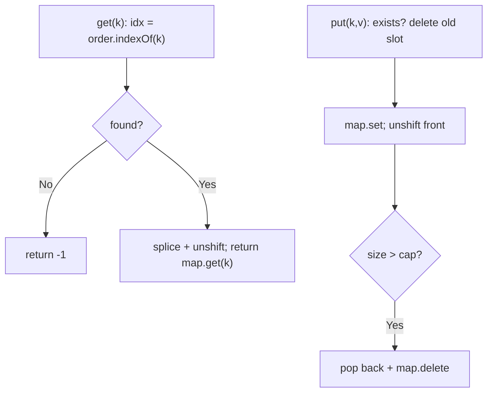
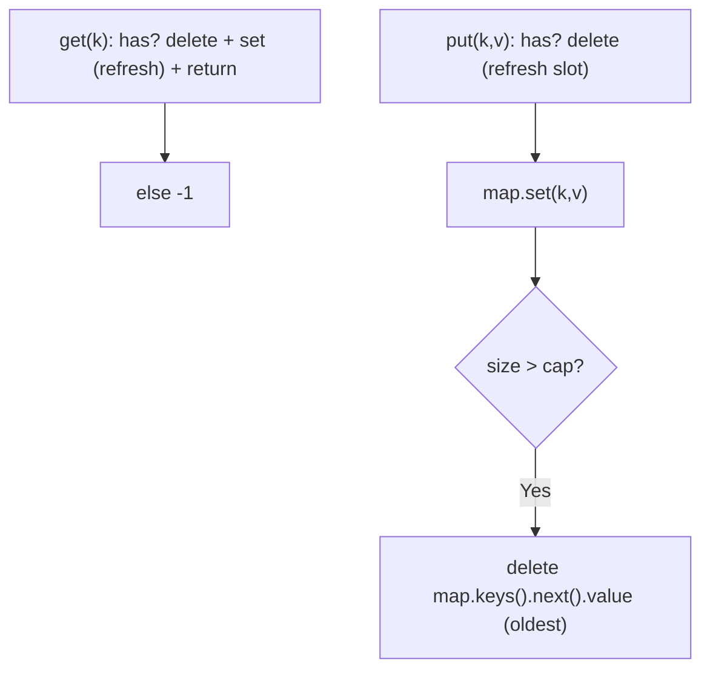
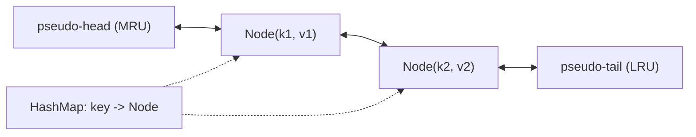

# 146. LRU Cache

- **LeetCode Link**: `https://leetcode.com/problems/lru-cache/`
- **Difficulty**: Medium
- **Pattern Category**: Linked List / Hash Map + Doubly Linked List
- **Prerequisite Primer**: `00-foundations/02-data-structure-polyfills.md`

---

## 1. Problem Overview & Edge Case Matrix

### Problem Statement
Design a data structure that follows the constraints of a Least Recently Used (LRU) cache. Implement the `LRUCache` class:

- `LRUCache(int capacity)` initializes the cache with positive size `capacity`.
- `int get(int key)` returns the value of the `key` if present, otherwise `-1`.
- `void put(int key, int value)` updates the value, or inserts if absent. When the cache exceeds capacity, evict the least recently used key.

Both `get` and `put` must run in $O(1)$ average time complexity.

```
Example 1:
Input: ["LRUCache","put","put","get","put","get","put","get","get","get"]
       [[2],[1,1],[2,2],[1],[3,3],[2],[4,4],[1],[3],[4]]
Output: [null,null,null,1,null,-1,null,-1,3,4]
Explanation:
cache = LRUCache(2); put(1,1); put(2,2); get(1)=1;
put(3,3) evicts 2; get(2)=-1; put(4,4) evicts 1;
get(1)=-1; get(3)=3; get(4)=4.
```

### Visual Problem Representation
```
capacity 2:   MRU ---- LRU
put(1,1):     [1]
put(2,2):     [2] <-> [1]
get(1):       [1] <-> [2]        (1 refreshed to front)
put(3,3):     [3] <-> [1]        (2 evicted from back)
```

### Upfront Edge Case Matrix
| Edge Case Category | Specific Input Scenario | Expected Behavior | Pitfall / Risk |
| :--- | :--- | :--- | :--- |
| Zero capacity | `capacity = 0` (defensive) | Every `put` evicts immediately | Division-by-zero style edge; guard size check |
| Single slot | `capacity = 1` | Each `put` evicts the previous | Eviction-canary ordering (evict after insert) |
| Update existing | `put(2,1)` then `put(2,3)` | Value updates, no eviction, key refreshed | Size miscounted on update path |
| Missing key | `get(99)` | Return `-1`, no recency change | Accidentally inserting on read |
| Access-order churn | Repeated `get` on one key | Never evicted while hot | Recency updated on `get`, not just `put` |

---

## 2. Level 1: Brute Force Approach

### Intuition & Visual Idea
A `Map` for values plus an array tracking recency (front = most recent). Every access splices the key out and unshifts it front; every insert past capacity pops the back. Obviously correct — and every op is $O(N)$ from the linear scan/splice.



### Pseudocode
```text
FUNCTION LRUCacheBruteForce(capacity):
    map = EMPTY MAP; order = []  // front = MRU

FUNCTION get(key):
    IF NOT map HAS key: RETURN -1
    order.REMOVE(key); order.UNSHIFT(key)
    RETURN map.GET(key)

FUNCTION put(key, value):
    IF map HAS key: order.REMOVE(key)
    map.SET(key, value); order.UNSHIFT(key)
    IF map.SIZE > capacity:
        victim = order.POP(); map.DELETE(victim)
```

### Step-by-Step Dry Run (Visual Trace)
| Step | Iteration / Pointer ($i, j$) | Current Value | State / Sub-array | Action Taken |
| :--- | :--- | :--- | :--- | :--- |
| 0 | `put(1,1)` | cap `2` | `order=[1]` | Insert front |
| 1 | `put(2,2)` | — | `order=[2,1]` | Insert front |
| 2 | `get(1)` | hit `1` | `order=[1,2]` | Refresh to front |
| 3 | `put(3,3)` | over cap | evict `2`, `order=[3,1]` | Pop back |
| 4 | `get(2)` | miss | `-1`, order unchanged | No recency change |

### Modern JavaScript Implementation
```javascript
/**
 * Level 1: Brute Force (Map + recency array)
 * Time Complexity:  O(N) per get/put — indexOf/splice scan the order array
 * Space Complexity: O(capacity) — map plus order array
 */
class LRUCacheBruteForce {
  constructor(capacity) {
    this.capacity = capacity;
    this.map = new Map(); // key -> value
    this.order = []; // front = most recently used
  }

  _refresh(key) {
    // Linear scan + splice: the O(N) bottleneck Level 2 removes.
    const idx = this.order.indexOf(key);
    if (idx !== -1) this.order.splice(idx, 1);
    this.order.unshift(key);
  }

  get(key) {
    if (!this.map.has(key)) return -1; // miss: no recency change
    this._refresh(key);
    return this.map.get(key);
  }

  put(key, value) {
    if (this.map.has(key)) {
      // Update path: refresh, never evict, size unchanged.
      this.map.set(key, value);
      this._refresh(key);
      return;
    }
    this.map.set(key, value);
    this.order.unshift(key);
    if (this.map.size > this.capacity) {
      const victim = this.order.pop(); // back = least recently used
      this.map.delete(victim);
    }
  }
}
```

### Complexity Breakdown
- **Time Complexity**: $O(N)$ per op — `indexOf` + `splice` + `unshift` each scan/shift the array.
- **Space Complexity**: $O(\text{capacity})$ — map plus order array; time, not space, is the failure.

---

## 3. Level 2: Optimized Approach

### Intuition & Visual Bottleneck Elimination
JS `Map` preserves insertion order — delete + re-set moves a key to the "newest" end in $O(1)$, and the first key is always the LRU victim. No array, no splice, no linked list: average $O(1)$ ops in ~10 lines. Genuinely submittable; only worst-case hash pathologicals separate it from Level 3.



### Pseudocode
```text
FUNCTION LRUCacheOrderedMap(capacity):
    map = EMPTY ORDERED MAP  // insertion order = recency

FUNCTION get(key):
    IF NOT map HAS key: RETURN -1
    val = map.GET(key); map.DELETE(key); map.SET(key, val)  // refresh
    RETURN val

FUNCTION put(key, value):
    IF map HAS key: map.DELETE(key)
    map.SET(key, value)
    IF map.SIZE > capacity: map.DELETE(FIRST KEY)
```

### Step-by-Step Dry Run (Visual Trace)
| Step | Pointers / Window | Hash Map / Auxiliary State | Decision Logic | Output Accumulator |
| :--- | :--- | :--- | :--- | :--- |
| 1 | `put(1,1); put(2,2)` | insertion order `[1,2]` | Appends | — |
| 2 | `get(1)` | delete + re-set `1` | Order becomes `[2,1]` | returns `1` |
| 3 | `put(3,3)` | size `3 > 2` | Evict first key `2` | `get(2) = -1` |
| 4 | `put(4,4)` | evict first key `1` | Order `[3,4]` | `get(3)=3, get(4)=4` |

### Modern JavaScript Implementation
```javascript
/**
 * Level 2: Optimized (insertion-ordered Map as the recency list)
 * Time Complexity:  O(1) average per get/put — hash ops only
 * Space Complexity: O(capacity)
 */
class LRUCacheOrderedMap {
  constructor(capacity) {
    this.capacity = capacity;
    // Invariant: iteration order IS recency order (front = LRU, back = MRU).
    this.map = new Map();
  }

  get(key) {
    if (!this.map.has(key)) return -1;
    // Delete + re-set refreshes recency in O(1): no array splice needed.
    const val = this.map.get(key);
    this.map.delete(key);
    this.map.set(key, val);
    return val;
  }

  put(key, value) {
    // Refresh the slot first so updates never trigger eviction.
    if (this.map.has(key)) this.map.delete(key);
    this.map.set(key, value);
    if (this.map.size > this.capacity) {
      // First iterated key = oldest insertion = LRU victim.
      this.map.delete(this.map.keys().next().value);
    }
  }
}
```

### Complexity Breakdown
- **Time Complexity**: $O(1)$ average — hash operations only; worst case degrades with hash collisions.
- **Space Complexity**: $O(\text{capacity})$ — single structure; minimal and idiomatic JS.

---

## 4. Level 3: Most Optimal / Canonical Approach

### Intuition & Mathematical / Invariant Proof
The textbook structure: hash map (key → node) plus a doubly linked list with dummy head/tail sentinels. The map finds any node in $O(1)$ worst case; sentinels make detach/attach branch-free; eviction pops `tail.prev`. Invariant: list order always equals recency order (head.next = MRU, tail.prev = LRU), and every map value points at its live list node.

```
get(1):   detach 1, attach after head  => [1] <-> [2]
put(3,3): attach 3 at head; size 3 > 2 => pop tail.prev (2)
```

### Pseudocode
```text
FUNCTION LRUCache(capacity):
    map = EMPTY MAP
    head, tail = SENTINEL DUMMIES LINKED head <-> tail

DEFINE detach(node): node.prev.next = node.next; node.next.prev = node.prev
DEFINE attachFront(node): node.next = head.next; node.prev = head
                          head.next.prev = node; head.next = node

FUNCTION get(key):
    IF NOT map HAS key: RETURN -1
    node = map.GET(key); detach(node); attachFront(node); RETURN node.value

FUNCTION put(key, value):
    IF map HAS key: node = map.GET(key); node.value = value
                     detach(node); attachFront(node); RETURN
    node = DNode(key, value); map.SET(key, node); attachFront(node)
    IF map.SIZE > capacity:
        victim = tail.prev; detach(victim); map.DELETE(victim.key)
```

### Step-by-Step Dry Run (Visual Trace)
| Step | Pointer $L$ | Pointer $R$ | Invariant Checked | In-Place State |
| :--- | :--- | :--- | :--- | :--- |
| 1 | `put(1,1), put(2,2)` | — | Order `[2,1]`, map size 2 | `[H,2,1,T]` |
| 2 | `get(1)` | detach + front | Order `[1,2]` | Returns `1` |
| 3 | `put(3,3)` | size 3 > 2 | Evict `tail.prev = 2` | `[H,3,1,T]`, `get(2)=-1` |
| 4 | `put(4,4)` | evict `1` | Order `[4,3]` | `get(1)=-1, get(3)=3, get(4)=4` |

### Modern JavaScript Implementation
```javascript
/**
 * Level 3: Most Optimal / Canonical (Map + doubly linked list)
 * Time Complexity:  O(1) worst-case per get/put
 * Space Complexity: O(capacity)
 */
class DLinkedNode {
  constructor(key, value) {
    this.key = key; // stored: eviction must know WHICH map entry to delete
    this.value = value;
    this.prev = null;
    this.next = null;
  }
}

class LRUCache {
  constructor(capacity) {
    this.capacity = capacity;
    this.map = new Map(); // key -> live list node
    // Sentinels: every attach/detach is branch-free, even on empty lists.
    this.head = new DLinkedNode(null, null);
    this.tail = new DLinkedNode(null, null);
    this.head.next = this.tail;
    this.tail.prev = this.head;
  }

  _detach(node) {
    node.prev.next = node.next;
    node.next.prev = node.prev;
  }

  _attachFront(node) {
    node.next = this.head.next;
    node.prev = this.head;
    this.head.next.prev = node;
    this.head.next = node;
  }

  get(key) {
    if (!this.map.has(key)) return -1;
    const node = this.map.get(key);
    this._detach(node);
    this._attachFront(node); // read = use: refresh recency
    return node.value;
  }

  put(key, value) {
    if (this.map.has(key)) {
      // Update path: new value, refreshed recency, size unchanged.
      const node = this.map.get(key);
      node.value = value;
      this._detach(node);
      this._attachFront(node);
      return;
    }
    const node = new DLinkedNode(key, value);
    this.map.set(key, node);
    this._attachFront(node);
    if (this.map.size > this.capacity) {
      const victim = this.tail.prev; // back = least recently used
      this._detach(victim);
      this.map.delete(victim.key);
    }
  }
}
```

### Complexity Breakdown
- **Time Complexity**: $O(1)$ worst case — pointer surgery plus hash lookup; no iteration anywhere.
- **Space Complexity**: $O(\text{capacity})$ — one node per entry plus two sentinels.

---

## 5. JavaScript-Specific Gotchas & V8 Optimizations
- **GC Pressure**: Avoid allocating objects inside tight loops ($O(N)$ closures). Level 3 allocates one node per *entry* (amortized, required); never allocate per-`get` wrapper objects or refresh tuples.
- **Type Coercion / Sorting**: `Map` keys use SameValueZero — numeric `1` and string `'1'` are DIFFERENT keys; coerce caller keys once at the boundary if the API mixes types, or lookups silently miss.
- **Index Bounds**: `new this.constructor.DNode` indirection exists so subclasses/tests can swap node types — but the critical detail is storing `key` ON the node: without it, eviction cannot find the map entry to delete, leaking stale keys forever.

---

## 6. Real-World MAANG Interview Follow-Ups & Extensions

### Follow-Up 1: LFU Cache (frequency instead of recency)
- **Scenario**: Evict the least *frequently* used key (LeetCode 460, Hard).
- **Solution Strategy**: Map key → `{ value, freq }` plus map freq → doubly linked bucket list; track `minFreq`; `get`/`put` promote nodes between buckets. Same sentinel/detach kernel as Level 3.
- **JS Code / Implementation Pattern**:
```javascript
function lfuTouch(cache, key) {
  const entry = cache.map.get(key);
  removeFromBucket(entry);
  entry.freq++;
  addToBucket(entry.freq, entry);
  if (cache.minFreqBucketEmpty()) cache.minFreq++;
}
```

### Follow-Up 2: Time-aware (TTL) cache with $10^9$ keys
- **Scenario**: Entries expire after a TTL; the cache serves a read-heavy CDN edge.
- **Solution Strategy**: Lazy expiry on `get` (timestamp check, no sweeper) plus a min-heap of deadlines for proactive `put`-time eviction; recency list unchanged.
- **JS Code / Implementation Pattern**:
```javascript
function ttlGet(cache, key, now = Date.now()) {
  const node = cache.map.get(key);
  if (!node || node.expiresAt <= now) return -1; // lazy expiry
  cache._detach(node); cache._attachFront(node);
  return node.value;
}
```

### Follow-Up 3: Distributed LRU across shards with concurrent writers
- **Scenario & In-Depth Solution**: Keys shard by hash across nodes; each shard runs Level 3 locally. Recency is per-shard approximate (global LRU needs cross-shard coordination — accepted inaccuracy). Writers use per-key compare-and-swap on the map entry; readers are lock-free via the versioned-node trick.
```javascript
function shardFor(key, shardCount) {
  return hashKey(key) % shardCount; // consistent hashing in production
}
```

---

## 7. What LeetCode Discuss Says (Language-Independent)

Source: top-voted post by Lisong —
`https://leetcode.com/problems/lru-cache/solutions/45911/java-hashtable-double-linked-list-with-a-mihw/`
— 395.2K views.
Language-independent summary. No new JS here.

### A. Optimal way from Discuss (Doubly Linked List + Hash Map with Pseudo Sentinels)

The textbook industry standard combines a hash map for $O(1)$ key lookup with a Doubly Linked List (DLL) for $O(1)$ node relocation:

1. **Node Structure:** Each node stores both `key` and `value`, along with `prev` and `next` pointers. (Storing `key` in the node is crucial so the cache can look up and delete the key from the hash map when evicting).
2. **Sentinel Nodes:** A pseudo-`head` (MRU boundary) and pseudo-`tail` (LRU boundary) prevent null pointer exceptions and eliminate edge-case checks during node insertions and deletions.
3. **Core Helper Methods:**
   - `addNode(node)`: Always insert immediately after `head` (marks as Most Recently Used).
   - `removeNode(node)`: Unlink node from its neighbors in $O(1)$ (`node.prev.next = node.next`, `node.next.prev = node.prev`).
   - `moveToHead(node)`: Unlink node via `removeNode(node)` and re-insert at front via `addNode(node)`.
   - `popTail()`: Unlink and return the least recently used node right before pseudo-`tail`.
4. **Operations:**
   - `get(key)`: If key missing, return -1. Otherwise, move node to head and return `node.value`.
   - `put(key, value)`: If key exists, update value and move node to head. If new, instantiate node, insert at head, and add to map. If size exceeds capacity, call `popTail()`, delete its key from map, and decrement count.

```text
CLASS LRUCache:
    STRUCTURE DLinkedNode:
        key, value
        prev, next

    INIT(capacity):
        this.capacity = capacity
        this.size = 0
        this.map = new HashMap()
        this.head = new DLinkedNode(0, 0)
        this.tail = new DLinkedNode(0, 0)
        head.next = tail
        tail.prev = head

    METHOD addNode(node):
        node.prev = head
        node.next = head.next
        head.next.prev = node
        head.next = node

    METHOD removeNode(node):
        node.prev.next = node.next
        node.next.prev = node.prev

    METHOD moveToHead(node):
        removeNode(node)
        addNode(node)

    METHOD popTail():
        res = tail.prev
        removeNode(res)
        RETURN res

    METHOD get(key):
        node = map.get(key)
        IF node == null:
            RETURN -1
        moveToHead(node)
        RETURN node.value

    METHOD put(key, value):
        node = map.get(key)
        IF node != null:
            node.value = value
            moveToHead(node)
        ELSE:
            newNode = new DLinkedNode(key, value)
            map.put(key, newNode)
            addNode(newNode)
            size = size + 1
            IF size > capacity:
                tailNode = popTail()
                map.remove(tailNode.key)
                size = size - 1
```

- Time: O(1) strictly for both `get` and `put` operations.
- Space: O(capacity) auxiliary memory for hash map entries and doubly linked list nodes.



### B. Dry run on LeetCode Example 1 (`capacity = 2`)

| Operation | Action Taken | Map Contents | List Order (MRU -> LRU) | Output |
| :--- | :--- | :--- | :--- | :--- |
| `put(1, 1)` | Insert node 1 | `{1: N1}` | `[1]` | - |
| `put(2, 2)` | Insert node 2 | `{1: N1, 2: N2}` | `[2, 1]` | - |
| `get(1)` | Move 1 to head | `{1: N1, 2: N2}` | `[1, 2]` | 1 |
| `put(3, 3)` | Evict LRU (2), Insert 3 | `{1: N1, 3: N3}` | `[3, 1]` | - |
| `get(2)` | Not found in map | `{1: N1, 3: N3}` | `[3, 1]` | -1 |
| `put(4, 4)` | Evict LRU (1), Insert 4 | `{3: N3, 4: N4}` | `[4, 3]` | - |
| `get(1)` | Not found in map | `{3: N3, 4: N4}` | `[4, 3]` | -1 |
| `get(3)` | Move 3 to head | `{3: N3, 4: N4}` | `[3, 4]` | 3 |
| `get(4)` | Move 4 to head | `{3: N3, 4: N4}` | `[4, 3]` | 4 |

### C. Why Pseudo Nodes Beat Nullable Pointers

- **Zero Branching:** Inserting at head or removing from tail executes identical pointer rewiring without `if (node.prev == null)` or `if (node.next == null)` checks.
- **Invariance:** Pseudo-`head` and pseudo-`tail` remain stable for the lifetime of the cache.

### D. Pitfalls from comments

- **Missing `key` in node:** If `DLinkedNode` only stores `value`, when `popTail()` evicts the least recently used node, it cannot determine which key to delete from the hash map without a linear scan.
- **Updating existing key must refresh recency:** Invoking `put` with an existing key updates its value AND moves the node to the head of the list.
- **Hash collision & memory leaks:** In native languages, memory for evicted nodes must be explicitly reclaimed after being removed from both the list and the map.

### E. Companies

- Discuss post itself names none.
  Companies tab on LeetCode is premium-locked.
- External source:
  `https://github.com/liquidslr/leetcode-company-wise-problems`
  (LeetCode company tags, updated June 2025).
- All-time (109): Adobe, Amazon, Apple, Bloomberg, Cisco, Google, Meta, Microsoft, NetApp, Nvidia, Oracle, Salesforce, Uber, TikTok, Goldman Sachs, Palo Alto Networks, etc.
- Recent: 30 days — Adobe, Amazon, Bloomberg, Google, Meta, NetApp.
- Recent: 3 months — Adobe, Amazon, Apple, Bloomberg, Goldman Sachs, Google, Meta, Microsoft, NetApp, Palo Alto Networks, TikTok.
