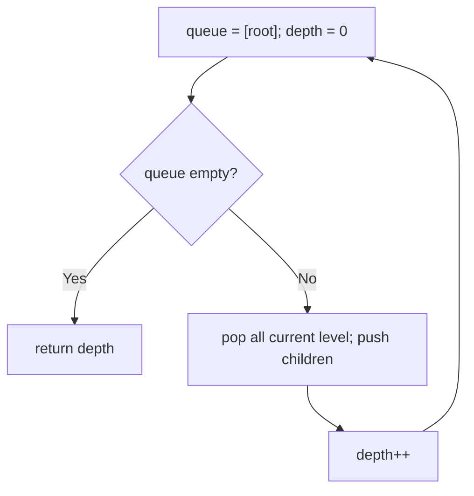
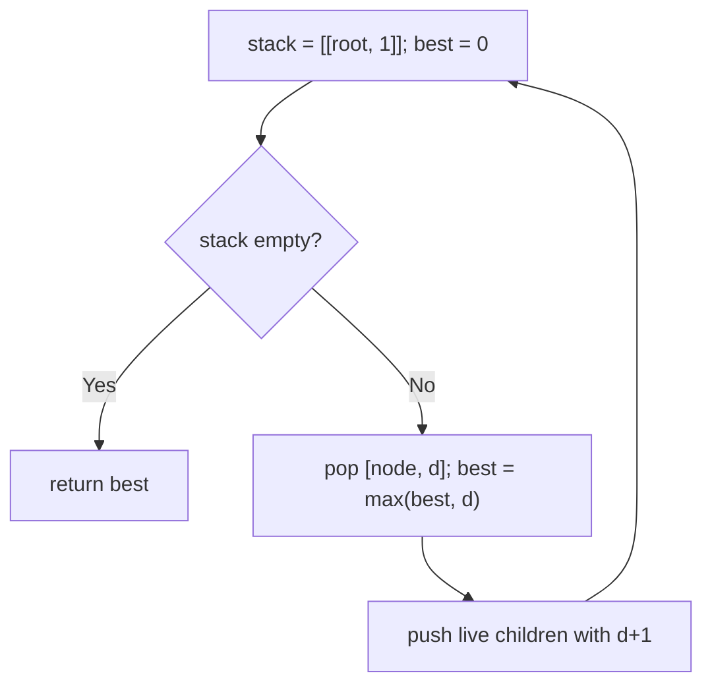

# 104. Maximum Depth of Binary Tree

- **LeetCode Link**: `https://leetcode.com/problems/maximum-depth-of-binary-tree/`
- **Difficulty**: Easy
- **Pattern Category**: Binary Tree / Depth Traversal
- **Prerequisite Primer**: `00-foundations/03-core-algorithmic-patterns.md`

---

## 1. Problem Overview & Edge Case Matrix

### Problem Statement
Given the `root` of a binary tree, return its maximum depth. A binary tree's maximum depth is the number of nodes along the longest path from the root node down to the farthest leaf node.

```
Example 1:
Input: root = [3,9,20,null,null,15,7]
Output: 3

Example 2:
Input: root = [1,null,2]
Output: 2
```

### Visual Problem Representation
```
        3              depth 1
       / \
      9   20           depth 2
          / \
         15  7         depth 3  => answer 3
```

### Upfront Edge Case Matrix
| Edge Case Category | Specific Input Scenario | Expected Behavior | Pitfall / Risk |
| :--- | :--- | :--- | :--- |
| Empty / Nil | `root = null` | Return `0` | Calling `.left` on null |
| Single Element | `[1]` | Return `1` | Depth 0 vs 1 (nodes, not edges) |
| Skewed chain | `[1,null,2,null,3]` | Return `3` | Recursion depth $= N$ on skewed input |
| Full tree | $2^h - 1$ nodes | Return `h` | Queue memory on wide last level |
| Unbalanced | Left deep, right shallow | Max, not min | Taking the wrong branch aggregate |

---

## 2. Level 1: Brute Force Approach

### Intuition & Visual Idea
Breadth-first level counting: process the tree one level at a time with a queue, incrementing depth per level drained. No recursion, obviously correct — but the queue holds the entire widest level ($O(N)$ space on full trees).



### Pseudocode
```text
FUNCTION maxDepthBFS(root):
    IF root NULL: RETURN 0
    queue = [root]; depth = 0
    WHILE queue NOT EMPTY:
        levelSize = queue.LENGTH
        REPEAT levelSize TIMES:
            node = queue.SHIFT()
            IF node.left: queue.PUSH(node.left)
            IF node.right: queue.PUSH(node.right)
        depth++
    RETURN depth
```

### Step-by-Step Dry Run (Visual Trace)
| Step | Iteration / Pointer ($i, j$) | Current Value | State / Sub-array | Action Taken |
| :--- | :--- | :--- | :--- | :--- |
| 0 | level 0 | queue `[3]` | depth `0` | Drain 1 node, push `9, 20` |
| 1 | level 1 | queue `[9,20]` | depth `1` | Drain 2, push `15, 7` |
| 2 | level 2 | queue `[15,7]` | depth `2` | Drain 2, push none |
| 3 | empty | — | depth `3` | Return `3` |

### Modern JavaScript Implementation
```javascript
/**
 * Shared backbone: LeetCode provides TreeNode; defined once here so every
 * level below is locally runnable when concatenated (Level 1 + 2 + 3).
 * Time Complexity:  n/a (scaffolding)
 * Space Complexity: n/a (scaffolding)
 */
class TreeNode {
  constructor(val, left = null, right = null) {
    this.val = val;
    this.left = left;
    this.right = right;
  }
}

function arrayToTree(arr) {
  if (arr.length === 0 || arr[0] === null || arr[0] === undefined) return null;
  const root = new TreeNode(arr[0]);
  const queue = [root];
  let i = 1;
  while (i < arr.length) {
    const node = queue.shift();
    if (i < arr.length && arr[i] !== null && arr[i] !== undefined) {
      node.left = new TreeNode(arr[i]);
      queue.push(node.left);
    }
    i++;
    if (i < arr.length && arr[i] !== null && arr[i] !== undefined) {
      node.right = new TreeNode(arr[i]);
      queue.push(node.right);
    }
    i++;
  }
  return root;
}

/**
 * Level 1: Brute Force (BFS level counting)
 * Time Complexity:  O(N) — every node enqueued once
 * Space Complexity: O(N) — queue holds the widest level
 */
function maxDepthBFS(root) {
  if (root === null) return 0;
  const queue = [root];
  let depth = 0;
  while (queue.length > 0) {
    // Snapshot the level size: children pushed this round belong to next.
    const levelSize = queue.length;
    for (let i = 0; i < levelSize; i++) {
      const node = queue.shift();
      if (node.left !== null) queue.push(node.left);
      if (node.right !== null) queue.push(node.right);
    }
    depth++;
  }
  return depth;
}
```

### Complexity Breakdown
- **Time Complexity**: $O(N)$ — each node enqueued/dequeued once.
- **Space Complexity**: $O(N)$ — widest level (last row holds $\approx N/2$ nodes on full trees).

---

## 3. Level 2: Optimized Approach

### Intuition & Visual Bottleneck Elimination
Replace the level-wide queue with an explicit stack carrying `(node, depth)` pairs — memory drops from widest-level to tree-height. Same $O(N)$ visits, $O(H)$ space, zero recursion.



### Pseudocode
```text
FUNCTION maxDepthIterative(root):
    IF root NULL: RETURN 0
    stack = [[root, 1]]; best = 0
    WHILE stack NOT EMPTY:
        [node, d] = stack.POP()
        best = MAX(best, d)
        IF node.left: stack.PUSH([node.left, d+1])
        IF node.right: stack.PUSH([node.right, d+1])
    RETURN best
```

### Step-by-Step Dry Run (Visual Trace)
| Step | Pointers / Window | Hash Map / Auxiliary State | Decision Logic | Output Accumulator |
| :--- | :--- | :--- | :--- | :--- |
| 0 | pop `[3,1]` | `best = 1` | Push `[9,2]`, `[20,2]` | `best = 1` |
| 1 | pop `[20,2]` | `best = 2` | Push `[15,3]`, `[7,3]` | `best = 2` |
| 2 | pop `[7,3]` | `best = 3` | Leaf, no children | `best = 3` |
| 3 | drain rest | depths `≤ 3` | No update | Return `3` |

### Modern JavaScript Implementation
```javascript
/**
 * Level 2: Optimized (explicit-stack DFS with depths)
 * Time Complexity:  O(N) — each node pushed/popped once
 * Space Complexity: O(H) — stack depth bounded by tree height
 */
// TreeNode shared from Level 1.
function maxDepthIterative(root) {
  if (root === null) return 0;
  const stack = [[root, 1]]; // [node, depth-of-node]
  let best = 0;
  while (stack.length > 0) {
    const [node, d] = stack.pop();
    if (d > best) best = d;
    // Depth travels with the node: no level bookkeeping needed.
    if (node.left !== null) stack.push([node.left, d + 1]);
    if (node.right !== null) stack.push([node.right, d + 1]);
  }
  return best;
}
```

### Complexity Breakdown
- **Time Complexity**: $O(N)$ — one visit per node.
- **Space Complexity**: $O(H)$ — path-length stack; $O(\log N)$ balanced, $O(N)$ skewed.

---

## 4. Level 3: Most Optimal / Canonical Approach

### Intuition & Mathematical / Invariant Proof
Divide and conquer: `depth(node) = 1 + max(depth(left), depth(right))`, `depth(null) = 0`. The recurrence is the definition of height — no data structure, no bookkeeping. Each node does $O(1)$ combine work, so total time is $O(N)$ with $O(H)$ implicit stack. This is the form interviewers expect on sight.

```
depth(3) = 1 + max(depth(9), depth(20))
         = 1 + max(1, 1 + max(depth(15), depth(7)))
         = 1 + max(1, 2) = 3
```

### Pseudocode
```text
FUNCTION maxDepth(node):
    IF node NULL: RETURN 0
    RETURN 1 + MAX(maxDepth(node.left), maxDepth(node.right))
```

### Step-by-Step Dry Run (Visual Trace)
| Step | Pointer $L$ | Pointer $R$ | Invariant Checked | In-Place State |
| :--- | :--- | :--- | :--- | :--- |
| 1 | `maxDepth(9)` | leaf | `1 + max(0,0) = 1` | Returns `1` |
| 2 | `maxDepth(15)`, `(7)` | leaves | Each returns `1` | Returns `1, 1` |
| 3 | `maxDepth(20)` | `1 + max(1,1)` | `= 2` | Returns `2` |
| 4 | `maxDepth(3)` | `1 + max(1,2)` | `= 3` | Return `3` |

### Modern JavaScript Implementation
```javascript
/**
 * Level 3: Most Optimal / Canonical (bottom-up recursion)
 * Time Complexity:  O(N) — O(1) combine work per node
 * Space Complexity: O(H) — call stack depth equals tree height
 */
// TreeNode shared from Level 1.
function maxDepth(root) {
  // Base: empty subtree has depth 0 (depth counts NODES, so leaf = 1).
  if (root === null) return 0;
  return 1 + Math.max(maxDepth(root.left), maxDepth(root.right));
}
```

### Complexity Breakdown
- **Time Complexity**: $O(N)$ — optimal lower bound; every node must be inspected (a deep leaf could hide anywhere).
- **Space Complexity**: $O(H)$ — implicit stack; the price of recursion's clarity (skewed $N = 10^4$ risks V8 overflow — say so in the interview).

---

## 5. JavaScript-Specific Gotchas & V8 Optimizations
- **GC Pressure**: Avoid allocating objects inside tight loops ($O(N)$ closures). Level 2's `[node, depth]` pair per node is real allocation — Level 3's bare frames are lighter; never box depths into `{ node, d }` objects.
- **Type Coercion / Sorting**: `queue.shift()` is $O(N)$ per call on V8 arrays (memmove) — Level 1 on $N = 10^4$ pays quadratic shifting; use an index pointer (`q[i++]`) or accept it explicitly for clarity.
- **Index Bounds**: Recursion depth $> 10^4$ overflows V8's call stack on skewed trees — name Level 2 as the production fallback when the interviewer asks "what breaks at scale?"

---

## 6. Real-World MAANG Interview Follow-Ups & Extensions

### Follow-Up 1: Minimum depth and diameter in the same walk
- **Scenario**: Return min depth (nearest leaf) and diameter (longest leaf-to-leaf path) without extra traversals.
- **Solution Strategy**: Same recursion shape; min uses `Math.min` over non-null children (null child ≠ depth 0 for min), diameter tracks `left + right` maxima through a closure variable.
- **JS Code / Implementation Pattern**:
```javascript
function treeStats(root) {
  let diameter = 0;
  function height(node) {
    if (!node) return 0;
    const l = height(node.left), r = height(node.right);
    diameter = Math.max(diameter, l + r);
    return 1 + Math.max(l, r);
  }
  return { maxDepth: height(root), diameter };
}
```

### Follow-Up 2: Depth of a $10^9$-node tree that never fits in memory
- **Scenario**: The tree streams as parent-pointer records from disk.
- **Solution Strategy**: Morris-style threading is impossible on streams — instead track depth labels: stream `(id, parentId)` pairs, union depths via a disjoint-set with depth augmentation, single pass, $O(N \,\alpha(N))$.
- **JS Code / Implementation Pattern**:
```javascript
async function streamMaxDepth(recordStream) {
  const depth = new Map([[0, 0]]); // parentId 0 = virtual root
  let best = 0;
  for await (const [id, parentId] of recordStream) {
    const d = (depth.get(parentId) ?? 0) + 1;
    depth.set(id, d);
    if (d > best) best = d;
  }
  return best;
}
```

### Follow-Up 3: Concurrent mutation during traversal
- **Scenario & In-Depth Solution**: Writers rotate subtrees mid-measurement. Snapshot the child pointers per node into locals before recursing (Level 3 already does: `root.left`/`root.right` read once each) — a torn read then only affects one subtree's contribution, and version-stamping the root detects staleness for retry.
```javascript
function maxDepthVersioned(root, versionOf) {
  const stamp = versionOf(root);
  const d = maxDepth(root);
  if (versionOf(root) !== stamp) throw new Error('mutated during scan: retry');
  return d;
}
```
