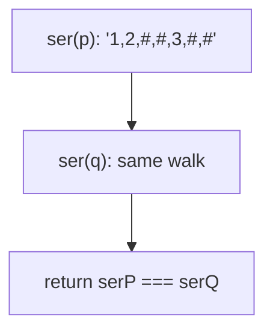
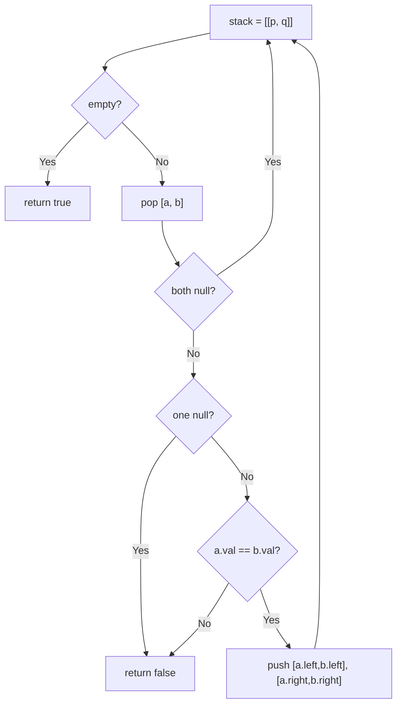

# 100. Same Tree

- **LeetCode Link**: `https://leetcode.com/problems/same-tree/`
- **Difficulty**: Easy
- **Pattern Category**: Binary Tree / Simultaneous Traversal
- **Prerequisite Primer**: `00-foundations/03-core-algorithmic-patterns.md`

---

## 1. Problem Overview & Edge Case Matrix

### Problem Statement
Given the roots of two binary trees `p` and `q`, write a function to check if they are the same or not. Two binary trees are considered the same if they are structurally identical, and the nodes have the same value.

```
Example 1:
Input: p = [1,2,3], q = [1,2,3]
Output: true

Example 2:
Input: p = [1,2], q = [1,null,2]
Output: false

Example 3:
Input: p = [1,2,1], q = [1,1,2]
Output: false
```

### Visual Problem Representation
```
same:        1           1
            / \         / \
           2   3       2   3      (structure + values match)

different:   1           1
            /             \
           2               2      (structure differs => false)
```

### Upfront Edge Case Matrix
| Edge Case Category | Specific Input Scenario | Expected Behavior | Pitfall / Risk |
| :--- | :--- | :--- | :--- |
| Empty / Nil | Both `null` | Return `true` | Null-dereference before the null check |
| Single Element | `[1]` vs `null` | Return `false` | One-sided null treated as match |
| Same values, different shape | `[1,2]` vs `[1,null,2]` | Return `false` | Value-only comparison ignoring structure |
| Different values, same shape | `[1,2,1]` vs `[1,1,2]` | Return `false` | Structure-only comparison ignoring values |
| Deep skewed pair | $N = 10^4$ chains | Correct boolean | Recursion depth on skewed input |

---

## 2. Level 1: Brute Force Approach

### Intuition & Visual Idea
Serialize both trees to strings with explicit null markers (preorder: value, left, right), then compare strings. Structure and values collapse into one comparable form — correct, but $O(N)$ strings plus full traversal even on early mismatch.



### Pseudocode
```text
FUNCTION serialize(node):
    IF node NULL: RETURN "#,"
    RETURN STRING(node.val) + "," + serialize(node.left) + serialize(node.right)

FUNCTION isSameTreeBruteForce(p, q):
    RETURN serialize(p) === serialize(q)
```

### Step-by-Step Dry Run (Visual Trace)
| Step | Iteration / Pointer ($i, j$) | Current Value | State / Sub-array | Action Taken |
| :--- | :--- | :--- | :--- | :--- |
| 0 | serialize `p = [1,2,3]` | preorder + `#` | `"1,2,#,#,3,#,#,"` | Full walk |
| 1 | serialize `q = [1,2,3]` | preorder + `#` | `"1,2,#,#,3,#,#,"` | Full walk |
| 2 | compare | equal | — | Return `true` |
| 3 | `[1,2]` vs `[1,null,2]` | `"1,2,#,#,#,"` vs `"1,#,2,#,#,"` | differ | Return `false` |

### Modern JavaScript Implementation
```javascript
/**
 * Shared backbone: LeetCode provides TreeNode; defined once here so every
 * level below is locally runnable when concatenated (Level 1 + 2 + 3).
 * Time Complexity:  n/a (scaffolding)
 * Space Complexity: n/a (scaffolding)
 */
class TreeNode {
  constructor(val, left = null, right = null) {
    this.val = val;
    this.left = left;
    this.right = right;
  }
}

function arrayToTree(arr) {
  if (arr.length === 0 || arr[0] === null || arr[0] === undefined) return null;
  const root = new TreeNode(arr[0]);
  const queue = [root];
  let i = 1;
  while (i < arr.length) {
    const node = queue.shift();
    if (i < arr.length && arr[i] !== null && arr[i] !== undefined) {
      node.left = new TreeNode(arr[i]);
      queue.push(node.left);
    }
    i++;
    if (i < arr.length && arr[i] !== null && arr[i] !== undefined) {
      node.right = new TreeNode(arr[i]);
      queue.push(node.right);
    }
    i++;
  }
  return root;
}

function serializePreorder(node) {
  // '#' marks nulls: without markers, [1,2] and [1,null,2] collide.
  if (node === null) return '#,';
  return node.val + ',' + serializePreorder(node.left) + serializePreorder(node.right);
}

/**
 * Level 1: Brute Force (serialize + string compare)
 * Time Complexity:  O(N + M) — full walks of both trees
 * Space Complexity: O(N + M) — two strings plus recursion stacks
 */
function isSameTreeBruteForce(p, q) {
  return serializePreorder(p) === serializePreorder(q);
}
```

### Complexity Breakdown
- **Time Complexity**: $O(N + M)$ — always walks both trees fully, even when roots differ.
- **Space Complexity**: $O(N + M)$ — serialized strings; early-exit comparison is the missing optimization.

---

## 3. Level 2: Optimized Approach

### Intuition & Visual Bottleneck Elimination
Walk both trees in lockstep with an explicit pair-stack: compare nodes as they arrive and bail on the first mismatch. No strings, short-circuits early, iterative — $O(H)$ space with zero recursion.



### Pseudocode
```text
FUNCTION isSameTreeIterative(p, q):
    stack = [[p, q]]
    WHILE stack NOT EMPTY:
        [a, b] = stack.POP()
        IF a NULL AND b NULL: CONTINUE
        IF a NULL OR b NULL: RETURN false
        IF a.val != b.val: RETURN false
        stack.PUSH([a.left, b.left]); stack.PUSH([a.right, b.right])
    RETURN true
```

### Step-by-Step Dry Run (Visual Trace)
| Step | Pointers / Window | Hash Map / Auxiliary State | Decision Logic | Output Accumulator |
| :--- | :--- | :--- | :--- | :--- |
| 0 | pop `[1,1]` | roots | Values equal | Push children pairs |
| 1 | pop `[3,3]` | right pair | Values equal, both leaves | Push `[null,null]` ×2 |
| 2 | pop `[null,null]` | — | Both null, continue | — |
| 3 | pop `[2,2]` | left pair | Values equal | Continue |
| 4 | stack empty | all matched | — | Return `true` |

### Modern JavaScript Implementation
```javascript
/**
 * Level 2: Optimized (lockstep pair-stack, early exit)
 * Time Complexity:  O(min(N, M)) — stops at the first mismatch
 * Space Complexity: O(H) — pair stack bounded by height
 */
// TreeNode shared from Level 1.
function isSameTreeIterative(p, q) {
  const stack = [[p, q]];
  while (stack.length > 0) {
    const [a, b] = stack.pop();
    if (a === null && b === null) continue; // matched absence
    // Exactly one null => structures differ; values checked only when both live.
    if (a === null || b === null || a.val !== b.val) return false;
    stack.push([a.left, b.left]);
    stack.push([a.right, b.right]);
  }
  return true;
}
```

### Complexity Breakdown
- **Time Complexity**: $O(\min(N, M))$ — early exit on first structural or value mismatch.
- **Space Complexity**: $O(H)$ — explicit stack; no recursion, no strings.

---

## 4. Level 3: Most Optimal / Canonical Approach

### Intuition & Mathematical / Invariant Proof
Structural induction in three lines: both null → true; exactly one null → false; else values must match AND both subtrees must match. The recursion mirrors the definition of tree equality — each pair is visited once, mismatches unwind immediately. This is the canonical interview answer.

```
isSame(p, q) = (p == q == null)                         -> true
             | (p == null) XOR (q == null)               -> false
             | p.val == q.val AND isSame(l) AND isSame(r)
```

### Pseudocode
```text
FUNCTION isSameTree(p, q):
    IF p NULL AND q NULL: RETURN true
    IF p NULL OR q NULL: RETURN false
    RETURN p.val == q.val
       AND isSameTree(p.left, q.left)
       AND isSameTree(p.right, q.right)
```

### Step-by-Step Dry Run (Visual Trace)
| Step | Pointer $L$ | Pointer $R$ | Invariant Checked | In-Place State |
| :--- | :--- | :--- | :--- | :--- |
| 1 | `p=2, q=null` (ex.2) | one-sided null | Second rule fires | Return `false` |
| 2 | unwinds | `&&` short-circuits | No further visits | Return `false` |
| 3 | ex.1 leaves | both null | First rule fires | Return `true` |
| 4 | unwinds | values + subtrees all true | — | Return `true` |

### Modern JavaScript Implementation
```javascript
/**
 * Level 3: Most Optimal / Canonical (structural recursion)
 * Time Complexity:  O(min(N, M)) — short-circuits on first mismatch
 * Space Complexity: O(H) — call stack depth equals height
 */
// TreeNode shared from Level 1.
function isSameTree(p, q) {
  // Both absent: matched structure at this position.
  if (p === null && q === null) return true;
  // Exactly one absent: shapes differ (checked BEFORE touching .val).
  if (p === null || q === null) return false;
  // Values plus both subtrees must all agree; && short-circuits.
  return p.val === q.val
    && isSameTree(p.left, q.left)
    && isSameTree(p.right, q.right);
}
```

### Complexity Breakdown
- **Time Complexity**: $O(\min(N, M))$ — optimal; a mismatch anywhere ends the walk, and equal trees require full visits.
- **Space Complexity**: $O(H)$ — implicit stack; skewed inputs are the known recursion caveat.

---

## 5. JavaScript-Specific Gotchas & V8 Optimizations
- **GC Pressure**: Avoid allocating objects inside tight loops ($O(N)$ closures). Level 1's two full strings (plus per-node concatenation churn) are the pressure Levels 2–3 remove — never serialize for comparison.
- **Type Coercion / Sorting**: Node values are numbers — `a.val !== b.val` strict comparison is correct; `==` would equate `1` with `'1'` if a test ever mixed types. Serialize with an unambiguous separator (`,`): without it, `[12]` vs `[1,2]` serialize identically.
- **Index Bounds**: The null-pair check order is load-bearing — `a === null || b === null` MUST precede `a.val` access; `a?.val === b?.val` alone is wrong because `undefined === undefined` would call two nulls "equal values" and continue into `.left` of null.

---

## 6. Real-World MAANG Interview Follow-Ups & Extensions

### Follow-Up 1: Subtree check and forest matching
- **Scenario**: Is `subRoot` a subtree of `root` (LeetCode 572), or which of $K$ trees match?
- **Solution Strategy**: Reuse Level 3 as the matcher inside an outer walk: `isSubtree = isSameTree(root, sub) || isSubtree(root.left) || isSubtree(root.right)` — $O(N·M)$ worst case, Merkle-hashing for repeated queries.
- **JS Code / Implementation Pattern**:
```javascript
function isSubtree(root, subRoot) {
  if (!root) return false;
  if (isSameTree(root, subRoot)) return true;
  return isSubtree(root.left, subRoot) || isSubtree(root.right, subRoot);
}
```

### Follow-Up 2: $10^9$-node trees compared across machines
- **Scenario**: Trees live on different hosts; shipping them is infeasible.
- **Solution Strategy**: Compare Merkle hashes bottom-up (hash = H(val, hashL, hashR)) — equal roots imply equal trees with overwhelming probability; only hash mismatches trigger targeted subtree fetches.
- **JS Code / Implementation Pattern**:
```javascript
async function merkleHash(node, fetchChildren) {
  if (!node) return 'null';
  const [l, r] = await fetchChildren(node);
  return 'H(' + node.val + ',' + await merkleHash(l) + ',' + await merkleHash(r) + ')';
}
```

### Follow-Up 3: Approximate tree equality (tolerant diff)
- **Scenario & In-Depth Solution**: Allow up to $K$ value mismatches (fuzzy config-tree diff). Thread a budget through Level 3: value mismatch consumes 1, structural mismatch fails immediately; return `{ equal, diffs }` instead of a boolean.
```javascript
function fuzzySame(p, q, budget) {
  if (!p && !q) return { equal: true, used: 0 };
  if (!p || !q) return { equal: false, used: Infinity };
  const cost = p.val === q.val ? 0 : 1;
  if (cost > budget) return { equal: false, used: cost };
  const l = fuzzySame(p.left, q.left, budget - cost);
  const r = fuzzySame(p.right, q.right, budget - l.used);
  return { equal: l.equal && r.equal, used: cost + l.used + r.used };
}
```
