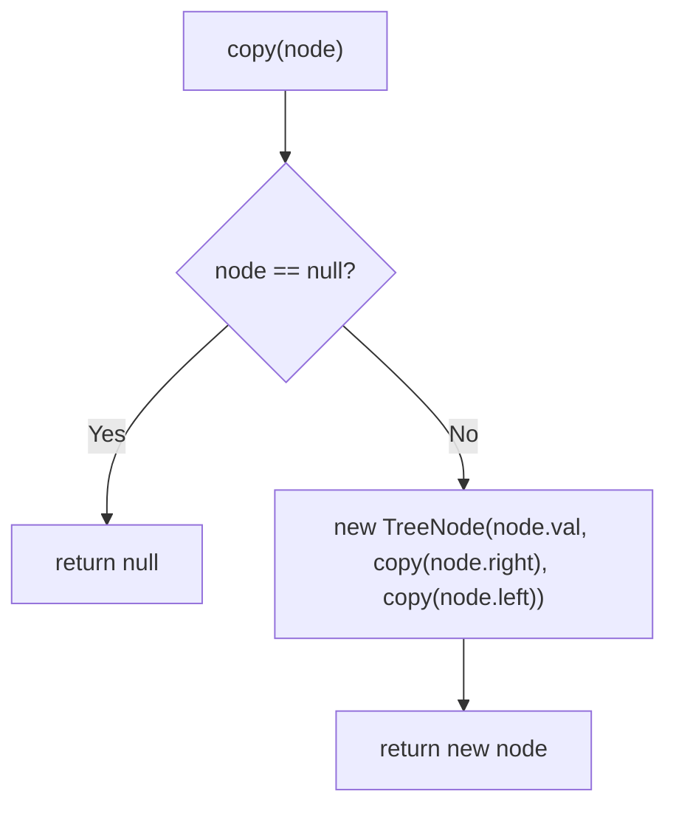
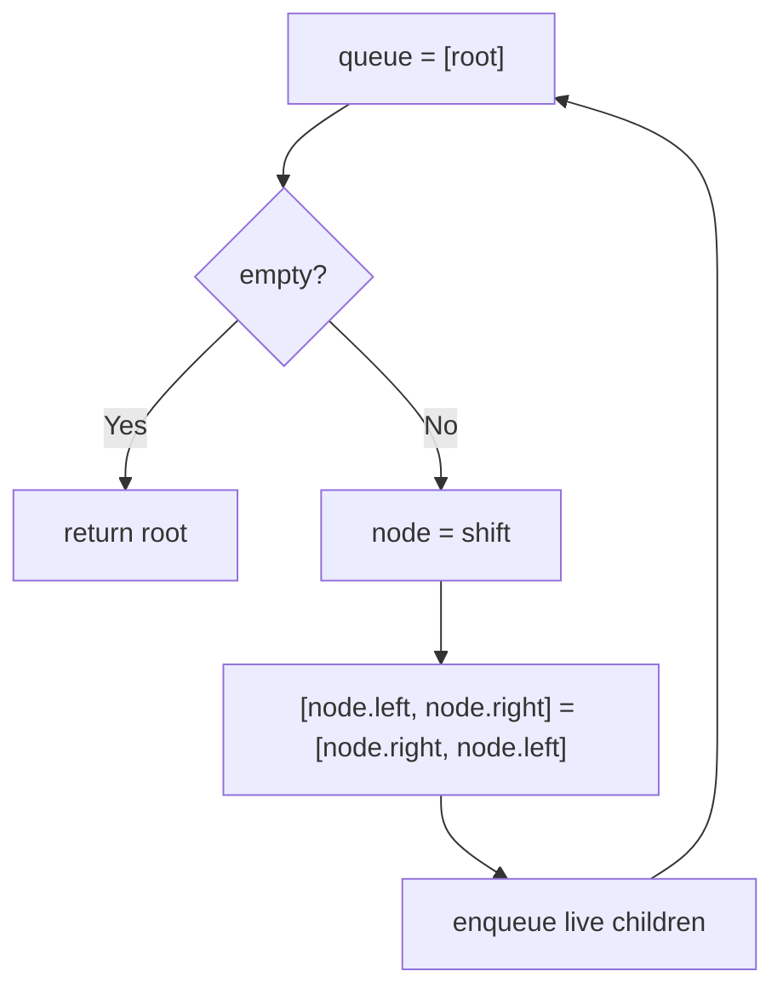

# 226. Invert Binary Tree

- **LeetCode Link**: `https://leetcode.com/problems/invert-binary-tree/`
- **Difficulty**: Easy
- **Pattern Category**: Binary Tree / Mirror Swap
- **Prerequisite Primer**: `00-foundations/03-core-algorithmic-patterns.md`

---

## 1. Problem Overview & Edge Case Matrix

### Problem Statement
Given the `root` of a binary tree, invert the tree, and return its root. Inversion swaps every node's left and right children.

```
Example 1:
Input: root = [4,2,7,1,3,6,9]
Output: [4,7,2,9,6,3,1]

Example 2:
Input: root = [2,1,3]
Output: [2,3,1]

Example 3:
Input: root = []
Output: []
```

### Visual Problem Representation
```
before:        4                after:         4
             /   \                          /   \
            2     7                        7     2
           / \   / \                      / \   / \
          1  3  6   9                    9  6  3   1
```

### Upfront Edge Case Matrix
| Edge Case Category | Specific Input Scenario | Expected Behavior | Pitfall / Risk |
| :--- | :--- | :--- | :--- |
| Empty / Nil | `root = null` | Return `null` | Swapping on null |
| Single Element | `[1]` | Return `[1]` | Self-swap corrupting pointers |
| One-sided | `[1,null,2]` | `[1,2,null]` | Losing the lone child mid-swap |
| Full tree | 7-node example | Perfect mirror | Recursing into already-swapped children twice |
| Skewed chain | Left-only chain | Becomes right-only | Stack depth $= N$ |

---

## 2. Level 1: Brute Force Approach

### Intuition & Visual Idea
Build a brand-new mirrored tree: each new node's left is the mirror of the old right and vice versa. No mutation, trivially safe — but $O(N)$ fresh nodes for a rearrangement that needs zero.



### Pseudocode
```text
FUNCTION invertTreeCopy(node):
    IF node NULL: RETURN NULL
    mirrored = TreeNode(node.val)
    mirrored.left = invertTreeCopy(node.right)
    mirrored.right = invertTreeCopy(node.left)
    RETURN mirrored
```

### Step-by-Step Dry Run (Visual Trace)
| Step | Iteration / Pointer ($i, j$) | Current Value | State / Sub-array | Action Taken |
| :--- | :--- | :--- | :--- | :--- |
| 0 | `copy(2)` in `[2,1,3]` | old left `1`, right `3` | New node `2` | Recurse swapped |
| 1 | `copy(old right=3)` | becomes new LEFT | New node `3` | Mirror position |
| 2 | `copy(old left=1)` | becomes new RIGHT | New node `1` | Mirror position |
| 3 | return | — | `[2,3,1]` fresh nodes | Original untouched |

### Modern JavaScript Implementation
```javascript
/**
 * Shared backbone: LeetCode provides TreeNode; defined once here so every
 * level below is locally runnable when concatenated (Level 1 + 2 + 3).
 * Time Complexity:  n/a (scaffolding)
 * Space Complexity: n/a (scaffolding)
 */
class TreeNode {
  constructor(val, left = null, right = null) {
    this.val = val;
    this.left = left;
    this.right = right;
  }
}

function arrayToTree(arr) {
  if (arr.length === 0 || arr[0] === null || arr[0] === undefined) return null;
  const root = new TreeNode(arr[0]);
  const queue = [root];
  let i = 1;
  while (i < arr.length) {
    const node = queue.shift();
    if (i < arr.length && arr[i] !== null && arr[i] !== undefined) {
      node.left = new TreeNode(arr[i]);
      queue.push(node.left);
    }
    i++;
    if (i < arr.length && arr[i] !== null && arr[i] !== undefined) {
      node.right = new TreeNode(arr[i]);
      queue.push(node.right);
    }
    i++;
  }
  return root;
}

function treeToArray(root) {
  if (root === null) return [];
  const out = [];
  const queue = [root];
  while (queue.length > 0) {
    const node = queue.shift();
    if (node === null) {
      out.push(null);
    } else {
      out.push(node.val);
      queue.push(node.left, node.right);
    }
  }
  while (out.length > 0 && out[out.length - 1] === null) out.pop();
  return out;
}

/**
 * Level 1: Brute Force (mirrored copy)
 * Time Complexity:  O(N) — one visit per node
 * Space Complexity: O(N) — N fresh nodes plus recursion stack
 */
function invertTreeCopy(node) {
  if (node === null) return null;
  // New node: left takes the mirror of old RIGHT and vice versa.
  const mirrored = new TreeNode(node.val);
  mirrored.left = invertTreeCopy(node.right);
  mirrored.right = invertTreeCopy(node.left);
  return mirrored;
}
```

### Complexity Breakdown
- **Time Complexity**: $O(N)$ — linear, but every node is duplicated.
- **Space Complexity**: $O(N)$ — full copy; the original is never touched (wasteful when mutation is allowed).

---

## 3. Level 2: Optimized Approach

### Intuition & Visual Bottleneck Elimination
Swap in place with a BFS queue: pop each node, exchange its children, enqueue both. No copies, no recursion — $O(1)$ auxiliary besides the queue, immune to skewed-depth stack overflow.



### Pseudocode
```text
FUNCTION invertTreeBFS(root):
    IF root NULL: RETURN NULL
    queue = [root]
    WHILE queue NOT EMPTY:
        node = queue.SHIFT()
        SWAP(node.left, node.right)
        IF node.left: queue.PUSH(node.left)
        IF node.right: queue.PUSH(node.right)
    RETURN root
```

### Step-by-Step Dry Run (Visual Trace)
| Step | Pointers / Window | Hash Map / Auxiliary State | Decision Logic | Output Accumulator |
| :--- | :--- | :--- | :--- | :--- |
| 0 | pop `4` | swap children | Enqueue `7, 2` | `4: [7,2]` |
| 1 | pop `7` | swap children | Enqueue `9, 6` | `7: [9,6]` |
| 2 | pop `2` | swap children | Enqueue `3, 1` | `2: [3,1]` |
| 3 | drain leaves | swaps of nulls | No-op pushes | `[4,7,2,9,6,3,1]` |

### Modern JavaScript Implementation
```javascript
/**
 * Level 2: Optimized (iterative in-place BFS swap)
 * Time Complexity:  O(N) — each node dequeued once
 * Space Complexity: O(N) — queue holds the widest level
 */
// TreeNode shared from Level 1.
function invertTreeBFS(root) {
  if (root === null) return null;
  const queue = [root];
  while (queue.length > 0) {
    const node = queue.shift();
    // Destructuring swap: atomic exchange, no temp variable to misorder.
    [node.left, node.right] = [node.right, node.left];
    if (node.left !== null) queue.push(node.left);
    if (node.right !== null) queue.push(node.right);
  }
  return root;
}
```

### Complexity Breakdown
- **Time Complexity**: $O(N)$ — one visit per node.
- **Space Complexity**: $O(N)$ — widest-level queue; Level 3 cuts this to $O(H)$.

---

## 4. Level 3: Most Optimal / Canonical Approach

### Intuition & Mathematical / Invariant Proof
Recursive in-place post-swap: swap the node's children, then invert both subtrees. Order is irrelevant (swap-then-recurse and recurse-then-swap are both correct — each edge is exchanged exactly once). Invariant: after `invertTree(node)` returns, the subtree at `node` is the exact mirror of its original. Three lines, $O(H)$ stack, zero allocation.

```
invert(4): swap -> [7,2]; invert(7): swap -> [9,6], leaves swap nulls; invert(2)...
```

### Pseudocode
```text
FUNCTION invertTree(node):
    IF node NULL: RETURN NULL
    SWAP(node.left, node.right)
    invertTree(node.left)
    invertTree(node.right)
    RETURN node
```

### Step-by-Step Dry Run (Visual Trace)
| Step | Pointer $L$ | Pointer $R$ | Invariant Checked | In-Place State |
| :--- | :--- | :--- | :--- | :--- |
| 1 | `invert(4)` | swap to `[7,2]` | Children exchanged | Recurse left (`7`) |
| 2 | `invert(7)` | swap to `[9,6]` | Leaves swap nulls | Recurse back up |
| 3 | `invert(2)` | swap to `[3,1]` | Mirror complete | Return up |
| 4 | return root | — | Whole tree mirrored | `[4,7,2,9,6,3,1]` |

### Modern JavaScript Implementation
```javascript
/**
 * Level 3: Most Optimal / Canonical (recursive in-place swap)
 * Time Complexity:  O(N) — one swap per node, optimal lower bound
 * Space Complexity: O(H) — call stack depth equals tree height
 */
// TreeNode shared from Level 1.
function invertTree(node) {
  if (node === null) return null;
  // Exchange children BEFORE recursing: each edge swapped exactly once.
  [node.left, node.right] = [node.right, node.left];
  invertTree(node.left);
  invertTree(node.right);
  return node;
}
```

### Complexity Breakdown
- **Time Complexity**: $O(N)$ — optimal lower bound; every node must be touched (a single unswapped child breaks the mirror).
- **Space Complexity**: $O(H)$ — implicit stack only; zero heap allocation.

---

## 5. JavaScript-Specific Gotchas & V8 Optimizations
- **GC Pressure**: Avoid allocating objects inside tight loops ($O(N)$ closures). Level 1's $N$ fresh `TreeNode`s are the pressure removed — Levels 2–3 allocate nothing per node.
- **Type Coercion / Sorting**: Destructuring swap `[a.left, a.right] = [a.right, a.left]` evaluates the right side first — a manual temp swap with misordered stores (`a.left = a.right; a.right = a.left`) silently duplicates one child.
- **Index Bounds**: No index arithmetic here, but the recursion-depth caveat from Maximum Depth applies verbatim: skewed chains of $10^4+$ overflow V8 — cite Level 2 as the production fallback.

---

## 6. Real-World MAANG Interview Follow-Ups & Extensions

### Follow-Up 1: Invert with parent pointers (or n-ary trees)
- **Scenario**: Nodes carry `parent` links, or the tree is n-ary (children array).
- **Solution Strategy**: Same kernel — for n-ary, `node.children.reverse()` in place per node; parent pointers need no updates (they still point at the same objects, only sibling order changes).
- **JS Code / Implementation Pattern**:
```javascript
function invertNary(node) {
  if (!node) return null;
  node.children.reverse();
  for (const child of node.children) invertNary(child);
  return node;
}
```

### Follow-Up 2: Mirror check as an operation (is the tree symmetric?)
- **Scenario**: After inverting a copy, is it identical to the original (LeetCode 101)?
- **Solution Strategy**: Reuse Same Tree's Level 3 as the comparator on `(original, invertedCopy)` — module composability interviewers love.
- **JS Code / Implementation Pattern**:
```javascript
function isSymmetricViaInvert(root) {
  if (!root) return true;
  return isSameTree(root.left, invertTreeCopy(root.right));
}
```

### Follow-Up 3: Persistent (immutable) inversion for concurrent readers
- **Scenario & In-Depth Solution**: Readers traverse while inversion runs — in-place swaps tear their view. Level 1's copy IS the persistent solution: publish the new root atomically, readers pin whichever version they started with. $O(N)$ fresh nodes is the price of snapshot isolation.
```javascript
function publishInverted(headRef) {
  const mirrored = invertTreeCopy(headRef.current);
  headRef.current = mirrored; // single store: atomic publish
}
```
