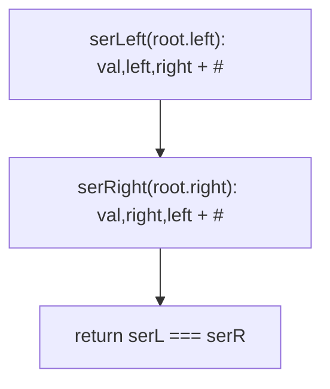
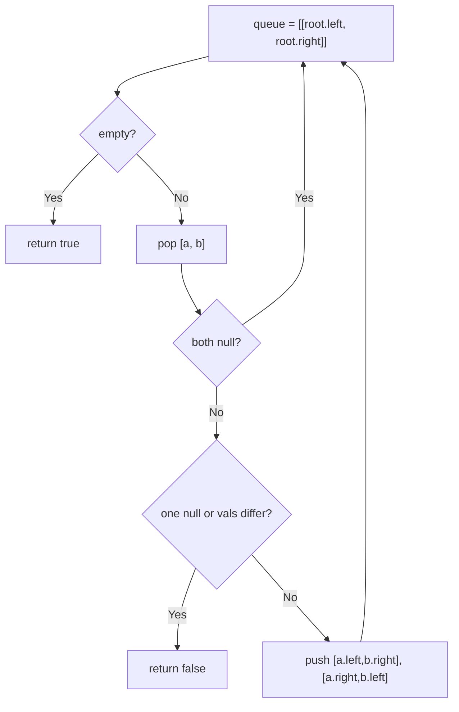

# 101. Symmetric Tree

- **LeetCode Link**: `https://leetcode.com/problems/symmetric-tree/`
- **Difficulty**: Easy
- **Pattern Category**: Binary Tree / Mirror Comparison
- **Prerequisite Primer**: `00-foundations/03-core-algorithmic-patterns.md`

---

## 1. Problem Overview & Edge Case Matrix

### Problem Statement
Given the `root` of a binary tree, check whether it is a mirror of itself (i.e., symmetric around its center).

```
Example 1:
Input: root = [1,2,2,3,4,4,3]
Output: true

Example 2:
Input: root = [1,2,2,null,3,null,3]
Output: false
```

### Visual Problem Representation
```
symmetric:       1                  asymmetric:      1
               /   \                                  / \
              2     2                                2   2
             / \   / \                                \   \
            3  4  4   3                                3   3
```

### Upfront Edge Case Matrix
| Edge Case Category | Specific Input Scenario | Expected Behavior | Pitfall / Risk |
| :--- | :--- | :--- | :--- |
| Empty / Nil | `root = null` | Return `true` | Null-dereference before the root check |
| Single Element | `[1]` | Return `true` | Comparing root against itself trivially |
| Same values, asymmetric shape | `[1,2,2,null,3,null,3]` | Return `false` | Value-only check ignoring mirror positions |
| Mirror values differ | `[1,2,2,3,null,null,3]` | Return `false` | Shape-only check ignoring values |
| Deep mirror | Perfect tree depth 10 | Return `true` | $O(N)$ pair storage on wide levels |

---

## 2. Level 1: Brute Force Approach

### Intuition & Visual Idea
Serialize the left subtree in normal preorder and the right subtree in mirrored preorder (right-before-left); the tree is symmetric iff the two strings match. Reduces mirroring to string equality — at the cost of two full strings.



### Pseudocode
```text
FUNCTION serLeft(node):
    IF node NULL: RETURN "#,"
    RETURN VAL + "," + serLeft(node.left) + serLeft(node.right)

FUNCTION serRightMirrored(node):
    IF node NULL: RETURN "#,"
    RETURN VAL + "," + serRightMirrored(node.right) + serRightMirrored(node.left)

FUNCTION isSymmetricBruteForce(root):
    IF root NULL: RETURN true
    RETURN serLeft(root.left) === serRightMirrored(root.right)
```

### Step-by-Step Dry Run (Visual Trace)
| Step | Iteration / Pointer ($i, j$) | Current Value | State / Sub-array | Action Taken |
| :--- | :--- | :--- | :--- | :--- |
| 0 | `serLeft(2-left)` | `2,3,#,#,4,#,#,` | Left walk | Normal order |
| 1 | `serRight(2-right)` | `2,3,#,#,4,#,#,` | Mirrored walk | Right-first order |
| 2 | compare | equal | — | Return `true` |
| 3 | ex.2 asymmetric | left `"2,#,3,#,#,"` vs right `"2,3,#,#,#,"` | Differ at mirror positions | Return `false` |

### Modern JavaScript Implementation
```javascript
/**
 * Shared backbone: LeetCode provides TreeNode; defined once here so every
 * level below is locally runnable when concatenated (Level 1 + 2 + 3).
 * Time Complexity:  n/a (scaffolding)
 * Space Complexity: n/a (scaffolding)
 */
class TreeNode {
  constructor(val, left = null, right = null) {
    this.val = val;
    this.left = left;
    this.right = right;
  }
}

function arrayToTree(arr) {
  if (arr.length === 0 || arr[0] === null || arr[0] === undefined) return null;
  const root = new TreeNode(arr[0]);
  const queue = [root];
  let i = 1;
  while (i < arr.length) {
    const node = queue.shift();
    if (i < arr.length && arr[i] !== null && arr[i] !== undefined) {
      node.left = new TreeNode(arr[i]);
      queue.push(node.left);
    }
    i++;
    if (i < arr.length && arr[i] !== null && arr[i] !== undefined) {
      node.right = new TreeNode(arr[i]);
      queue.push(node.right);
    }
    i++;
  }
  return root;
}

function serLeft(node) {
  // Normal preorder with '#' nulls: shape is encoded, not just values.
  if (node === null) return '#,';
  return node.val + ',' + serLeft(node.left) + serLeft(node.right);
}

function serRightMirrored(node) {
  // Mirrored preorder (right before left): equals serLeft iff symmetric.
  if (node === null) return '#,';
  return node.val + ',' + serRightMirrored(node.right) + serRightMirrored(node.left);
}

/**
 * Level 1: Brute Force (dual serialization compare)
 * Time Complexity:  O(N) — two full subtree walks
 * Space Complexity: O(N) — two strings plus recursion stacks
 */
function isSymmetricBruteForce(root) {
  if (root === null) return true;
  return serLeft(root.left) === serRightMirrored(root.right);
}
```

### Complexity Breakdown
- **Time Complexity**: $O(N)$ — always serializes both halves fully.
- **Space Complexity**: $O(N)$ — string storage; comparison never exits early.

---

## 3. Level 2: Optimized Approach

### Intuition & Visual Bottleneck Elimination
Compare mirror-position pairs directly with a queue: seed `[left, right]`, and for each pair push the cross children `[a.left, b.right]`, `[a.right, b.left]`. First mismatch returns false — no strings, early exit, iterative.



### Pseudocode
```text
FUNCTION isSymmetricIterative(root):
    IF root NULL: RETURN true
    queue = [[root.left, root.right]]
    WHILE queue NOT EMPTY:
        [a, b] = queue.SHIFT()
        IF a NULL AND b NULL: CONTINUE
        IF a NULL OR b NULL OR a.val != b.val: RETURN false
        queue.PUSH([a.left, b.right]); queue.PUSH([a.right, b.left])
    RETURN true
```

### Step-by-Step Dry Run (Visual Trace)
| Step | Pointers / Window | Hash Map / Auxiliary State | Decision Logic | Output Accumulator |
| :--- | :--- | :--- | :--- | :--- |
| 0 | pop `[2,2]` | roots' children | Values equal | Push cross pairs |
| 1 | pop `[3,3]` | outer pair | Values equal, leaves | Push null pairs |
| 2 | pop `[4,4]` | inner pair | Values equal | Continue |
| 3 | drain nulls | all `[null,null]` | Continue | Return `true` |

### Modern JavaScript Implementation
```javascript
/**
 * Level 2: Optimized (mirror-pair queue, early exit)
 * Time Complexity:  O(N) — each pair dequeued once; exits on first mismatch
 * Space Complexity: O(N) — widest mirror level queued
 */
// TreeNode shared from Level 1.
function isSymmetricIterative(root) {
  if (root === null) return true;
  const queue = [[root.left, root.right]];
  while (queue.length > 0) {
    const [a, b] = queue.shift();
    if (a === null && b === null) continue; // mirrored absence
    // Cross-wired children are the WHOLE check: outer-with-outer, inner-with-inner.
    if (a === null || b === null || a.val !== b.val) return false;
    queue.push([a.left, b.right], [a.right, b.left]);
  }
  return true;
}
```

### Complexity Breakdown
- **Time Complexity**: $O(N)$ worst case, early exit on mismatch.
- **Space Complexity**: $O(N)$ — queue holds one mirror level; no recursion, no strings.

---

## 4. Level 3: Most Optimal / Canonical Approach

### Intuition & Mathematical / Invariant Proof
Mirror induction on pairs: `mirror(a, b)` is true iff both null, or both live with equal values AND `mirror(a.left, b.right)` AND `mirror(a.right, b.left)`. The pairing is the definition of symmetry — each mirror-position pair is checked exactly once. Note this is Same Tree's kernel with cross-wired children (module composability).

```
mirror(2L, 2R) = (2==2) AND mirror(3,3) AND mirror(4,4) = true
```

### Pseudocode
```text
FUNCTION isSymmetric(root):
    RETURN mirror(root?.left, root?.right)

FUNCTION mirror(a, b):
    IF a NULL AND b NULL: RETURN true
    IF a NULL OR b NULL: RETURN false
    RETURN a.val == b.val
       AND mirror(a.left, b.right)
       AND mirror(a.right, b.left)
```

### Step-by-Step Dry Run (Visual Trace)
| Step | Pointer $L$ | Pointer $R$ | Invariant Checked | In-Place State |
| :--- | :--- | :--- | :--- | :--- |
| 1 | `mirror(2,2)` | values equal | Recurse cross pairs | Check outer + inner |
| 2 | `mirror(3,3)`, `mirror(4,4)` | leaves equal | Null children match | Return `true` ×2 |
| 3 | unwind | `&&` chain all true | — | Return `true` |
| 4 | ex.2 `mirror(2,2)` → `mirror(null,3)` | one-sided null | Second rule fires | Return `false` |

### Modern JavaScript Implementation
```javascript
/**
 * Level 3: Most Optimal / Canonical (mirror-pair recursion)
 * Time Complexity:  O(N) — each mirror pair visited once
 * Space Complexity: O(H) — call stack depth equals height
 */
// TreeNode shared from Level 1.
function isSymmetric(root) {
  function mirror(a, b) {
    if (a === null && b === null) return true; // mirrored absence
    if (a === null || b === null) return false; // one-sided => asymmetric
    // Values plus BOTH cross pairs; && short-circuits on first failure.
    return a.val === b.val
      && mirror(a.left, b.right)
      && mirror(a.right, b.left);
  }
  return mirror(root?.left ?? null, root?.right ?? null);
}
```

### Complexity Breakdown
- **Time Complexity**: $O(N)$ — optimal lower bound with early exit; every mirror pair is the unit of work.
- **Space Complexity**: $O(H)$ — implicit stack only.

---

## 5. JavaScript-Specific Gotchas & V8 Optimizations
- **GC Pressure**: Avoid allocating objects inside tight loops ($O(N)$ closures). Level 1's two strings (with per-node concatenation churn) are the pressure removed — Level 2's pair arrays are the only per-node allocation left, Level 3 has none.
- **Type Coercion / Sorting**: `a.val !== b.val` strict — and `root?.left ?? null` normalizes `undefined` (empty-tree edge) to `null` so the first mirror rule fires instead of hitting `.val` of undefined.
- **Index Bounds**: Cross-wiring order `[a.left, b.right]` vs `[a.left, b.left]` is the entire algorithm — straight pairing checks Same-Tree equality, not symmetry. The ex.2 trap (`[1,2,2,null,3,null,3]`) passes straight pairing on values but fails cross pairing on shape.

---

## 6. Real-World MAANG Interview Follow-Ups & Extensions

### Follow-Up 1: Symmetry of an n-ary tree
- **Scenario**: Nodes have ordered `children` arrays; symmetry means the children list mirrors.
- **Solution Strategy**: Pairwise mirror recursion over reversed index pairs: `mirror(c[i], c[n-1-i])` for all `i`, plus value equality at each node.
- **JS Code / Implementation Pattern**:
```javascript
function isSymmetricNary(root) {
  if (!root) return true;
  const c = root.children;
  for (let i = 0; i < c.length / 2; i++) {
    if (!mirrorNary(c[i], c[c.length - 1 - i])) return false;
  }
  return true;
}
```

### Follow-Up 2: Minimum flips to symmetrize
- **Scenario**: Count the fewest value changes making the tree symmetric (structure fixed).
- **Solution Strategy**: Walk mirror pairs; each mismatched pair costs exactly 1 flip (set both to either value). Sum over pairs — greedy is optimal since pairs are independent.
- **JS Code / Implementation Pattern**:
```javascript
function minFlipsToSymmetric(root) {
  let flips = 0;
  function walk(a, b) {
    if (!a || !b) return;
    if (a.val !== b.val) flips++;
    walk(a.left, b.right); walk(a.right, b.left);
  }
  walk(root?.left, root?.right);
  return flips;
}
```

### Follow-Up 3: Streaming symmetry check with $O(H)$ memory
- **Scenario & In-Depth Solution**: The tree streams in level order; only $O(H)$ nodes fit in RAM. Buffer mirror-position pairs per level (a level's worth IS $O(\text{width})$, too big) — instead hash each half-level incrementally (left-half hash vs reversed right-half hash) and compare digests per level. $O(1)$ RAM per level with overwhelming-probability correctness.
```javascript
async function symmetricStream(levelOrderStream) {
  for await (const level of levelOrderStream) {
    if (hashHalf(level, 0) !== hashHalfReversed(level, 1)) return false;
  }
  return true;
}
```
