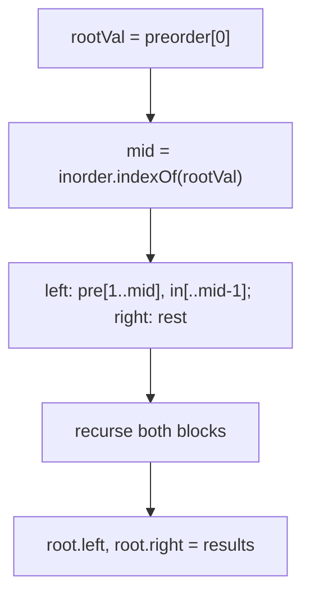
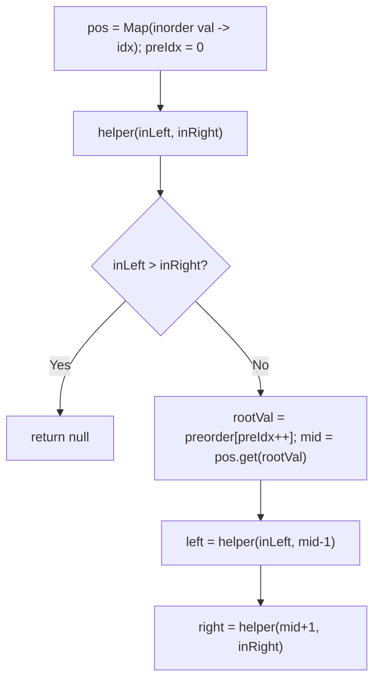
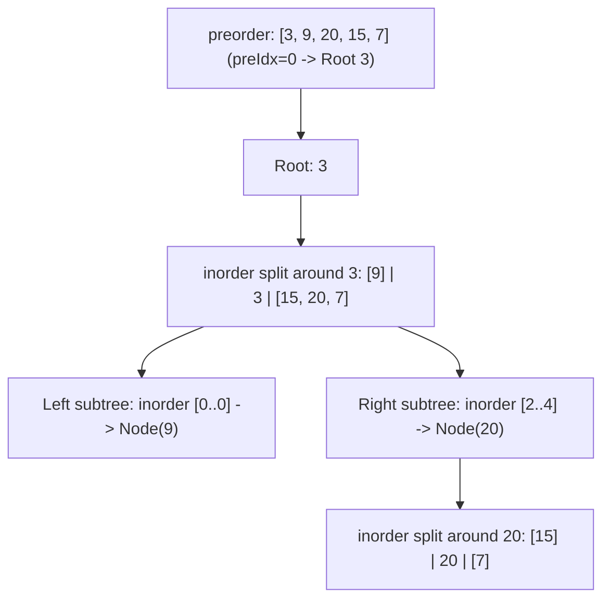

# 105. Construct Binary Tree from Preorder and Inorder Traversal

- **LeetCode Link**: `https://leetcode.com/problems/construct-binary-tree-from-preorder-and-inorder-traversal/`
- **Difficulty**: Medium
- **Pattern Category**: Binary Tree / Traversal Partition Reconstruction
- **Prerequisite Primer**: `00-foundations/03-core-algorithmic-patterns.md`

---

## 1. Problem Overview & Edge Case Matrix

### Problem Statement
Given two integer arrays `preorder` and `inorder` where `preorder` is the preorder traversal of a binary tree and `inorder` is the inorder traversal of the same tree, construct and return the binary tree. Values are unique.

```
Example 1:
Input: preorder = [3,9,20,15,7], inorder = [9,3,15,20,7]
Output: [3,9,20,null,null,15,7]

Example 2:
Input: preorder = [-1], inorder = [-1]
Output: [-1]
```

### Visual Problem Representation
```
preorder  = [3 | 9 | 20,15,7]     (root first, then left block, right block)
inorder   = [9 | 3 | 15,20,7]     (left block, root, right block)
                 3
                / \
               9   20
                  / \
                 15  7
```

### Upfront Edge Case Matrix
| Edge Case Category | Specific Input Scenario | Expected Behavior | Pitfall / Risk |
| :--- | :--- | :--- | :--- |
| Empty / Nil | Both `[]` | Return `null` | Slice of empty + indexOf(-1) |
| Single Element | `[-1]`, `[-1]` | Single node | Range recursion with `left > right` |
| Left-skewed | `pre=[3,2,1]`, `in=[1,2,3]` | Chain left | Right-block bounds off by one |
| Right-skewed | `pre=[1,2,3]`, `in=[1,2,3]` | Chain right | Left-block empty handling |
| Duplicate values | Not per spec (unique guaranteed) | Undefined | `indexOf`/map finds first match only |

---

## 2. Level 1: Brute Force Approach

### Intuition & Visual Idea
Preorder's first element is the root; its position in inorder (`indexOf` scan) splits both arrays into left/right blocks; recurse with sliced copies. Direct transliteration of the definition — $O(N^2)$ from rescanning plus $O(N^2)$ slice copying.



### Pseudocode
```text
FUNCTION buildTreeBruteForce(preorder, inorder):
    IF preorder EMPTY: RETURN NULL
    rootVal = preorder[0]; mid = inorder.INDEXOF(rootVal)
    root = TreeNode(rootVal)
    root.left = buildTreeBruteForce(preorder[1 .. mid], inorder[.. mid-1])
    root.right = buildTreeBruteForce(preorder[mid+1 ..], inorder[mid+1 ..])
    RETURN root
```

### Step-by-Step Dry Run (Visual Trace)
| Step | Iteration / Pointer ($i, j$) | Current Value | State / Sub-array | Action Taken |
| :--- | :--- | :--- | :--- | :--- |
| 0 | root `3` | `mid = 1` in inorder | Left `pre=[9]`, right `pre=[20,15,7]` | Split + recurse |
| 1 | root `9` | `mid = 0` | Left empty → null | Leaf built |
| 2 | root `20` | `mid = 1` in `[15,20,7]` | Left `[15]`, right `[7]` | Split + recurse |
| 3 | leaves `15`, `7` | — | Attached under `20` | Return `[3,9,20,null,null,15,7]` |

### Modern JavaScript Implementation
```javascript
/**
 * Shared backbone: LeetCode provides TreeNode; defined once here so every
 * level below is locally runnable when concatenated (Level 1 + 2 + 3).
 * Time Complexity:  n/a (scaffolding)
 * Space Complexity: n/a (scaffolding)
 */
class TreeNode {
  constructor(val, left = null, right = null) {
    this.val = val;
    this.left = left;
    this.right = right;
  }
}

function arrayToTree(arr) {
  if (arr.length === 0 || arr[0] === null || arr[0] === undefined) return null;
  const root = new TreeNode(arr[0]);
  const queue = [root];
  let i = 1;
  while (i < arr.length) {
    const node = queue.shift();
    if (i < arr.length && arr[i] !== null && arr[i] !== undefined) {
      node.left = new TreeNode(arr[i]);
      queue.push(node.left);
    }
    i++;
    if (i < arr.length && arr[i] !== null && arr[i] !== undefined) {
      node.right = new TreeNode(arr[i]);
      queue.push(node.right);
    }
    i++;
  }
  return root;
}

function treeToArray(root) {
  if (root === null) return [];
  const out = [];
  const queue = [root];
  while (queue.length > 0) {
    const node = queue.shift();
    if (node === null) {
      out.push(null);
    } else {
      out.push(node.val);
      queue.push(node.left, node.right);
    }
  }
  while (out.length > 0 && out[out.length - 1] === null) out.pop();
  return out;
}

/**
 * Level 1: Brute Force (indexOf scan + array slices)
 * Time Complexity:  O(N^2) — linear scan plus slice copies per level
 * Space Complexity: O(N^2) worst case — slice copies at every level
 */
function buildTreeBruteForce(preorder, inorder) {
  if (preorder.length === 0) return null;
  const rootVal = preorder[0];
  // Linear scan: the O(N) bottleneck repeated at every recursion level.
  const mid = inorder.indexOf(rootVal);
  const root = new TreeNode(rootVal);
  // Slice boundaries: left block has exactly mid elements in BOTH arrays.
  root.left = buildTreeBruteForce(preorder.slice(1, mid + 1), inorder.slice(0, mid));
  root.right = buildTreeBruteForce(preorder.slice(mid + 1), inorder.slice(mid + 1));
  return root;
}
```

### Complexity Breakdown
- **Time Complexity**: $O(N^2)$ — `indexOf` scan plus two `slice` copies per node.
- **Space Complexity**: $O(N^2)$ worst case — slice garbage at every level (skewed trees).

---

## 3. Level 2: Optimized Approach

### Intuition & Visual Bottleneck Elimination
Kill both costs: a value→index `Map` makes root lookup $O(1)$, and index ranges over the ORIGINAL arrays replace slicing. A shared `preIdx` cursor walks preorder in order while recursion consumes inorder ranges — $O(N)$ time, $O(N)$ map space.



### Pseudocode
```text
FUNCTION buildTreeMap(preorder, inorder):
    pos = MAP(val -> idx OVER inorder); preIdx = 0
    DEFINE helper(inLeft, inRight):
        IF inLeft > inRight: RETURN NULL
        rootVal = preorder[preIdx++]; mid = pos.GET(rootVal)
        root = TreeNode(rootVal)
        root.left = helper(inLeft, mid - 1)
        root.right = helper(mid + 1, inRight)
        RETURN root
    RETURN helper(0, inorder.LENGTH - 1)
```

### Step-by-Step Dry Run (Visual Trace)
| Step | Pointers / Window | Hash Map / Auxiliary State | Decision Logic | Output Accumulator |
| :--- | :--- | :--- | :--- | :--- |
| 0 | `preIdx=0`, range `[0,4]` | `pos(3)=1` | Root `3`, left `[0,0]`, right `[2,4]` | Node `3` |
| 1 | `preIdx=1`, range `[0,0]` | `pos(9)=0` | Leaf `9`, both ranges empty | `3.left = 9` |
| 2 | `preIdx=2`, range `[2,4]` | `pos(20)=3` | Root `20` | `3.right = 20` |
| 3 | ranges `[2,2]`, `[4,4]` | `pos(15)=2`, `pos(7)=4` | Leaves `15`, `7` | Tree complete |

### Modern JavaScript Implementation
```javascript
/**
 * Level 2: Optimized (index map + range recursion, no slices)
 * Time Complexity:  O(N) — O(1) lookup per node, ranges are free
 * Space Complexity: O(N) — map plus call stack
 */
// TreeNode shared from Level 1.
function buildTreeMap(preorder, inorder) {
  // O(1) root positioning: the entire Level 1 bottleneck, removed once.
  const pos = new Map(inorder.map((v, i) => [v, i]));
  let preIdx = 0; // cursor walks preorder in exact consumption order
  function helper(inLeft, inRight) {
    if (inLeft > inRight) return null; // empty block: no node here
    const rootVal = preorder[preIdx++];
    const mid = pos.get(rootVal);
    const root = new TreeNode(rootVal);
    // LEFT before RIGHT: preorder consumption order must match.
    root.left = helper(inLeft, mid - 1);
    root.right = helper(mid + 1, inRight);
    return root;
  }
  return helper(0, inorder.length - 1);
}
```

### Complexity Breakdown
- **Time Complexity**: $O(N)$ — constant work per node.
- **Space Complexity**: $O(N)$ — map plus $O(H)$ call stack; recursion depth is the remaining risk.

---

## 4. Level 3: Most Optimal / Canonical Approach

### Intuition & Mathematical / Invariant Proof
Same $O(N)$ bounds, zero recursion: process preorder left-to-right with an explicit stack tracking the current left spine. Invariant: the stack holds the path from root to the last-attached node, and `inIdx` marks how much of inorder's left edge is consumed. If the stack top isn't the next inorder value, the new node is a left child; otherwise pop up past the completed left spine and attach as a right child. Stack depth replaces call depth — skewed inputs can't overflow V8.

```
pre=[3,9,20,15,7], in=[9,3,15,20,7]:
  9: top 3 != in[0]=9 -> 3.left = 9, push       stack [3,9]
  20: top 9 == in[0]=9 -> pop 9 (inIdx 1), top 3 == in[1]=3 -> pop 3 (inIdx 2);
      top empty -> 3.right = 20, push            stack [20]
  15: top 20 != in[2]=15 -> 20.left = 15, push  stack [20,15]
  7: top 15 == in[2] -> pop (inIdx 3); top 20 == in[3] -> pop (inIdx 4);
     20.right = 7, push                          stack [7]
```

### Pseudocode
```text
FUNCTION buildTree(preorder, inorder):
    IF preorder EMPTY: RETURN NULL
    root = TreeNode(preorder[0]); stack = [root]; inIdx = 0
    FOR i = 1 .. preorder.LENGTH - 1:
        node = TreeNode(preorder[i])
        IF stack.TOP.val != inorder[inIdx]:
            stack.TOP.left = node; stack.PUSH(node)
        ELSE:
            parent = NULL
            WHILE stack NOT EMPTY AND stack.TOP.val == inorder[inIdx]:
                parent = stack.POP(); inIdx++
            parent.right = node; stack.PUSH(node)
    RETURN root
```

### Step-by-Step Dry Run (Visual Trace)
| Step | Pointer $L$ | Pointer $R$ | Invariant Checked | In-Place State |
| :--- | :--- | :--- | :--- | :--- |
| 1 | `pre=9` | `in[0]=9` | Top `3 ≠ 9`: left child | `3.left = 9`, push |
| 2 | `pre=20` | `in[0]=9` | Top `9 == 9`: pop ×2 to `in=2` | `3.right = 20`, push |
| 3 | `pre=15` | `in[2]=15` | Top `20 ≠ 15`: left child | `20.left = 15`, push |
| 4 | `pre=7` | `in[2]=15` | Pop ×2 to `in=4` | `20.right = 7` |

### Modern JavaScript Implementation
```javascript
/**
 * Level 3: Most Optimal / Canonical (iterative spine stack)
 * Time Complexity:  O(N) — each node pushed/popped once
 * Space Complexity: O(N) — stack + output; zero call-stack risk
 */
// TreeNode shared from Level 1.
function buildTree(preorder, inorder) {
  if (preorder.length === 0) return null;
  const root = new TreeNode(preorder[0]);
  const stack = [root]; // live left spine, top = last-attached node
  let inIdx = 0; // consumed prefix of inorder's left edge
  for (let i = 1; i < preorder.length; i++) {
    const node = new TreeNode(preorder[i]);
    if (stack[stack.length - 1].val !== inorder[inIdx]) {
      // Still descending left: attach and extend the spine.
      stack[stack.length - 1].left = node;
      stack.push(node);
    } else {
      // Left spine complete: pop to the turn point, attach right.
      let parent = null;
      while (stack.length > 0 && stack[stack.length - 1].val === inorder[inIdx]) {
        parent = stack.pop();
        inIdx++;
      }
      parent.right = node;
      stack.push(node);
    }
  }
  return root;
}
```

### Complexity Breakdown
- **Time Complexity**: $O(N)$ — optimal lower bound; each array element is consumed once.
- **Space Complexity**: $O(N)$ — explicit stack replaces the call stack; skewed inputs are safe where recursion overflows.

---

## 5. JavaScript-Specific Gotchas & V8 Optimizations
- **GC Pressure**: Avoid allocating objects inside tight loops ($O(N)$ closures). Level 1's per-level `slice` pairs are the pressure removed — Level 3 allocates exactly $N$ result nodes and nothing else.
- **Type Coercion / Sorting**: `Map` with numeric keys uses SameValueZero — safe for the guaranteed-unique integers; `indexOf` in Level 1 returns `-1` on missing values, and `slice(1, 0)` silently yields `[]` (masking corrupt input instead of throwing — validate at the boundary in production).
- **Index Bounds**: `preIdx++` must fire exactly once per created node and left-before-right ordering is mandatory — swapping the recursive calls consumes preorder out of order and builds a wrong tree that still "looks" plausible.

---

## 6. Real-World MAANG Interview Follow-Ups & Extensions

### Follow-Up 1: Postorder + inorder, and preorder + postorder ambiguity
- **Scenario**: Build from inorder+postorder (LeetCode 106, next file), or preorder+postorder (ambiguous for single-child nodes).
- **Solution Strategy**: Postorder variant mirrors Level 2 with the root consumed from the END and right-before-left recursion; pre+post needs a full-binary assumption or returns any valid tree.
- **JS Code / Implementation Pattern**:
```javascript
function buildFromInPost(inorder, postorder) {
  return buildTreeInPost(inorder, postorder); // next guide's Level 3
}
```

### Follow-Up 2: $10^9$-node traversals that never fit in memory
- **Scenario**: Traversal arrays stream from disk; the tree must stream out too.
- **Solution Strategy**: External-memory partition: stream inorder once to locate the root split (one targeted scan per level is $O(N)$ I/O per level — acceptable for shallow trees); for skewed data, fall back to the iterative Level 3 over memory-mapped arrays.
- **JS Code / Implementation Pattern**:
```javascript
async function buildStreamed(preStream, inArray) {
  // inArray memory-mapped; preStream consumed once in order
  return buildTreeIterative(preStream, inArray);
}
```

### Follow-Up 3: Validation — do these traversals describe ANY valid tree?
- **Scenario & In-Depth Solution**: Inputs may be corrupt (mismatched sets, duplicate values). Validate first: equal lengths, identical value sets, and every recursive partition non-degenerate (`mid !== -1`); Level 1's `indexOf === -1` is the natural detector — throw instead of building garbage.
```javascript
function validateTraversals(preorder, inorder) {
  if (preorder.length !== inorder.length) throw new Error('length mismatch');
  const pre = new Set(preorder), ino = new Set(inorder);
  if (pre.size !== preorder.length || ino.size !== inorder.length) throw new Error('duplicates');
  for (const v of pre) if (!ino.has(v)) throw new Error('value set mismatch');
}
```

---

## 7. What LeetCode Discuss Says (Language-Independent)

Source: top-voted post by Pradhuman Gupta —
`https://leetcode.com/problems/construct-binary-tree-from-preorder-and-inorder-traversal/solutions/7017307/beats-9589-beginner-friendly-solution-ja-ep33/`
— 21.2K views.
Language-independent summary. No new JS here.

### A. Optimal way from Discuss (HashMap Indexing + Monotonic Preorder Cursor)

Reconstructing a binary tree from preorder and inorder traversals relies on two complementary properties:

1. **Root Identification:** The current root is always the next unused element in `preorder` (traversed from left to right: Root -> Left -> Right).
2. **Subtree Partitioning:** In `inorder`, all nodes to the left of the root index belong to its left subtree; all nodes to the right belong to its right subtree.
3. **O(1) Map Acceleration:** Precompute a hash map mapping each node value to its index in `inorder`.
4. **Recursive Step:**
   - Consume `preorder[preIdx++]` as `rootVal`.
   - Find its partition index `mid = inMap[rootVal]`.
   - Recursively construct `root.left` over inorder range `[inStart, mid - 1]`.
   - Recursively construct `root.right` over inorder range `[mid + 1, inEnd]`.

```text
FUNCTION buildTree(preorder, inorder):
    inMap = new HashMap()
    FOR i FROM 0 TO length(inorder) - 1:
        inMap.put(inorder[i], i)

    preIdx = 0

    FUNCTION helper(inStart, inEnd):
        IF inStart > inEnd:
            RETURN null

        rootVal = preorder[preIdx]
        preIdx = preIdx + 1
        root = new TreeNode(rootVal)

        mid = inMap.get(rootVal)

        // Must construct left subtree before right subtree due to preorder sequence
        root.left = helper(inStart, mid - 1)
        root.right = helper(mid + 1, inEnd)

        RETURN root

    RETURN helper(0, length(inorder) - 1)
```

- Time: O(N) where N is the number of nodes; building the map takes O(N), and each node is processed once in O(1).
- Space: O(N) auxiliary space for the hash map and recursion call stack.



### B. Dry run on LeetCode Example 1 (`preorder = [3,9,20,15,7], inorder = [9,3,15,20,7]`)

- `inMap`: `{9: 0, 3: 1, 15: 2, 20: 3, 7: 4}`
- Call `helper(0, 4)`:
  - `rootVal = preorder[0] = 3`, `mid = inMap[3] = 1`.
  - Recurse left: `helper(0, 0)`:
    - `rootVal = preorder[1] = 9`, `mid = inMap[9] = 0`.
    - Left & right child calls have `inStart > inEnd` -> return `null`.
    - Returns `Node(9)`.
  - Recurse right: `helper(2, 4)`:
    - `rootVal = preorder[2] = 20`, `mid = inMap[20] = 3`.
    - Left `helper(2, 2)` -> returns `Node(15)`.
    - Right `helper(4, 4)` -> returns `Node(7)`.
    - Returns `Node(20)` with left=15, right=7.
- Root 3 attaches left=9, right=20.

Result: Tree matches Example 1.

### C. Why Inorder HashMap Lookup Beats Subarray Slicing

- **Eliminating Slicing Overhead:** Python `list[start:end]` or JavaScript `slice()` allocates new arrays at each node, triggering $O(N^2)$ aggregate time and heavy memory copying.
- Index pointers (`inStart`, `inEnd`) combined with an $O(1)$ hash map lookup operate strictly in-place with zero subarray allocations.

### D. Pitfalls from comments

- **Reversing child recursion order:** Since `preorder` follows `Root -> Left -> Right`, invoking `helper(mid + 1, inEnd)` before `helper(inStart, mid - 1)` consumes the wrong elements for the right subtree! Left must always be constructed first.
- **Duplicate elements assumption:** The hash map lookup requires all node values in the tree to be strictly unique. If duplicates exist, multiple candidate indices arise.

### E. Companies

- Discuss post itself names none.
  Companies tab on LeetCode is premium-locked.
- External source:
  `https://github.com/liquidslr/leetcode-company-wise-problems`
  (LeetCode company tags, updated June 2025).
- All-time (33): Amazon, Apple, Bloomberg, Cisco, Google, Meta, Microsoft, Oracle, Uber, etc.
- Recent: 30 days — None.
- Recent: 3 months — Amazon, Google.
