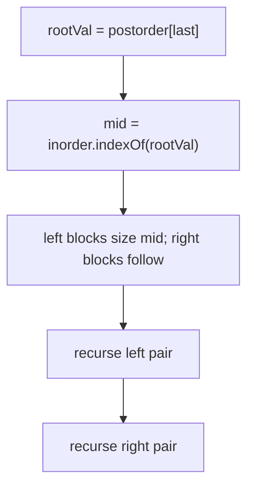
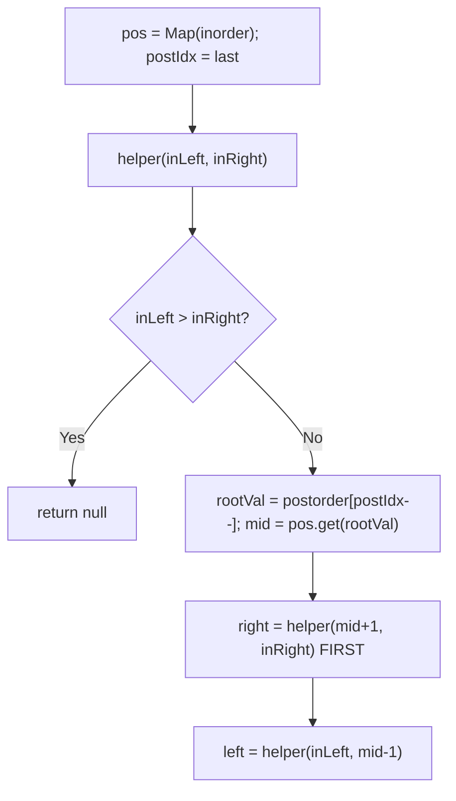
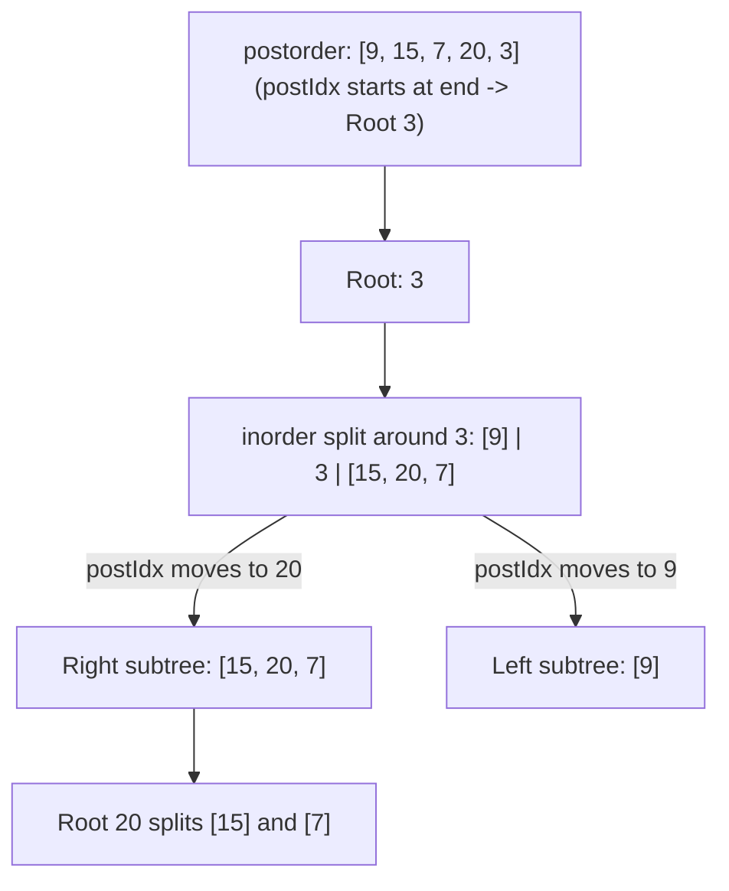

# 106. Construct Binary Tree from Inorder and Postorder Traversal

- **LeetCode Link**: `https://leetcode.com/problems/construct-binary-tree-from-inorder-and-postorder-traversal/`
- **Difficulty**: Medium
- **Pattern Category**: Binary Tree / Traversal Partition Reconstruction
- **Prerequisite Primer**: `00-foundations/03-core-algorithmic-patterns.md`

---

## 1. Problem Overview & Edge Case Matrix

### Problem Statement
Given two integer arrays `inorder` and `postorder` where `inorder` is the inorder traversal of a binary tree and `postorder` is the postorder traversal of the same tree, construct and return the binary tree. Values are unique.

```
Example 1:
Input: inorder = [9,3,15,20,7], postorder = [9,15,7,20,3]
Output: [3,9,20,null,null,15,7]

Example 2:
Input: inorder = [-1], postorder = [-1]
Output: [-1]
```

### Visual Problem Representation
```
inorder    = [9 | 3 | 15,20,7]    (left block, root, right block)
postorder  = [9 | 15,7,20 | 3]    (left block, right block, root LAST)
                  3
                 / \
                9   20
                   / \
                  15  7
```

### Upfront Edge Case Matrix
| Edge Case Category | Specific Input Scenario | Expected Behavior | Pitfall / Risk |
| :--- | :--- | :--- | :--- |
| Empty / Nil | Both `[]` | Return `null` | End-cursor underflow |
| Single Element | `[-1]`, `[-1]` | Single node | Range base case with `left > right` |
| Left-skewed | `in=[1,2,3]`, `post=[1,2,3]` | Chain left | Right-first order still required |
| Right-skewed | `in=[3,2,1]`, `post=[3,2,1]` | Chain right | Left-block empty bounds |
| Duplicate values | Not per spec (unique guaranteed) | Undefined | Map keeps last index only |

---

## 2. Level 1: Brute Force Approach

### Intuition & Visual Idea
Postorder's LAST element is the root; its inorder position splits both arrays; recurse with slices — right subtree's postorder block ends just before the root. Mirror of the preorder variant, same $O(N^2)$ profile.



### Pseudocode
```text
FUNCTION buildTreeBruteForce(inorder, postorder):
    IF inorder EMPTY: RETURN NULL
    rootVal = postorder[LAST]; mid = inorder.INDEXOF(rootVal)
    root = TreeNode(rootVal)
    root.left = buildTreeBruteForce(inorder[.. mid-1], postorder[.. mid-1])
    root.right = buildTreeBruteForce(inorder[mid+1 ..], postorder[mid .. LAST-1])
    RETURN root
```

### Step-by-Step Dry Run (Visual Trace)
| Step | Iteration / Pointer ($i, j$) | Current Value | State / Sub-array | Action Taken |
| :--- | :--- | :--- | :--- | :--- |
| 0 | root `3` (postorder last) | `mid = 1` | Left `in=[9]`, right `in=[15,20,7]` | Split + recurse |
| 1 | left: root `9` | single | Leaf | Attached left of `3` |
| 2 | right: root `20` (post last of block) | `mid = 1` in block | Left `[15]`, right `[7]` | Split + recurse |
| 3 | leaves | — | — | Return `[3,9,20,null,null,15,7]` |

### Modern JavaScript Implementation
```javascript
/**
 * Shared backbone: LeetCode provides TreeNode; defined once here so every
 * level below is locally runnable when concatenated (Level 1 + 2 + 3).
 * Time Complexity:  n/a (scaffolding)
 * Space Complexity: n/a (scaffolding)
 */
class TreeNode {
  constructor(val, left = null, right = null) {
    this.val = val;
    this.left = left;
    this.right = right;
  }
}

function arrayToTree(arr) {
  if (arr.length === 0 || arr[0] === null || arr[0] === undefined) return null;
  const root = new TreeNode(arr[0]);
  const queue = [root];
  let i = 1;
  while (i < arr.length) {
    const node = queue.shift();
    if (i < arr.length && arr[i] !== null && arr[i] !== undefined) {
      node.left = new TreeNode(arr[i]);
      queue.push(node.left);
    }
    i++;
    if (i < arr.length && arr[i] !== null && arr[i] !== undefined) {
      node.right = new TreeNode(arr[i]);
      queue.push(node.right);
    }
    i++;
  }
  return root;
}

function treeToArray(root) {
  if (root === null) return [];
  const out = [];
  const queue = [root];
  while (queue.length > 0) {
    const node = queue.shift();
    if (node === null) {
      out.push(null);
    } else {
      out.push(node.val);
      queue.push(node.left, node.right);
    }
  }
  while (out.length > 0 && out[out.length - 1] === null) out.pop();
  return out;
}

/**
 * Level 1: Brute Force (indexOf scan + array slices)
 * Time Complexity:  O(N^2) — linear scan plus slice copies per level
 * Space Complexity: O(N^2) worst case — slice garbage at every level
 */
function buildTreeBruteForce(inorder, postorder) {
  if (inorder.length === 0) return null;
  const rootVal = postorder[postorder.length - 1]; // postorder root is LAST
  const mid = inorder.indexOf(rootVal);
  const root = new TreeNode(rootVal);
  // Left postorder block: first mid elements; right block: the rest minus root.
  root.left = buildTreeBruteForce(inorder.slice(0, mid), postorder.slice(0, mid));
  root.right = buildTreeBruteForce(inorder.slice(mid + 1), postorder.slice(mid, postorder.length - 1));
  return root;
}
```

### Complexity Breakdown
- **Time Complexity**: $O(N^2)$ — scan plus slices per node.
- **Space Complexity**: $O(N^2)$ worst case — same slice garbage as the preorder variant.

---

## 3. Level 2: Optimized Approach

### Intuition & Visual Bottleneck Elimination
Map + ranges again, but the cursor consumes postorder from the END and recursion builds RIGHT before LEFT (postorder's reversed consumption order). One reversed insight; everything else mirrors the preorder Level 2.



### Pseudocode
```text
FUNCTION buildTreeMap(inorder, postorder):
    pos = MAP(val -> idx OVER inorder); postIdx = postorder.LENGTH - 1
    DEFINE helper(inLeft, inRight):
        IF inLeft > inRight: RETURN NULL
        rootVal = postorder[postIdx--]; mid = pos.GET(rootVal)
        root = TreeNode(rootVal)
        root.right = helper(mid + 1, inRight)   // RIGHT FIRST
        root.left = helper(inLeft, mid - 1)
        RETURN root
    RETURN helper(0, inorder.LENGTH - 1)
```

### Step-by-Step Dry Run (Visual Trace)
| Step | Pointers / Window | Hash Map / Auxiliary State | Decision Logic | Output Accumulator |
| :--- | :--- | :--- | :--- | :--- |
| 0 | `postIdx=4`, range `[0,4]` | `pos(3)=1` | Root `3` | Right `[2,4]`, left `[0,0]` |
| 1 | `postIdx=3`, range `[2,4]` | `pos(20)=3` | Root `20` (right first!) | Right `[4,4]`, left `[2,2]` |
| 2 | `postIdx=2`, range `[4,4]` | `pos(7)=4` | Leaf `7` | `20.right = 7` |
| 3 | unwind | ranges `[2,2]`, `[0,0]` | Leaves `15`, `9` | Tree complete |

### Modern JavaScript Implementation
```javascript
/**
 * Level 2: Optimized (index map + reversed cursor)
 * Time Complexity:  O(N) — O(1) lookup per node
 * Space Complexity: O(N) — map plus call stack
 */
// TreeNode shared from Level 1.
function buildTreeMap(inorder, postorder) {
  const pos = new Map(inorder.map((v, i) => [v, i]));
  let postIdx = postorder.length - 1; // cursor consumes roots from the END
  function helper(inLeft, inRight) {
    if (inLeft > inRight) return null;
    const rootVal = postorder[postIdx--];
    const mid = pos.get(rootVal);
    const root = new TreeNode(rootVal);
    // RIGHT BEFORE LEFT: reversed postorder visits right subtrees first.
    root.right = helper(mid + 1, inRight);
    root.left = helper(inLeft, mid - 1);
    return root;
  }
  return helper(0, inorder.length - 1);
}
```

### Complexity Breakdown
- **Time Complexity**: $O(N)$ — constant work per node.
- **Space Complexity**: $O(N)$ — map plus $O(H)$ call stack.

---

## 4. Level 3: Most Optimal / Canonical Approach

### Intuition & Mathematical / Invariant Proof
Iterative mirror of the preorder Level 3: reversed postorder behaves like preorder with left/right swapped, so the same spine-stack algorithm applies — descending RIGHT spines, popping at inorder's right edge from the end. Invariant: stack holds the live right spine; `inIdx` (from the right) marks consumed inorder suffix. Same $O(N)$ bounds, zero recursion.

```
in=[9,3,15,20,7], post=[9,15,7,20,3], roots consumed right-to-left: 3,20,7,15,9
  20: top 3 != in[4]=7 -> 3.right = 20, push        stack [3,20]
  7:  top 20 != 7 -> 20.right = 7, push             stack [3,20,7]
  15: top 7 == in[4]=7 -> pop 7 (idx 3); top 20 == in[3]=20 -> pop (idx 2);
      top 3 != in[2]=15 -> 20.left = 15, push       stack [3,15]
  9:  top 15 == in[2]=15 -> pop (idx 1); top 3 == in[1]=3 -> pop (idx 0);
      stack empty -> 3.left = 9, push               stack [9]
```

### Pseudocode
```text
FUNCTION buildTree(inorder, postorder):
    IF postorder EMPTY: RETURN NULL
    root = TreeNode(postorder[LAST]); stack = [root]; inIdx = inorder.LENGTH - 1
    FOR i = postorder.LENGTH - 2 DOWNTO 0:
        node = TreeNode(postorder[i])
        IF stack.TOP.val != inorder[inIdx]:
            stack.TOP.right = node; stack.PUSH(node)
        ELSE:
            parent = NULL
            WHILE stack NOT EMPTY AND stack.TOP.val == inorder[inIdx]:
                parent = stack.POP(); inIdx--
            parent.left = node; stack.PUSH(node)
    RETURN root
```

### Step-by-Step Dry Run (Visual Trace)
| Step | Pointer $L$ | Pointer $R$ | Invariant Checked | In-Place State |
| :--- | :--- | :--- | :--- | :--- |
| 1 | root `3` | `inIdx=4` (`in[4]=7`) | Setup | `stack=[3]` |
| 2 | `post=20` | `3 ≠ 7`: right child | Right spine extends | `3.right=20`, push |
| 3 | `post=7` | `20 ≠ 7`: right child | Right spine extends | `20.right=7`, push |
| 4 | `post=15` | `7==7`: pop 7,20 → `inIdx=2` | Turn point `parent=20` | `20.left=15`, push |
| 5 | `post=9` | `15==15`: pop 15,3 → `inIdx=0` | Turn point `parent=3` | `3.left=9` |

### Modern JavaScript Implementation
```javascript
/**
 * Level 3: Most Optimal / Canonical (iterative right-spine stack)
 * Time Complexity:  O(N) — each node pushed/popped once
 * Space Complexity: O(N) — stack + output; zero call-stack risk
 */
// TreeNode shared from Level 1.
function buildTree(inorder, postorder) {
  if (postorder.length === 0) return null;
  const root = new TreeNode(postorder[postorder.length - 1]);
  const stack = [root]; // live right spine, top = last-attached node
  let inIdx = inorder.length - 1; // consumed suffix of inorder, from the right
  for (let i = postorder.length - 2; i >= 0; i--) {
    const node = new TreeNode(postorder[i]);
    if (stack[stack.length - 1].val !== inorder[inIdx]) {
      // Still descending right: attach and extend the spine.
      stack[stack.length - 1].right = node;
      stack.push(node);
    } else {
      // Right spine complete: pop to the turn point, attach left.
      let parent = null;
      while (stack.length > 0 && stack[stack.length - 1].val === inorder[inIdx]) {
        parent = stack.pop();
        inIdx--;
      }
      parent.left = node;
      stack.push(node);
    }
  }
  return root;
}
```

### Complexity Breakdown
- **Time Complexity**: $O(N)$ — optimal lower bound; each element consumed once.
- **Space Complexity**: $O(N)$ — explicit stack replaces the call stack; skewed inputs are safe.

---

## 5. JavaScript-Specific Gotchas & V8 Optimizations
- **GC Pressure**: Avoid allocating objects inside tight loops ($O(N)$ closures). Level 1's per-level slice pairs are the pressure removed — Level 3 allocates exactly $N$ result nodes.
- **Type Coercion / Sorting**: `Map` lookups on numeric keys are exact; Level 1's `indexOf` returns `-1` for corrupt input and `slice(0, -1)` then silently drops the last element — validate traversal sets at the boundary (see Follow-Up 3 of the preorder guide).
- **Index Bounds**: RIGHT-before-LEFT recursion order in Level 2 is mandatory — building left first consumes the reversed cursor out of order and silently mirrors subtrees. The iterative Level 3 encodes the same constraint as right-spine descent.

---

## 6. Real-World MAANG Interview Follow-Ups & Extensions

### Follow-Up 1: Build from preorder + postorder (single-child ambiguity)
- **Scenario**: Only preorder and postorder given; single-child nodes are ambiguous (left vs right unknowable).
- **Solution Strategy**: Assume full binary tree (every node has 0 or 2 children): the second preorder element is the left-subtree root; its postorder position sizes the left block. Document the assumption.
- **JS Code / Implementation Pattern**:
```javascript
function buildFromPrePost(pre, post) {
  // Full-binary-tree assumption: pre[1] roots the left block.
  const leftSize = post.indexOf(pre[1]) + 1;
  return assemble(pre, post, leftSize);
}
```

### Follow-Up 2: Serialized level-order with nulls (the harness format)
- **Scenario**: Input arrives as `arrayToTree`-style level arrays instead of traversals.
- **Solution Strategy**: Skip reconstruction entirely — level order with null markers builds directly in one queue pass (the shared backbone helper). Know when NOT to use traversal reconstruction.
- **JS Code / Implementation Pattern**:
```javascript
function buildFromLevelOrder(arr) {
  return arrayToTree(arr); // one pass, no partition logic needed
}
```

### Follow-Up 3: $10^9$-node traversals with external memory
- **Scenario & In-Depth Solution**: Arrays never fit in RAM. Partition recursively with file-backed ranges (offsets, not slices — Level 2's range idea generalizes to disk offsets); the index map becomes an external B-tree or sort-merge join. Same algorithm, block-device addressing.
```javascript
async function buildExternal(inFile, postFile, inLeft, inRight, postIdx) {
  const rootVal = await readAt(postFile, postIdx);
  const mid = await btreeLookup(inFile, rootVal);
  // recurse with file offsets; materialize only the output tree path
  return assembleFromDisk(rootVal, mid, inLeft, inRight);
}
```

---

## 7. What LeetCode Discuss Says (Language-Independent)

Source: top-voted post by Vikas Pathak —
`https://leetcode.com/problems/construct-binary-tree-from-inorder-and-postorder-traversal/solutions/3302159/easy-solutions-in-java-python-and-c-look-71ia/`
— 48.6K views.
Language-independent summary. No new JS here.

### A. Optimal way from Discuss (Reverse Postorder Cursor + Right-First Descent)

Reconstruction from `inorder` and `postorder` reverses the preorder paradigm:

1. **Root Extraction from End:** In postorder traversal (`Left -> Right -> Root`), the root of any subtree is always its last element.
2. **Reverse Traversal Order:** Decrementing a cursor `postIdx` from `length - 1` down to 0 processes nodes in the exact order: **`Root -> Right -> Left`**.
3. **Inorder Partitioning:** Look up the root value in an `inorder` hash map to locate index `mid`.
   - `[inStart, mid - 1]` contains the left subtree.
   - `[mid + 1, inEnd]` contains the right subtree.
4. **Execution Invariant:** Because the backward cursor visits the right subtree first, **we must recursively build `root.right` before `root.left`**.

```text
FUNCTION buildTree(inorder, postorder):
    inMap = new HashMap()
    FOR i FROM 0 TO length(inorder) - 1:
        inMap.put(inorder[i], i)

    postIdx = length(postorder) - 1

    FUNCTION helper(inStart, inEnd):
        IF inStart > inEnd:
            RETURN null

        rootVal = postorder[postIdx]
        postIdx = postIdx - 1
        root = new TreeNode(rootVal)

        mid = inMap.get(rootVal)

        // CRUCIAL: Must build RIGHT subtree before LEFT subtree
        root.right = helper(mid + 1, inEnd)
        root.left = helper(inStart, mid - 1)

        RETURN root

    RETURN helper(0, length(inorder) - 1)
```

- Time: O(N) where N is total nodes, visiting each node once with O(1) map lookups.
- Space: O(N) auxiliary space for the hash map and recursive call stack.



### B. Dry run on LeetCode Example 1 (`inorder = [9,3,15,20,7], postorder = [9,15,7,20,3]`)

- Map: `{9:0, 3:1, 15:2, 20:3, 7:4}`, `postIdx = 4`.
- Call `helper(0, 4)`:
  - `rootVal = postorder[4] = 3`, `postIdx = 3`, `mid = 1`.
  - Build `root.right` via `helper(2, 4)`:
    - `rootVal = postorder[3] = 20`, `postIdx = 2`, `mid = 3`.
    - Build right child: `helper(4, 4)` -> `rootVal = postorder[2] = 7`, `postIdx = 1`, returns `Node(7)`.
    - Build left child: `helper(2, 2)` -> `rootVal = postorder[1] = 15`, `postIdx = 0`, returns `Node(15)`.
    - Returns `Node(20)` with left=15, right=7.
  - Build `root.left` via `helper(0, 0)`:
    - `rootVal = postorder[0] = 9`, `postIdx = -1`, returns `Node(9)`.
- Root 3 attaches left=9, right=20.

Result: Perfectly reconstructed tree.

### C. Why Right-Subtree-First Recursion is Non-Negotiable

- **The Order Inversion:** In postorder, the sequence is `... Left Subtree ... Right Subtree ... Root`.
- Step backwards from `Root`: you immediately enter the nodes of the **Right Subtree**.
- If you call `root.left = helper(...)` first, the left subtree builder will consume the right subtree's root and children from `postorder`, corrupting the entire tree.

### D. Pitfalls from comments

- **Calling Left before Right:** The most frequent bug across Discuss submissions. When consuming postorder from right to left, the right child must always be recurred on first.
- **Subarray copying:** Passing array slices (`postorder[0..mid]`) degrades runtime to $O(N^2)$ due to repetitive array allocations.

### E. Companies

- Discuss post itself names none.
  Companies tab on LeetCode is premium-locked.
- External source:
  `https://github.com/liquidslr/leetcode-company-wise-problems`
  (LeetCode company tags, updated June 2025).
- All-time (17): Amazon, Apple, Bloomberg, Cisco, Google, Meta, Microsoft, Oracle, Uber, etc.
- Recent: 30 days — None.
- Recent: 3 months — Amazon, Google, Microsoft.
