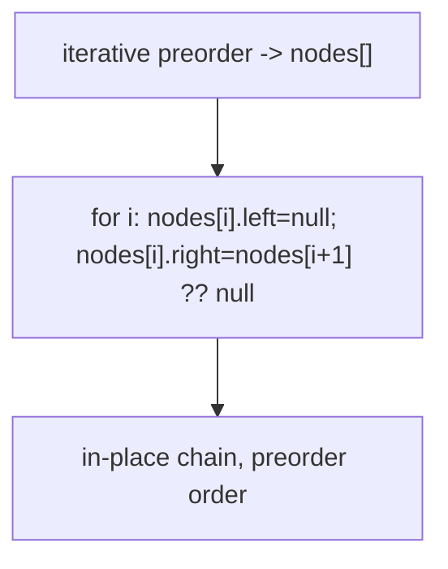
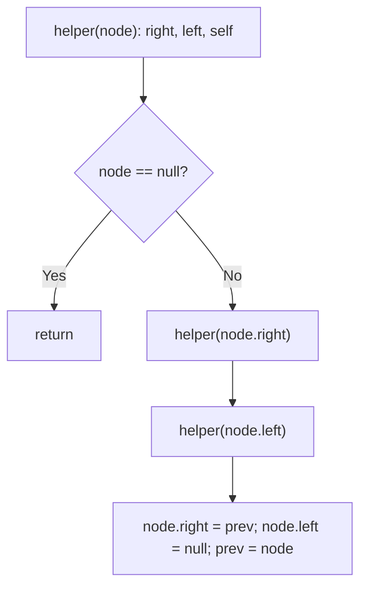
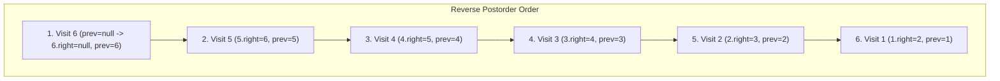

# 114. Flatten Binary Tree to Linked List

- **LeetCode Link**: `https://leetcode.com/problems/flatten-binary-tree-to-linked-list/`
- **Difficulty**: Medium
- **Pattern Category**: Binary Tree / In-Place Preorder Rewiring
- **Prerequisite Primer**: `00-foundations/03-core-algorithmic-patterns.md`

---

## 1. Problem Overview & Edge Case Matrix

### Problem Statement
Given the `root` of a binary tree, flatten the tree into a "linked list": the linked list should use the same `TreeNode` class where the `right` child pointer points to the next node in the list and the `left` child pointer is always `null`. The linked list should be in the same order as a pre-order traversal of the binary tree.

```
Example 1:
Input: root = [1,2,5,3,4,null,6]
Output: [1,null,2,null,3,null,4,null,5,null,6]

Example 2:
Input: root = []
Output: []

Example 3:
Input: root = [0]
Output: [0]
```

### Visual Problem Representation
```
before:        1                    after:   1
              / \                            \
             2   5                            2
            / \   \                            \
           3   4   6                            3
                                                 \
                                                  4
                                                   \
                                                    5
                                                     \
                                                      6
```

### Upfront Edge Case Matrix
| Edge Case Category | Specific Input Scenario | Expected Behavior | Pitfall / Risk |
| :--- | :--- | :--- | :--- |
| Empty / Nil | `root = null` | No-op, return void | Rewiring on null |
| Single Element | `[0]` | Unchanged | Self-link creating a cycle |
| Left-only chain | `[1,2,null,3]` | Right-only chain, same order | Predecessor search on null right |
| Right-only chain | Already flat | Unchanged | Quadratic predecessor walks (still correct) |
| All lefts must die | Every `left` after flatten | Exactly `null` | Stale left pointers failing the checker |

---

## 2. Level 1: Brute Force Approach

### Intuition & Visual Idea
Preorder-walk with an explicit stack, collecting nodes into an array, then relink: every node's `left = null`, `right = next-in-array`. Zero pointer subtlety — at the cost of storing all $N$ nodes.



### Pseudocode
```text
FUNCTION flattenBruteForce(root):
    IF root NULL: RETURN
    nodes = []
    stack = [root]
    WHILE stack NOT EMPTY:
        n = stack.POP(); nodes.PUSH(n)
        IF n.right: stack.PUSH(n.right)
        IF n.left: stack.PUSH(n.left)
    FOR i IN 0 .. nodes.LENGTH - 1:
        nodes[i].left = NULL
        nodes[i].right = nodes[i+1] ?? NULL
```

### Step-by-Step Dry Run (Visual Trace)
| Step | Iteration / Pointer ($i, j$) | Current Value | State / Sub-array | Action Taken |
| :--- | :--- | :--- | :--- | :--- |
| 0 | preorder walk | `1,2,3,4,5,6` | `nodes` in preorder | Stack walk |
| 1 | relink `1` | `left=null, right=2` | Chain starts | Overwrite links |
| 2 | relink middle | each `left=null` | Chain extends | Overwrite links |
| 3 | relink `6` | `right=null` | Terminates | Return void |

### Modern JavaScript Implementation
```javascript
/**
 * Shared backbone: LeetCode provides TreeNode; defined once here so every
 * level below is locally runnable when concatenated (Level 1 + 2 + 3).
 * Time Complexity:  n/a (scaffolding)
 * Space Complexity: n/a (scaffolding)
 */
class TreeNode {
  constructor(val, left = null, right = null) {
    this.val = val;
    this.left = left;
    this.right = right;
  }
}

function arrayToTree(arr) {
  if (arr.length === 0 || arr[0] === null || arr[0] === undefined) return null;
  const root = new TreeNode(arr[0]);
  const queue = [root];
  let i = 1;
  while (i < arr.length) {
    const node = queue.shift();
    if (i < arr.length && arr[i] !== null && arr[i] !== undefined) {
      node.left = new TreeNode(arr[i]);
      queue.push(node.left);
    }
    i++;
    if (i < arr.length && arr[i] !== null && arr[i] !== undefined) {
      node.right = new TreeNode(arr[i]);
      queue.push(node.right);
    }
    i++;
  }
  return root;
}

function collectRightChain(root) {
  // Test helper: values following right pointers (lefts must be null).
  const out = [];
  for (let cur = root; cur !== null; cur = cur.right) {
    if (cur.left !== null) throw new Error('left pointer not cleared');
    out.push(cur.val);
  }
  return out;
}

/**
 * Level 1: Brute Force (preorder array + relink)
 * Time Complexity:  O(N) — one walk plus one relink pass
 * Space Complexity: O(N) — node array
 */
function flattenBruteForce(root) {
  if (root === null) return;
  const nodes = [];
  const stack = [root];
  while (stack.length > 0) {
    // Right pushed first so left pops first: preorder order.
    const node = stack.pop();
    nodes.push(node);
    if (node.right !== null) stack.push(node.right);
    if (node.left !== null) stack.push(node.left);
  }
  for (let i = 0; i < nodes.length; i++) {
    nodes[i].left = null; // checker requires every left to be null
    nodes[i].right = nodes[i + 1] ?? null;
  }
}
```

### Complexity Breakdown
- **Time Complexity**: $O(N)$ — linear, but two passes plus $N$ stored references.
- **Space Complexity**: $O(N)$ — node array; the rewiring itself needs none of it.

---

## 3. Level 2: Optimized Approach

### Intuition & Visual Bottleneck Elimination
Reverse-preorder recursion (right, left, root): process the LAST preorder node first, threading each visited node in front of a `prev` pointer. Each node links exactly once — $O(H)$ stack, no array.



### Pseudocode
```text
FUNCTION flattenRecursive(root):
    prev = NULL
    DEFINE helper(node):
        IF node NULL: RETURN
        helper(node.right)     // reversed preorder: last node first
        helper(node.left)
        node.right = prev; node.left = NULL; prev = node
    helper(root)
```

### Step-by-Step Dry Run (Visual Trace)
| Step | Pointers / Window | Hash Map / Auxiliary State | Decision Logic | Output Accumulator |
| :--- | :--- | :--- | :--- | :--- |
| 1 | deepest-right first | `prev = null` | Node `6`: `right=null` | `prev = 6` |
| 2 | unwind to `5` | `prev = 6` | `5.right = 6` | `prev = 5` |
| 3 | left subtree | threads `4,3,2` | Each links to `prev` | Chain grows frontward |
| 4 | root `1` | `prev = 2` | `1.right = 2` | `[1,2,3,4,5,6]` |

### Modern JavaScript Implementation
```javascript
/**
 * Level 2: Optimized (reverse-preorder threading)
 * Time Complexity:  O(N) — each node visited once
 * Space Complexity: O(H) — call stack depth equals height
 */
// TreeNode shared from Level 1.
function flattenRecursive(root) {
  let prev = null; // head of the already-flattened suffix (closure state)
  function helper(node) {
    if (node === null) return;
    // Reversed preorder: the last node in output order is built first.
    helper(node.right);
    helper(node.left);
    node.right = prev; // prepend current node to the finished suffix
    node.left = null;
    prev = node;
  }
  helper(root);
}
```

### Complexity Breakdown
- **Time Complexity**: $O(N)$ — single visit per node.
- **Space Complexity**: $O(H)$ — recursion depth; skewed trees risk V8 overflow.

---

## 4. Level 3: Most Optimal / Canonical Approach

### Intuition & Mathematical / Invariant Proof
Morris-style rewiring with $O(1)$ space: for each node with a left child, find its predecessor (rightmost node of the left subtree), graft the node's right subtree onto the predecessor, then move the left subtree right. Invariant: after processing node `cur`, everything before `cur` in preorder is already a clean right-chain, and `cur`'s entire left subtree sits at `cur.right` ready for processing.

```
cur=1: pred of left(2) is 4 -> 4.right = 5; 1.right = 2, 1.left = null
cur=2: pred of left(3) is 3 -> 3.right = 4; 2.right = 3, 2.left = null
cur=3,4,5...: no left child, advance
```

### Pseudocode
```text
FUNCTION flatten(root):
    cur = root
    WHILE cur NOT NULL:
        IF cur.left NOT NULL:
            pred = cur.left
            WHILE pred.right NOT NULL: pred = pred.right
            pred.right = cur.right   // graft old right onto predecessor
            cur.right = cur.left     // move left subtree right
            cur.left = NULL
        cur = cur.right
    RETURN (void)
```

### Step-by-Step Dry Run (Visual Trace)
| Step | Pointer $L$ | Pointer $R$ | Invariant Checked | In-Place State |
| :--- | :--- | :--- | :--- | :--- |
| 1 | `cur=1` | pred `4` | `4.right = 5`, `1.right = 2` | `1 -> 2 -> 3 -> 4 -> 5 -> 6` forming |
| 2 | `cur=2` | pred `3` | `3.right = 4`, `2.right = 3` | Prefix `[1,2]` clean chain |
| 3 | `cur=3..6` | no left children | Advance only | Full chain `[1..6]` |

### Modern JavaScript Implementation
```javascript
/**
 * Level 3: Most Optimal / Canonical (Morris predecessor rewiring)
 * Time Complexity:  O(N) amortized — each edge traversed at most twice
 * Space Complexity: O(1) auxiliary — no stack, no array, no recursion
 */
// TreeNode shared from Level 1.
function flatten(root) {
  let cur = root;
  while (cur !== null) {
    if (cur.left !== null) {
      // Predecessor: rightmost node of the left subtree.
      let pred = cur.left;
      while (pred.right !== null) pred = pred.right;
      pred.right = cur.right; // graft the old right subtree after the predecessor
      cur.right = cur.left; // left subtree takes the right slot
      cur.left = null;
    }
    cur = cur.right;
  }
}
```

### Complexity Breakdown
- **Time Complexity**: $O(N)$ amortized — predecessor walks revisit edges, but each edge is crossed $O(1)$ times overall.
- **Space Complexity**: $O(1)$ auxiliary — pure pointer surgery; optimal.

---

## 5. JavaScript-Specific Gotchas & V8 Optimizations
- **GC Pressure**: Avoid allocating objects inside tight loops ($O(N)$ closures). Level 1's $N$-node array is the pressure removed — Levels 2–3 allocate nothing per node.
- **Type Coercion / Sorting**: `nodes[i + 1] ?? null` (not `|| null`) — `||` would also null out legitimate falsy nodes; with objects the difference is stylistic, but the habit prevents real bugs with value arrays.
- **Index Bounds**: The function returns void — LeetCode checks the mutated tree, so tests must read `root`'s chain after the call, not a return value. Forgetting `cur.left = null` passes value checks but fails the structural checker.

---

## 6. Real-World MAANG Interview Follow-Ups & Extensions

### Follow-Up 1: Flatten an n-ary tree to a right-chain
- **Scenario**: Nodes have `children` arrays; flatten in preorder.
- **Solution Strategy**: Same Morris idea generalizes poorly (no left/right slots) — use Level 2's reversed-visit threading over reversed children order, or serialize-then-relink with an explicit stack.
- **JS Code / Implementation Pattern**:
```javascript
function flattenNary(root) {
  let prev = null;
  function helper(node) {
    if (!node) return;
    for (let i = node.children.length - 1; i >= 0; i--) helper(node.children[i]);
    node.next = prev; prev = node;
  }
  helper(root);
}
```

### Follow-Up 2: Flatten a $10^9$-node tree from disk with $O(1)$ RAM
- **Scenario**: Tree pages stream from disk; only the current path fits in memory.
- **Solution Strategy**: Morris traversal IS the streaming answer — predecessor rewiring touches only the current node and its left spine; page in subtrees on demand, write back flattened pages sequentially.
- **JS Code / Implementation Pattern**:
```javascript
async function flattenPaged(rootId, loadPage, storePage) {
  let curId = rootId;
  while (curId) {
    const cur = await loadPage(curId);
    if (cur.left) await graftPredecessor(cur, loadPage, storePage);
    await storePage(cur);
    curId = cur.right;
  }
}
```

### Follow-Up 3: Threaded (read-while-flatten) access
- **Scenario & In-Depth Solution**: Readers traverse preorder while flattening runs — Morris rewiring temporarily creates cycles (predecessor grafts) that hang naive readers. Fix: publish flattened prefix pages with version stamps; readers restart from the last stamped node if the stamp changed mid-read.
```javascript
function readFlattenedVersioned(root, versionOf) {
  const stamp = versionOf(root);
  const out = collectRightChain(root);
  if (versionOf(root) !== stamp) throw new Error('flatten raced read: retry');
  return out;
}
```

---

## 7. What LeetCode Discuss Says (Language-Independent)

Source: top-voted post by tusizi tiger —
`https://leetcode.com/problems/flatten-binary-tree-to-linked-list/solutions/36977/my-short-post-order-traversal-java-solut-nsg6/`
— 183.8K views.
Language-independent summary. No new JS here.

### A. Optimal way from Discuss (Reverse Post-Order Traversal — Right -> Left -> Root)

The desired linked list matches preorder traversal (`Root -> Left -> Right`). Reversing preorder produces **`Right -> Left -> Root`**:

1. **Reverse Order Traversal:** Recurse into `root.right` first, then `root.left`. This visits nodes in exact reverse sequence of the final list.
2. **Backbone Stitching:** Maintain a pointer `prev` initialized to `null` tracking the head of the already processed chain.
3. **In-Place Rewiring:** When at `root`:
   - Point `root.right = prev` (linking current root to the rest of the flattened list).
   - Clear `root.left = null` (ensuring singly-linked rightward structure).
   - Advance `prev = root`.

```text
CLASS Solution:
    prev = null

    FUNCTION flatten(root):
        IF root == null:
            RETURN

        // Traverse right subtree first, then left subtree
        flatten(root.right)
        flatten(root.left)

        // Rewire pointers
        root.right = prev
        root.left = null
        prev = root
```

- Time: O(N) where N is the number of nodes, visiting each node exactly once.
- Space: O(H) auxiliary space on the recursion call stack ($O(\log N)$ balanced, $O(N)$ skewed).



### B. Dry run on LeetCode Example 1 (`root = [1,2,5,3,4,null,6]`)

| Current Node | `prev` Before Call | Actions Taken | `prev` After Call |
| :--- | :--- | :--- | :--- |
| `6` | `null` | `6.right = null`, `6.left = null` | `Node(6)` |
| `5` | `Node(6)` | `5.right = 6`, `5.left = null` | `Node(5 -> 6)` |
| `4` | `Node(5)` | `4.right = 5`, `4.left = null` | `Node(4 -> 5 -> 6)` |
| `3` | `Node(4)` | `3.right = 4`, `3.left = null` | `Node(3 -> 4 -> 5 -> 6)` |
| `2` | `Node(3)` | `2.right = 3`, `2.left = null` | `Node(2 -> 3 -> 4 -> 5 -> 6)` |
| `1` | `Node(2)` | `1.right = 2`, `1.left = null` | `Node(1 -> 2 -> 3 -> 4 -> 5 -> 6)` |

Result: Linked list `1 -> 2 -> 3 -> 4 -> 5 -> 6`.

### C. Why Reverse Post-Order Eliminates Temporary Pointer Stashing

- **Forward Preorder Dilemma:** Traversing `Root -> Left -> Right` overwrites `root.right` with the flattened left subtree, destroying access to the original right subtree unless cached in a stack or found via Morris traversal.
- **Reverse Post-Order Elegance:** The right subtree is completely processed and packed into `prev` BEFORE the left subtree or root is touched. Rewiring `root.right = prev` is 100% safe without auxiliary buffers.

### D. Pitfalls from comments

- **Failing to set `root.left = null`:** LeetCode tests verify that all `left` pointers are nullified. Omitting `root.left = null` leaves dangling branches.
- **Global state persistence:** In test harnesses that reuse solution class instances across multiple test cases, remember to reset `prev = null` prior to flattening each tree.

### E. Companies

- Discuss post itself names none.
  Companies tab on LeetCode is premium-locked.
- External source:
  `https://github.com/liquidslr/leetcode-company-wise-problems`
  (LeetCode company tags, updated June 2025).
- All-time (26): Amazon, Apple, Bloomberg, Cisco, Google, Meta, Microsoft, Oracle, Spotify, etc.
- Recent: 30 days — Amazon, Bloomberg, Meta.
- Recent: 3 months — Amazon, Bloomberg, Meta, Microsoft.
