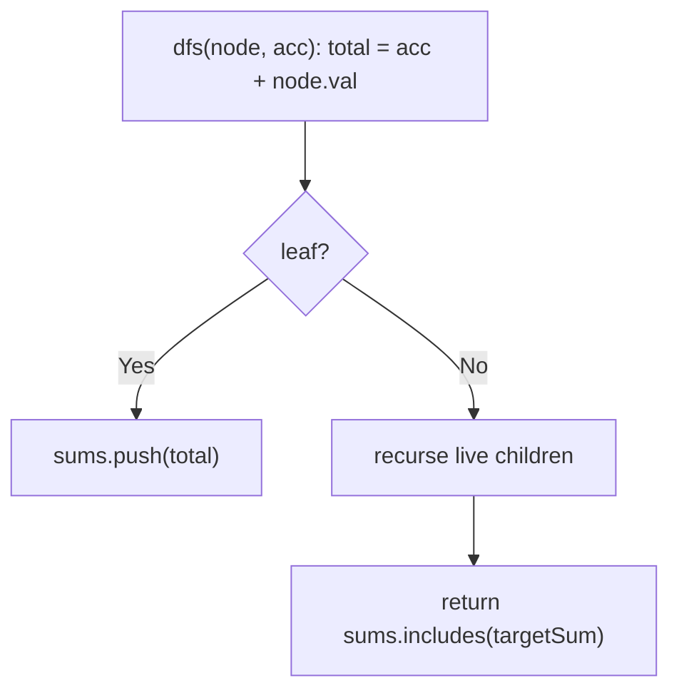
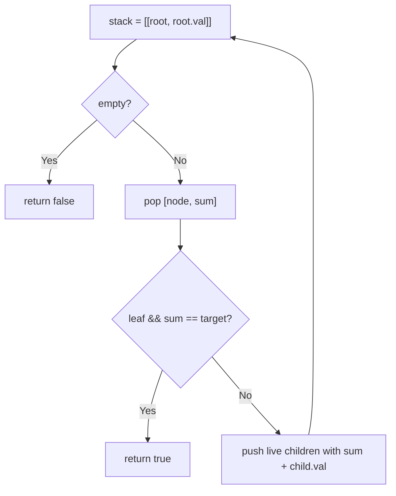
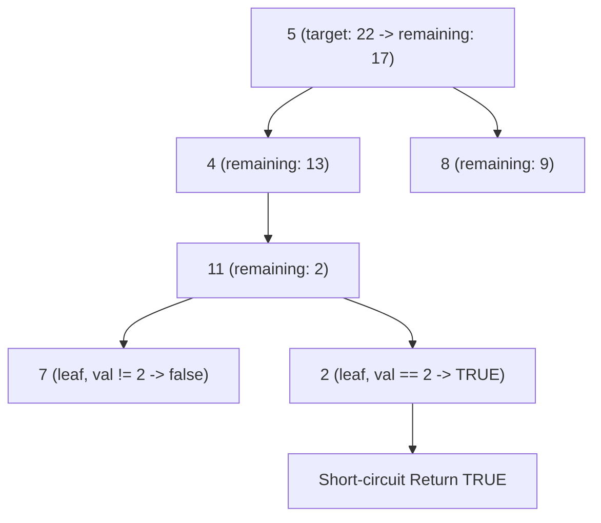

# 112. Path Sum

- **LeetCode Link**: `https://leetcode.com/problems/path-sum/`
- **Difficulty**: Easy
- **Pattern Category**: Binary Tree / Root-to-Leaf Accumulation
- **Prerequisite Primer**: `00-foundations/03-core-algorithmic-patterns.md`

---

## 1. Problem Overview & Edge Case Matrix

### Problem Statement
Given the `root` of a binary tree and an integer `targetSum`, return `true` if the tree has a root-to-leaf path such that adding up all the values along the path equals `targetSum`. A leaf is a node with no children.

```
Example 1:
Input: root = [5,4,8,11,null,13,4,7,2,null,null,null,1], targetSum = 22
Output: true
Explanation: 5 + 4 + 11 + 2 = 22.

Example 2:
Input: root = [1,2,3], targetSum = 5
Output: false

Example 3:
Input: root = [], targetSum = 0
Output: false (empty tree has no root-to-leaf path)
```

### Visual Problem Representation
```
           5
          / \
         4   8
        /   / \
       11  13  4
      / \       \
     7   2       1        path 5->4->11->2 = 22 ✓
```

### Upfront Edge Case Matrix
| Edge Case Category | Specific Input Scenario | Expected Behavior | Pitfall / Risk |
| :--- | :--- | :--- | :--- |
| Empty / Nil | `root = null`, any target | Return `false` (even target `0`) | `0 == 0` vacuous true |
| Single Element | `[1]`, target `1` | Return `true` | Leaf check skipped |
| Negative values | `[1,-2,-3,...]`, target `-1` | Correct signed accumulation | Early termination on overshoot (values can go down) |
| Non-leaf match | `[1,2]`, target `1` | Return `false` | Accepting a prefix that isn't root-to-leaf |
| Zero target, real path | `[1,-1]`, target `0` | Depends on leaf sums | Same vacuous-truth trap as empty |

---

## 2. Level 1: Brute Force Approach

### Intuition & Visual Idea
Enumerate every root-to-leaf path sum into an array (DFS collecting totals), then check membership. Obviously correct — and stores all $O(L)$ leaf sums for a single boolean answer.



### Pseudocode
```text
FUNCTION hasPathSumBruteForce(root, targetSum):
    IF root NULL: RETURN false
    sums = []
    DEFINE dfs(node, acc):
        total = acc + node.val
        IF LEAF(node): sums.PUSH(total); RETURN
        IF node.left: dfs(node.left, total)
        IF node.right: dfs(node.right, total)
    dfs(root, 0)
    RETURN sums.INCLUDES(targetSum)
```

### Step-by-Step Dry Run (Visual Trace)
| Step | Iteration / Pointer ($i, j$) | Current Value | State / Sub-array | Action Taken |
| :--- | :--- | :--- | :--- | :--- |
| 0 | `dfs(5, 0)` | total `5` | Not leaf | Recurse both |
| 1 | `dfs(4, 5)` → `dfs(11, 9)` | totals `9, 20` | Internal | Recurse |
| 2 | `dfs(7, 20)` → `27` | leaf | `sums = [27]` | Record |
| 3 | `dfs(2, 20)` → `22` | leaf | `sums = [27, 22]` | Record, match! |
| 4 | remaining paths | `26, 18, ...` | Full enumeration | `includes(22) = true` |

### Modern JavaScript Implementation
```javascript
/**
 * Shared backbone: LeetCode provides TreeNode; defined once here so every
 * level below is locally runnable when concatenated (Level 1 + 2 + 3).
 * Time Complexity:  n/a (scaffolding)
 * Space Complexity: n/a (scaffolding)
 */
class TreeNode {
  constructor(val, left = null, right = null) {
    this.val = val;
    this.left = left;
    this.right = right;
  }
}

function arrayToTree(arr) {
  if (arr.length === 0 || arr[0] === null || arr[0] === undefined) return null;
  const root = new TreeNode(arr[0]);
  const queue = [root];
  let i = 1;
  while (i < arr.length) {
    const node = queue.shift();
    if (i < arr.length && arr[i] !== null && arr[i] !== undefined) {
      node.left = new TreeNode(arr[i]);
      queue.push(node.left);
    }
    i++;
    if (i < arr.length && arr[i] !== null && arr[i] !== undefined) {
      node.right = new TreeNode(arr[i]);
      queue.push(node.right);
    }
    i++;
  }
  return root;
}

/**
 * Level 1: Brute Force (enumerate all leaf sums)
 * Time Complexity:  O(N) — full traversal plus includes() scan
 * Space Complexity: O(N) — leaf-sum array plus recursion stack
 */
function hasPathSumBruteForce(root, targetSum) {
  if (root === null) return false; // no path exists, even for target 0
  const sums = [];
  function dfs(node, acc) {
    const total = acc + node.val;
    // Leaf ONLY: a matching prefix through an internal node is not a path.
    if (node.left === null && node.right === null) {
      sums.push(total);
      return;
    }
    if (node.left !== null) dfs(node.left, total);
    if (node.right !== null) dfs(node.right, total);
  }
  dfs(root, 0);
  return sums.includes(targetSum);
}
```

### Complexity Breakdown
- **Time Complexity**: $O(N)$ — full walk even after the answer is known.
- **Space Complexity**: $O(N)$ — sums array; the boolean needs none of it.

---

## 3. Level 2: Optimized Approach

### Intuition & Visual Bottleneck Elimination
Iterative stack of `(node, runningSum)` pairs with immediate return on the first matching leaf — no array, early exit, no recursion. Same visits, half the memory profile.



### Pseudocode
```text
FUNCTION hasPathSumIterative(root, targetSum):
    IF root NULL: RETURN false
    stack = [[root, root.val]]
    WHILE stack NOT EMPTY:
        [node, sum] = stack.POP()
        IF LEAF(node) AND sum == targetSum: RETURN true
        IF node.left: stack.PUSH([node.left, sum + node.left.val])
        IF node.right: stack.PUSH([node.right, sum + node.right.val])
    RETURN false
```

### Step-by-Step Dry Run (Visual Trace)
| Step | Pointers / Window | Hash Map / Auxiliary State | Decision Logic | Output Accumulator |
| :--- | :--- | :--- | :--- | :--- |
| 0 | pop `[5, 5]` | internal | Push children | Stack grows |
| 1 | pop `[4, 9]` → `[11, 20]` | internal | Push `7, 2` sums | Continue |
| 2 | pop `[2, 22]` | LEAF, `22 == 22` | Match! | Return `true` immediately |
| 3 | — | remaining stack abandoned | Early exit | No full walk |

### Modern JavaScript Implementation
```javascript
/**
 * Level 2: Optimized (iterative running-sum stack, early exit)
 * Time Complexity:  O(N) worst case — exits on first matching leaf
 * Space Complexity: O(H) — explicit stack bounded by height
 */
// TreeNode shared from Level 1.
function hasPathSumIterative(root, targetSum) {
  if (root === null) return false;
  const stack = [[root, root.val]]; // [node, root-to-node sum]
  while (stack.length > 0) {
    const [node, sum] = stack.pop();
    // Leaf AND match: internal-node prefix matches do not count.
    if (node.left === null && node.right === null && sum === targetSum) return true;
    if (node.left !== null) stack.push([node.left, sum + node.left.val]);
    if (node.right !== null) stack.push([node.right, sum + node.right.val]);
  }
  return false;
}
```

### Complexity Breakdown
- **Time Complexity**: $O(N)$ worst case — typically far less via early exit.
- **Space Complexity**: $O(H)$ — explicit stack; no sum array.

---

## 4. Level 3: Most Optimal / Canonical Approach

### Intuition & Mathematical / Invariant Proof
Subtract down the target: `hasPathSum(node, t)` is true iff some root-to-leaf path sums to `t`, i.e. iff a child path sums to `t - node.val`. The leaf rule (`val === t` at a leaf) plus null rule (`false`, never vacuous) complete the induction. Three lines, short-circuiting `||`, no accumulator threading.

```
hasPath(5, 22) = hasPath(4, 17) || hasPath(8, 17)
hasPath(4, 17) = hasPath(11, 13) = hasPath(7, 2) || hasPath(2, 2) = true
```

### Pseudocode
```text
FUNCTION hasPathSum(node, targetSum):
    IF node NULL: RETURN false
    IF LEAF(node): RETURN node.val == targetSum
    rest = targetSum - node.val
    RETURN hasPathSum(node.left, rest) OR hasPathSum(node.right, rest)
```

### Step-by-Step Dry Run (Visual Trace)
| Step | Pointer $L$ | Pointer $R$ | Invariant Checked | In-Place State |
| :--- | :--- | :--- | :--- | :--- |
| 1 | `hasPath(5, 22)` | internal | Recurse with `17` | `left \|\| right` |
| 2 | `hasPath(11, 13)` | internal | Recurse with `2` | `left \|\| right` |
| 3 | `hasPath(7, 2)` | leaf, `7 ≠ 2` | `false` | Try right |
| 4 | `hasPath(2, 2)` | leaf, `2 == 2` | `true` | Unwinds `true` |

### Modern JavaScript Implementation
```javascript
/**
 * Level 3: Most Optimal / Canonical (target-subtraction recursion)
 * Time Complexity:  O(N) worst case — short-circuits on first match
 * Space Complexity: O(H) — call stack depth equals height
 */
// TreeNode shared from Level 1.
function hasPathSum(root, targetSum) {
  // Null subtree contributes NO path — even when targetSum hits 0.
  if (root === null) return false;
  // Leaf: the remaining target must equal this final value exactly.
  if (root.left === null && root.right === null) return root.val === targetSum;
  const rest = targetSum - root.val;
  return hasPathSum(root.left, rest) || hasPathSum(root.right, rest);
}
```

### Complexity Breakdown
- **Time Complexity**: $O(N)$ worst case — optimal with short-circuit; matching paths end the walk early.
- **Space Complexity**: $O(H)$ — implicit stack only.

---

## 5. JavaScript-Specific Gotchas & V8 Optimizations
- **GC Pressure**: Avoid allocating objects inside tight loops ($O(N)$ closures). Level 1's sums array plus Level 2's `[node, sum]` pairs allocate per node — Level 3's bare `rest` number per frame is the lightest possible state.
- **Type Coercion / Sorting**: `sums.includes(targetSum)` uses SameValueZero — correct for integers; but NEVER write `if (!hasPathSum(...)) ` inverted logic carelessly — the empty-tree `false` (not vacuous `true`) is the spec's explicit trap in Example 3.
- **Index Bounds**: No pruning on `sum > target` — negative values mean overshoot can recover (e.g. `[1,-2,1]` paths). Any solution that bails when the accumulator exceeds the target is wrong on signed inputs.

---

## 6. Real-World MAANG Interview Follow-Ups & Extensions

### Follow-Up 1: All root-to-leaf paths hitting the sum (Path Sum II)
- **Scenario**: Return every qualifying path, not just existence (LeetCode 113).
- **Solution Strategy**: Thread the path array through Level 3's recursion (push on entry, pop on exit — backtracking); push a copy at matching leaves.
- **JS Code / Implementation Pattern**:
```javascript
function pathSumII(root, targetSum) {
  const out = [];
  function dfs(node, rest, path) {
    if (!node) return;
    path.push(node.val);
    if (!node.left && !node.right && node.val === rest) out.push([...path]);
    else {
      dfs(node.left, rest - node.val, path);
      dfs(node.right, rest - node.val, path);
    }
    path.pop(); // backtrack: restore for siblings
  }
  dfs(root, targetSum, []);
  return out;
}
```

### Follow-Up 2: Any downward path, not just root-to-leaf (Path Sum III)
- **Scenario**: Paths can start/end anywhere downward (LeetCode 437, needs prefix sums).
- **Solution Strategy**: Prefix-sum map along the current path: at each node, `count += prefixFreq.get(runningSum - target)`; $O(N)$ time, $O(H)$ map.
- **JS Code / Implementation Pattern**:
```javascript
function pathSumIII(root, targetSum) {
  let count = 0;
  const freq = new Map([[0, 1]]);
  function dfs(node, running) {
    if (!node) return;
    running += node.val;
    count += freq.get(running - targetSum) ?? 0;
    freq.set(running, (freq.get(running) ?? 0) + 1);
    dfs(node.left, running); dfs(node.right, running);
    freq.set(running, freq.get(running) - 1); // backtrack
  }
  dfs(root, 0);
  return count;
}
```

### Follow-Up 3: $10^9$-node tree evaluated as a stream
- **Scenario & In-Depth Solution**: The tree streams in preorder with depth markers; only the current path fits in RAM. Maintain the running sum incrementally (push on descend, subtract on ascend markers) and test leaf sums on the fly — $O(H)$ memory, single pass.
```javascript
async function streamHasPathSum(eventStream, targetSum) {
  let running = 0;
  const stack = [];
  for await (const ev of eventStream) {
    if (ev.type === 'enter') { running += ev.val; stack.push(ev); }
    else {
      const node = stack.pop();
      if (node.isLeaf && running === targetSum) return true;
      running -= node.val;
    }
  }
  return false;
}
```

---

## 7. What LeetCode Discuss Says (Language-Independent)

Source: top-voted post by Firdavs —
`https://leetcode.com/problems/path-sum/solutions/3977919/easy-solutionpython3cccjavaexplain-line-zwis1/`
— 83K views.
Language-independent summary. No new JS here.

### A. Optimal way from Discuss (Top-Down Target Reduction with Strict Leaf Guard)

The community-standard recursive approach tests whether a root-to-leaf path equals `targetSum` by decrementing the target along the path:

1. **Base Case (Empty Tree):** If `root == null`, return `false`. (An empty tree contains no paths).
2. **Leaf Node Verification:** If both `root.left == null` and `root.right == null`, `root` is a valid leaf. Return whether `root.val == targetSum`.
3. **Recursive Descent:** Subtract `root.val` from `targetSum` and recursively query both subtrees with logical OR short-circuiting.

```text
FUNCTION hasPathSum(root, targetSum):
    IF root == null:
        RETURN false

    // Must verify both children are null to qualify as a leaf
    IF root.left == null AND root.right == null:
        RETURN targetSum == root.val

    remaining = targetSum - root.val

    RETURN hasPathSum(root.left, remaining) OR hasPathSum(root.right, remaining)
```

- Time: O(N) where N is the number of nodes; worst case explores every branch once, with early exit upon finding a valid path.
- Space: O(H) auxiliary space on the call stack ($O(\log N)$ balanced, $O(N)$ skewed).



### B. Dry run on LeetCode Example 1 (`root = [5,4,8,11,null,13,4,7,2,null,null,null,1], targetSum = 22`)

- Node 5: non-leaf, target becomes $22 - 5 = 17$. Recurse left to 4.
- Node 4: non-leaf, target becomes $17 - 4 = 13$. Recurse left to 11.
- Node 11: non-leaf, target becomes $13 - 11 = 2$. Recurse left to 7.
- Node 7: leaf, $7 \neq 2$ -> returns `false`.
- Recurse right from 11 to 2:
- Node 2: leaf, $2 == 2$ -> returns `true`.
- Short-circuit propagates `true` through 11, 4, and 5 without inspecting the right subtree of 5.

Result: `true`.

### C. Why Subtraction Beats Passing an Accumulated Sum

- **Single Parameter Reduction:** Deducting `root.val` at each level compares directly against `targetSum == root.val` at the leaf, avoiding state management for an accumulated running total.
- **Short-Circuit Pruning:** The `||` operator halts traversal of any pending right branches the microsecond any left leaf path succeeds.

### D. Pitfalls from comments

- **The Single-Child False Leaf Trap:** Checking `if (root == null) return targetSum == 0;` causes nodes with only ONE child to misidentify the absent child as a leaf with sum 0! A leaf is strictly defined as a node where BOTH `left` and `right` are `null`.
- **Negative node values:** Node values and `targetSum` can be negative (e.g. `root = [-2, null, -3], targetSum = -5`). Pruning when `targetSum < 0` is an error because subsequent negative values can increase the match.

### E. Companies

- Discuss post itself names none.
  Companies tab on LeetCode is premium-locked.
- External source:
  `https://github.com/liquidslr/leetcode-company-wise-problems`
  (LeetCode company tags, updated June 2025).
- All-time (23): Amazon, Apple, Bloomberg, Cisco, Google, Meta, Microsoft, Oracle, Spotify, etc.
- Recent: 30 days — Amazon, Bloomberg.
- Recent: 3 months — Amazon, Bloomberg, Meta.
