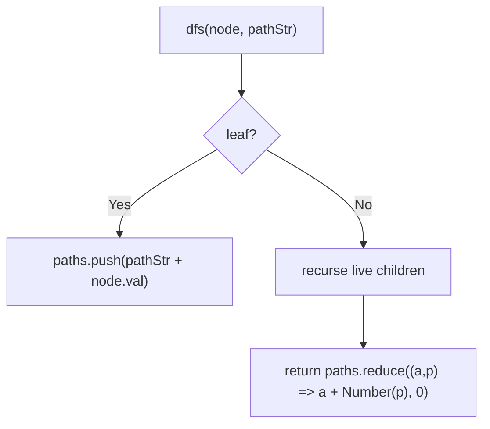
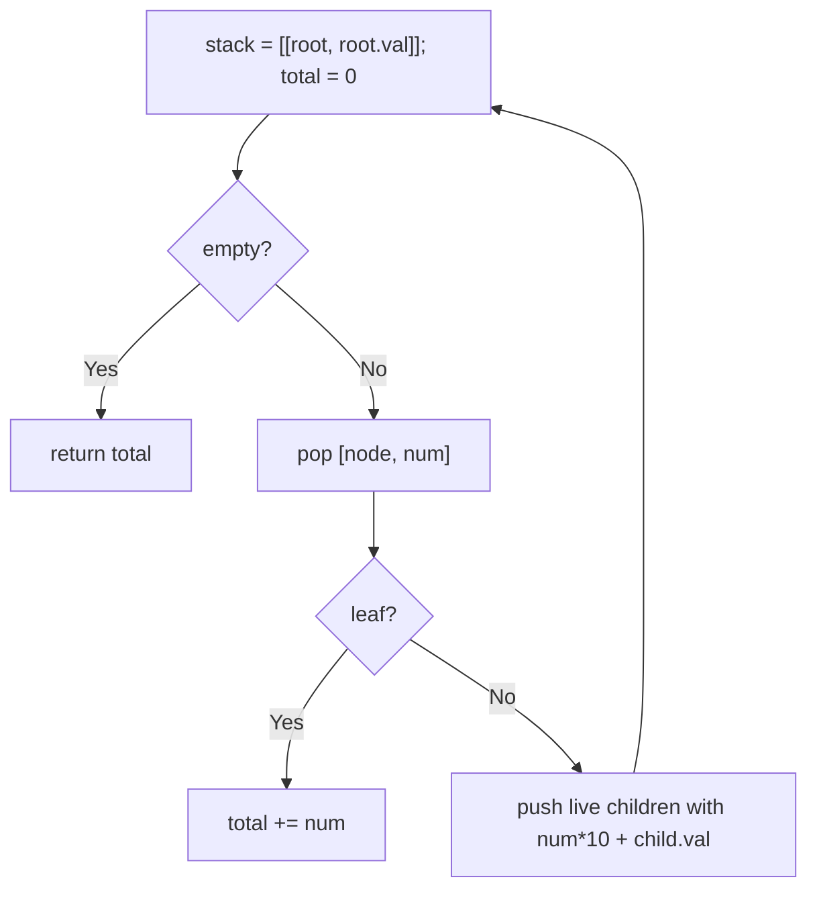
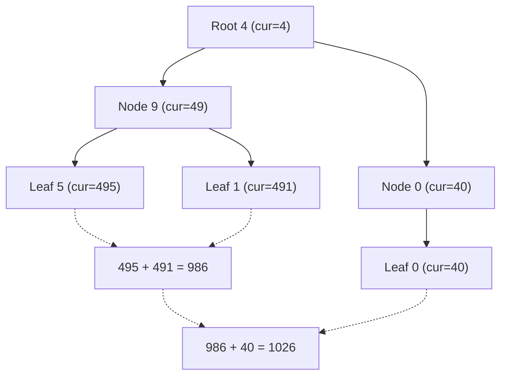

# 129. Sum Root to Leaf Numbers

- **LeetCode Link**: `https://leetcode.com/problems/sum-root-to-leaf-numbers/`
- **Difficulty**: Medium
- **Pattern Category**: Binary Tree / Positional Path Accumulation
- **Prerequisite Primer**: `00-foundations/03-core-algorithmic-patterns.md`

---

## 1. Problem Overview & Edge Case Matrix

### Problem Statement
You are given the `root` of a binary tree containing digits from `0` to `9` only. Each root-to-leaf path in the tree represents a number — for example, the path `1 -> 2 -> 3` represents the number `123`. Return the total sum of all root-to-leaf numbers.

```
Example 1:
Input: root = [1,2,3]
Output: 25
Explanation: paths 1->2 (12) and 1->3 (13); 12 + 13 = 25.

Example 2:
Input: root = [4,9,0,5,1]
Output: 1026
Explanation: 495 + 491 + 40 = 1026.
```

### Visual Problem Representation
```
        4
       / \
      9   0
     / \
    5   1        495 + 491 + 40 = 1026
```

### Upfront Edge Case Matrix
| Edge Case Category | Specific Input Scenario | Expected Behavior | Pitfall / Risk |
| :--- | :--- | :--- | :--- |
| Empty / Nil | `root = null` | Return `0` | Null traversal |
| Single Element | `[0]` | Return `0` (number `0`) | Confusing value-0 with empty |
| Leading zeros on paths | `[0,1,0]`-shaped | `1 + 0 = 1`-style exact math | String-vs-number edge (none if arithmetic) |
| Deep paths | 10+ digits | Exact sum | `Number` overflow past $2^{53}$ (spec bounds avoid it) |
| Asymmetric leaves | Leaves at mixed depths | Each path independent | Carrying parent digits across siblings |

---

## 2. Level 1: Brute Force Approach

### Intuition & Visual Idea
Collect every root-to-leaf digit string, convert with `Number()`, and sum. Strings make the positional logic visible — at the cost of an array of strings plus conversions.



### Pseudocode
```text
FUNCTION sumNumbersBruteForce(root):
    IF root NULL: RETURN 0
    paths = []
    DEFINE dfs(node, path):
        cur = path + STRING(node.val)
        IF LEAF(node): paths.PUSH(cur); RETURN
        IF node.left: dfs(node.left, cur)
        IF node.right: dfs(node.right, cur)
    dfs(root, "")
    RETURN SUM(NUMBER(p) FOR p IN paths)
```

### Step-by-Step Dry Run (Visual Trace)
| Step | Iteration / Pointer ($i, j$) | Current Value | State / Sub-array | Action Taken |
| :--- | :--- | :--- | :--- | :--- |
| 0 | `dfs(1, "")` | `"1"` | Internal | Recurse both |
| 1 | `dfs(2, "1")` | `"12"` | Leaf | Record `"12"` |
| 2 | `dfs(3, "1")` | `"13"` | Leaf | Record `"13"` |
| 3 | sum | `12 + 13` | — | Return `25` |

### Modern JavaScript Implementation
```javascript
/**
 * Shared backbone: LeetCode provides TreeNode; defined once here so every
 * level below is locally runnable when concatenated (Level 1 + 2 + 3).
 * Time Complexity:  n/a (scaffolding)
 * Space Complexity: n/a (scaffolding)
 */
class TreeNode {
  constructor(val, left = null, right = null) {
    this.val = val;
    this.left = left;
    this.right = right;
  }
}

function arrayToTree(arr) {
  if (arr.length === 0 || arr[0] === null || arr[0] === undefined) return null;
  const root = new TreeNode(arr[0]);
  const queue = [root];
  let i = 1;
  while (i < arr.length) {
    const node = queue.shift();
    if (i < arr.length && arr[i] !== null && arr[i] !== undefined) {
      node.left = new TreeNode(arr[i]);
      queue.push(node.left);
    }
    i++;
    if (i < arr.length && arr[i] !== null && arr[i] !== undefined) {
      node.right = new TreeNode(arr[i]);
      queue.push(node.right);
    }
    i++;
  }
  return root;
}

/**
 * Level 1: Brute Force (path strings + conversion)
 * Time Complexity:  O(N * H) — string concat per level along every path
 * Space Complexity: O(N * H) — all path strings retained
 */
function sumNumbersBruteForce(root) {
  if (root === null) return 0;
  const paths = [];
  function dfs(node, path) {
    const cur = path + node.val; // string concat: positional logic made visible
    if (node.left === null && node.right === null) {
      paths.push(cur);
      return;
    }
    if (node.left !== null) dfs(node.left, cur);
    if (node.right !== null) dfs(node.right, cur);
  }
  dfs(root, '');
  return paths.reduce((total, p) => total + Number(p), 0);
}
```

### Complexity Breakdown
- **Time Complexity**: $O(N·H)$ — string concatenation copies the path prefix at every level.
- **Space Complexity**: $O(N·H)$ — every path string stored simultaneously.

---

## 3. Level 2: Optimized Approach

### Intuition & Visual Bottleneck Elimination
Carry the running NUMBER (`acc * 10 + val`) on an explicit stack — no strings, no conversion, no array. Iterative, $O(H)$ space, one pass.



### Pseudocode
```text
FUNCTION sumNumbersIterative(root):
    IF root NULL: RETURN 0
    stack = [[root, root.val]]; total = 0
    WHILE stack NOT EMPTY:
        [node, num] = stack.POP()
        IF LEAF(node): total += num; CONTINUE
        IF node.left: stack.PUSH([node.left, num*10 + node.left.val])
        IF node.right: stack.PUSH([node.right, num*10 + node.right.val])
    RETURN total
```

### Step-by-Step Dry Run (Visual Trace)
| Step | Pointers / Window | Hash Map / Auxiliary State | Decision Logic | Output Accumulator |
| :--- | :--- | :--- | :--- | :--- |
| 0 | pop `[4, 4]` | internal | Push `49`, `40` | `total = 0` |
| 1 | pop `[0, 40]` | leaf | Add | `total = 40` |
| 2 | pop `[9, 49]` | internal | Push `495`, `491` | `total = 40` |
| 3 | pop leaves | `495`, `491` | Add both | `total = 1026` |

### Modern JavaScript Implementation
```javascript
/**
 * Level 2: Optimized (iterative positional accumulation)
 * Time Complexity:  O(N) — constant arithmetic per node
 * Space Complexity: O(H) — explicit stack bounded by height
 */
// TreeNode shared from Level 1.
function sumNumbersIterative(root) {
  if (root === null) return 0;
  const stack = [[root, root.val]]; // [node, number formed root-to-node]
  let total = 0;
  while (stack.length > 0) {
    const [node, num] = stack.pop();
    if (node.left === null && node.right === null) {
      total += num; // complete number: fold into the total
      continue;
    }
    // Positional shift: appending a digit IS multiply-by-10-plus.
    if (node.left !== null) stack.push([node.left, num * 10 + node.left.val]);
    if (node.right !== null) stack.push([node.right, num * 10 + node.right.val]);
  }
  return total;
}
```

### Complexity Breakdown
- **Time Complexity**: $O(N)$ — $O(1)$ arithmetic per node, no string work.
- **Space Complexity**: $O(H)$ — explicit stack; no path storage.

---

## 4. Level 3: Most Optimal / Canonical Approach

### Intuition & Mathematical / Invariant Proof
Recursive positional accumulation with a defaulted parameter: `f(node, acc)` returns the sum of all numbers in node's subtree given the prefix value `acc`. Recurrence: `cur = acc*10 + val`; leaf → `cur`; else `f(left, cur) + f(right, cur)`. The arithmetic IS the traversal state — no strings, no stack, no array. Invariant: `acc` always equals the exact number formed by the path from root to node's parent.

```
f(4,0): cur=4 -> f(9,4) + f(0,4)
f(9,4): cur=49 -> f(5,49) + f(1,49) = 495 + 491
f(0,4): cur=40, leaf -> 40
total = 495 + 491 + 40 = 1026
```

### Pseudocode
```text
FUNCTION sumNumbers(node, acc = 0):
    IF node NULL: RETURN 0
    cur = acc * 10 + node.val
    IF LEAF(node): RETURN cur
    RETURN sumNumbers(node.left, cur) + sumNumbers(node.right, cur)
```

### Step-by-Step Dry Run (Visual Trace)
| Step | Pointer $L$ | Pointer $R$ | Invariant Checked | In-Place State |
| :--- | :--- | :--- | :--- | :--- |
| 1 | `f(1, 0)` | `cur = 1` | Prefix `1` | `f(2,1) + f(3,1)` |
| 2 | `f(2, 1)` | `cur = 12`, leaf | Returns `12` | Left done |
| 3 | `f(3, 1)` | `cur = 13`, leaf | Returns `13` | Right done |
| 4 | sum | `12 + 13` | — | Return `25` |

### Modern JavaScript Implementation
```javascript
/**
 * Level 3: Most Optimal / Canonical (recursive positional sum)
 * Time Complexity:  O(N) — O(1) arithmetic per node, optimal lower bound
 * Space Complexity: O(H) — call stack depth equals height
 */
// TreeNode shared from Level 1.
function sumNumbers(root, acc = 0) {
  if (root === null) return 0;
  const cur = acc * 10 + root.val; // extend the prefix number by one digit
  // Leaf: the prefix is a complete number — return it, don't recurse.
  if (root.left === null && root.right === null) return cur;
  return sumNumbers(root.left, cur) + sumNumbers(root.right, cur);
}
```

### Complexity Breakdown
- **Time Complexity**: $O(N)$ — optimal lower bound; every node contributes its digit once.
- **Space Complexity**: $O(H)$ — implicit stack only; the `acc` parameter carries all state.

---

## 5. JavaScript-Specific Gotchas & V8 Optimizations
- **GC Pressure**: Avoid allocating objects inside tight loops ($O(N)$ closures). Level 1's $L$ path strings (each copied per level) are the pressure removed — Level 3 threads a single number per frame.
- **Type Coercion / Sorting**: `path + node.val` relies on string `+` — but `Number('')` is `0` and `Number('007')` is `7`, so string math is exact here; still, arithmetic (`acc*10+val`) never depends on coercion at all. Watch `Number` overflow past $2^{53}-1$ on unconstrained inputs (spec digits keep depths small).
- **Index Bounds**: Default parameter `acc = 0` makes the public call `sumNumbers(root)` clean — but recursive calls MUST pass `cur` explicitly; forgetting it resets the prefix mid-path and every deep number collapses to its last digit.

---

## 6. Real-World MAANG Interview Follow-Ups & Extensions

### Follow-Up 1: Arbitrary base and digit validation
- **Scenario**: Digits in base $B$ (e.g. binary tree of bits), or values outside `0-9`.
- **Solution Strategy**: Generalize the shift: `cur = acc * B + val`; validate `0 <= val < B` at the boundary. Same recursion, one parameter.
- **JS Code / Implementation Pattern**:
```javascript
function sumNumbersBase(root, base = 10) {
  function f(node, acc) {
    if (!node) return 0;
    if (node.val < 0 || node.val >= base) throw new Error('digit out of range');
    const cur = acc * base + node.val;
    if (!node.left && !node.right) return cur;
    return f(node.left, cur) + f(node.right, cur);
  }
  return f(root, 0);
}
```

### Follow-Up 2: K-ary tree with per-edge weights
- **Scenario**: Edges (not nodes) carry digits; paths concatenate edge labels.
- **Solution Strategy**: Same kernel with the shift applied on traversal: `f(child, acc*10 + edgeDigit)`. Node values ignored or folded in as a second shift.
- **JS Code / Implementation Pattern**:
```javascript
function sumEdgePaths(node, acc, edgeOf) {
  if (!node) return 0;
  const kids = childrenOf(node);
  if (kids.length === 0) return acc;
  return kids.reduce((t, c) => t + sumEdgePaths(c, acc * 10 + edgeOf(node, c)), 0);
}
```

### Follow-Up 3: $10^9$-digit-deep paths (BigInt accumulation)
- **Scenario & In-Depth Solution**: Paths exceed double precision — `acc*10+val` loses exactness past $2^{53}$. Thread `BigInt` instead: `cur = acc * 10n + BigInt(val)`; leaves return `cur`, internal sums stay `BigInt`. Exact at any depth, ~constant-factor slower.
```javascript
function sumNumbersBig(root) {
  function f(node, acc) {
    if (!node) return 0n;
    const cur = acc * 10n + BigInt(node.val);
    if (!node.left && !node.right) return cur;
    return f(node.left, cur) + f(node.right, cur);
  }
  return f(root, 0n);
}
```

---

## 7. What LeetCode Discuss Says (Language-Independent)

Source: top-voted post by Abhishek —
`https://leetcode.com/problems/sum-root-to-leaf-numbers/solutions/1556417/cpython-recursive-iterative-dfs-bfs-morr-wooh/`
— 28K views.
Language-independent summary. No new JS here.

### A. Optimal way from Discuss (Top-Down Preorder Digit Shifting)

Rather than collecting digit lists or string buffers, the standard approach accumulates numbers directly via base-10 arithmetic during DFS descent:

1. **Base Case:** If `node == null`, return `0`.
2. **Digit Accumulation:** Transition the current prefix integer: `cur = cur * 10 + node.val`.
3. **Leaf Detection:** If both `node.left == null` and `node.right == null`, the path is complete — return `cur`.
4. **Subtree Aggregation:** Recurse down both left and right subtrees and return their sum.

```text
FUNCTION sumNumbers(root):
    FUNCTION dfs(node, cur):
        IF node == null:
            RETURN 0

        cur = cur * 10 + node.val

        IF node.left == null AND node.right == null:
            RETURN cur

        RETURN dfs(node.left, cur) + dfs(node.right, cur)

    RETURN dfs(root, 0)
```

- Time: O(N) where N is the number of nodes, visiting each node once.
- Space: O(H) auxiliary space on the call stack ($O(\log N)$ balanced, $O(N)$ skewed).



### B. Dry run on LeetCode Example 2 (`root = [4,9,0,5,1]`)

- Root 4: `cur = 0 * 10 + 4 = 4`. Non-leaf.
  - Left branch to 9: `cur = 4 * 10 + 9 = 49`. Non-leaf.
    - Left to 5: `cur = 49 * 10 + 5 = 495`. Leaf! Returns `495`.
    - Right to 1: `cur = 49 * 10 + 1 = 491`. Leaf! Returns `491`.
    - Subtree 9 returns $495 + 491 = 986$.
  - Right branch to 0: `cur = 4 * 10 + 0 = 40`. Leaf! Returns `40`.
- Root returns $986 + 40 = 1026$.

Result: `1026`.

### C. Why Base-10 Arithmetic Beats String Buffering

- **Zero Allocation:** String concatenation (`curStr += node.val`) allocates new strings on every step and demands parsing at each leaf.
- In-register multiplication (`cur * 10 + node.val`) operates entirely within CPU registers with $O(1)$ auxiliary memory per frame.

### D. Pitfalls from comments

- **Premature leaf accumulation:** Returning or summing `cur` at a non-leaf node corrupts totals with partial prefix numbers.
- **Null return value:** When a node has only one child, its missing child evaluates `dfs(null, cur)`. That call MUST return `0`, not `cur`, otherwise the missing branch falsely duplicates the parent's value.

### E. Companies

- Discuss post itself names none.
  Companies tab on LeetCode is premium-locked.
- External source:
  `https://github.com/liquidslr/leetcode-company-wise-problems`
  (LeetCode company tags, updated June 2025).
- All-time (13): Amazon, Apple, Bloomberg, Cisco, Google, Meta, Microsoft, Oracle, Spotify, etc.
- Recent: 30 days — None.
- Recent: 3 months — Amazon, Google.
