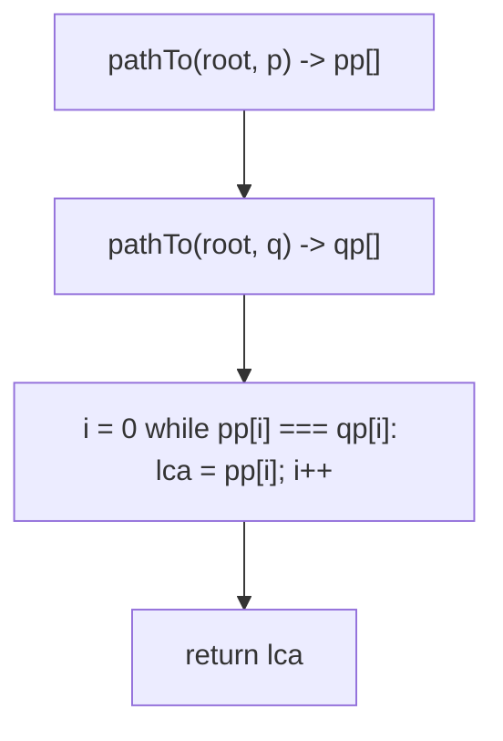
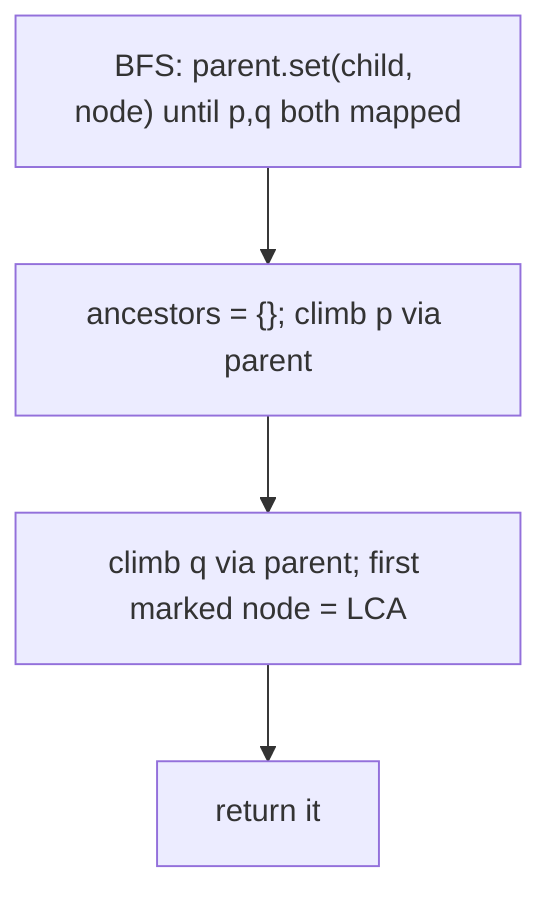
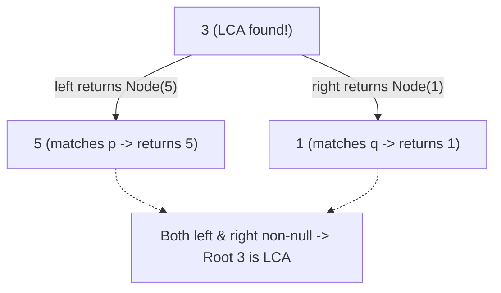

# 236. Lowest Common Ancestor of a Binary Tree

- **LeetCode Link**: `https://leetcode.com/problems/lowest-common-ancestor-of-a-binary-tree/`
- **Difficulty**: Medium
- **Pattern Category**: Binary Tree / Ancestor Convergence
- **Prerequisite Primer**: `00-foundations/03-core-algorithmic-patterns.md`

---

## 1. Problem Overview & Edge Case Matrix

### Problem Statement
Given a binary tree, find the lowest common ancestor (LCA) of two given nodes `p` and `q`. The LCA is the lowest node that has both `p` and `q` as descendants (a node can be a descendant of itself).

```
Example 1:
Input: root = [3,5,1,6,2,0,8,null,null,7,4], p = 5, q = 1
Output: 3

Example 2:
Input: root = [3,5,1,6,2,0,8,null,null,7,4], p = 5, q = 4
Output: 5
Explanation: 5 is an ancestor of 4, so the LCA is 5 itself.

Example 3:
Input: root = [1,2], p = 1, q = 2
Output: 1
```

### Visual Problem Representation
```
            3
          /   \
         5     1              LCA(5,1) = 3  (paths diverge here)
        / \   / \             LCA(5,4) = 5  (one contains the other)
       6  2  0   8
         / \
        7   4
```

### Upfront Edge Case Matrix
| Edge Case Category | Specific Input Scenario | Expected Behavior | Pitfall / Risk |
| :--- | :--- | :--- | :--- |
| Ancestor pair | `p = 5`, `q = 4` (5 above 4) | Return `5` | Returning the parent instead of self |
| Root involved | `p = 1` (root), `q = 2` | Return `1` | Base case ordering (root check first) |
| Same subtree | Both deep in left | Correct deep LCA | Bubbling up too far |
| Skewed tree | Chain of $10^4$ | Correct LCA | Recursion depth on degenerate input |
| Identity by reference | Duplicate values elsewhere | Match by node identity | Comparing `.val` instead of `===` |

---

## 2. Level 1: Brute Force Approach

### Intuition & Visual Idea
Find the root-to-`p` and root-to-`q` paths (arrays of node references), then walk both from the root while they agree — the last common node is the LCA. Two searches plus a linear scan; transparent and correct.



### Pseudocode
```text
FUNCTION pathTo(node, target, path):
    IF node NULL: RETURN false
    path.PUSH(node)
    IF node === target: RETURN true
    IF pathTo(node.left, target, path) OR pathTo(node.right, target, path): RETURN true
    path.POP(); RETURN false

FUNCTION lowestCommonAncestorBruteForce(root, p, q):
    pp = []; pathTo(root, p, pp)
    qp = []; pathTo(root, q, qp)
    lca = NULL
    FOR i IN 0 .. MIN(pp.LENGTH, qp.LENGTH) - 1:
        IF pp[i] !== qp[i]: BREAK
        lca = pp[i]
    RETURN lca
```

### Step-by-Step Dry Run (Visual Trace)
| Step | Iteration / Pointer ($i, j$) | Current Value | State / Sub-array | Action Taken |
| :--- | :--- | :--- | :--- | :--- |
| 0 | `pathTo(5)` | `[3,5]` | DFS records path | Push/pop backtrack |
| 1 | `pathTo(1)` | `[3,1]` | DFS records path | — |
| 2 | `i=0` | `3 === 3` | Agree | `lca = 3` |
| 3 | `i=1` | `5 !== 1` | Diverge, break | Return `3` |

### Modern JavaScript Implementation
```javascript
/**
 * Shared backbone: LeetCode provides TreeNode; defined once here so every
 * level below is locally runnable when concatenated (Level 1 + 2 + 3).
 * Time Complexity:  n/a (scaffolding)
 * Space Complexity: n/a (scaffolding)
 */
class TreeNode {
  constructor(val, left = null, right = null) {
    this.val = val;
    this.left = left;
    this.right = right;
  }
}

function arrayToTree(arr) {
  if (arr.length === 0 || arr[0] === null || arr[0] === undefined) return null;
  const root = new TreeNode(arr[0]);
  const queue = [root];
  let i = 1;
  while (i < arr.length) {
    const node = queue.shift();
    if (i < arr.length && arr[i] !== null && arr[i] !== undefined) {
      node.left = new TreeNode(arr[i]);
      queue.push(node.left);
    }
    i++;
    if (i < arr.length && arr[i] !== null && arr[i] !== undefined) {
      node.right = new TreeNode(arr[i]);
      queue.push(node.right);
    }
    i++;
  }
  return root;
}

function findNode(root, val) {
  // Test helper: first node with matching value (BFS).
  if (root === null) return null;
  const queue = [root];
  while (queue.length > 0) {
    const node = queue.shift();
    if (node.val === val) return node;
    if (node.left !== null) queue.push(node.left);
    if (node.right !== null) queue.push(node.right);
  }
  return null;
}

function pathToNode(node, target, path) {
  // Shared helper: root-to-target path by IDENTITY (===), not value.
  if (node === null) return false;
  path.push(node);
  if (node === target) return true;
  if (pathToNode(node.left, target, path) || pathToNode(node.right, target, path)) return true;
  path.pop(); // backtrack: this subtree does not contain target
  return false;
}

/**
 * Level 1: Brute Force (root paths + last common node)
 * Time Complexity:  O(N) — two searches plus path scan
 * Space Complexity: O(H) — two root paths plus recursion stacks
 */
function lowestCommonAncestorBruteForce(root, p, q) {
  const pp = [];
  const qp = [];
  pathToNode(root, p, pp);
  pathToNode(root, q, qp);
  // Walk from the root while both paths agree; the last match is the LCA.
  let lca = null;
  const shared = Math.min(pp.length, qp.length);
  for (let i = 0; i < shared && pp[i] === qp[i]; i++) lca = pp[i];
  return lca;
}
```

### Complexity Breakdown
- **Time Complexity**: $O(N)$ — two full searches worst case.
- **Space Complexity**: $O(H)$ — path arrays; the ancestor logic needs no paths at all.

---

## 3. Level 2: Optimized Approach

### Intuition & Visual Bottleneck Elimination
One BFS builds a parent map for every node; then climb from `p` marking ancestors, and climb from `q` until hitting a marked node. Iterative, no recursion, single traversal — $O(N)$ space for the map.



### Pseudocode
```text
FUNCTION lowestCommonAncestorParentMap(root, p, q):
    parent = MAP(root -> NULL)
    stack = [root]
    WHILE NOT parent HAS p OR NOT parent HAS q:
        node = stack.POP()
        IF node.left: parent.SET(node.left, node); stack.PUSH(node.left)
        IF node.right: parent.SET(node.right, node); stack.PUSH(node.right)
    ancestors = EMPTY SET
    FOR c = p; c NOT NULL; c = parent.GET(c): ancestors.ADD(c)
    FOR c = q; c NOT NULL; c = parent.GET(c):
        IF ancestors HAS c: RETURN c
```

### Step-by-Step Dry Run (Visual Trace)
| Step | Pointers / Window | Hash Map / Auxiliary State | Decision Logic | Output Accumulator |
| :--- | :--- | :--- | :--- | :--- |
| 0 | BFS maps parents | `parent(5)=3`, `parent(1)=3` | Both found, stop early | Map partial |
| 1 | climb from `5` | `ancestors = {5, 3}` | Reach root | Marked |
| 2 | climb from `1` | `1` unmarked, then `3` | `3` marked! | Return `3` |

### Modern JavaScript Implementation
```javascript
/**
 * Level 2: Optimized (parent map + ancestor climb)
 * Time Complexity:  O(N) — one BFS plus two climbs
 * Space Complexity: O(N) — parent map for visited nodes
 */
// TreeNode shared from Level 1.
function lowestCommonAncestorParentMap(root, p, q) {
  const parent = new Map([[root, null]]);
  const stack = [root];
  // Stop the BFS the moment BOTH targets are mapped (often early).
  while (!parent.has(p) || !parent.has(q)) {
    const node = stack.pop();
    if (node.left !== null) {
      parent.set(node.left, node);
      stack.push(node.left);
    }
    if (node.right !== null) {
      parent.set(node.right, node);
      stack.push(node.right);
    }
  }
  const ancestors = new Set();
  for (let c = p; c !== null; c = parent.get(c)) ancestors.add(c);
  // First q-ancestor also above p is the lowest common one.
  for (let c = q; c !== null; c = parent.get(c)) {
    if (ancestors.has(c)) return c;
  }
  return null; // unreachable per spec (both nodes guaranteed present)
}
```

### Complexity Breakdown
- **Time Complexity**: $O(N)$ — BFS plus two rootward climbs.
- **Space Complexity**: $O(N)$ — parent map; Level 3 needs none of it.

---

## 4. Level 3: Most Optimal / Canonical Approach

### Intuition & Mathematical / Invariant Proof
Bottom-up truth bubbling: each call returns "the LCA if fully determined in this subtree, else the single target found below (or null)". A node is the answer iff left and right both report non-null (targets split across sides) — or it IS a target (ancestor case, reported upward). Three base/combine lines cover every configuration; each node visited once with $O(1)$ work.

```
LCA(5,4): node 2 gets left=null? no: left subtree (7) null, right (4) non-null -> returns 4;
          node 5: root===p -> returns 5 (ancestor case, never even consults children)
```

Wait — trace ex.2 correctly: `LCA(5-subtree...)`: call on node 5: `root === p` fires immediately → returns 5. The top call on 3: left returns 5, right returns null → returns 5. ✓ The ancestor case short-circuits at the target itself.

### Pseudocode
```text
FUNCTION lowestCommonAncestor(node, p, q):
    IF node NULL OR node === p OR node === q: RETURN node
    left = lowestCommonAncestor(node.left, p, q)
    right = lowestCommonAncestor(node.right, p, q)
    IF left NOT NULL AND right NOT NULL: RETURN node  // split => this is LCA
    RETURN left ?? right                              // bubble up what was found
```

### Step-by-Step Dry Run (Visual Trace)
| Step | Pointer $L$ | Pointer $R$ | Invariant Checked | In-Place State |
| :--- | :--- | :--- | :--- | :--- |
| 1 | ex.1: node `5` | `5 === p` fires at once | Ancestor short-circuit | Returns `5` |
| 2 | node `1` | `1 === q` | Returns `1` | Right result `1` |
| 3 | node `3` | left `5`, right `1` | Both non-null → split | Return `3` |
| 4 | ex.2: `p=5, q=4` | node `5 === p` | Ancestor short-circuit | Returns `5` upward |

### Modern JavaScript Implementation
```javascript
/**
 * Level 3: Most Optimal / Canonical (bottom-up bubbling)
 * Time Complexity:  O(N) — one visit per node, optimal lower bound
 * Space Complexity: O(H) — call stack depth equals height
 */
// TreeNode shared from Level 1.
function lowestCommonAncestor(root, p, q) {
  // Null: nothing found here. Target hit: report it upward immediately.
  if (root === null || root === p || root === q) return root;
  const left = lowestCommonAncestor(root.left, p, q);
  const right = lowestCommonAncestor(root.right, p, q);
  // Targets split across sides => this node is their lowest meeting point.
  if (left !== null && right !== null) return root;
  return left ?? right; // otherwise bubble up whichever side found something
}
```

### Complexity Breakdown
- **Time Complexity**: $O(N)$ — optimal lower bound; both targets could hide anywhere.
- **Space Complexity**: $O(H)$ — implicit stack only; no maps, no paths.

---

## 5. JavaScript-Specific Gotchas & V8 Optimizations
- **GC Pressure**: Avoid allocating objects inside tight loops ($O(N)$ closures). Level 2's parent map ($N$ entries) plus ancestor set are the pressure Level 3 removes — its frames carry two references each.
- **Type Coercion / Sorting**: Compare nodes by IDENTITY (`===` on objects), never by `.val` — duplicate values (`[3,5,1,...]`-style trees reuse small ints) make value comparison return the wrong node. The harness's `findNode` is test-only scaffolding, not solution logic.
- **Index Bounds**: `left ?? right` (not `||`) — `||` would skip legitimate falsy node values if nodes were ever falsy; with objects both work, but `??` states "null-only fallback" precisely. Guard `p`/`q` non-null at the boundary in production wrappers.

---

## 6. Real-World MAANG Interview Follow-Ups & Extensions

### Follow-Up 1: K nodes and repeated queries (LCA batching)
- **Scenario**: Find the LCA of $K$ targets, or answer $10^5$ queries on a static tree.
- **Solution Strategy**: $K$-LCA = fold pairwise LCA (associative); repeated queries → binary lifting table ($O(N \log N)$ preprocess, $O(\log N)$ per query) or Euler-tour + RMQ.
- **JS Code / Implementation Pattern**:
```javascript
function lcaOfMany(root, targets) {
  return targets.reduce((a, b) => lowestCommonAncestor(root, a, b));
}
```

### Follow-Up 2: LCA with parent pointers (or BST ordering)
- **Scenario**: Nodes expose `.parent`, or the tree is a BST.
- **Solution Strategy**: Parents → climb-and-mark (Level 2 without the BFS); BST → walk down by value comparison ($O(H)$, no full traversal).
- **JS Code / Implementation Pattern**:
```javascript
function lcaBST(root, p, q) {
  let cur = root;
  while (cur) {
    if (p.val < cur.val && q.val < cur.val) cur = cur.left;
    else if (p.val > cur.val && q.val > cur.val) cur = cur.right;
    else return cur; // split (or hit) => lowest common ancestor
  }
  return null;
}
```

### Follow-Up 3: Distributed tree with $10^9$ nodes
- **Scenario & In-Depth Solution**: Subtrees live on different shards; shipping them is infeasible. Each shard reports "which targets (if any) it contains" upward; the coordinator's Level 3 combine runs on shard summaries, fetching deeper only along ambiguous paths. One summary round-trip per level in the common case.
```javascript
async function lcaDistributed(shardRoots, p, q) {
  const hits = await Promise.all(shardRoots.map((s) => s.contains(p, q)));
  return combineSummaries(hits); // same split/ancestor logic on summaries
}
```

---

## 7. What LeetCode Discuss Says (Language-Independent)

Source: top-voted post by Stefan Pochmann —
`https://leetcode.com/problems/lowest-common-ancestor-of-a-binary-tree/solutions/65225/4-lines-c-java-python-ruby/`
— 321.9K views.
Language-independent summary. No new JS here.

### A. Optimal way from Discuss (Generalized Postorder Bubble-Up)

The algorithm generalizes the function's return contract:
- If both `p` and `q` exist in `root`'s subtree, return their Lowest Common Ancestor.
- If only one of `p` or `q` is present, return that specific node.
- If neither is present, return `null`.

1. **Base Case:** If `root == null` or `root == p` or `root == q`, return `root` immediately.
2. **Recursive Descent:** Query both left and right subtrees:
   - `left = lowestCommonAncestor(root.left, p, q)`
   - `right = lowestCommonAncestor(root.right, p, q)`
3. **Combine / Bubble Up:**
   - If both `left != null` and `right != null`, `p` resides in one branch and `q` resides in the other — therefore, `root` is their Lowest Common Ancestor.
   - If only one side returns non-null, bubble that non-null node upward.
   - If both are null, return `null`.

```text
FUNCTION lowestCommonAncestor(root, p, q):
    IF root == null OR root == p OR root == q:
        RETURN root

    left = lowestCommonAncestor(root.left, p, q)
    right = lowestCommonAncestor(root.right, p, q)

    IF left != null AND right != null:
        RETURN root

    IF left != null:
        RETURN left
    ELSE:
        RETURN right
```

- Time: O(N) where N is the number of nodes, traversing each node at most once.
- Space: O(H) auxiliary space for recursion call stack ($O(\log N)$ balanced, $O(N)$ skewed).



### B. Dry run on LeetCode Example 1 (`p = 5, q = 1`)

- Root 3 recurses into left child 5.
- At node 5: `root == p` (5 == 5) -> returns `Node(5)` immediately without searching deeper.
- Root 3 recurses into right child 1.
- At node 1: `root == q` (1 == 1) -> returns `Node(1)` immediately.
- Back at Root 3:
  - `left = Node(5)` (non-null)
  - `right = Node(1)` (non-null)
  - Both non-null condition triggers -> returns `Node(3)`.

Result: `Node(3)`.

### C. Why Tri-State Bubble-Up Beats Explicit Path Tracing

- **Zero Memory Allocation:** Finding path vectors from root to `p` and root to `q` allocates two path arrays and requires finding their divergence index.
- Postorder bubbling discovers the ancestor dynamically as activation frames unwind, needing only $O(1)$ memory per recursion frame.

### D. Pitfalls from comments

- **The Ancestor-Child Shortcut:** If `p` is the ancestor of `q`, returning `root` immediately when `root == p` skips searching for `q`. This is fully sound on LeetCode because both `p` and `q` are guaranteed to exist. (If a target could be missing, a post-traversal count check is needed).
- **Identity vs Value comparison:** Check node identity/pointers (`root == p`), not `root.val == p.val`, to avoid collisions if duplicate node values were permitted.

### E. Companies

- Discuss post itself names none.
  Companies tab on LeetCode is premium-locked.
- External source:
  `https://github.com/liquidslr/leetcode-company-wise-problems`
  (LeetCode company tags, updated June 2025).
- All-time (65): Adobe, Amazon, Apple, Bloomberg, Cisco, Google, Meta, Microsoft, Oracle, Spotify, Uber, etc.
- Recent: 30 days — Amazon, Bloomberg, Meta.
- Recent: 3 months — Amazon, Apple, Bloomberg, Google, Meta, Microsoft.
