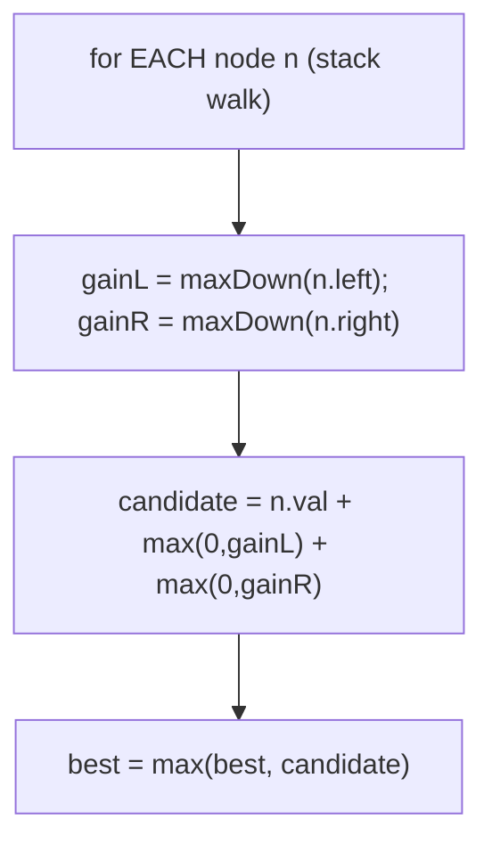
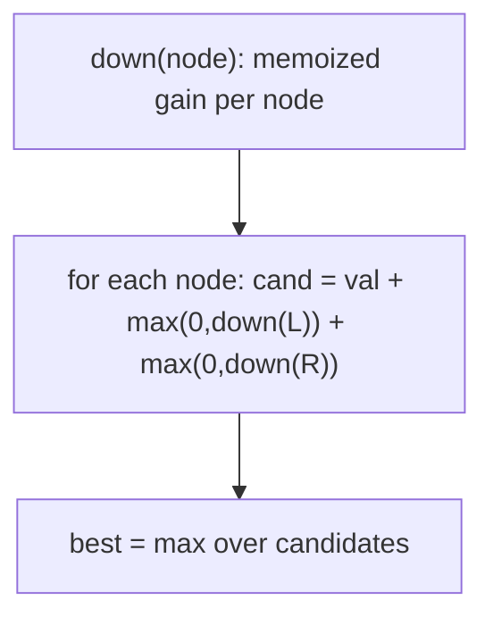
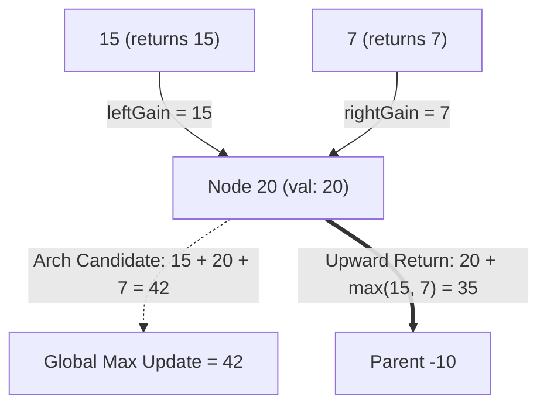

# 124. Binary Tree Maximum Path Sum

- **LeetCode Link**: `https://leetcode.com/problems/binary-tree-maximum-path-sum/`
- **Difficulty**: Hard
- **Pattern Category**: Binary Tree / Global-Max Post-Order Gains
- **Prerequisite Primer**: `00-foundations/03-core-algorithmic-patterns.md`

---

## 1. Problem Overview & Edge Case Matrix

### Problem Statement
A path in a binary tree is a sequence of nodes where each pair of adjacent nodes in the sequence has an edge connecting them. A node can only appear in the sequence at most once. The path does not need to pass through the root. The path sum is the sum of the node's values in the path. Given the `root` of a binary tree, return the maximum path sum of any non-empty path.

```
Example 1:
Input: root = [1,2,3]
Output: 6
Explanation: The optimal path is 2 -> 1 -> 3 with sum 6.

Example 2:
Input: root = [-10,9,20,null,null,15,7]
Output: 42
Explanation: The optimal path is 15 -> 20 -> 7 with sum 42.
```

### Visual Problem Representation
```
        -10
        /  \
       9    20            best THROUGH -10: 9 + (-10) + 35 = 34
           /  \           best THROUGH 20: 15 + 20 + 7 = 42  <- answer
          15   7          best downward from 20: 20 + 15 = 35 (returned up)
```

### Upfront Edge Case Matrix
| Edge Case Category | Specific Input Scenario | Expected Behavior | Pitfall / Risk |
| :--- | :--- | :--- | :--- |
| Single Element | `[-3]` | Return `-3` | `Math.max(0, ...)` clamping the ANSWER to 0 |
| All negative | `[-3,-1,-2]` | Return `-1` (least bad node) | Initializing best to `0` |
| Path avoids root | Ex.2 (best inside right subtree) | Return `42` | Only tracking root-passing paths |
| Path is one side | `[2,-1]` | Return `2` (node alone) | Forcing both arms into every candidate |
| Skewed chain | $10^4$ negatives | Correct max single node | Recursion depth + clamp bugs combined |

---

## 2. Level 1: Brute Force Approach

### Intuition & Visual Idea
Every node is a candidate "top" of the path: compute the best downward gain from each child by fresh recursion, take `val + left + right` (clamped at zero), and keep the global best across all nodes. Correct — and recomputes every subtree gain for every ancestor: $O(N^2)$.



### Pseudocode
```text
FUNCTION maxDownFrom(node):   // best downward path STARTING at node
    IF node NULL: RETURN 0
    RETURN node.val + MAX(0, maxDownFrom(node.left), maxDownFrom(node.right))

FUNCTION maxPathSumBruteForce(root):
    best = -Infinity
    stack = [root]
    WHILE stack NOT EMPTY:
        n = stack.POP()
        cand = n.val + MAX(0, maxDownFrom(n.left)) + MAX(0, maxDownFrom(n.right))
        best = MAX(best, cand)
        PUSH live children
    RETURN best
```

### Step-by-Step Dry Run (Visual Trace)
| Step | Iteration / Pointer ($i, j$) | Current Value | State / Sub-array | Action Taken |
| :--- | :--- | :--- | :--- | :--- |
| 0 | node `1` (ex.1) | gains `2`, `3` | candidate `1+2+3 = 6` | `best = 6` |
| 1 | node `2` | gains `0, 0` | candidate `2` | `best` stays `6` |
| 2 | node `3` | candidate `3` | — | `best` stays `6` |
| 3 | return | — | — | Return `6` |

### Modern JavaScript Implementation
```javascript
/**
 * Shared backbone: LeetCode provides TreeNode; defined once here so every
 * level below is locally runnable when concatenated (Level 1 + 2 + 3).
 * Time Complexity:  n/a (scaffolding)
 * Space Complexity: n/a (scaffolding)
 */
class TreeNode {
  constructor(val, left = null, right = null) {
    this.val = val;
    this.left = left;
    this.right = right;
  }
}

function arrayToTree(arr) {
  if (arr.length === 0 || arr[0] === null || arr[0] === undefined) return null;
  const root = new TreeNode(arr[0]);
  const queue = [root];
  let i = 1;
  while (i < arr.length) {
    const node = queue.shift();
    if (i < arr.length && arr[i] !== null && arr[i] !== undefined) {
      node.left = new TreeNode(arr[i]);
      queue.push(node.left);
    }
    i++;
    if (i < arr.length && arr[i] !== null && arr[i] !== undefined) {
      node.right = new TreeNode(arr[i]);
      queue.push(node.right);
    }
    i++;
  }
  return root;
}

function maxDownFrom(node) {
  // Best downward path STARTING at node (may extend to one side only).
  if (node === null) return 0;
  return node.val + Math.max(0, maxDownFrom(node.left), maxDownFrom(node.right));
}

/**
 * Level 1: Brute Force (every node as path top)
 * Time Complexity:  O(N^2) — fresh gain recursion per node
 * Space Complexity: O(H) — recursion depth
 */
function maxPathSumBruteForce(root) {
  // -Infinity seed: all-negative trees must return the least-bad NODE.
  let best = -Infinity;
  const stack = [root];
  while (stack.length > 0) {
    const node = stack.pop();
    // Best path TOPPED at this node: value plus non-negative arms.
    const candidate = node.val
      + Math.max(0, maxDownFrom(node.left))
      + Math.max(0, maxDownFrom(node.right));
    if (candidate > best) best = candidate;
    if (node.left !== null) stack.push(node.left);
    if (node.right !== null) stack.push(node.right);
  }
  return best;
}
```

### Complexity Breakdown
- **Time Complexity**: $O(N^2)$ — each node's gain recursion re-walks its whole subtree.
- **Space Complexity**: $O(H)$ — stack depth; time is the failure.

---

## 3. Level 2: Optimized Approach

### Intuition & Visual Bottleneck Elimination
Memoize each node's downward gain so it's computed once: first fill `gain(node)` bottom-up with memoized recursion, then evaluate every topped candidate in a second walk. $O(N)$ time — at the cost of an $N$-entry map.



### Pseudocode
```text
FUNCTION maxPathSumMemo(root):
    gain = EMPTY MAP
    DEFINE down(node):
        IF node NULL: RETURN 0
        IF gain HAS node: RETURN gain.GET(node)
        g = node.val + MAX(0, down(node.left), down(node.right))
        gain.SET(node, g); RETURN g
    best = -Infinity
    stack = [root]
    WHILE stack NOT EMPTY:
        n = stack.POP()
        best = MAX(best, n.val + MAX(0, down(n.left)) + MAX(0, down(n.right)))
        PUSH live children
    RETURN best
```

### Step-by-Step Dry Run (Visual Trace)
| Step | Pointers / Window | Hash Map / Auxiliary State | Decision Logic | Output Accumulator |
| :--- | :--- | :--- | :--- | :--- |
| 0 | `down(15)`, `down(7)` | memo `{15:15, 7:7}` | Leaves | Gains cached |
| 1 | `down(20)` | `20 + 15 + 7` arms | `gain = 35` | Memoized |
| 2 | scan node `20` | candidate `15+20+7 = 42` | `best = 42` | Best found |
| 3 | scan node `-10` | candidate `9-10+35 = 34` | Below best | Return `42` |

### Modern JavaScript Implementation
```javascript
/**
 * Level 2: Optimized (memoized gains + candidate scan)
 * Time Complexity:  O(N) — each gain computed once
 * Space Complexity: O(N) — gain map plus recursion stack
 */
// TreeNode + maxDownFrom shared from Level 1 (maxDownFrom unused here).
function maxPathSumMemo(root) {
  const gain = new Map(); // node -> best downward path starting at node
  function down(node) {
    if (node === null) return 0;
    if (gain.has(node)) return gain.get(node); // computed once, reused
    const g = node.val + Math.max(0, down(node.left), down(node.right));
    gain.set(node, g);
    return g;
  }
  let best = -Infinity;
  const stack = [root];
  while (stack.length > 0) {
    const node = stack.pop();
    const candidate = node.val + Math.max(0, down(node.left)) + Math.max(0, down(node.right));
    if (candidate > best) best = candidate;
    if (node.left !== null) stack.push(node.left);
    if (node.right !== null) stack.push(node.right);
  }
  return best;
}
```

### Complexity Breakdown
- **Time Complexity**: $O(N)$ — memoization collapses the recomputation.
- **Space Complexity**: $O(N)$ — gain map; Level 3 folds the scan into the same recursion.

---

## 4. Level 3: Most Optimal / Canonical Approach

### Intuition & Mathematical / Invariant Proof
Single post-order pass doing double duty: `gain(node)` returns the best downward path starting at `node` (for the parent's use) while updating a closure `best` with the best path TOPPED at `node` (for the answer). Clamping `max(0, ...)` prunes loss-making arms from gains but NEVER from `best`'s seed (`-Infinity` preserves all-negative answers). Every node does $O(1)$ work once — $O(N)$ time, $O(H)$ space, no map, no second walk.

```
gain(15) = 15, gain(7) = 7
gain(20) = 20 + 15 = 35 (returns up); best = max(-inf, 15+20+7) = 42
gain(9) = 9; gain(-10) = -10 + max(0, 9, 35) = 25 (returns, unused)
best stays 42
```

### Pseudocode
```text
FUNCTION maxPathSum(root):
    best = -Infinity
    DEFINE gain(node):
        IF node NULL: RETURN 0
        l = MAX(0, gain(node.left)); r = MAX(0, gain(node.right))
        best = MAX(best, node.val + l + r)   // path TOPPED here
        RETURN node.val + MAX(l, r)          // best path STARTING here
    gain(root)
    RETURN best
```

### Step-by-Step Dry Run (Visual Trace)
| Step | Pointer $L$ | Pointer $R$ | Invariant Checked | In-Place State |
| :--- | :--- | :--- | :--- | :--- |
| 1 | `gain(9) = 9` | leaf | `best = max(-inf, 9) = 9` | Returns `9` |
| 2 | `gain(15) = 15`, `gain(7) = 7` | leaves | `best = 15` | Return up |
| 3 | `gain(20)` | `l=15, r=7` | `best = max(15, 42) = 42` | Returns `35` |
| 4 | `gain(-10)` | `l=9, r=35` | `best = max(42, 34) = 42` | Return `42` |

### Modern JavaScript Implementation
```javascript
/**
 * Level 3: Most Optimal / Canonical (post-order gains + global best)
 * Time Complexity:  O(N) — O(1) work per node, optimal lower bound
 * Space Complexity: O(H) — call stack depth equals height
 */
// TreeNode shared from Level 1.
function maxPathSum(root) {
  // -Infinity (NOT 0): a lone -3 must beat "no path".
  let best = -Infinity;
  function gain(node) {
    if (node === null) return 0;
    // Clamp negative arms to 0: extending into loss never helps the PARENT.
    const left = Math.max(0, gain(node.left));
    const right = Math.max(0, gain(node.right));
    // Path topped HERE uses both arms; the global answer may live anywhere.
    if (node.val + left + right > best) best = node.val + left + right;
    // Upward we can only extend ONE arm (a path never forks upward).
    return node.val + Math.max(left, right);
  }
  gain(root);
  return best;
}
```

### Complexity Breakdown
- **Time Complexity**: $O(N)$ — optimal lower bound; each node's value participates in exactly one topped candidate.
- **Space Complexity**: $O(H)$ — implicit stack; the closure `best` is the only extra state.

---

## 5. JavaScript-Specific Gotchas & V8 Optimizations
- **GC Pressure**: Avoid allocating objects inside tight loops ($O(N)$ closures). Level 2's $N$-entry `Map` is the pressure Level 3 removes — its frames carry numbers only.
- **Type Coercion / Sorting**: `-Infinity` seed and comparisons are exact for integers; NEVER seed `best = 0` (all-negative trap) and NEVER clamp the topped candidate with `Math.max(0, ...)` — clamping applies to arm GAINS only.
- **Index Bounds**: No indices, but the fork rule is the equivalent trap: returning `val + left + right` upward builds a forked "path" that isn't a path — upward returns exactly one arm, always.

---

## 6. Real-World MAANG Interview Follow-Ups & Extensions

### Follow-Up 1: Return the actual path, not just the sum
- **Scenario**: Reconstruct the node list achieving the max sum.
- **Solution Strategy**: Track `bestTop` node plus, per node, which arms were taken (parent pointers or choice flags); backtrack from `bestTop` down both winning arms.
- **JS Code / Implementation Pattern**:
```javascript
function maxPathWithNodes(root) {
  let best = { sum: -Infinity, top: null };
  function gain(node) {
    if (!node) return { sum: 0, path: [] };
    const l = gain(node.left), r = gain(node.right);
    const lPos = Math.max(0, l.sum), rPos = Math.max(0, r.sum);
    if (node.val + lPos + rPos > best.sum) best = { sum: node.val + lPos + rPos, top: node };
    return lPos >= rPos
      ? { sum: node.val + lPos, path: [node, ...l.path] }
      : { sum: node.val + rPos, path: [node, ...r.path] };
  }
  gain(root);
  return best;
}
```

### Follow-Up 2: K-divisible / constrained max path
- **Scenario**: Path sum must be divisible by $K$ (or satisfy a predicate).
- **Solution Strategy**: Gains become residue-indexed: per node keep best downward sum per `mod K`; combine arms by complementary residues. $O(N·K)$ time.
- **JS Code / Implementation Pattern**:
```javascript
function maxPathDivisibleK(root, K) {
  // per-node: best downward sum for each residue class mod K
  return combineResidues(root, K);
}
```

### Follow-Up 3: $10^9$-node tree with parallel subtree evaluation
- **Scenario & In-Depth Solution**: Shards own subtrees; gains compose bottom-up, so evaluate shards in parallel and combine at boundaries: each shard returns its root gain plus its internal best; the parent combines exactly like Level 3's two lines. One round-trip per tree level.
```javascript
async function maxPathDistributed(shardRoots) {
  const reports = await Promise.all(shardRoots.map((s) => s.evaluate()));
  return reports.reduce((best, r) => Math.max(best, r.internalBest, combineGains(r)), -Infinity);
}
```

---

## 7. What LeetCode Discuss Says (Language-Independent)

Source: top-voted post by Wei-Bung Wang —
`https://leetcode.com/problems/binary-tree-maximum-path-sum/solutions/39775/accepted-short-solution-in-java/`
— 184.1K views.
Language-independent summary. No new JS here.

### A. Optimal way from Discuss (Apex Arch vs Upward Extension Invariant)

Every simple path in a binary tree has a unique highest node (the "apex" or LCA of the path), from which it extends down into at most two branches:

1. **Global Maximum vs Return Value Separation:**
   - **Apex Path (Arch):** At `node`, a complete path can bridge across both children: `node.val + leftGain + rightGain`. This candidate updates the global maximum.
   - **Upward Extension:** To extend upward into `node`'s parent, the path can only continue along **one** child branch: `node.val + max(leftGain, rightGain)`.
2. **Negative Gain Pruning:** If a child's contribution is negative, discard it by clamping with `max(0, gain)`.
3. **Initialization:** Initialize global maximum to $-\infty$ to handle trees with exclusively negative values.

```text
CLASS Solution:
    maxSum = -INFINITY

    FUNCTION maxPathSum(root):
        maxSum = -INFINITY
        maxGain(root)
        RETURN maxSum

    FUNCTION maxGain(node):
        IF node == null:
            RETURN 0

        // Discard negative branch contributions
        leftGain = max(0, maxGain(node.left))
        rightGain = max(0, maxGain(node.right))

        // Peak path through this node (candidate for global max)
        currentArch = node.val + leftGain + rightGain
        maxSum = max(maxSum, currentArch)

        // Return single maximum arm extendable to parent
        RETURN node.val + max(leftGain, rightGain)
```

- Time: O(N) where N is the number of nodes, visiting each node once during postorder traversal.
- Space: O(H) auxiliary space on the recursion stack ($O(\log N)$ balanced, $O(N)$ skewed).



### B. Dry run on LeetCode Example 2 (`root = [-10,9,20,null,null,15,7]`)

- Postorder descent reaches leaf 9: returns $9 + 0 = 9$, `maxSum` = 9.
- Subtree at 20:
  - Leaf 15: returns $15 + 0 = 15$, `maxSum` = 15.
  - Leaf 7: returns $7 + 0 = 7$, `maxSum` remains 15.
  - At node 20:
    - `leftGain = max(0, 15) = 15`
    - `rightGain = max(0, 7) = 7`
    - Arch candidate: $20 + 15 + 7 = 42$ -> `maxSum` becomes **42**.
    - Returns upward to parent: $20 + \max(15, 7) = 35$.
- At root -10:
  - `leftGain = max(0, 9) = 9`
  - `rightGain = max(0, 35) = 35`
  - Arch candidate: $-10 + 9 + 35 = 34$ ($34 < 42$, `maxSum` stays 42).
  - Returns upward: $-10 + 35 = 25$.

Final result: `42`.

### C. Why Clamping with max(0, ...) Prevents Combinatorial Explosion

- Instead of evaluating whether to include or exclude each branch across multiple conditionals, clamping with `max(0, gain)` inherently isolates optimal subpaths: negative subtree sums contribute 0 (effectively cutting the branch off).

### D. Pitfalls from comments

- **Initializing `maxSum = 0`:** If the tree contains only negative numbers (e.g. `[-3]`), starting with 0 returns 0 instead of -3. Always initialize to negative infinity.
- **Returning the arch sum:** Returning `node.val + left + right` to the parent creates a path that branches twice, which violates the definition of a simple graph path. Only a single child branch can be returned upward.

### E. Companies

- Discuss post itself names none.
  Companies tab on LeetCode is premium-locked.
- External source:
  `https://github.com/liquidslr/leetcode-company-wise-problems`
  (LeetCode company tags, updated June 2025).
- All-time (67): Adobe, Amazon, Apple, Bloomberg, Cisco, Google, Meta, Microsoft, Oracle, Spotify, Uber, etc.
- Recent: 30 days — Amazon, Bloomberg, Meta.
- Recent: 3 months — Amazon, Apple, Bloomberg, Google, Meta, Microsoft.
