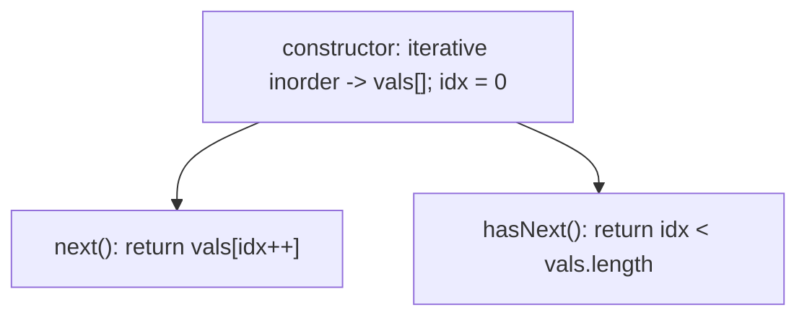
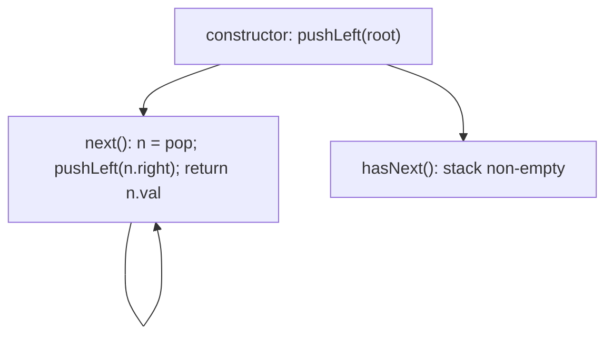

# 173. Binary Search Tree Iterator

- **LeetCode Link**: `https://leetcode.com/problems/binary-search-tree-iterator/`
- **Difficulty**: Medium
- **Pattern Category**: Binary Tree / Controlled Inorder Traversal
- **Prerequisite Primer**: `00-foundations/03-core-algorithmic-patterns.md`

---

## 1. Problem Overview & Edge Case Matrix

### Problem Statement
Implement the `BSTIterator` class that represents an iterator over the in-order traversal of a binary search tree (BST):

- `BSTIterator(TreeNode root)` initializes the iterator.
- `boolean hasNext()` returns `true` if there exists a number in the traversal to the right of the pointer, otherwise `false`.
- `int next()` moves the pointer to the right, then returns the number at the pointer.

`next()` and `hasNext()` must run in average $O(1)$ time with $O(h)$ memory, where $h$ is the tree height.

```
Example 1:
Input: ["BSTIterator","next","next","hasNext","next","hasNext","next","hasNext"]
       [[[7,3,15,null,null,9,20]],[],[],[],[],[],[],[]]
Output: [null,3,7,true,9,true,20,false]
```

### Visual Problem Representation
```
        7
       / \
      3   15          inorder: 3, 7, 9, 15, 20
         /  \         iterator yields them one by one,
        9   20        pausing between calls with O(h) state
```

### Upfront Edge Case Matrix
| Edge Case Category | Specific Input Scenario | Expected Behavior | Pitfall / Risk |
| :--- | :--- | :--- | :--- |
| Empty / Nil | `root = null` | `hasNext() = false` | `next()` on empty (spec never calls it) |
| Single Element | `[1]` | `next() = 1`, then exhausted | Stack empty vs value confusion |
| Skewed BST | Right-only chain | Each `next()` walks down | Amortized analysis must still hold |
| Interleaved calls | `next/hasNext` mixed | Order-independent correctness | `hasNext()` consuming state |
| Left-heavy start | Deep left spine | Constructor pushes $h$ nodes | Eager full traversal defeating laziness |

---

## 2. Level 1: Brute Force Approach

### Intuition & Visual Idea
Eagerly flatten the whole inorder sequence into an array at construction; `next()` is an index read, `hasNext()` an index bound. Trivially correct $O(1)$ ops — after paying $O(N)$ upfront and storing everything.



### Pseudocode
```text
FUNCTION BSTIteratorArray(root):
    vals = INORDER(root)  // iterative, left-root-right
    idx = 0

FUNCTION next(): idx++; RETURN vals[idx - 1]
FUNCTION hasNext(): RETURN idx < vals.LENGTH
```

### Step-by-Step Dry Run (Visual Trace)
| Step | Iteration / Pointer ($i, j$) | Current Value | State / Sub-array | Action Taken |
| :--- | :--- | :--- | :--- | :--- |
| 0 | constructor | inorder walk | `vals = [3,7,9,15,20]`, `idx = 0` | Eager $O(N)$ |
| 1 | `next()` | `vals[0]` | `idx = 1` | Return `3` |
| 2 | `next()` | `vals[1]` | `idx = 2` | Return `7` |
| 3 | `hasNext()` | `2 < 5` | — | Return `true` |

### Modern JavaScript Implementation
```javascript
/**
 * Shared backbone: LeetCode provides TreeNode; defined once here so every
 * level below is locally runnable when concatenated (Level 1 + 2 + 3).
 * Time Complexity:  n/a (scaffolding)
 * Space Complexity: n/a (scaffolding)
 */
class TreeNode {
  constructor(val, left = null, right = null) {
    this.val = val;
    this.left = left;
    this.right = right;
  }
}

function arrayToTree(arr) {
  if (arr.length === 0 || arr[0] === null || arr[0] === undefined) return null;
  const root = new TreeNode(arr[0]);
  const queue = [root];
  let i = 1;
  while (i < arr.length) {
    const node = queue.shift();
    if (i < arr.length && arr[i] !== null && arr[i] !== undefined) {
      node.left = new TreeNode(arr[i]);
      queue.push(node.left);
    }
    i++;
    if (i < arr.length && arr[i] !== null && arr[i] !== undefined) {
      node.right = new TreeNode(arr[i]);
      queue.push(node.right);
    }
    i++;
  }
  return root;
}

/**
 * Level 1: Brute Force (eager inorder snapshot)
 * Time Complexity:  O(N) construction, O(1) per next/hasNext
 * Space Complexity: O(N) — full value array
 */
class BSTIteratorArray {
  constructor(root) {
    // Iterative inorder: left spine, visit, swing right.
    this.vals = [];
    const stack = [];
    let cur = root;
    while (cur !== null || stack.length > 0) {
      while (cur !== null) {
        stack.push(cur);
        cur = cur.left;
      }
      cur = stack.pop();
      this.vals.push(cur.val);
      cur = cur.right;
    }
    this.idx = 0;
  }

  next() {
    return this.vals[this.idx++]; // caller guarantees hasNext()
  }

  hasNext() {
    return this.idx < this.vals.length;
  }
}
```

### Complexity Breakdown
- **Time Complexity**: $O(N)$ construction even if the caller takes one element; $O(1)$ per op after.
- **Space Complexity**: $O(N)$ — the snapshot; laziness is the missing property.

---

## 3. Level 2: Optimized Approach

### Intuition & Visual Bottleneck Elimination
Lazy controlled inorder: the stack holds only the current left spine ($O(h)$). Constructor pushes root's spine; `next()` pops the top (smallest unyielded), pushes the popped node's right spine, and returns its value. Each node is pushed/popped once across the whole iteration — amortized $O(1)$ per `next()`.



### Pseudocode
```text
FUNCTION BSTIteratorStack(root):
    stack = []; pushLeft(root)

DEFINE pushLeft(node):
    WHILE node NOT NULL: stack.PUSH(node); node = node.left

FUNCTION next():
    n = stack.POP(); pushLeft(n.right); RETURN n.val

FUNCTION hasNext(): RETURN stack NOT EMPTY
```

### Step-by-Step Dry Run (Visual Trace)
| Step | Pointers / Window | Hash Map / Auxiliary State | Decision Logic | Output Accumulator |
| :--- | :--- | :--- | :--- | :--- |
| 0 | constructor | spine `[7,3]` | Push left from root | Ready |
| 1 | `next()` | pop `3`, pushLeft(null) | Return `3` | Stack `[7]` |
| 2 | `next()` | pop `7`, pushLeft(`15→9`) | Return `7` | Stack `[15,9]` |
| 3 | `hasNext()` | non-empty | — | `true` |
| 4 | `next()` ×2 | `9`, then `15→20` spine | Returns `9`, `15`… | Continues |

### Modern JavaScript Implementation
```javascript
/**
 * Level 2: Optimized (lazy left-spine stack)
 * Time Complexity:  O(1) amortized per next() — each node pushed/popped once
 * Space Complexity: O(H) — stack holds one root-to-leaf path
 */
class BSTIteratorStack {
  constructor(root) {
    this.stack = [];
    this._pushLeft(root); // prime with the smallest-first spine
  }

  _pushLeft(node) {
    // Descend the left edge: every pushed node awaits its turn in order.
    while (node !== null) {
      this.stack.push(node);
      node = node.left;
    }
  }

  next() {
    const node = this.stack.pop(); // smallest unyielded value
    this._pushLeft(node.right); // its right subtree is next in order
    return node.val;
  }

  hasNext() {
    return this.stack.length > 0; // pure read: consumes nothing
  }
}
```

### Complexity Breakdown
- **Time Complexity**: $O(1)$ amortized per `next()` — $2N$ total pushes/pops across full iteration; $O(1)$ `hasNext()`.
- **Space Complexity**: $O(H)$ — one path; the spec's exact requirement.

---

## 4. Level 3: Most Optimal / Canonical Approach

### Intuition & Mathematical / Invariant Proof
Morris threading pushes space to $O(1)$: temporarily link each predecessor's `right` to the current node to remember the way back up, erasing threads on the way out. Invariant: a thread `pred.right === cur` means "cur's left subtree is fully yielded, resume at cur"; absence means "descend left first". Every edge is crossed at most 3 times — amortized $O(1)$ time, no stack, no array. The tree is bit-identical after full iteration (all threads removed).

```
next() on 7 (first call): thread 3.right -> 7? walk: cur=7,left=3:
  pred(3)=3, 3.right=null -> thread 3.right=7, cur=3
  cur=3,left=null -> yield 3, cur=3.right(thread)=7, (thread target reached next call)
```

### Pseudocode
```text
FUNCTION BSTIterator(root):
    cur = root

FUNCTION hasNext(): RETURN cur NOT NULL

FUNCTION next():
    LOOP:
        IF cur.left NULL:
            val = cur.val; cur = cur.right; RETURN val
        pred = RIGHTMOST(cur.left)
        IF pred.right NULL:
            pred.right = cur      // thread: remember the way back up
            cur = cur.left
        ELSE:
            pred.right = NULL     // erase: left subtree fully yielded
            val = cur.val; cur = cur.right; RETURN val
```

### Step-by-Step Dry Run (Visual Trace)
| Step | Pointer $L$ | Pointer $R$ | Invariant Checked | In-Place State |
| :--- | :--- | :--- | :--- | :--- |
| 1 | `next()`, `cur=7` | left `3` exists | Thread `3.right → 7` | `cur = 3` |
| 2 | `cur=3` | no left | Yield `3`, follow thread | `cur = 7`, return `3` |
| 3 | `next()`, `cur=7` | pred of left is `3`, `3.right == 7` | Thread exists → erase | Yield `7`, `cur = 15` |
| 4 | continues | threads created/erased symmetrically | Tree restored at end | `9, 15, 20…` |

### Modern JavaScript Implementation
```javascript
/**
 * Level 3: Most Optimal / Canonical (Morris threaded iterator)
 * Time Complexity:  O(1) amortized per next() — each edge crossed O(1) times
 * Space Complexity: O(1) auxiliary — threads live in the tree, then vanish
 */
class BSTIterator {
  constructor(root) {
    this.cur = root; // resume point; null means exhausted
  }

  hasNext() {
    return this.cur !== null; // pure read: consumes nothing
  }

  next() {
    let value;
    while (this.cur !== null) {
      if (this.cur.left === null) {
        // No left subtree: this node is next; advance right.
        value = this.cur.val;
        this.cur = this.cur.right;
        break;
      }
      // Predecessor: rightmost node of the left subtree.
      let pred = this.cur.left;
      while (pred.right !== null && pred.right !== this.cur) pred = pred.right;
      if (pred.right === null) {
        pred.right = this.cur; // thread up: left subtree not yet yielded
        this.cur = this.cur.left;
      } else {
        pred.right = null; // erase: left subtree done, resume here
        value = this.cur.val;
        this.cur = this.cur.right;
        break;
      }
    }
    return value;
  }
}
```

### Complexity Breakdown
- **Time Complexity**: $O(1)$ amortized per `next()` — optimal; threading crosses each edge a constant number of times.
- **Space Complexity**: $O(1)$ auxiliary — optimal; the iterator state is one pointer plus transient in-tree threads.

---

## 5. JavaScript-Specific Gotchas & V8 Optimizations
- **GC Pressure**: Avoid allocating objects inside tight loops ($O(N)$ closures). Level 1's $N$-value snapshot is the pressure removed — Level 3 allocates nothing per step, not even pair arrays.
- **Type Coercion / Sorting**: `while (cur !== null || stack.length > 0)` needs strict null checks — `while (cur || stack.length)` misbehaves if a node value were ever falsy AND the check touched values (it touches nodes here, but keep the habit: nodes are objects, always truthy; the explicit form documents intent).
- **Index Bounds**: Morris `pred.right !== this.cur` second condition prevents infinite re-threading — dropping it re-threads forever on the second visit. `next()` assumes `hasNext()` (spec-guaranteed); a defensive `undefined` return on exhaustion beats throwing mid-iteration.

---

## 6. Real-World MAANG Interview Follow-Ups & Extensions

### Follow-Up 1: Bidirectional iterator (prev() support)
- **Scenario**: Add `prev()` and `hasPrev()` for backward traversal.
- **Solution Strategy**: Mirror Level 2 with a right-spine stack, or parent pointers; Morris variant threads left-successors symmetrically. Two stacks (forward/backward) share one implementation parameterized by direction.
- **JS Code / Implementation Pattern**:
```javascript
class BidiBSTIterator extends BSTIteratorStack {
  constructor(root) {
    super(root);
    this.backStack = [];
    this._pushRight(root);
  }
}
```

### Follow-Up 2: Concurrent modification during iteration
- **Scenario**: Writers insert/delete while iteration runs.
- **Solution Strategy**: Level 1 snapshot is trivially safe (stale but consistent); lazy iterators need version stamps — stamp the root at construction, validate per `next()`, and throw/resync on mismatch. Morris + mutation is unsafe: forbid it explicitly.
- **JS Code / Implementation Pattern**:
```javascript
nextVersioned() {
  if (this.treeVersion !== this.stamp) throw new Error('BST mutated during iteration');
  return this.next();
}
```

### Follow-Up 3: $10^9$-node BST with $O(1)$-RAM clients
- **Scenario & In-Depth Solution**: Clients page subtrees from disk; only the current path fits in RAM. Morris (Level 3) is nearly ideal — threading writes go to the page cache and flush in order; alternatively ship Level 2's spine as explicit page IDs the client faults in. One page per level, sequential I/O.
```javascript
async function* pagedInorder(rootId, loadPage) {
  const it = new BSTIterator(await loadPage(rootId));
  while (it.hasNext()) yield it.next(); // pages fault on thread crossings
}
```
