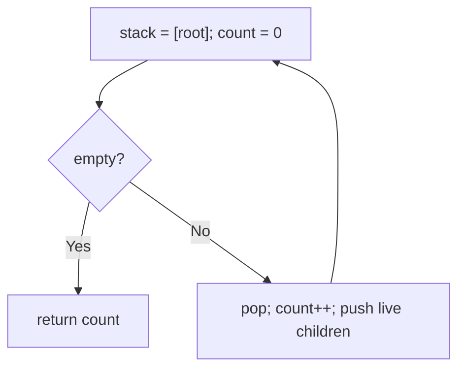
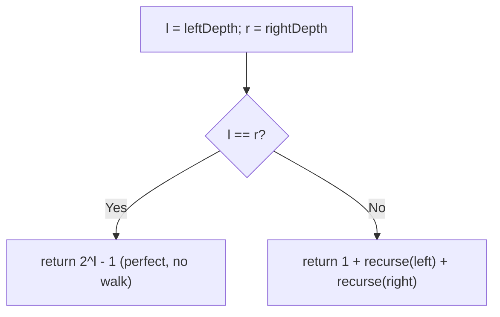

# 222. Count Complete Tree Nodes

- **LeetCode Link**: `https://leetcode.com/problems/count-complete-tree-nodes/`
- **Difficulty**: Easy
- **Pattern Category**: Binary Tree / Completeness-Exploiting Count
- **Prerequisite Primer**: `00-foundations/03-core-algorithmic-patterns.md`

---

## 1. Problem Overview & Edge Case Matrix

### Problem Statement
Given the `root` of a complete binary tree, return the number of the nodes in the tree. A complete binary tree has every level full except possibly the last, with all last-level nodes as far left as possible. Design an algorithm that runs in less than $O(N)$ time complexity.

```
Example 1:
Input: root = [1,2,3,4,5,6]
Output: 6

Example 2:
Input: root = []
Output: 0

Example 3:
Input: root = [1]
Output: 1
```

### Visual Problem Representation
```
complete:      1                 NOT complete:    1
             /   \                                / \
            2     3                              2   3
           / \   /                              /     \
          4  5  6                              4       6   (gap!)
```

### Upfront Edge Case Matrix
| Edge Case Category | Specific Input Scenario | Expected Behavior | Pitfall / Risk |
| :--- | :--- | :--- | :--- |
| Empty / Nil | `root = null` | Return `0` | Depth loop on null |
| Single Element | `[1]` | Return `1` | `2^0` arithmetic edge |
| Perfect tree | 7 nodes, depth 2 | Return `7` via formula | Off-by-one in $2^h - 1$ |
| Missing rightmost leaf | `[1,2,3,4,5]` | Return `5` | Last-level binary search bounds |
| `1 << depth` overflow | Depth ≥ 31 (beyond spec) | N/A within spec ($N \le 5×10^4$) | Bit-shift truncation — use `2 ** depth` at scale |

---

## 2. Level 1: Brute Force Approach

### Intuition & Visual Idea
Ignore completeness entirely: walk every node (DFS stack) and count. $O(N)$ — correct, but flunks the "less than $O(N)$" requirement by design.



### Pseudocode
```text
FUNCTION countNodesBruteForce(root):
    IF root NULL: RETURN 0
    count = 0; stack = [root]
    WHILE stack NOT EMPTY:
        node = stack.POP(); count++
        IF node.left: stack.PUSH(node.left)
        IF node.right: stack.PUSH(node.right)
    RETURN count
```

### Step-by-Step Dry Run (Visual Trace)
| Step | Iteration / Pointer ($i, j$) | Current Value | State / Sub-array | Action Taken |
| :--- | :--- | :--- | :--- | :--- |
| 0 | pop `1` | count `1` | Push `2, 3` | Visit |
| 1 | pop `3` | count `2` | Push `6` | Visit (`3.right` null) |
| 2 | pop `6` | count `3` | Leaf | Visit |
| 3 | pop `2`, then `4`, `5` | count `4, 5, 6` | Drain | Return `6` |

### Modern JavaScript Implementation
```javascript
/**
 * Shared backbone: LeetCode provides TreeNode; defined once here so every
 * level below is locally runnable when concatenated (Level 1 + 2 + 3).
 * Time Complexity:  n/a (scaffolding)
 * Space Complexity: n/a (scaffolding)
 */
class TreeNode {
  constructor(val, left = null, right = null) {
    this.val = val;
    this.left = left;
    this.right = right;
  }
}

function arrayToTree(arr) {
  if (arr.length === 0 || arr[0] === null || arr[0] === undefined) return null;
  const root = new TreeNode(arr[0]);
  const queue = [root];
  let i = 1;
  while (i < arr.length) {
    const node = queue.shift();
    if (i < arr.length && arr[i] !== null && arr[i] !== undefined) {
      node.left = new TreeNode(arr[i]);
      queue.push(node.left);
    }
    i++;
    if (i < arr.length && arr[i] !== null && arr[i] !== undefined) {
      node.right = new TreeNode(arr[i]);
      queue.push(node.right);
    }
    i++;
  }
  return root;
}

/**
 * Level 1: Brute Force (visit-and-count everything)
 * Time Complexity:  O(N) — violates the sub-O(N) requirement
 * Space Complexity: O(H) — explicit stack
 */
function countNodesBruteForce(root) {
  if (root === null) return 0;
  let count = 0;
  const stack = [root];
  while (stack.length > 0) {
    const node = stack.pop();
    count++;
    // Completeness is ignored: every node is visited unconditionally.
    if (node.left !== null) stack.push(node.left);
    if (node.right !== null) stack.push(node.right);
  }
  return count;
}
```

### Complexity Breakdown
- **Time Complexity**: $O(N)$ — the baseline the problem statement explicitly rejects.
- **Space Complexity**: $O(H)$ — stack only; time is the failure.

---

## 3. Level 2: Optimized Approach

### Intuition & Visual Bottleneck Elimination
Exploit completeness: if leftmost depth equals rightmost depth, the subtree is PERFECT with exactly $2^h - 1$ nodes — no traversal needed. Otherwise recurse into both children. Each level does $O(\log N)$ depth walks and discards one perfect half — $O(\log^2 N)$ total.



### Pseudocode
```text
FUNCTION countNodesHeight(root):
    IF root NULL: RETURN 0
    l = DEPTH-DOWN-LEFT(root); r = DEPTH-DOWN-RIGHT(root)
    IF l == r: RETURN 2^l - 1
    RETURN 1 + countNodesHeight(root.left) + countNodesHeight(root.right)
```

### Step-by-Step Dry Run (Visual Trace)
| Step | Pointers / Window | Hash Map / Auxiliary State | Decision Logic | Output Accumulator |
| :--- | :--- | :--- | :--- | :--- |
| 0 | root `1` | left-depth `3`, right-depth `2` | Differ → recurse | `1 + L + R` |
| 1 | node `2` | left-depth `2`, right-depth `2` | Equal → perfect | `2^2 - 1 = 3` |
| 2 | node `3` | left-depth `2`, right-depth `1` | Differ → recurse | `1 + L + R` |
| 3 | node `6` / null | base cases | `1` and `0` | Total `1 + 3 + (1 + 1 + 0) = 6` |

### Modern JavaScript Implementation
```javascript
/**
 * Level 2: Optimized (perfect-subtree shortcut recursion)
 * Time Complexity:  O(log²N) — O(log N) levels × O(log N) depth walks
 * Space Complexity: O(log N) — recursion depth
 */
// TreeNode shared from Level 1.
function countNodesHeight(root) {
  if (root === null) return 0;
  const leftDepth = (node) => {
    let d = 0;
    while (node !== null) {
      node = node.left;
      d++;
    }
    return d;
  };
  const rightDepth = (node) => {
    let d = 0;
    while (node !== null) {
      node = node.right;
      d++;
    }
    return d;
  };
  const l = leftDepth(root);
  const r = rightDepth(root);
  // Equal depths in a COMPLETE tree mean PERFECT: size known by formula.
  if (l === r) return 2 ** l - 1;
  return 1 + countNodesHeight(root.left) + countNodesHeight(root.right);
}
```

### Complexity Breakdown
- **Time Complexity**: $O(\log^2 N)$ — each recursion level costs two $O(\log N)$ walks and prunes one perfect half.
- **Space Complexity**: $O(\log N)$ — recursion depth; the remaining risk is call-stack depth, not size.

---

## 4. Level 3: Most Optimal / Canonical Approach

### Intuition & Mathematical / Invariant Proof
Binary-search the last level: it holds indices $0$ to $2^d - 1$ (where $d$ = leftmost edge depth), and completeness means existing nodes form the prefix $[0, k)$. An `exists(idx)` walk follows index bits from the root in $O(d)$ time, so binary search finds the last existing index in $O(d^2) = O(\log^2 N)$ — iterative, zero recursion. Answer: $(2^d - 1) + (k + 1)$. Invariant: `lo` always exceeds… precisely, `exists(lo-1)` is true and `exists(hi+1)` is false, converging on the boundary.

```
[1,2,3,4,5,6]: d = 2, last-level range 0..3, upper levels hold 3
  exists(1)? yes -> lo=2; exists(2)? yes (node 6) -> lo=3; exists(3)? no -> hi=2
  total = 3 + 3 = 6
```

### Pseudocode
```text
FUNCTION countNodes(root):
    IF root NULL: RETURN 0
    d = EDGES root -> leftmost leaf
    IF d == 0: RETURN 1
    DEFINE exists(idx): walk bits of idx from high to low starting at root
    BINARY SEARCH last true idx in [0, 2^d - 1] -> boundary lo
    RETURN (2^d - 1) + lo
```

### Step-by-Step Dry Run (Visual Trace)
| Step | Pointer $L$ | Pointer $R$ | Invariant Checked | In-Place State |
| :--- | :--- | :--- | :--- | :--- |
| 1 | `d = 2` | upper count `3` | Leftmost walk | Range `[0,3]` |
| 2 | `mid = 1` | `exists(1)` (node 5) true | `lo = 2` | Search right half |
| 3 | `mid = 2` | `exists(2)` (node 6) true | `lo = 3` | Search right half |
| 4 | `mid = 3` | `exists(3)` false | `hi = 2`, loop ends | Total `3 + 3 = 6` |

### Modern JavaScript Implementation
```javascript
/**
 * Level 3: Most Optimal / Canonical (last-level binary search, iterative)
 * Time Complexity:  O(log²N) — O(log N) probes × O(log N) walks
 * Space Complexity: O(1) auxiliary — no recursion, no map
 */
// TreeNode shared from Level 1.
function countNodes(root) {
  if (root === null) return 0;
  // Depth in EDGES down the leftmost path (root-to-leaf hops).
  let depth = 0;
  for (let node = root; node.left !== null; node = node.left) depth++;
  if (depth === 0) return 1;
  // Index-bit walk: bit k of idx chooses left (0) / right (1) at level k.
  const exists = (idx) => {
    let node = root;
    for (let bit = 1 << (depth - 1); node !== null && bit > 0; bit >>= 1) {
      node = (idx & bit) === 0 ? node.left : node.right;
    }
    return node !== null;
  };
  // Last level is a prefix of existing nodes: binary-search its boundary.
  let lo = 0;
  let hi = (1 << depth) - 1;
  while (lo <= hi) {
    const mid = (lo + hi) >> 1;
    if (exists(mid)) lo = mid + 1;
    else hi = mid - 1;
  }
  return (1 << depth) - 1 + lo; // full upper levels + existing last-level nodes
}
```

### Complexity Breakdown
- **Time Complexity**: $O(\log^2 N)$ — optimal known bound; each probe walks one root-to-leaf path.
- **Space Complexity**: $O(1)$ auxiliary — iterative; skewed/deep inputs are safe where recursion is not.

---

## 5. JavaScript-Specific Gotchas & V8 Optimizations
- **GC Pressure**: Avoid allocating objects inside tight loops ($O(N)$ closures). Level 3 allocates nothing per probe — `exists` closes over `root`/`depth` once; never build index arrays to search.
- **Type Coercion / Sorting**: `1 << depth` is 32-bit: exact for spec depths ($\le 15$) but truncates past 31 — at true scale use `2 ** depth`. `(idx & bit) === 0` needs strict comparison (bitwise results are numbers, always).
- **Index Bounds**: Depth in EDGES ($d$) vs node-count formula $2^d - 1$ must pair consistently — mixing edge-depth with the node-depth formula ($2^{d+1} - 1$) doubles the answer. The `depth === 0 → 1` shortcut also dodges a `1 << -1` shift.

---

## 6. Real-World MAANG Interview Follow-Ups & Extensions

### Follow-Up 1: K-th node value without traversal
- **Scenario**: Return the value of the $k$-th node in level order (1-based).
- **Solution Strategy**: Reuse Level 3's `exists`-style bit walk directly on $k - 1$ — $O(\log N)$ single lookup, no counting at all.
- **JS Code / Implementation Pattern**:
```javascript
function kthNodeValue(root, k, depth) {
  let node = root;
  for (let bit = 1 << (depth - 1); bit > 0; bit >>= 1) {
    node = ((k - 1) & bit) === 0 ? node.left : node.right;
  }
  return node.val;
}
```

### Follow-Up 2: Dynamic completeness under inserts
- **Scenario**: Nodes append in level order (heap-style); maintain the count incrementally.
- **Solution Strategy**: Track `size` explicitly — append position IS `size` in binary (same bit-walk as `exists`); count is $O(1)$ amortized, never recomputed.
- **JS Code / Implementation Pattern**:
```javascript
function heapInsert(root, size, val) {
  return insertAtIndex(root, size, val); // bit-walk to the parent slot
}
```

### Follow-Up 3: $10^9$-node complete tree across shards
- **Scenario & In-Depth Solution**: Levels shard by index ranges; `exists(idx)` becomes one RPC to the owning shard. Binary search costs $O(\log N)$ RPCs — each independent probe can fan out in parallel (all midpoints are predetermined per round? no — adaptive, but probe batches of the whole current range halve rounds to $O(\log \log N)$ sequential steps with $O(\log N)$ total RPCs).
```javascript
async function countDistributed(existsRemote, depth) {
  let lo = 0, hi = (1 << depth) - 1;
  while (lo <= hi) {
    const mids = midpoints(lo, hi); // batch the frontier
    const res = await Promise.all(mids.map(existsRemote));
    ({ lo, hi } = narrow(lo, hi, mids, res));
  }
  return (1 << depth) - 1 + lo;
}
```
