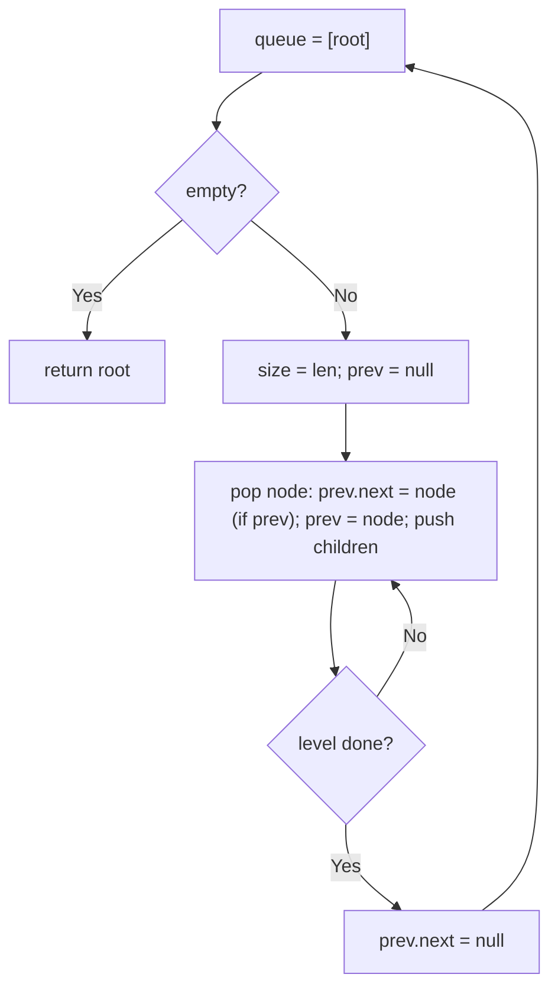
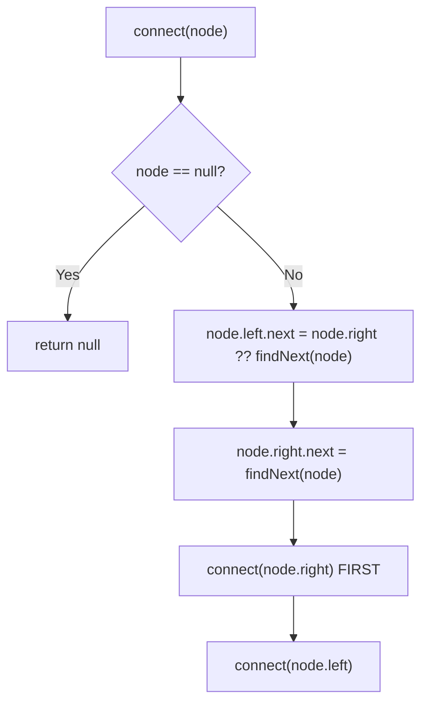

# 117. Populating Next Right Pointers in Each Node II

- **LeetCode Link**: `https://leetcode.com/problems/populating-next-right-pointers-in-each-node-ii/`
- **Difficulty**: Medium
- **Pattern Category**: Binary Tree / Level Linkage with O(1) Space
- **Prerequisite Primer**: `00-foundations/03-core-algorithmic-patterns.md`

---

## 1. Problem Overview & Edge Case Matrix

### Problem Statement
Populate each next pointer to point to its next right node. If there is no next right node, the next pointer should be set to `null`. Initially, all next pointers are set to `null`. Unlike problem 116, the tree is NOT perfect — any node may miss children.

```
Example 1:
Input: root = [1,2,3,4,5,null,7]
Output: [1,#,2,3,#,4,5,7,#]
Explanation: next pointers link 2->3 and 4->5->7 across subtrees.

Example 2:
Input: root = []
Output: []
```

### Visual Problem Representation
```
        1
       / \
      2   3
     / \   \
    4   5   7        next: 2->3, 4->5->7  (5->7 crosses subtrees!)
```

### Upfront Edge Case Matrix
| Edge Case Category | Specific Input Scenario | Expected Behavior | Pitfall / Risk |
| :--- | :--- | :--- | :--- |
| Empty / Nil | `root = null` | Return `null` | Level loop on null |
| Single Element | `[1]` | `next = null` | Self-link |
| Missing left child | `[1,null,3]` | `3.next = null` | Assuming both children exist (116 thinking) |
| Cross-subtree link | `5 -> 7` in ex.1 | Linked via parent's `next` | Only linking siblings |
| Level tail | Rightmost per level | `next = null` | Stale pointer from input (always overwrite) |

---

## 2. Level 1: Brute Force Approach

### Intuition & Visual Idea
Plain BFS with a queue: track each level's previous node and link as you drain the level; terminate each level tail with `null`. $O(N)$ queue space — the cost Level 3 removes by reusing the very `next` pointers being built.



### Pseudocode
```text
FUNCTION connectBruteForce(root):
    IF root NULL: RETURN NULL
    queue = [root]
    WHILE queue NOT EMPTY:
        size = queue.LENGTH; prev = NULL
        REPEAT size TIMES:
            node = queue.SHIFT()
            IF prev NOT NULL: prev.next = node
            prev = node
            IF node.left: queue.PUSH(node.left)
            IF node.right: queue.PUSH(node.right)
        prev.next = NULL
    RETURN root
```

### Step-by-Step Dry Run (Visual Trace)
| Step | Iteration / Pointer ($i, j$) | Current Value | State / Sub-array | Action Taken |
| :--- | :--- | :--- | :--- | :--- |
| 0 | level `[1]` | `prev = 1` | Tail `1.next = null` | Drain size 1 |
| 1 | level `[2,3]` | link `2.next = 3` | Tail `3.next = null` | Push `4,5,7` |
| 2 | level `[4,5,7]` | `4.next = 5`, `5.next = 7` | Tail `7.next = null` | Cross-subtree link done |

### Modern JavaScript Implementation
```javascript
/**
 * Shared backbone: LeetCode provides Node(val, left, right, next); defined
 * once here so every level below is locally runnable when concatenated.
 * Time Complexity:  n/a (scaffolding)
 * Space Complexity: n/a (scaffolding)
 */
class Node {
  constructor(val, left = null, right = null, next = null) {
    this.val = val;
    this.left = left;
    this.right = right;
    this.next = next;
  }
}

function arrayToNextTree(arr) {
  if (arr.length === 0 || arr[0] === null || arr[0] === undefined) return null;
  const root = new Node(arr[0]);
  const queue = [root];
  let i = 1;
  while (i < arr.length) {
    const node = queue.shift();
    if (i < arr.length && arr[i] !== null && arr[i] !== undefined) {
      node.left = new Node(arr[i]);
      queue.push(node.left);
    }
    i++;
    if (i < arr.length && arr[i] !== null && arr[i] !== undefined) {
      node.right = new Node(arr[i]);
      queue.push(node.right);
    }
    i++;
  }
  return root;
}

/**
 * Level 1: Brute Force (BFS level linkage)
 * Time Complexity:  O(N) — each node enqueued once
 * Space Complexity: O(N) — queue holds the widest level
 */
function connectBruteForce(root) {
  if (root === null) return null;
  const queue = [root];
  while (queue.length > 0) {
    const size = queue.length; // snapshot: children belong to the next level
    let prev = null;
    for (let i = 0; i < size; i++) {
      const node = queue.shift();
      if (prev !== null) prev.next = node;
      prev = node;
      if (node.left !== null) queue.push(node.left);
      if (node.right !== null) queue.push(node.right);
    }
    prev.next = null; // level tail always terminates
  }
  return root;
}
```

### Complexity Breakdown
- **Time Complexity**: $O(N)$ — linear, but with a queue sized by tree width.
- **Space Complexity**: $O(N)$ — widest level queued; the `next` pointers themselves could serve as the queue.

---

## 3. Level 2: Optimized Approach

### Intuition & Visual Bottleneck Elimination
Recursive linking using the parent's `next` chain: a node's children link to the nearest live child found by scanning `node.next` rightward (`findNextChild`). Recurse RIGHT subtree first so lower `next` chains exist before the left subtree reads them. $O(H)$ stack, no queue.



### Pseudocode
```text
FUNCTION findNextChild(node):   // nearest live child at-or-after node
    node = node.next
    WHILE node NOT NULL:
        IF node.left: RETURN node.left
        IF node.right: RETURN node.right
        node = node.next
    RETURN NULL

FUNCTION connectRecursive(node):
    IF node NULL: RETURN NULL
    IF node.left: node.left.next = node.right ?? findNextChild(node)
    IF node.right: node.right.next = findNextChild(node)
    connectRecursive(node.right)   // RIGHT FIRST: lower chains ready for left
    connectRecursive(node.left)
    RETURN node
```

### Step-by-Step Dry Run (Visual Trace)
| Step | Pointers / Window | Hash Map / Auxiliary State | Decision Logic | Output Accumulator |
| :--- | :--- | :--- | :--- | :--- |
| 0 | node `1` | `2.next = 3`, `3.next = null` | Sibling link | Recurse right (`3`) first |
| 1 | node `3` | right child `7` | `7.next = findNext(3) = null` | Right subtree done |
| 2 | node `2` | `4.next = 5` | Sibling link | `5.next = findNext(2)` |
| 3 | `findNext(2)` | scan `2.next = 3` | `3.left` null, `3.right = 7` | `5.next = 7` ✓ cross link |

### Modern JavaScript Implementation
```javascript
/**
 * Level 2: Optimized (recursive next-chain linking)
 * Time Complexity:  O(N) — each node visited once; findNext scans amortize
 * Space Complexity: O(H) — call stack depth equals height
 */
// Node shared from Level 1.
function findNextChild(node) {
  // Scan the parent level rightward for the nearest node WITH a child.
  node = node.next;
  while (node !== null) {
    if (node.left !== null) return node.left;
    if (node.right !== null) return node.right;
    node = node.next;
  }
  return null;
}

function connectRecursive(node) {
  if (node === null) return null;
  // Left child prefers its sibling; otherwise borrow across the next chain.
  if (node.left !== null) node.left.next = node.right ?? findNextChild(node);
  if (node.right !== null) node.right.next = findNextChild(node);
  // RIGHT FIRST: the left subtree reads lower next-chains this call creates.
  connectRecursive(node.right);
  connectRecursive(node.left);
  return node;
}
```

### Complexity Breakdown
- **Time Complexity**: $O(N)$ amortized — `findNextChild` scans are charged to skipped childless nodes, each skipped once per level.
- **Space Complexity**: $O(H)$ — recursion depth; skewed trees still risk the stack.

---

## 4. Level 3: Most Optimal / Canonical Approach

### Intuition & Mathematical / Invariant Proof
Use the level you're building as its own queue: traverse the CURRENT level via established `next` pointers while appending children to a `tail` behind a per-level `dummy`. Invariant: when level $h$ is fully linked, one walk across it links all of level $h+1$ left-to-right (children visited in parent order = level order). $O(1)$ space beyond the dummy — the `next` pointers ARE the queue.

```
level [2,3] linked: walk 2 (append 4,5), walk 3 (append 7) => [4,5,7] linked
level [4,5,7]: no children => dummy.next = null => done
```

### Pseudocode
```text
FUNCTION connect(root):
    levelHead = root
    WHILE levelHead NOT NULL:
        dummy = Node(0); tail = dummy
        FOR cur = levelHead; cur NOT NULL; cur = cur.next:
            IF cur.left: tail.next = cur.left; tail = tail.next
            IF cur.right: tail.next = cur.right; tail = tail.next
        levelHead = dummy.next
    RETURN root
```

### Step-by-Step Dry Run (Visual Trace)
| Step | Pointer $L$ | Pointer $R$ | Invariant Checked | In-Place State |
| :--- | :--- | :--- | :--- | :--- |
| 1 | `levelHead = 1` | children `2, 3` | Dummy collects `[2,3]` | `levelHead = 2` |
| 2 | walk `2` | append `4, 5` | Parent order = level order | Tail at `5` |
| 3 | walk `3` | append `7` | Cross-subtree link `5→7` | Level `[4,5,7]` linked |
| 4 | walk `[4,5,7]` | no children | `dummy.next = null` | `levelHead = null`, done |

### Modern JavaScript Implementation
```javascript
/**
 * Level 3: Most Optimal / Canonical (dummy-head level walk, O(1) space)
 * Time Complexity:  O(N) — each node visited once as child, once as parent
 * Space Complexity: O(1) auxiliary — one dummy per level; next pointers are the queue
 */
// Node shared from Level 1.
function connect(root) {
  let levelHead = root;
  while (levelHead !== null) {
    const dummy = new Node(0); // fresh anchor per level (only allocation)
    let tail = dummy;
    // Walk the CURRENT level through established next pointers...
    for (let cur = levelHead; cur !== null; cur = cur.next) {
      // ...appending children left-to-right builds the NEXT level pre-linked.
      if (cur.left !== null) {
        tail.next = cur.left;
        tail = tail.next;
      }
      if (cur.right !== null) {
        tail.next = cur.right;
        tail = tail.next;
      }
    }
    levelHead = dummy.next; // null when the last level had no children
  }
  return root;
}
```

### Complexity Breakdown
- **Time Complexity**: $O(N)$ — optimal lower bound; every node is linked exactly once.
- **Space Complexity**: $O(1)$ auxiliary — one dummy per level; optimal.

---

## 5. JavaScript-Specific Gotchas & V8 Optimizations
- **GC Pressure**: Avoid allocating objects inside tight loops ($O(N)$ closures). Level 3 allocates one dummy per LEVEL (not per node) — Level 1's widest-level queue is the pressure removed.
- **Type Coercion / Sorting**: `node.right ?? findNextChild(node)` — `??` (not `||`) is correct because a live node object is never falsy; the habit matters when the same pattern guards values elsewhere.
- **Index Bounds**: Level 2's right-FIRST recursion order is load-bearing — recursing left first reads lower `next` chains that don't exist yet, silently leaving cross-subtree links null. Level 3 has no such trap (levels complete strictly top-down).

---

## 6. Real-World MAANG Interview Follow-Ups & Extensions

### Follow-Up 1: Perfect-tree specialization (no missing children)
- **Scenario**: The tree IS perfect — every parent has both children.
- **Solution Strategy**: No null checks, no dummy: `left.next = right; right.next = node.next?.left ?? null`, recurse. Level 3 simplifies to direct wiring.
- **JS Code / Implementation Pattern**:
```javascript
function connectPerfect(node) {
  if (!node?.left) return node;
  node.left.next = node.right;
  node.right.next = node.next?.left ?? null;
  connectPerfect(node.left);
  connectPerfect(node.right);
  return node;
}
```

### Follow-Up 2: Constant-space traversal USING the next pointers
- **Scenario**: After linking, traverse level-order with $O(1)$ space (no queue, no recursion).
- **Solution Strategy**: The `next` chains ARE the traversal structure — walk each level via `next`, descend via leftmost live child. This is the payoff for building them.
- **JS Code / Implementation Pattern**:
```javascript
function* levelsViaNext(root) {
  for (let row = root; row; row = firstLiveChild(row)) {
    const vals = [];
    for (let c = row; c; c = c.next) vals.push(c.val);
    yield vals;
  }
}
```

### Follow-Up 3: $10^9$-node tree with paged levels
- **Scenario & In-Depth Solution**: Levels stream from disk; only two adjacent levels fit in RAM. Level 3's structure is already streaming-shaped: read level $h$ (via stored next-chains or offsets), write level $h+1$ links, evict level $h$. One sequential pass per level, $O(\text{width})$ RAM.
```javascript
async function connectPaged(rootId, loadLevel, storeLinks) {
  for (let row = [rootId]; row.length > 0; row = await storeLinks(row)) {
    await linkRow(row, loadLevel); // fetch children, persist next pointers
  }
}
```
