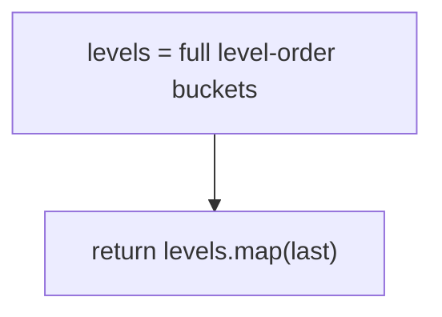
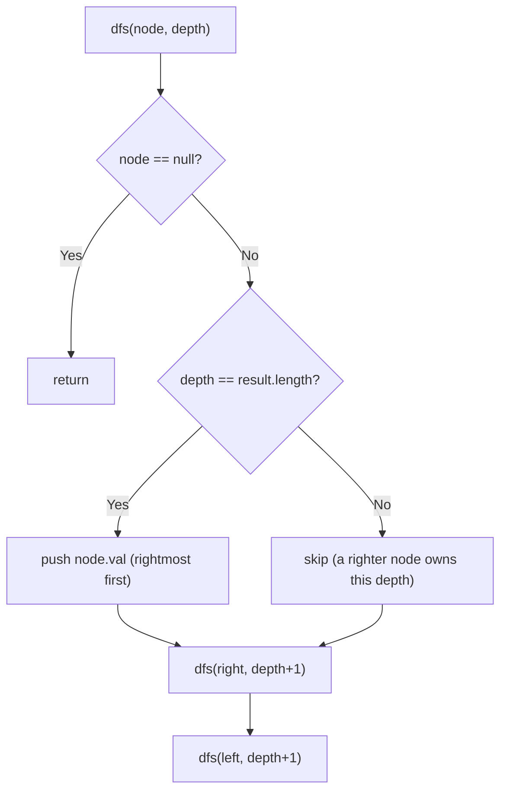
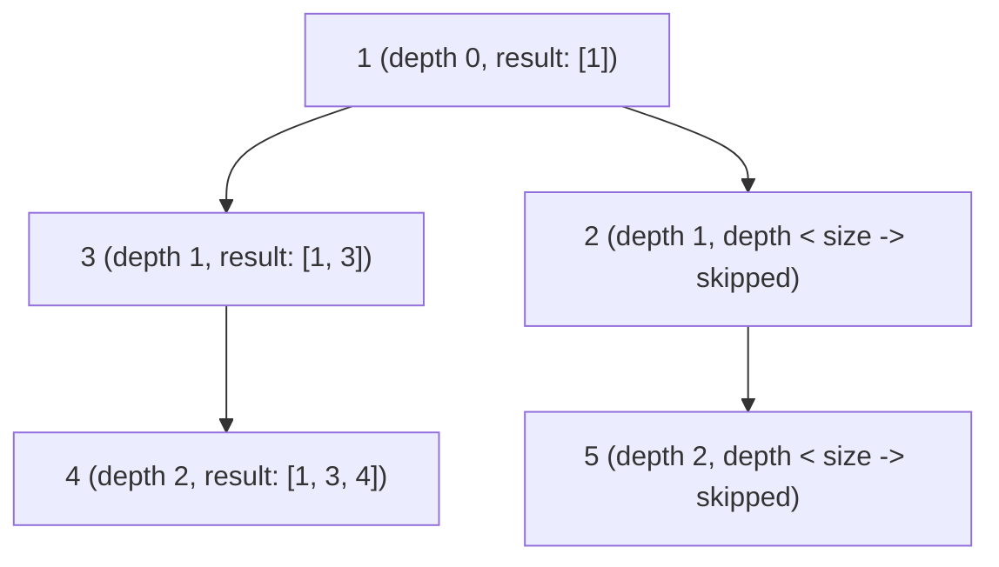

# 199. Binary Tree Right Side View

- **LeetCode Link**: `https://leetcode.com/problems/binary-tree-right-side-view/`
- **Difficulty**: Medium
- **Pattern Category**: Binary Tree BFS / Level Tail Selection
- **Prerequisite Primer**: `00-foundations/03-core-algorithmic-patterns.md`

---

## 1. Problem Overview & Edge Case Matrix

### Problem Statement
Given the `root` of a binary tree, imagine yourself standing on the right side of it. Return the values of the nodes you can see ordered from top to bottom — i.e. the rightmost node at each depth.

```
Example 1:
Input: root = [1,2,3,null,5,null,4]
Output: [1,3,4]

Example 2:
Input: root = [1,null,3]
Output: [1,3]

Example 3:
Input: root = []
Output: []
```

### Visual Problem Representation
```
        1            visible from right: 1
       / \
      2   3          visible: 3 (hides 2)
       \   \
        5   4        visible: 4 (hides 5)
```

### Upfront Edge Case Matrix
| Edge Case Category | Specific Input Scenario | Expected Behavior | Pitfall / Risk |
| :--- | :--- | :--- | :--- |
| Empty / Nil | `root = null` | Return `[]` | Null queue seed |
| Single Element | `[1]` | Return `[1]` | Level loop that skips depth 0 |
| Left-only chain | `[1,2,null,3]` | Return `[1,2,3]` | Assuming right child exists per level |
| Right-only chain | `[1,null,2,null,3]` | Return `[1,2,3]` | DFS depth-vs-length recording |
| Hidden nodes | Ex.1 node `5` | Excluded (blocked by `4`) | Taking leftmost instead of rightmost |

---

## 2. Level 1: Brute Force Approach

### Intuition & Visual Idea
Collect every level's values into arrays (plain BFS), then map each level to its last element. Two phases, fully materialized levels — obviously correct, maximally wasteful.



### Pseudocode
```text
FUNCTION rightSideViewBruteForce(root):
    IF root NULL: RETURN []
    levels = []; queue = [root]
    WHILE queue NOT EMPTY:
        size = queue.LENGTH; level = []
        REPEAT size TIMES:
            node = queue.SHIFT()
            level.PUSH(node.val)
            PUSH live children
        levels.PUSH(level)
    RETURN levels.MAP(level => level[level.LENGTH - 1])
```

### Step-by-Step Dry Run (Visual Trace)
| Step | Iteration / Pointer ($i, j$) | Current Value | State / Sub-array | Action Taken |
| :--- | :--- | :--- | :--- | :--- |
| 0 | level 0 | `[1]` | Queue `[2,3]` | Bucket values |
| 1 | level 1 | `[2,3]` | Queue `[5,4]` | Bucket values |
| 2 | level 2 | `[5,4]` | Queue empty | Bucket values |
| 3 | map lasts | `[1,3,4]` | — | Return |

### Modern JavaScript Implementation
```javascript
/**
 * Shared backbone: LeetCode provides TreeNode; defined once here so every
 * level below is locally runnable when concatenated (Level 1 + 2 + 3).
 * Time Complexity:  n/a (scaffolding)
 * Space Complexity: n/a (scaffolding)
 */
class TreeNode {
  constructor(val, left = null, right = null) {
    this.val = val;
    this.left = left;
    this.right = right;
  }
}

function arrayToTree(arr) {
  if (arr.length === 0 || arr[0] === null || arr[0] === undefined) return null;
  const root = new TreeNode(arr[0]);
  const queue = [root];
  let i = 1;
  while (i < arr.length) {
    const node = queue.shift();
    if (i < arr.length && arr[i] !== null && arr[i] !== undefined) {
      node.left = new TreeNode(arr[i]);
      queue.push(node.left);
    }
    i++;
    if (i < arr.length && arr[i] !== null && arr[i] !== undefined) {
      node.right = new TreeNode(arr[i]);
      queue.push(node.right);
    }
    i++;
  }
  return root;
}

/**
 * Level 1: Brute Force (full level buckets + last-pick)
 * Time Complexity:  O(N) — one walk plus a map pass
 * Space Complexity: O(N) — all level values retained
 */
function rightSideViewBruteForce(root) {
  if (root === null) return [];
  const levels = [];
  const queue = [root];
  while (queue.length > 0) {
    const size = queue.length;
    const level = [];
    for (let i = 0; i < size; i++) {
      const node = queue.shift();
      level.push(node.val);
      if (node.left !== null) queue.push(node.left);
      if (node.right !== null) queue.push(node.right);
    }
    levels.push(level);
  }
  // Rightmost per level = last element of each bucket.
  return levels.map((level) => level[level.length - 1]);
}
```

### Complexity Breakdown
- **Time Complexity**: $O(N)$ — linear, but stores every value to keep one per level.
- **Space Complexity**: $O(N)$ — full buckets; only the tails matter.

---

## 3. Level 2: Optimized Approach

### Intuition & Visual Bottleneck Elimination
DFS right-first (root, right, left): the first node visited at each depth IS the rightmost. Record `depth === result.length → push`. One pass, $O(H)$ stack, no levels stored.



### Pseudocode
```text
FUNCTION rightSideViewDFS(root):
    out = []
    DEFINE dfs(node, depth):
        IF node NULL: RETURN
        IF depth == out.LENGTH: out.PUSH(node.val)  // first at depth = rightmost
        dfs(node.right, depth + 1)   // RIGHT FIRST is the whole trick
        dfs(node.left, depth + 1)
    dfs(root, 0)
    RETURN out
```

### Step-by-Step Dry Run (Visual Trace)
| Step | Pointers / Window | Hash Map / Auxiliary State | Decision Logic | Output Accumulator |
| :--- | :--- | :--- | :--- | :--- |
| 0 | `dfs(1, 0)` | `depth == len(0)` | Record | `out = [1]` |
| 1 | `dfs(3, 1)` (right first) | `depth == len(1)` | Record | `out = [1,3]` |
| 2 | `dfs(4, 2)` via `3.right` | `depth == len(2)` | Record | `out = [1,3,4]` |
| 3 | left side (`2`, `5`) | depths `1, 2` taken | Skip both | `[1,3,4]` |

### Modern JavaScript Implementation
```javascript
/**
 * Level 2: Optimized (right-first DFS, first-per-depth wins)
 * Time Complexity:  O(N) — each node visited once
 * Space Complexity: O(H) — call stack depth equals height
 */
// TreeNode shared from Level 1.
function rightSideViewDFS(root) {
  const out = [];
  function dfs(node, depth) {
    if (node === null) return;
    // Right-first order: the first visitor at a depth is its rightmost node.
    if (depth === out.length) out.push(node.val);
    dfs(node.right, depth + 1);
    dfs(node.left, depth + 1);
  }
  dfs(root, 0);
  return out;
}
```

### Complexity Breakdown
- **Time Complexity**: $O(N)$ — one visit per node.
- **Space Complexity**: $O(H)$ — implicit stack; output excluded.

---

## 4. Level 3: Most Optimal / Canonical Approach

### Intuition & Mathematical / Invariant Proof
Single-pass BFS that records each level's tail directly — no buckets, no second pass — with a head-index queue (`queue[head++]`) instead of `shift()`. Invariant: at loop top, `queue[head .. head+size)` is exactly the current level, so `queue[head+size-1]` is its rightmost node. The index pointer removes V8's $O(N)$ `shift()` memmove, turning BFS from quadratic-in-practice to true $O(N)$.

```
level [2,3]: head -> 2, tail -> 3 => record 3, push children 5,4
level [5,4]: record 4
```

### Pseudocode
```text
FUNCTION rightSideView(root):
    IF root NULL: RETURN []
    queue = [root]; head = 0; out = []
    WHILE head < queue.LENGTH:
        size = queue.LENGTH - head
        out.PUSH(queue[head + size - 1].val)   // level tail = rightmost
        REPEAT size TIMES:
            node = queue[head++]
            PUSH live children
    RETURN out
```

### Step-by-Step Dry Run (Visual Trace)
| Step | Pointer $L$ | Pointer $R$ | Invariant Checked | In-Place State |
| :--- | :--- | :--- | :--- | :--- |
| 1 | `head=0`, size `1` | tail `queue[0] = 1` | Record `1` | Push `2, 3` |
| 2 | `head=1`, size `2` | tail `queue[2] = 3` | Record `3` | Push `5, 4` |
| 3 | `head=3`, size `2` | tail `queue[4] = 4` | Record `4` | Queue drains |
| 4 | `head=5` | loop ends | — | Return `[1,3,4]` |

### Modern JavaScript Implementation
```javascript
/**
 * Level 3: Most Optimal / Canonical (single-pass level-tail BFS)
 * Time Complexity:  O(N) — true linear (no shift() penalty)
 * Space Complexity: O(W) — widest level queued; output excluded
 */
// TreeNode shared from Level 1.
function rightSideView(root) {
  if (root === null) return [];
  const queue = [root];
  let head = 0; // read cursor: O(1) dequeue, no memmove
  const out = [];
  while (head < queue.length) {
    // Everything from head to the end IS the current level.
    const size = queue.length - head;
    out.push(queue[head + size - 1].val); // tail = rightmost
    for (let i = 0; i < size; i++) {
      const node = queue[head++];
      if (node.left !== null) queue.push(node.left);
      if (node.right !== null) queue.push(node.right);
    }
  }
  return out;
}
```

### Complexity Breakdown
- **Time Complexity**: $O(N)$ — optimal lower bound with honest constants; every node enqueued once.
- **Space Complexity**: $O(W)$ — widest level; the theoretical minimum for BFS (DFS Level 2 uses less on wide trees — say so).

---

## 5. JavaScript-Specific Gotchas & V8 Optimizations
- **GC Pressure**: Avoid allocating objects inside tight loops ($O(N)$ closures). Level 1's per-level arrays are the pressure removed — Level 3 pushes only node references into one array.
- **Type Coercion / Sorting**: `queue.shift()` on V8 arrays is $O(N)$ (element memmove) — BFS-with-shift on $N = 10^4$ degrades toward $O(N^2)$ wall-clock despite "linear" pseudocode. The head-index pattern is the production fix.
- **Index Bounds**: `queue[head + size - 1]` is safe because `size ≥ 1` whenever the loop runs (`head < length` guard); snapshotting `size` before the push loop is what keeps tails aligned with levels.

---

## 6. Real-World MAANG Interview Follow-Ups & Extensions

### Follow-Up 1: Left view, top view, bottom view
- **Scenario**: Return the leftmost per level, or the top/bottom-most per horizontal column.
- **Solution Strategy**: Left view = Level 2 mirrored (left-first) or level heads in Level 3; top/bottom view = BFS with column indices + first/last-wins maps.
- **JS Code / Implementation Pattern**:
```javascript
function leftSideView(root) {
  if (!root) return [];
  const queue = [root];
  let head = 0;
  const out = [];
  while (head < queue.length) {
    const size = queue.length - head;
    out.push(queue[head].val); // level HEAD = leftmost
    for (let i = 0; i < size; i++) {
      const node = queue[head++];
      if (node.left) queue.push(node.left);
      if (node.right) queue.push(node.right);
    }
  }
  return out;
}
```

### Follow-Up 2: Right view of an n-ary tree streamed from disk
- **Scenario**: Children arrays stream; only one level fits in RAM.
- **Solution Strategy**: Level 3's shape is already streaming: hold the current level, emit its tail, page in the next. $O(W)$ RAM by construction.
- **JS Code / Implementation Pattern**:
```javascript
async function rightViewStreamed(rootId, loadNode) {
  const out = [];
  let level = [rootId];
  while (level.length > 0) {
    out.push((await loadNode(level[level.length - 1])).val);
    level = await allChildren(level, loadNode);
  }
  return out;
}
```

### Follow-Up 3: Dynamic tree with view maintenance
- **Scenario & In-Depth Solution**: Nodes insert/delete; recompute the view per change is $O(N)$. Maintain per-depth rightmost pointers incrementally: insertion updates depths ≥ its own only if it lands right of the current holder; deletion of a holder triggers a bounded re-scan of that depth. Amortized $O(H)$ per update.
```javascript
function viewInsert(viewState, node, depth) {
  if (depth >= viewState.length || isRightOf(node, viewState[depth])) {
    viewState[depth] = node; // new rightmost claimant
  }
}
```

---

## 7. What LeetCode Discuss Says (Language-Independent)

Source: top-voted post by WANG Zhitian —
`https://leetcode.com/problems/binary-tree-right-side-view/solutions/56012/my-simple-accepted-solutionjava-by-zwang-ynil/`
— 157K views.
Language-independent summary. No new JS here.

### A. Optimal way from Discuss (Reverse Preorder DFS with Depth-Matching Invariant)

While BFS level-order traversal is intuitive, the community's most concise approach uses reverse preorder DFS (`Root -> Right -> Left`):

1. **Traversal Order:** Explore `curr.right` before `curr.left`.
2. **Depth Invariant:** By visiting right branches first, the very first node encountered at any depth `d` is guaranteed to be the rightmost visible node of that level.
3. **Capture Condition:** Check if `depth == result.size()`. If true, this is the first time reaching level `depth` — append `curr.val` to `result`.
4. **Descent:** Recurse `curr.right` with `depth + 1`, then `curr.left` with `depth + 1`.

```text
FUNCTION rightSideView(root):
    result = []
    
    FUNCTION dfs(curr, depth):
        IF curr == null:
            RETURN
            
        // First node reached at this depth is the rightmost node
        IF depth == length(result):
            result.push(curr.val)
            
        dfs(curr.right, depth + 1)
        dfs(curr.left, depth + 1)
        
    dfs(root, 0)
    RETURN result
```

- Time: O(N) where N is the number of nodes, visiting each node once.
- Space: O(H) auxiliary space on the call stack ($O(\log N)$ balanced, $O(N)$ skewed), compared to $O(W) \approx O(N)$ for a BFS queue.



### B. Dry run on LeetCode Example 1 (`root = [1,2,3,null,5,null,4]`)

- `dfs(1, depth=0)`: `depth == length(result)` (0 == 0) -> `result = [1]`.
  - Recurse right: `dfs(3, depth=1)`: `1 == 1` -> `result = [1, 3]`.
    - Recurse right: `dfs(4, depth=2)`: `2 == 2` -> `result = [1, 3, 4]`.
      - Children are null -> returns.
    - Recurse left: null.
  - Recurse left from root: `dfs(2, depth=1)`:
    - `depth == length(result)` (1 == 3 is FALSE) -> skipped!
    - Recurse right: `dfs(5, depth=2)`:
      - `depth == length(result)` (2 == 3 is FALSE) -> skipped!
    - Recurse left: null.

Final result: `[1, 3, 4]`.

### C. Why Reverse Preorder DFS Beats BFS Queue Memory

- **Memory Efficiency:** BFS must hold the widest level of the tree in memory ($W = \lceil N/2 \rceil$ nodes in a complete tree).
- Reverse preorder DFS requires only $O(H)$ stack frames ($H \le \log_2 N$ for balanced trees), consuming exponentially less memory while executing with minimal allocation overhead.

### D. Pitfalls from comments

- **Right-branch blindness:** A common misconception is that the right side view only contains nodes in the right subtree. If the right subtree is shallower than the left subtree, lower nodes from the left subtree become visible from the right! DFS handles this naturally: once the right subtree terminates, subsequent deeper left nodes satisfy `depth == result.size()`.
- **Standard Preorder Traversal:** If traversing `Root -> Left -> Right`, earlier nodes at depth `d` must be overwritten with `result[depth] = curr.val` rather than appended.

### E. Companies

- Discuss post itself names none.
  Companies tab on LeetCode is premium-locked.
- External source:
  `https://github.com/liquidslr/leetcode-company-wise-problems`
  (LeetCode company tags, updated June 2025).
- All-time (15): Accenture, Amazon, Apple, Bloomberg, ByteDance, Google, Meta, Microsoft, Oracle, ServiceNow, TikTok, Uber, Walmart Labs, Wix, Yandex.
- Recent: 30 days — None.
- Recent: 3 months — Amazon, Google, Yandex.
