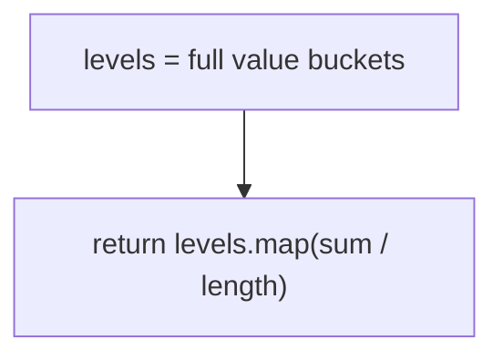
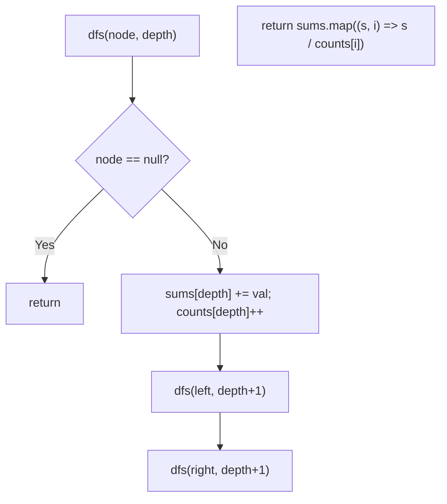

# 637. Average of Levels in Binary Tree

- **LeetCode Link**: `https://leetcode.com/problems/average-of-levels-in-binary-tree/`
- **Difficulty**: Easy
- **Pattern Category**: Binary Tree BFS / Level Aggregation
- **Prerequisite Primer**: `00-foundations/03-core-algorithmic-patterns.md`

---

## 1. Problem Overview & Edge Case Matrix

### Problem Statement
Given the `root` of a binary tree, return the average value of the nodes on each level in the form of an array. Answers within $10^{-5}$ of the actual answer will be accepted.

```
Example 1:
Input: root = [3,9,20,null,null,15,7]
Output: [3.00000,14.50000,11.00000]
Explanation: level 0: 3; level 1: (9+20)/2 = 14.5; level 2: (15+7)/2 = 11.

Example 2:
Input: root = [3,9,20,15,7]
Output: [3.00000,14.50000,11.00000]
```

### Visual Problem Representation
```
        3              avg = 3
       / \
      9   20           avg = (9+20)/2 = 14.5
          / \
         15  7         avg = (15+7)/2 = 11
```

### Upfront Edge Case Matrix
| Edge Case Category | Specific Input Scenario | Expected Behavior | Pitfall / Risk |
| :--- | :--- | :--- | :--- |
| Empty / Nil | `root = null` | Return `[]` | Division by zero on empty levels |
| Single Element | `[5]` | Return `[5]` | Integer-division truncation (other languages) |
| Skewed chain | One node per level | Each average = the node | Sum/count bookkeeping per level |
| Large values | Values near $\pm 2^{31}$ | Exact float average | 32-bit overflow in integer-sum languages (JS doubles safe to $2^{53}$) |
| Precision | Repeating decimals | Within $10^{-5}$ | `Math.floor` on the quotient |

---

## 2. Level 1: Brute Force Approach

### Intuition & Visual Idea
Reuse the level-bucket pattern: collect every level's values, then average each bucket with a second pass. Clear, correct — and stores all $N$ values to produce one number per level.



### Pseudocode
```text
FUNCTION averageOfLevelsBruteForce(root):
    IF root NULL: RETURN []
    levels = LEVEL_BUCKETS(root)   // plain BFS collection
    RETURN levels.MAP(level => SUM(level) / level.LENGTH)
```

### Step-by-Step Dry Run (Visual Trace)
| Step | Iteration / Pointer ($i, j$) | Current Value | State / Sub-array | Action Taken |
| :--- | :--- | :--- | :--- | :--- |
| 0 | bucket levels | `[[3],[9,20],[15,7]]` | Full BFS | Collect |
| 1 | average `[3]` | `3 / 1` | — | `3` |
| 2 | average `[9,20]` | `29 / 2` | — | `14.5` |
| 3 | average `[15,7]` | `22 / 2` | — | `11` |

### Modern JavaScript Implementation
```javascript
/**
 * Shared backbone: LeetCode provides TreeNode; defined once here so every
 * level below is locally runnable when concatenated (Level 1 + 2 + 3).
 * Time Complexity:  n/a (scaffolding)
 * Space Complexity: n/a (scaffolding)
 */
class TreeNode {
  constructor(val, left = null, right = null) {
    this.val = val;
    this.left = left;
    this.right = right;
  }
}

function arrayToTree(arr) {
  if (arr.length === 0 || arr[0] === null || arr[0] === undefined) return null;
  const root = new TreeNode(arr[0]);
  const queue = [root];
  let i = 1;
  while (i < arr.length) {
    const node = queue.shift();
    if (i < arr.length && arr[i] !== null && arr[i] !== undefined) {
      node.left = new TreeNode(arr[i]);
      queue.push(node.left);
    }
    i++;
    if (i < arr.length && arr[i] !== null && arr[i] !== undefined) {
      node.right = new TreeNode(arr[i]);
      queue.push(node.right);
    }
    i++;
  }
  return root;
}

/**
 * Level 1: Brute Force (bucket levels, then average)
 * Time Complexity:  O(N) — walk plus per-bucket summation
 * Space Complexity: O(N) — all values retained
 */
function averageOfLevelsBruteForce(root) {
  if (root === null) return [];
  const levels = [];
  const queue = [root];
  while (queue.length > 0) {
    const size = queue.length;
    const level = [];
    for (let i = 0; i < size; i++) {
      const node = queue.shift();
      level.push(node.val);
      if (node.left !== null) queue.push(node.left);
      if (node.right !== null) queue.push(node.right);
    }
    levels.push(level);
  }
  // Two-phase: every value stored before any average is computed.
  return levels.map((level) => level.reduce((a, v) => a + v, 0) / level.length);
}
```

### Complexity Breakdown
- **Time Complexity**: $O(N)$ — linear, but two passes over the data (walk + reduce).
- **Space Complexity**: $O(N)$ — buckets; sums and counts suffice.

---

## 3. Level 2: Optimized Approach

### Intuition & Visual Bottleneck Elimination
DFS carrying depth: accumulate `sums[depth] += val; counts[depth]++` in one recursive walk, then divide pairwise. No queue, no buckets — $O(H)$ stack with $O(\text{levels})$ aggregates.



### Pseudocode
```text
FUNCTION averageOfLevelsDFS(root):
    IF root NULL: RETURN []
    sums = []; counts = []
    DEFINE dfs(node, depth):
        IF node NULL: RETURN
        sums[depth] = (sums[depth] ?? 0) + node.val
        counts[depth] = (counts[depth] ?? 0) + 1
        dfs(node.left, depth + 1); dfs(node.right, depth + 1)
    dfs(root, 0)
    RETURN sums.MAP((s, i) => s / counts[i])
```

### Step-by-Step Dry Run (Visual Trace)
| Step | Pointers / Window | Hash Map / Auxiliary State | Decision Logic | Output Accumulator |
| :--- | :--- | :--- | :--- | :--- |
| 0 | `dfs(3, 0)` | `sums=[3], counts=[1]` | Accumulate | — |
| 1 | `dfs(9, 1)`, `dfs(20, 1)` | `sums=[3,29], counts=[1,2]` | Accumulate | — |
| 2 | `dfs(15, 2)`, `dfs(7, 2)` | `sums=[3,29,22], counts=[1,2,2]` | Accumulate | — |
| 3 | divide | `[3/1, 29/2, 22/2]` | — | `[3, 14.5, 11]` |

### Modern JavaScript Implementation
```javascript
/**
 * Level 2: Optimized (DFS sum/count aggregation)
 * Time Complexity:  O(N) — one visit per node
 * Space Complexity: O(H) — stack plus O(levels) aggregates
 */
// TreeNode shared from Level 1.
function averageOfLevelsDFS(root) {
  if (root === null) return [];
  const sums = [];
  const counts = [];
  function dfs(node, depth) {
    if (node === null) return;
    // Aggregates only: values are folded immediately, never stored.
    sums[depth] = (sums[depth] ?? 0) + node.val;
    counts[depth] = (counts[depth] ?? 0) + 1;
    dfs(node.left, depth + 1);
    dfs(node.right, depth + 1);
  }
  dfs(root, 0);
  return sums.map((s, i) => s / counts[i]);
}
```

### Complexity Breakdown
- **Time Complexity**: $O(N)$ — single walk.
- **Space Complexity**: $O(H)$ — stack plus two small arrays; recursion depth is the caveat.

---

## 4. Level 3: Most Optimal / Canonical Approach

### Intuition & Mathematical / Invariant Proof
Single-pass BFS that folds each level into `(sum, count)` on the spot and pushes the quotient immediately — no buckets, no second phase, no recursion. Head-index queue removes the `shift()` penalty. Invariant: when the inner loop starts, `queue[head .. head+size)` is exactly one level, so `sum/size` is that level's exact average.

```
level [9,20]: sum = 29, size = 2 => push 14.5; enqueue 15, 7
```

### Pseudocode
```text
FUNCTION averageOfLevels(root):
    IF root NULL: RETURN []
    queue = [root]; head = 0; out = []
    WHILE head < queue.LENGTH:
        size = queue.LENGTH - head; sum = 0
        REPEAT size TIMES:
            node = queue[head++]; sum += node.val
            PUSH live children
        out.PUSH(sum / size)
    RETURN out
```

### Step-by-Step Dry Run (Visual Trace)
| Step | Pointer $L$ | Pointer $R$ | Invariant Checked | In-Place State |
| :--- | :--- | :--- | :--- | :--- |
| 1 | `head=0`, size `1` | `sum = 3` | Push `3/1 = 3` | Enqueue `9, 20` |
| 2 | `head=1`, size `2` | `sum = 29` | Push `29/2 = 14.5` | Enqueue `15, 7` |
| 3 | `head=3`, size `2` | `sum = 22` | Push `22/2 = 11` | Queue drains |
| 4 | `head=5` | loop ends | — | Return `[3, 14.5, 11]` |

### Modern JavaScript Implementation
```javascript
/**
 * Level 3: Most Optimal / Canonical (single-pass level averages)
 * Time Complexity:  O(N) — true linear, optimal lower bound
 * Space Complexity: O(W) — widest level queued; output excluded
 */
// TreeNode shared from Level 1.
function averageOfLevels(root) {
  if (root === null) return [];
  const queue = [root];
  let head = 0; // read cursor: O(1) dequeue
  const out = [];
  while (head < queue.length) {
    const size = queue.length - head; // snapshot: exactly one level
    let sum = 0;
    for (let i = 0; i < size; i++) {
      const node = queue[head++];
      sum += node.val;
      if (node.left !== null) queue.push(node.left);
      if (node.right !== null) queue.push(node.right);
    }
    out.push(sum / size); // float division: exact in doubles for spec ranges
  }
  return out;
}
```

### Complexity Breakdown
- **Time Complexity**: $O(N)$ — optimal lower bound; every value is read once and folded immediately.
- **Space Complexity**: $O(W)$ — widest level; the minimum for level-aware BFS.

---

## 5. JavaScript-Specific Gotchas & V8 Optimizations
- **GC Pressure**: Avoid allocating objects inside tight loops ($O(N)$ closures). Level 1's per-level value arrays are the pressure removed — Level 3 holds running numbers only.
- **Type Coercion / Sorting**: `/` in JS is float division (no truncation trap), but `sum / size` with huge sums loses integer precision past $2^{53}$ — Kahan summation if the interviewer pushes on precision at scale.
- **Index Bounds**: `sums[depth] ?? 0` (not `|| 0`) — `||` would also reset legitimate `0` sums... actually `0 || 0` is still `0`, harmless here, but `??` states "missing-slot default" precisely and survives negative-sum levels identically.

---

## 6. Real-World MAANG Interview Follow-Ups & Extensions

### Follow-Up 1: Median / kth percentile per level
- **Scenario**: Average is outlier-sensitive; report medians instead.
- **Solution Strategy**: Buckets return (Level 1 shape) — or two-heap streaming medians per level for $O(N \log W)$ with $O(W)$ memory. Averages fold; medians don't.
- **JS Code / Implementation Pattern**:
```javascript
function medianOfLevels(root) {
  return levelBuckets(root).map((level) => median(level));
}
```

### Follow-Up 2: Weighted averages over a $10^9$-node stream
- **Scenario**: Nodes stream in level order with weights; levels never fit in RAM.
- **Solution Strategy**: Level 3's fold generalizes: hold `(weightedSum, weightTotal)` per in-flight level only; emit and evict on level boundaries. $O(1)$ RAM.
- **JS Code / Implementation Pattern**:
```javascript
async function weightedAverages(nodeStream) {
  const out = [];
  let sum = 0, w = 0, curLevel = 0;
  for await (const { val, weight, level } of nodeStream) {
    if (level !== curLevel) { out.push(sum / w); sum = 0; w = 0; curLevel = level; }
    sum += val * weight; w += weight;
  }
  out.push(sum / w);
  return out;
}
```

### Follow-Up 3: Running averages under concurrent inserts
- **Scenario & In-Depth Solution**: Leaves append while averages serve reads. Maintain per-level `(sum, count)` cells (Level 2's aggregates as live state): inserts do $O(1)$ cell updates, reads divide on demand. Deletions subtract symmetrically — no recomputation ever.
```javascript
function liveInsertAggregate(state, val, depth) {
  state.sums[depth] = (state.sums[depth] ?? 0) + val;
  state.counts[depth] = (state.counts[depth] ?? 0) + 1;
}
```
