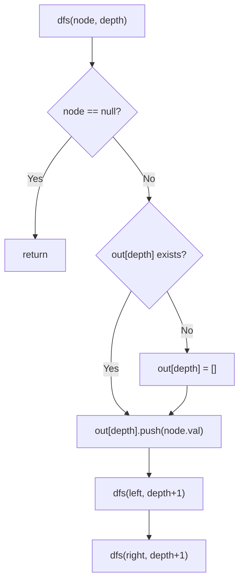
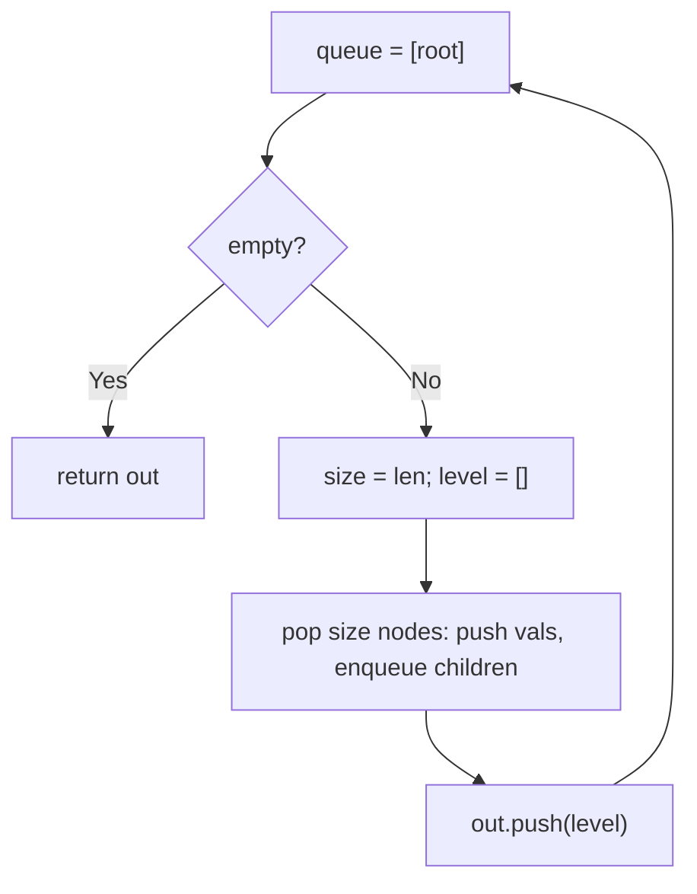

# 102. Binary Tree Level Order Traversal

- **LeetCode Link**: `https://leetcode.com/problems/binary-tree-level-order-traversal/`
- **Difficulty**: Medium
- **Pattern Category**: Binary Tree BFS / Canonical Level Partition
- **Prerequisite Primer**: `00-foundations/03-core-algorithmic-patterns.md`

---

## 1. Problem Overview & Edge Case Matrix

### Problem Statement
Given the `root` of a binary tree, return the level order traversal of its nodes' values — i.e., from left to right, level by level.

```
Example 1:
Input: root = [3,9,20,null,null,15,7]
Output: [[3],[9,20],[15,7]]

Example 2:
Input: root = [1]
Output: [[1]]

Example 3:
Input: root = []
Output: []
```

### Visual Problem Representation
```
        3              level 0: [3]
       / \
      9   20           level 1: [9, 20]
          / \
         15  7         level 2: [15, 7]
```

### Upfront Edge Case Matrix
| Edge Case Category | Specific Input Scenario | Expected Behavior | Pitfall / Risk |
| :--- | :--- | :--- | :--- |
| Empty / Nil | `root = null` | Return `[]` | `[[]]` off-by-shape |
| Single Element | `[1]` | Return `[[1]]` | Missing outer array |
| Skewed chain | One node per level | `N` singleton levels | Level snapshot with size 1 (still correct) |
| Wide level | $2^{10}$ nodes in a row | One huge bucket | Queue memory at the widest row |
| Null gaps | Missing children mid-tree | Skipped, never emitted | Enqueueing nulls as values |

---

## 2. Level 1: Brute Force Approach

### Intuition & Visual Idea
Recursive DFS carrying depth: append each value to `out[depth]`, creating the bucket on first visit. No queue at all — the call stack does the traversal while depth indexes the buckets.



### Pseudocode
```text
FUNCTION levelOrderRecursive(root):
    out = []
    DEFINE dfs(node, depth):
        IF node NULL: RETURN
        IF depth == out.LENGTH: out.PUSH([])
        out[depth].PUSH(node.val)
        dfs(node.left, depth + 1); dfs(node.right, depth + 1)
    dfs(root, 0)
    RETURN out
```

### Step-by-Step Dry Run (Visual Trace)
| Step | Iteration / Pointer ($i, j$) | Current Value | State / Sub-array | Action Taken |
| :--- | :--- | :--- | :--- | :--- |
| 0 | `dfs(3, 0)` | new bucket | `out = [[3]]` | Create + push |
| 1 | `dfs(9, 1)` | new bucket | `out = [[3],[9]]` | Create + push |
| 2 | `dfs(20, 1)` | bucket exists | `out = [[3],[9,20]]` | Push |
| 3 | `dfs(15, 2)`, `dfs(7, 2)` | new bucket | `out = [[3],[9,20],[15,7]]` | Return |

### Modern JavaScript Implementation
```javascript
/**
 * Shared backbone: LeetCode provides TreeNode; defined once here so every
 * level below is locally runnable when concatenated (Level 1 + 2 + 3).
 * Time Complexity:  n/a (scaffolding)
 * Space Complexity: n/a (scaffolding)
 */
class TreeNode {
  constructor(val, left = null, right = null) {
    this.val = val;
    this.left = left;
    this.right = right;
  }
}

function arrayToTree(arr) {
  if (arr.length === 0 || arr[0] === null || arr[0] === undefined) return null;
  const root = new TreeNode(arr[0]);
  const queue = [root];
  let i = 1;
  while (i < arr.length) {
    const node = queue.shift();
    if (i < arr.length && arr[i] !== null && arr[i] !== undefined) {
      node.left = new TreeNode(arr[i]);
      queue.push(node.left);
    }
    i++;
    if (i < arr.length && arr[i] !== null && arr[i] !== undefined) {
      node.right = new TreeNode(arr[i]);
      queue.push(node.right);
    }
    i++;
  }
  return root;
}

/**
 * Level 1: Brute Force (depth-indexed DFS buckets)
 * Time Complexity:  O(N) — one visit per node
 * Space Complexity: O(N) — output buckets plus O(H) stack
 */
function levelOrderRecursive(root) {
  const out = [];
  function dfs(node, depth) {
    if (node === null) return;
    // First visitor at a depth opens its bucket (preorder => left-to-right).
    if (depth === out.length) out.push([]);
    out[depth].push(node.val);
    dfs(node.left, depth + 1);
    dfs(node.right, depth + 1);
  }
  dfs(root, 0);
  return out;
}
```

### Complexity Breakdown
- **Time Complexity**: $O(N)$ — linear, but recursion depth follows tree height.
- **Space Complexity**: $O(N)$ — output buckets (required) plus $O(H)$ implicit stack.

---

## 3. Level 2: Optimized Approach

### Intuition & Visual Bottleneck Elimination
The textbook BFS: queue plus per-level size snapshot, one bucket array per level drained. Iterative, order-explicit, no recursion — the form every interviewer recognizes.



### Pseudocode
```text
FUNCTION levelOrderBFS(root):
    IF root NULL: RETURN []
    queue = [root]; out = []
    WHILE queue NOT EMPTY:
        size = queue.LENGTH; level = []
        REPEAT size TIMES:
            node = queue.SHIFT()
            level.PUSH(node.val)
            PUSH live children
        out.PUSH(level)
    RETURN out
```

### Step-by-Step Dry Run (Visual Trace)
| Step | Pointers / Window | Hash Map / Auxiliary State | Decision Logic | Output Accumulator |
| :--- | :--- | :--- | :--- | :--- |
| 0 | drain size `1` | node `3` | Bucket `[3]` | `out = [[3]]` |
| 1 | drain size `2` | nodes `9, 20` | Bucket `[9,20]` | Enqueue `15, 7` |
| 2 | drain size `2` | nodes `15, 7` | Bucket `[15,7]` | Queue empty |
| 3 | return | — | — | `[[3],[9,20],[15,7]]` |

### Modern JavaScript Implementation
```javascript
/**
 * Level 2: Optimized (textbook BFS with level snapshots)
 * Time Complexity:  O(N) — each node enqueued once (plus shift() caveat below)
 * Space Complexity: O(W) — widest level queued; output excluded
 */
// TreeNode shared from Level 1.
function levelOrderBFS(root) {
  if (root === null) return [];
  const queue = [root];
  const out = [];
  while (queue.length > 0) {
    // Snapshot BEFORE draining: children pushed below belong to next level.
    const size = queue.length;
    const level = [];
    for (let i = 0; i < size; i++) {
      const node = queue.shift();
      level.push(node.val);
      if (node.left !== null) queue.push(node.left);
      if (node.right !== null) queue.push(node.right);
    }
    out.push(level);
  }
  return out;
}
```

### Complexity Breakdown
- **Time Complexity**: $O(N)$ nominally — but `shift()` is $O(N)$ memmove on V8, so wide trees pay a hidden quadratic tax (Level 3's fix).
- **Space Complexity**: $O(W)$ — widest level; optimal for level-aware output.

---

## 4. Level 3: Most Optimal / Canonical Approach

### Intuition & Mathematical / Invariant Proof
Level 2's algorithm with a head-index queue: `queue[head++]` dequeues in $O(1)$, making the $O(N)$ bound honest. Invariant: at loop top, `queue[head .. head+size)` is exactly one level — snapshot once, drain once, bucket once. Same output as Level 2, strictly better constants, zero behavioral difference: this is the production form of the textbook answer.

```
queue = [3, 9, 20, 15, 7], head advances 0->1->3->5, buckets cut by snapshots
```

### Pseudocode
```text
FUNCTION levelOrder(root):
    IF root NULL: RETURN []
    queue = [root]; head = 0; out = []
    WHILE head < queue.LENGTH:
        size = queue.LENGTH - head; level = []
        REPEAT size TIMES:
            node = queue[head++]
            level.PUSH(node.val)
            PUSH live children
        out.PUSH(level)
    RETURN out
```

### Step-by-Step Dry Run (Visual Trace)
| Step | Pointer $L$ | Pointer $R$ | Invariant Checked | In-Place State |
| :--- | :--- | :--- | :--- | :--- |
| 1 | `head=0`, size `1` | drain `[3]` | Bucket `[3]`, enqueue `9, 20` | `out = [[3]]` |
| 2 | `head=1`, size `2` | drain `[9,20]` | Bucket `[9,20]`, enqueue `15, 7` | `out = [[3],[9,20]]` |
| 3 | `head=3`, size `2` | drain `[15,7]` | Bucket `[15,7]` | Queue exhausted |
| 4 | `head=5` | loop ends | — | Return `[[3],[9,20],[15,7]]` |

### Modern JavaScript Implementation
```javascript
/**
 * Level 3: Most Optimal / Canonical (head-index BFS)
 * Time Complexity:  O(N) — honest linear, optimal lower bound
 * Space Complexity: O(W) — widest level; output excluded
 */
// TreeNode shared from Level 1.
function levelOrder(root) {
  if (root === null) return [];
  const queue = [root];
  let head = 0; // read cursor: O(1) dequeue, no memmove
  const out = [];
  while (head < queue.length) {
    const size = queue.length - head; // snapshot: exactly one level
    const level = [];
    for (let i = 0; i < size; i++) {
      const node = queue[head++];
      level.push(node.val);
      if (node.left !== null) queue.push(node.left);
      if (node.right !== null) queue.push(node.right);
    }
    out.push(level);
  }
  return out;
}
```

### Complexity Breakdown
- **Time Complexity**: $O(N)$ — optimal lower bound; every node is emitted once and level framing is free.
- **Space Complexity**: $O(W)$ — widest level queued; the minimum any level-partitioned traversal can hold.

---

## 5. JavaScript-Specific Gotchas & V8 Optimizations
- **GC Pressure**: Avoid allocating objects inside tight loops ($O(N)$ closures). One small array per level is inherent to the output shape — but never allocate per-NODE wrappers (e.g. `{ node, depth }` pairs) when a snapshot counter suffices.
- **Type Coercion / Sorting**: `queue.shift()` returns `undefined` on empty (never throws) — a missing loop guard silently pushes `undefined.val` TypeErrors downstream; the `head < length` guard fails closed instead.
- **Index Bounds**: Snapshotting `size` before the drain loop is load-bearing — reading `queue.length` live inside the loop mixes children into the current bucket and corrupts every level boundary.

---

## 6. Real-World MAANG Interview Follow-Ups & Extensions

### Follow-Up 1: Zigzag, right-view, and averages as one-liners on top
- **Scenario**: Level-order variants (LeetCode 103, 199, 637 — this module's siblings).
- **Solution Strategy**: All three consume `levelOrder` output (or its loop): zigzag reverses alternate buckets, right view takes tails, averages reduce — one traversal kernel, many projections.
- **JS Code / Implementation Pattern**:
```javascript
function levelProjections(root) {
  const levels = levelOrder(root);
  return {
    zigzag: levels.map((lv, i) => (i % 2 ? [...lv].reverse() : lv)),
    rightView: levels.map((lv) => lv[lv.length - 1]),
    averages: levels.map((lv) => lv.reduce((a, v) => a + v, 0) / lv.length),
  };
}
```

### Follow-Up 2: Bottom-up and streaming level order
- **Scenario**: Return levels deepest-first (LeetCode 107), or emit levels as they complete from a stream.
- **Solution Strategy**: Bottom-up = `out.reverse()` (or unshift per level); streaming = generator yielding each bucket at snapshot boundaries — $O(W)$ RAM either way.
- **JS Code / Implementation Pattern**:
```javascript
function* levelOrderStream(root) {
  if (!root) return;
  const queue = [root];
  let head = 0;
  while (head < queue.length) {
    const size = queue.length - head;
    const level = [];
    for (let i = 0; i < size; i++) {
      const node = queue[head++];
      level.push(node.val);
      if (node.left) queue.push(node.left);
      if (node.right) queue.push(node.right);
    }
    yield level;
  }
}
```

### Follow-Up 3: $10^9$-node tree with external-memory levels
- **Scenario & In-Depth Solution**: Levels exceed RAM; the queue must spill to disk. Snapshot boundaries are natural page boundaries: flush the current level's child page before draining the next. Sequential I/O per level, $O(W)$ RAM, zero random access.
```javascript
async function levelOrderPaged(rootId, loadPage) {
  const out = [];
  let level = [rootId];
  while (level.length > 0) {
    const page = await loadPage(level);
    out.push(page.vals);
    level = page.childIds;
  }
  return out;
}
```
