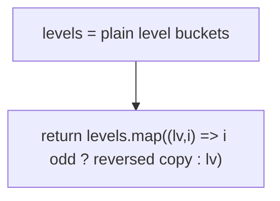
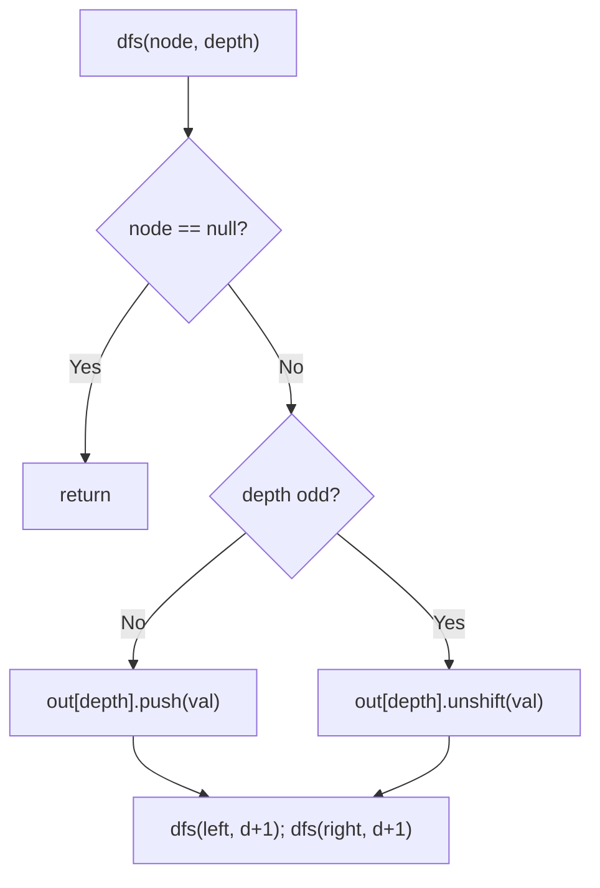
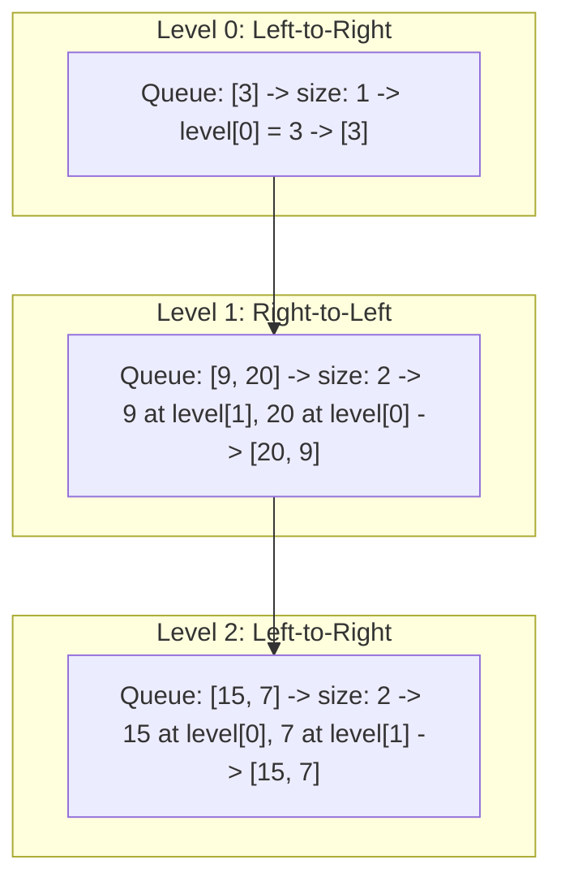

# 103. Binary Tree Zigzag Level Order Traversal

- **LeetCode Link**: `https://leetcode.com/problems/binary-tree-zigzag-level-order-traversal/`
- **Difficulty**: Medium
- **Pattern Category**: Binary Tree BFS / Alternating Direction
- **Prerequisite Primer**: `00-foundations/03-core-algorithmic-patterns.md`

---

## 1. Problem Overview & Edge Case Matrix

### Problem Statement
Given the `root` of a binary tree, return the zigzag level order traversal of its nodes' values — i.e., from left to right, then right to left for the next level, alternating between.

```
Example 1:
Input: root = [3,9,20,null,null,15,7]
Output: [[3],[20,9],[15,7]]

Example 2:
Input: root = [1]
Output: [[1]]

Example 3:
Input: root = []
Output: []
```

### Visual Problem Representation
```
        3              level 0 L->R: [3]
       / \
      9   20           level 1 R->L: [20, 9]
          / \
         15  7         level 2 L->R: [15, 7]
```

### Upfront Edge Case Matrix
| Edge Case Category | Specific Input Scenario | Expected Behavior | Pitfall / Risk |
| :--- | :--- | :--- | :--- |
| Empty / Nil | `root = null` | Return `[]` | Direction flag on empty |
| Single Element | `[1]` | Return `[[1]]` | Level-0 direction (must be L→R) |
| Skewed chain | One node per level | Alternation invisible but correct | Direction toggle still consistent |
| Even-level count | 4+ levels | Pattern holds throughout | Off-by-one on which levels reverse |
| Aliasing on reverse | Reusing bucket arrays | No input mutation | `level.reverse()` mutating a shared bucket |

---

## 2. Level 1: Brute Force Approach

### Intuition & Visual Idea
Plain level buckets first, then reverse every odd-indexed bucket into a copy. Two clean phases — and a full second pass plus doubled odd-level arrays.



### Pseudocode
```text
FUNCTION zigzagLevelOrderBruteForce(root):
    IF root NULL: RETURN []
    levels = LEVEL_BUCKETS(root)
    RETURN levels.MAP((level, i) => i MOD 2 == 1 ? REVERSED-COPY(level) : level)
```

### Step-by-Step Dry Run (Visual Trace)
| Step | Iteration / Pointer ($i, j$) | Current Value | State / Sub-array | Action Taken |
| :--- | :--- | :--- | :--- | :--- |
| 0 | bucket all | `[[3],[9,20],[15,7]]` | Plain BFS | Collect |
| 1 | index `0` (even) | `[3]` | Kept as-is | No copy |
| 2 | index `1` (odd) | `[9,20]` → `[20,9]` | Reversed COPY | `[...lv].reverse()` |
| 3 | index `2` (even) | `[15,7]` | Kept as-is | Return |

### Modern JavaScript Implementation
```javascript
/**
 * Shared backbone: LeetCode provides TreeNode; defined once here so every
 * level below is locally runnable when concatenated (Level 1 + 2 + 3).
 * Time Complexity:  n/a (scaffolding)
 * Space Complexity: n/a (scaffolding)
 */
class TreeNode {
  constructor(val, left = null, right = null) {
    this.val = val;
    this.left = left;
    this.right = right;
  }
}

function arrayToTree(arr) {
  if (arr.length === 0 || arr[0] === null || arr[0] === undefined) return null;
  const root = new TreeNode(arr[0]);
  const queue = [root];
  let i = 1;
  while (i < arr.length) {
    const node = queue.shift();
    if (i < arr.length && arr[i] !== null && arr[i] !== undefined) {
      node.left = new TreeNode(arr[i]);
      queue.push(node.left);
    }
    i++;
    if (i < arr.length && arr[i] !== null && arr[i] !== undefined) {
      node.right = new TreeNode(arr[i]);
      queue.push(node.right);
    }
    i++;
  }
  return root;
}

/**
 * Level 1: Brute Force (buckets + post-reverse odd levels)
 * Time Complexity:  O(N) — walk plus reversal pass
 * Space Complexity: O(N) — buckets plus reversed copies
 */
function zigzagLevelOrderBruteForce(root) {
  if (root === null) return [];
  const levels = [];
  const queue = [root];
  while (queue.length > 0) {
    const size = queue.length;
    const level = [];
    for (let i = 0; i < size; i++) {
      const node = queue.shift();
      level.push(node.val);
      if (node.left !== null) queue.push(node.left);
      if (node.right !== null) queue.push(node.right);
    }
    levels.push(level);
  }
  // Copy-then-reverse: bare .reverse() would mutate the stored bucket.
  return levels.map((level, i) => (i % 2 === 1 ? [...level].reverse() : level));
}
```

### Complexity Breakdown
- **Time Complexity**: $O(N)$ — linear, but every odd level is written twice.
- **Space Complexity**: $O(N)$ — buckets plus reversed copies.

---

## 3. Level 2: Optimized Approach

### Intuition & Visual Bottleneck Elimination
DFS with depth buckets, inserting at the front (`unshift`) on odd depths — direction handled during collection, no post-pass. One walk, but `unshift` shifts the bucket per insert.



### Pseudocode
```text
FUNCTION zigzagLevelOrderDFS(root):
    out = []
    DEFINE dfs(node, depth):
        IF node NULL: RETURN
        IF depth == out.LENGTH: out.PUSH([])
        IF depth MOD 2 == 0: out[depth].PUSH(node.val)
        ELSE: out[depth].UNSHIFT(node.val)
        dfs(node.left, depth + 1); dfs(node.right, depth + 1)
    dfs(root, 0)
    RETURN out
```

### Step-by-Step Dry Run (Visual Trace)
| Step | Pointers / Window | Hash Map / Auxiliary State | Decision Logic | Output Accumulator |
| :--- | :--- | :--- | :--- | :--- |
| 0 | `dfs(3, 0)` | even → push | New bucket | `out = [[3]]` |
| 1 | `dfs(9, 1)` | odd → unshift | Bucket `[9]` | `out = [[3],[9]]` |
| 2 | `dfs(20, 1)` | odd → unshift | Front-insert | `out = [[3],[20,9]]` |
| 3 | `dfs(15, 2)`, `dfs(7, 2)` | even → push | Append in order | `[[3],[20,9],[15,7]]` |

### Modern JavaScript Implementation
```javascript
/**
 * Level 2: Optimized (DFS with directional insert)
 * Time Complexity:  O(N + W²) worst case — unshift shifts odd buckets
 * Space Complexity: O(N) — buckets plus O(H) stack
 */
// TreeNode shared from Level 1.
function zigzagLevelOrderDFS(root) {
  const out = [];
  function dfs(node, depth) {
    if (node === null) return;
    if (depth === out.length) out.push([]);
    // Even depths read left-to-right (push); odd depths right-to-left.
    // unshift() is O(W): the hidden cost Level 3 removes.
    if (depth % 2 === 0) out[depth].push(node.val);
    else out[depth].unshift(node.val);
    dfs(node.left, depth + 1);
    dfs(node.right, depth + 1);
  }
  dfs(root, 0);
  return out;
}
```

### Complexity Breakdown
- **Time Complexity**: $O(N + W^2)$ worst case — each odd-level `unshift` memmoves its bucket.
- **Space Complexity**: $O(N)$ — buckets; direction costs shifts instead of copies.

---

## 4. Level 3: Most Optimal / Canonical Approach

### Intuition & Mathematical / Invariant Proof
BFS with a direction flag and index-mirrored writes: pre-size each level array and write position `i` (or `size-1-i` on reversed levels) while draining left-to-right exactly once. Invariant: children always enqueue in natural order (traversal order is direction-independent); only the WRITE index mirrors. No reverse pass, no unshift — each value written once.

```
level [9,20], size 2, R->L: write 9 at [1], 20 at [0] => [20,9]
```

### Pseudocode
```text
FUNCTION zigzagLevelOrder(root):
    IF root NULL: RETURN []
    queue = [root]; head = 0; out = []; leftToRight = true
    WHILE head < queue.LENGTH:
        size = queue.LENGTH - head; level = ARRAY(size)
        REPEAT size TIMES (i = 0..):
            node = queue[head++]
            level[leftToRight ? i : size - 1 - i] = node.val
            PUSH live children
        out.PUSH(level); leftToRight = NOT leftToRight
    RETURN out
```

### Step-by-Step Dry Run (Visual Trace)
| Step | Pointer $L$ | Pointer $R$ | Invariant Checked | In-Place State |
| :--- | :--- | :--- | :--- | :--- |
| 1 | level 0, L→R | `level[0] = 3` | Flag true | `out = [[3]]`, toggle |
| 2 | level 1, R→L | `9 → [1]`, `20 → [0]` | Mirrored writes | `out = [[3],[20,9]]`, toggle |
| 3 | level 2, L→R | `15 → [0]`, `7 → [1]` | Natural writes | `out = [[3],[20,9],[15,7]]` |

### Modern JavaScript Implementation
```javascript
/**
 * Level 3: Most Optimal / Canonical (mirrored-index BFS)
 * Time Complexity:  O(N) — honest linear, each value written once
 * Space Complexity: O(W) — widest level; output excluded
 */
// TreeNode shared from Level 1.
function zigzagLevelOrder(root) {
  if (root === null) return [];
  const queue = [root];
  let head = 0; // read cursor: O(1) dequeue
  const out = [];
  let leftToRight = true;
  while (head < queue.length) {
    const size = queue.length - head; // snapshot: exactly one level
    const level = new Array(size); // pre-sized: writes land by index
    for (let i = 0; i < size; i++) {
      const node = queue[head++];
      // Traversal order never changes; only the WRITE slot mirrors.
      level[leftToRight ? i : size - 1 - i] = node.val;
      if (node.left !== null) queue.push(node.left);
      if (node.right !== null) queue.push(node.right);
    }
    out.push(level);
    leftToRight = !leftToRight;
  }
  return out;
}
```

### Complexity Breakdown
- **Time Complexity**: $O(N)$ — optimal lower bound; no reverse pass, no shifts.
- **Space Complexity**: $O(W)$ — widest level queued; output excluded.

---

## 5. JavaScript-Specific Gotchas & V8 Optimizations
- **GC Pressure**: Avoid allocating objects inside tight loops ($O(N)$ closures). Level 1's reversed copies and Level 2's repeated `unshift` memmoves are the pressure removed — Level 3 writes each value once into a pre-sized array.
- **Type Coercion / Sorting**: `new Array(size)` creates holes — but every slot is written exactly once before `out.push`, so no hole ever escapes; `[...lv].reverse()` (Level 1) copies precisely because bare `.reverse()` mutates in place.
- **Index Bounds**: `size - 1 - i` mirrors correctly only when `size` is snapshotted before draining — a live `queue.length` in the mirror formula drifts as children enqueue and scrambles the level.

---

## 6. Real-World MAANG Interview Follow-Ups & Extensions

### Follow-Up 1: K-direction rotation (zigzag with period K)
- **Scenario**: Direction cycles every $K$ levels instead of alternating.
- **Solution Strategy**: Replace the boolean with `levelIndex % K` direction table; mirrored-index writes generalize to any permutation (e.g. bit-reversal order) applied per level.
- **JS Code / Implementation Pattern**:
```javascript
function kZigzag(root, K) {
  return levelBuckets(root).map((lv, i) =>
    i % K === 0 ? lv : [...lv].reverse(),
  );
}
```

### Follow-Up 2: Zigzag over a $10^9$-node stream with $O(W)$ RAM
- **Scenario**: Nodes stream in level order; only one level fits in memory.
- **Solution Strategy**: Level 3's shape already streams: buffer one level, emit (mirrored as needed), evict, repeat. Direction flag is the only cross-level state.
- **JS Code / Implementation Pattern**:
```javascript
async function zigzagStream(nodeStream) {
  const out = [];
  let leftToRight = true;
  for await (const level of groupByLevel(nodeStream)) {
    out.push(leftToRight ? level : [...level].reverse());
    leftToRight = !leftToRight;
  }
  return out;
}
```

### Follow-Up 3: Boustrophedon (snake) DFS without level metadata
- **Scenario & In-Depth Solution**: Produce zigzag order from a stateless walker that only knows "came from parent/left/right" (robot traversal). Alternate child-visit order by depth parity during DFS and emit on first visit — Level 2's core idea with the bucket replaced by direct emission into per-depth queues.
```javascript
function snakeWalk(root) {
  const out = [];
  function dfs(node, depth, visitOrder) {
    if (!node) return;
    (out[depth] ??= [])[visitOrder === 'ltr' ? 'push' : 'unshift'](node.val);
    const [first, second] = visitOrder === 'ltr' ? ['left', 'right'] : ['right', 'left'];
    dfs(node[first], depth + 1, flip(visitOrder));
    dfs(node[second], depth + 1, flip(visitOrder));
  }
  dfs(root, 0, 'ltr');
  return out;
}
```

---

## 7. What LeetCode Discuss Says (Language-Independent)

Source: top-voted post by Pradhuman Gupta —
`https://leetcode.com/problems/binary-tree-zigzag-level-order-traversal/solutions/6896289/beats-100-using-bfs-and-deque-java-pytho-uc88/`
— 19K views.
Language-independent summary. No new JS here.

### A. Optimal way from Discuss (Preserve FIFO Queue with Fixed-Size Index Placement)

Rather than reversing arrays after traversal or changing queue insertion logic, the optimal approach preserves standard BFS and assigns each value directly into its pre-allocated slot:

1. **Standard FIFO Queue:** Nodes are always enqueued left-to-right.
2. **Direction Flag:** Maintain a boolean flag `isLeftToRight = true`.
3. **Pre-allocated Level Slots:** For each level of size $K$, allocate an array of size $K$:
   - If `isLeftToRight` is true, write to index $i$.
   - If `isLeftToRight` is false, write to index $K - 1 - i$.
4. **Flip Orientation:** Invert `isLeftToRight = !isLeftToRight` after completing each level.

```text
FUNCTION zigzagLevelOrder(root):
    IF root == null:
        RETURN []

    result = []
    queue = new Queue()
    queue.push(root)
    isLeftToRight = true

    WHILE NOT queue.isEmpty():
        levelSize = queue.size()
        level = new Array(levelSize)

        FOR i FROM 0 TO levelSize - 1:
            curr = queue.pop()

            // Calculate target slot based on direction
            index = isLeftToRight ? i : (levelSize - 1 - i)
            level[index] = curr.val

            // Children ALWAYS enter queue in standard left-to-right order
            IF curr.left != null:
                queue.push(curr.left)
            IF curr.right != null:
                queue.push(curr.right)

        result.push(level)
        isLeftToRight = NOT isLeftToRight

    RETURN result
```

- Time: O(N) where N is the number of nodes, each node is processed once with $O(1)$ index placement.
- Space: O(W) where W is the maximum tree width (up to $O(N)$ queue storage).



### B. Dry run on LeetCode Example 1 (`root = [3,9,20,null,null,15,7]`)

- `queue = [3]`, `isLeftToRight = true`.
- **Level 0 (`size = 1`):**
  - $i=0$: pop 3. `isLeftToRight` true -> `index = 0`. `level[0] = 3`.
  - Children 9, 20 enqueued left-to-right.
  - Result: `[[3]]`. Flip `isLeftToRight = false`.
- **Level 1 (`size = 2`):**
  - $i=0$: pop 9. `isLeftToRight` false -> `index = 2 - 1 - 0 = 1`. `level[1] = 9`.
  - $i=1$: pop 20. `index = 2 - 1 - 1 = 0`. `level[0] = 20`.
  - Children 15, 7 enqueued left-to-right.
  - Level array is `[20, 9]`. Result: `[[3], [20, 9]]`. Flip `isLeftToRight = true`.
- **Level 2 (`size = 2`):**
  - $i=0$: pop 15 -> `level[0] = 15`.
  - $i=1$: pop 7 -> `level[1] = 7`.
  - Level array is `[15, 7]`. Result: `[[3], [20, 9], [15, 7]]`. Flip `isLeftToRight = false`.
- Queue is empty.

Final result: `[[3], [20, 9], [15, 7]]`.

### C. Why Direct Index Assignment Beats Reversal Passes

- Calling an explicit array reverse (`level.reverse()`) or unshifting onto lists takes $O(K)$ extra operations or shifts per level.
- Computing `level[isLeftToRight ? i : (size - 1 - i)] = curr.val` writes each element directly to its destination index in $O(1)$ time with zero subsequent re-ordering.

### D. Pitfalls from comments

- **Altering Child Push Order:** Trying to reverse the queue order by pushing `right` before `left` during odd levels corrupts the tree structure for subsequent levels. The queue MUST always receive children in left-to-right order.
- **Toggling Flag in the Inner Loop:** Placing `isLeftToRight = !isLeftToRight` inside the node-processing loop alternates per-node rather than per-level.

### E. Companies

- Discuss post itself names none.
  Companies tab on LeetCode is premium-locked.
- External source:
  `https://github.com/liquidslr/leetcode-company-wise-problems`
  (LeetCode company tags, updated June 2025).
- All-time (20): Accenture, Adobe, Amazon, Apple, Bloomberg, ByteDance, Citadel, Goldman Sachs, Google, LinkedIn, Meta, Microsoft, Nutanix, Oracle, Palo Alto Networks, Sigmoid, TikTok, Walmart Labs, Yandex.
- Recent: 30 days — Google.
- Recent: 3 months — Amazon, Bloomberg, Google.
