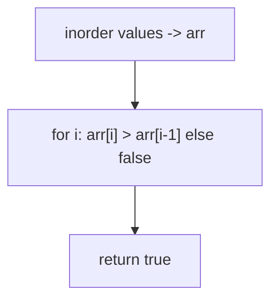
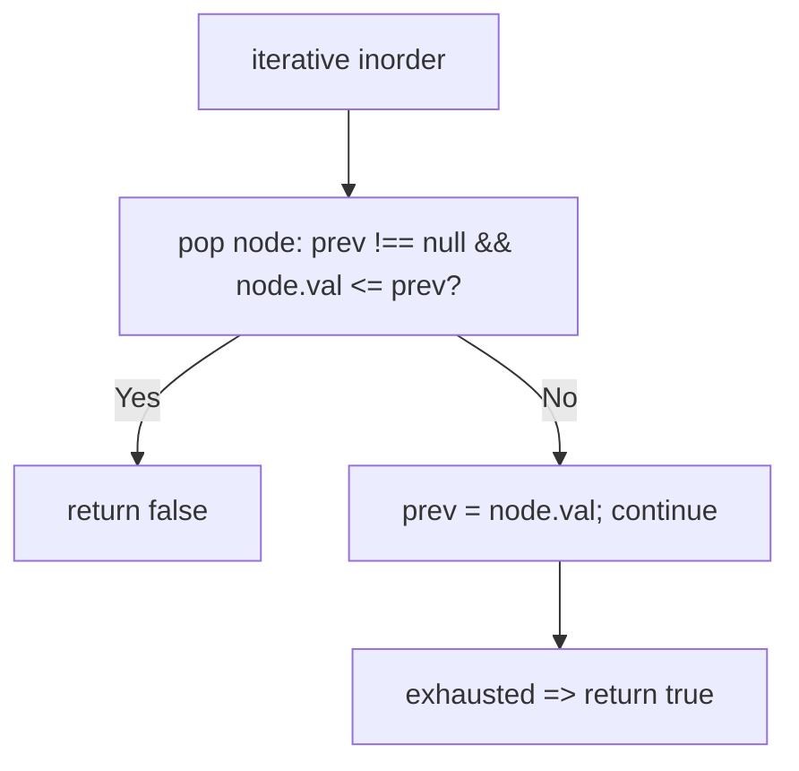
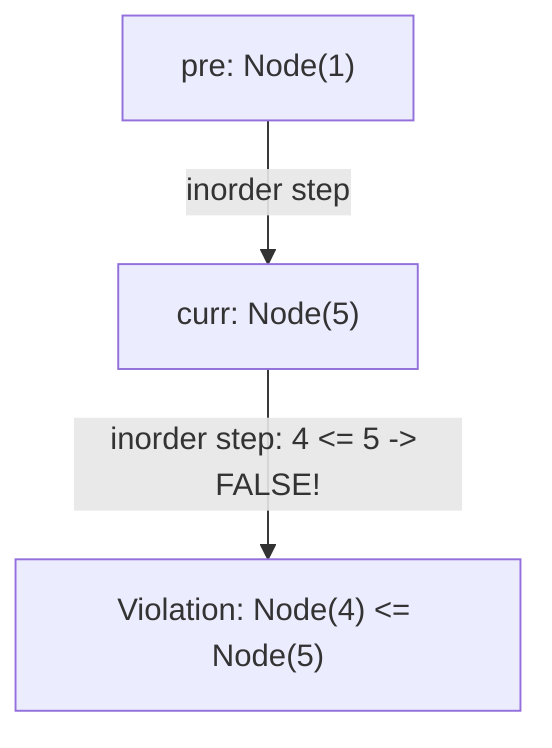

# 98. Validate Binary Search Tree

- **LeetCode Link**: `https://leetcode.com/problems/validate-binary-search-tree/`
- **Difficulty**: Medium
- **Pattern Category**: BST / Bounds Propagation
- **Prerequisite Primer**: `00-foundations/03-core-algorithmic-patterns.md`

---

## 1. Problem Overview & Edge Case Matrix

### Problem Statement
Given the `root` of a binary tree, determine if it is a valid binary search tree (BST). A valid BST has: the left subtree of a node contains only nodes with keys less than the node's key; the right subtree only nodes with keys greater than the node's key; and both subtrees are valid BSTs.

```
Example 1:
Input: root = [2,1,3]
Output: true

Example 2:
Input: root = [5,1,4,null,null,3,6]
Output: false
Explanation: The root's value is 5 but its right child's value is 4.
```

### Visual Problem Representation
```
valid:       2                  invalid:     5
            / \                            / \
           1   3                          1   4
                                                / \
                                               3   6   (3 < 5 in RIGHT subtree)
```

### Upfront Edge Case Matrix
| Edge Case Category | Specific Input Scenario | Expected Behavior | Pitfall / Risk |
| :--- | :--- | :--- | :--- |
| Empty / Nil | `root = null` | Return `true` | Vacuous truth mishandled |
| Single Element | `[1]` | Return `true` | Bound initialization |
| Duplicates | `[2,2,2]` / `[1,1]` | Return `false` (strict) | `<=` vs `<` on bounds |
| Deep violation | `[5,1,4,null,null,3,6]` | Return `false` | Checking only parent-child pairs |
| Extreme values | `[−2³¹, null, 2³¹−1]` | Return `true` | `±Infinity` vs int-bound sentinels |

---

## 2. Level 1: Brute Force Approach

### Intuition & Visual Idea
Inorder traversal of a BST yields strictly increasing values — collect them all, then verify the array is strictly sorted. The property does the work; two phases and $O(N)$ storage do the cost.



### Pseudocode
```text
FUNCTION isValidBSTBruteForce(root):
    vals = INORDER(root)   // iterative or recursive collection
    FOR i = 1 .. vals.LENGTH - 1:
        IF vals[i] <= vals[i-1]: RETURN false
    RETURN true
```

### Step-by-Step Dry Run (Visual Trace)
| Step | Iteration / Pointer ($i, j$) | Current Value | State / Sub-array | Action Taken |
| :--- | :--- | :--- | :--- | :--- |
| 0 | inorder `[2,1,3]` | `[1,2,3]` | Full walk | Collect |
| 1 | `1 < 2 < 3` | strictly increasing | — | Return `true` |
| 2 | inorder `[5,1,4,3,6]` | `[1,5,3,4,6]` | `5 > 3` at `i=2` | Return `false` |

### Modern JavaScript Implementation
```javascript
/**
 * Shared backbone: LeetCode provides TreeNode; defined once here so every
 * level below is locally runnable when concatenated (Level 1 + 2 + 3).
 * Time Complexity:  n/a (scaffolding)
 * Space Complexity: n/a (scaffolding)
 */
class TreeNode {
  constructor(val, left = null, right = null) {
    this.val = val;
    this.left = left;
    this.right = right;
  }
}

function arrayToTree(arr) {
  if (arr.length === 0 || arr[0] === null || arr[0] === undefined) return null;
  const root = new TreeNode(arr[0]);
  const queue = [root];
  let i = 1;
  while (i < arr.length) {
    const node = queue.shift();
    if (i < arr.length && arr[i] !== null && arr[i] !== undefined) {
      node.left = new TreeNode(arr[i]);
      queue.push(node.left);
    }
    i++;
    if (i < arr.length && arr[i] !== null && arr[i] !== undefined) {
      node.right = new TreeNode(arr[i]);
      queue.push(node.right);
    }
    i++;
  }
  return root;
}

/**
 * Level 1: Brute Force (inorder array + sortedness check)
 * Time Complexity:  O(N) — full walk plus linear scan
 * Space Complexity: O(N) — value array
 */
function isValidBSTBruteForce(root) {
  const vals = [];
  const stack = [];
  let cur = root;
  // Iterative inorder: no recursion, but the full array is still stored.
  while (cur !== null || stack.length > 0) {
    while (cur !== null) {
      stack.push(cur);
      cur = cur.left;
    }
    cur = stack.pop();
    vals.push(cur.val);
    cur = cur.right;
  }
  // STRICT increase: duplicates invalidate a BST.
  for (let i = 1; i < vals.length; i++) {
    if (vals[i] <= vals[i - 1]) return false;
  }
  return true;
}
```

### Complexity Breakdown
- **Time Complexity**: $O(N)$ — always walks everything, even when the root already violates.
- **Space Complexity**: $O(N)$ — value array; order checking needs one previous value, not all.

---

## 3. Level 2: Optimized Approach

### Intuition & Visual Bottleneck Elimination
Track only the previous value during iterative inorder: compare on the fly and bail at the first inversion. No array — $O(H)$ stack with early exit.



### Pseudocode
```text
FUNCTION isValidBSTInorder(root):
    stack = []; cur = root; prev = NULL
    WHILE cur NOT NULL OR stack NOT EMPTY:
        WHILE cur NOT NULL: stack.PUSH(cur); cur = cur.left
        cur = stack.POP()
        IF prev NOT NULL AND cur.val <= prev: RETURN false
        prev = cur.val; cur = cur.right
    RETURN true
```

### Step-by-Step Dry Run (Visual Trace)
| Step | Pointers / Window | Hash Map / Auxiliary State | Decision Logic | Output Accumulator |
| :--- | :--- | :--- | :--- | :--- |
| 0 | visit `1` | `prev = null` | First value, no check | `prev = 1` |
| 1 | visit `5` | `5 > 1` | OK | `prev = 5` |
| 2 | visit `3` | `3 <= 5` | Inversion! | Return `false` immediately |

### Modern JavaScript Implementation
```javascript
/**
 * Level 2: Optimized (streaming inorder with previous-value check)
 * Time Complexity:  O(N) worst case — exits at the first inversion
 * Space Complexity: O(H) — explicit stack only
 */
// TreeNode shared from Level 1.
function isValidBSTInorder(root) {
  const stack = [];
  let cur = root;
  let prev = null; // null = "no previous": first value always passes
  while (cur !== null || stack.length > 0) {
    while (cur !== null) {
      stack.push(cur);
      cur = cur.left;
    }
    cur = stack.pop();
    // Strictly greater required: <= catches duplicates AND inversions.
    if (prev !== null && cur.val <= prev) return false;
    prev = cur.val;
    cur = cur.right;
  }
  return true;
}
```

### Complexity Breakdown
- **Time Complexity**: $O(N)$ worst case — typically far less via early exit.
- **Space Complexity**: $O(H)$ — explicit stack; no value storage.

---

## 4. Level 3: Most Optimal / Canonical Approach

### Intuition & Mathematical / Invariant Proof
Bounds propagation: each node must lie in `(low, high)`, tightened as recursion descends (left child caps `high` at the parent's value; right child floors `low`). This catches DEEP violations that parent-child checks miss — the actual BST definition, enforced structurally. Invariant: at every call, all values in the current subtree must satisfy `low < val < high`, which is exactly validity of that subtree in context.

```
validate(4-subtree, low=5, high=inf): 4 <= 5? wait 4 < 5 violates low bound
  -> node 4 with (5, inf): 4 <= 5 => false. Correct: 4 sits right of 5.
```

### Pseudocode
```text
FUNCTION isValidBST(node, low = -Infinity, high = Infinity):
    IF node NULL: RETURN true
    IF node.val <= low OR node.val >= high: RETURN false
    RETURN isValidBST(node.left, low, node.val)
       AND isValidBST(node.right, node.val, high)
```

### Step-by-Step Dry Run (Visual Trace)
| Step | Pointer $L$ | Pointer $R$ | Invariant Checked | In-Place State |
| :--- | :--- | :--- | :--- | :--- |
| 1 | `(5, -inf, +inf)` | in bounds | Recurse `(1, -inf, 5)`, `(4, 5, +inf)` | Continue |
| 2 | `(1, -inf, 5)` | valid leaf-side | Returns `true` | Left OK |
| 3 | `(4, 5, +inf)` | `4 <= 5` violates LOW | Deep violation caught | Return `false` |
| 4 | `&&` short-circuits | — | No further visits | Return `false` |

### Modern JavaScript Implementation
```javascript
/**
 * Level 3: Most Optimal / Canonical (recursive bounds propagation)
 * Time Complexity:  O(N) worst case — short-circuits on first violation
 * Space Complexity: O(H) — call stack depth equals height
 */
// TreeNode shared from Level 1.
function isValidBST(root, low = -Infinity, high = Infinity) {
  if (root === null) return true; // empty subtree is vacuously valid
  // STRICT bounds: equality on either side invalidates (no duplicates).
  if (root.val <= low || root.val >= high) return false;
  // Left subtree caps high at this value; right floors low. Both must hold.
  return isValidBST(root.left, low, root.val)
    && isValidBST(root.right, root.val, high);
}
```

### Complexity Breakdown
- **Time Complexity**: $O(N)$ worst case — optimal with short-circuit; violations near the root end the walk instantly.
- **Space Complexity**: $O(H)$ — implicit stack; `-Infinity`/`Infinity` defaults cover the full integer range.

---

## 5. JavaScript-Specific Gotchas & V8 Optimizations
- **GC Pressure**: Avoid allocating objects inside tight loops ($O(N)$ closures). Level 1's $N$-value array is the pressure removed — Levels 2–3 carry one `prev` number or two bound numbers per frame.
- **Type Coercion / Sorting**: Default bounds MUST be `±Infinity`, not `Number.MIN_SAFE_INTEGER`/`MAX_SAFE_INTEGER` — spec values reach $\pm 2^{31}$ and custom tests may push past $2^{53}$; `<=`/`>=` strictness (not `<`/`>`) is what rejects duplicates.
- **Index Bounds**: The classic trap is validating parent-child pairs only (`left.val < node.val`) — ex.2's `3` passes its parent (`3 < 4`) while violating the root. Bounds propagation exists precisely to catch depth-2+ violations.

---

## 6. Real-World MAANG Interview Follow-Ups & Extensions

### Follow-Up 1: Recover a BST with two swapped nodes
- **Scenario**: Exactly two nodes' values are swapped (LeetCode 99); fix in place.
- **Solution Strategy**: Level 2's streaming inorder finds both inversions (first: `prev` holder; second: current) in one walk; swap their values after. $O(H)$ space, no array.
- **JS Code / Implementation Pattern**:
```javascript
function recoverTree(root) {
  let prev = null, first = null, second = null;
  function inorder(node) {
    if (!node) return;
    inorder(node.left);
    if (prev && node.val < prev.val) {
      if (!first) first = prev;
      second = node;
    }
    prev = node;
    inorder(node.right);
  }
  inorder(root);
  [first.val, second.val] = [second.val, first.val];
}
```

### Follow-Up 2: Largest BST subtree / count of BST subtrees
- **Scenario**: Find the biggest valid-BST subtree (or count them) in an arbitrary binary tree.
- **Solution Strategy**: Level 3's bounds walk returns richer info per subtree: `{ valid, size, min, max }` — combine bottom-up, tracking the max valid size. One pass, $O(H)$ space.
- **JS Code / Implementation Pattern**:
```javascript
function largestBSTSubtree(root) {
  let best = 0;
  function info(node) {
    if (!node) return { valid: true, size: 0, lo: Infinity, hi: -Infinity };
    const l = info(node.left), r = info(node.right);
    const ok = l.valid && r.valid && node.val > l.hi && node.val < r.lo;
    if (ok) best = Math.max(best, 1 + l.size + r.size);
    return {
      valid: ok,
      size: 1 + l.size + r.size,
      lo: Math.min(node.val, l.lo),
      hi: Math.max(node.val, r.hi),
    };
  }
  info(root);
  return best;
}
```

### Follow-Up 3: Online BST validation under inserts
- **Scenario & In-Depth Solution**: Values insert over time; revalidating per insert is $O(N)$. Maintain the inorder predecessor/successor structure (balanced BST or sorted array of boundary keys): each insert checks only its immediate neighbors — $O(\log N)$ per insert, validity preserved inductively from a valid start.
```javascript
function insertValidated(sortedKeys, val) {
  const i = lowerBound(sortedKeys, val);
  if (sortedKeys[i] === val) throw new Error('duplicate rejects BST');
  sortedKeys.splice(i, 0, val); // neighbor check suffices given valid history
  return true;
}
```

---

## 7. What LeetCode Discuss Says (Language-Independent)

Source: top-voted post by Issac Chua —
`https://leetcode.com/problems/validate-binary-search-tree/solutions/32112/learn-one-iterative-inorder-traversal-ap-o766/`
— 335.6K views.
Language-independent summary. No new JS here.

### A. Optimal way from Discuss (Iterative Inorder Monotonicity Check)

In a valid Binary Search Tree, an in-order traversal (`Left -> Root -> Right`) visits keys in strictly increasing order ($k_1 < k_2 < \dots < k_n$). By maintaining a pointer to the previously visited node (`pre`), validity can be confirmed without range bounds:

1. **Descent:** Push current node and all its left descendants onto an explicit stack.
2. **Visit & Check Invariant:** Pop the top node `curr`.
   - If `pre != null` and `curr.val <= pre.val`, a monotonicity violation has occurred — return `false` immediately.
   - Update `pre = curr`.
3. **Traverse Right:** Shift focus to `curr.right` and repeat.
4. If traversal finishes with no violations, return `true`.

```text
FUNCTION isValidBST(root):
    IF root == null:
        RETURN true

    stack = []
    pre = null
    curr = root

    WHILE curr != null OR length(stack) > 0:
        WHILE curr != null:
            stack.push(curr)
            curr = curr.left

        curr = stack.pop()

        // Strict monotonicity check
        IF pre != null AND curr.val <= pre.val:
            RETURN false

        pre = curr
        curr = curr.right

    RETURN true
```

- Time: O(N) where N is the number of nodes, stopping early on the first violation.
- Space: O(H) auxiliary space on the stack ($O(\log N)$ balanced, $O(N)$ skewed).



### B. Dry run on LeetCode Example 2 (`root = [5,1,4,null,null,3,6]`)

- Push 5, then 1 onto stack.
- Pop 1: `pre = null` -> valid. `pre = 1`. `1.right == null`.
- Pop 5: `pre = 1`. Check: $5 > 1$ -> valid. `pre = 5`.
- Move to `5.right` (4): push 4, then push `4.left` (3).
- Pop 3: `pre = 5`. Check: $3 \le 5$ holds (monotonicity violation!).
- Return `false` immediately without visiting node 6.

Final result: `false`.

### C. Why Inorder Comparison Sidesteps Integer Min/Max Overflow

- The traditional recursive bounds check `isValid(node, min, max)` requires boundary sentinels ($-\infty, +\infty$). In 32-bit compiled environments, node values of `Integer.MIN_VALUE` or `Integer.MAX_VALUE` trigger arithmetic overflow bugs unless promoted to 64-bit types.
- The inorder `curr.val <= pre.val` check compares only actual tree node values against each other, eliminating artificial sentinels entirely.

### D. Pitfalls from comments

- **Local vs Global validity:** Checking only `node.left.val < node.val` and `node.right.val > node.val` is fatally flawed (e.g. node 3 is a valid left child of 4, but invalid as a descendant of 5). Inorder traversal inherently verifies global ordering across all ancestors.
- **Duplicate handling:** BSTs on LeetCode require strict inequality. Using `<` instead of `<=` erroneously accepts duplicate keys.

### E. Companies

- Discuss post itself names none.
  Companies tab on LeetCode is premium-locked.
- External source:
  `https://github.com/liquidslr/leetcode-company-wise-problems`
  (LeetCode company tags, updated June 2025).
- All-time (20): Amazon, Apple, Asana, Bloomberg, Citadel, Expedia, Goldman Sachs, Google, IBM, LinkedIn, Lyft, Meta, Microsoft, Millennium, Oracle, Salesforce, Wix, Yahoo, Yandex.
- Recent: 30 days — Ola Cabs.
- Recent: 3 months — Amazon, Bloomberg, Google, Meta, Microsoft.
