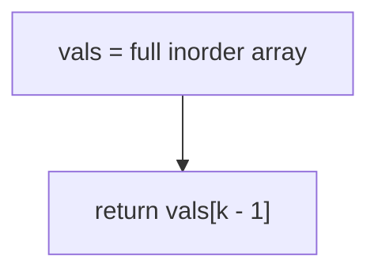
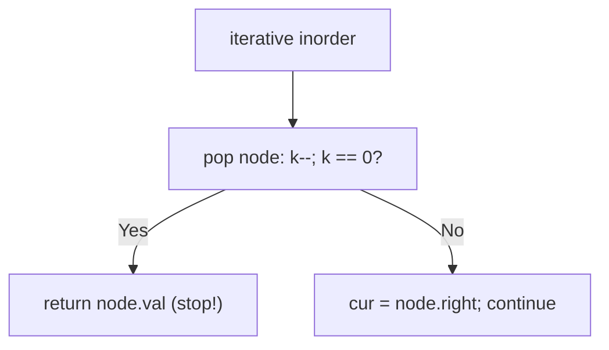
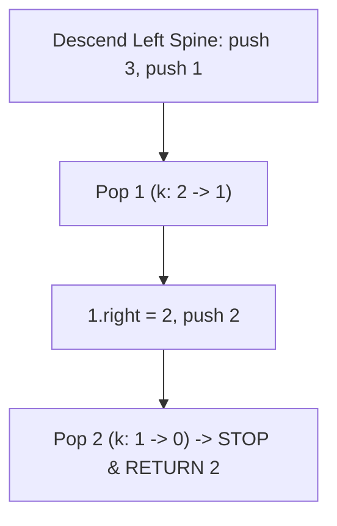

# 230. Kth Smallest Element in a BST

- **LeetCode Link**: `https://leetcode.com/problems/kth-smallest-element-in-a-bst/`
- **Difficulty**: Medium
- **Pattern Category**: BST / Order-Statistic Inorder
- **Prerequisite Primer**: `00-foundations/03-core-algorithmic-patterns.md`

---

## 1. Problem Overview & Edge Case Matrix

### Problem Statement
Given the `root` of a binary search tree, and an integer `k`, return the `k`-th smallest value (1-indexed) of all the values of the nodes in the tree.

```
Example 1:
Input: root = [3,1,4,null,2], k = 1
Output: 1

Example 2:
Input: root = [5,3,6,2,4,null,null,1], k = 3
Output: 3
Explanation: inorder is [1,2,3,4,5,6]; the 3rd smallest is 3.
```

### Visual Problem Representation
```
        5
       / \
      3   6           inorder: 1, 2, 3, 4, 5, 6
     / \                   k=3 -> 3 (stop here; 4,5,6 never visited)
    2   4
   /
  1
```

### Upfront Edge Case Matrix
| Edge Case Category | Specific Input Scenario | Expected Behavior | Pitfall / Risk |
| :--- | :--- | :--- | :--- |
| Smallest | `k = 1` | Leftmost value | Full traversal anyway (no early stop) |
| Largest | `k = n` | Rightmost value | Counter running past leaves |
| Single Element | `[1]`, `k = 1` | Return `1` | Stack/loop setup for trivial input |
| Skewed BST | Chain of $10^4$ | Correct k-th | Recursion depth on degenerate input |
| Invalid `k` | `k > n` (out of spec) | Undefined | Return `null` vs throw — decide at boundary |

---

## 2. Level 1: Brute Force Approach

### Intuition & Visual Idea
Full inorder dump into an array, index `k - 1`. Inorder of a BST is sorted, so the answer is positional — but the whole tree is walked and stored even for `k = 1`.



### Pseudocode
```text
FUNCTION kthSmallestBruteForce(root, k):
    vals = []
    INORDER-COLLECT(root, vals)
    RETURN vals[k - 1]
```

### Step-by-Step Dry Run (Visual Trace)
| Step | Iteration / Pointer ($i, j$) | Current Value | State / Sub-array | Action Taken |
| :--- | :--- | :--- | :--- | :--- |
| 0 | full inorder | `[1,2,3,4,5,6]` | 6 nodes walked + stored | Collect all |
| 1 | index `k-1 = 2` | `vals[2] = 3` | — | Return `3` (visited 4,5,6 needlessly) |

### Modern JavaScript Implementation
```javascript
/**
 * Shared backbone: LeetCode provides TreeNode; defined once here so every
 * level below is locally runnable when concatenated (Level 1 + 2 + 3).
 * Time Complexity:  n/a (scaffolding)
 * Space Complexity: n/a (scaffolding)
 */
class TreeNode {
  constructor(val, left = null, right = null) {
    this.val = val;
    this.left = left;
    this.right = right;
  }
}

function arrayToTree(arr) {
  if (arr.length === 0 || arr[0] === null || arr[0] === undefined) return null;
  const root = new TreeNode(arr[0]);
  const queue = [root];
  let i = 1;
  while (i < arr.length) {
    const node = queue.shift();
    if (i < arr.length && arr[i] !== null && arr[i] !== undefined) {
      node.left = new TreeNode(arr[i]);
      queue.push(node.left);
    }
    i++;
    if (i < arr.length && arr[i] !== null && arr[i] !== undefined) {
      node.right = new TreeNode(arr[i]);
      queue.push(node.right);
    }
    i++;
  }
  return root;
}

/**
 * Level 1: Brute Force (full inorder dump + index)
 * Time Complexity:  O(N) — always walks everything
 * Space Complexity: O(N) — value array
 */
function kthSmallestBruteForce(root, k) {
  const vals = [];
  const stack = [];
  let cur = root;
  // Standard iterative inorder; every value stored regardless of k.
  while (cur !== null || stack.length > 0) {
    while (cur !== null) {
      stack.push(cur);
      cur = cur.left;
    }
    cur = stack.pop();
    vals.push(cur.val);
    cur = cur.right;
  }
  return vals[k - 1]; // 1-indexed k
}
```

### Complexity Breakdown
- **Time Complexity**: $O(N)$ — no early stop; `k = 1` still walks the world.
- **Space Complexity**: $O(N)$ — the array; counting needs a counter, not storage.

---

## 3. Level 2: Optimized Approach

### Intuition & Visual Bottleneck Elimination
Same iterative inorder, but decrement `k` per visit and return the moment it hits zero — the walk stops at the answer. $O(H + k)$ time, $O(H)$ space, zero storage.



### Pseudocode
```text
FUNCTION kthSmallestIterative(root, k):
    stack = []; cur = root
    WHILE cur NOT NULL OR stack NOT EMPTY:
        WHILE cur NOT NULL: stack.PUSH(cur); cur = cur.left
        cur = stack.POP()
        k--
        IF k == 0: RETURN cur.val
        cur = cur.right
```

### Step-by-Step Dry Run (Visual Trace)
| Step | Pointers / Window | Hash Map / Auxiliary State | Decision Logic | Output Accumulator |
| :--- | :--- | :--- | :--- | :--- |
| 0 | descend to `1` | `k = 3` | Pop `1`, `k = 2` | Continue |
| 1 | visit `2` | `k = 2 → 1` | Not zero | Continue |
| 2 | visit `3` | `k = 1 → 0` | Hit! | Return `3` (4,5,6 never touched) |

### Modern JavaScript Implementation
```javascript
/**
 * Level 2: Optimized (countdown inorder with early stop)
 * Time Complexity:  O(H + k) — stops at the answer
 * Space Complexity: O(H) — explicit stack only
 */
// TreeNode shared from Level 1.
function kthSmallestIterative(root, k) {
  const stack = [];
  let cur = root;
  while (cur !== null || stack.length > 0) {
    while (cur !== null) {
      stack.push(cur);
      cur = cur.left;
    }
    cur = stack.pop();
    // Decrement-then-test: k = 1 answers at the very first visit.
    if (--k === 0) return cur.val;
    cur = cur.right;
  }
  return null; // k out of range (outside spec guarantees)
}
```

### Complexity Breakdown
- **Time Complexity**: $O(H + k)$ — visits only the path plus $k$ inorder nodes.
- **Space Complexity**: $O(H)$ — explicit stack; no storage, early exit.

---

## 4. Level 3: Most Optimal / Canonical Approach

### Intuition & Mathematical / Invariant Proof
Recursive countdown with answer capture and subtree pruning: an `answer !== null` guard at each frame stops ALL further recursion the moment the k-th node is found — the call stack unwinds without visiting siblings. Invariant: `count` equals visited-nodes-so-far on entry to each frame; the first frame to observe `count === k` owns the answer. Same $O(H + k)$ as Level 2, recursive form interviewers quote.

```
k=3: visit 1 (count 1), visit 2 (count 2), visit 3 (count 3 -> answer!)
     guard kills the pending right-subtree calls on unwind
```

### Pseudocode
```text
FUNCTION kthSmallest(root, k):
    count = 0; answer = NULL
    DEFINE inorder(node):
        IF node NULL OR answer NOT NULL: RETURN
        inorder(node.left)
        IF answer NOT NULL: RETURN
        count++
        IF count == k: answer = node.val; RETURN
        inorder(node.right)
    inorder(root)
    RETURN answer
```

### Step-by-Step Dry Run (Visual Trace)
| Step | Pointer $L$ | Pointer $R$ | Invariant Checked | In-Place State |
| :--- | :--- | :--- | :--- | :--- |
| 1 | visit `1` | `count = 1 ≠ 3` | Continue | Recurse up/right |
| 2 | visit `2` | `count = 2 ≠ 3` | Continue | Recurse up/right |
| 3 | visit `3` | `count = 3 = k` | Capture, unwind | `answer = 3` |
| 4 | unwind frames | `answer !== null` guard | All pending calls return | Return `3` |

### Modern JavaScript Implementation
```javascript
/**
 * Level 3: Most Optimal / Canonical (recursive countdown with pruning)
 * Time Complexity:  O(H + k) — visits only up to the answer
 * Space Complexity: O(H) — call stack depth equals height
 */
// TreeNode shared from Level 1.
function kthSmallest(root, k) {
  let count = 0; // visited-nodes-so-far (closure state)
  let answer = null; // captured once; the prune guard reads it
  function inorder(node) {
    // Prune: nothing left to find, or nothing here.
    if (node === null || answer !== null) return;
    inorder(node.left);
    if (answer !== null) return; // left subtree already answered
    count++;
    if (count === k) {
      answer = node.val;
      return;
    }
    inorder(node.right);
  }
  inorder(root);
  return answer;
}
```

### Complexity Breakdown
- **Time Complexity**: $O(H + k)$ — optimal for an unaugmented BST (must walk to the k-th node).
- **Space Complexity**: $O(H)$ — implicit stack; the prune guard is what makes recursion competitive with iteration.

---

## 5. JavaScript-Specific Gotchas & V8 Optimizations
- **GC Pressure**: Avoid allocating objects inside tight loops ($O(N)$ closures). Level 1's $N$-value array is the pressure removed — Levels 2–3 carry a counter and (at most) one answer.
- **Type Coercion / Sorting**: `--k === 0` with strict equality — `k` arriving as a string (`"3"`) would decrement-coerce but never `=== 0`-match cleanly across refetches; coerce/validate `k` to a number at the boundary.
- **Index Bounds**: `k` is 1-indexed (`vals[k-1]`, countdown to zero) — `k = 0` or `k > n` is out of spec; return `null` deliberately rather than `undefined` so callers can distinguish "not found" from falsy values.

---

## 6. Real-World MAANG Interview Follow-Ups & Extensions

### Follow-Up 1: Kth largest and order-statistic tree
- **Scenario**: Kth largest queries, or $10^5$ queries on a static BST.
- **Solution Strategy**: Kth largest = mirrored countdown (right-first); repeated queries → augment each node with subtree size for $O(H)$ rank navigation without any traversal.
- **JS Code / Implementation Pattern**:
```javascript
function kthLargest(root, k) {
  return kthSmallestMirrored(root, k); // right-first countdown
}
```

### Follow-Up 2: Median maintenance over inserts
- **Scenario**: Track the median as values insert (two-heap classic) — or k-th queries under inserts.
- **Solution Strategy**: Size-augmented BST: insert updates sizes up the path ($O(H)$); k-th lookup descends by left-size comparison ($O(H)$ per query, no traversal).
- **JS Code / Implementation Pattern**:
```javascript
function kthBySize(node, k) {
  const leftSize = node.left?.size ?? 0;
  if (k === leftSize + 1) return node.val;
  return k <= leftSize ? kthBySize(node.left, k) : kthBySize(node.right, k - leftSize - 1);
}
```

### Follow-Up 3: $10^9$-node BST with paged subtrees
- **Scenario & In-Depth Solution**: Subtrees page from disk; only the current path fits in RAM. Level 2's explicit stack becomes a page-ID stack — fault pages on descend, evict on ascend past them. $O(H)$ page pins, sequential-ish I/O along the search path.
```javascript
async function kthPaged(rootId, k, loadPage) {
  const stack = [];
  let curId = rootId;
  while (curId || stack.length > 0) {
    while (curId) {
      stack.push(curId);
      curId = (await loadPage(curId)).left;
    }
    curId = stack.pop();
    const node = await loadPage(curId);
    if (--k === 0) return node.val;
    curId = node.right;
  }
  return null;
}
```

---

## 7. What LeetCode Discuss Says (Language-Independent)

Source: top-voted post by Nine —
`https://leetcode.com/problems/kth-smallest-element-in-a-bst/solutions/63660/3-ways-implemented-in-java-python-binary-mzbo/`
— 241.1K views.
Language-independent summary. No new JS here.

### A. Optimal way from Discuss (Lazy Iterative Inorder with Early Cutoff)

Because an in-order traversal of a BST yields nodes in sorted ascending order, the $k$-th visited node is the target. Using an explicit stack permits lazy evaluation with instantaneous early termination:

1. **Left Spine Push:** Starting at `root`, push every left child onto the stack until reaching `null`.
2. **Pop & Decrement:** Pop the top node `curr`. This is the next smallest element in the entire BST. Decrement $k = k - 1$.
3. **Immediate Cutoff:** If $k == 0$, return `curr.val` immediately — no subsequent nodes are visited.
4. **Shift to Right Subtree:** If $k > 0$, set `curr = curr.right` and repeat.

```text
FUNCTION kthSmallest(root, k):
    stack = []
    curr = root

    WHILE curr != null OR length(stack) > 0:
        WHILE curr != null:
            stack.push(curr)
            curr = curr.left

        curr = stack.pop()
        k = k - 1

        IF k == 0:
            RETURN curr.val

        curr = curr.right

    RETURN -1
```

- Time: O(H + k) where H is tree height ($O(\log N + k)$ balanced, $O(N)$ skewed), stopping immediately after visiting the $k$-th node.
- Space: O(H) auxiliary space on the stack ($O(\log N)$ balanced, $O(N)$ skewed).



### B. Dry run on LeetCode Example 1 (`root = [3,1,4,null,2], k = 1`)

- `curr = 3`: push 3.
  - `curr = 1`: push 1.
  - `curr = 1.left = null`.
- Pop 1 from stack:
  - Decrement: $k = 1 - 1 = 0$.
  - $k == 0$ condition met!
  - Return `1` immediately.
- Nodes 2, 3, and 4 are never touched.

Final result: `1`.

### C. Why Lazy Stack Traversal Outperforms Full Inorder Dumps

- Dumping the entire BST into an array (`inorder(root)`) and indexing `arr[k - 1]` incurs an unnecessary $O(N)$ time and $O(N)$ space cost.
- Lazy traversal stops after visiting only $k$ nodes, reducing average runtime to $O(H + k)$ and memory to $O(H)$.

### D. Pitfalls from comments

- **Pass-by-value bugs in recursive implementations:** In languages where primitives are passed by value, decrementing `k` inside a recursive frame fails to update parent caller frames unless tracked via a reference/wrapper or instance variable.
- **Follow-up for frequent mutations:** If the BST is modified frequently with recurring $k$-th rank queries, augment each tree node with a `size` field (Order Statistic Tree), enabling $O(H)$ rank queries without traversing the stack.

### E. Companies

- Discuss post itself names none.
  Companies tab on LeetCode is premium-locked.
- External source:
  `https://github.com/liquidslr/leetcode-company-wise-problems`
  (LeetCode company tags, updated June 2025).
- All-time (12): Amazon, Bloomberg, Cisco, Expedia, Google, LinkedIn, Meta, Microsoft, Oracle, tcs, TikTok, Uber.
- Recent: 30 days — tcs.
- Recent: 3 months — Amazon, Google, Microsoft, tcs.
