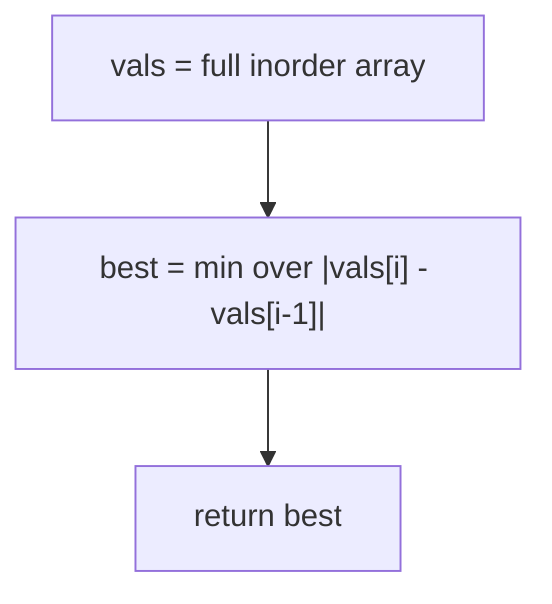
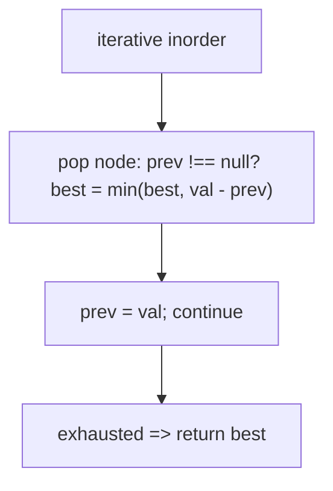
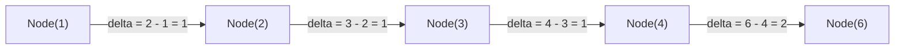

# 530. Minimum Absolute Difference in BST

- **LeetCode Link**: `https://leetcode.com/problems/minimum-absolute-difference-in-bst/`
- **Difficulty**: Easy
- **Pattern Category**: BST / Inorder Adjacency
- **Prerequisite Primer**: `00-foundations/03-core-algorithmic-patterns.md`

---

## 1. Problem Overview & Edge Case Matrix

### Problem Statement
Given the `root` of a Binary Search Tree (BST), return the minimum absolute difference between the values of any two different nodes in the tree.

```
Example 1:
Input: root = [4,2,6,1,3]
Output: 1
Explanation: inorder is [1,2,3,4,6]; adjacent gaps are 1,1,1,2; min is 1.

Example 2:
Input: root = [1,0,48,null,null,12,49]
Output: 1
Explanation: inorder is [0,1,12,48,49]; min adjacent gap is 1.
```

### Visual Problem Representation
```
        4
       / \
      2   6           inorder: 1, 2, 3, 4, 6
     / \              gaps:    1, 1, 1, 2  => min 1
    1   3
```

### Upfront Edge Case Matrix
| Edge Case Category | Specific Input Scenario | Expected Behavior | Pitfall / Risk |
| :--- | :--- | :--- | :--- |
| Two nodes | `[1,2]` / `[2,1]` | Direct gap | Traversal that needs ≥3 nodes |
| Skewed BST | Chain of $10^4$ | Correct min gap | Recursion depth |
| Large gaps, one tiny | Values spread, one adjacent pair | Finds the pair | Sampling instead of full adjacency |
| Negative values | `[-5,-3,0]` | Gaps `2, 3` → `2` | Absolute value omitted |
| Duplicates | Out of spec (BST, distinct) | Would be `0` | `prev` init masking a zero gap |

---

## 2. Level 1: Brute Force Approach

### Intuition & Visual Idea
Inorder dump to a sorted array (BST property), then scan adjacent gaps for the minimum. The key insight — minimum difference in a sorted sequence is always adjacent — does the work; storing the whole array is the waste.



### Pseudocode
```text
FUNCTION getMinimumDifferenceBruteForce(root):
    vals = INORDER(root)
    best = Infinity
    FOR i = 1 .. vals.LENGTH - 1:
        best = MIN(best, ABS(vals[i] - vals[i-1]))
    RETURN best
```

### Step-by-Step Dry Run (Visual Trace)
| Step | Iteration / Pointer ($i, j$) | Current Value | State / Sub-array | Action Taken |
| :--- | :--- | :--- | :--- | :--- |
| 0 | inorder dump | `[1,2,3,4,6]` | Full walk | Collect |
| 1 | gaps | `1,1,1,2` | Adjacent diffs | Fold min |
| 2 | return | `1` | — | Minimum gap |

### Modern JavaScript Implementation
```javascript
/**
 * Shared backbone: LeetCode provides TreeNode; defined once here so every
 * level below is locally runnable when concatenated (Level 1 + 2 + 3).
 * Time Complexity:  n/a (scaffolding)
 * Space Complexity: n/a (scaffolding)
 */
class TreeNode {
  constructor(val, left = null, right = null) {
    this.val = val;
    this.left = left;
    this.right = right;
  }
}

function arrayToTree(arr) {
  if (arr.length === 0 || arr[0] === null || arr[0] === undefined) return null;
  const root = new TreeNode(arr[0]);
  const queue = [root];
  let i = 1;
  while (i < arr.length) {
    const node = queue.shift();
    if (i < arr.length && arr[i] !== null && arr[i] !== undefined) {
      node.left = new TreeNode(arr[i]);
      queue.push(node.left);
    }
    i++;
    if (i < arr.length && arr[i] !== null && arr[i] !== undefined) {
      node.right = new TreeNode(arr[i]);
      queue.push(node.right);
    }
    i++;
  }
  return root;
}

/**
 * Level 1: Brute Force (sorted array + adjacent scan)
 * Time Complexity:  O(N) — walk plus linear scan
 * Space Complexity: O(N) — value array
 */
function getMinimumDifferenceBruteForce(root) {
  const vals = [];
  const stack = [];
  let cur = root;
  while (cur !== null || stack.length > 0) {
    while (cur !== null) {
      stack.push(cur);
      cur = cur.left;
    }
    cur = stack.pop();
    vals.push(cur.val);
    cur = cur.right;
  }
  // Adjacent-only: in a SORTED array the minimum gap is always adjacent.
  let best = Infinity;
  for (let i = 1; i < vals.length; i++) {
    const gap = Math.abs(vals[i] - vals[i - 1]);
    if (gap < best) best = gap;
  }
  return best;
}
```

### Complexity Breakdown
- **Time Complexity**: $O(N)$ — linear, but two phases over stored data.
- **Space Complexity**: $O(N)$ — the array; one previous value suffices.

---

## 3. Level 2: Optimized Approach

### Intuition & Visual Bottleneck Elimination
Fold gaps during iterative inorder: keep `prev`, update `best = min(best, val - prev)` per visit (no `abs` needed — inorder ascends). No array — $O(H)$ stack, one pass.



### Pseudocode
```text
FUNCTION getMinimumDifferenceIterative(root):
    stack = []; cur = root; prev = NULL; best = Infinity
    WHILE cur NOT NULL OR stack NOT EMPTY:
        WHILE cur NOT NULL: stack.PUSH(cur); cur = cur.left
        cur = stack.POP()
        IF prev NOT NULL: best = MIN(best, cur.val - prev)
        prev = cur.val; cur = cur.right
    RETURN best
```

### Step-by-Step Dry Run (Visual Trace)
| Step | Pointers / Window | Hash Map / Auxiliary State | Decision Logic | Output Accumulator |
| :--- | :--- | :--- | :--- | :--- |
| 0 | visit `1` | `prev = null` | First value, seed | `prev = 1`, `best = ∞` |
| 1 | visit `2` | gap `2 - 1 = 1` | Fold | `best = 1` |
| 2 | visit `3` | gap `1` | Fold, no change | `best = 1` |
| 3 | visits `4, 6` | gaps `1, 2` | Fold | Return `1` |

### Modern JavaScript Implementation
```javascript
/**
 * Level 2: Optimized (streaming inorder gap fold)
 * Time Complexity:  O(N) — one visit per node
 * Space Complexity: O(H) — explicit stack plus two numbers
 */
// TreeNode shared from Level 1.
function getMinimumDifferenceIterative(root) {
  const stack = [];
  let cur = root;
  let prev = null; // null = "no previous": first value seeds without a gap
  let best = Infinity;
  while (cur !== null || stack.length > 0) {
    while (cur !== null) {
      stack.push(cur);
      cur = cur.left;
    }
    cur = stack.pop();
    // Inorder ascends, so val - prev >= 0: no Math.abs needed.
    if (prev !== null && cur.val - prev < best) best = cur.val - prev;
    prev = cur.val;
    cur = cur.right;
  }
  return best;
}
```

### Complexity Breakdown
- **Time Complexity**: $O(N)$ — single walk with $O(1)$ fold per node.
- **Space Complexity**: $O(H)$ — explicit stack; no storage.

---

## 4. Level 3: Most Optimal / Canonical Approach

### Intuition & Mathematical / Invariant Proof
Recursive inorder with `prev`/`best` closures: the same adjacency fold as Level 2 in the form interviewers expect — three lines of logic inside the standard inorder skeleton. Invariant: `prev` always holds the previously-visited inorder value (the immediate predecessor), so each gap computed is exactly one adjacent pair; every adjacent pair is computed exactly once. Early termination bonus: `best === 1` (or `0` defensively) is unimprovable for distinct integers — return immediately.

```
visit order 1,2,3,4,6: gaps 1,1,1,2 -> best hits 1 at the FIRST gap
```

### Pseudocode
```text
FUNCTION getMinimumDifference(root):
    prev = NULL; best = Infinity
    DEFINE inorder(node):
        IF node NULL OR best == 1: RETURN   // 1 is optimal for distinct ints
        inorder(node.left)
        IF best == 1: RETURN
        IF prev NOT NULL: best = MIN(best, node.val - prev)
        prev = node.val
        inorder(node.right)
    inorder(root)
    RETURN best
```

### Step-by-Step Dry Run (Visual Trace)
| Step | Pointer $L$ | Pointer $R$ | Invariant Checked | In-Place State |
| :--- | :--- | :--- | :--- | :--- |
| 1 | visit `1` | `prev = null` | Seed, no gap | `prev = 1` |
| 2 | visit `2` | gap `1` | `best = 1` = optimal floor | Early-exit armed |
| 3 | unwind frames | `best === 1` guard | All pending calls return | Return `1` (rest unvisited) |

### Modern JavaScript Implementation
```javascript
/**
 * Level 3: Most Optimal / Canonical (recursive gap fold + optimal early exit)
 * Time Complexity:  O(N) worst case — typically far less via early exit
 * Space Complexity: O(H) — call stack depth equals height
 */
// TreeNode shared from Level 1.
function getMinimumDifference(root) {
  let prev = null; // inorder predecessor value (closure state)
  let best = Infinity;
  function inorder(node) {
    // Prune: null, or the floor is already reached (distinct ints => min 1).
    if (node === null || best === 1) return;
    inorder(node.left);
    if (best === 1) return; // left subtree already proved optimal
    if (prev !== null && node.val - prev < best) best = node.val - prev;
    prev = node.val;
    inorder(node.right);
  }
  inorder(root);
  return best;
}
```

### Complexity Breakdown
- **Time Complexity**: $O(N)$ worst case — optimal with early exit; the floor hit usually ends the walk after a few nodes.
- **Space Complexity**: $O(H)$ — implicit stack; two closure numbers.

---

## 5. JavaScript-Specific Gotchas & V8 Optimizations
- **GC Pressure**: Avoid allocating objects inside tight loops ($O(N)$ closures). Level 1's $N$-value array is the pressure removed — Levels 2–3 carry two numbers.
- **Type Coercion / Sorting**: `prev !== null` (not falsy check) — value `0` is a legitimate BST key and `!prev` would re-seed on it, dropping the `0`-adjacent gap. `Infinity` seed with `<` strictly improves.
- **Index Bounds**: The `best === 1` early exit assumes DISTINCT integer keys (spec-guaranteed BST) — with duplicates the floor is `0`, and with floats there is no floor at all; gate the optimization on the constraint, and say so aloud.

---

## 6. Real-World MAANG Interview Follow-Ups & Extensions

### Follow-Up 1: Kth smallest gap (not just minimum)
- **Scenario**: Return the k-th smallest absolute difference over all pairs.
- **Solution Strategy**: Binary-search the answer with an $O(N)$ two-pointer counter on the inorder array (same shape as "k-th smallest pair distance", LeetCode 719). Minimum-gap is the $k=1$ case.
- **JS Code / Implementation Pattern**:
```javascript
function kthSmallestGap(sortedVals, k) {
  let lo = 0, hi = sortedVals[sortedVals.length - 1] - sortedVals[0];
  while (lo < hi) {
    const mid = (lo + hi) >> 1;
    if (countPairsWithin(sortedVals, mid) >= k) hi = mid;
    else lo = mid + 1;
  }
  return lo;
}
```

### Follow-Up 2: Min gap under inserts (dynamic BST)
- **Scenario**: Values insert over time; report the min gap after each insert.
- **Solution Strategy**: Sorted neighbor structure (balanced BST / sorted array): each insert checks only predecessor/successor gaps — $O(\log N)$ per insert, global min maintained incrementally.
- **JS Code / Implementation Pattern**:
```javascript
function insertAndTrack(sorted, gaps, val) {
  const i = lowerBound(sorted, val);
  const [pred, succ] = [sorted[i - 1], sorted[i]];
  if (pred !== undefined) gaps.add(val - pred);
  if (succ !== undefined) gaps.add(succ - val);
  sorted.splice(i, 0, val);
  return gaps.min();
}
```

### Follow-Up 3: $10^9$-node BST with paged inorder
- **Scenario & In-Depth Solution**: Subtrees page from disk; only the current path fits in RAM. Level 2's explicit stack becomes a page-ID stack with `prev` pinned — fault pages on descend, evict on ascend. One page per level, sequential access along the inorder path.
```javascript
async function minGapPaged(rootId, loadPage) {
  let prev = null, best = Infinity;
  const stack = [];
  let curId = rootId;
  while (curId || stack.length > 0) {
    while (curId) {
      stack.push(curId);
      curId = (await loadPage(curId)).left;
    }
    curId = stack.pop();
    const node = await loadPage(curId);
    if (prev !== null && node.val - prev < best) best = node.val - prev;
    prev = node.val;
    curId = node.right;
  }
  return best;
}
```

---

## 7. What LeetCode Discuss Says (Language-Independent)

Source: top-voted post by Shan Gao —
`https://leetcode.com/problems/minimum-absolute-difference-in-bst/solutions/99905/two-solutions-in-order-traversal-and-a-m-elmf/`
— 74K views.
Language-independent summary. No new JS here.

### A. Optimal way from Discuss (Inorder Predecessor Delta Invariant)

Because an in-order traversal of a Binary Search Tree produces a strictly ascending sequence, the minimum difference between any two nodes must occur between two immediately adjacent elements in that sequence:

1. **State Tracking:** Maintain `minDiff = INFINITY` and `prev = null` (pointer to the previously visited node's value).
2. **In-Order Traversal:**
   - Recursively visit `node.left`.
   - Process `node`:
     - If `prev != null`, compute delta: `minDiff = min(minDiff, node.val - prev)`.
     - Update predecessor: `prev = node.val`.
   - Recursively visit `node.right`.
3. Return `minDiff`.

```text
CLASS Solution:
    minDiff = INFINITY
    prev = null

    FUNCTION getMinimumDifference(root):
        minDiff = INFINITY
        prev = null
        inorder(root)
        RETURN minDiff

    FUNCTION inorder(node):
        IF node == null:
            RETURN

        inorder(node.left)

        IF prev != null:
            minDiff = min(minDiff, node.val - prev)
            // Optional early termination: min integer difference cannot be < 1
            IF minDiff == 1:
                RETURN

        prev = node.val

        inorder(node.right)
```

- Time: O(N) where N is the number of nodes, visiting each node once.
- Space: O(H) auxiliary space on the call stack ($O(\log N)$ balanced, $O(N)$ skewed).



### B. Dry run on LeetCode Example 1 (`root = [4,2,6,1,3]`)

- Inorder sequence: `[1, 2, 3, 4, 6]`.
- Visit 1: `prev = null` -> `prev = 1`.
- Visit 2: `minDiff = min(∞, 2 - 1) = 1`. `prev = 2`.
  - (Early exit triggers since `minDiff == 1` is optimal for integer values).
- If continued:
  - Visit 3: `minDiff = min(1, 3 - 2) = 1`. `prev = 3`.
  - Visit 4: `minDiff = min(1, 4 - 3) = 1`. `prev = 4`.
  - Visit 6: `minDiff = min(1, 6 - 4) = 1`. `prev = 6`.

Final result: `1`.

### C. Why In-Place Inorder Beats Full Sequence Buffering

- Storing all node values in an array and sorting takes $O(N)$ auxiliary heap memory.
- Tracking only the single previous visited value `prev` during the inorder recursion reduces memory consumption to $O(H)$ stack frames with zero dynamic heap allocations.

### D. Pitfalls from comments

- **Initializing `prev = 0`:** Node values can be 0 or negative. Initializing `prev = 0` erroneously calculates $node.val - 0$ as a delta against a non-existent node. Always initialize `prev = null`.
- **General Binary Tree follow-up:** If the tree is an arbitrary binary tree rather than a BST, in-order values are unsorted. In that scenario, maintain a balanced BST / `TreeSet` of already visited values and query `floor` and `ceiling` for each node in $O(\log N)$, achieving $O(N \log N)$ total time.

### E. Companies

- Discuss post itself names none.
  Companies tab on LeetCode is premium-locked.
- External source:
  `https://github.com/liquidslr/leetcode-company-wise-problems`
  (LeetCode company tags, updated June 2025).
- All-time (3): Amazon, Google, Meta.
- Recent: 30 days — None.
- Recent: 3 months — Google.
