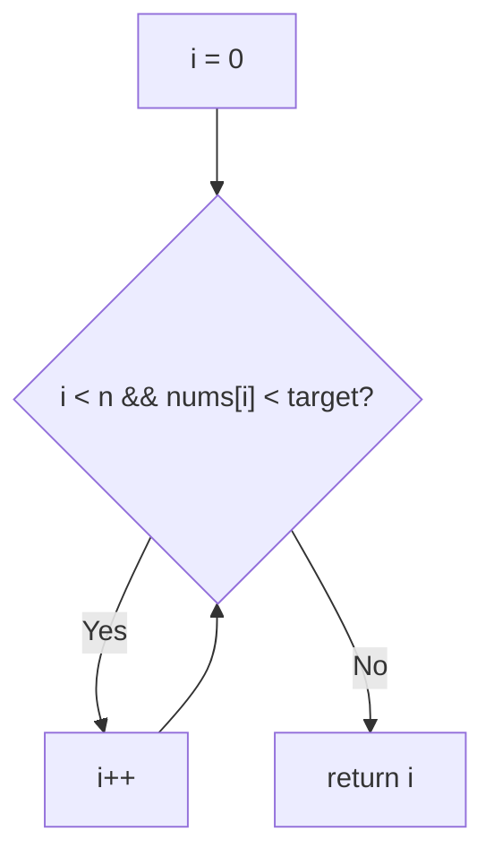
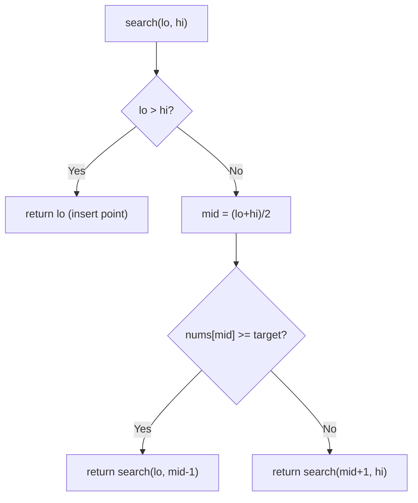

# 35. Search Insert Position

- **LeetCode Link**: `https://leetcode.com/problems/search-insert-position/`
- **Difficulty**: Easy
- **Pattern Category**: Binary Search / Lower Bound
- **Prerequisite Primer**: `00-foundations/03-core-algorithmic-patterns.md`

---

## 1. Problem Overview & Edge Case Matrix

### Problem Statement
Given a sorted array of distinct integers and a target value, return the index if the target is found. If not, return the index where it would be inserted in order. The algorithm must run in $O(\log N)$ time.

```
Example 1:
Input: nums = [1,3,5,6], target = 5
Output: 2

Example 2:
Input: nums = [1,3,5,6], target = 2
Output: 1

Example 3:
Input: nums = [1,3,5,6], target = 7
Output: 4
```

### Visual Problem Representation
```
nums = [1, 3, 5, 6], target = 2

  index:  0  1  2  3
  value:  1  3  5  6
                 ^insert at 1 (first element >= target)
```

### Upfront Edge Case Matrix
| Edge Case Category | Specific Input Scenario | Expected Behavior | Pitfall / Risk |
| :--- | :--- | :--- | :--- |
| Empty / Nil | `nums = []` (defensive) | Return `0` | Loop over empty range |
| Single Element | `[1]`, target `0` / `1` / `2` | Return `0` / `0` / `1` | Bound update direction |
| Target below all | Target `< nums[0]` | Return `0` | `left` never advancing |
| Target above all | Target `> nums[n-1]` | Return `n` | `right` never retreating |
| Exact endpoints | Target `== nums[0]` or `nums[n-1]` | Exact index | `<=` vs `<` loop condition |

---

## 2. Level 1: Brute Force Approach

### Intuition & Visual Idea
Linear scan for the first element `>= target`; its index is the answer (found or insert). If none qualifies, append at the end. $O(N)$ — the baseline the $O(\log N)$ requirement rejects.



### Pseudocode
```text
FUNCTION searchInsertBruteForce(nums, target):
    i = 0
    WHILE i < nums.LENGTH AND nums[i] < target: i++
    RETURN i
```

### Step-by-Step Dry Run (Visual Trace)
| Step | Iteration / Pointer ($i, j$) | Current Value | State / Sub-array | Action Taken |
| :--- | :--- | :--- | :--- | :--- |
| 0 | `i = 0` | `1 < 2` | advance | `i = 1` |
| 1 | `i = 1` | `3 >= 2` | stop | Return `1` |

### Modern JavaScript Implementation
```javascript
/**
 * Level 1: Brute Force (linear lower-bound scan)
 * Time Complexity:  O(N) — violates the O(log N) requirement
 * Space Complexity: O(1)
 */
function searchInsertBruteForce(nums, target) {
  let i = 0;
  // First index with nums[i] >= target IS the answer in both cases.
  while (i < nums.length && nums[i] < target) i++;
  return i; // i === n when target exceeds everything: append position
}
```

### Complexity Breakdown
- **Time Complexity**: $O(N)$ — linear scan; rejected by the spec's complexity demand.
- **Space Complexity**: $O(1)$ — single index.

---

## 3. Level 2: Optimized Approach

### Intuition & Visual Bottleneck Elimination
Recursive binary search on ranges: compare the midpoint; recurse left on `>=`, right on `<`. Same halving as iterative — expressed as range recursion with $O(\log N)$ stack depth.



### Pseudocode
```text
FUNCTION searchInsertRecursive(nums, target):
    DEFINE search(lo, hi):
        IF lo > hi: RETURN lo
        mid = FLOOR((lo + hi) / 2)
        IF nums[mid] >= target: RETURN search(lo, mid - 1)
        RETURN search(mid + 1, hi)
    RETURN search(0, nums.LENGTH - 1)
```

### Step-by-Step Dry Run (Visual Trace)
| Step | Pointers / Window | Hash Map / Auxiliary State | Decision Logic | Output Accumulator |
| :--- | :--- | :--- | :--- | :--- |
| 0 | `[0, 3]`, mid `1` | `nums[1] = 3 >= 2` | Go left | `search(0, 0)` |
| 1 | `[0, 0]`, mid `0` | `nums[0] = 1 < 2` | Go right | `search(1, 0)` |
| 2 | `[1, 0]` empty | `lo > hi` | Insert point | Return `1` |

### Modern JavaScript Implementation
```javascript
/**
 * Level 2: Optimized (recursive lower-bound search)
 * Time Complexity:  O(log N) — halving per frame
 * Space Complexity: O(log N) — call stack depth
 */
function searchInsertRecursive(nums, target) {
  function search(lo, hi) {
    // Empty range: lo IS the insert position (all left elements < target).
    if (lo > hi) return lo;
    const mid = (lo + hi) >> 1;
    // >= keeps equal values LEFT: first-qualifying-index semantics.
    if (nums[mid] >= target) return search(lo, mid - 1);
    return search(mid + 1, hi);
  }
  return search(0, nums.length - 1);
}
```

### Complexity Breakdown
- **Time Complexity**: $O(\log N)$ — range halves per frame.
- **Space Complexity**: $O(\log N)$ — recursion depth; iteration removes even this.

---

## 4. Level 3: Most Optimal / Canonical Approach

### Intuition & Mathematical / Invariant Proof
Iterative lower bound with the `left <= right` fenced loop: invariant — all indices `< left` hold values `< target`, all `> right` hold values `>= target`. Each step shrinks the fence by half while preserving it; at exit `left === right + 1`, so `left` is the first index with value `>= target` (or `n`). Overflow-safe midpoint `left + ((right - left) >> 1)` (matters in fixed-width languages; habit-stated in JS).

```
[1,3,5,6], t=2: [l=0,r=3] mid=1 (3>=2) -> r=0; [l=0,r=0] mid=0 (1<2) -> l=1;
  [l=1,r=0] exit -> 1
```

### Pseudocode
```text
FUNCTION searchInsert(nums, target):
    left = 0; right = nums.LENGTH - 1
    WHILE left <= right:
        mid = left + FLOOR((right - left) / 2)
        IF nums[mid] >= target: right = mid - 1
        ELSE: left = mid + 1
    RETURN left
```

### Step-by-Step Dry Run (Visual Trace)
| Step | Pointer $L$ | Pointer $R$ | Invariant Checked | In-Place State |
| :--- | :--- | :--- | :--- | :--- |
| 1 | `l=0` | `r=3` | `mid=1`, `3 >= 2` → `r=0` | Fence `[0,0]` |
| 2 | `l=0` | `r=0` | `mid=0`, `1 < 2` → `l=1` | Fence `[1,0]` empty |
| 3 | `l=1` | `r=0` | Exit | Return `1` |

### Modern JavaScript Implementation
```javascript
/**
 * Level 3: Most Optimal / Canonical (iterative lower bound)
 * Time Complexity:  O(log N) — optimal lower bound for ordered search
 * Space Complexity: O(1) auxiliary — two indices
 */
function searchInsert(nums, target) {
  let left = 0;
  let right = nums.length - 1;
  // Fenced loop: [left, right] always brackets the answer.
  while (left <= right) {
    // Overflow-safe midpoint (habit from fixed-width languages).
    const mid = left + ((right - left) >> 1);
    if (nums[mid] >= target) right = mid - 1;
    else left = mid + 1;
  }
  // left === right + 1: first index with value >= target (or n).
  return left;
}
```

### Complexity Breakdown
- **Time Complexity**: $O(\log N)$ — optimal lower bound for comparison search on sorted input.
- **Space Complexity**: $O(1)$ auxiliary — two indices, zero allocation.

---

## 5. JavaScript-Specific Gotchas & V8 Optimizations
- **GC Pressure**: Avoid allocating objects inside tight loops ($O(N)$ closures). All three levels allocate nothing per step — keep it that way; never slice subarrays per iteration (that pattern turns binary search back into $O(N \log N)$ copying).
- **Type Coercion / Sorting**: `(lo + hi) >> 1` is 32-bit: exact for indices $< 2^{31}$ but truncates beyond — `left + ((right - left) >> 1)` (Level 3) is the portable form. `>=` (not `>`) is what yields FIRST-position semantics for the found-or-insert contract.
- **Index Bounds**: `left <= right` with `right = mid - 1` / `left = mid + 1` provably terminates (fence shrinks every step); `left < right` variants need separate post-loop handling and are the top source of infinite loops and off-by-ones.

---

## 6. Real-World MAANG Interview Follow-Ups & Extensions

### Follow-Up 1: First and last position (range search)
- **Scenario**: Return `[first, last]` occurrence of target (LeetCode 34, this module).
- **Solution Strategy**: Two lower bounds — `lowerBound(target)` and `lowerBound(target + 1) - 1` — reusing Level 3 verbatim twice.
- **JS Code / Implementation Pattern**:
```javascript
function searchRange(nums, target) {
  const first = searchInsert(nums, target);
  if (nums[first] !== target) return [-1, -1];
  return [first, searchInsert(nums, target + 1) - 1];
}
```

### Follow-Up 2: Search in a $10^9$-element stream with $O(1)$ RAM
- **Scenario**: Sorted data streams once; only sampling fits in memory.
- **Solution Strategy**: Exponential probing to bracket (`1, 2, 4, 8…` until overshoot), then binary search within the bracket — $O(\log N)$ probes, galloping search, no random access needed beyond seeks.
- **JS Code / Implementation Pattern**:
```javascript
async function gallopingSearch(get, target) {
  let bound = 1;
  while ((await get(bound)) < target) bound *= 2;
  return binarySearchRange(get, bound / 2, bound, target);
}
```

### Follow-Up 3: Concurrent sorted array with lock-free reads
- **Scenario & In-Depth Solution**: Writers append (sorted) while readers binary-search. Since appends only extend the right end, in-flight searches over the old length remain valid — readers snapshot `length` once and search within it; a versioned length with retry covers torn reads.
```javascript
function lockFreeSearch(arr, target, versionOf) {
  const n = arr.length; // snapshot: appends beyond n are invisible, safely
  const stamp = versionOf(arr);
  const idx = searchInsert(arr.slice(0, n), target);
  if (versionOf(arr) !== stamp) return lockFreeSearch(arr, target, versionOf);
  return idx;
}
```
