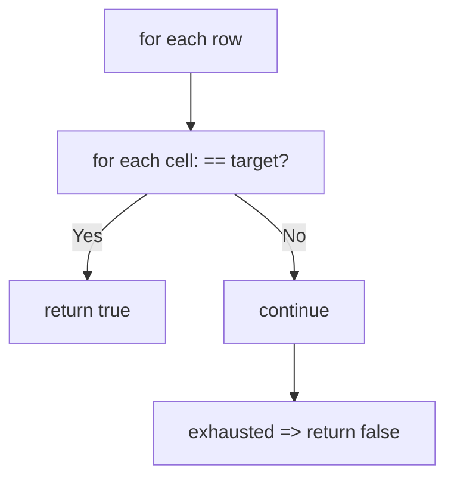
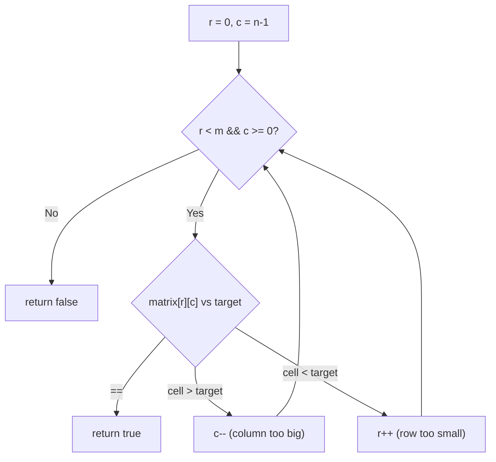

# 74. Search a 2D Matrix

- **LeetCode Link**: `https://leetcode.com/problems/search-a-2d-matrix/`
- **Difficulty**: Medium
- **Pattern Category**: Binary Search / Flattened Index + Staircase
- **Prerequisite Primer**: `00-foundations/03-core-algorithmic-patterns.md`

---

## 1. Problem Overview & Edge Case Matrix

### Problem Statement
You are given an `m x n` integer matrix with: each row sorted in ascending order, and the first integer of each row greater than the last integer of the previous row. Given a `target`, return `true` if it is in the matrix, otherwise `false`. The algorithm must run in $O(\log(m·n))$ time.

```
Example 1:
Input: matrix = [[1,3,5,7],[10,11,16,20],[23,30,34,60]], target = 3
Output: true

Example 2:
Input: matrix = [[1,3,5,7],[10,11,16,20],[23,30,34,60]], target = 13
Output: false
```

### Visual Problem Representation
```
row 0:   1   3   5   7
row 1:  10  11  16  20        flattened view:
row 2:  23  30  34  60        [1,3,5,7,10,11,16,20,23,30,34,60] (sorted!)
```

### Upfront Edge Case Matrix
| Edge Case Category | Specific Input Scenario | Expected Behavior | Pitfall / Risk |
| :--- | :--- | :--- | :--- |
| Empty / Nil | `matrix = []` or `[[]]` | Return `false` | `matrix[0].length` on empty |
| Single Element | `[[1]]`, target `1` / `0` | `true` / `false` | Index mapping with `n = 1` |
| Single row/col | `[[1,3,5]]`, `[[1],[3]]` | Correct boolean | Row/col loop bounds |
| Target outside range | Below `matrix[0][0]`, above last | Return `false` | Unnecessary full search (still correct) |
| Rectangular extremes | $1 × 10^4$ or $10^4 × 1$ | Correct, fast | Row-major mapping with $n = 1$ |

---

## 2. Level 1: Brute Force Approach

### Intuition & Visual Idea
Scan every cell; return true on match. $O(m·n)$ — ignores both sortedness properties entirely, and flunks the complexity requirement.



### Pseudocode
```text
FUNCTION searchMatrixBruteForce(matrix, target):
    FOR EACH row IN matrix:
        FOR EACH val IN row:
            IF val == target: RETURN true
    RETURN false
```

### Step-by-Step Dry Run (Visual Trace)
| Step | Iteration / Pointer ($i, j$) | Current Value | State / Sub-array | Action Taken |
| :--- | :--- | :--- | :--- | :--- |
| 0 | cells `1, 3` | `3 == 3` at `(0,1)` | Match on 2nd cell | Return `true` |
| 1 | target `13` | all 12 cells scanned | No match | Return `false` |

### Modern JavaScript Implementation
```javascript
/**
 * Level 1: Brute Force (cell-by-cell scan)
 * Time Complexity:  O(m·n) — violates the O(log mn) requirement
 * Space Complexity: O(1)
 */
function searchMatrixBruteForce(matrix, target) {
  for (const row of matrix) {
    for (const val of row) {
      if (val === target) return true;
    }
  }
  return false;
}
```

### Complexity Breakdown
- **Time Complexity**: $O(m·n)$ — uses neither the row order nor the cross-row order.
- **Space Complexity**: $O(1)$ — no allocation; time is the failure.

---

## 3. Level 2: Optimized Approach

### Intuition & Visual Bottleneck Elimination
Staircase walk from the top-right corner: if `target < cell`, the whole column is too big (move left); if `target > cell`, the whole row is too small (move down). Each step kills a row or column — $O(m + n)$ with zero index arithmetic.



### Pseudocode
```text
FUNCTION searchMatrixStaircase(matrix, target):
    IF matrix EMPTY OR ROWS EMPTY: RETURN false
    r = 0; c = n - 1
    WHILE r < m AND c >= 0:
        cell = matrix[r][c]
        IF cell == target: RETURN true
        IF cell > target: c--
        ELSE: r++
    RETURN false
```

### Step-by-Step Dry Run (Visual Trace)
| Step | Pointers / Window | Hash Map / Auxiliary State | Decision Logic | Output Accumulator |
| :--- | :--- | :--- | :--- | :--- |
| 0 | `(0, 3) = 7` | `7 > 3` | Column too big | `c = 2` |
| 1 | `(0, 2) = 5` | `5 > 3` | Column too big | `c = 1` |
| 2 | `(0, 1) = 3` | Equal | Match | Return `true` |
| 3 | target `13`: `(0,3)=7<13` → down… | `(1,3)=20>13` → left… | `(1,2)=16>13` → left, `(1,1)=11<13` → down, `(2,1)=30>13` → left, `(2,0)=23>13` → left, `c=-1` | Return `false` |

### Modern JavaScript Implementation
```javascript
/**
 * Level 2: Optimized (top-right staircase walk)
 * Time Complexity:  O(m + n) — each step kills a row or a column
 * Space Complexity: O(1) — two indices
 */
function searchMatrixStaircase(matrix, target) {
  if (matrix.length === 0 || matrix[0].length === 0) return false;
  const m = matrix.length;
  const n = matrix[0].length;
  // Start top-right: the only corner where one move goes smaller, one bigger.
  let r = 0;
  let c = n - 1;
  while (r < m && c >= 0) {
    const cell = matrix[r][c];
    if (cell === target) return true;
    if (cell > target) c--; // whole column below is even bigger: drop it
    else r++; // whole row left is even smaller: drop it
  }
  return false;
}
```

### Complexity Breakdown
- **Time Complexity**: $O(m + n)$ — at most one row-drop plus one column-drop per step.
- **Space Complexity**: $O(1)$ — two indices; the log-factor gap to optimal remains.

---

## 4. Level 3: Most Optimal / Canonical Approach

### Intuition & Mathematical / Invariant Proof
The row-boundary property makes the matrix ONE sorted array in row-major order: virtual index `i` maps to `(i / n, i % n)`. Binary-search the virtual range $[0, mn)$ — $O(\log mn)$ with zero extra memory. Invariant: the standard fenced-loop invariant over virtual indices; the mapping is a bijection, so sortedness transfers exactly.

```
target 3: virtual [0,12): mid 5 -> (1,1) = 11 > 3 -> hi = 4;
  mid 2 -> (0,2) = 5 > 3 -> hi = 1; mid 0 -> 1 < 3 -> lo = 1;
  mid 1 -> (0,1) = 3 == 3 -> true
```

### Pseudocode
```text
FUNCTION searchMatrix(matrix, target):
    IF matrix EMPTY OR ROWS EMPTY: RETURN false
    m = ROWS; n = COLS
    lo = 0; hi = m * n - 1
    WHILE lo <= hi:
        mid = lo + FLOOR((hi - lo) / 2)
        cell = matrix[FLOOR(mid / n)][mid MOD n]
        IF cell == target: RETURN true
        IF cell < target: lo = mid + 1
        ELSE: hi = mid - 1
    RETURN false
```

### Step-by-Step Dry Run (Visual Trace)
| Step | Pointer $L$ | Pointer $R$ | Invariant Checked | In-Place State |
| :--- | :--- | :--- | :--- | :--- |
| 1 | `lo=0` | `hi=11` | `mid=5 → (1,1)=11 > 3` | `hi = 4` |
| 2 | `lo=0` | `hi=4` | `mid=2 → (0,2)=5 > 3` | `hi = 1` |
| 3 | `lo=0` | `hi=1` | `mid=0 → 1 < 3` | `lo = 1` |
| 4 | `lo=1` | `hi=1` | `mid=1 → (0,1)=3` | Return `true` |

### Modern JavaScript Implementation
```javascript
/**
 * Level 3: Most Optimal / Canonical (flattened virtual binary search)
 * Time Complexity:  O(log(m·n)) — meets the required bound
 * Space Complexity: O(1) auxiliary — index arithmetic only
 */
function searchMatrix(matrix, target) {
  if (matrix.length === 0 || matrix[0].length === 0) return false;
  const m = matrix.length;
  const n = matrix[0].length;
  let lo = 0;
  let hi = m * n - 1; // virtual indices over the row-major flattening
  while (lo <= hi) {
    const mid = lo + ((hi - lo) >> 1);
    // Bijection: virtual mid <-> (row, col). Sortedness transfers exactly.
    const cell = matrix[Math.floor(mid / n)][mid % n];
    if (cell === target) return true;
    if (cell < target) lo = mid + 1;
    else hi = mid - 1;
  }
  return false;
}
```

### Complexity Breakdown
- **Time Complexity**: $O(\log(m·n))$ — optimal; exactly the required bound.
- **Space Complexity**: $O(1)$ auxiliary — three numbers; no flattening allocation (the array is VIRTUAL).

---

## 5. JavaScript-Specific Gotchas & V8 Optimizations
- **GC Pressure**: Avoid allocating objects inside tight loops ($O(N)$ closures). Never `matrix.flat()` to binary-search — the $O(mn)$ copy defeats the log bound; the virtual mapping exists precisely to avoid materializing it.
- **Type Coercion / Sorting**: `mid / n` needs `Math.floor` — float indices silently produce `undefined` cells (`matrix[1.5]` is `undefined`, and `undefined === target` is false, corrupting the search into a false negative).
- **Index Bounds**: Empty-matrix guards must check BOTH dimensions (`matrix.length` and `matrix[0].length`) — `[[]]` passes the first check and crashes the second without the compound guard.

---

## 6. Real-World MAANG Interview Follow-Ups & Extensions

### Follow-Up 1: Row-and-column sorted WITHOUT the cross-row property (240)
- **Scenario**: Each row and column sorted, but row starts overlap (LeetCode 240) — flattening is invalid.
- **Solution Strategy**: Level 2's staircase is the answer there ($O(m+n)$ optimal for that weaker ordering); know which property licenses which algorithm.
- **JS Code / Implementation Pattern**:
```javascript
function searchMatrixII(matrix, target) {
  return searchMatrixStaircase(matrix, target); // weaker order => staircase
}
```

### Follow-Up 2: $10^9$-cell matrix with paged rows
- **Scenario**: Rows page from disk; only $O(1)$ rows fit in RAM.
- **Solution Strategy**: Level 3 with page faults: each probe faults exactly one row page ($O(\log mn)$ page reads, sequential-friendly); staircase faults whole rows AND columns ($O(m+n)$ pages — worse). The log bound wins on I/O too.
- **JS Code / Implementation Pattern**:
```javascript
async function searchPaged(rowCount, colCount, loadCell, target) {
  let lo = 0, hi = rowCount * colCount - 1;
  while (lo <= hi) {
    const mid = lo + ((hi - lo) >> 1);
    const cell = await loadCell(Math.floor(mid / colCount), mid % colCount);
    if (cell === target) return true;
    if (cell < target) lo = mid + 1;
    else hi = mid - 1;
  }
  return false;
}
```

### Follow-Up 3: Kth smallest element in the sorted matrix
- **Scenario & In-Depth Solution**: Return the k-th smallest value (LeetCode 378). Value-space binary search: count `≤ mid` per row via row binary searches ($O(m \log n)$ per probe, $O(m \log n \log \text{range})$ total); staircase counting variant runs $O(m + n)$ per probe. Same virtual-order insight, harder query.
```javascript
function kthSmallestSortedMatrix(matrix, k) {
  let lo = matrix[0][0], hi = matrix.at(-1).at(-1);
  while (lo < hi) {
    const mid = lo + ((hi - lo) >> 1);
    if (countLessEqual(matrix, mid) >= k) hi = mid;
    else lo = mid + 1;
  }
  return lo;
}
```
