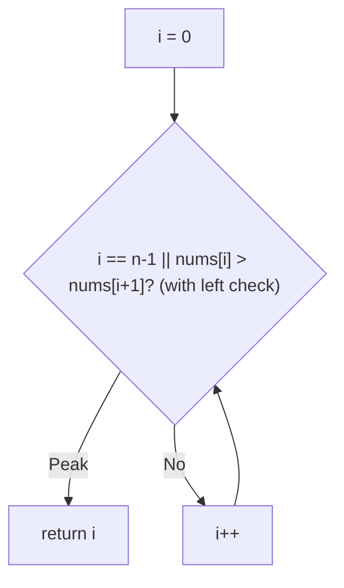
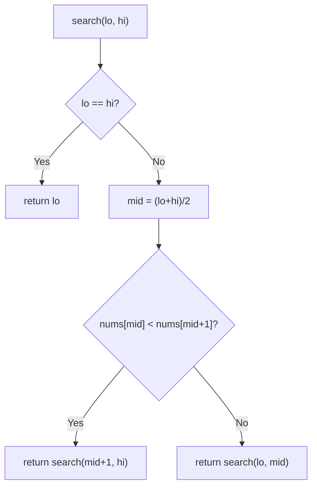
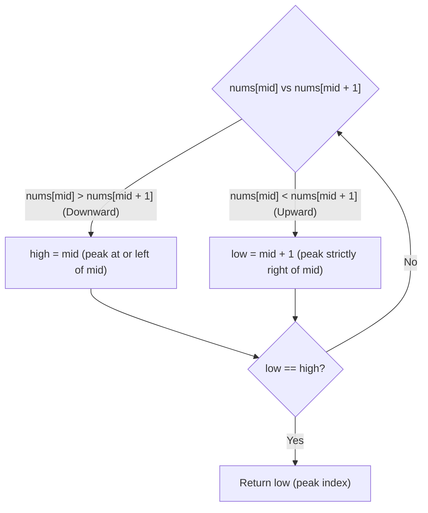

# 162. Find Peak Element

- **LeetCode Link**: `https://leetcode.com/problems/find-peak-element/`
- **Difficulty**: Medium
- **Pattern Category**: Binary Search / Slope Ascent
- **Prerequisite Primer**: `00-foundations/03-core-algorithmic-patterns.md`

---

## 1. Problem Overview & Edge Case Matrix

### Problem Statement
A peak element is an element that is strictly greater than its neighbors. Given a 0-indexed integer array `nums`, find a peak element, and return its index. If the array contains multiple peaks, return the index to any of the peaks. You may imagine that `nums[-1] = nums[n] = -∞`. The algorithm must run in $O(\log N)$ time.

```
Example 1:
Input: nums = [1,2,3,1]
Output: 2
Explanation: 3 is a peak at index 2.

Example 2:
Input: nums = [1,2,1,3,5,6,4]
Output: 5
Explanation: 6 is a peak at index 5 (index 1 is also a peak).
```

### Visual Problem Representation
```
value
  ^           x(6)
  |     x(3)  |  \
  |  x(2)     |   x(4)
  |x(1)  x(1) x(3) x(5)
  +--------------------> index
   0  1  2  3  4  5  6     peaks at 1, 5 (either accepted)
```

### Upfront Edge Case Matrix
| Edge Case Category | Specific Input Scenario | Expected Behavior | Pitfall / Risk |
| :--- | :--- | :--- | :--- |
| Single Element | `[5]` | Return `0` (both neighbors −∞) | Neighbor access out of bounds |
| Two elements | `[1,2]` / `[2,1]` | Return `1` / `0` | Midpoint never covering an endpoint |
| Strictly ascending | `[1,2,3,4]` | Return `3` (right edge) | Right-boundary peak missed |
| Strictly descending | `[4,3,2,1]` | Return `0` (left edge) | Left-boundary peak missed |
| Multiple peaks | Ex.2 (peaks at 1 and 5) | ANY peak index | Test asserting one specific index |

---

## 2. Level 1: Brute Force Approach

### Intuition & Visual Idea
Scan for the first index beating both neighbors (treating edges as −∞). $O(N)$ — finds the leftmost peak, ignoring the log requirement.



### Pseudocode
```text
FUNCTION findPeakElementBruteForce(nums):
    n = nums.LENGTH
    FOR i IN 0 .. n - 1:
        left = (i == 0) ? -Infinity : nums[i-1]
        right = (i == n-1) ? -Infinity : nums[i+1]
        IF nums[i] > left AND nums[i] > right: RETURN i
```

### Step-by-Step Dry Run (Visual Trace)
| Step | Iteration / Pointer ($i, j$) | Current Value | State / Sub-array | Action Taken |
| :--- | :--- | :--- | :--- | :--- |
| 0 | `i = 0` | `1` vs `-∞`, `2` | `1 < 2`, not peak | Advance |
| 1 | `i = 1` | `2` vs `1`, `1` | Beats both | Return `1` (leftmost peak) |

### Modern JavaScript Implementation
```javascript
/**
 * Level 1: Brute Force (linear peak scan)
 * Time Complexity:  O(N) — violates the O(log N) requirement
 * Space Complexity: O(1)
 */
function findPeakElementBruteForce(nums) {
  const n = nums.length;
  for (let i = 0; i < n; i++) {
    // Imaginary -Infinity beyond both ends (spec guarantee).
    const left = i === 0 ? -Infinity : nums[i - 1];
    const right = i === n - 1 ? -Infinity : nums[i + 1];
    if (nums[i] > left && nums[i] > right) return i;
  }
  return -1; // unreachable: a peak always exists
}
```

### Complexity Breakdown
- **Time Complexity**: $O(N)$ — linear scan; rejected by the spec's complexity demand.
- **Space Complexity**: $O(1)$ — single index.

---

## 3. Level 2: Optimized Approach

### Intuition & Visual Bottleneck Elimination
Slope ascent by recursion: if `nums[mid] < nums[mid+1]`, an ascent runs rightward so a peak MUST exist on the right (the −∞ boundary guarantees the climb terminates in a peak); otherwise a peak lies at-or-left of mid. Recurse into the guaranteed half — $O(\log N)$ time, $O(\log N)$ stack.



### Pseudocode
```text
FUNCTION findPeakElementRecursive(nums):
    DEFINE search(lo, hi):
        IF lo == hi: RETURN lo
        mid = FLOOR((lo + hi) / 2)
        IF nums[mid] < nums[mid + 1]: RETURN search(mid + 1, hi)
        RETURN search(lo, mid)
    RETURN search(0, nums.LENGTH - 1)
```

### Step-by-Step Dry Run (Visual Trace)
| Step | Pointers / Window | Hash Map / Auxiliary State | Decision Logic | Output Accumulator |
| :--- | :--- | :--- | :--- | :--- |
| 0 | `[0, 6]`, mid `3` | `nums[3]=3 < nums[4]=5` | Ascending → right | `search(4, 6)` |
| 1 | `[4, 6]`, mid `5` | `nums[5]=6 > nums[6]=4` | Descending → left-incl | `search(4, 5)` |
| 2 | `[4, 5]`, mid `4` | `nums[4]=5 < nums[5]=6` | Ascending → right | `search(5, 5)` |
| 3 | `[5, 5]` | base case | Peak | Return `5` |

### Modern JavaScript Implementation
```javascript
/**
 * Level 2: Optimized (recursive slope ascent)
 * Time Complexity:  O(log N) — halving per frame
 * Space Complexity: O(log N) — call stack depth
 */
function findPeakElementRecursive(nums) {
  function search(lo, hi) {
    // Single-element fence: the survivor is a proven peak (see Level 3).
    if (lo === hi) return lo;
    const mid = (lo + hi) >> 1;
    // Ascending slope => a peak MUST exist strictly right of mid.
    if (nums[mid] < nums[mid + 1]) return search(mid + 1, hi);
    // Descending (or last-element) slope => mid itself may be the peak.
    return search(lo, mid);
  }
  return search(0, nums.length - 1);
}
```

### Complexity Breakdown
- **Time Complexity**: $O(\log N)$ — range halves per frame.
- **Space Complexity**: $O(\log N)$ — recursion depth; iteration removes even this.

---

## 4. Level 3: Most Optimal / Canonical Approach

### Intuition & Mathematical / Invariant Proof
Iterative slope ascent with the `left < right` half-open fence: `mid` always has a right neighbor inside the fence (`mid+1 ≤ right`), so the slope comparison is always safe — no edge guards needed. Invariant: a peak exists in `[left, right]` (true initially by the −∞ boundaries; each halving keeps the half containing the guaranteed peak). At exit `left === right`, the survivor: its left neighbor (if any) was descended from, its right neighbor (if any) was ascended away from or excluded — hence strictly greater than both.

```
[1,2,3,1]: [0,3] mid=1 (2<3) -> [2,3]; mid=2 (3>1) -> [2,2] -> return 2
```

### Pseudocode
```text
FUNCTION findPeakElement(nums):
    left = 0; right = nums.LENGTH - 1
    WHILE left < right:
        mid = left + FLOOR((right - left) / 2)
        IF nums[mid] < nums[mid + 1]: left = mid + 1
        ELSE: right = mid
    RETURN left
```

### Step-by-Step Dry Run (Visual Trace)
| Step | Pointer $L$ | Pointer $R$ | Invariant Checked | In-Place State |
| :--- | :--- | :--- | :--- | :--- |
| 1 | `l=0` | `r=3` | `mid=1`, `2 < 3` → ascend | `l = 2` |
| 2 | `l=2` | `r=3` | `mid=2`, `3 > 1` → include mid | `r = 2` |
| 3 | `l=2` | `r=2` | Exit | Return `2` (peak `3`) |

### Modern JavaScript Implementation
```javascript
/**
 * Level 3: Most Optimal / Canonical (iterative slope ascent)
 * Time Complexity:  O(log N) — optimal for peak search
 * Space Complexity: O(1) auxiliary — two indices
 */
function findPeakElement(nums) {
  let left = 0;
  let right = nums.length - 1;
  // Half-open fence: mid+1 is ALWAYS in range, so no edge guards needed.
  while (left < right) {
    const mid = left + ((right - left) >> 1);
    // Ascending slope: the climb continues right (peak guaranteed there).
    if (nums[mid] < nums[mid + 1]) left = mid + 1;
    // Else mid itself may be the peak: keep it in the fence.
    else right = mid;
  }
  return left; // survivor: greater than both (possibly imaginary) neighbors
}
```

### Complexity Breakdown
- **Time Complexity**: $O(\log N)$ — optimal; the fence halves every iteration.
- **Space Complexity**: $O(1)$ auxiliary — two indices, zero allocation.

---

## 5. JavaScript-Specific Gotchas & V8 Optimizations
- **GC Pressure**: Avoid allocating objects inside tight loops ($O(N)$ closures). All three levels allocate nothing per step — keep slope search allocation-free; never slice halves per iteration.
- **Type Coercion / Sorting**: `nums[mid] < nums[mid+1]` with `mid+1` always valid under the `left < right` fence — switching to `left <= right` breaks that safety and demands explicit edge guards (the #1 bug in this problem).
- **Index Bounds**: `right = mid` (NOT `mid - 1`) on the descending branch — mid itself may be the peak, and excluding it skips the answer. The asymmetric updates (`mid+1` / `mid`) are the whole algorithm.

---

## 6. Real-World MAANG Interview Follow-Ups & Extensions

### Follow-Up 1: Peak in 2D grid (findPeakGrid)
- **Scenario**: 2D matrix peak (greater than 4-neighbors), $O(m \log n)$ or $O(n \log m)$ required (LeetCode 1901).
- **Solution Strategy**: Column binary search: take the column max, compare with left/right neighbors, ascend toward the bigger side — the 1D slope argument applied to column maxima.
- **JS Code / Implementation Pattern**:
```javascript
function findPeakGrid(mat) {
  let lo = 0, hi = mat[0].length - 1;
  while (lo <= hi) {
    const mid = (lo + hi) >> 1;
    const r = argmaxColumn(mat, mid);
    const left = mid > 0 ? mat[r][mid - 1] : -Infinity;
    const right = mid < mat[0].length - 1 ? mat[r][mid + 1] : -Infinity;
    if (mat[r][mid] >= left && mat[r][mid] >= right) return [r, mid];
    if (left > mat[r][mid]) hi = mid - 1;
    else lo = mid + 1;
  }
}
```

### Follow-Up 2: All peaks / peak counting in a stream
- **Scenario**: Report every peak of a $10^9$-element stream with $O(1)$ RAM.
- **Solution Strategy**: Three-value sliding window (prev, cur, next with one-element lookahead buffer): emit `cur` when it beats both. Single pass, constant memory — linear time is optimal for ALL peaks (binary search only finds one).
- **JS Code / Implementation Pattern**:
```javascript
async function* allPeaks(numberStream) {
  let prev = -Infinity, cur = null, idx = -1;
  for await (const next of numberStream) {
    idx++;
    if (cur !== null && cur > prev && cur > next) yield idx - 1;
    prev = cur ?? -Infinity;
    cur = next;
  }
  if (cur !== null && cur > prev) yield idx; // right edge vs -Infinity
}
```

### Follow-Up 3: Noisy comparisons (peak with faulty oracle)
- **Scenario & In-Depth Solution**: Comparisons err with probability $p < 1/2$ (flaky distributed sensors). Majority-vote each comparison ($O(\log 1/\delta)$ samples for confidence $1-\delta$), then run Level 3 unchanged — total $O(\log N \log 1/\delta)$. The slope argument is robust: isolated errors only cost extra rounds, never correctness (with high probability).
```javascript
async function robustLessThan(a, b, samples = 11) {
  let votes = 0;
  for (let i = 0; i < samples; i++) votes += (await noisyCompare(a, b)) ? 1 : 0;
  return votes > samples / 2;
}
```

---

## 7. What LeetCode Discuss Says (Language-Independent)

Source: top-voted post by WhileOmSleeps —
`https://leetcode.com/problems/find-peak-element/solutions/8523445/c-100-beats-olog-n-binary-search-mountai-1eic/`
Language-independent summary. No new JS here.

### A. Optimal way from Discuss (Gradient Ascent Mountain Slope Binary Search)

Given that `nums[-1] = nums[n] = -∞` and adjacent elements are strictly distinct (`nums[i] != nums[i+1]`), walking in the direction of increasing slope guarantees finding a local peak:

1. **Boundary Initialization:** Set `low = 0`, `high = length - 1`.
2. **Slope Evaluation:** While `low < high`:
   - Compute `mid = low + (high - low) / 2`.
   - Compare `nums[mid]` with `nums[mid + 1]`:
     - If `nums[mid] > nums[mid + 1]`, we are on a descending slope. A peak exists at `mid` or to its left -> set `high = mid`.
     - If `nums[mid] < nums[mid + 1]`, we are on an ascending slope. A peak exists to the right -> set `low = mid + 1`.
3. **Termination:** When `low == high`, the search space has converged onto a peak index. Return `low`.

```text
FUNCTION findPeakElement(nums):
    low = 0
    high = length(nums) - 1

    WHILE low < high:
        mid = low + (high - low) / 2

        IF nums[mid] > nums[mid + 1]:
            // Descending slope: peak is at mid or left of mid
            high = mid
        ELSE:
            // Ascending slope: peak is right of mid
            low = mid + 1

    RETURN low
```

- Time: O(log N) where N is array length, halving the range each step.
- Space: O(1) auxiliary space.



### B. Dry run on LeetCode Example 2 (`nums = [1,2,1,3,5,6,4]`)

- `low = 0`, `high = 6`.
- Iteration 1:
  - `mid = 3`. `nums[3] = 3`, `nums[4] = 5`.
  - Since $3 < 5$ (ascending slope), peak lies to the right: `low = mid + 1 = 4`.
- Iteration 2: `low = 4`, `high = 6`.
  - `mid = 5`. `nums[5] = 6`, `nums[6] = 4`.
  - Since $6 > 4$ (descending slope), peak lies at `mid` or left: `high = mid = 5`.
- Iteration 3: `low = 4`, `high = 5`.
  - `mid = 4`. `nums[4] = 5`, `nums[5] = 6`.
  - Since $5 < 6$ (ascending slope): `low = mid + 1 = 5`.
- Loop ends as `low == high == 5`. Return index 5 (value 6).

Final result: `5` (or any valid peak index).

### C. Why Binary Search Applies to an Unsorted Array

- Binary search does not strictly require global ordering; it only requires a directional decision rule that safely discards half of the search domain.
- Because boundaries fall off to $-\infty$, walking uphill guarantees arriving at a local peak without ever dropping below the starting value.

### D. Pitfalls from comments

- **Checking both neighbors:** Testing `nums[mid - 1] < nums[mid] > nums[mid + 1]` requires handling edge boundary guards (`mid == 0` and `mid == n - 1`). Comparing solely against `nums[mid + 1]` with `while (low < high)` avoids all out-of-bounds checks since `mid < high` ensures `mid + 1` is always a valid index.
- **Infinite loop hazard:** Combining `while (low <= high)` with `high = mid` causes an infinite loop when `low == high`. The loop condition MUST be `while (low < high)`.

### E. Companies

- Discuss post itself names none.
  Companies tab on LeetCode is premium-locked.
- External source:
  `https://github.com/liquidslr/leetcode-company-wise-problems`
  (LeetCode company tags, updated June 2025).
- All-time (31): Accenture, Akamai, Amazon, Apple, Bloomberg, ByteDance, Commvault, Docusign, eBay, Goldman Sachs, Google, Infosys, IXL, Meta, Microsoft, Netflix, Nvidia, Oracle, PayPal, Samsung, ServiceNow, tcs, TikTok, Uber, Urban Company, Visa, Walmart Labs, Waymo, Wix, Yahoo, Zepto.
- Recent: 30 days — Google, Infosys, tcs.
- Recent: 3 months — Amazon, Bloomberg, Google, Infosys, Meta, Microsoft, tcs.
