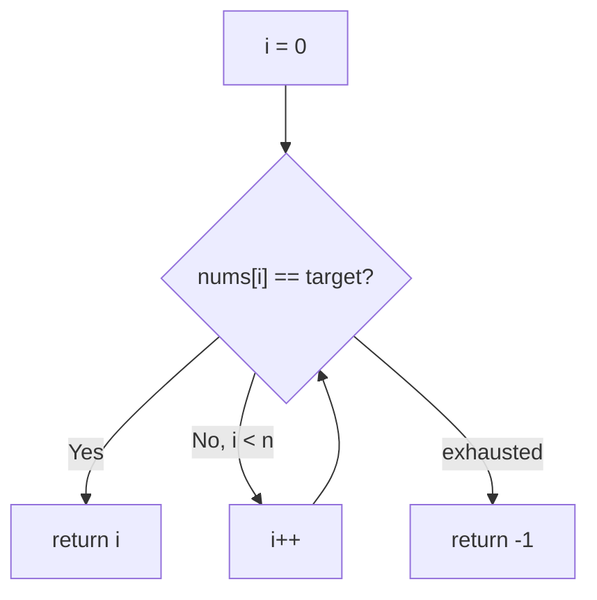
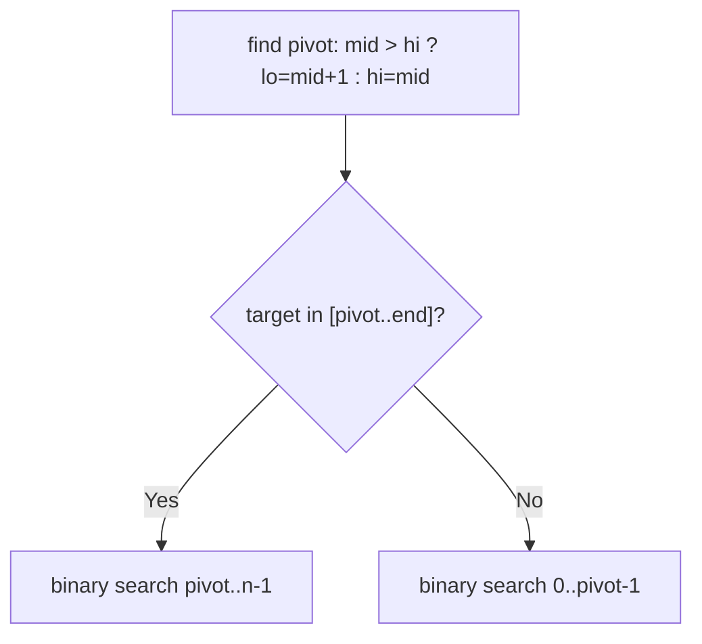

# 33. Search in Rotated Sorted Array

- **LeetCode Link**: `https://leetcode.com/problems/search-in-rotated-sorted-array/`
- **Difficulty**: Medium
- **Pattern Category**: Binary Search / Half-Sorted Discrimination
- **Prerequisite Primer**: `00-foundations/03-core-algorithmic-patterns.md`

---

## 1. Problem Overview & Edge Case Matrix

### Problem Statement
There is an integer array `nums` sorted in ascending order (with distinct values), rotated at an unknown pivot. Given the array after rotation and an integer `target`, return its index, or `-1` if it is not in the array. The algorithm must run in $O(\log N)$ time.

```
Example 1:
Input: nums = [4,5,6,7,0,1,2], target = 0
Output: 4

Example 2:
Input: nums = [4,5,6,7,0,1,2], target = 3
Output: -1

Example 3:
Input: nums = [1], target = 0
Output: -1
```

### Visual Problem Representation
```
original:  [0, 1, 2, 4, 5, 6, 7]
rotated:   [4, 5, 6, 7 | 0, 1, 2]
                          ^pivot
one half is ALWAYS sorted — find it, test membership, discard the other
```

### Upfront Edge Case Matrix
| Edge Case Category | Specific Input Scenario | Expected Behavior | Pitfall / Risk |
| :--- | :--- | :--- | :--- |
| Single Element | `[1]`, target `1` / `0` | `0` / `-1` | Pivot logic on length 1 |
| No rotation | `[1,2,3,4,5]`, target `3` | `2` | Sorted-half test with pivot at 0 |
| Full rotation point at ends | Target is min or max | Correct index | Half-membership boundaries |
| Missing target | Gap value (e.g. `3`) | Return `-1` | Falling out of both halves |
| Two elements | `[3,1]`, target `1` | `1` | `lo <= mid` equality on tiny ranges |

---

## 2. Level 1: Brute Force Approach

### Intuition & Visual Idea
Linear scan for the target. $O(N)$ — ignores the rotation structure completely and flunks the log requirement.



### Pseudocode
```text
FUNCTION rotatedSearchBruteForce(nums, target):
    FOR i IN 0 .. nums.LENGTH - 1:
        IF nums[i] == target: RETURN i
    RETURN -1
```

### Step-by-Step Dry Run (Visual Trace)
| Step | Iteration / Pointer ($i, j$) | Current Value | State / Sub-array | Action Taken |
| :--- | :--- | :--- | :--- | :--- |
| 0 | `i = 0..3` | `4,5,6,7` | No match | Advance |
| 1 | `i = 4` | `0 == 0` | Match | Return `4` |

### Modern JavaScript Implementation
```javascript
/**
 * Level 1: Brute Force (linear scan)
 * Time Complexity:  O(N) — violates the O(log N) requirement
 * Space Complexity: O(1)
 */
function rotatedSearchBruteForce(nums, target) {
  for (let i = 0; i < nums.length; i++) {
    if (nums[i] === target) return i;
  }
  return -1;
}
```

### Complexity Breakdown
- **Time Complexity**: $O(N)$ — linear; the rotation structure buys nothing here.
- **Space Complexity**: $O(1)$ — single index.

---

## 3. Level 2: Optimized Approach

### Intuition & Visual Bottleneck Elimination
Two-phase log search: first find the pivot (index of minimum) by binary search, then ordinary binary search inside the half that can contain the target. Two clean $O(\log N)$ phases — correct and modular, but twice the code of the one-pass version.



### Pseudocode
```text
FUNCTION rotatedSearchPivot(nums, target):
    IF nums EMPTY: RETURN -1
    pivot = FIND-MIN-INDEX(nums)   // binary search on rotation
    IF target >= nums[pivot] AND target <= nums[LAST]:
        RETURN BINARY-SEARCH(nums, target, pivot, n - 1)
    RETURN BINARY-SEARCH(nums, target, 0, pivot - 1)
```

### Step-by-Step Dry Run (Visual Trace)
| Step | Pointers / Window | Hash Map / Auxiliary State | Decision Logic | Output Accumulator |
| :--- | :--- | :--- | :--- | :--- |
| 0 | pivot search `[0,6]` | converges on index `4` (value `0`) | Minimum located | `pivot = 4` |
| 1 | `target = 0` | `0` in `[nums[4], nums[6]]` | Search right half | `binarySearch(4, 6)` |
| 2 | `[4,6]` mid `5` | `nums[5] = 1 > 0` | Go left | `binarySearch(4, 4)` |
| 3 | `[4,4]` | `nums[4] == 0` | Match | Return `4` |

### Modern JavaScript Implementation
```javascript
/**
 * Level 2: Optimized (pivot-find + half search)
 * Time Complexity:  O(log N) — two sequential binary searches
 * Space Complexity: O(1) — indices only
 */
function rotatedSearchPivot(nums, target) {
  if (nums.length === 0) return -1;
  // Phase 1: rotation pivot = index of the minimum (see Find Minimum guide).
  let lo = 0;
  let hi = nums.length - 1;
  while (lo < hi) {
    const mid = lo + ((hi - lo) >> 1);
    if (nums[mid] > nums[hi]) lo = mid + 1;
    else hi = mid;
  }
  const pivot = lo;
  const binarySearch = (l, r) => {
    while (l <= r) {
      const mid = l + ((r - l) >> 1);
      if (nums[mid] === target) return mid;
      if (nums[mid] < target) l = mid + 1;
      else r = mid - 1;
    }
    return -1;
  };
  // Phase 2: the target can only live in the half spanning its value.
  if (target >= nums[pivot] && target <= nums[nums.length - 1]) {
    return binarySearch(pivot, nums.length - 1);
  }
  return binarySearch(0, pivot - 1);
}
```

### Complexity Breakdown
- **Time Complexity**: $O(\log N)$ — two halving phases back to back.
- **Space Complexity**: $O(1)$ — indices; the cost is code surface, not resources.

---

## 4. Level 3: Most Optimal / Canonical Approach

### Intuition & Mathematical / Invariant Proof
One pass: at every step, ONE half is sorted — test `nums[lo] <= nums[mid]` to name it. If the left half is sorted and the target lies within `[nums[lo], nums[mid])`, discard right; otherwise discard left (mirror for right-sorted). Invariant: the target, if present, always lies in `[lo, hi]`. Each step halves the fence — $O(\log N)$ in a single loop, the canonical interview answer.

```
[4,5,6,7,0,1,2], t=0: [0,6] mid=3 (7): left [4..7] sorted, 0 not in [4,7) -> lo=4
  [4,6] mid=5 (1): left [0..1] sorted? nums[4]=0 <= 1 yes; 0 in [0,1) yes -> hi=4
  [4,4] mid=4: nums[4]==0 -> return 4
```

### Pseudocode
```text
FUNCTION search(nums, target):
    lo = 0; hi = nums.LENGTH - 1
    WHILE lo <= hi:
        mid = lo + FLOOR((hi - lo) / 2)
        IF nums[mid] == target: RETURN mid
        IF nums[lo] <= nums[mid]:            // LEFT half sorted
            IF nums[lo] <= target AND target < nums[mid]: hi = mid - 1
            ELSE: lo = mid + 1
        ELSE:                                 // RIGHT half sorted
            IF nums[mid] < target AND target <= nums[hi]: lo = mid + 1
            ELSE: hi = mid - 1
    RETURN -1
```

### Step-by-Step Dry Run (Visual Trace)
| Step | Pointer $L$ | Pointer $R$ | Invariant Checked | In-Place State |
| :--- | :--- | :--- | :--- | :--- |
| 1 | `lo=0` | `hi=6` | `mid=3 (7)`; left sorted, `0 ∉ [4,7)` | `lo = 4` |
| 2 | `lo=4` | `hi=6` | `mid=5 (1)`; left sorted, `0 ∈ [0,1)` | `hi = 4` |
| 3 | `lo=4` | `hi=4` | `nums[4] == 0` | Return `4` |

### Modern JavaScript Implementation
```javascript
/**
 * Level 3: Most Optimal / Canonical (one-pass half-sorted search)
 * Time Complexity:  O(log N) — single halving loop, optimal
 * Space Complexity: O(1) auxiliary — three indices
 */
function search(nums, target) {
  let lo = 0;
  let hi = nums.length - 1;
  while (lo <= hi) {
    const mid = lo + ((hi - lo) >> 1);
    if (nums[mid] === target) return mid;
    // One half is ALWAYS sorted: name it, test membership, discard the other.
    if (nums[lo] <= nums[mid]) {
      // Left half sorted: target inside [nums[lo], nums[mid])?
      if (nums[lo] <= target && target < nums[mid]) hi = mid - 1;
      else lo = mid + 1;
    } else {
      // Right half sorted: target inside (nums[mid], nums[hi]]?
      if (nums[mid] < target && target <= nums[hi]) lo = mid + 1;
      else hi = mid - 1;
    }
  }
  return -1;
}
```

### Complexity Breakdown
- **Time Complexity**: $O(\log N)$ — optimal; one halving loop instead of two phases.
- **Space Complexity**: $O(1)$ auxiliary — three indices, zero allocation.

---

## 5. JavaScript-Specific Gotchas & V8 Optimizations
- **GC Pressure**: Avoid allocating objects inside tight loops ($O(N)$ closures). All levels are allocation-free — never slice halves per iteration (that classic mistake turns log search into $O(N \log N)$ copying).
- **Type Coercion / Sorting**: `nums[lo] <= nums[mid]` uses `<=` (not `<`) deliberately — with distinct values, equality means the left half is a single element (sorted trivially); `<` misroutes length-1 left halves into the wrong branch.
- **Index Bounds**: Membership tests are half-open on the mid side (`target < nums[mid]`, `nums[mid] < target`) because `nums[mid] === target` already returned — re-including mid in either branch risks infinite loops on 2-element fences.

---

## 6. Real-World MAANG Interview Follow-Ups & Extensions

### Follow-Up 1: Rotation with duplicates (Search II)
- **Scenario**: Values may repeat (LeetCode 81) — worst case degrades to $O(N)$.
- **Solution Strategy**: When `nums[lo] === nums[mid] === nums[hi]`, neither half is nameable: shrink both ends (`lo++`, `hi--`) and continue. Average stays log; adversarial duplicates force linear.
- **JS Code / Implementation Pattern**:
```javascript
function searchWithDupes(nums, target) {
  let lo = 0, hi = nums.length - 1;
  while (lo <= hi) {
    const mid = lo + ((hi - lo) >> 1);
    if (nums[mid] === target) return true;
    if (nums[lo] === nums[mid] && nums[mid] === nums[hi]) { lo++; hi--; }
    else if (nums[lo] <= nums[mid]) {
      if (nums[lo] <= target && target < nums[mid]) hi = mid - 1;
      else lo = mid + 1;
    } else {
      if (nums[mid] < target && target <= nums[hi]) lo = mid + 1;
      else hi = mid - 1;
    }
  }
  return false;
}
```

### Follow-Up 2: Rotation point in a $10^9$-element stream
- **Scenario**: The array streams once; only $O(1)$ values fit in RAM.
- **Solution Strategy**: Rotation breaks streaming binary search (no random access) — instead track the minimum in one linear pass ($O(N)$ time, optimal for streams), or index the stream (B-tree pages) to restore seeks.
- **JS Code / Implementation Pattern**:
```javascript
async function minOfStream(numberStream) {
  let best = Infinity;
  for await (const v of numberStream) if (v < best) best = v;
  return best;
}
```

### Follow-Up 3: Concurrent rotation during search
- **Scenario & In-Depth Solution**: A writer rotates while readers search — mid-flight fences go stale. Version-stamp the array (bump on rotate); readers validate the stamp post-search and retry on mismatch (optimistic concurrency). Searches are pure reads, so retries are side-effect-free.
```javascript
function searchVersioned(arr, target, versionOf) {
  const stamp = versionOf(arr);
  const idx = search(arr, target);
  if (versionOf(arr) !== stamp) return searchVersioned(arr, target, versionOf);
  return idx;
}
```
