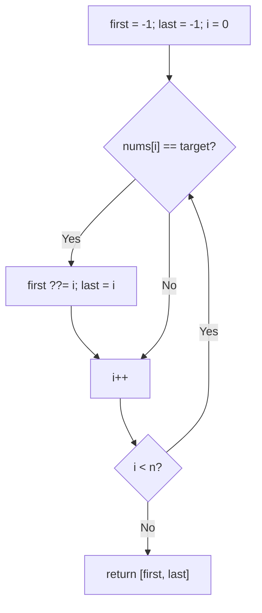
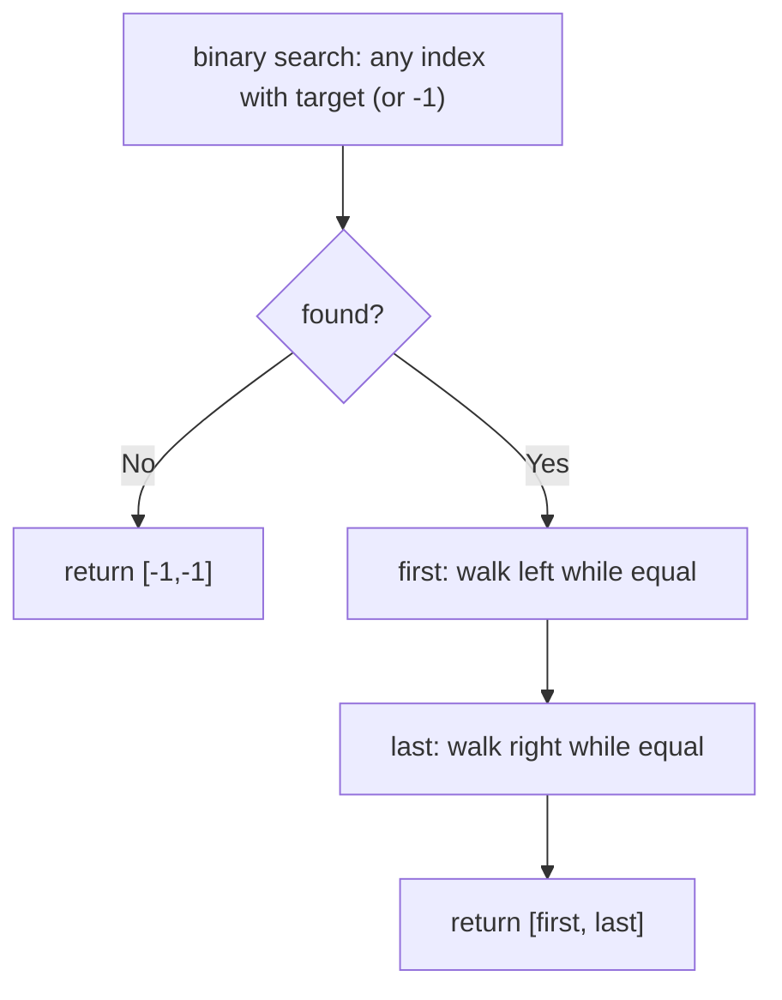
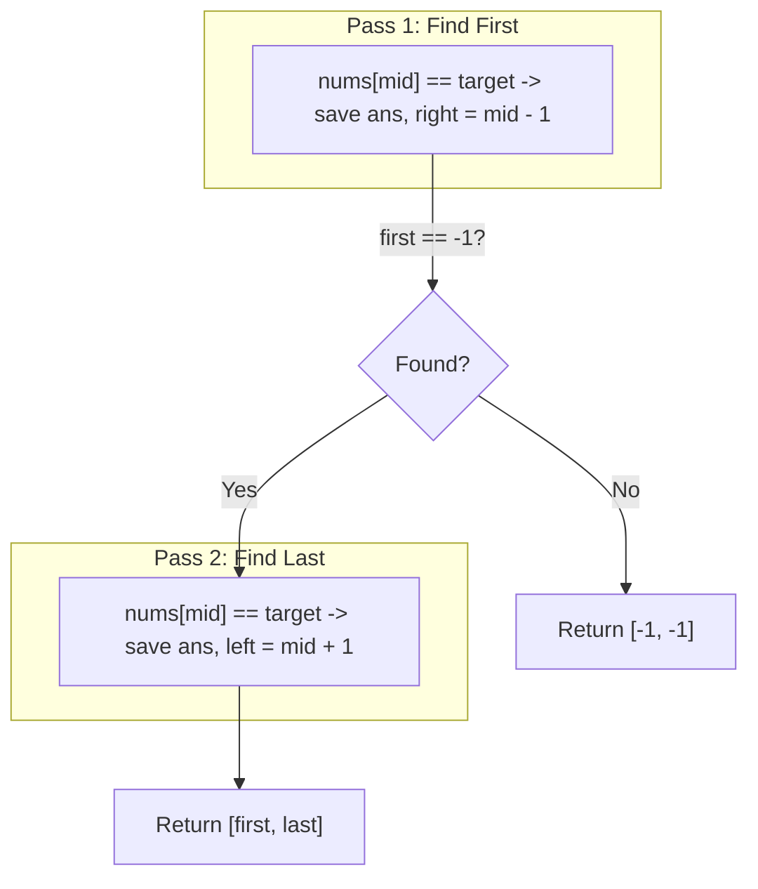

# 34. Find First and Last Position of Element in Sorted Array

- **LeetCode Link**: `https://leetcode.com/problems/find-first-and-last-position-of-element-in-sorted-array/`
- **Difficulty**: Medium
- **Pattern Category**: Binary Search / Dual Lower Bound
- **Prerequisite Primer**: `00-foundations/03-core-algorithmic-patterns.md`

---

## 1. Problem Overview & Edge Case Matrix

### Problem Statement
Given an array of integers `nums` sorted in non-decreasing order, find the starting and ending position of a given `target` value. If `target` is not found, return `[-1, -1]`. The algorithm must run in $O(\log N)$ time.

```
Example 1:
Input: nums = [5,7,7,8,8,10], target = 8
Output: [3,4]

Example 2:
Input: nums = [5,7,7,8,8,10], target = 6
Output: [-1,-1]

Example 3:
Input: nums = [], target = 0
Output: [-1,-1]
```

### Visual Problem Representation
```
index:   0  1  2  3  4  5
value:   5  7  7  8  8  10     target 8 -> [3, 4]
                     ^first     ^last
```

### Upfront Edge Case Matrix
| Edge Case Category | Specific Input Scenario | Expected Behavior | Pitfall / Risk |
| :--- | :--- | :--- | :--- |
| Empty / Nil | `nums = []` | Return `[-1,-1]` | Bound probe on empty |
| Single Element | `[1]`, target `1` / `0` | `[0,0]` / `[-1,-1]` | First/last collapse |
| All identical | `[7,7,7,7]`, target `7` | Return `[0,3]` | Expansion loop bounds |
| Missing target | Gap value | Return `[-1,-1]` | Returning an insert position as a hit |
| Target at edges | First/last element runs | Correct boundary indices | `first - 1` / `last + 1` overruns |

---

## 2. Level 1: Brute Force Approach

### Intuition & Visual Idea
Linear scan tracking the first and last matching indices. $O(N)$ — no binary search at all, flunks the complexity requirement.



### Pseudocode
```text
FUNCTION searchRangeBruteForce(nums, target):
    first = -1; last = -1
    FOR i IN 0 .. nums.LENGTH - 1:
        IF nums[i] == target:
            IF first == -1: first = i
            last = i
    RETURN [first, last]
```

### Step-by-Step Dry Run (Visual Trace)
| Step | Iteration / Pointer ($i, j$) | Current Value | State / Sub-array | Action Taken |
| :--- | :--- | :--- | :--- | :--- |
| 0 | `i = 0..2` | `5,7,7` | No match | Advance |
| 1 | `i = 3` | `8 == 8` | `first = 3`, `last = 3` | Mark |
| 2 | `i = 4` | `8 == 8` | `last = 4` | Extend |
| 3 | `i = 5` | `10` | No match | Return `[3,4]` |

### Modern JavaScript Implementation
```javascript
/**
 * Level 1: Brute Force (linear first/last scan)
 * Time Complexity:  O(N) — violates the O(log N) requirement
 * Space Complexity: O(1)
 */
function searchRangeBruteForce(nums, target) {
  let first = -1;
  let last = -1;
  for (let i = 0; i < nums.length; i++) {
    if (nums[i] === target) {
      if (first === -1) first = i; // latch the first hit only
      last = i; // every hit extends the tail
    }
  }
  return [first, last];
}
```

### Complexity Breakdown
- **Time Complexity**: $O(N)$ — full scan; rejected by the spec.
- **Space Complexity**: $O(1)$ — two indices.

---

## 3. Level 2: Optimized Approach

### Intuition & Visual Bottleneck Elimination
Binary-search ANY occurrence ($O(\log N)$), then expand linearly outward to the run edges. Fast when runs are short — but a full-array run (`[7×10⁴]`) degrades to $O(N)$ expansion.



### Pseudocode
```text
FUNCTION searchRangeExpand(nums, target):
    found = BINARY-SEARCH-ANY(nums, target)
    IF found == -1: RETURN [-1, -1]
    first = found; WHILE first > 0 AND nums[first-1] == target: first--
    last = found; WHILE last < n-1 AND nums[last+1] == target: last++
    RETURN [first, last]
```

### Step-by-Step Dry Run (Visual Trace)
| Step | Pointers / Window | Hash Map / Auxiliary State | Decision Logic | Output Accumulator |
| :--- | :--- | :--- | :--- | :--- |
| 0 | binary search | lands on index `4` | Hit | `found = 4` |
| 1 | expand left | `nums[3] == 8` | Extend | `first = 3` |
| 2 | expand left | `nums[2] = 7` | Stop | `first = 3` |
| 3 | expand right | `nums[5] = 10` | Stop | `last = 4`, return `[3,4]` |

### Modern JavaScript Implementation
```javascript
/**
 * Level 2: Optimized (binary hit + linear expansion)
 * Time Complexity:  O(log N + k) — k = run length; O(N) worst case
 * Space Complexity: O(1) — indices only
 */
function searchRangeExpand(nums, target) {
  // Phase 1: any occurrence via plain binary search.
  let lo = 0;
  let hi = nums.length - 1;
  let found = -1;
  while (lo <= hi) {
    const mid = lo + ((hi - lo) >> 1);
    if (nums[mid] === target) {
      found = mid;
      break;
    }
    if (nums[mid] < target) lo = mid + 1;
    else hi = mid - 1;
  }
  if (found === -1) return [-1, -1];
  // Phase 2: walk the run edges (short runs: cheap; full-array runs: O(N)).
  let first = found;
  while (first > 0 && nums[first - 1] === target) first--;
  let last = found;
  while (last < nums.length - 1 && nums[last + 1] === target) last++;
  return [first, last];
}
```

### Complexity Breakdown
- **Time Complexity**: $O(\log N + k)$ — $k$ = occurrence count; adversarial all-equal input forces $O(N)$.
- **Space Complexity**: $O(1)$ — indices; time degrades, not space.

---

## 4. Level 3: Most Optimal / Canonical Approach

### Intuition & Mathematical / Invariant Proof
Two lower bounds: `first = lowerBound(target)` (first `>= target`), and `last = lowerBound(target + 1) - 1` (last `<= target`). If `nums[first] !== target`, the target is absent. Each bound is $O(\log N)$ with no expansion — worst case stays logarithmic regardless of run length. This reuses the Search Insert Position kernel twice: range search IS doubled lower bound.

```
[5,7,7,8,8,10], t=8: lowerBound(8) = 3; nums[3]==8 hit;
  lowerBound(9) = 5; last = 5 - 1 = 4 => [3,4]
```

### Pseudocode
```text
FUNCTION lowerBound(nums, t):
    lo = 0; hi = nums.LENGTH
    WHILE lo < hi:
        mid = lo + FLOOR((hi - lo) / 2)
        IF nums[mid] < t: lo = mid + 1
        ELSE: hi = mid
    RETURN lo

FUNCTION searchRange(nums, target):
    first = lowerBound(nums, target)
    IF first == nums.LENGTH OR nums[first] != target: RETURN [-1, -1]
    RETURN [first, lowerBound(nums, target + 1) - 1]
```

### Step-by-Step Dry Run (Visual Trace)
| Step | Pointer $L$ | Pointer $R$ | Invariant Checked | In-Place State |
| :--- | :--- | :--- | :--- | :--- |
| 1 | `lowerBound(8)` | converges | First `>= 8` at `3` | `first = 3` |
| 2 | `nums[3] == 8` | hit confirmed | Not absent | Proceed |
| 3 | `lowerBound(9)` | converges | First `>= 9` at `5` | `last = 5 - 1 = 4` |
| 4 | return | — | — | `[3,4]` |

### Modern JavaScript Implementation
```javascript
/**
 * Level 3: Most Optimal / Canonical (dual lower bound)
 * Time Complexity:  O(log N) — two halving loops, worst case included
 * Space Complexity: O(1) auxiliary — indices only
 */
function searchRange(nums, target) {
  // Half-open lower bound over [lo, hi): first index with value >= t.
  const lowerBound = (t) => {
    let lo = 0;
    let hi = nums.length;
    while (lo < hi) {
      const mid = lo + ((hi - lo) >> 1);
      if (nums[mid] < t) lo = mid + 1;
      else hi = mid;
    }
    return lo;
  };
  const first = lowerBound(target);
  // Absent check covers both past-the-end AND gap values.
  if (first === nums.length || nums[first] !== target) return [-1, -1];
  // lowerBound(target + 1) = first index BEYOND the run; step back one.
  return [first, lowerBound(target + 1) - 1];
}
```

### Complexity Breakdown
- **Time Complexity**: $O(\log N)$ — optimal; run length is irrelevant.
- **Space Complexity**: $O(1)$ auxiliary — indices; no expansion, no storage.

---

## 5. JavaScript-Specific Gotchas & V8 Optimizations
- **GC Pressure**: Avoid allocating objects inside tight loops ($O(N)$ closures). All levels allocate one 2-element result — never slice runs (`nums.slice(first, last+1)`) to "return" them; indices ARE the answer.
- **Type Coercion / Sorting**: `lowerBound(target + 1)` assumes integer values — with floats, use a successor bound (`lowerBoundExclusive`) instead; `nums[first] !== target` strictness rejects type-coerced false hits.
- **Index Bounds**: `first === nums.length` past-the-end check MUST precede `nums[first]` access — `nums[n]` is `undefined`, and `undefined !== target` happens to be true, but relying on that masks the boundary; state it explicitly. The half-open `[lo, hi)` form (vs fenced `[lo, hi]`) is what makes `lowerBound` compose cleanly.

---

## 6. Real-World MAANG Interview Follow-Ups & Extensions

### Follow-Up 1: K occurrences and occurrence counting
- **Scenario**: Count occurrences, or return the k-th occurrence index.
- **Solution Strategy**: Count = `last - first + 1` from Level 3 ($O(\log N)$); k-th occurrence = `first + k - 1` with a bounds check — no traversal at all.
- **JS Code / Implementation Pattern**:
```javascript
function countOccurrences(nums, target) {
  const [first, last] = searchRange(nums, target);
  return first === -1 ? 0 : last - first + 1;
}
```

### Follow-Up 2: Range search over a $10^9$-element stream
- **Scenario**: Sorted data streams once; only the run fits in RAM.
- **Solution Strategy**: Galloping brackets + binary search need random access — without it, single-pass filter: emit indices while equal, stop after the run ends (sortedness proves nothing more can match). $O(N)$ time, $O(k)$ memory — optimal for streams.
- **JS Code / Implementation Pattern**:
```javascript
async function rangeOfStream(sortedStream, target) {
  let first = -1, last = -1, i = -1;
  let pastRun = false;
  for await (const v of sortedStream) {
    i++;
    if (v === target) {
      if (first === -1) first = i;
      last = i;
    } else if (first !== -1) break; // sorted: the run is over
  }
  return [first, last];
}
```

### Follow-Up 3: Concurrent sorted array with range snapshots
- **Scenario & In-Depth Solution**: Writers insert while readers range-query. Snapshot the length once (appends only extend right): both lower bounds run within the snapshot — consistent point-in-time ranges with zero locking. Inserts inside the range race the snapshot; version-stamp and retry for strict linearizability.
```javascript
function rangeSnapshot(arr, target, versionOf) {
  const snap = arr.slice(0, arr.length); // lengths only grow: cheap freeze
  const stamp = versionOf(arr);
  const res = searchRange(snap, target);
  if (versionOf(arr) !== stamp) return rangeSnapshot(arr, target, versionOf);
  return res;
}
```

---

## 7. What LeetCode Discuss Says (Language-Independent)

Source: top-voted post by srxbinary —
`https://leetcode.com/problems/find-first-and-last-position-of-element-in-sorted-array/solutions/8516475/beats-100-java-olog-n-binary-search-two-pgexd/`
— 541 views.
Language-independent summary. No new JS here.

### A. Optimal way from Discuss (Two-Pass Directional Binary Search)

To guarantee $O(\log N)$ even when the entire array consists of duplicates, perform two independent binary search passes: one biased leftward for the first occurrence, and one biased rightward for the last:

1. **Find First (Left Boundary):**
   - When `nums[mid] == target`, record candidate `first = mid`.
   - Shrink search space leftward (`right = mid - 1`) to check for earlier matches.
2. **Find Last (Right Boundary):**
   - When `nums[mid] == target`, record candidate `last = mid`.
   - Shrink search space rightward (`left = mid + 1`) to check for later matches.
3. **Combine:** If `first == -1`, return `[-1, -1]`. Otherwise return `[first, last]`.

```text
FUNCTION searchRange(nums, target):
    first = findBound(nums, target, isFirst=true)
    IF first == -1:
        RETURN [-1, -1]

    last = findBound(nums, target, isFirst=false)
    RETURN [first, last]

FUNCTION findBound(nums, target, isFirst):
    left = 0
    right = length(nums) - 1
    ans = -1

    WHILE left <= right:
        mid = left + (right - left) / 2

        IF nums[mid] == target:
            ans = mid
            IF isFirst:
                right = mid - 1  // Look further left
            ELSE:
                left = mid + 1   // Look further right
        ELSE IF nums[mid] < target:
            left = mid + 1
        ELSE:
            right = mid - 1

    RETURN ans
```

- Time: O(log N) — two strict binary searches each running in $O(\log N)$.
- Space: O(1) auxiliary space.



### B. Dry run on LeetCode Example 1 (`nums = [5,7,7,8,8,10], target = 8`)

- **Pass 1 (findFirst):** `[0, 5]`
  - `mid = 2`. `nums[2] = 7 < 8` -> `left = 3`.
  - `mid = 4`. `nums[4] = 8 == target` -> `first = 4`, `right = 3`.
  - `mid = 3`. `nums[3] = 8 == target` -> `first = 3`, `right = 2`.
  - `left > right` (3 > 2), loop ends. `first = 3`.
- **Pass 2 (findLast):** `[0, 5]`
  - `mid = 2`. `nums[2] = 7 < 8` -> `left = 3`.
  - `mid = 4`. `nums[4] = 8 == target` -> `last = 4`, `left = 5`.
  - `mid = 5`. `nums[5] = 10 > 8` -> `right = 4`.
  - `left > right` (5 > 4), loop ends. `last = 4`.

Final result: `[3, 4]`.

### C. Why Directional Binary Search Beats Midpoint Linear Expansion

- Finding any one match and linearly expanding outward (`while nums[i] == target i++`) degrades to $O(N)$ when the target frequency is large (e.g. $[8, 8, \dots, 8]$).
- Continuing the binary search logarithmically cuts the search space in half on every step, strictly adhering to the problem's $O(\log N)$ requirement.

### D. Pitfalls from comments

- **Premature Break on Match:** Typical binary search stops immediately on `nums[mid] == target`. Here, the match must be recorded while shifting the pointer to continue narrowing the bound.
- **Skipping Second Pass:** If `findFirst` returns `-1`, skipping the second search pass avoids wasted CPU cycles.

### E. Companies

- Discuss post itself names none.
  Companies tab on LeetCode is premium-locked.
- External source:
  `https://github.com/liquidslr/leetcode-company-wise-problems`
  (LeetCode company tags, updated June 2025).
- All-time (29): Accenture, Airtel, Amazon, Apple, Applied Intuition, Atlassian, Attentive, Bloomberg, Capgemini, Citadel, DE Shaw, Goldman Sachs, Google, Infosys, Instacart, LinkedIn, Meta, Microsoft, Oracle, PayPal, Pinterest, Splunk, tcs, Tekion, TikTok, Tinkoff, Turing, Uber, Zoho.
- Recent: 30 days — Amazon, Google, Microsoft.
- Recent: 3 months — Amazon, Bloomberg, Google, Meta, Microsoft, tcs, TikTok.
