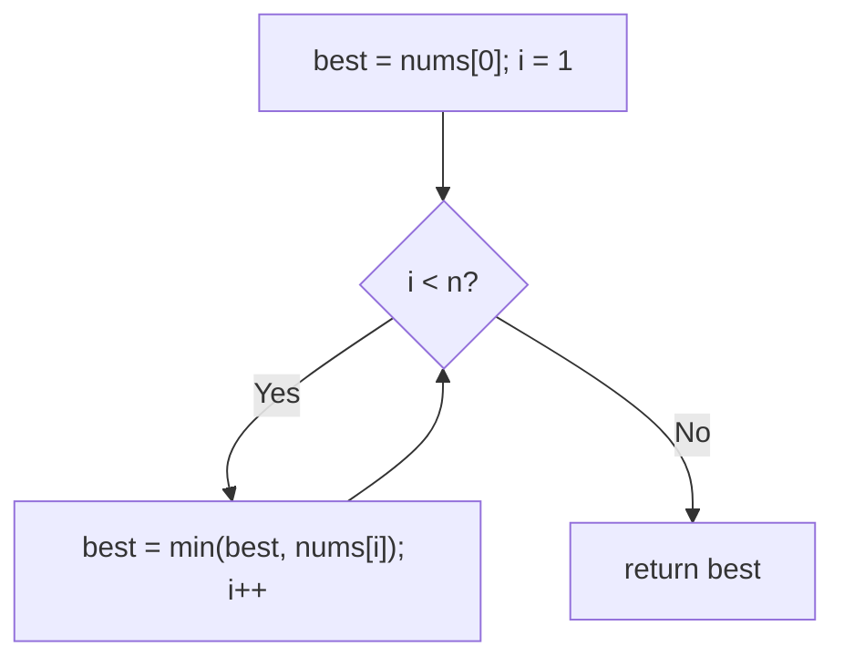
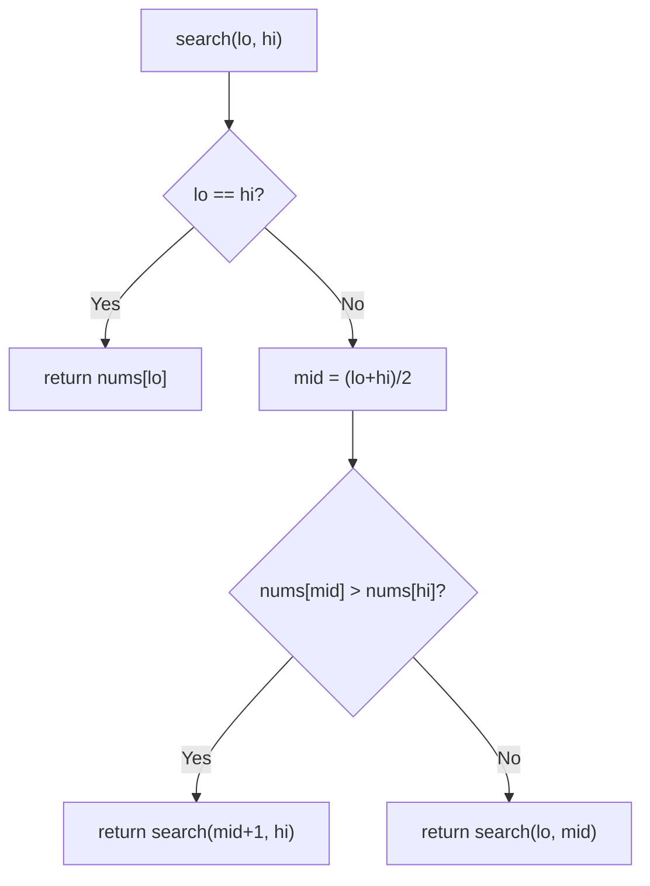

# 153. Find Minimum in Rotated Sorted Array

- **LeetCode Link**: `https://leetcode.com/problems/find-minimum-in-rotated-sorted-array/`
- **Difficulty**: Medium
- **Pattern Category**: Binary Search / Rotation Pivot
- **Prerequisite Primer**: `00-foundations/03-core-algorithmic-patterns.md`

---

## 1. Problem Overview & Edge Case Matrix

### Problem Statement
Suppose an array of length `n` sorted in ascending order is rotated between `1` and `n` times. Given the rotated array `nums` of unique elements, return the minimum element. The algorithm must run in $O(\log N)$ time.

```
Example 1:
Input: nums = [3,4,5,1,2]
Output: 1

Example 2:
Input: nums = [4,5,6,7,0,1,2]
Output: 0

Example 3:
Input: nums = [11,13,15,17]
Output: 11
Explanation: No rotation — the minimum is the first element.
```

### Visual Problem Representation
```
value
  ^  x           x
  |    x     x     x
  |      x           x
  +--------------------> index
   0  1  2  3  4  5  6     minimum at the rotation cliff (index 4)
```

### Upfront Edge Case Matrix
| Edge Case Category | Specific Input Scenario | Expected Behavior | Pitfall / Risk |
| :--- | :--- | :--- | :--- |
| Single Element | `[1]` | Return `1` | Loop that needs ≥2 elements |
| No rotation | `[11,13,15,17]` | Return `nums[0]` | Assuming a cliff always exists |
| Rotation at last | `[2,1]` | Return `1` | 2-element fence handling |
| Minimum at ends | First or last index | Correct value | Midpoint never landing on edges |
| Strictly decreasing pairs | Never (rotated-sorted) | N/A | Misapplying peak-element slope logic |

---

## 2. Level 1: Brute Force Approach

### Intuition & Visual Idea
Linear scan tracking the minimum. $O(N)$ — treats a rotated-sorted array as unsorted and flunks the log requirement.



### Pseudocode
```text
FUNCTION findMinBruteForce(nums):
    best = nums[0]
    FOR i IN 1 .. nums.LENGTH - 1:
        IF nums[i] < best: best = nums[i]
    RETURN best
```

### Step-by-Step Dry Run (Visual Trace)
| Step | Iteration / Pointer ($i, j$) | Current Value | State / Sub-array | Action Taken |
| :--- | :--- | :--- | :--- | :--- |
| 0 | `i = 1..3` | `4, 5` then `1` | `best` drops to `1` | Track min |
| 1 | `i = 4` | `2 > 1` | No change | Return `1` |

### Modern JavaScript Implementation
```javascript
/**
 * Level 1: Brute Force (linear minimum scan)
 * Time Complexity:  O(N) — violates the O(log N) requirement
 * Space Complexity: O(1)
 */
function findMinBruteForce(nums) {
  let best = nums[0];
  for (let i = 1; i < nums.length; i++) {
    if (nums[i] < best) best = nums[i];
  }
  return best;
}
```

### Complexity Breakdown
- **Time Complexity**: $O(N)$ — linear; rotation structure unused.
- **Space Complexity**: $O(1)$ — single accumulator.

---

## 3. Level 2: Optimized Approach

### Intuition & Visual Bottleneck Elimination
Recursive pivot hunt: if `nums[mid] > nums[hi]`, the cliff (minimum) lies strictly right of mid; otherwise it lies at-or-left of mid. Recurse into the cliff half — $O(\log N)$ time, $O(\log N)$ stack.



### Pseudocode
```text
FUNCTION findMinRecursive(nums):
    DEFINE search(lo, hi):
        IF lo == hi: RETURN nums[lo]
        mid = FLOOR((lo + hi) / 2)
        IF nums[mid] > nums[hi]: RETURN search(mid + 1, hi)
        RETURN search(lo, mid)
    RETURN search(0, nums.LENGTH - 1)
```

### Step-by-Step Dry Run (Visual Trace)
| Step | Pointers / Window | Hash Map / Auxiliary State | Decision Logic | Output Accumulator |
| :--- | :--- | :--- | :--- | :--- |
| 0 | `[0, 6]`, mid `3` | `nums[3]=7 > nums[6]=2` | Cliff right of mid | `search(4, 6)` |
| 1 | `[4, 6]`, mid `5` | `nums[5]=1 > nums[6]=2`? No | Minimum within `[4,5]` | `search(4, 5)` |
| 2 | `[4, 5]`, mid `4` | `nums[4]=0 > nums[5]=1`? No | Minimum within `[4,4]` | `search(4, 4)` |
| 3 | `[4, 4]` | base case | Cliff foot | Return `nums[4] = 0` |

### Modern JavaScript Implementation
```javascript
/**
 * Level 2: Optimized (recursive cliff hunt)
 * Time Complexity:  O(log N) — halving per frame
 * Space Complexity: O(log N) — call stack depth
 */
function findMinRecursive(nums) {
  function search(lo, hi) {
    // Single-element fence: the survivor sits at the cliff bottom.
    if (lo === hi) return nums[lo];
    const mid = (lo + hi) >> 1;
    // nums[mid] > nums[hi] proves rotation inside (mid, hi]: cliff is right.
    if (nums[mid] > nums[hi]) return search(mid + 1, hi);
    // Else the [lo, mid] span is sorted-ish: the minimum sits within it.
    return search(lo, mid);
  }
  return search(0, nums.length - 1);
}
```

### Complexity Breakdown
- **Time Complexity**: $O(\log N)$ — range halves per frame.
- **Space Complexity**: $O(\log N)$ — recursion depth; iteration removes even this.

---

## 4. Level 3: Most Optimal / Canonical Approach

### Intuition & Mathematical / Invariant Proof
Iterative cliff hunt with the `lo < hi` half-open fence: same comparison as Level 2 (`nums[mid] > nums[hi]` ⇒ cliff right of mid, else minimum within `[lo, mid]`). Invariant: the minimum always lies in `[lo, hi]`. Comparing against `hi` (not `lo`) is the key insight — `nums[mid] > nums[hi]` PROVES rotation inside `(mid, hi]`, while no comparison against `lo` can prove anything (both orders possible). At exit `lo === hi` at the cliff bottom.

```
[3,4,5,1,2]: [0,4] mid=2 (5 > 2) -> [3,4]; mid=3 (1 > 2)? No -> [3,3] -> return 1
[11,13,15,17]: [0,3] mid=1 (13 > 17)? No -> [0,1]; mid=0 (11 > 13)? No -> [0,0] -> 11
```

### Pseudocode
```text
FUNCTION findMin(nums):
    lo = 0; hi = nums.LENGTH - 1
    WHILE lo < hi:
        mid = lo + FLOOR((hi - lo) / 2)
        IF nums[mid] > nums[hi]: lo = mid + 1
        ELSE: hi = mid
    RETURN nums[lo]
```

### Step-by-Step Dry Run (Visual Trace)
| Step | Pointer $L$ | Pointer $R$ | Invariant Checked | In-Place State |
| :--- | :--- | :--- | :--- | :--- |
| 1 | `lo=0` | `hi=6` | `mid=3`, `7 > 2` → cliff right | `lo = 4` |
| 2 | `lo=4` | `hi=6` | `mid=5`, `1 > 2`? No → min within | `hi = 5` |
| 3 | `lo=4` | `hi=5` | `mid=4`, `0 > 1`? No → min within | `hi = 4` |
| 4 | `lo=4` | `hi=4` | Exit | Return `nums[4] = 0` |

### Modern JavaScript Implementation
```javascript
/**
 * Level 3: Most Optimal / Canonical (iterative cliff hunt)
 * Time Complexity:  O(log N) — optimal for rotated search
 * Space Complexity: O(1) auxiliary — two indices
 */
function findMin(nums) {
  let lo = 0;
  let hi = nums.length - 1;
  // Half-open fence: minimum always inside [lo, hi].
  while (lo < hi) {
    const mid = lo + ((hi - lo) >> 1);
    // nums[mid] > nums[hi] PROVES rotation in (mid, hi]: cliff is right.
    // (Comparing with lo proves nothing: both orders are possible there.)
    if (nums[mid] > nums[hi]) lo = mid + 1;
    // Else [lo, mid] holds the minimum (mid itself may be the cliff foot).
    else hi = mid;
  }
  return nums[lo];
}
```

### Complexity Breakdown
- **Time Complexity**: $O(\log N)$ — optimal; the fence halves every iteration.
- **Space Complexity**: $O(1)$ auxiliary — two indices, zero allocation.

---

## 5. JavaScript-Specific Gotchas & V8 Optimizations
- **GC Pressure**: Avoid allocating objects inside tight loops ($O(N)$ closures). All levels are allocation-free — never slice halves per iteration.
- **Type Coercion / Sorting**: `nums[mid] > nums[hi]` strict comparison — with distinct values (spec-guaranteed) every comparison is decisive; duplicates (LeetCode 154) break the proof and need the shrink-both-ends fallback.
- **Index Bounds**: `hi = mid` (NOT `mid - 1`) on the else branch — mid may BE the minimum (cliff foot), and excluding it skips the answer. The asymmetric updates (`mid+1` / `mid`) mirror Find Peak Element's fence for the same reason.

---

## 6. Real-World MAANG Interview Follow-Ups & Extensions

### Follow-Up 1: Minimum with duplicates (Find Minimum II)
- **Scenario**: Values may repeat (LeetCode 154) — worst case $O(N)$.
- **Solution Strategy**: When `nums[mid] === nums[hi]`, neither half is provable: `hi--` and continue. Average stays log; adversarial duplicates force linear.
- **JS Code / Implementation Pattern**:
```javascript
function findMinWithDupes(nums) {
  let lo = 0, hi = nums.length - 1;
  while (lo < hi) {
    const mid = lo + ((hi - lo) >> 1);
    if (nums[mid] > nums[hi]) lo = mid + 1;
    else if (nums[mid] < nums[hi]) hi = mid;
    else hi--; // undecidable: shrink one step
  }
  return nums[lo];
}
```

### Follow-Up 2: Rotation count (how far was it rotated?)
- **Scenario**: Return the pivot INDEX, not the value.
- **Solution Strategy**: Level 3 returns `nums[lo]` — return `lo` instead. Same loop, index-flavored answer (what Rotated Search's Phase 1 needed).
- **JS Code / Implementation Pattern**:
```javascript
function rotationCount(nums) {
  let lo = 0, hi = nums.length - 1;
  while (lo < hi) {
    const mid = lo + ((hi - lo) >> 1);
    if (nums[mid] > nums[hi]) lo = mid + 1;
    else hi = mid;
  }
  return lo; // the pivot index itself
}
```

### Follow-Up 3: Minimum of a $10^9$-element rotated stream
- **Scenario & In-Depth Solution**: The array streams once with no seeks — binary search is impossible. Track the running minimum in one linear pass ($O(N)$ time, optimal for streams, $O(1)$ RAM). If the stream is replayable (disk-backed), page it and run Level 3 with $O(\log N)$ page reads.
```javascript
async function minOfStream(numberStream) {
  let best = Infinity;
  for await (const v of numberStream) if (v < best) best = v;
  return best;
}
```
