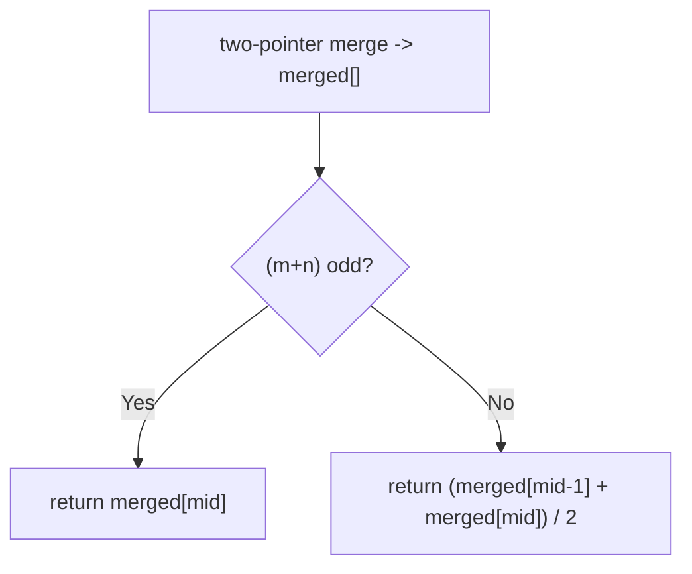
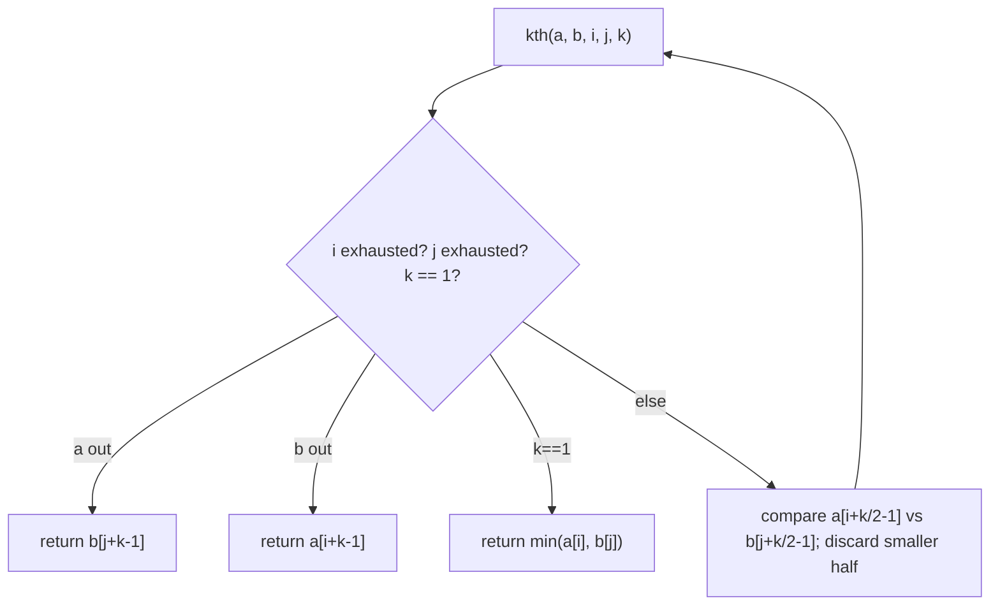

# 4. Median of Two Sorted Arrays

- **LeetCode Link**: `https://leetcode.com/problems/median-of-two-sorted-arrays/`
- **Difficulty**: Hard
- **Pattern Category**: Binary Search / Partition Balance
- **Prerequisite Primer**: `00-foundations/03-core-algorithmic-patterns.md`

---

## 1. Problem Overview & Edge Case Matrix

### Problem Statement
Given two sorted arrays `nums1` and `nums2` of size `m` and `n` respectively, return the median of the two sorted arrays. The overall run time complexity should be $O(\log(m + n))$.

```
Example 1:
Input: nums1 = [1,3], nums2 = [2]
Output: 2.00000
Explanation: merged array = [1,2,3] and median is 2.

Example 2:
Input: nums1 = [1,2], nums2 = [3,4]
Output: 2.50000
Explanation: merged array = [1,2,3,4] and median is (2 + 4) / 2 = 2.5.
```

### Visual Problem Representation
```
nums1 = [1 | 3]        partition: left halves [1,2] | right halves [3]
nums2 = [2]            max(left) = 2 <= min(right) = 3  => median 2

nums1 = [1, 2]         left [1,2] | right [3,4]
nums2 = [3, 4]         (maxL + minR) / 2 = 2.5
```

### Upfront Edge Case Matrix
| Edge Case Category | Specific Input Scenario | Expected Behavior | Pitfall / Risk |
| :--- | :--- | :--- | :--- |
| Empty array | `nums1 = []`, `nums2 = [1]` | Median of `nums2` | Partition indices on empty |
| Single elements | `[1]`, `[2]` | `1.5` | Odd/even branch on total 2 |
| Odd total | `m + n` odd | Middle element (not averaged) | Averaging anyway |
| Disjoint ranges | `[1,2]` + `[10,20]` | Boundary partition | `-Infinity`/`Infinity` sentinels |
| Duplicates across arrays | `[1,1]`, `[1,1]` | `1` | Strict vs non-strict partition inequalities |

---

## 2. Level 1: Brute Force Approach

### Intuition & Visual Idea
Merge both sorted arrays into one (standard two-pointer merge), then read the middle. $O(m + n)$ time and space — correct, and twice over budget on both axes.



### Pseudocode
```text
FUNCTION findMedianSortedArraysBruteForce(nums1, nums2):
    merged = MERGE-SORTED(nums1, nums2)
    total = merged.LENGTH; mid = total >> 1
    IF total MOD 2 == 1: RETURN merged[mid]
    RETURN (merged[mid-1] + merged[mid]) / 2
```

### Step-by-Step Dry Run (Visual Trace)
| Step | Iteration / Pointer ($i, j$) | Current Value | State / Sub-array | Action Taken |
| :--- | :--- | :--- | :--- | :--- |
| 0 | merge `[1,3]`, `[2]` | take `1`, `2`, `3` | `merged = [1,2,3]` | Two-pointer merge |
| 1 | total `3` (odd) | `mid = 1` | `merged[1] = 2` | Return `2` |

### Modern JavaScript Implementation
```javascript
/**
 * Level 1: Brute Force (full merge + middle read)
 * Time Complexity:  O(m + n) — violates the O(log(m+n)) requirement
 * Space Complexity: O(m + n) — merged array
 */
function findMedianSortedArraysBruteForce(nums1, nums2) {
  const merged = [];
  let i = 0;
  let j = 0;
  // Standard sorted merge: always take the smaller head.
  while (i < nums1.length && j < nums2.length) {
    if (nums1[i] <= nums2[j]) merged.push(nums1[i++]);
    else merged.push(nums2[j++]);
  }
  // Drain whichever array remains (exactly one is non-empty here).
  while (i < nums1.length) merged.push(nums1[i++]);
  while (j < nums2.length) merged.push(nums2[j++]);
  const total = merged.length;
  const mid = total >> 1;
  if (total % 2 === 1) return merged[mid];
  return (merged[mid - 1] + merged[mid]) / 2;
}
```

### Complexity Breakdown
- **Time Complexity**: $O(m + n)$ — full merge; rejected by the spec.
- **Space Complexity**: $O(m + n)$ — merged array; the answer is one or two numbers.

---

## 3. Level 2: Optimized Approach

### Intuition & Visual Bottleneck Elimination
Generalize to k-th smallest across two sorted arrays: compare the $k/2$-th remaining elements and discard the smaller half ($k/2$ elements proven below the answer). Median = k-th (odd) or average of two k-ths (even). $O(\log(m + n))$ time, $O(\log)$ stack — optimal time without the partition insight.



### Pseudocode
```text
FUNCTION kth(a, b, i, j, k):   // 1-indexed k over a[i..], b[j..]
    IF i AT END a: RETURN b[j+k-1]
    IF j AT END b: RETURN a[i+k-1]
    IF k == 1: RETURN MIN(a[i], b[j])
    half = k >> 1
    ai = MIN(i + half, a.LENGTH) - 1; bj = MIN(j + half, b.LENGTH) - 1
    IF a[ai] <= b[bj]: RETURN kth(a, b, ai+1, j, k-(ai-i+1))
    RETURN kth(a, b, i, bj+1, k-(bj-j+1))

FUNCTION findMedianSortedArraysKth(nums1, nums2):
    total = m + n
    IF total ODD: RETURN kth(nums1, nums2, 0, 0, (total+1)>>1)
    RETURN (kth(..., total>>1) + kth(..., (total>>1)+1)) / 2
```

### Step-by-Step Dry Run (Visual Trace)
| Step | Pointers / Window | Hash Map / Auxiliary State | Decision Logic | Output Accumulator |
| :--- | :--- | :--- | :--- | :--- |
| 0 | `kth([1,2],[3,4],0,0,2)` | `half=1`: `a[0]=1 <= b[0]=3` | Discard `a[0]` | `kth(_,_,1,0,1)` |
| 1 | `k = 1` | `min(a[1]=2, b[0]=3)` | Base case | Return `2` |
| 2 | second call `k=3` | discards down | — | Returns `3` |
| 3 | average | `(2 + 3) / 2` | Even total | Return `2.5` |

### Modern JavaScript Implementation
```javascript
/**
 * Level 2: Optimized (recursive k-th elimination)
 * Time Complexity:  O(log(m + n)) — k halves per frame
 * Space Complexity: O(log(m + n)) — call stack depth
 */
// K-th smallest (1-indexed k) over a[i..] and b[j..]; arrays stay sorted.
function kthOfTwoSorted(a, b, i, j, k) {
  // Exhaustion: answer lies wholly in the surviving array.
  if (i >= a.length) return b[j + k - 1];
  if (j >= b.length) return a[i + k - 1];
  if (k === 1) return Math.min(a[i], b[j]);
  const half = k >> 1;
  // Probe up to half elements ahead, clamped to array ends.
  const ai = Math.min(i + half, a.length) - 1;
  const bj = Math.min(j + half, b.length) - 1;
  // The smaller probe's whole block sits below the answer: discard it.
  if (a[ai] <= b[bj]) return kthOfTwoSorted(a, b, ai + 1, j, k - (ai - i + 1));
  return kthOfTwoSorted(a, b, i, bj + 1, k - (bj - j + 1));
}

function findMedianSortedArraysKth(nums1, nums2) {
  const total = nums1.length + nums2.length;
  if (total % 2 === 1) return kthOfTwoSorted(nums1, nums2, 0, 0, (total + 1) >> 1);
  const left = kthOfTwoSorted(nums1, nums2, 0, 0, total >> 1);
  const right = kthOfTwoSorted(nums1, nums2, 0, 0, (total >> 1) + 1);
  return (left + right) / 2;
}
```

### Complexity Breakdown
- **Time Complexity**: $O(\log(m + n))$ — $k$ halves per frame; meets the required bound.
- **Space Complexity**: $O(\log(m + n))$ — recursion depth; the partition method needs none.

---

## 4. Level 3: Most Optimal / Canonical Approach

### Intuition & Mathematical / Invariant Proof
Partition both arrays so the left halves hold exactly `half = (m+n+1)>>1` elements: cut `nums1` at `i`, forcing `nums2`'s cut at `j = half - i`. Correct iff `aLeft <= bRight AND bLeft <= aRight` (every left ≤ every right) — then the median is `max(lefts)` (odd) or the midpoint of `max(lefts)`, `min(rights)` (even). Binary-search `i` over the SHORTER array (swap to guarantee): `aLeft > bRight` means `i` is too far right, else too far left. $O(\log \min(m,n))$ — strictly better than required.

```
[1,2] + [3,4]: half = 3. i=1: aLeft=1, aRight=2, bLeft=3, bRight=4:
  bLeft(3) > aRight(2), so i is too far left -> lo = 2.
  i=2: j = 0: aLeft=2, aRight=+inf, bLeft=-inf, bRight=3:
  2<=3 and -inf<=+inf hold -> even total: (max(2,-inf)+min(+inf,3))/2 = 2.5
```

### Pseudocode
```text
FUNCTION findMedianSortedArrays(nums1, nums2):
    IF nums1 LONGER THAN nums2: SWAP (binary-search the shorter)
    m = nums1.LENGTH; n = nums2.LENGTH
    half = (m + n + 1) >> 1
    lo = 0; hi = m
    WHILE lo <= hi:
        i = lo + FLOOR((hi - lo) / 2); j = half - i
        aLeft = (i == 0) ? -Infinity : nums1[i-1]
        aRight = (i == m) ? Infinity : nums1[i]
        bLeft = (j == 0) ? -Infinity : nums2[j-1]
        bRight = (j == n) ? Infinity : nums2[j]
        IF aLeft <= bRight AND bLeft <= aRight:
            IF (m+n) ODD: RETURN MAX(aLeft, bLeft)
            RETURN (MAX(aLeft, bLeft) + MIN(aRight, bRight)) / 2
        IF aLeft > bRight: hi = i - 1
        ELSE: lo = i + 1
```

### Step-by-Step Dry Run (Visual Trace)
| Step | Pointer $L$ | Pointer $R$ | Invariant Checked | In-Place State |
| :--- | :--- | :--- | :--- | :--- |
| 1 | `i=1` (`[0,2]`) | `j=1` | `aL=1,aR=2,bL=3,bR=4`: `3 > 2` fails | `i` too far left → `lo=2` |
| 2 | `i=2` (`[2,2]`) | `j=0` | `aL=2,aR=+inf,bL=-inf,bR=3`: holds | Even: `(max(2,-inf)+min(inf,3))/2` |
| 3 | return | — | — | `(2+3)/2 = 2.5` |

### Modern JavaScript Implementation
```javascript
/**
 * Level 3: Most Optimal / Canonical (partition binary search)
 * Time Complexity:  O(log(min(m, n))) — beats the required bound
 * Space Complexity: O(1) auxiliary — indices only
 */
function findMedianSortedArrays(nums1, nums2) {
  // Binary-search the SHORTER array: guarantees j stays in range.
  if (nums1.length > nums2.length) return findMedianSortedArrays(nums2, nums1);
  const m = nums1.length;
  const n = nums2.length;
  const half = (m + n + 1) >> 1; // left halves hold the lower half (+1 if odd)
  let lo = 0;
  let hi = m;
  while (lo <= hi) {
    const i = lo + ((hi - lo) >> 1);
    const j = half - i;
    // Edge cuts borrow infinities: empty sides constrain nothing.
    const aLeft = i === 0 ? -Infinity : nums1[i - 1];
    const aRight = i === m ? Infinity : nums1[i];
    const bLeft = j === 0 ? -Infinity : nums2[j - 1];
    const bRight = j === n ? Infinity : nums2[j];
    // Correct partition: every left <= every right.
    if (aLeft <= bRight && bLeft <= aRight) {
      if ((m + n) % 2 === 1) return Math.max(aLeft, bLeft);
      return (Math.max(aLeft, bLeft) + Math.min(aRight, bRight)) / 2;
    }
    // aLeft too big: cut nums1 further left. Else cut further right.
    if (aLeft > bRight) hi = i - 1;
    else lo = i + 1;
  }
  throw new Error('inputs are not sorted');
}
```

### Complexity Breakdown
- **Time Complexity**: $O(\log \min(m, n))$ — optimal known bound; strictly beats the requirement.
- **Space Complexity**: $O(1)$ auxiliary — indices; no merge, no recursion.

---

## 5. JavaScript-Specific Gotchas & V8 Optimizations
- **GC Pressure**: Avoid allocating objects inside tight loops ($O(N)$ closures). Level 1's merged array ($m+n$ numbers) is the pressure removed — Levels 2–3 allocate nothing per step.
- **Type Coercion / Sorting**: `±Infinity` sentinels compare cleanly against all finite numbers — but if inputs could contain actual `Infinity`, the edge-cut logic collides; validate finiteness at the boundary for adversarial callers.
- **Index Bounds**: `j = half - i` stays in `[0, n]` ONLY because the shorter array is searched (the swap guard) — without it, `j` runs negative or past `n` and `bLeft`/`bRight` read garbage. The `+1` in `(m+n+1)>>1` is what routes odd totals to `max(lefts)`.

---

## 6. Real-World MAANG Interview Follow-Ups & Extensions

### Follow-Up 1: Kth element and quantile queries
- **Scenario**: Generalize to any order statistic or quartile over two sorted arrays.
- **Solution Strategy**: Level 2's `kthOfTwoSorted` already answers arbitrary $k$ in $O(\log)$ — median was just $k = (n+1)/2$. Quartiles = three k-th calls.
- **JS Code / Implementation Pattern**:
```javascript
function quartiles(a, b) {
  const total = a.length + b.length;
  const q = (k) => kthOfTwoSorted(a, b, 0, 0, k);
  return [q(total >> 2), q(total >> 1), q((3 * total) >> 2)];
}
```

### Follow-Up 2: Median of K sorted arrays / data streams
- **Scenario**: $K$ sorted arrays, or values streaming with inserts.
- **Solution Strategy**: $K$ arrays → min-heap merge to the middle ($O(N \log K)$) or value-space binary search with per-array counts; streams → two-heap running median ($O(\log N)$ per insert, LeetCode 295).
- **JS Code / Implementation Pattern**:
```javascript
function medianKSorted(arrays) {
  const total = arrays.reduce((a, x) => a + x.length, 0);
  return kthOfKSorted(arrays, (total + 1) >> 1);
}
```

### Follow-Up 3: $10^9$-element arrays across shards
- **Scenario & In-Depth Solution**: Arrays live on different hosts; shipping them costs more than the search. Both levels adapt: k-th elimination needs $O(\log)$ indexed fetches per side (page the probes); partition search needs $O(\log \min)$ boundary fetches. Either way, only logarithmic remote reads — never a merge.
```javascript
async function medianDistributed(fetchA, fetchB, m, n) {
  // partition search with remote indexed reads; ~log(min) round trips
  return partitionSearchRemote(fetchA, fetchB, m, n);
}
```
