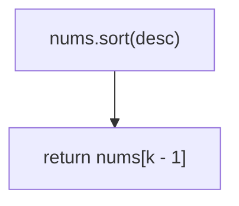
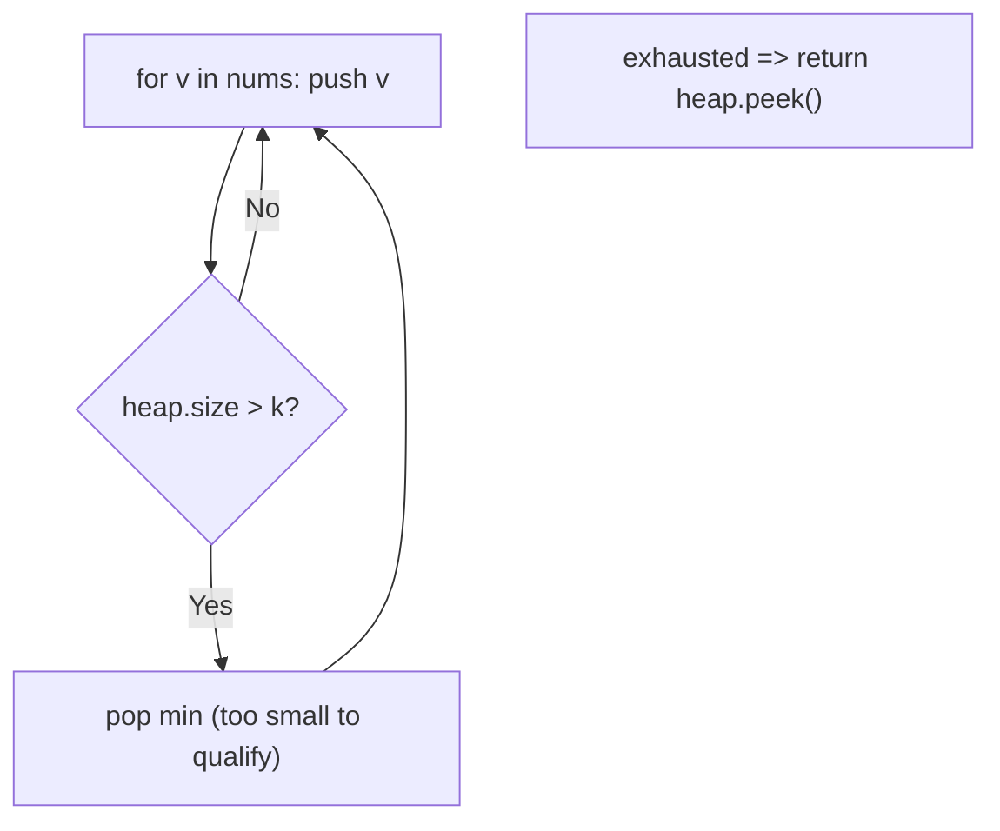

# 215. Kth Largest Element in an Array

- **LeetCode Link**: `https://leetcode.com/problems/kth-largest-element-in-an-array/`
- **Difficulty**: Medium
- **Pattern Category**: Heap / Top-K Selection
- **Prerequisite Primer**: `00-foundations/02-data-structure-polyfills.md`

---

## 1. Problem Overview & Edge Case Matrix

### Problem Statement
Given an integer array `nums` and an integer `k`, return the `k`-th largest element in the array. Note that it is the `k`-th largest element in sorted order, not the `k`-th distinct element. The solution must run in $O(N)$ average time.

```
Example 1:
Input: nums = [3,2,1,5,6,4], k = 2
Output: 5

Example 2:
Input: nums = [3,2,3,1,2,4,5,5,6], k = 4
Output: 4
```

### Visual Problem Representation
```
sorted:  [1, 2, 3, 4, 5, 6]      k = 2 -> 5 (2nd from the right)
                                     k = 1 -> max; k = n -> min
```

### Upfront Edge Case Matrix
| Edge Case Category | Specific Input Scenario | Expected Behavior | Pitfall / Risk |
| :--- | :--- | :--- | :--- |
| Single Element | `[1]`, `k = 1` | Return `1` | Partition bounds on length 1 |
| Extremes | `k = 1` / `k = n` | Max / min | Heap size-1 shortcut bugs |
| Duplicates | `[3,2,3,1,2,4,5,5,6]`, `k = 4` | Return `4` (not distinct) | Dedup logic that must NOT exist |
| All identical | `[2,2,2]`, `k = 2` | Return `2` | Partition infinite loop on equals |
| Already sorted | Ascending / descending | Correct in any time | QuickSelect worst-case pivot (mitigate randomly) |

---

## 2. Level 1: Brute Force Approach

### Intuition & Visual Idea
Sort descending (or ascending and index from the end) and read position `k - 1`. One line of thought — $O(N \log N)$, double the needed work, and it mutates the input.



### Pseudocode
```text
FUNCTION findKthLargestBruteForce(nums, k):
    nums.SORT_DESCENDING()
    RETURN nums[k - 1]
```

### Step-by-Step Dry Run (Visual Trace)
| Step | Iteration / Pointer ($i, j$) | Current Value | State / Sub-array | Action Taken |
| :--- | :--- | :--- | :--- | :--- |
| 0 | sort desc | `[6,5,4,3,2,1]` | Full $O(N \log N)$ sort | Order |
| 1 | index `k-1 = 1` | `5` | — | Return `5` |

### Modern JavaScript Implementation
```javascript
/**
 * Level 1: Brute Force (full sort + index)
 * Time Complexity:  O(N log N) — violates the O(N)-average requirement
 * Space Complexity: O(1) or O(N) — depending on engine sort internals
 */
function findKthLargestBruteForce(nums, k) {
  // Numeric comparator mandatory: default sort is lexicographic.
  // NOTE: sorts in place (mutates the caller's array).
  nums.sort((a, b) => b - a);
  return nums[k - 1]; // 1-indexed k
}
```

### Complexity Breakdown
- **Time Complexity**: $O(N \log N)$ — total order for a single rank query.
- **Space Complexity**: $O(1)$ auxiliary (V8 TimSort may allocate internally).

---

## 3. Level 2: Optimized Approach

### Intuition & Visual Bottleneck Elimination
Keep a min-heap of exactly $k$ elements: the heap top is always the k-th largest seen so far. Each new value pushes then pops the minimum — $O(N \log k)$ time, $O(k)$ space, no full sort, and the input is never mutated.



### Pseudocode
```text
FUNCTION findKthLargestHeap(nums, k):
    heap = EMPTY MIN-HEAP
    FOR v IN nums:
        heap.PUSH(v)
        IF heap.SIZE > k: heap.POP()
    RETURN heap.PEEK()
```

### Step-by-Step Dry Run (Visual Trace)
| Step | Pointers / Window | Hash Map / Auxiliary State | Decision Logic | Output Accumulator |
| :--- | :--- | :--- | :--- | :--- |
| 0 | values `3, 2` | heap `[2,3]` (min on top) | Size `2 = k`, hold | — |
| 1 | value `1` | push → pop min `1` | Too small, evicted | heap `[2,3]` |
| 2 | value `5` | push → pop min `2` | `2` evicted | heap `[3,5]` |
| 3 | values `6, 4` | evict `3`, then `4` | Qualifiers only | heap `[5,6]`, peek `5` |

### Modern JavaScript Implementation
```javascript
/**
 * Minimal binary min-heap (the JS stdlib has none — whiteboard it in 90s).
 * Supports push / pop / peek in O(log N) with a 0-based array.
 */
class MinHeap {
  constructor() {
    this.h = [];
  }

  get size() {
    return this.h.length;
  }

  peek() {
    return this.h[0];
  }

  push(v) {
    const h = this.h;
    h.push(v);
    // Sift up: swap with the parent while smaller.
    let i = h.length - 1;
    while (i > 0) {
      const p = (i - 1) >> 1;
      if (h[p] <= h[i]) break;
      [h[p], h[i]] = [h[i], h[p]];
      i = p;
    }
  }

  pop() {
    const h = this.h;
    const top = h[0];
    const last = h.pop();
    if (h.length > 0) {
      h[0] = last;
      // Sift down: swap with the smaller child while bigger.
      let i = 0;
      for (;;) {
        const l = 2 * i + 1;
        const r = 2 * i + 2;
        let s = i;
        if (l < h.length && h[l] < h[s]) s = l;
        if (r < h.length && h[r] < h[s]) s = r;
        if (s === i) break;
        [h[s], h[i]] = [h[i], h[s]];
        i = s;
      }
    }
    return top;
  }
}

/**
 * Level 2: Optimized (size-k min-heap)
 * Time Complexity:  O(N log k) — one heap op per element
 * Space Complexity: O(k) — heap holds k qualifiers
 */
function findKthLargestHeap(nums, k) {
  const heap = new MinHeap();
  for (const v of nums) {
    heap.push(v);
    // More than k candidates: the smallest cannot be the answer.
    if (heap.size > k) heap.pop();
  }
  return heap.peek(); // min of the top-k = k-th largest overall
}
```

### Complexity Breakdown
- **Time Complexity**: $O(N \log k)$ — each element costs one bounded heap operation.
- **Space Complexity**: $O(k)$ — heap plus the reusable `MinHeap` (~30 lines, zero dependencies).

---

## 4. Level 3: Most Optimal / Canonical Approach

### Intuition & Mathematical / Invariant Proof
QuickSelect: the k-th largest is the `(n-k)`-th smallest — partition around a pivot (Lomuto) and recurse only into the side containing the target index. Average $O(N)$ (geometric series $N + N/2 + …$), $O(1)$ space, in-place. Invariant: after partitioning `[lo, hi]` at `p`, everything left of `p` is `≤ nums[p]` — so the target is found, left, or right with certainty.

```
[3,2,1,5,6,4], k=2 -> target idx 4: partition (pivot 4) => [3,2,1,4,6,5], p=3
  3 < 4 -> search [4,5]: partition (pivot 5) => [5,6], p=4 == target -> 5
```

### Pseudocode
```text
FUNCTION findKthLargest(nums, k):
    target = nums.LENGTH - k   // rank as k-th SMALLEST (0-based)
    lo = 0; hi = nums.LENGTH - 1
    LOOP:
        p = LOMUTO-PARTITION(nums, lo, hi)
        IF p == target: RETURN nums[p]
        IF p < target: lo = p + 1
        ELSE: hi = p - 1
```

### Step-by-Step Dry Run (Visual Trace)
| Step | Pointer $L$ | Pointer $R$ | Invariant Checked | In-Place State |
| :--- | :--- | :--- | :--- | :--- |
| 1 | `[0,5]`, pivot `4` | partition | `p = 3`, left `≤ 4` | `[3,2,1,4,6,5]` |
| 2 | target `4 > 3` | search right | `lo = 4` | Fence `[4,5]` |
| 3 | `[4,5]`, pivot `5` | partition | `p = 4 == target` | Return `nums[4] = 5` |

### Modern JavaScript Implementation
```javascript
/**
 * Level 3: Most Optimal / Canonical (iterative QuickSelect)
 * Time Complexity:  O(N) average — O(N²) adversarial (randomize pivot at scale)
 * Space Complexity: O(1) auxiliary — in-place partitioning
 */
// MinHeap shared from Level 2 (unused here; QuickSelect needs no heap).
function findKthLargest(nums, k) {
  // Rank conversion: k-th largest = (n-k)-th smallest, 0-based.
  const target = nums.length - k;
  // Lomuto partition over [lo, hi]; returns the pivot's final index.
  function partition(lo, hi) {
    const pivot = nums[hi];
    let i = lo;
    for (let j = lo; j < hi; j++) {
      if (nums[j] <= pivot) {
        [nums[i], nums[j]] = [nums[j], nums[i]];
        i++;
      }
    }
    [nums[i], nums[hi]] = [nums[hi], nums[i]];
    return i;
  }
  let lo = 0;
  let hi = nums.length - 1;
  for (;;) {
    const p = partition(lo, hi);
    if (p === target) return nums[p];
    // Target is strictly on one side: the other half is never touched.
    if (p < target) lo = p + 1;
    else hi = p - 1;
  }
}
```

### Complexity Breakdown
- **Time Complexity**: $O(N)$ average — optimal; each round discards a constant fraction in expectation.
- **Space Complexity**: $O(1)$ auxiliary — in-place; the input IS rearranged (document it).

---

## 5. JavaScript-Specific Gotchas & V8 Optimizations
- **GC Pressure**: Avoid allocating objects inside tight loops ($O(N)$ closures). Level 3 allocates nothing per round — never `slice` partitions per iteration (that pattern rebuilds QuickSelect into $O(N \log N)$ copying).
- **Type Coercion / Sorting**: `nums.sort()` without `(a, b) => b - a` sorts lexicographically (`[10, 9]` → `[10, 9]` "correct" but `[9, 10, 2]` → `[10, 2, 9]`) — the #1 JS-specific trap in this problem.
- **Index Bounds**: Lomuto's `<= pivot` (not `<`) groups equals left — with all-identical input every partition still shrinks the fence by one, guaranteeing termination; `<` risks a zero-shrink loop on duplicates.

---

## 6. Real-World MAANG Interview Follow-Ups & Extensions

### Follow-Up 1: Kth largest in a stream (data-stream statistics)
- **Scenario**: Values arrive forever; report the k-th largest at any time.
- **Solution Strategy**: Level 2's heap IS the streaming answer — persistent size-$k$ min-heap, $O(\log k)$ per arrival, peek on demand. QuickSelect cannot stream (needs the full array).
- **JS Code / Implementation Pattern**:
```javascript
class KthLargestStream {
  constructor(k, nums) {
    this.k = k;
    this.heap = new MinHeap();
    for (const v of nums) this.add(v);
  }

  add(val) {
    this.heap.push(val);
    if (this.heap.size > this.k) this.heap.pop();
    return this.heap.peek();
  }
}
```

### Follow-Up 2: Worst-case $O(N)$ selection (median-of-medians)
- **Scenario**: Adversarial input defeats random pivots; hard $O(N)$ required.
- **Solution Strategy**: Median-of-medians pivot choice (groups of 5) guarantees a constant-fraction discard per round — $O(N)$ worst case at a steep constant; virtually never implemented live, but name it to show depth.
- **JS Code / Implementation Pattern**:
```javascript
function medianOfMediansPivot(nums, lo, hi) {
  // groups of 5 -> medians -> recursive median: pivot discards >= 30% each round
  return selectPivot(nums, lo, hi);
}
```

### Follow-Up 3: $10^9$-element distributed top-K
- **Scenario & In-Depth Solution**: Data shards across machines; shipping everything is infeasible. Each shard runs Level 2 locally (its top-$k$), ships $k$ values; the coordinator merges $S·k$ candidates with one more heap pass. Total shipped $O(S·k)$, exact answer — the standard distributed top-K pattern.
```javascript
async function distributedKthLargest(shards, k) {
  const candidates = await Promise.all(shards.map((s) => s.topK(k)));
  return findKthLargest(candidates.flat(), k);
}
```
